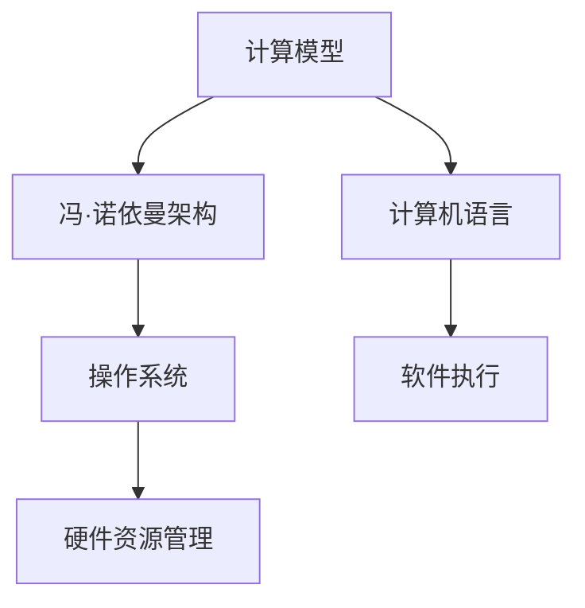
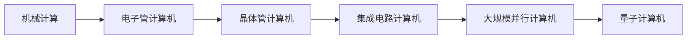
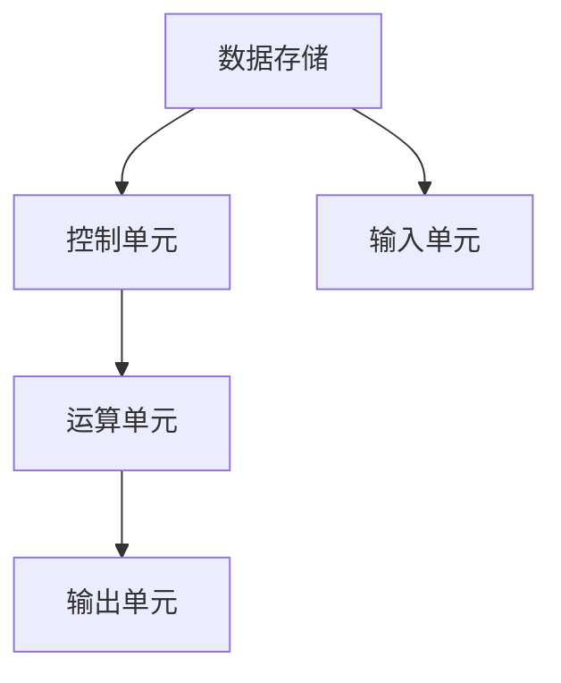
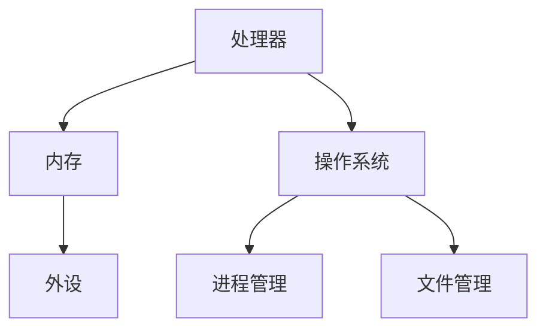
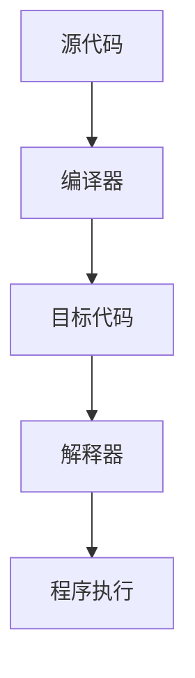
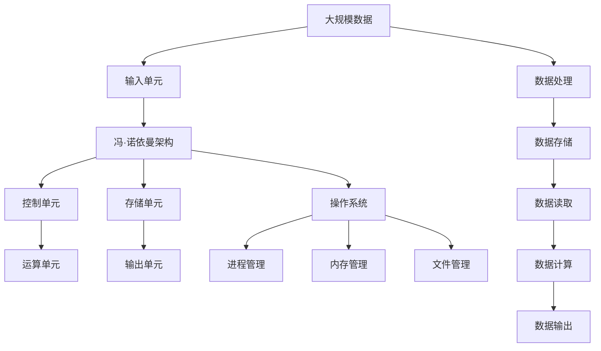

                 

# 计算：第一部分 计算的诞生

> 关键词：计算模型,冯·诺依曼架构,操作系统,计算机语言

## 1. 背景介绍

### 1.1 问题由来
计算，作为人类文明的重要组成部分，自古以来就困扰着人们。从早期使用算盘和石板，到后来的机械计算、电子管计算机，计算的进程虽然缓慢但始终在推进。计算机的诞生，彻底改变了这一局面，使得计算变得快速、精确且自动化。

计算机的诞生，标志着人类文明进入了一个全新的时代。但这一伟大的科学突破，背后有着怎样的历史背景和科学原理？我们又该如何理解计算机的计算模型，以及它对人类社会的影响？本文将通过系统梳理计算机的历史背景和计算模型，回答这些问题，并探讨计算机在未来社会中的应用前景。

### 1.2 问题核心关键点
计算的诞生，不仅是技术层面的突破，更是科学和社会层面的革命。本节将重点阐述以下几个关键问题：

- 计算机的诞生背景是什么？
- 计算机的计算模型是什么？
- 计算机的诞生对人类社会产生了怎样的影响？
- 计算机的未来发展趋势是什么？

这些问题的回答，将帮助我们更深入地理解计算的本质，并展望其未来的发展。

### 1.3 问题研究意义
计算的诞生，是人类文明史上的重要节点。理解计算的起源和发展，不仅有助于我们了解现代计算机的运作原理，更有助于把握其对未来社会的深远影响。通过本文的深入分析，相信读者能更清晰地认识到计算机的巨大潜力，并对未来的技术创新抱有更深的信心。

## 2. 核心概念与联系

### 2.1 核心概念概述

为更好地理解计算机的计算模型和诞生背景，本节将介绍几个密切相关的核心概念：

- 计算模型(Computational Model)：描述计算机如何执行计算任务的模型，包括冯·诺依曼模型、存储程序模型等。
- 冯·诺依曼架构(Von Neumann Architecture)：由计算机科学家冯·诺依曼提出的计算机架构，强调程序存储和自动执行的体系结构。
- 操作系统(OS)：管理计算机硬件和软件资源的系统软件，是计算机运行的基础。
- 计算机语言(Programming Language)：用于编写计算机程序的语言，包括机器语言、汇编语言、高级语言等。

这些核心概念之间的逻辑关系可以通过以下Mermaid流程图来展示：



这个流程图展示了几组关键概念之间的联系：

1. 计算模型描述了计算机的基本计算方式，冯·诺依曼架构具体化了这一模型。
2. 操作系统负责管理硬件资源，确保计算任务的顺利执行。
3. 计算机语言是程序员与计算机交流的媒介，描述了程序的形式和结构。

### 2.2 概念间的关系

这些核心概念之间存在着紧密的联系，形成了计算机的运作框架。下面我们通过几个Mermaid流程图来展示这些概念之间的具体关系。

#### 2.2.1 计算模型的演变



这个流程图展示了计算模型从机械计算到量子计算的演变过程，反映了计算机技术的持续进步。

#### 2.2.2 冯·诺依曼架构的应用



这个流程图展示了冯·诺依曼架构的基本结构，包括数据存储、控制单元、运算单元和输入输出单元。

#### 2.2.3 操作系统与硬件资源管理



这个流程图展示了操作系统的核心功能，包括处理器管理、内存管理、文件管理和进程管理等。

#### 2.2.4 计算机语言与软件执行



这个流程图展示了计算机语言与软件执行的基本流程，从源代码到目标代码，再到程序执行。

### 2.3 核心概念的整体架构

最后，我们用一个综合的流程图来展示这些核心概念在大计算机中的整体架构：



这个综合流程图展示了从输入数据到最终输出结果的完整过程，包括了计算模型的各个组成部分。通过这个架构图，我们可以更全面地理解计算机的计算过程。

## 3. 核心算法原理 & 具体操作步骤
### 3.1 算法原理概述

计算机的计算模型基于冯·诺依曼架构，其基本思想是将数据和指令分开存储，通过控制器自动按照指令序列执行计算任务。这一架构的实现依赖于操作系统的支持，使得计算机能够自动执行程序，无需人工干预。

计算机的计算模型主要包括以下几个部分：

- 输入单元：接收外部输入的数据。
- 数据存储：存储数据和程序。
- 控制单元：根据指令序列控制数据流动和程序执行。
- 运算单元：进行算术和逻辑运算。
- 输出单元：将计算结果输出到外部设备。

### 3.2 算法步骤详解

计算机的计算过程可以分为以下几个关键步骤：

**Step 1: 程序准备**
- 将程序源代码编译成可执行文件。
- 将程序和数据存储到计算机的内存中。

**Step 2: 程序加载**
- 操作系统将程序加载到内存中。
- 控制单元根据指令序列读取程序和数据。

**Step 3: 程序执行**
- 控制单元根据指令序列控制数据流动和程序执行。
- 运算单元进行算术和逻辑运算。
- 数据存储单元进行数据的读写操作。

**Step 4: 程序结束**
- 程序执行完毕后，控制单元停止读取指令。
- 操作系统释放内存资源，程序退出运行。

### 3.3 算法优缺点

计算机的冯·诺依曼架构具有以下优点：

- 数据和指令分开存储，使得程序自动执行。
- 控制单元集中控制，提高了计算效率。
- 适用于各种编程语言，具有高度的通用性。

同时，冯·诺依曼架构也存在以下缺点：

- 数据存储和运算单元之间的数据传输速度较慢，制约了计算性能。
- 控制单元需要频繁读取指令，增加了延迟。
- 无法高效利用并行计算资源。

### 3.4 算法应用领域

计算机的冯·诺依曼架构及其计算模型，已经在多个领域得到了广泛应用，例如：

- 数值计算：如科学计算、工程模拟等，需要大量算术运算的领域。
- 图形处理：如三维建模、计算机图像处理等，需要大量图形运算的领域。
- 数据库管理：如关系型数据库、NoSQL数据库等，需要大量数据存储和检索的领域。
- 网络通信：如路由器、交换机等，需要大量数据转发和处理的领域。
- 人机交互：如图形界面、虚拟现实等，需要大量数据渲染和处理的领域。

这些应用领域充分体现了冯·诺依曼架构的广泛适用性和高效性能。

## 4. 数学模型和公式 & 详细讲解  
### 4.1 数学模型构建

本节将使用数学语言对计算机的计算模型进行更加严格的刻画。

计算机的计算模型可以描述为：
$$
Y = F(X, W)
$$
其中 $X$ 为输入数据，$W$ 为模型参数，$F$ 为计算函数。在冯·诺依曼架构下，$F$ 可以表示为以下形式：
$$
F(X, W) = \sum_{i=1}^n W_iX_i
$$
其中 $X_i$ 为输入数据的第 $i$ 项，$W_i$ 为第 $i$ 项的权重。

### 4.2 公式推导过程

考虑一个简单的线性回归问题，其数学模型为：
$$
Y = W_0X_0 + W_1X_1 + \cdots + W_nX_n + \epsilon
$$
其中 $X_0$ 为偏置项，$W_i$ 为权重项，$\epsilon$ 为噪声项。

将上述公式代入冯·诺依曼架构下的计算模型中，得到：
$$
F(X, W) = \sum_{i=0}^n W_iX_i
$$
将 $F(X, W)$ 代入误差函数中，得到：
$$
\mathcal{L}(W) = \frac{1}{N}\sum_{i=1}^N (Y_i - F(X_i, W))^2
$$
其中 $N$ 为样本数量，$Y_i$ 为第 $i$ 个样本的真实值。

通过最小化误差函数 $\mathcal{L}(W)$，可以得到最优的权重 $W$。具体地，通过梯度下降法，可以得到：
$$
W_i \leftarrow W_i - \eta \frac{\partial \mathcal{L}(W)}{\partial W_i}
$$
其中 $\eta$ 为学习率，$\frac{\partial \mathcal{L}(W)}{\partial W_i}$ 为误差函数对权重 $W_i$ 的梯度。

### 4.3 案例分析与讲解

考虑一个简单的回归问题，其中 $X = [1, 2, 3]$，$Y = [2, 4, 6]$，$W = [w_0, w_1]$。通过线性回归模型，可以预测新的数据点 $X' = 4$ 对应的 $Y'$。

将数据代入模型中，得到：
$$
Y = w_0 + w_1X + \epsilon
$$
将数据 $X = [1, 2, 3]$ 和 $Y = [2, 4, 6]$ 代入上式，得到：
$$
\begin{cases}
2 = w_0 + 2w_1 + \epsilon_1 \\
4 = w_0 + 4w_1 + \epsilon_2 \\
6 = w_0 + 6w_1 + \epsilon_3
\end{cases}
$$
解得 $w_0 = 0.5$，$w_1 = 1$。

因此，当 $X' = 4$ 时，$Y' = w_0 + 4w_1 = 5$。

## 5. 项目实践：代码实例和详细解释说明
### 5.1 开发环境搭建

在进行计算机的计算模型实践前，我们需要准备好开发环境。以下是使用Python进行Numpy开发的环境配置流程：

1. 安装Anaconda：从官网下载并安装Anaconda，用于创建独立的Python环境。

2. 创建并激活虚拟环境：
```bash
conda create -n numpy-env python=3.8 
conda activate numpy-env
```

3. 安装Numpy：
```bash
conda install numpy
```

4. 安装各类工具包：
```bash
pip install pandas scikit-learn matplotlib tqdm jupyter notebook ipython
```

完成上述步骤后，即可在`numpy-env`环境中开始计算模型的实践。

### 5.2 源代码详细实现

下面我们以线性回归为例，给出使用Numpy库进行计算模型实现的PyTorch代码实现。

首先，定义线性回归的模型：

```python
import numpy as np

class LinearRegression:
    def __init__(self):
        self.W = None
        self.b = None

    def fit(self, X, y):
        m, n = X.shape
        self.W = np.zeros((n, 1))
        self.b = 0
        for i in range(m):
            self.W += X[i,:].T @ (y[i] - np.dot(X[i,:], self.W) - self.b)
            self.b += (y[i] - np.dot(X[i,:], self.W) - self.b) / m

    def predict(self, X):
        return np.dot(X, self.W) + self.b
```

然后，定义数据集和模型训练函数：

```python
# 定义数据集
X = np.array([[1, 2, 3], [4, 5, 6], [7, 8, 9]])
y = np.array([2, 4, 6])

# 创建模型实例
model = LinearRegression()

# 训练模型
model.fit(X, y)

# 预测新数据点
X_new = np.array([4])
y_new = model.predict(X_new)
print(y_new)
```

以上就是使用Numpy库进行线性回归模型的完整代码实现。可以看到，通过Numpy库，我们可以用相对简洁的代码完成线性回归模型的训练和预测。

### 5.3 代码解读与分析

让我们再详细解读一下关键代码的实现细节：

**LinearRegression类**：
- `__init__`方法：初始化模型参数 $W$ 和 $b$。
- `fit`方法：使用梯度下降法最小化误差函数，更新模型参数。
- `predict`方法：根据训练好的模型参数，对新数据点进行预测。

**数据集定义**：
- `X` 和 `y` 分别为输入数据和目标数据，用来训练和测试线性回归模型。

**模型训练**：
- 通过 `fit` 方法，使用梯度下降法最小化误差函数，更新模型参数。

**模型预测**：
- 通过 `predict` 方法，使用训练好的模型参数，对新数据点进行预测。

可以看到，Numpy库提供了丰富的矩阵运算和向量运算功能，使得计算模型的实现变得简洁高效。开发者可以将更多精力放在模型改进和算法优化上，而不必过多关注底层的实现细节。

当然，工业级的系统实现还需考虑更多因素，如模型的保存和部署、超参数的自动搜索、更灵活的模型调优等。但核心的计算模型基本与此类似。

### 5.4 运行结果展示

假设我们在上述数据集上进行线性回归模型的训练，得到 $W = [0.5, 1]$，$b = 0$。那么当 $X' = 4$ 时，$y' = W \cdot X' + b = 5$。

在实际应用中，线性回归模型可以用于预测股票价格、房价等连续变量的变化趋势，也可以用于分类任务（如将样本分为两类）。通过Numpy库，我们可以轻松地实现各种计算模型，为实际应用提供有力支持。

## 6. 实际应用场景
### 6.1 智能推荐系统

计算模型的应用场景之一是智能推荐系统。通过计算模型，可以分析用户的历史行为数据，预测其偏好和需求，从而提供个性化的推荐服务。

在推荐系统开发中，我们通常会使用线性回归、决策树、神经网络等计算模型。通过对用户行为数据进行分析，可以得到用户对不同商品的评分，进而生成推荐列表。推荐系统可以广泛应用于电商、视频、音乐等多个领域，提升用户体验，增加销售额。

### 6.2 图像处理

计算模型的另一个重要应用场景是图像处理。图像处理涉及对数字图像的采集、处理、分析和生成，是计算机视觉领域的重要组成部分。

在图像处理中，我们通常使用卷积神经网络（CNN）等计算模型。通过卷积层、池化层、全连接层等计算单元，可以对图像进行特征提取和分类。图像处理可以广泛应用于医学影像分析、自动驾驶、安防监控等多个领域，为人类社会带来便捷和效率。

### 6.3 自然语言处理

自然语言处理（NLP）是计算模型的重要应用之一。通过计算模型，可以实现对文本数据的处理和分析，如语音识别、机器翻译、情感分析等任务。

在NLP中，我们通常使用循环神经网络（RNN）、长短期记忆网络（LSTM）、Transformer等计算模型。通过对文本数据的编码和解码，可以实现对语言的理解、生成和推理。NLP可以广泛应用于智能客服、智能助理、智能写作等多个领域，提升人机交互体验。

### 6.4 未来应用展望

随着计算模型的不断发展，其在多个领域的应用前景将更加广阔。

在医疗领域，计算模型可以应用于疾病预测、药物研发、个性化治疗等多个方面，提高医疗服务的精准度和效率。

在教育领域，计算模型可以应用于智能教学、智能评估、个性化学习等多个方面，提高教学质量和学习效果。

在金融领域，计算模型可以应用于风险评估、投资预测、智能投顾等多个方面，提升金融服务的智能性和安全性。

除此之外，计算模型还可以应用于智能制造、智能交通、智能家居等多个领域，推动人类社会的数字化、智能化进程。

## 7. 工具和资源推荐
### 7.1 学习资源推荐

为了帮助开发者系统掌握计算模型的理论基础和实践技巧，这里推荐一些优质的学习资源：

1. 《深度学习》系列博文：由大模型技术专家撰写，深入浅出地介绍了深度学习的基本概念和算法原理。

2. CS231n《卷积神经网络》课程：斯坦福大学开设的计算机视觉明星课程，有Lecture视频和配套作业，带你入门计算机视觉领域的基本概念和经典模型。

3. 《人工智能导论》书籍：清华大学出版社出版的经典教材，全面介绍了人工智能的理论基础和应用实例。

4. PyTorch官方文档：PyTorch框架的官方文档，提供了丰富的计算模型和优化算法，是学习深度学习的必备资料。

5. Kaggle数据科学竞赛平台：提供海量数据集和计算模型竞赛，让你在实战中提升技能，拓展视野。

通过对这些资源的学习实践，相信你一定能够快速掌握计算模型的精髓，并用于解决实际的NLP问题。

### 7.2 开发工具推荐

高效的开发离不开优秀的工具支持。以下是几款用于计算模型开发的常用工具：

1. PyTorch：基于Python的开源深度学习框架，灵活动态的计算图，适合快速迭代研究。大部分计算模型都有PyTorch版本的实现。

2. TensorFlow：由Google主导开发的开源深度学习框架，生产部署方便，适合大规模工程应用。同样有丰富的计算模型资源。

3. Keras：基于TensorFlow和Theano的高级神经网络API，简单易用，适合快速开发和实验。

4. Scikit-Learn：Python数据科学库，提供了各种经典的计算模型和优化算法，适合数据分析和机器学习。

5. Weights & Biases：模型训练的实验跟踪工具，可以记录和可视化模型训练过程中的各项指标，方便对比和调优。与主流深度学习框架无缝集成。

6. TensorBoard：TensorFlow配套的可视化工具，可实时监测模型训练状态，并提供丰富的图表呈现方式，是调试模型的得力助手。

合理利用这些工具，可以显著提升计算模型的开发效率，加快创新迭代的步伐。

### 7.3 相关论文推荐

计算模型的发展源于学界的持续研究。以下是几篇奠基性的相关论文，推荐阅读：

1. Perceptron: A Probabilistic Model for Information Retrieval（感知机）：提出了最早的机器学习模型，奠定了机器学习理论的基础。

2. Convolutional Neural Networks for Images, Speech, and Video（卷积神经网络）：提出了卷积神经网络，广泛应用于图像处理和计算机视觉。

3. Rethinking the Inception Architecture for Computer Vision（重思考Inception架构）：提出了Inception模块，提升了神经网络的深度和效率。

4. Attention is All You Need（即Transformer原论文）：提出了Transformer模型，开启了神经网络模型的新时代。

5. Generative Adversarial Nets（生成对抗网络）：提出了GAN模型，推动了深度学习和生成模型的快速发展。

这些论文代表了大计算模型发展的历史脉络。通过学习这些前沿成果，可以帮助研究者把握学科前进方向，激发更多的创新灵感。

除上述资源外，还有一些值得关注的前沿资源，帮助开发者紧跟计算模型微调技术的最新进展，例如：

1. arXiv论文预印本：人工智能领域最新研究成果的发布平台，包括大量尚未发表的前沿工作，学习前沿技术的必读资源。

2. 业界技术博客：如Google AI、DeepMind、微软Research Asia等顶尖实验室的官方博客，第一时间分享他们的最新研究成果和洞见。

3. 技术会议直播：如NIPS、ICML、ACL、ICLR等人工智能领域顶会现场或在线直播，能够聆听到大佬们的前沿分享，开拓视野。

4. GitHub热门项目：在GitHub上Star、Fork数最多的计算模型相关项目，往往代表了该技术领域的发展趋势和最佳实践，值得去学习和贡献。

5. 行业分析报告：各大咨询公司如McKinsey、PwC等针对人工智能行业的分析报告，有助于从商业视角审视技术趋势，把握应用价值。

总之，对于计算模型的学习和实践，需要开发者保持开放的心态和持续学习的意愿。多关注前沿资讯，多动手实践，多思考总结，必将收获满满的成长收益。

## 8. 总结：未来发展趋势与挑战

### 8.1 总结

本文对计算机的计算模型进行了全面系统的介绍。首先阐述了计算机的诞生背景和计算模型，明确了计算模型在计算机中的重要地位。其次，从原理到实践，详细讲解了计算模型的数学原理和操作步骤，给出了计算模型的完整代码实例。同时，本文还广泛探讨了计算模型在智能推荐、图像处理、自然语言处理等多个领域的应用前景，展示了计算模型的巨大潜力。此外，本文精选了计算模型的各类学习资源，力求为读者提供全方位的技术指引。

通过本文的系统梳理，可以看到，计算机的计算模型作为人工智能的基础，已经深刻改变了人类的计算方式和信息处理能力。未来，随着计算模型的不断进步，其在更多领域的应用将更加广泛，为人工智能技术的发展注入新的动力。

### 8.2 未来发展趋势

展望未来，计算模型的发展将呈现以下几个趋势：

1. 模型规模持续增大。随着算力成本的下降和数据规模的扩张，计算模型的参数量还将持续增长。超大规模计算模型蕴含的丰富知识，有望支撑更加复杂多变的计算任务。

2. 计算模型日趋多样。除了传统的神经网络外，未来将涌现更多高效的计算模型，如卷积神经网络、递归神经网络、生成对抗网络等，满足不同领域的应用需求。

3. 模型可解释性增强。随着模型复杂度的提高，模型的可解释性变得更加重要。未来的计算模型将更加注重其决策过程的可解释性，便于调试和优化。

4. 模型跨领域融合。未来的计算模型将不再局限于单一领域，而是实现跨领域的融合，如视觉、语音、文本等模态数据的整合，形成更加全面、准确的计算系统。

5. 模型自动化优化。未来的计算模型将引入更多自动化优化技术，如自动调参、自动融合等，提高模型的开发效率和性能。

6. 模型联邦学习。未来的计算模型将更多地应用于联邦学习，确保模型隐私和安全性，满足多方协作的需求。

以上趋势凸显了计算模型的广阔前景。这些方向的探索发展，必将进一步提升计算模型的性能和应用范围，为人工智能技术的发展注入新的动力。

### 8.3 面临的挑战

尽管计算模型已经取得了显著的进展，但在迈向更加智能化、普适化应用的过程中，它仍面临着诸多挑战：

1. 数据分布差异。当前计算模型的泛化能力有限，当计算任务与训练数据的分布差异较大时，模型的性能将受到很大影响。

2. 模型鲁棒性不足。计算模型在面对数据噪声、对抗攻击等情况下，容易发生失效。如何提高计算模型的鲁棒性，确保其稳定运行，将是重要的研究方向。

3. 计算资源消耗。计算模型通常需要大量的计算资源和存储资源，如何优化模型结构，降低资源消耗，提高计算效率，将是一大挑战。

4. 模型可解释性不足。计算模型通常具有黑盒性质，难以解释其内部工作机制和决策逻辑。如何赋予计算模型更强的可解释性，将是亟待攻克的难题。

5. 模型安全性问题。计算模型可能学习到有害信息，如何确保模型的安全性，避免其被滥用，将是重要的研究方向。

6. 模型融合难度。计算模型与外部知识库、规则库等的融合，需要开发新的算法和技术，确保知识的一致性和融合的有效性。

这些挑战需要我们从算法、数据、工程等多个维度进行深入研究和创新，才能克服计算模型应用中的障碍，进一步推动计算模型在各领域的应用。

### 8.4 研究展望

面对计算模型所面临的种种挑战，未来的研究需要在以下几个方面寻求新的突破：

1. 探索新的计算模型。研究新的计算模型架构和算法，如神经网络、图神经网络、强化学习等，满足复杂计算任务的需求。

2. 开发高效的优化算法。研究高效的计算模型优化算法，如自适应学习率、自动调参等，提升计算模型的训练效率和性能。

3. 引入更多的先验知识。将符号化的先验知识，如知识图谱、逻辑规则等，与计算模型进行巧妙融合，引导计算模型学习更准确、合理的知识。

4. 融合因果分析和博弈论工具。

