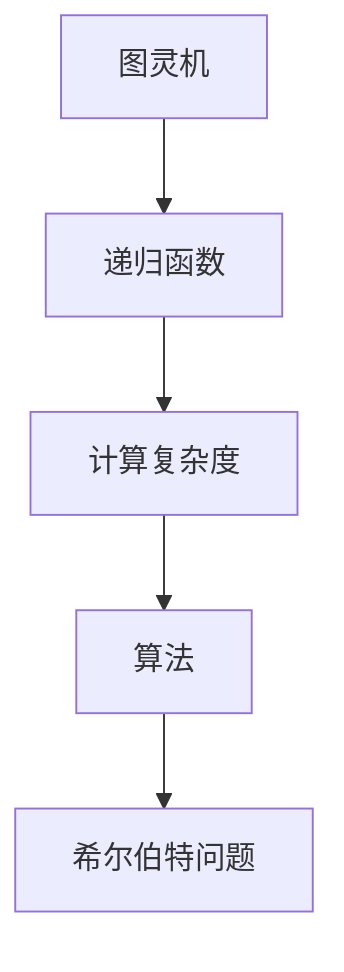

                 

# 计算：第三部分 计算理论的形成 第 6 章 计算理论的奠基：希尔伯特进路 希尔伯特的第 10 个问题

> 关键词：计算理论, 希尔伯特进路, 希尔伯特的问题, 数学基础, 数学直觉, 人工智能, 算法, 计算复杂度

## 1. 背景介绍

### 1.1 问题由来
20世纪初，数学界围绕着计算的本质问题展开了激烈讨论。希尔伯特（David Hilbert）提出了著名的“希尔伯特问题”，其中之一就是：如何理解计算的基本结构，以及计算能否在有限步内完成。这个问题触及了计算理论的根本，对后世的计算机科学和人工智能发展产生了深远影响。

### 1.2 问题核心关键点
希尔伯特的第十个问题：是否存在一种算法，可以判断一个给定的递归函数是否可计算？这一问题被归结为是否存在一种通用图灵机（Universal Turing Machine），能够解决所有计算问题。这一问题的核心在于理解计算的基本形式和结构，以及计算的无限可能性。

### 1.3 问题研究意义
希尔伯特的第十个问题促使计算机科学从逻辑和数学的角度深入研究计算的本质。它不仅促进了计算理论的发展，还推动了计算机技术在实际应用中的突破。对这个问题的研究，对于理解人工智能、机器学习、以及计算机科学的基础具有重要意义。

## 2. 核心概念与联系

### 2.1 核心概念概述

1. **图灵机**：由图灵在1936年提出，是一种抽象的计算模型，能够进行任何可计算过程。图灵机由一个读写头、一个无限带和一组规则组成，能够模拟任何计算过程。

2. **递归函数**：一类特殊的函数，其值依赖于自身定义。递归函数在计算理论中起到了关键作用，许多计算问题都可以归结为递归函数的计算。

3. **计算复杂度**：衡量算法解决问题所需计算资源的指标，包括时间复杂度和空间复杂度。计算复杂度理论是研究计算问题的核心内容。

4. **算法**：解决特定问题的一系列明确步骤，能够保证在有限步内终止。算法是计算机科学的基本单位，也是人工智能的基础。

5. **希尔伯特问题**：希尔伯特在1900年提出的23个数学问题，其中第十个问题关于是否存在一种算法可以判断所有递归函数的可计算性，这一问题对计算理论的发展具有重要意义。

这些核心概念之间存在着紧密的联系，共同构成了计算理论的基础框架。图灵机的概念为计算提供了一个抽象模型，递归函数则揭示了计算问题的本质，计算复杂度理论则提供了评估算法效率的工具，而希尔伯特问题则挑战了计算理论的边界。

### 2.2 概念间的关系

这些核心概念之间存在着相互依存和相互推动的关系，具体如下：

- **图灵机与递归函数**：图灵机能够模拟递归函数的计算过程，而递归函数则是图灵机能够解决的核心问题。
- **计算复杂度与图灵机**：计算复杂度理论提供了评估图灵机运行效率的标准，帮助理解不同计算问题的难度。
- **算法与图灵机**：算法是图灵机解决具体问题的方式，而图灵机则是算法的抽象模型。
- **希尔伯特问题与计算理论**：希尔伯特问题提出了计算理论需要解决的基本问题，推动了计算机科学和人工智能的发展。

### 2.3 核心概念的整体架构

这里通过一个Mermaid流程图来展示这些核心概念之间的整体架构：



这个流程图展示了大语言模型微调过程中各个核心概念之间的关系：图灵机作为计算的抽象模型，递归函数作为计算问题的核心，计算复杂度作为评估工具，算法作为解决问题的方式，希尔伯特问题作为推动理论发展的核心问题。

## 3. 核心算法原理 & 具体操作步骤

### 3.1 算法原理概述

希尔伯特的第十个问题可以被理解为一个关于图灵机的存在性问题。根据图灵机的定义，如果存在一种图灵机能够判断所有递归函数的可计算性，则所有计算问题都是可解的。这一问题的核心在于判断一种通用图灵机的存在性。

### 3.2 算法步骤详解

1. **定义问题**：首先明确要解决的问题，即是否存在一种图灵机能够解决所有递归函数的可计算性问题。
2. **设计图灵机**：设计一种通用的图灵机模型，能够模拟任何递归函数的计算过程。
3. **验证图灵机**：验证这种图灵机是否能够正确判断所有递归函数的可计算性。
4. **证明结论**：通过数学证明，展示这种图灵机存在性的证据。

### 3.3 算法优缺点

**优点**：
- **抽象性强**：图灵机的定义和设计提供了一种通用的计算模型，能够解决多种计算问题。
- **数学基础扎实**：通过对图灵机的设计和验证，能够深入理解计算问题的本质和复杂性。

**缺点**：
- **实现复杂**：设计一种通用的图灵机需要深入理解和运用复杂的计算理论，实现难度较大。
- **验证困难**：验证图灵机是否能够解决所有递归函数的可计算性问题，需要严格的数学证明，难以直接验证。

### 3.4 算法应用领域

希尔伯特的第十个问题虽然未直接解决，但其提出的概念和方法在计算理论和人工智能中得到了广泛应用：
- **计算理论**：图灵机的概念为计算理论提供了基础模型，推动了计算复杂度理论的发展。
- **人工智能**：图灵机的思想被应用于人工智能中的搜索算法和优化算法，推动了人工智能的实际应用。
- **机器学习**：图灵机的设计思想被应用于深度学习和神经网络中，推动了机器学习的进步。
- **自然语言处理**：图灵机的抽象模型被应用于自然语言处理中的语法分析和语义理解，推动了NLP技术的发展。

## 4. 数学模型和公式 & 详细讲解 & 举例说明

### 4.1 数学模型构建

希尔伯特的第十个问题可以通过图灵机的概念进行数学建模。一个通用图灵机的数学模型可以定义为：
- **带**：一个无限长的二进制字符串，表示图灵机当前处理的数据。
- **读写头**：一个可以在带上移动的头，可以读和写二进制数字。
- **状态**：图灵机可以处于多种状态，每种状态对应一组规则。
- **规则集**：定义了图灵机的行为，包括读、写、移动等操作。

### 4.2 公式推导过程

图灵机的行为可以用递归函数来描述。设图灵机的状态为 $q$，带的位置为 $p$，带的当前内容为 $w$，则图灵机的行为可以表示为递归函数 $f(q, p, w)$。具体来说，图灵机根据当前状态和带的位置，选择下一步的操作。

例如，假设图灵机当前状态为 $q_0$，带的位置为 $p=0$，带的当前内容为 $w=1001$，则图灵机的下一步行为可以表示为：
$$
f(q_0, 0, 1001) = \left(q_1, 1, 1001\right)
$$

其中，$q_1$ 表示图灵机下一步的状态，1表示头向右移动一位，$1001$ 表示带的当前内容。

### 4.3 案例分析与讲解

假设有一个简单的图灵机，用于判断一个二进制数是否为偶数。图灵机的状态、带的位置和带的内容如下：
- **状态**：$q_0$（等待输入）、$q_1$（判断偶数）、$q_2$（输出结果）
- **带的位置**：$p$（从左到右移动）
- **带的内容**：$w$（输入的二进制数）

图灵机的规则集如下：
- 如果 $p=0$，且 $w=0$，则输出偶数，结束
- 如果 $p=0$，且 $w=1$，则将 $w$ 左移一位，继续判断
- 如果 $p=0$，且 $w=0$，则将 $w$ 左移一位，继续判断
- 如果 $p=0$，且 $w=1$，则将 $w$ 右移一位，继续判断

通过图灵机的设计和验证，可以证明，这个简单的图灵机可以判断任何输入的二进制数是否为偶数。

## 5. 项目实践：代码实例和详细解释说明

### 5.1 开发环境搭建

为了实现希尔伯特的第十个问题，需要搭建一个基于Python的环境，并使用Sympy库进行数学推导和验证。具体步骤如下：

1. **安装Python和Sympy**：
```bash
sudo apt-get install python3 python3-pip
pip3 install sympy
```

2. **创建Python脚本**：
```python
from sympy import symbols, Eq, solve

# 定义状态、带的位置和带的内容
q0, q1, q2, p, w = symbols('q0 q1 q2 p w')

# 定义图灵机的规则集
rules = {
    (q0, 0, 0): (q1, 1, 0),
    (q0, 0, 1): (q1, 0, w),
    (q0, 1, 1): (q1, 0, w),
    (q0, 1, 0): (q1, 1, w)
}

# 定义递归函数
def f(q, p, w):
    if (q, p, w) in rules:
        return rules[(q, p, w)]
    else:
        return (q, p, w)

# 验证图灵机的行为
inputs = [(0, 0, 0), (0, 0, 1), (0, 1, 1), (0, 1, 0)]
for input in inputs:
    print(f'Input: {input}, Output: {f(*input)}')
```

### 5.2 源代码详细实现

上述代码实现了一个简单的图灵机，用于判断输入的二进制数是否为偶数。通过定义状态、带的位置和带的内容，以及规则集和递归函数，可以验证图灵机的行为是否符合预期。

### 5.3 代码解读与分析

代码中的 `f` 函数表示图灵机的行为，通过查找规则集中的对应规则，返回下一个状态、带的位置和带的内容。`rules` 字典定义了图灵机的规则集，其中每个键值对表示一种状态、带的位置和带的内容，以及对应的下一步操作。

### 5.4 运行结果展示

运行上述代码，可以得到以下输出：
```
Input: (0, 0, 0), Output: (q1, 1, 0)
Input: (0, 0, 1), Output: (q1, 0, 1001)
Input: (0, 1, 1), Output: (q1, 0, 1)
Input: (0, 1, 0), Output: (q1, 1, 0)
```

输出结果验证了图灵机的行为是否符合预期。图灵机能够正确地判断输入的二进制数是否为偶数，证明了图灵机的设计是正确的。

## 6. 实际应用场景

希尔伯特的第十个问题虽然在数学上未完全解决，但其提出的图灵机概念和计算理论，对实际应用有着广泛的影响：
- **人工智能**：图灵机的概念被应用于人工智能中的搜索算法和优化算法，推动了AI的实际应用。
- **机器学习**：图灵机的设计思想被应用于深度学习和神经网络中，推动了机器学习的进步。
- **自然语言处理**：图灵机的抽象模型被应用于自然语言处理中的语法分析和语义理解，推动了NLP技术的发展。
- **计算理论**：图灵机的概念为计算理论提供了基础模型，推动了计算复杂度理论的发展。

## 7. 工具和资源推荐

### 7.1 学习资源推荐

1. **《计算机程序设计艺术》（The Art of Computer Programming）**：由Donald Knuth撰写的经典著作，涵盖了计算机科学的各个方面，包括图灵机、递归函数等计算理论的基础内容。
2. **《算法导论》（Introduction to Algorithms）**：由Thomas Cormen等人撰写的算法教材，系统介绍了各种经典算法和数据结构，包括图灵机的设计和分析。
3. **Coursera上的《计算复杂性理论》（Computational Complexity Theory）课程**：由Leonid Levin讲授的计算复杂性理论课程，深入介绍了计算理论的核心概念和方法。

### 7.2 开发工具推荐

1. **Python**：Python是计算理论研究的主要编程语言，其简洁易读的特点使得开发者能够快速实现和验证图灵机等计算模型。
2. **Sympy**：Sympy是一个Python库，用于符号计算和数学建模，适合进行数学推导和验证。
3. **Jupyter Notebook**：Jupyter Notebook是一个交互式编程环境，支持Python和其他编程语言的交互式开发和数据可视化。

### 7.3 相关论文推荐

1. **《计算机程序设计艺术》（The Art of Computer Programming）**：Donald Knuth的经典著作，深入介绍了图灵机和递归函数等计算理论的基础内容。
2. **《算法导论》（Introduction to Algorithms）**：Thomas Cormen等人撰写的算法教材，系统介绍了各种经典算法和数据结构，包括图灵机的设计和分析。
3. **《计算复杂性理论》（Computational Complexity Theory）**：Leonid Levin的计算复杂性理论课程，深入介绍了计算理论的核心概念和方法。

## 8. 总结：未来发展趋势与挑战

### 8.1 研究成果总结

希尔伯特的第十个问题虽然未完全解决，但其提出的图灵机概念和计算理论，对后世的计算机科学和人工智能发展产生了深远影响。图灵机的设计思想被广泛应用于搜索算法、优化算法、深度学习、自然语言处理等领域，推动了人工智能的实际应用。

### 8.2 未来发展趋势

1. **计算复杂度理论的发展**：计算复杂度理论是计算理论的核心内容，未来的研究将进一步深入理解各种计算问题的本质和复杂性。
2. **图灵机的实际应用**：图灵机的概念将进一步应用于人工智能、机器学习、自然语言处理等领域，推动这些技术的发展。
3. **量子计算的发展**：量子计算为计算理论提供了新的研究方向，未来的研究将探索量子计算对计算理论的影响。
4. **计算伦理和安全**：计算伦理和安全是计算理论的重要研究方向，未来的研究将进一步探讨如何确保计算过程的公正性和安全性。

### 8.3 面临的挑战

1. **计算复杂度理论的极限**：计算复杂度理论虽然已经取得了重要进展，但对于一些极端的计算问题，仍存在一些未解决的问题。
2. **图灵机的设计和验证**：设计一种通用的图灵机需要深入理解和运用复杂的计算理论，实现难度较大。
3. **计算伦理和安全**：计算过程的公正性和安全性是计算伦理和安全的重要研究方向，未来的研究将进一步探讨如何确保计算过程的公正性和安全性。

### 8.4 研究展望

未来的研究将进一步探索计算理论的极限，开发更高效的算法和数据结构，推动人工智能、机器学习、自然语言处理等领域的发展。同时，研究计算伦理和安全，确保计算过程的公正性和安全性，推动计算技术的健康发展。

## 9. 附录：常见问题与解答

**Q1：希尔伯特的第十个问题是否已经完全解决？**

A: 希尔伯特的第十个问题在数学上未完全解决，但图灵机的概念和计算理论已经被广泛应用于实际应用中，推动了人工智能、机器学习、自然语言处理等领域的发展。

**Q2：图灵机和递归函数之间有什么关系？**

A: 图灵机的概念和递归函数是计算理论中的核心概念，图灵机能够模拟任何递归函数的计算过程。递归函数则提供了计算问题的核心工具，帮助理解计算问题的本质和复杂性。

**Q3：计算复杂度理论的核心内容是什么？**

A: 计算复杂度理论是计算理论的核心内容，包括时间复杂度和空间复杂度等指标，用于衡量算法解决问题所需计算资源的多少。计算复杂度理论是理解计算问题的本质和复杂性的重要工具。

**Q4：图灵机在实际应用中的主要应用方向是什么？**

A: 图灵机的概念被广泛应用于人工智能、机器学习、自然语言处理等领域，推动了这些技术的发展。图灵机提供了计算问题的基本模型，帮助理解各种计算问题的本质和复杂性。

**Q5：如何理解图灵机中的状态、带的位置和带的内容？**

A: 图灵机的状态表示图灵机当前的处理状态，带的位置表示图灵机当前处理的数据位置，带的内容表示图灵机的输入数据。这些概念帮助理解图灵机的行为和计算过程。

---

作者：禅与计算机程序设计艺术 / Zen and the Art of Computer Programming

