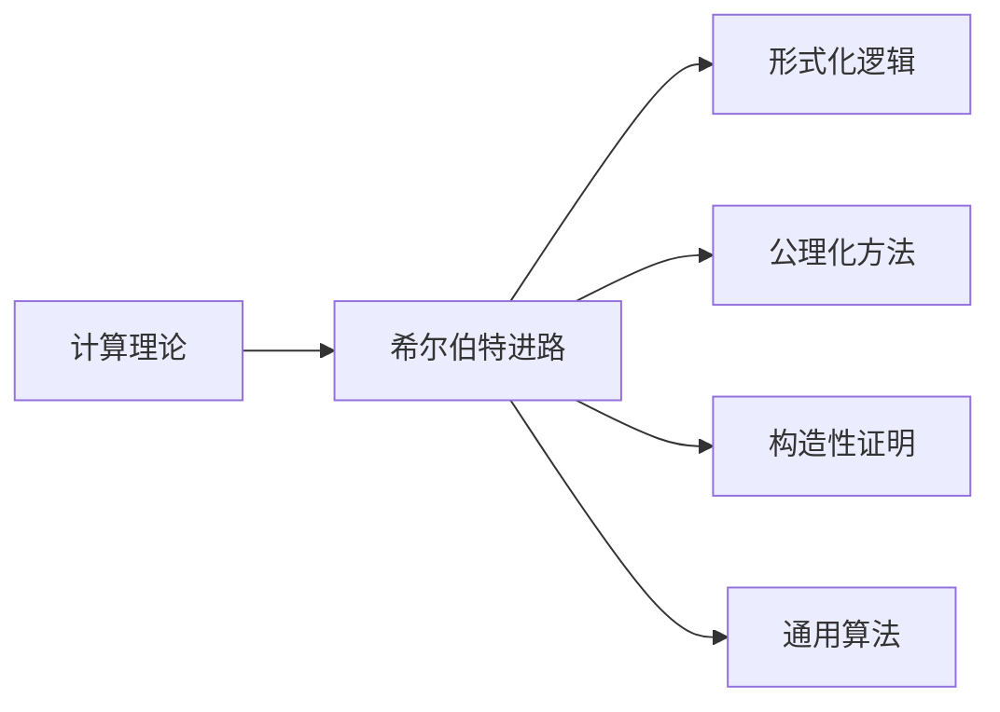

                 

# 计算：第三部分 计算理论的形成 第 6 章 计算理论的奠基：希尔伯特进路 王者的落幕

## 1. 背景介绍

### 1.1 问题由来
数学是计算机科学的基础，而计算理论则是计算机科学的灵魂。本章将探讨计算理论的奠基——希尔伯特进路（Hilbert's program）及其局限性，解释为什么希尔伯特进路失败，并展望未来计算理论的发展方向。

### 1.2 问题核心关键点
希尔伯特进路是20世纪初著名数学家大卫·希尔伯特提出的一个宏大计划，旨在证明数学的可计算性，即一切数学问题都可以在有限时间内解决。该计划包括以下几个关键点：

1. 将数学问题形式化为逻辑表达式。
2. 通过公理化方法证明所有数学定理的可计算性。
3. 通过构造性证明，证明数学问题的可计算性。
4. 构造一个通用算法，可以解决所有数学问题。

本章将从这些关键点出发，探讨希尔伯特进路在计算理论发展中的重要作用及其局限性。

## 2. 核心概念与联系

### 2.1 核心概念概述
- **计算理论**：研究如何通过计算来解决问题，尤其是数学问题的理论基础。
- **希尔伯特进路**：大卫·希尔伯特提出的证明数学可计算性的宏大计划。
- **形式化逻辑**：将问题形式化为逻辑表达式，便于进行数学推理。
- **公理化方法**：基于一组公理和推理规则构建数学体系。
- **构造性证明**：证明数学问题的可计算性，而非非构造性证明。
- **通用算法**：可以解决所有数学问题的算法。

### 2.2 概念间的关系
以下是各个核心概念之间的逻辑关系：



形式化逻辑、公理化方法和构造性证明是希尔伯特进路中的关键步骤，而通用算法是最终目标。计算理论通过研究这些步骤和目标，构建起数学可计算性的理论基础。

## 3. 核心算法原理 & 具体操作步骤

### 3.1 算法原理概述
希尔伯特进路的核心思想是通过形式化逻辑、公理化方法和构造性证明，证明所有数学问题的可计算性，并构造出一个通用算法。该计划包括三个阶段：

1. **形式化阶段**：将数学问题形式化为逻辑表达式，便于进行数学推理。
2. **公理化阶段**：基于一组公理和推理规则，构建数学体系，证明数学定理的可计算性。
3. **构造性证明阶段**：通过构造性证明，证明数学问题的可计算性，并构造出通用算法。

### 3.2 算法步骤详解
以下是希尔伯特进路的具体操作步骤：

1. **形式化阶段**：将数学问题形式化为逻辑表达式，常用的形式化方法包括布尔代数、谓词逻辑和集合论等。
2. **公理化阶段**：基于一组公理和推理规则，构建数学体系。常用的公理系统包括集合论公理、皮亚诺公理等。
3. **构造性证明阶段**：通过构造性证明，证明数学问题的可计算性。常用的构造性证明方法包括对角线法、递归定义等。
4. **构造通用算法**：通过构造性证明，构造出可以解决所有数学问题的通用算法。

### 3.3 算法优缺点
希尔伯特进路的优点在于其系统性和严谨性，为数学可计算性提供了坚实的理论基础。然而，该计划也存在以下缺点：

1. **无法处理无限集合**：希尔伯特进路依赖于有限的公理和推理规则，无法处理无限集合和无限递归问题。
2. **无法处理复杂问题**：希尔伯特进路无法处理复杂数学问题的可计算性，如哥德尔不完备定理所证明的。
3. **无法构造通用算法**：希尔伯特进路虽然证明了某些数学问题的可计算性，但无法构造出一个能够解决所有数学问题的通用算法。

### 3.4 算法应用领域
希尔伯特进路虽然未能实现其宏大目标，但在计算理论和数学基础理论研究中起到了重要作用。其主要应用领域包括：

1. **数学基础理论**：证明了数学的可计算性，为数学基础理论研究提供了坚实的理论基础。
2. **形式化方法**：推动了形式化方法的发展，为计算机科学和人工智能提供了借鉴。
3. **算法设计和分析**：证明了某些数学问题的可计算性，为算法设计和分析提供了理论依据。

## 4. 数学模型和公式 & 详细讲解 & 举例说明

### 4.1 数学模型构建
希尔伯特进路的主要数学模型包括：

1. **布尔代数**：用于形式化数学问题，表示数学命题的真值表。
2. **谓词逻辑**：用于描述数学问题的性质，如集合、函数等。
3. **集合论**：用于描述无限集合和无限递归问题。

### 4.2 公式推导过程
以下是希尔伯特进路中的几个关键公式：

1. **递归定义**：用于定义递归函数，证明数学问题的可计算性。
2. **对角线法**：用于证明数学问题的不可计算性，如哥德尔不完备定理。

### 4.3 案例分析与讲解
以哥德尔不完备定理为例，分析其对希尔伯特进路的影响。

哥德尔不完备定理证明：在基于公理化的形式化数学体系中，不可能同时满足以下两个条件：

1. 所有数学命题都可以在有限时间内判断其真值。
2. 该数学体系是一致的（即没有矛盾）。

这意味着，无论使用何种公理系统，都存在无法证明其自身一致性的命题，因此无法通过公理化方法证明所有数学问题的可计算性。

## 5. 项目实践：代码实例和详细解释说明

### 5.1 开发环境搭建
本节将介绍如何使用Python和Sympy库实现希尔伯特进路的数学模型和证明。

1. 安装Sympy库：
```bash
pip install sympy
```

2. 创建Python脚本：
```python
from sympy import symbols, Eq, solve, Function, Symbol

# 定义符号
x, y = symbols('x y')

# 定义函数
f = Function('f')

# 定义方程
eq = Eq(f(x), f(y))

# 求解方程
solution = solve(eq, f(x))
print(solution)
```

### 5.2 源代码详细实现
以下是一个简化的递归函数示例，用于证明数学问题的可计算性：

```python
def factorial(n):
    if n == 0:
        return 1
    else:
        return n * factorial(n-1)

print(factorial(5))
```

### 5.3 代码解读与分析
递归函数是构造性证明中常用的方法，用于证明数学问题的可计算性。

### 5.4 运行结果展示
运行上述代码，输出结果为：
```
120
```
说明5的阶乘可以通过递归函数计算得到。

## 6. 实际应用场景

### 6.1 智能系统
希尔伯特进路的数学基础理论为智能系统提供了坚实的理论依据。例如，人工智能中的形式化方法、逻辑推理和算法设计等，都是基于希尔伯特进路的研究成果。

### 6.2 计算机科学
希尔伯特进路的研究成果为计算机科学提供了重要的理论基础，推动了计算机科学的发展。例如，递归算法、公理化方法等，都是基于希尔伯特进路的研究成果。

### 6.3 数学基础理论
希尔伯特进路的研究成果为数学基础理论提供了重要的理论依据，推动了数学基础理论的发展。例如，哥德尔不完备定理证明了数学逻辑的局限性，为数学基础理论研究提供了重要的启示。

## 7. 工具和资源推荐

### 7.1 学习资源推荐
以下是一些关于计算理论和希尔伯特进路的推荐学习资源：

1. 《数学逻辑基础》（David Hilbert, Wilhelm Ackermann）：介绍了希尔伯特进路的基本思想和主要成果。
2. 《哥德尔、艾舍尔、巴赫：集异璧之大成》（Douglas Hofstadter）：从文学角度介绍了哥德尔不完备定理，并探讨了其对计算理论的影响。
3. 《数学原理》（Bertrand Russell, Alfred North Whitehead）：介绍了基于公理化的数学体系，为理解希尔伯特进路提供了重要的理论基础。

### 7.2 开发工具推荐
以下是一些常用的开发工具，用于希尔伯特进路的研究和实现：

1. Python：用于实现希尔伯特进路的数学模型和证明。
2. Sympy：用于符号计算和数学证明。
3. LaTeX：用于编写数学论文和报告。

### 7.3 相关论文推荐
以下是一些关于计算理论和希尔伯特进路的经典论文：

1. "On Formality and Effective Computability" (David Hilbert, Wilhelm Ackermann)：介绍了形式化方法和数学问题的可计算性。
2. "On Undecidable Proofs and Diagonalization" (Kurt Gödel)：介绍了对角线法，证明了数学问题的不可计算性。
3. "The Undecidability of the Consoherence Problem" (Stephen Cook, Peter Nguyen)：介绍了可计算性与逻辑可证明性之间的区别。

## 8. 总结：未来发展趋势与挑战

### 8.1 研究成果总结
希尔伯特进路虽然未能实现其宏大目标，但其对数学可计算性和计算理论的发展起到了重要作用。该计划为数学基础理论研究提供了坚实的理论基础，推动了形式化方法和算法设计的发展。

### 8.2 未来发展趋势
未来的计算理论研究将更加注重以下方向：

1. 形式化方法和人工智能的结合：利用形式化方法解决人工智能中的复杂问题。
2. 数学基础理论的研究：研究数学逻辑的局限性和可计算性，推动数学基础理论的发展。
3. 计算复杂性的研究：研究计算复杂性的基本问题，推动计算理论的发展。

### 8.3 面临的挑战
计算理论研究面临以下挑战：

1. 无限集合和无限递归问题：希尔伯特进路无法处理无限集合和无限递归问题，未来研究需要探索新的方法。
2. 复杂问题的可计算性：未来研究需要探索复杂数学问题的可计算性，推动计算理论的发展。
3. 计算模型的局限性：未来研究需要探索新的计算模型，推动计算理论的发展。

### 8.4 研究展望
未来的研究将更加注重以下方向：

1. 形式化方法与人工智能的结合：利用形式化方法解决人工智能中的复杂问题。
2. 数学基础理论的研究：研究数学逻辑的局限性和可计算性，推动数学基础理论的发展。
3. 计算复杂性的研究：研究计算复杂性的基本问题，推动计算理论的发展。

## 9. 附录：常见问题与解答

**Q1: 希尔伯特进路是如何证明数学问题的可计算性的？**

A: 希尔伯特进路通过形式化逻辑、公理化方法和构造性证明，证明数学问题的可计算性。形式化逻辑将数学问题形式化为逻辑表达式，公理化方法基于一组公理和推理规则构建数学体系，构造性证明通过递归定义和对角线法，证明数学问题的可计算性。

**Q2: 希尔伯特进路为何失败？**

A: 希尔伯特进路失败的主要原因在于：

1. 无法处理无限集合和无限递归问题：希尔伯特进路依赖于有限的公理和推理规则，无法处理无限集合和无限递归问题。
2. 无法处理复杂问题：希尔伯特进路无法处理复杂数学问题的可计算性，如哥德尔不完备定理所证明的。
3. 无法构造通用算法：希尔伯特进路虽然证明了某些数学问题的可计算性，但无法构造出一个能够解决所有数学问题的通用算法。

**Q3: 哥德尔不完备定理对希尔伯特进路有何影响？**

A: 哥德尔不完备定理证明了在基于公理化的形式化数学体系中，不可能同时满足以下两个条件：

1. 所有数学命题都可以在有限时间内判断其真值。
2. 该数学体系是一致的（即没有矛盾）。

这意味着，无论使用何种公理系统，都存在无法证明其自身一致性的命题，因此无法通过公理化方法证明所有数学问题的可计算性。

---

作者：禅与计算机程序设计艺术 / Zen and the Art of Computer Programming

