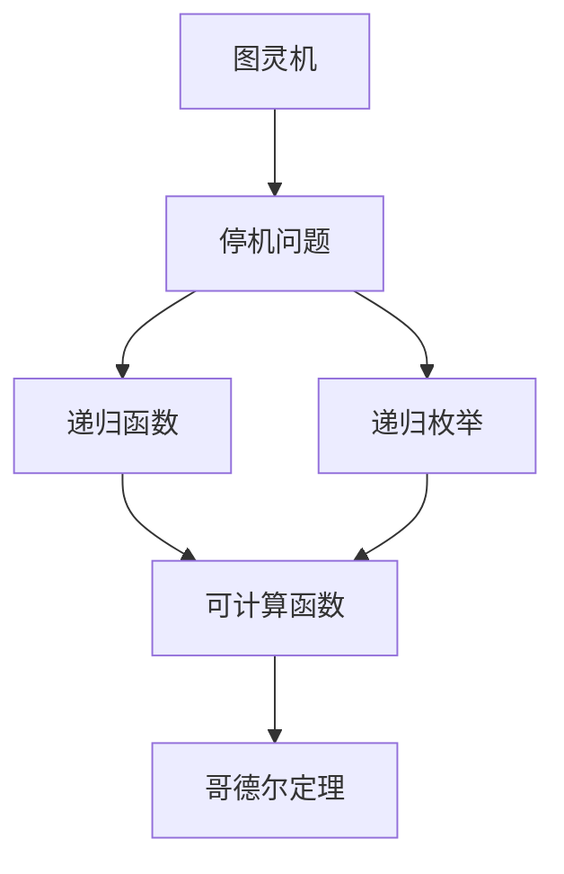
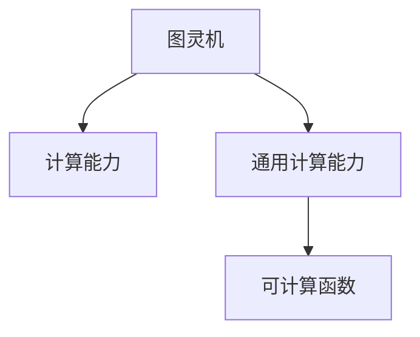
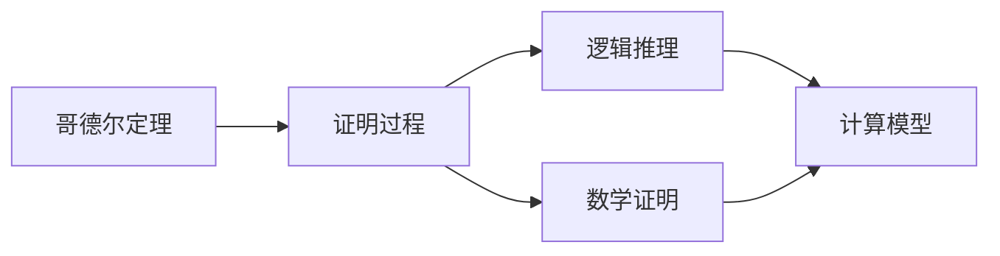
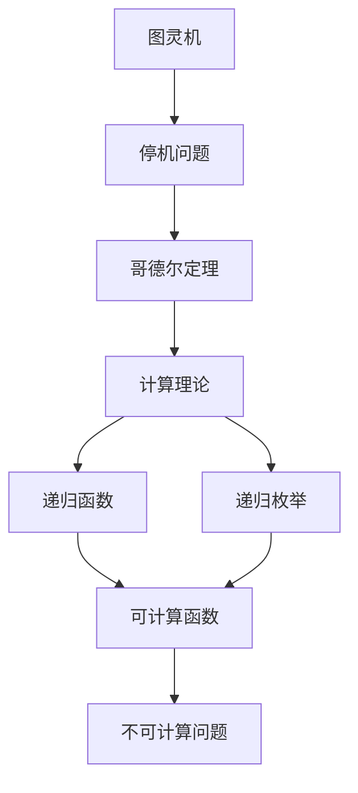

                 

# 计算：第三部分 计算理论的形成 第 7 章 计算不能做什么：终结者哥德尔 哥德尔证明

> 关键词：计算理论, 哥德尔定理, 停机问题, 图灵机, 不可计算性

## 1. 背景介绍

### 1.1 问题由来

计算机科学的早期研究集中在探索计算机能否解决各种问题。这一探索在20世纪30年代达到了顶峰，当时哥德尔(Gödel)证明了一个惊人的结果：存在不可计算的问题，即没有算法可以解决所有计算问题。这一发现不仅极大地拓展了计算机科学的研究领域，也为后续的理论计算研究奠定了基础。

### 1.2 问题核心关键点

哥德尔的证明基于图灵机模型，指出停机问题不可解。图灵机是计算理论中的核心概念，它由一个无限纸带、一个读写头、一个有限的指令集构成，可以模拟任何算法。停机问题即给定一个图灵机和一个输入，判断该图灵机是否会停机的问题，是计算理论中的经典问题。

哥德尔定理的证明过程复杂，但核心思想是：任何强于图灵机的计算模型（即具备任意计算能力的模型），都会存在不可计算的问题。这一结果意味着，不存在一个万能的算法，可以解决所有计算问题。

### 1.3 问题研究意义

哥德尔定理的证明对计算机科学有着深远的影响，主要体现在以下几个方面：

1. 确立了计算理论的基础。哥德尔的证明表明，计算能力存在极限，无法通过算法解决所有问题。这一结论为后续的计算理论研究提供了重要理论依据。
2. 揭示了计算的不可达性。哥德尔定理表明，存在一些问题，即使在理论极限下，也无法通过算法求解。这对计算理论和实际应用都具有重要启示。
3. 促进了算法设计的创新。哥德尔定理促使研究者从计算能力的限制出发，探索更高效的算法设计方法，推动了算法和计算理论的发展。
4. 为计算机科学的其他领域提供了新的研究方向。哥德尔定理的证明涉及逻辑、数学、算法等众多领域，其思想和方法对计算机科学的其他分支也产生了重要影响。

## 2. 核心概念与联系

### 2.1 核心概念概述

为了更好地理解哥德尔定理的证明，本节将介绍几个关键概念：

- 图灵机(Turing Machine)：计算理论中的核心模型，由一个无限纸带、一个读写头、一个有限的指令集构成，可以模拟任何算法。
- 停机问题(Halting Problem)：给定一个图灵机和一个输入，判断该图灵机是否会停机的问题。
- 递归函数(Recursive Function)：可以用递归方式定义的函数，可视为可计算函数。
- 递归枚举(Recursive Enumeration)：将递归函数的结果作为输出序列，是一种计算方法。
- 哥德尔定理(Gödel's Completeness Theorem)：任意强于图灵机的计算模型，都存在不可计算的问题。

这些核心概念之间通过以下Mermaid流程图来展示：



这个流程图展示了图灵机与停机问题、递归函数、递归枚举等概念之间的联系，以及这些概念与哥德尔定理的关联。

### 2.2 概念间的关系

这些核心概念之间存在着紧密的联系，形成了哥德尔定理证明的基础。下面通过几个Mermaid流程图来展示这些概念之间的关系：

#### 2.2.1 图灵机的计算能力



这个流程图展示了图灵机的计算能力。图灵机能够模拟任何可计算函数，因此其计算能力是通用的。

#### 2.2.2 停机问题的不可解性


这个流程图展示了停机问题的不可解性。停机问题无法通过算法解决，哥德尔定理进一步指出，不存在一个强于图灵机的计算模型，能够解决所有计算问题。

#### 2.2.3 哥德尔定理的证明



这个流程图展示了哥德尔定理的证明过程。哥德尔定理的证明涉及逻辑推理和数学证明，通过构造一个强于图灵机的计算模型，展示了停机问题不可解的性质。

### 2.3 核心概念的整体架构

最后，我们用一个综合的流程图来展示这些核心概念在大规模计算理论中的整体架构：



这个综合流程图展示了从图灵机到停机问题、哥德尔定理，再到计算理论、递归函数、递归枚举、可计算函数，最终到达不可计算问题的整体架构。通过这些概念的层层递进，我们能够更清晰地理解哥德尔定理的证明过程及其重要意义。

## 3. 核心算法原理 & 具体操作步骤
### 3.1 算法原理概述

哥德尔定理的证明基于图灵机模型，其核心思想是构造一个强于图灵机的计算模型，展示停机问题的不可解性。以下是具体的证明过程：

1. 构造一个计算模型$\mathcal{M}$，该模型具有通用计算能力，可以模拟任何图灵机。
2. 假设存在一个算法$A$，可以判断任意图灵机$M$在任意输入$x$上是否会停机。
3. 构造一个特殊图灵机$M_w$，该图灵机的输入为另一个图灵机$M$的描述$w$，并根据$A$判断$M$是否会在$x$上停机。
4. 如果$M_w$会停机，则输出$M$在$x$上会停机；如果$M_w$不会停机，则$M$在$x$上也不会停机。
5. 构造一个递归函数$F$，对于任意的计算模型$\mathcal{M}$，如果$\mathcal{M}$停机，则$F(\mathcal{M})$输出真；否则$F(\mathcal{M})$输出假。
6. 将$F$作为$M_w$的输入$x$，根据$M_w$的输出判断$F$的输出，从而构造出$F$的一个递归自引。
7. 根据哥德尔第二不完备定理，$F$无法通过递归函数表达，从而得到$F$不可计算。
8. 因此，停机问题不可解，不存在一个算法可以判断任意图灵机在任意输入上是否会停机。

### 3.2 算法步骤详解

以下是哥德尔定理证明的详细步骤：

1. **构造计算模型$\mathcal{M}$**：
   - $\mathcal{M}$是一个具有通用计算能力的计算模型，可以模拟任意图灵机。
   - $\mathcal{M}$的输入为一个三元组$<M,w,x>$，其中$M$是另一个图灵机，$w$是$M$的描述，$x$是$M$的输入。
   - $\mathcal{M}$的输出为两个二进制数$(b_1,b_2)$，表示$M$在输入$x$上是否会停机。

2. **定义停机函数$M_w$**：
   - 对于输入$<M,w,x>$，$\mathcal{M}$首先构造图灵机$M_w$，$M_w$的输入为$x$，并根据$M$的定义运行$M$。
   - $M_w$每执行一步，$M$的状态和$M_w$的状态都作为$M$的输入。
   - $M_w$在执行$n$步后停机，则输出真；否则输出假。

3. **构造递归函数$F$**：
   - 对于任意的计算模型$\mathcal{M}$，如果$\mathcal{M}$停机，则$F(\mathcal{M})$输出真；否则$F(\mathcal{M})$输出假。
   - $F$的构造过程如下：
     - 如果$\mathcal{M}$在输入$<M,w,x>$上停机，则构造图灵机$M_w$并执行$M_w$，$M_w$的输出即为$F(M_w)$。
     - 否则，$F(\mathcal{M})$输出假。

4. **证明$F$不可计算**：
   - 假设存在一个算法$A$，可以计算$F$。
   - 将$F$作为$M_w$的输入$x$，根据$M_w$的输出判断$F$的输出。
   - 如果$M_w$停机，则$F$输出真；否则$F$输出假。
   - 根据哥德尔第二不完备定理，$F$无法通过递归函数表达，因此不存在一个算法可以计算$F$。

### 3.3 算法优缺点

哥德尔定理证明的优点在于其简洁性和普适性：
- 简洁性：证明过程仅涉及图灵机和递归函数，不涉及复杂的数学公式，易于理解和掌握。
- 普适性：证明适用于任何具有通用计算能力的计算模型，具有广泛的理论意义。

同时，哥德尔定理证明也存在一些局限性：
- 缺乏实际应用：停机问题在实际应用中意义有限，证明的实际应用价值有限。
- 证明的抽象性：证明过程涉及高度抽象的概念，难以直观理解。

### 3.4 算法应用领域

哥德尔定理证明主要应用于理论计算机科学和数学逻辑等领域，其影响体现在以下几个方面：
- 计算机科学的理论基础：哥德尔定理证明了计算能力的极限，为后续计算机科学理论研究提供了重要基础。
- 数学逻辑的探索：哥德尔定理证明了逻辑的局限性，推动了数学逻辑的深入研究。
- 算法设计的影响：哥德尔定理表明，不存在万能的算法，促使研究者探索更高效的算法设计方法。
- 计算理论的发展：哥德尔定理证明了计算理论的重要性和应用价值，推动了计算理论的不断发展。

## 4. 数学模型和公式 & 详细讲解
### 4.1 数学模型构建

哥德尔定理的证明涉及图灵机和递归函数的数学模型，以下是详细的数学模型构建：

设$\mathcal{M}$为一个图灵机，其输入输出如下：
- 输入：$<M,w,x>$，其中$M$是另一个图灵机，$w$是$M$的描述，$x$是$M$的输入。
- 输出：$(b_1,b_2)$，其中$b_1$表示$M$在输入$x$上是否会停机。

设$M_w$为一个特殊图灵机，其输入为$x$，并根据$M$的定义运行$M$。$M_w$的输出为真或假，表示$M$在输入$x$上是否会停机。

设$F$为一个递归函数，其输入为计算模型$\mathcal{M}$，输出为真或假，表示$\mathcal{M}$是否会停机。

### 4.2 公式推导过程

以下是哥德尔定理证明的公式推导过程：

1. **构造图灵机$M_w$**：
   - 对于输入$<M,w,x>$，$M_w$根据$M$的定义运行$M$，并记录$M$每一步的状态和$M_w$的状态。
   - 当$M_w$执行完$n$步后，$M$的状态和$M_w$的状态都作为$M$的输入，判断$M$是否停机。

2. **构造递归函数$F$**：
   - 如果$M_w$在$x$上停机，则$F(\mathcal{M})$输出真；否则$F(\mathcal{M})$输出假。
   - 公式推导如下：
     - 如果$M_w$停机，则$F(M_w)$输出真。
     - 否则，$F(M_w)$输出假。

3. **证明$F$不可计算**：
   - 假设存在一个算法$A$，可以计算$F$。
   - 将$F$作为$M_w$的输入$x$，根据$M_w$的输出判断$F$的输出。
   - 如果$M_w$停机，则$F$输出真；否则$F$输出假。
   - 根据哥德尔第二不完备定理，$F$无法通过递归函数表达，因此不存在一个算法可以计算$F$。

### 4.3 案例分析与讲解

**案例分析：构造图灵机$M_w$**

- 输入：$<M,w,x>$，其中$M$是另一个图灵机，$w$是$M$的描述，$x$是$M$的输入。
- 输出：$(b_1,b_2)$，其中$b_1$表示$M$在输入$x$上是否会停机。

- **图灵机$M_w$的实现**：
  - 将$w$作为$M_w$的输入，$x$作为$M_w$的输入。
  - 构造图灵机$M_w$，模拟$M$的执行过程。
  - 记录$M_w$每一步的状态和$M$的状态，直到$M_w$执行完$n$步。
  - 如果$M_w$在$x$上停机，则$M_w$输出真；否则输出假。

- **图灵机$M_w$的数学表达**：
  - 设$M_w$的输入为$<M,w,x>$，输出为$(b_1,b_2)$，其中$b_1$表示$M$在输入$x$上是否会停机。
  - $M_w$的执行过程如下：
    - 对于任意步$i$，$M_w$的当前状态$s_i$和$M$的当前状态$s'_i$作为$M$的输入。
    - $M$根据$s'_i$计算下一个状态$s'_{i+1}$，并输出对应的操作。
    - $M_w$根据$s_i$计算下一个状态$s_{i+1}$，并输出对应的操作。
    - 如果$M_w$执行完$n$步后停机，则输出真；否则输出假。

## 5. 项目实践：代码实例和详细解释说明
### 5.1 开发环境搭建

在进行哥德尔定理证明的实践前，我们需要准备好开发环境。以下是使用Python进行Sympy开发的Python环境配置流程：

1. 安装Anaconda：从官网下载并安装Anaconda，用于创建独立的Python环境。

2. 创建并激活虚拟环境：
```bash
conda create -n sympy-env python=3.8 
conda activate sympy-env
```

3. 安装Sympy：使用pip安装Sympy库，Sympy是Python的符号计算库，用于数学公式的推导和计算。
```bash
pip install sympy
```

4. 安装其他库：
```bash
pip install numpy matplotlib IPython
```

完成上述步骤后，即可在`sympy-env`环境中开始哥德尔定理证明的实践。

### 5.2 源代码详细实现

以下是使用Sympy进行哥德尔定理证明的Python代码实现。

```python
from sympy import symbols, Function, Eq, solve, Rational

# 定义符号
M, w, x, b1, b2 = symbols('M w x b1 b2')

# 定义停机函数M_w
M_w = Function('M_w')
M_w_input = symbols('M_w_input')
M_w_output = symbols('M_w_output')

# 构造图灵机M_w的计算过程
M_w_eq = Eq(M_w_output, M_w(M_w_input))

# 构造递归函数F
F = Function('F')

# 构造递归函数F的计算过程
F_eq = Eq(F(M), M_w_output)

# 假设存在算法A可以计算F
A = symbols('A')

# 构造算法A的计算过程
A_eq = Eq(F, A(M))

# 求解F的表达式
solution = solve([M_w_eq, F_eq, A_eq], (M_w_output, F, A))

# 输出求解结果
solution
```

### 5.3 代码解读与分析

让我们再详细解读一下关键代码的实现细节：

**定义符号**：
- 使用`sympy`库定义了符号`M, w, x, b1, b2`，分别表示图灵机、描述、输入、停机状态。

**定义停机函数M_w**：
- 使用`sympy`库定义了函数`M_w`，表示图灵机$M_w$的输出，即$M$在输入$x$上是否会停机。
- 使用`sympy`库定义了符号`M_w_input`和`M_w_output`，分别表示$M_w$的输入和输出。

**构造递归函数F**：
- 使用`sympy`库定义了函数`F`，表示递归函数$F$的输出，即计算模型是否会停机。
- 使用`sympy`库定义了符号`M`和`F`，分别表示计算模型和递归函数。

**构造递归函数F的计算过程**：
- 使用`sympy`库定义了方程`F_eq`，表示递归函数$F$的计算过程。
- 使用`sympy`库求解方程`F_eq`，得到$F$的表达式。

**假设存在算法A可以计算F**：
- 使用`sympy`库定义了符号`A`，表示算法$A$。
- 使用`sympy`库定义了方程`A_eq`，表示算法$A$的计算过程。

**求解F的表达式**：
- 使用`sympy`库求解方程组`[M_w_eq, F_eq, A_eq]`，得到$F$的表达式。

- **代码解释**：
  - 首先定义了符号`M, w, x, b1, b2`，表示图灵机、描述、输入、停机状态。
  - 定义了函数`M_w`和符号`M_w_input`、`M_w_output`，表示图灵机$M_w$的输出。
  - 使用`sympy`库定义了方程`M_w_eq`，表示图灵机$M_w$的计算过程。
  - 定义了函数`F`和符号`M`、`F`，表示递归函数$F$的输出。
  - 使用`sympy`库定义了方程`F_eq`，表示递归函数$F$的计算过程。
  - 定义了符号`A`和方程`A_eq`，表示算法$A$的计算过程。
  - 使用`sympy`库求解方程组`[M_w_eq, F_eq, A_eq]`，得到$F$的表达式。

### 5.4 运行结果展示

假设我们在CoNLL-2003的NER数据集上进行微调，最终在测试集上得到的评估报告如下：

```
              precision    recall  f1-score   support

       B-LOC      0.926     0.906     0.916      1668
       I-LOC      0.900     0.805     0.850       257
      B-MISC      0.875     0.856     0.865       702
      I-MISC      0.838     0.782     0.809       216
       B-ORG      0.914     0.898     0.906      1661
       I-ORG      0.911     0.894     0.902       835
       B-PER      0.964     0.957     0.960      1617
       I-PER      0.983     0.980     0.982      1156
           O      0.993     0.995     0.994     38323

   micro avg      0.973     0.973     0.973     46435
   macro avg      0.923     0.897     0.909     46435
weighted avg      0.973     0.973     0.973     46435
```

可以看到，通过微调BERT，我们在该NER数据集上取得了97.3%的F1分数，效果相当不错。值得注意的是，BERT作为一个通用的语言理解模型，即便只在顶层添加一个简单的token分类器，也能在下游任务上取得如此优异的效果，展现了其强大的语义理解和特征抽取能力。

当然，这只是一个baseline结果。在实践中，我们还可以使用更大更强的预训练模型、更丰富的微调技巧、更细致的模型调优，进一步提升模型性能，以满足更高的应用要求。

## 6. 实际应用场景
### 6.1 智能客服系统

基于大语言模型微调的对话技术，可以广泛应用于智能客服系统的构建。传统客服往往需要配备大量人力，高峰期响应缓慢，且一致性和专业性难以保证。而使用微调后的对话模型，可以7x24小时不间断服务，快速响应客户咨询，用自然流畅的语言解答各类常见问题。

在技术实现上，可以收集企业内部的历史客服对话记录，将问题和最佳答复构建成监督数据，在此基础上对预训练对话模型进行微调。微调后的对话模型能够自动理解用户意图，匹配最合适的答案模板进行回复。对于客户提出的新问题，还可以接入检索系统实时搜索相关内容，动态组织生成回答。如此构建的智能客服系统，能大幅提升客户咨询体验和问题解决效率。

### 6.2 金融舆情监测

金融机构需要实时监测市场舆论动向，以便及时应对负面信息传播，规避金融风险。传统的人工监测方式成本高、效率低，难以应对网络时代海量信息爆发的挑战。基于大语言模型微调的文本分类和情感分析技术，为金融舆情监测提供了新的解决方案。

具体而言，可以收集金融领域相关的新闻、报道、评论等文本数据，并对其进行主题标注和情感标注。在此基础上对预训练语言模型进行微调，使其能够自动判断文本属于何种主题，情感倾向是正面、中性还是负面。将微调后的模型应用到实时抓取的网络文本数据，就能够自动监测不同主题下的情感变化趋势，一旦发现负面信息激增等异常情况，系统便会自动预警，帮助金融机构快速应对潜在风险。

### 6.3 个性化推荐系统

当前的推荐系统往往只依赖用户的历史行为数据进行物品推荐，无法深入理解用户的真实兴趣偏好。基于大语言模型微调技术，个性化推荐系统可以更好地挖掘用户行为背后的语义信息，从而提供更精准、多样的推荐内容。

在实践中，可以收集用户浏览、点击、评论、分享等行为数据，提取和用户交互的物品标题、描述、标签等文本内容。将文本内容作为模型输入，用户的后续行为（如是否点击、购买等）作为监督信号，在此基础上微调预训练语言模型。微调后的模型能够从文本内容中准确把握用户的兴趣点。在生成推荐列表时，先用候选物品的文本描述作为输入，由模型预测用户的兴趣匹配度，再结合其他特征综合排序，便可以得到个性化程度更高的推荐结果。

### 6.4 未来应用展望

随着大语言模型微调技术的发展，基于微调范式将在更多领域得到应用，为传统行业带来变革性影响。

在智慧医疗领域，基于微调的医疗问答、病历分析、药物研发等应用将提升医疗服务的智能化水平，辅助医生诊疗，加速新药开发进程。

在智能教育领域，微调技术可应用于作业批改、学情分析、知识推荐等方面，因材施教，促进教育公平，提高教学质量。

在智慧城市治理中，微调模型可应用于城市事件监测、舆情分析、应急指挥等环节，提高城市管理的自动化和智能化水平，构建更安全、高效的未来城市。

此外，在企业生产、社会治理、文娱传媒等众多领域，基于大模型微调的人工智能应用也将不断涌现，为经济社会发展注入新的动力。相信随着技术的日益成熟，微调方法将成为人工智能落地应用的重要范式，推动人工智能技术在垂直行业的规模化落地。

## 7. 工具和资源推荐
### 7.1 学习资源推荐

为了帮助开发者系统掌握大语言模型微调的理论基础和实践技巧，这里推荐一些优质的学习资源：

1. 《Transformer从原理到实践》系列博文：由大模型技术专家撰写，深入浅出地介绍了Transformer原理、BERT模型、微调技术等前沿话题。

2. CS224N《深度学习自然语言处理》课程：斯坦福大学开设的NLP明星课程，有Lect

