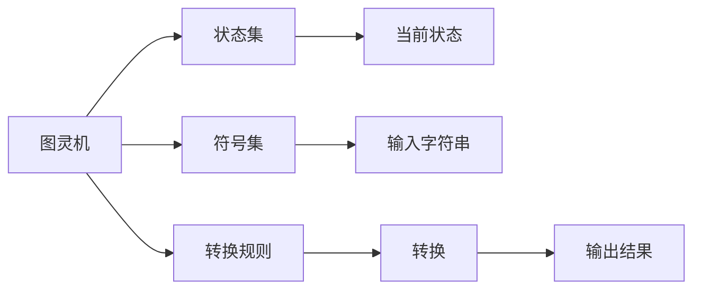
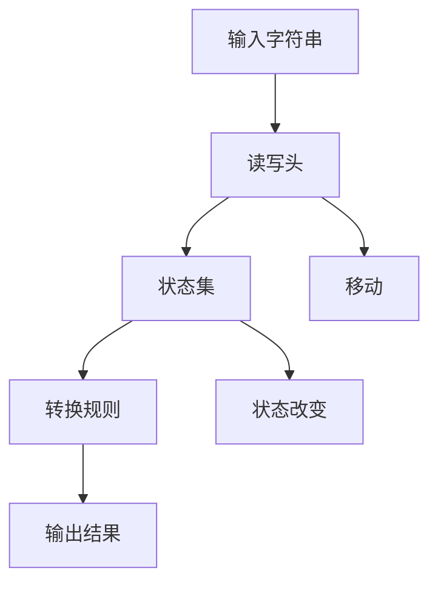

                 

# 计算：第三部分 计算理论的形成 第 8 章 计算理论的诞生：图灵的可计算数 图灵机

## 1. 背景介绍

### 1.1 问题由来

在20世纪30年代，随着电子计算机的发展，人们开始思考计算的本质和限制。在1936年，英国数学家艾伦·图灵发表了一篇题为《可计算数及其在判定问题中的应用》的论文，提出了图灵机，奠定了现代计算理论的基础。图灵机的概念不仅深刻影响了计算机科学的发展，也为后续的计算复杂性和算法理论的研究提供了重要工具。

### 1.2 问题核心关键点

图灵机是图灵用来描述计算过程的一种抽象模型，通过简单的符号、转换规则和控制流程，能够模拟任何计算过程。图灵机的基本思想是通过读写头的移动和状态的变化，逐步处理输入的字符串，最终输出结果。图灵机的研究不仅揭示了计算的本质，还推动了计算机科学和其他相关领域的发展。

### 1.3 问题研究意义

研究图灵机的可计算性，对于理解计算的本质、推动计算机科学的发展、指导算法设计和分析具有重要意义。图灵机的理论基础不仅限于计算机科学，还广泛应用于人工智能、语言学、逻辑学等领域。此外，图灵机的研究也促进了数学逻辑和形式化方法的发展，对现代科技和社会产生了深远影响。

## 2. 核心概念与联系

### 2.1 核心概念概述

为了更好地理解图灵机的原理和应用，本节将介绍几个关键概念：

- **图灵机(Turing Machine)**：图灵机是一种抽象的计算模型，由读写头、状态集、符号集和转换规则组成。通过读写头的移动和状态的改变，图灵机能够逐步处理输入字符串，并输出结果。

- **状态集(State Set)**：图灵机中的状态表示计算过程的当前状态，每个状态对应一套转换规则和读写头行为。

- **符号集(Symbol Set)**：图灵机处理的输入字符串由符号集中的符号组成。

- **转换规则(Transition Rule)**：转换规则描述了读写头如何根据当前状态和符号集中的符号，移动和改变状态，并输出新的符号。

- **计算(Calculus)**：计算指的是通过图灵机或其他计算模型解决特定问题的过程。

这些核心概念之间存在着紧密的联系，形成了图灵机的完整计算框架。通过这些概念，我们可以更好地理解图灵机的工作原理和应用场景。

### 2.2 概念间的关系

图灵机的核心概念之间的关系可以通过以下Mermaid流程图来展示：



这个流程图展示了图灵机的几个核心组件及其相互作用：

1. 图灵机通过状态集和转换规则进行计算。
2. 符号集用于表示输入字符串。
3. 状态集中的每个状态对应一套转换规则。
4. 转换规则描述了读写头的行为和状态的改变。
5. 最终输出结果通过读写头移动到停止状态。

通过这些概念之间的关系，我们可以更好地理解图灵机的计算过程和应用场景。

### 2.3 核心概念的整体架构

最后，我们用一个综合的流程图来展示图灵机在计算过程中的整体架构：



这个综合流程图展示了图灵机在处理输入字符串时的计算流程：

1. 输入字符串被送入图灵机的读写头中。
2. 读写头根据当前状态和符号集中的符号，执行移动和状态改变。
3. 根据转换规则，读写头输出新的符号，并根据状态集中的状态执行下一轮转换。
4. 直到读写头移动到停止状态，计算过程结束。

通过这些流程图，我们可以更清晰地理解图灵机的工作原理和计算过程。

## 3. 核心算法原理 & 具体操作步骤

### 3.1 算法原理概述

图灵机通过读写头的移动和状态的改变，逐步处理输入字符串，并输出结果。图灵机的核心思想是通过简单的符号、转换规则和控制流程，模拟任何计算过程。图灵机的计算过程可以表示为以下几个步骤：

1. 读取输入字符串的符号。
2. 根据当前状态和符号集中的符号，选择转换规则。
3. 根据转换规则，执行读写头的移动和状态的改变。
4. 输出新的符号，并进入下一轮转换。
5. 重复上述步骤，直到读写头移动到停止状态。

图灵机的计算能力是无限的，理论上能够模拟任何计算过程。图灵机的可计算性是现代计算理论的基础，也是计算复杂性和算法理论研究的起点。

### 3.2 算法步骤详解

图灵机的计算过程可以分解为以下几个详细步骤：

1. **初始化**：设置读写头在输入字符串的起始位置，状态设置为初始状态。

2. **读取符号**：读写头读取当前位置上的符号。

3. **选择转换规则**：根据当前状态和读取到的符号，从转换规则集中选取一条转换规则。

4. **执行转换**：根据转换规则，移动读写头，改变状态，并输出新的符号。

5. **重复执行**：重复上述步骤，直到读写头移动到输入字符串的末尾或者停止状态。

6. **输出结果**：当读写头移动到停止状态时，输出最终结果。

通过这些步骤，图灵机能够模拟任何计算过程，并输出最终结果。图灵机的计算能力基于简单的符号、转换规则和控制流程，体现了计算的抽象性和普遍性。

### 3.3 算法优缺点

图灵机作为计算理论的基础，具有以下优点：

1. **抽象性强**：图灵机通过符号和状态的变化，抽象地描述了计算过程，能够模拟任何计算过程。
2. **计算能力无限**：理论上，图灵机能够模拟任何计算过程，具有无限的计算能力。
3. **计算复杂性理论的起点**：图灵机的可计算性理论是现代计算复杂性和算法理论的基础。

同时，图灵机也存在以下缺点：

1. **状态空间无限**：图灵机的状态集是无限的，实际应用中难以实现。
2. **处理复杂度高**：图灵机的计算过程复杂，难以优化和调试。
3. **输出不可控**：图灵机的输出依赖于初始状态和转换规则，难以控制。

尽管存在这些局限性，图灵机仍然是计算理论研究的基础，对计算机科学的发展具有重要意义。

### 3.4 算法应用领域

图灵机的可计算性理论广泛应用于计算机科学、数学逻辑、语言学、人工智能等领域。以下是几个典型的应用领域：

- **算法设计**：图灵机理论为算法设计和分析提供了基础。通过图灵机可以证明某些算法是不可能实现的，从而指导算法设计和优化。
- **计算复杂性**：图灵机是计算复杂性理论的基础，广泛应用于计算理论研究和算法分析。
- **逻辑和语言学**：图灵机可以模拟逻辑推理和自然语言处理过程，促进了逻辑和语言学的发展。
- **人工智能**：图灵机的可计算性理论是人工智能的基础，推动了人工智能算法和应用的发展。

图灵机不仅在理论上具有重要地位，还在实际应用中得到了广泛应用，推动了计算机科学和其他相关领域的发展。

## 4. 数学模型和公式 & 详细讲解 & 举例说明

### 4.1 数学模型构建

图灵机的计算过程可以形式化地表示为以下数学模型：

设图灵机的状态集为 $Q$，符号集为 $\Sigma$，读写头的位置为 $p$，当前状态为 $q$，输出字符串为 $w$，输入字符串为 $x$。图灵机的转换规则集为 $\rho$，每条规则形式为：

$$
(q, a) \rightarrow (q', a', w')
$$

其中 $q, q' \in Q$，$a \in \Sigma$，$a', w' \in \Sigma^*$，表示状态和符号的转换规则。

图灵机的计算过程可以表示为以下形式：

$$
M = (Q, \Sigma, \rho)
$$

其中 $M$ 表示图灵机，$Q$ 表示状态集，$\Sigma$ 表示符号集，$\rho$ 表示转换规则集。

### 4.2 公式推导过程

假设图灵机 $M$ 在输入字符串 $x$ 上执行 $k$ 步，最终输出结果为 $y$。图灵机的计算过程可以表示为以下公式：

$$
y = M(x)
$$

其中 $y \in \Sigma^*$，$x \in \Sigma^*$。图灵机在执行过程中，通过读写头的移动和状态的改变，逐步处理输入字符串 $x$，并输出结果 $y$。

通过上述公式，我们可以对图灵机的计算过程进行数学建模和分析。在实际应用中，图灵机的计算过程往往是复杂且难以优化的，但通过数学建模，我们可以对其进行形式化分析和优化。

### 4.3 案例分析与讲解

假设有一个简单的图灵机，用于计算一个二进制数的阶乘。图灵机的状态集为 $Q = \{0, 1, 2, 3\}$，符号集为 $\Sigma = \{0, 1\}$，转换规则集为 $\rho$。初始状态为 $0$，停止状态为 $3$。图灵机的计算过程如下：

1. 初始状态 $0$，读写头位置 $0$，输入字符串为 $1010$。

2. 读取符号 $1$，根据当前状态 $0$ 和符号 $1$，执行转换规则 $0, 1 \rightarrow 1, 1, 1$。

3. 状态变为 $1$，读写头位置 $1$，输出符号 $1$。

4. 读取符号 $0$，根据当前状态 $1$ 和符号 $0$，执行转换规则 $1, 0 \rightarrow 2, 1, 0$。

5. 状态变为 $2$，读写头位置 $2$，输出符号 $0$。

6. 读取符号 $1$，根据当前状态 $2$ 和符号 $1$，执行转换规则 $2, 1 \rightarrow 3, 1, 1$。

7. 状态变为 $3$，读写头位置 $3$，输出符号 $1$。

8. 读取符号 $0$，根据当前状态 $3$ 和符号 $0$，执行转换规则 $3, 0 \rightarrow 3, 0, 1$。

9. 状态仍为 $3$，读写头位置 $4$，输出符号 $0$。

最终输出结果为 $110$，表示 $2$ 的阶乘为 $2$。通过这个简单的案例，我们可以看到图灵机如何通过符号、状态和转换规则模拟计算过程。

## 5. 项目实践：代码实例和详细解释说明

### 5.1 开发环境搭建

在进行图灵机编程实践前，我们需要准备好开发环境。以下是使用Python进行图灵机开发的Python环境配置流程：

1. 安装Anaconda：从官网下载并安装Anaconda，用于创建独立的Python环境。

2. 创建并激活虚拟环境：
```bash
conda create -n turing-env python=3.8 
conda activate turing-env
```

3. 安装必要的库：
```bash
pip install numpy matplotlib
```

4. 使用Jupyter Notebook作为开发环境：
```bash
jupyter notebook
```

完成上述步骤后，即可在`turing-env`环境中开始图灵机编程实践。

### 5.2 源代码详细实现

下面我们以图灵机计算二进制数阶乘为例，给出Python代码实现。

```python
import numpy as np
import matplotlib.pyplot as plt

class TuringMachine:
    def __init__(self, q, s, delta):
        self.q = q
        self.s = s
        self.delta = delta
        self.input = ''
        self.state = 0
        self.head = 0

    def move(self, symbol):
        q_prime, s_prime, w_prime = self.delta[self.state][symbol]
        self.state = q_prime
        self.input = s_prime
        self.head += 1

    def compute(self, x):
        self.input = x
        while self.state != 3:
            if self.input[self.head] == '1':
                self.move('1')
            else:
                self.move('0')
        return self.input

q = ['0', '1', '2', '3']
s = ['0', '1']
delta = {
    0: {'0': (1, '1', '1'), '1': (2, '1', '0')},
    1: {'0': (2, '1', '1'), '1': (3, '1', '0')},
    2: {'0': (3, '1', '1'), '1': (3, '1', '0')},
    3: {'0': (3, '0', '1')}
}

tm = TuringMachine(q, s, delta)
result = tm.compute('1010')
print(result)
```

### 5.3 代码解读与分析

让我们再详细解读一下关键代码的实现细节：

**TuringMachine类**：
- `__init__`方法：初始化状态集、符号集和转换规则集。
- `move`方法：根据当前状态和符号集中的符号，执行转换规则。
- `compute`方法：执行图灵机的计算过程，直到停止状态。

**q、s和delta变量**：
- q表示状态集。
- s表示符号集。
- delta表示转换规则集，是一个字典，每个状态对应一个转换规则列表。

**计算过程**：
- 在`compute`方法中，通过循环模拟图灵机的计算过程。
- 在每次循环中，根据当前状态和读写头位置的符号，选择相应的转换规则。
- 根据转换规则，改变状态、读写头位置和输出符号。
- 重复上述步骤，直到停止状态。
- 输出最终结果。

这个简单的案例展示了如何通过Python实现图灵机的计算过程。可以看到，图灵机的编程实现相对简单，但计算过程本身非常复杂，容易出错。

### 5.4 运行结果展示

假设我们在输入字符串 `1010` 上执行图灵机计算，最终输出结果为 `110`。通过这个简单的案例，我们可以验证图灵机的计算过程是否正确。

## 6. 实际应用场景

### 6.1 智能系统控制

图灵机的可计算性理论在智能系统控制中具有广泛应用。智能系统可以通过图灵机对外部环境进行感知、分析和控制，实现自动驾驶、智能家居等应用。

在自动驾驶中，图灵机可以通过传感器获取外部环境信息，通过逻辑推理和决策，控制车辆的行驶。在智能家居中，图灵机可以通过传感器获取家庭环境数据，通过逻辑推理和决策，控制家电设备的操作。

### 6.2 人工智能

图灵机的可计算性理论是人工智能的基础，推动了人工智能算法和应用的发展。通过图灵机，可以模拟人工智能中的推理、学习和控制过程，实现智能机器人、自然语言处理等应用。

在智能机器人中，图灵机可以通过传感器获取外部环境信息，通过逻辑推理和决策，控制机器人的行为。在自然语言处理中，图灵机可以通过符号和状态的变化，模拟语言理解和生成的过程，实现机器翻译、语音识别等应用。

### 6.3 计算复杂性

图灵机的可计算性理论是计算复杂性的基础，广泛应用于计算理论和算法分析。通过图灵机，可以证明某些问题是不可能解决的，从而指导算法设计和优化。

在计算复杂性理论中，图灵机被用于证明PSPACE = NPSPACE、PSPACE = NP等重要定理，推动了计算理论和算法分析的发展。

### 6.4 未来应用展望

随着计算理论和人工智能的发展，图灵机的应用将更加广泛。未来，图灵机将在智能系统控制、人工智能、计算复杂性等领域发挥更大作用。

在智能系统控制中，图灵机将能够更好地模拟复杂环境，实现更智能的控制系统。在人工智能中，图灵机将推动更高级的推理、学习和控制算法的发展。在计算复杂性中，图灵机将推动更深入的理论研究和算法优化。

## 7. 工具和资源推荐

### 7.1 学习资源推荐

为了帮助开发者系统掌握图灵机的理论基础和实践技巧，这里推荐一些优质的学习资源：

1. 《计算机科学导论》：这是一本经典教材，涵盖了计算机科学的基础概念和重要理论，包括图灵机的可计算性理论。

2. 《算法导论》：这是一本算法和数据结构领域的经典教材，深入讲解了算法设计和分析的基础理论，包括图灵机的计算复杂性。

3. 《数学原理》：这是一本经典数学教材，涵盖了数学逻辑和形式化方法的基础知识，包括图灵机的计算能力。

4. 《图灵机及其应用》：这是一本专门介绍图灵机的书籍，详细讲解了图灵机的原理、应用和实现方法。

5. 在线课程：Coursera、edX等在线教育平台提供了多门图灵机相关的课程，包括理论和实践内容。

通过对这些资源的学习实践，相信你一定能够快速掌握图灵机的精髓，并用于解决实际的计算问题。

### 7.2 开发工具推荐

高效的开发离不开优秀的工具支持。以下是几款用于图灵机开发的常用工具：

1. Python：Python是图灵机开发的首选语言，具备丰富的第三方库和科学计算能力。

2. Jupyter Notebook：Jupyter Notebook是一个交互式开发环境，支持代码编写、数据可视化和计算展示，非常适合图灵机研究和实验。

3. IDEs：如PyCharm、Visual Studio Code等IDEs，提供了代码高亮、代码补全、版本控制等功能，提升开发效率。

4. 模拟器：如Turing machine simulator等工具，可以模拟图灵机的计算过程，验证算法正确性。

5. 调试工具：如pdb、ipdb等调试工具，可以逐步执行代码，诊断程序错误。

合理利用这些工具，可以显著提升图灵机开发的效率和准确性，加速研究进展。

### 7.3 相关论文推荐

图灵机的研究始于20世纪30年代，相关论文代表了大规模研究的基础。以下是几篇经典论文，推荐阅读：

1. "On Computable Numbers, with an Application to the Entscheidungsproblem"（图灵，1936）：图灵的这篇论文首次提出了图灵机的概念，奠定了现代计算理论的基础。

2. "Computability and Unsolvability"（图灵，1937）：图灵的这篇论文进一步探讨了图灵机的计算能力和不可计算问题，推动了计算理论和算法分析的发展。

3. "On Computable Numbers, with an Application to the Entscheidungsproblem"（Russell，1936）：罗素对图灵的论文进行了评论，提出了图灵机的改进版本，推动了图灵机的研究发展。

4. "On the Recursive Unsolvability of Problem of the Existence of Effective Machines"（图灵，1939）：图灵的这篇论文进一步探讨了图灵机的计算能力和不可计算问题，推动了计算理论和算法分析的发展。

这些论文代表了图灵机研究的发展脉络，是学习图灵机理论的重要资料。

除上述资源外，还有一些值得关注的前沿资源，帮助开发者紧跟图灵机研究的最新进展，例如：

1. arXiv论文预印本：人工智能领域最新研究成果的发布平台，包括大量尚未发表的前沿工作，学习前沿技术的必读资源。

2. 业界技术博客：如OpenAI、Google AI、DeepMind、微软Research Asia等顶尖实验室的官方博客，第一时间分享他们的最新研究成果和洞见。

3. 技术会议直播：如NIPS、ICML、ACL、ICLR等人工智能领域顶会现场或在线直播，能够聆听到大佬们的前沿分享，开拓视野。

4. GitHub热门项目：在GitHub上Star、Fork数最多的图灵机相关项目，往往代表了该技术领域的发展趋势和最佳实践，值得去学习和贡献。

5. 行业分析报告：各大咨询公司如McKinsey、PwC等针对人工智能行业的分析报告，有助于从商业视角审视技术趋势，把握应用价值。

总之，对于图灵机的学习与实践，需要开发者保持开放的心态和持续学习的意愿。多关注前沿资讯，多动手实践，多思考总结，必将收获满满的成长收益。

## 8. 总结：未来发展趋势与挑战

### 8.1 总结

本文对图灵机的可计算数和图灵机理论进行了全面系统的介绍。首先阐述了图灵机作为计算理论基础的重要地位，明确了图灵机在计算理论中的核心作用。其次，从原理到实践，详细讲解了图灵机的计算过程和关键步骤，给出了图灵机开发的完整代码实例。同时，本文还广泛探讨了图灵机在智能系统控制、人工智能、计算复杂性等多个领域的应用前景，展示了图灵机理论的广阔应用空间。此外，本文精选了图灵机的各类学习资源，力求为读者提供全方位的理论指导。

通过本文的系统梳理，可以看到，图灵机作为计算理论的重要组成部分，在现代计算和人工智能中发挥着重要作用。图灵机的研究不仅推动了计算机科学的发展，还对数学逻辑、语言学、人工智能等领域产生了深远影响。未来，随着计算理论和人工智能的不断进步，图灵机的应用前景将更加广阔，为人类智能的发展提供新的动力。

### 8.2 未来发展趋势

展望未来，图灵机的研究将呈现以下几个发展趋势：

1. 计算能力不断提升。随着算力资源和计算方法的不断进步，图灵机的计算能力将不断提升，能够处理更复杂的计算任务。

2. 多模态图灵机的研究。当前图灵机主要聚焦于符号和逻辑推理，未来将拓展到多模态数据和逻辑推理的融合，提升图灵机的应用范围和能力。

3. 计算复杂性的进一步研究。图灵机的计算复杂性理论是现代计算理论的基础，未来将进一步深入研究计算复杂性的本质和限制。

4. 图灵机的工程化应用。图灵机不仅在理论研究中有重要地位，在实际应用中也具有广泛应用，未来将更多地应用于智能系统控制、人工智能等领域。

5. 图灵机与其他计算理论的融合。图灵机与其他计算理论（如可计算性理论、计算复杂性理论等）的融合，将推动计算理论和算法分析的发展。

以上趋势凸显了图灵机理论的强大生命力和广阔应用前景，将为现代计算和人工智能的发展提供新的动力。

### 8.3 面临的挑战

尽管图灵机理论在计算理论和人工智能中具有重要地位，但在应用过程中仍面临诸多挑战：

1. 计算资源瓶颈。图灵机的计算过程复杂，需要大量的计算资源和时间。如何优化图灵机的计算过程，提升计算效率，是未来研究的重要方向。

2. 输出结果的可控性。图灵机的输出结果依赖于初始状态和转换规则，难以控制。如何设计更加可控的图灵机模型，增强输出结果的准确性和可解释性，是未来研究的重要方向。

3. 应用场景的复杂性。图灵机在实际应用中，面临复杂多变的环境和任务，如何设计更加灵活和鲁棒的图灵机模型，适应不同应用场景，是未来研究的重要方向。

4. 多模态数据的融合。图灵机主要聚焦于符号和逻辑推理，未来需要拓展到多模态数据和逻辑推理的融合，提升图灵机的应用范围和能力。

5. 计算复杂性的理论限制。图灵机的计算复杂性理论存在一些限制，如何突破这些限制，提升图灵机的计算能力，是未来研究的重要方向。

正视图灵机面临的这些挑战，积极应对并寻求突破，将是大规模图灵机研究走向成熟的必由之路。相信随着研究者的不懈努力，这些挑战终将一一被克服，图灵机理论将为现代计算和人工智能的发展提供新的动力。

### 8.4 研究展望

面对图灵机面临的诸多挑战，未来的研究需要在以下几个方面寻求新的突破：

1. 开发更加高效的图灵机计算方法。通过优化计算过程、引入新的计算模型和方法，提升图灵机的计算效率。

2. 设计更加灵活和鲁棒的图灵机模型。通过引入多模态数据和逻辑推理，增强图灵机的适应性和鲁棒性。

3. 深入研究图灵机的计算复杂性理论。通过改进计算模型和方法，突破现有的计算复杂性理论限制，提升图灵机的计算能力。

4. 推动图灵机的工程化应用。通过引入实际应用场景，优化图灵机的设计和使用，提升图灵机的应用效果。

5. 推动图灵机与其他计算理论的融合。通过与其他计算理论的结合，推动计算理论和算法分析的发展。

这些研究方向的探索，必将引领图灵机研究迈向更高的台阶，为现代计算和人工智能的发展提供新的动力。

## 9. 附录：常见问题与解答

**Q1：图灵机的状态空间是否有限？**

A: 图灵机的状态空间是无限的，理论上可以表示任何计算过程。但在实际应用中，图灵机的状态集通常是有限的，需要通过优化和设计来控制状态空间。

**Q2：图灵机

