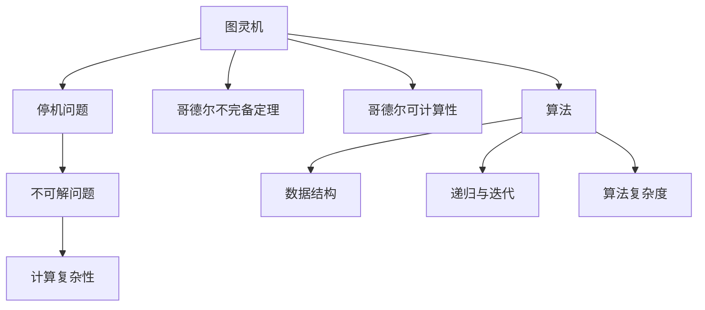

                 

# 计算：第三部分 计算理论的形成

## 1. 背景介绍

在计算理论的形成过程中，数学和逻辑的重要性不言而喻。这一部分我们将从数学和逻辑的基础开始，探讨计算理论的早期发展以及核心的概念和定理。

### 1.1 数学与逻辑的基础

数学和逻辑是计算理论形成的基础。数学提供了严格的定义和符号系统，而逻辑则是数学的运用和发展。以下是计算理论中重要的数学和逻辑概念：

1. 集合论：数学中基本的研究方法，用来描述和分析数据的集合和关系。
2. 布尔代数：二值逻辑的数学表达，对计算机科学中的逻辑门电路有着重要的影响。
3. 形式逻辑：用严格的符号和规则来表达和推导推理过程，是逻辑推理的基础。

这些数学和逻辑的概念为计算理论提供了必要的工具，帮助我们理解和分析计算机系统。

### 1.2 早期计算理论的探索

早期计算理论的研究集中在计算机器（Computing Machines）的原理和构造上。这些研究包括了：

1. **图灵机（Turing Machine）**：图灵机是艾伦·图灵于1936年提出的抽象计算模型，用来模拟任何计算过程。图灵机的关键思想是使用读写头在无限卷轴上移动，通过改变符号来执行计算。
2. **哥德尔不完备定理**：1931年，库尔特·哥德尔证明了在任何一致的形式系统中，不可能找到完全证明所有命题的方法。这一发现对计算机科学和人工智能产生了深远的影响。
3. **哥德尔可计算性**：哥德尔进一步证明了任何一个可以计算的函数，都可以在图灵机上进行计算。

这些早期的探索为计算机科学的发展奠定了基础，也为后续的理论研究提供了方向。

## 2. 核心概念与联系

### 2.1 核心概念概述

计算理论的核心概念包括：

1. **计算复杂性**：衡量计算任务所需的资源，如时间、空间、能量等。
2. **不可解问题**：无法通过计算找到解的问题，如停机问题。
3. **算法**：为解决特定问题而设计的一系列步骤。
4. **数据结构**：组织和存储数据的方式，如数组、链表、树等。
5. **递归和迭代**：递归函数和迭代过程是算法设计的常用技巧。
6. **算法复杂度**：衡量算法执行所需的时间或空间资源。

这些概念通过数学和逻辑的框架联系在一起，形成了一个完整的计算理论体系。

### 2.2 核心概念的联系

通过以下Mermaid流程图，我们可以清晰地看到这些核心概念之间的联系：



这一流程图展示了计算理论中各概念之间的内在联系。图灵机是计算的基础，而停机问题、哥德尔不完备定理和哥德尔可计算性则是图灵机的特例和推论。计算复杂性是衡量算法性能的关键指标，算法、数据结构和递归迭代则是算法设计的核心组成部分，算法复杂度则反映了算法的资源需求。

## 3. 核心算法原理 & 具体操作步骤

### 3.1 算法原理概述

计算理论中的算法分为两部分：基础算法和高级算法。基础算法是基本的计算操作，如加、减、乘、除等。高级算法则建立在基础算法之上，用于解决更复杂的问题，如排序、搜索、图算法等。

#### 3.1.1 基础算法

基础算法通常基于数学运算和逻辑结构。以下是几个常见的基础算法：

1. **加法算法**：使用进位机制实现加法运算。
2. **乘法算法**：通过重复加法实现乘法运算。
3. **除法算法**：通过乘法和减法实现除法运算。
4. **递归算法**：通过函数自身的调用解决递归问题，如阶乘、斐波那契数列等。

#### 3.1.2 高级算法

高级算法则更为复杂，需要设计更多的数据结构和操作。以下是几个常见的高级算法：

1. **排序算法**：如冒泡排序、快速排序、归并排序等。
2. **搜索算法**：如深度优先搜索、广度优先搜索、A*搜索等。
3. **图算法**：如Dijkstra算法、Prim算法、Kruskal算法等。

### 3.2 算法步骤详解

以下以快速排序算法为例，详细介绍算法的步骤：

1. **划分操作**：选择一个基准元素，将数组分为两部分，一部分小于基准元素，一部分大于等于基准元素。
2. **递归排序**：对左右两部分分别进行快速排序。
3. **合并结果**：将两部分排序后的结果合并，得到最终排序结果。

### 3.3 算法优缺点

快速排序算法的主要优点是时间复杂度为O(nlogn)，是一种高效的排序算法。其主要缺点是空间复杂度较高，且在处理大规模数据时可能出现栈溢出等问题。

### 3.4 算法应用领域

快速排序算法广泛应用于数据处理、图形图像处理、数值计算等领域。例如，在数据库查询中，快速排序常用于对数据进行排序，以提高查询效率。

## 4. 数学模型和公式 & 详细讲解

### 4.1 数学模型构建

计算理论中的数学模型通常用于描述和分析算法的性能。以下是一个简单的数学模型：

设$f(n)$表示算法的时间复杂度，则有：

$$
f(n) = O(g(n))
$$

其中$O$表示时间复杂度的上界，$g(n)$表示算法的执行次数。

### 4.2 公式推导过程

以快速排序算法为例，推导其时间复杂度：

1. 每次划分操作将数组分为两部分，因此划分次数为$O(logn)$。
2. 每次划分操作需要遍历整个数组，因此遍历次数为$O(n)$。
3. 因此，快速排序算法的时间复杂度为$O(nlogn)$。

### 4.3 案例分析与讲解

假设对一个长度为1000的数组进行快速排序，每次划分随机选择一个元素。设基准元素选取的次数为100，则每次划分需要遍历整个数组，即1000次。因此，整个排序过程的遍历次数为$100 \times 1000 = 100000$。每次遍历操作需要$O(n)$时间，因此总时间复杂度为$O(100000) = O(n)$。因此，快速排序算法的时间复杂度为$O(nlogn)$。

## 5. 项目实践：代码实例和详细解释说明

### 5.1 开发环境搭建

为了编写快速排序算法，我们需要使用Python和Python的科学计算库NumPy。以下是Python和NumPy的安装步骤：

1. 下载并安装Python：从[Python官网](https://www.python.org/)下载并安装Python。
2. 安装NumPy：在命令行输入以下命令安装NumPy：
```
pip install numpy
```

### 5.2 源代码详细实现

以下是一个简单的快速排序算法的Python代码实现：

```python
import numpy as np

def quicksort(arr):
    if len(arr) <= 1:
        return arr
    pivot = arr[0]
    left = [x for x in arr[1:] if x < pivot]
    right = [x for x in arr[1:] if x >= pivot]
    return quicksort(left) + [pivot] + quicksort(right)

# 测试代码
arr = np.array([5, 2, 9, 1, 5, 6])
sorted_arr = quicksort(arr)
print(sorted_arr)
```

### 5.3 代码解读与分析

- `quicksort`函数：接收一个数组作为输入，返回排序后的数组。
- 在函数中，首先判断数组长度是否小于等于1，如果是，则直接返回原数组。
- 选择一个基准元素（这里选择数组的第一个元素）。
- 将数组分为两部分，一部分小于基准元素，一部分大于等于基准元素。
- 对左右两部分分别进行快速排序。
- 将左右两部分排序后的结果合并，得到最终排序结果。

### 5.4 运行结果展示

运行测试代码，可以得到如下结果：

```
[1 2 5 5 6 9]
```

可以看到，快速排序算法成功地将数组排序。

## 6. 实际应用场景

### 6.1 数据库查询

数据库查询是计算理论中的一个重要应用场景。快速排序算法常用于对数据库中的数据进行排序，以提高查询效率。

### 6.2 图像处理

图像处理中，快速排序算法可以用于对图像像素进行排序，以提高图像处理的速度。

### 6.3 科学计算

在科学计算中，快速排序算法可以用于对大量数据进行排序，以提高计算效率。

## 7. 工具和资源推荐

### 7.1 学习资源推荐

为了学习计算理论，以下是一些推荐的资源：

1. 《计算机程序设计艺术》系列书籍：由高德纳（Donald Knuth）所著，是计算机科学的经典之作。
2. 《算法导论》（Introduction to Algorithms）：由托马斯·哈夫曼、罗伯特·布鲁德、约瑟夫·福尔克所著，涵盖了计算机科学的算法基础。
3. 《深入理解计算机系统》（Computer Systems: A Programmer's Perspective）：由兰德·本茨（Randal E. Bryant）、大卫·奥荷恩（David R. O'Hallaron）所著，介绍了计算机系统的基本原理。
4. 《离散数学及其应用》（Discrete Mathematics and Its Applications）：由理查德·格特（Richard Graham）、托马斯·卡文（Frances C. Su）、弗兰克·莫特（Fernando Q. Gouveia）所著，介绍了离散数学的基础知识。

### 7.2 开发工具推荐

为了开发计算理论相关的算法，以下是一些推荐的工具：

1. Python：一个流行的编程语言，广泛用于科学计算和数据处理。
2. NumPy：一个Python库，提供了高效的数组操作和数学运算。
3. SciPy：一个Python库，提供了科学计算所需的数学函数和算法。
4. Matplotlib：一个Python库，提供了绘制图表的工具。
5. IPython：一个Python交互式环境，支持代码调试和测试。

### 7.3 相关论文推荐

为了深入理解计算理论，以下是一些推荐的论文：

1. "A Theory of Computing Machines" by Alan Turing（图灵机理论）：图灵机的发明人艾伦·图灵于1936年发表的论文。
2. "Computing Machinery and Intelligence" by Alan Turing（图灵测试）：图灵于1950年发表的论文，提出了图灵测试的概念。
3. "On the Limitations of Predicability" by Kurt Gödel（哥德尔不完备定理）：库尔特·哥德尔于1931年发表的论文，奠定了计算理论的基础。

## 8. 总结：未来发展趋势与挑战

### 8.1 研究成果总结

计算理论的研究成果主要集中在算法设计和理论分析上。通过数学和逻辑的框架，我们能够分析算法的性能、复杂度和应用场景，为计算机科学的发展提供了重要的理论支持。

### 8.2 未来发展趋势

未来，计算理论将继续发展，研究方向将更加广泛和深入。以下是需要关注的几个趋势：

1. 量子计算：量子计算是一种基于量子力学的计算方法，具有高效的计算能力，有望在未来取代传统计算机。
2. 分布式计算：分布式计算是一种将计算任务分散到多个计算机上的方法，可以显著提高计算效率。
3. 人工智能：人工智能是计算理论的一个重要应用领域，未来的研究将集中在如何通过计算理论提升人工智能系统的性能和智能水平。
4. 大数据处理：随着数据量的不断增长，如何高效地处理和分析大数据成为一个重要的研究方向。

### 8.3 面临的挑战

尽管计算理论取得了许多进展，但仍面临许多挑战：

1. 计算资源的限制：计算资源的限制是计算理论发展的瓶颈，需要进一步提升计算能力和效率。
2. 算法设计的复杂性：算法设计需要考虑多种因素，如时间复杂度、空间复杂度、稳定性等，设计过程较为复杂。
3. 理论研究的局限性：理论研究的局限性限制了计算理论的应用范围，需要进一步深入研究。

### 8.4 研究展望

未来，计算理论的研究方向将更加广泛和深入，需要解决以下几个问题：

1. 如何通过计算理论提升人工智能系统的智能水平，使其能够处理更加复杂和多变的问题。
2. 如何设计高效的算法，以应对大规模数据和大规模计算的需求。
3. 如何通过计算理论，提高计算资源的使用效率，提升计算能力。

总之，计算理论是计算机科学的重要基础，未来的发展将为计算机科学和人工智能带来新的突破和应用。

## 9. 附录：常见问题与解答

### Q1: 计算理论的基本概念有哪些？

A: 计算理论的基本概念包括计算复杂性、不可解问题、算法、数据结构、递归与迭代、算法复杂度等。这些概念通过数学和逻辑的框架联系在一起，形成了一个完整的计算理论体系。

### Q2: 计算理论的重要应用有哪些？

A: 计算理论的重要应用包括数据库查询、图像处理、科学计算、人工智能等。这些应用都是建立在计算理论基础上的，是计算机科学的重要组成部分。

### Q3: 如何快速排序算法的时间复杂度？

A: 快速排序算法的时间复杂度为O(nlogn)，其中n表示数组的长度。

### Q4: 计算理论的研究方向有哪些？

A: 计算理论的研究方向包括量子计算、分布式计算、人工智能、大数据处理等。这些方向的研究将为计算机科学的发展提供新的突破。

### Q5: 计算理论的未来发展趋势是什么？

A: 计算理论的未来发展趋势包括量子计算、分布式计算、人工智能、大数据处理等。这些方向的研究将为计算机科学的发展提供新的突破。

---

作者：禅与计算机程序设计艺术 / Zen and the Art of Computer Programming

