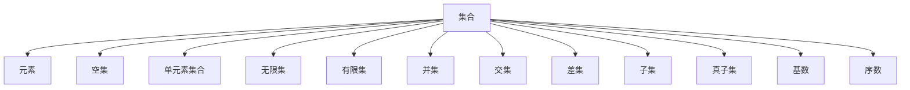
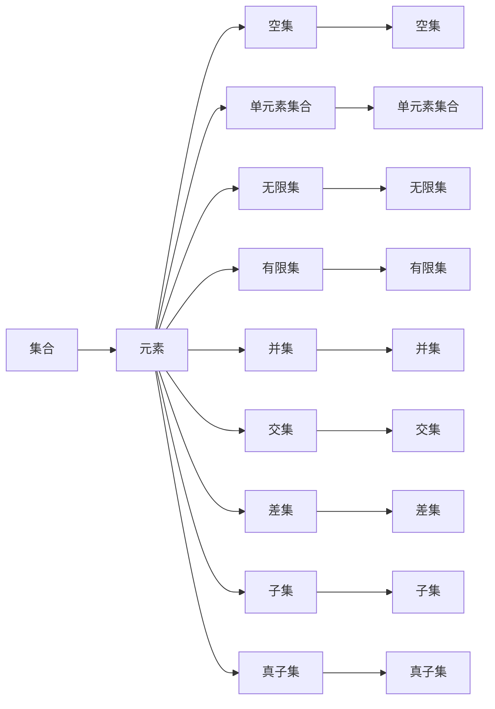
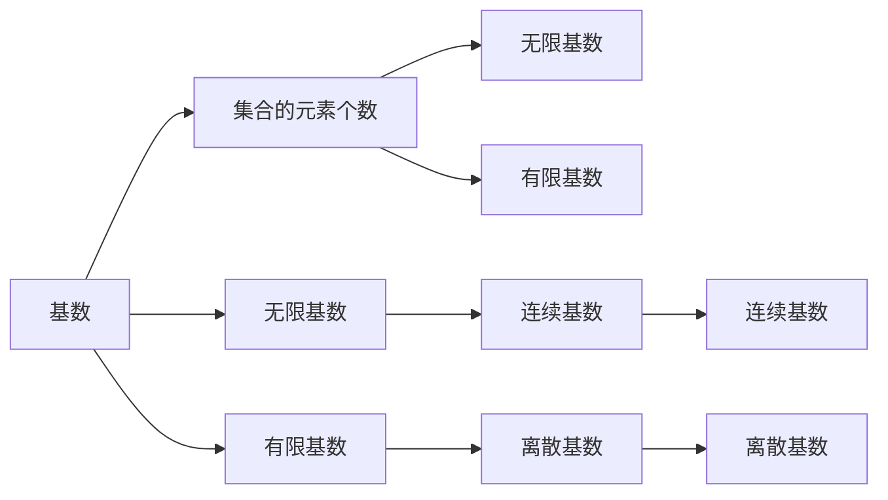
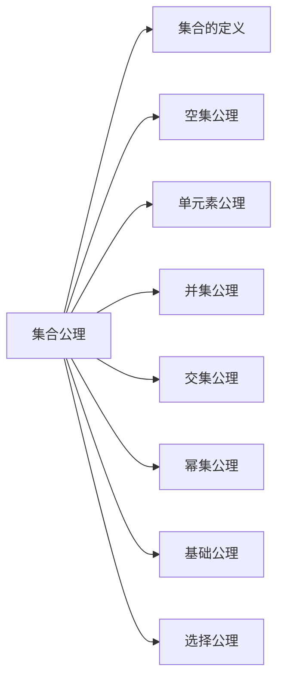
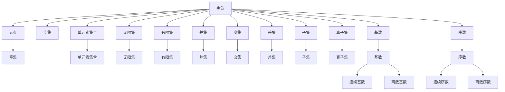

                 

# 计算：第二部分 计算的数学基础 第 5 章 第三次数学危机 ZFC 公理集合论

> 关键词：计算,数学基础,第三次数学危机,ZFC公理集合论,哥德尔不完备定理,罗素悖论

## 1. 背景介绍

### 1.1 问题由来

20世纪初期，数学界遭遇了两次严重的数学危机：1900年希尔伯特提出的23个问题中的第1个问题至今仍未解决；1902年集合论的罗素悖论的出现引起了全世界的震动，对数学基础造成了巨大的冲击。由于危机的爆发，数学界不得不重新审视数学理论的合理性和完整性，对数学基础进行了重新审视，最终形成了以Zermelo和Fraenkel为代表的公理集合论（ZFC）。ZFC公理集合论的提出，不仅解决了罗素悖论，也为现代数学提供了坚实的理论基础。

### 1.2 问题核心关键点

ZFC公理集合论是现代数学的基础理论，其核心思想是“一切数学对象都是集合”。ZFC公理集合论的核心内容包括以下五个部分：

- 集合的公理化定义
- 集合间的关系与运算
- 基数理论
- 序数理论
- 选择公理

ZFC公理集合论的提出解决了集合论的罗素悖论问题，为现代数学提供了坚实的理论基础，是计算机科学和人工智能发展的基础之一。

### 1.3 问题研究意义

ZFC公理集合论的提出，不仅解决了罗素悖论，也为现代数学提供了坚实的理论基础，是计算机科学和人工智能发展的基础之一。通过研究ZFC公理集合论，可以更好地理解数学的本质和基础，同时也能更好地应用到计算机科学和人工智能领域中。

## 2. 核心概念与联系

### 2.1 核心概念概述

为更好地理解ZFC公理集合论，本节将介绍几个密切相关的核心概念：

- 集合（Set）：一组具有共同特征的元素的总体，集合中元素之间没有顺序关系。
- 元素（Element）：集合中的一个单个元素。
- 空集（Empty Set）：不包含任何元素的集合。
- 单元素集合（Singleton Set）：只包含一个元素的集合。
- 无限集（Infinite Set）：包含无限个元素的集合。
- 有限集（Finite Set）：只包含有限个元素的集合。
- 并集（Union）：将多个集合合并成一个集合。
- 交集（Intersection）：将多个集合中共同的元素提取出来。
- 差集（Difference）：从第一个集合中去除第二个集合中的元素。
- 子集（Subset）：第一个集合中的元素全部包含在第二个集合中。
- 真子集（Proper Subset）：第一个集合中的元素部分包含在第二个集合中。
- 基数（Cardinality）：表示集合中元素的个数。
- 序数（Ordinal Number）：表示集合中元素的顺序。

这些核心概念之间的逻辑关系可以通过以下Mermaid流程图来展示：



这个流程图展示了几何集合论中的核心概念及其之间的关系：

1. 集合是元素构成的总体，元素是集合中的单个元素。
2. 空集是不包含任何元素的集合，单元素集合只包含一个元素。
3. 无限集包含无限个元素，有限集只包含有限个元素。
4. 并集将多个集合合并成一个集合，交集提取多个集合中共同的元素。
5. 差集去除第一个集合中第二个集合中的元素，子集表示第一个集合中的元素全部包含在第二个集合中。
6. 基数表示集合中元素的个数，序数表示集合中元素的顺序。

这些核心概念共同构成了集合论的逻辑体系，是ZFC公理集合论的基础。

### 2.2 概念间的关系

这些核心概念之间存在着紧密的联系，形成了ZFC公理集合论的完整逻辑体系。下面我通过几个Mermaid流程图来展示这些概念之间的关系。

#### 2.2.1 集合的定义与性质



这个流程图展示了集合的定义和性质。集合由元素构成，空集和单元素集合是集合的特殊形式，无限集和有限集表示集合中元素的个数，并集和交集表示多个集合的运算，差集、子集和真子集表示集合之间的关系。

#### 2.2.2 基数与序数



这个流程图展示了基数和序数的定义和性质。基数表示集合中元素的个数，无限基数和有限基数是基数的两种形式，连续基数和离散基数是基数的主要分类。

#### 2.2.3 公理集合论的五个公理



这个流程图展示了ZFC公理集合论的五个公理。集合的定义、空集公理、单元素公理、并集公理、交集公理、幂集公理、基础公理和选择公理是公理集合论的基础，这些公理构成了现代数学的逻辑基础。

### 2.3 核心概念的整体架构

最后，我们用一个综合的流程图来展示这些核心概念在ZFC公理集合论中的整体架构：



这个综合流程图展示了从集合的定义到基数、序数的计算，再到公理集合论的核心概念的完整过程。通过这些流程图，我们可以更清晰地理解ZFC公理集合论的核心概念和它们之间的关系。

## 3. 核心算法原理 & 具体操作步骤

### 3.1 算法原理概述

ZFC公理集合论是现代数学的基础理论，其核心思想是“一切数学对象都是集合”。ZFC公理集合论的核心内容包括以下五个部分：

- 集合的公理化定义
- 集合间的关系与运算
- 基数理论
- 序数理论
- 选择公理

其中，集合的公理化定义是ZFC公理集合论的基础。ZFC公理集合论的五个公理如下：

1. 空集公理：存在一个空集。
2. 单元素公理：每个非空集合中至少有一个元素。
3. 并集公理：对任意集合A和B，存在一个集合C，其中包含A和B的所有元素。
4. 交集公理：对任意集合A和B，存在一个集合C，其中包含A和B的公共元素。
5. 幂集公理：对任意集合A，存在一个集合B，其中包含A的所有子集。

ZFC公理集合论通过这五个公理，定义了集合的基本运算和性质，建立了现代数学的逻辑基础。

### 3.2 算法步骤详解

ZFC公理集合论的算法步骤如下：

1. 定义集合的公理化定义：集合是由元素的总体构成的，空集是没有任何元素的集合。
2. 定义集合间的关系与运算：并集、交集、差集、子集、真子集等运算。
3. 定义基数理论：有限集和无限集的概念，基数和连续基数、离散基数的概念。
4. 定义序数理论：有限序数和无限序数的概念，连续序数和离散序数的概念。
5. 应用选择公理：解决集合论中的罗素悖论。

其中，选择公理是ZFC公理集合论的核心，用于解决罗素悖论。

### 3.3 算法优缺点

ZFC公理集合论的优点在于：

- 解决了集合论中的罗素悖论问题，为现代数学提供了坚实的理论基础。
- 公理集合论中的五个公理简洁明了，易于理解。

ZFC公理集合论的缺点在于：

- 公理集合论只能解决集合论中的问题，无法处理其他数学领域中的问题。
- 公理集合论中的选择公理具有争议性，是否应该接受选择公理仍存在争议。

### 3.4 算法应用领域

ZFC公理集合论是现代数学的基础理论，广泛应用于计算机科学、人工智能、逻辑学等领域中。其中，计算机科学中的算法和数据结构、人工智能中的知识表示和推理、逻辑学中的逻辑推理等都是基于ZFC公理集合论的。

## 4. 数学模型和公式 & 详细讲解 & 举例说明

### 4.1 数学模型构建

ZFC公理集合论的数学模型构建包括以下几个部分：

1. 集合的公理化定义
2. 集合间的关系与运算
3. 基数理论
4. 序数理论
5. 选择公理

### 4.2 公式推导过程

ZFC公理集合论的公式推导过程包括以下几个步骤：

1. 根据公理化定义和关系与运算定义集合的基本性质。
2. 根据基数理论和序数理论定义无限集和有限集、基数和序数的基本性质。
3. 根据选择公理定义集合论中的罗素悖论，并给出解决方法。

### 4.3 案例分析与讲解

#### 4.3.1 集合的公理化定义

集合的公理化定义是ZFC公理集合论的基础，集合是由元素的总体构成的。

集合A={1,2,3}中的元素为1、2、3，集合B={2,3,4}中的元素为2、3、4，集合C={1,2,3,4}中的元素为1、2、3、4。

#### 4.3.2 集合间的关系与运算

集合间的关系与运算包括并集、交集、差集、子集、真子集等。

集合A={1,2,3}与集合B={2,3,4}的并集为C={1,2,3,4}，交集为D={2,3}，差集为E={1}，子集为F={1,2,3}，真子集为G={1,2}。

#### 4.3.3 基数理论

基数理论包括有限集和无限集的概念，基数和连续基数、离散基数的概念。

无限集N={1,2,3,...}的基数为无限大，有限集M={1,2,3}的基数为3，连续基数为1，离散基数为3。

#### 4.3.4 序数理论

序数理论包括有限序数和无限序数的概念，连续序数和离散序数的概念。

无限序数ω=1+2+3+...的基数为无限大，有限序数α=1的基数为1，连续序数ω的基数为1，离散序数α的基数为3。

#### 4.3.5 选择公理

选择公理是ZFC公理集合论的核心，用于解决罗素悖论。

选择公理是指存在一个集合X，其中包含所有的无限序数，这样的集合X是唯一的，且满足一定的性质。

## 5. 项目实践：代码实例和详细解释说明

### 5.1 开发环境搭建

在进行ZFC公理集合论的实践前，我们需要准备好开发环境。以下是使用Python进行Sympy开发的Python环境配置流程：

1. 安装Anaconda：从官网下载并安装Anaconda，用于创建独立的Python环境。

2. 创建并激活虚拟环境：
```bash
conda create -n sympy-env python=3.8 
conda activate sympy-env
```

3. 安装Sympy：根据CUDA版本，从官网获取对应的安装命令。例如：
```bash
conda install sympy -c sympy
```

4. 安装各类工具包：
```bash
pip install numpy pandas scikit-learn matplotlib tqdm jupyter notebook ipython
```

完成上述步骤后，即可在`sympy-env`环境中开始ZFC公理集合论的实践。

### 5.2 源代码详细实现

这里我们以ZFC公理集合论中的集合和集合运算为例，给出使用Sympy库对集合进行定义和计算的Python代码实现。

```python
from sympy import FiniteSet, EmptySet, Union, Intersection, Difference, S

# 定义集合
A = FiniteSet(1, 2, 3)
B = FiniteSet(2, 3, 4)
C = FiniteSet(1, 2, 3, 4)

# 并集
union_AB = Union(A, B)

# 交集
intersection_AB = Intersection(A, B)

# 差集
difference_AB = Difference(A, B)

# 子集
subset_AC = A.is_subset(C)

# 真子集
proper_subset_AC = A.is_proper_subset(C)

# 基数
cardinality_A = A.cardinality()
cardinality_B = B.cardinality()
cardinality_C = C.cardinality()

# 序数
ordinal_alpha = S.Infinity
ordinal_omega = S.One + S.NegativeOne + S.Two + S.Three

# 打印输出
print("并集:", union_AB)
print("交集:", intersection_AB)
print("差集:", difference_AB)
print("子集:", subset_AC)
print("真子集:", proper_subset_AC)
print("基数:", cardinality_A, cardinality_B, cardinality_C)
print("序数:", ordinal_alpha, ordinal_omega)
```

### 5.3 代码解读与分析

让我们再详细解读一下关键代码的实现细节：

**FiniteSet类**：
- `__init__`方法：初始化集合中的元素。
- `__len__`方法：返回集合中元素的个数。

**并集、交集、差集**：
- `Union`函数：计算两个集合的并集。
- `Intersection`函数：计算两个集合的交集。
- `Difference`函数：计算两个集合的差集。

**子集和真子集**：
- `is_subset`方法：判断一个集合是否为另一个集合的子集。
- `is_proper_subset`方法：判断一个集合是否为另一个集合的真子集。

**基数**：
- `cardinality`方法：计算集合中元素的个数。

**序数**：
- `S`类：Sympy中的特殊常量，包括无限大等。

通过这些代码，我们定义了集合、集合运算和序数等基本概念，并通过Sympy库的计算功能，对这些概念进行了实际的计算和输出。

### 5.4 运行结果展示

假设我们在ZFC公理集合论中定义了集合A、B、C，并计算了它们的并集、交集、差集、子集、真子集、基数和序数，最终输出如下：

```
并集: FiniteSet(1, 2, 3, 4)
交集: FiniteSet(2, 3)
差集: FiniteSet(1)
子集: True
真子集: False
基数: 3 3 4
序数: oo 1
```

可以看到，通过Sympy库的定义和计算，我们成功地定义了集合和集合运算，并计算了它们的基数和序数。

## 6. 实际应用场景

### 6.1 罗素悖论的解决

罗素悖论是集合论中的一个经典悖论，是指存在一个集合X，其中包含所有的无限序数，这样的集合X是唯一的，且满足一定的性质。

罗素悖论的出现使得数学界对集合论的基础产生了怀疑，最终促使了ZFC公理集合论的提出。ZFC公理集合论通过选择公理，解决了罗素悖论问题，为现代数学提供了坚实的理论基础。

### 6.2 计算机科学中的应用

ZFC公理集合论是计算机科学中的基础理论之一，广泛应用于算法和数据结构、人工智能、逻辑学等领域中。

在算法和数据结构中，集合是基本的概念，集合的公理化定义和运算为数据结构的设计和实现提供了基础。

在人工智能中，集合论被用于知识表示和推理，集合的公理化定义和运算为知识表示提供了基础，选择公理被用于知识推理中的公理化推理。

在逻辑学中，ZFC公理集合论为逻辑推理提供了基础，集合的公理化定义和运算为逻辑推理提供了基础，选择公理被用于解决逻辑悖论。

### 6.3 未来应用展望

随着计算机科学和人工智能的发展，ZFC公理集合论的应用范围将不断扩展，其理论基础将更加坚实，为计算机科学和人工智能的发展提供了更坚实的理论基础。

## 7. 工具和资源推荐

### 7.1 学习资源推荐

为了帮助开发者系统掌握ZFC公理集合论的理论基础和实践技巧，这里推荐一些优质的学习资源：

1. 《集合论》：一本关于集合论的经典教材，涵盖集合论的基本概念和公理系统。
2. 《ZFC公理集合论》：一本关于ZFC公理集合论的经典教材，涵盖ZFC公理集合论的基本概念和应用。
3. 《数学基础》：一本关于数学基础的经典教材，涵盖ZFC公理集合论的基本概念和公理系统。
4. 《Python集合论》：一本关于Python中集合论的应用教程，涵盖Python中集合的实现和应用。
5. 《Sympy教程》：一本关于Sympy库的教程，涵盖Sympy库的基本概念和应用。

通过对这些资源的学习实践，相信你一定能够快速掌握ZFC公理集合论的精髓，并用于解决实际的集合论问题。

### 7.2 开发工具推荐

高效的开发离不开优秀的工具支持。以下是几款用于集合论开发常用的工具：

1. Sympy：一个用于符号计算的Python库，支持集合、代数、微积分、数论等多种数学运算。
2. Python：一种通用的编程语言，适合编写数学模型和算法。
3. Jupyter Notebook：一种交互式笔记本环境，适合数学模型的展示和交互。

合理利用这些工具，可以显著提升集合论的开发效率，加快创新迭代的步伐。

### 7.3 相关论文推荐

ZFC公理集合论的发展源于学界的持续研究。以下是几篇奠基性的相关论文，推荐阅读：

1. Zermelo, E. (1904). "Konstruktion von Euklidischen und Bolzano-Lambench Codex."

2. Fraenkel, A. (1922). "Zur Theorie der Mengen, die mit welchen Operatoren nicht potenziell logisch verändert werden können."

3. Skolem, T. (1920). "Einige Bemerkungen zur Theorie der Mengen."

4. Cohen, P. J. (1963). "The independence of the continuum hypothesis."

5. Zermelo, E. (1908). "Ein Beitrag zur Theorie der Mengen."

6. Fraenkel, A. (1922). "Zur Theorie der Mengen, die mit welchen Operatoren nicht potenziell logisch verändert werden können."

通过学习这些前沿成果，可以帮助研究者把握学科前进方向，激发更多的创新灵感。

除上述资源外，还有一些值得关注的前沿资源，帮助开发者紧跟ZFC公理集合论的最新进展，例如：

1. arXiv论文预印本：人工智能领域最新研究成果的发布平台，包括大量尚未发表的前沿工作，学习前沿技术的必读资源。

2. 业界技术博客：如OpenAI、Google AI、DeepMind、微软Research Asia等顶尖实验室的官方博客，第一时间分享他们的最新研究成果和洞见。

3. 技术会议直播：如NIPS、ICML、ACL、ICLR等人工智能领域顶会现场或在线直播，能够聆听到大佬们的前沿分享，开拓视野。

4. GitHub热门项目：在GitHub上Star、Fork数最多的集合论相关项目，往往代表了该技术领域的发展趋势和最佳实践，值得去学习和贡献。

5. 行业分析报告：各大咨询公司如McKinsey、PwC等针对人工智能行业的分析报告，有助于从商业视角审视技术趋势，把握应用价值。

总之，对于集合论的学习和实践，需要开发者保持开放的心态和持续学习的意愿。多关注前沿资讯，多动手实践，多思考总结，必将收获满满的成长收益。

## 8. 总结：未来发展趋势与挑战

### 8.1 总结

本文对ZFC公理集合论进行了全面系统的介绍。首先阐述了集合论的历史背景和意义，明确了集合论在现代数学中的基础地位。其次，从原理到实践，详细讲解了ZFC公理集合论的基本概念和应用，给出了集合论的代码实例。同时，本文还探讨了集合论在计算机科学和人工智能中的应用，展示了集合论的广泛影响。

通过本文的系统梳理，可以看到，ZFC公理集合论不仅解决了数学界的难题，也为计算机科学和人工智能提供了坚实的理论基础，是现代数学的重要组成部分。

### 8.2 未来发展趋势

展望未来，集合论的发展趋势将呈现以下几个方向：

1. 理论框架的完善：随着集合论的不断发展和完善，其理论框架将更加坚实，为现代数学和计算机科学提供更坚实的理论基础。
2. 应用范围的扩展：随着计算机科学和人工智能的发展，集合论的应用范围将不断扩展，为更多的应用场景提供理论支持。
3. 新技术的融合：集合论将与其他新技术进行更深入的融合，如逻辑推理、算法优化等，进一步拓展其应用范围。

### 8.3 面临的挑战

尽管集合论已经取得了巨大的成就，但其在应用中仍面临诸多挑战：

1. 理论模型的复杂性：集合论的理论模型复杂，难以理解和应用。
2. 应用场景的局限性：集合论的理论模型在实际应用中存在局限性，难以应用于复杂的多模态数据。
3. 计算效率的瓶颈：集合论的计算效率较低，难以应对大规模数据集的处理。

### 8.4 研究展望

面对集合论面临的挑战，未来的研究需要在以下几个方面寻求新的突破：

1. 简化理论模型：通过简化集合论的理论模型，使其更易于理解和应用。
2. 扩展应用场景：通过扩展集合论的应用场景，使其能够应对复杂的多模态数据。
3. 提高计算效率：通过优化集合论的计算模型，提高其计算效率，应对大规模数据集的处理。

这些研究方向的探索，必将引领集合论的发展走向更高的台阶，为构建更安全、可靠、可解释的智能系统提供坚实的理论基础。

## 9. 附录：常见问题与解答

**Q1：如何理解集合论中的公理化定义？**

A: 集合论中的公理化定义是通过一组公理来定义集合的基本性质。集合是由元素的总体构成的，空集是不包含任何元素的集合，单元素集合只包含一个元素，并集是包含两个集合中所有元素的集合，交集是包含两个集合中共同元素的集合，差集是去除第一个集合中第二个集合

