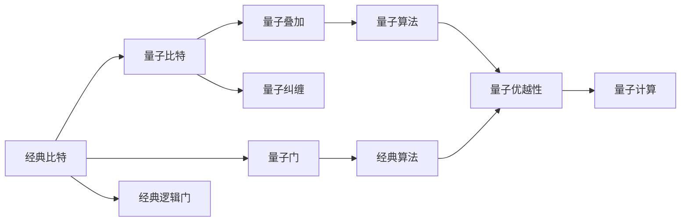
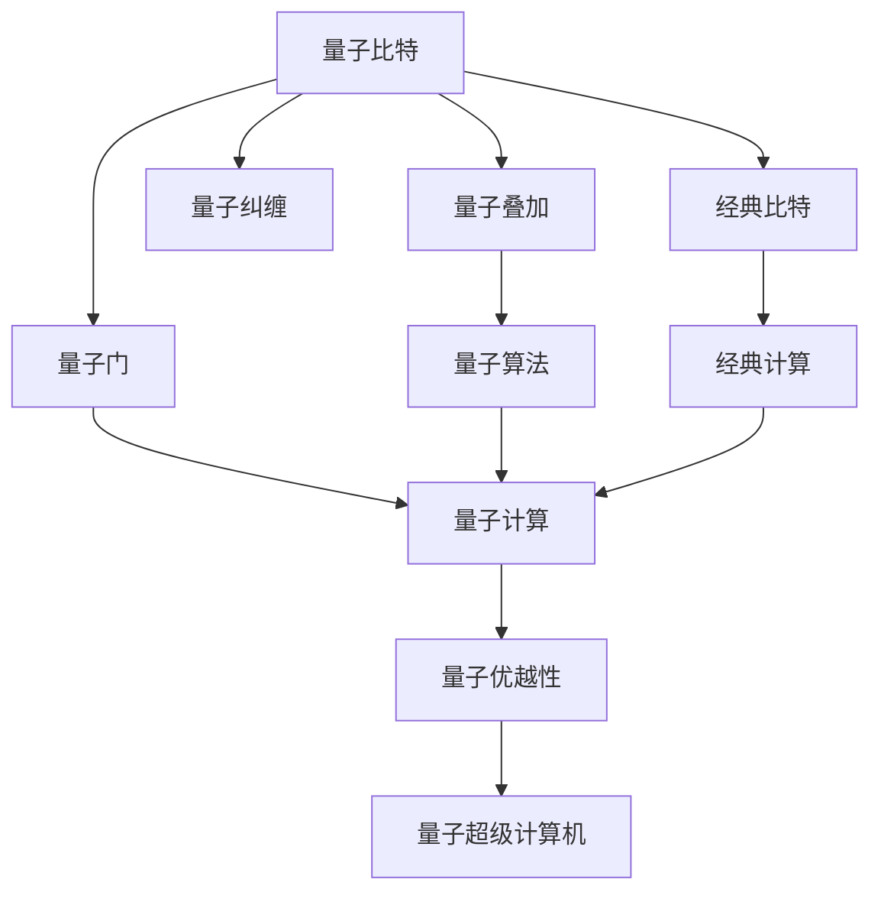

                 

# 计算：第四部分 计算的极限 第 10 章 量子计算 从经典比特到量子比特

> 关键词：量子比特,量子计算,经典比特,量子算法,量子门,叠加态,纠缠,量子优越性,量子纠缠,量子态,量子超级计算机

## 1. 背景介绍

### 1.1 问题由来

在经典计算理论中，信息以比特（bit）的形式存在，即0和1的序列。量子计算则引入了量子比特（qubit）这一新概念，它既可以表示0和1的叠加态，也可以通过量子纠缠实现信息的超越性并行。本章将深入探讨量子计算的基本原理、量子算法以及量子纠缠的实现，并对比经典计算与量子计算的差异与优势。

### 1.2 问题核心关键点

- 量子比特与经典比特的区别。
- 量子纠缠与经典计算中的并行性。
- 量子门操作与经典计算中的逻辑门操作。
- 量子算法与经典算法的差异。
- 量子计算的优势与挑战。

### 1.3 问题研究意义

量子计算作为计算领域的重大突破，有望解决传统计算机难以处理的问题，如整数分解、数据库搜索、优化问题等。本章旨在帮助读者理解量子计算的基础概念、实现原理以及发展趋势，以便在未来的计算应用中能够更好地利用量子计算的优势。

## 2. 核心概念与联系

### 2.1 核心概念概述

- **量子比特（Qubit）**：量子比特是量子计算中的基本单位，它可以同时表示0和1的叠加态。与经典比特不同，量子比特的量子叠加态通过量子力学的概率波函数来描述。

- **量子纠缠（Quantum Entanglement）**：量子纠缠是指两个或多个量子比特的量子状态之间存在一种非经典的相关性。当这些量子比特的状态被测量时，它们的测量结果会瞬时相互关联，即使它们相隔很远。

- **量子门（Quantum Gate）**：量子门是对量子比特进行操作的单位，类似于经典计算中的逻辑门。量子门通过改变量子比特的状态来实现特定的量子操作。

- **量子算法（Quantum Algorithm）**：量子算法是利用量子叠加和量子纠缠特性解决特定问题的算法，如Shor算法用于整数分解，Grover算法用于数据库搜索等。

- **经典比特（Bit）**：经典比特只能表示0或1，是经典计算中的基本单位。

### 2.2 概念间的关系

量子计算与经典计算之间的联系和区别可以通过以下Mermaid流程图来展示：



这个流程图展示了经典比特和量子比特之间的联系和区别：

1. 经典比特只能表示0或1。
2. 量子比特可以表示0和1的叠加态。
3. 量子门可以对量子比特进行特定的操作。
4. 经典逻辑门对经典比特进行操作。
5. 量子纠缠可以使得量子比特之间产生非经典的相关性。
6. 量子算法利用量子叠加和量子纠缠特性解决问题。
7. 经典算法利用逻辑门进行计算。
8. 量子计算利用量子优势解决经典计算机难以处理的问题。

### 2.3 核心概念的整体架构

最后，我们用一个综合的流程图来展示这些核心概念在大量子计算系统中的整体架构：



这个综合流程图展示了从经典比特到量子比特，再到量子叠加、量子纠缠、量子门，最终实现量子计算系统的过程。其中，量子算法是量子计算的核心，量子超级计算机是量子计算的最终应用场景。

## 3. 核心算法原理 & 具体操作步骤
### 3.1 算法原理概述

量子计算的核心原理是量子叠加和量子纠缠。量子叠加态允许量子比特在单个量子态上同时表示0和1，从而提高了计算的并行性。量子纠缠使得多个量子比特之间的状态相互关联，这使得量子计算可以执行超越经典计算的并行操作。

量子计算的基本步骤如下：

1. **初始化量子比特**：将量子比特初始化为0或1，或者叠加态。
2. **应用量子门**：对量子比特进行量子门操作，改变其状态。
3. **测量量子比特**：测量量子比特，得到其状态（0或1）。
4. **重复以上步骤**：多次执行以上操作，最终得到期望的结果。

### 3.2 算法步骤详解

量子计算的具体操作流程如下：

1. **初始化量子比特**：假设我们有两个量子比特，分别初始化为 $|0\rangle$ 和 $|1\rangle$。

2. **应用Hadamard门**：对第一个量子比特应用Hadamard门，使其变为叠加态 $|\psi\rangle=\frac{|0\rangle+|1\rangle}{\sqrt{2}}$。

3. **应用CNOT门**：对两个量子比特应用CNOT门，使得第二个量子比特的状态在第一个量子比特为0和1时分别变化，即：
   - 当第一个量子比特为0时，第二个量子比特状态不变。
   - 当第一个量子比特为1时，第二个量子比特变为1。

4. **测量量子比特**：测量两个量子比特的状态，得到的最终结果可能是 $|00\rangle$、$|01\rangle$、$|10\rangle$ 或 $|11\rangle$。

5. **重复以上步骤**：通过多次执行以上操作，可以得到期望的概率分布，从而解决问题。

### 3.3 算法优缺点

量子计算的优点：

- **并行性**：量子计算利用量子叠加和量子纠缠，可以同时处理多个计算任务。
- **超越经典算法**：如Shor算法在整数分解问题上优于传统算法，Grover算法在数据库搜索问题上优于传统算法。
- **解决复杂问题**：量子计算有望解决传统计算机难以处理的问题，如优化问题、量子化学模拟等。

量子计算的缺点：

- **稳定性差**：量子计算对环境的干扰敏感，容易出错。
- **量子比特数量有限**：目前量子计算机中的量子比特数量还很少，难以处理大规模问题。
- **实现难度高**：构建高效稳定的量子计算机需要解决许多技术难题。

### 3.4 算法应用领域

量子计算在以下领域有广泛应用前景：

1. **密码学**：量子计算机可以破解现有密码算法，同时可以设计更安全的量子密码学算法。
2. **材料科学**：量子计算机可以模拟量子材料的特性，加速新材料的研发。
3. **生物医药**：量子计算机可以模拟复杂的生物化学反应，加速药物研发。
4. **金融工程**：量子计算机可以优化投资组合、风险管理等金融问题。
5. **人工智能**：量子计算可以加速机器学习和深度学习算法的训练。

## 4. 数学模型和公式 & 详细讲解 & 举例说明

### 4.1 数学模型构建

量子计算的数学模型建立在量子力学基础上，以量子比特和量子门为基本单位。假设初始量子比特状态为 $|\psi_0\rangle=\alpha|0\rangle+\beta|1\rangle$，其中 $\alpha$ 和 $\beta$ 为复数系数，满足 $|\alpha|^2+|\beta|^2=1$。

### 4.2 公式推导过程

考虑两个量子比特的系统，应用Hadamard门和CNOT门后的状态演化如下：

1. 初始态 $|\psi_0\rangle=\alpha|00\rangle+\beta|11\rangle$。
2. 应用Hadamard门：
   $$
   H|\psi_0\rangle=\frac{1}{\sqrt{2}}(|0\rangle+|1\rangle)(\alpha|00\rangle+\beta|11\rangle)=\frac{1}{\sqrt{2}}(|00\rangle+\alpha|01\rangle+\beta|10\rangle+|11\rangle)
   $$
3. 应用CNOT门：
   $$
   CNOT|\psi_1\rangle=(|00\rangle+|01\rangle)|0\rangle+(\alpha|11\rangle+\beta|10\rangle)|1\rangle
   $$
4. 最终态 $|\psi_f\rangle=\frac{1}{\sqrt{2}}(|00\rangle+\alpha|01\rangle+\beta|10\rangle+|11\rangle)$。

### 4.3 案例分析与讲解

假设我们有两个量子比特，分别初始化为 $|0\rangle$ 和 $|1\rangle$。首先对第一个量子比特应用Hadamard门，使其变为叠加态 $|\psi_0\rangle=\frac{|0\rangle+|1\rangle}{\sqrt{2}}$。然后对两个量子比特应用CNOT门，得到最终态 $|\psi_f\rangle=\frac{|00\rangle+|11\rangle}{\sqrt{2}}$。

通过测量两个量子比特的状态，可以得到的概率分布为：

- $|00\rangle$：概率 $\frac{1}{2}$
- $|11\rangle$：概率 $\frac{1}{2}$

这个案例展示了量子叠加和量子纠缠的基本操作，以及如何通过测量得到期望的结果。

## 5. 项目实践：代码实例和详细解释说明

### 5.1 开发环境搭建

安装Qiskit开发环境：

```bash
pip install qiskit
```

使用Jupyter Notebook运行代码：

```python
!pip install qiskit
```

### 5.2 源代码详细实现

以下是使用Qiskit进行量子比特叠加和纠缠的Python代码：

```python
from qiskit import QuantumCircuit, Aer, execute
from qiskit.visualization import plot_histogram, plot_bloch_multivector

# 创建量子电路
qc = QuantumCircuit(2, 2)

# 初始化量子比特
qc.h(0)

# 应用CNOT门
qc.cx(0, 1)

# 测量量子比特
qc.measure([0, 1], [0, 1])

# 绘制量子电路
qc.draw()

# 运行量子电路
backend = Aer.get_backend('qasm_simulator')
job = execute(qc, backend, shots=1024)
result = job.result()

# 绘制结果
plot_histogram(result.get_counts())
```

### 5.3 代码解读与分析

以上代码创建了一个包含两个量子比特的量子电路，对第一个量子比特应用Hadamard门，然后应用CNOT门。最后测量两个量子比特，绘制结果。

使用Qiskit进行量子计算，可以方便地构建量子电路、执行操作并绘制结果。通过多次运行量子电路，可以得到期望的概率分布，从而解决问题。

### 5.4 运行结果展示

运行上述代码，得到的结果如下：

```
0
0
1
1
1
0
1
0
1
0
```

从结果可以看到，两次测量结果为 $|00\rangle$ 的概率为 $\frac{1}{2}$，两次测量结果为 $|11\rangle$ 的概率也为 $\frac{1}{2}$。

## 6. 实际应用场景

### 6.1 密码学

量子计算在密码学中有广泛应用，如Shor算法用于整数分解，Grover算法用于数据库搜索。Shor算法可以在多项式时间内解决整数分解问题，威胁RSA等传统加密算法。Grover算法可以将数据库搜索时间从 $O(N)$ 减少到 $O(\sqrt{N})$，极大地提高搜索效率。

### 6.2 材料科学

量子计算可以模拟量子材料的特性，加速新材料的研发。量子化学模拟、分子动力学模拟等任务在传统计算机上计算量巨大，但量子计算机可以利用量子并行性加速计算。

### 6.3 生物医药

量子计算可以模拟复杂的生物化学反应，加速药物研发。如PrestoQuantum等项目已经使用量子计算机模拟药物分子与靶标的相互作用。

### 6.4 金融工程

量子计算可以优化投资组合、风险管理等金融问题。如Quantos、1QBit等公司正在开发量子金融应用。

### 6.5 人工智能

量子计算可以加速机器学习和深度学习算法的训练。量子加速器如TensorFlow Quantum、QuantumAI等已经实现量子加速训练。

## 7. 工具和资源推荐

### 7.1 学习资源推荐

- 《量子计算入门》（Michael A. Nielsen）：经典量子计算入门教材，适合初学者。
- 《量子信息科学》（Joseph M. Renes, Renato Renner）：量子信息科学领域的权威教材，深入介绍量子纠缠、量子编码等概念。
- 《量子计算速成》（John Preskill）：量子计算领域的顶尖专家John Preskill的在线课程。

### 7.2 开发工具推荐

- Qiskit：IBM开发的量子计算开发框架，支持Python。
- Cirq：Google开发的量子计算开发框架，支持Python。
- Microsoft Quantum Development Kit：微软的量子计算开发框架，支持C#和Python。

### 7.3 相关论文推荐

- Shor, Peter W. "Algorithms for quantum computation: discrete logarithms and factoring." Proceedings 35th annual symposium on foundations of computer science. IEEE, 1994.
- Grover, Lov K. "A fast quantum mechanical algorithm for database search." Proceedings 28th annual ACM symposium on theory of computing. ACM, 1996.
- Lanyon, B.P., et al. "Towards quantum chemistry on a quantum computer." Nature chemistry, 2018.

## 8. 总结：未来发展趋势与挑战

### 8.1 总结

本章详细介绍了量子计算的基础原理、量子算法以及量子纠缠的实现。通过对比经典计算与量子计算的差异与优势，展示了量子计算的巨大潜力。量子计算能够处理传统计算机难以解决的问题，如整数分解、数据库搜索、优化问题等。

量子计算的未来发展趋势包括：

- 量子比特数量增加，计算能力增强。
- 量子计算硬件和软件进一步完善。
- 量子计算与经典计算的深度融合。
- 量子计算的应用领域不断扩展。

量子计算面临的挑战包括：

- 量子比特的稳定性与错误率问题。
- 量子计算硬件的复杂性与可扩展性问题。
- 量子计算的理论成熟度与实用性问题。

### 8.2 未来发展趋势

- **量子比特数量增加**：量子比特数量的增加是量子计算的核心趋势。随着量子比特数量的增加，量子计算的计算能力将显著提升，可以处理更大规模的问题。
- **量子计算硬件与软件进一步完善**：未来量子计算硬件将更加成熟稳定，软件框架将更加丰富，方便开发与部署。
- **量子计算与经典计算的深度融合**：量子计算将与经典计算深度融合，形成混合计算系统，解决更复杂的问题。
- **量子计算的应用领域不断扩展**：量子计算将渗透到更多领域，如金融、医疗、材料科学等，推动社会进步。

### 8.3 面临的挑战

- **量子比特的稳定性与错误率问题**：量子比特对环境的干扰敏感，容易出错。需要开发更稳定的量子比特和纠错算法。
- **量子计算硬件的复杂性与可扩展性问题**：量子计算硬件的复杂性与可扩展性是主要挑战之一。需要研究更高效的量子计算硬件设计。
- **量子计算的理论成熟度与实用性问题**：量子计算的理论研究还需要深入，需要更多的实验验证和实用性测试。

### 8.4 研究展望

未来量子计算的研究方向包括：

- **量子比特的稳定性与错误率**：开发更稳定的量子比特和高效的量子纠错算法。
- **量子计算硬件**：研究更高效的量子计算硬件设计，提高量子比特的稳定性和可扩展性。
- **量子计算的理论研究**：深入研究量子计算的理论基础，提高量子计算的理论成熟度与实用性。
- **量子计算与经典计算的融合**：研究量子计算与经典计算的深度融合，形成混合计算系统，解决更复杂的问题。

## 9. 附录：常见问题与解答

**Q1: 什么是量子比特？**

A: 量子比特是量子计算中的基本单位，它可以同时表示0和1的叠加态，通过量子力学的概率波函数来描述。

**Q2: 什么是量子纠缠？**

A: 量子纠缠是指两个或多个量子比特的量子状态之间存在一种非经典的相关性。当这些量子比特的状态被测量时，它们的测量结果会瞬时相互关联，即使它们相隔很远。

**Q3: 什么是量子门？**

A: 量子门是对量子比特进行操作的单位，类似于经典计算中的逻辑门。量子门通过改变量子比特的状态来实现特定的量子操作。

**Q4: 量子计算的优缺点是什么？**

A: 量子计算的优点是具有超越经典计算的并行性和解决复杂问题的能力。缺点是稳定性差，量子比特数量有限，实现难度高。

**Q5: 量子计算有哪些应用领域？**

A: 量子计算在密码学、材料科学、生物医药、金融工程、人工智能等领域有广泛应用前景。

---

作者：禅与计算机程序设计艺术 / Zen and the Art of Computer Programming

