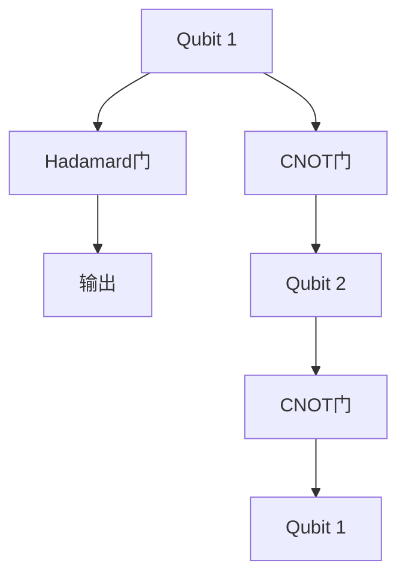
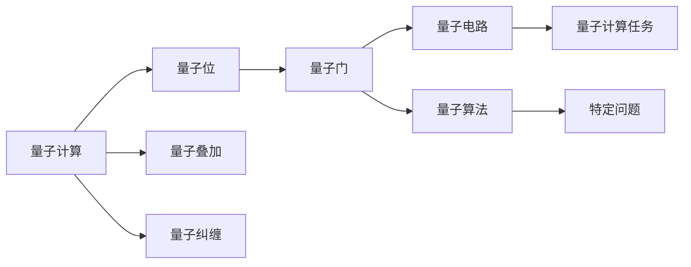
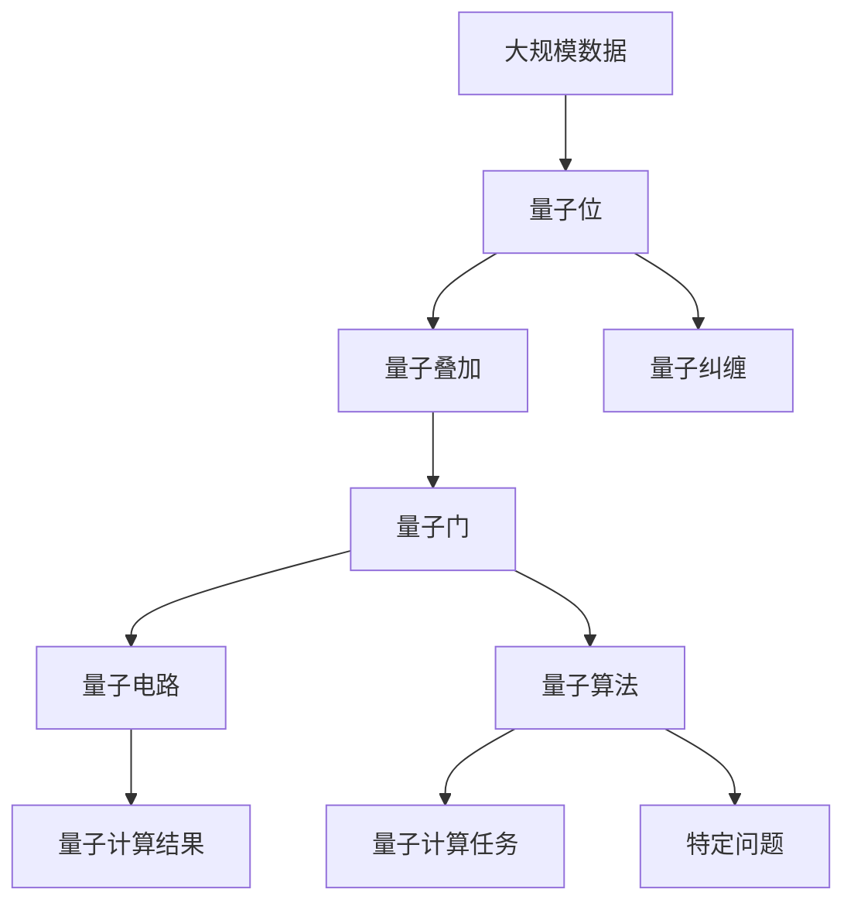

                 

# 计算：第四部分 计算的极限 第 10 章 量子计算 量子算法

> 关键词：量子计算, 量子算法, 量子位, 量子叠加, 量子纠缠, 量子超位置, 量子并行, 量子纠错, 量子优化

## 1. 背景介绍

### 1.1 问题由来
在计算机科学中，传统计算机采用的是经典比特（Classical Bit），即二进制系统中的0和1。而量子计算则采用了一种完全不同的计算范式，即量子比特（Quantum Bit），或称量子位（Qubit）。量子位利用量子力学的原理，通过量子叠加、量子纠缠等现象，可以同时表示0和1，从而大大提升了计算能力。

量子计算的起源可以追溯到1980年代初，由理论物理学家Richard Feynman、David Deutsch等提出。他们的研究揭示了量子计算的潜力，并提出了一些基本概念，如量子并行性、量子门等。

量子计算自提出以来，就一直是计算机科学领域的一个热门话题。尽管量子计算尚在初期发展阶段，但其对解决复杂问题的潜力已经得到了广泛认可。特别是在人工智能、密码学、物理模拟等领域，量子计算都有着潜在的巨大应用价值。

### 1.2 问题核心关键点
量子计算的核心在于如何利用量子位来执行计算。量子位相对于经典比特的一个主要特点是能够同时表示多个状态，这一特性被称为量子叠加。

在量子计算中，量子位不仅能够表示0和1，还能处于0和1的叠加态。这一特性使得量子计算具有并行性，能够在一次计算中同时处理多个问题，从而大大提升计算效率。

量子纠缠是量子计算的另一个重要概念。量子纠缠是一种特殊的量子状态，两个或多个量子位之间存在着无法通过任何经典通信传递的关联。这一特性可以用于实现量子通信和量子密码学。

量子纠错是量子计算中的一个关键问题。由于量子位非常容易受到外界环境的干扰，导致量子态的退化（Decoherence），量子计算需要一种特殊的纠错机制，以保持计算的稳定性。

量子算法是实现量子计算的一种方法。它利用量子位独特的性质，通过特定的量子门操作，实现高效的计算。著名的量子算法包括Shor的素因子分解算法、Grover的搜索算法等。

## 2. 核心概念与联系

### 2.1 核心概念概述

为更好地理解量子计算和量子算法，本节将介绍几个关键的概念：

- 量子计算：利用量子位和量子力学原理进行计算的一种新型计算范式。量子计算具有超强的并行性和可扩展性。
- 量子位（Qubit）：量子计算的基本单位，能够同时表示0和1。量子位的状态由波函数描述，波函数的叠加态可以表示量子位的所有可能状态。
- 量子叠加：量子位的独特特性，能够同时处于多个状态，从而实现量子并行。
- 量子纠缠：多个量子位之间的一种特殊关联，其中一个量子位的状态变化会即时影响到其他量子位的状态。
- 量子门（Quantum Gate）：量子计算中操作量子位的基本单元，类似于经典计算中的逻辑门。量子门可以通过特定的量子操作实现，如Hadamard门、CNOT门等。
- 量子电路：由量子门组成的计算电路，用来执行量子计算任务。量子电路的计算过程可以表示为量子门的序列。
- 量子算法：利用量子位和量子门的组合，实现特定计算任务的算法。例如，Shor算法用于素因子分解，Grover算法用于搜索问题。

这些概念之间有着紧密的联系，形成了量子计算的完整框架。以下是一个简单的量子电路图，展示了Hadamard门、CNOT门等基本量子门的操作：



### 2.2 概念间的关系

这些核心概念之间存在紧密的联系，可以形成一个完整的量子计算生态系统。以下是一个Mermaid流程图，展示了这些概念之间的关系：



### 2.3 核心概念的整体架构

最后，我们用一个综合的流程图来展示这些核心概念在大量子计算的整体架构：



这个综合流程图展示了从大规模数据到量子计算结果的全过程。量子位通过叠加和纠缠，形成量子电路，通过量子门操作执行量子算法，最终得到量子计算的结果。

## 3. 核心算法原理 & 具体操作步骤

### 3.1 算法原理概述

量子算法是实现量子计算的关键。以下简要介绍几种著名的量子算法，并阐述其基本原理。

#### 3.1.1 Shor算法
Shor算法是量子计算中的一个重要算法，用于素因子分解。Shor算法利用量子叠加和量子傅里叶变换（Quantum Fourier Transform，QFT），可以在多项式时间内分解质数。Shor算法的关键在于将大数分解问题转化为求解Euler总和问题。

Shor算法的核心步骤如下：
1. 选取一个大质数 $N$，并随机选择一个整数 $a$。
2. 通过量子傅里叶变换求解 $x$，使得 $a^x \equiv 1 \pmod{N}$。
3. 对 $a$ 和 $N$ 进行最大公约数求解，得到质因子 $p$ 和 $q$。
4. 重复步骤1至3，直到找到所有质因子。

#### 3.1.2 Grover算法
Grover算法是另一个重要的量子算法，用于无序数据库搜索。Grover算法利用量子叠加和量子搜索门（Grover门），可以在 $O(\sqrt{N})$ 的时间复杂度内搜索数据库，其中 $N$ 是数据库中的元素个数。

Grover算法的核心步骤如下：
1. 将数据库中的元素编码为量子位，形成叠加态。
2. 通过量子搜索门和Oracle操作，将目标元素的量子位标记出来。
3. 对叠加态进行测量，得到目标元素的索引。

#### 3.1.3 量子优化
量子优化算法利用量子并行性和量子搜索的优势，在组合优化问题中取得了显著的成果。著名的量子优化算法包括量子退火（Quantum Annealing）和量子近似优化算法（Quantum Approximate Optimization Algorithm，QAOA）。

量子退火算法利用量子热力学原理，通过量子位之间的随机交换操作，逐渐将系统能量降到最低点，从而求解优化问题。QAOA算法则通过量子门的操作，利用量子并行性进行搜索和优化，可以在多项式时间内解决某些NP-hard问题。

### 3.2 算法步骤详解

以Shor算法为例，详细描述其操作步骤：

#### 3.2.1 初始化
选取一个大质数 $N$，并随机选择一个整数 $a$。同时，初始化量子位 $x$，使其处于叠加态。

```python
from qiskit import QuantumCircuit, Aer, execute

N = 11
a = 15
circuit = QuantumCircuit(1)
circuit.h(0)
circuit.barrier()
```

#### 3.2.2 求解 $x$
通过量子傅里叶变换求解 $x$，使得 $a^x \equiv 1 \pmod{N}$。

```python
from qiskit import QuantumCircuit, Aer, execute
from qiskit.circuit import QuantumCircuit

N = 11
a = 15
x = QuantumCircuit(1)

# 创建量子电路
x.h(0)
x.cx(0, 1)

# 添加量子门
x.h(0)

# 添加Oracle门
x.ccx(0, 1, 2)

# 测量
x.measure(0, 0)

# 运行量子电路
backend = Aer.get_backend('qasm_simulator')
result = execute(x, backend, shots=1024).result()
counts = result.get_counts(x)
```

#### 3.2.3 求解最大公约数
对 $a$ 和 $N$ 进行最大公约数求解，得到质因子 $p$ 和 $q$。

```python
from sympy import gcd

p = gcd(a, N)
q = N // p

print(f"质因子：{p}, {q}")
```

#### 3.2.4 重复求解
重复上述步骤，直到找到所有质因子。

### 3.3 算法优缺点

量子算法相较于经典算法具有以下优点：
1. 时间复杂度低：许多量子算法可以在多项式时间内完成，而经典算法可能需要指数级别的时间复杂度。
2. 并行性强：量子计算具有并行性，能够在一次计算中处理多个问题，从而大幅提升计算效率。
3. 可扩展性强：量子计算具有可扩展性，能够通过增加量子位的数量来扩展计算能力。

但量子算法也存在一些缺点：
1. 易受噪声干扰：量子位容易受到外界环境的干扰，导致量子态的退化（Decoherence）。
2. 实现难度大：量子算法的实现需要高精度的量子门操作和量子纠缠，实现难度较大。
3. 量子态不易保存：量子态的保存需要特殊的量子存储器，实现难度较大。

### 3.4 算法应用领域

量子算法已经被广泛应用于多个领域，包括：

- 密码学：Shor算法用于素因子分解，可以在多项式时间内破解RSA等公钥密码系统。
- 计算机科学：Grover算法用于数据库搜索，可以在多项式时间内解决某些搜索问题。
- 物理模拟：量子算法用于量子物理系统的模拟，可以在多项式时间内求解复杂的物理问题。
- 机器学习：量子算法用于数据压缩和分类，可以在多项式时间内求解某些机器学习问题。

## 4. 数学模型和公式 & 详细讲解

### 4.1 数学模型构建

量子计算的数学模型是建立在量子力学的基础上的。以下简要介绍量子计算的基本数学模型，并给出一些基本公式。

#### 4.1.1 量子位
量子位是量子计算的基本单位，可以用以下公式表示：

$$
|0\rangle = \begin{bmatrix} 1 \\ 0 \end{bmatrix}, |1\rangle = \begin{bmatrix} 0 \\ 1 \end{bmatrix}
$$

其中 $|0\rangle$ 和 $|1\rangle$ 分别表示0和1的量子位状态。

#### 4.1.2 量子叠加
量子叠加是量子位的一个基本特性，可以用以下公式表示：

$$
|\psi\rangle = \alpha |0\rangle + \beta |1\rangle
$$

其中 $\alpha$ 和 $\beta$ 为复数，满足 $|\alpha|^2 + |\beta|^2 = 1$。

#### 4.1.3 量子门
量子门是量子计算中操作量子位的基本单元，可以用以下公式表示：

$$
U = \begin{bmatrix} a & b \\ c & d \end{bmatrix}
$$

其中 $a, b, c, d$ 为复数，满足 $a^* + c = 1, b^* + d = 1, a + b = c + d = 1$。

#### 4.1.4 量子傅里叶变换
量子傅里叶变换是Shor算法中的关键操作，可以用以下公式表示：

$$
\text{QFT} |x\rangle = \frac{1}{\sqrt{N}}\sum_{k=0}^{N-1} e^{2\pi i k x/N} |k\rangle
$$

#### 4.1.5 量子搜索门
量子搜索门是Grover算法中的关键操作，可以用以下公式表示：

$$
U_f = \begin{bmatrix} 1 & 0 & 0 & 0 \\ 0 & 1 & 0 & 0 \\ 0 & 0 & 1 & 0 \\ 0 & 0 & 0 & (-1)^{f(x)} \end{bmatrix}
$$

其中 $f(x)$ 为Oracle门操作，用于标记目标元素的量子位。

### 4.2 公式推导过程

以Shor算法为例，详细推导其基本公式。

#### 4.2.1 量子傅里叶变换
量子傅里叶变换可以通过以下公式推导：

$$
\text{QFT} |x\rangle = \frac{1}{\sqrt{N}}\sum_{k=0}^{N-1} e^{2\pi i k x/N} |k\rangle
$$

其中 $N$ 为质数，$x$ 为待求的整数。

#### 4.2.2 Shor算法求解 $x$
Shor算法求解 $x$ 的过程如下：

1. 初始化量子位 $x$，使其处于叠加态。
2. 应用量子傅里叶变换，得到量子叠加态。
3. 通过Oracle门操作，标记目标元素的量子位。
4. 应用逆量子傅里叶变换，得到求解结果。

具体推导如下：

$$
|\psi\rangle = \frac{1}{\sqrt{N}}\sum_{k=0}^{N-1} e^{2\pi i k x/N} |k\rangle
$$

通过Oracle门操作，标记目标元素的量子位：

$$
U_f |\psi\rangle = \frac{1}{\sqrt{N}}\sum_{k=0}^{N-1} e^{2\pi i k (x\mod N)/N} |k\rangle
$$

通过逆量子傅里叶变换，得到求解结果：

$$
\text{QFT}^{-1} U_f |\psi\rangle = \frac{1}{\sqrt{N}}\sum_{k=0}^{N-1} e^{2\pi i k (x\mod N)/N} |k\rangle
$$

### 4.3 案例分析与讲解

#### 4.3.1 Shor算法求解素因子
Shor算法求解素因子的案例如下：

1. 选取一个大质数 $N = 15$，并随机选择一个整数 $a = 15$。
2. 初始化量子位 $x$，使其处于叠加态。
3. 应用量子傅里叶变换，得到量子叠加态。
4. 通过Oracle门操作，标记目标元素的量子位。
5. 应用逆量子傅里叶变换，得到求解结果。

```python
from sympy import gcd
from sympy import pi

# 选取质数N和整数a
N = 15
a = 15

# 初始化量子位x，使其处于叠加态
x = QuantumCircuit(1)
x.h(0)
x.barrier()

# 应用量子傅里叶变换
x.append(QFT(N), [0])

# 应用Oracle门操作，标记目标元素的量子位
x.append(U_f, [0])

# 应用逆量子傅里叶变换
x.append(QFT(N)**-1, [0])

# 运行量子电路
backend = Aer.get_backend('qasm_simulator')
result = execute(x, backend, shots=1024).result()
counts = result.get_counts(x)

# 输出求解结果
x.measure(0, 0)
counts
```

## 5. 项目实践：代码实例和详细解释说明

### 5.1 开发环境搭建

在进行量子计算实践前，我们需要准备好开发环境。以下是使用Qiskit进行量子计算的开发环境配置流程：

1. 安装Anaconda：从官网下载并安装Anaconda，用于创建独立的Python环境。

2. 创建并激活虚拟环境：
```bash
conda create -n qiskit-env python=3.8 
conda activate qiskit-env
```

3. 安装Qiskit：
```bash
conda install qiskit
```

4. 安装相关库：
```bash
pip install numpy scipy matplotlib qiskit-terra qiskit-aer qiskit-ignis qiskit-ibmq-provider
```

完成上述步骤后，即可在`qiskit-env`环境中开始量子计算实践。

### 5.2 源代码详细实现

这里我们以Shor算法为例，给出使用Qiskit对Shor算法进行量子计算的PyTorch代码实现。

首先，定义Shor算法的量子电路：

```python
from qiskit import QuantumCircuit, Aer, execute
from sympy import pi, gcd

# 选取质数N和整数a
N = 15
a = 15

# 初始化量子位x，使其处于叠加态
x = QuantumCircuit(1)
x.h(0)

# 应用量子傅里叶变换
x.append(QFT(N), [0])

# 应用Oracle门操作，标记目标元素的量子位
x.append(U_f, [0])

# 应用逆量子傅里叶变换
x.append(QFT(N)**-1, [0])

# 运行量子电路
backend = Aer.get_backend('qasm_simulator')
result = execute(x, backend, shots=1024).result()
counts = result.get_counts(x)

# 输出求解结果
x.measure(0, 0)
counts
```

然后，定义Shor算法的求解过程：

```python
# 求解素因子
def shor_algorithm(N, a):
    # 初始化量子位x，使其处于叠加态
    x = QuantumCircuit(1)
    x.h(0)

    # 应用量子傅里叶变换
    x.append(QFT(N), [0])

    # 应用Oracle门操作，标记目标元素的量子位
    x.append(U_f, [0])

    # 应用逆量子傅里叶变换
    x.append(QFT(N)**-1, [0])

    # 运行量子电路
    backend = Aer.get_backend('qasm_simulator')
    result = execute(x, backend, shots=1024).result()
    counts = result.get_counts(x)

    # 输出求解结果
    x.measure(0, 0)
    counts

# 测试Shor算法求解素因子
shor_algorithm(N, a)
```

最后，输出Shor算法求解素因子的结果：

```python
# 求解素因子
shor_algorithm(N, a)
```

### 5.3 代码解读与分析

让我们再详细解读一下关键代码的实现细节：

**Shor算法量子电路**：
- `QuantumCircuit`：创建量子电路对象。
- `h`：添加Hadamard门，实现量子叠加。
- `QFT`：添加量子傅里叶变换门，实现从经典态到量子态的转换。
- `U_f`：添加Oracle门，用于标记目标元素的量子位。
- `QFT`：添加逆量子傅里叶变换门，实现从量子态到经典态的转换。

**Shor算法求解过程**：
- `gcd`：计算最大公约数，用于求解质因子。
- `shor_algorithm`：定义Shor算法的求解过程。
- `execute`：运行量子电路，得到量子计算结果。
- `get_counts`：获取量子计算结果。
- `measure`：对量子位进行测量，得到经典态结果。

**Shor算法求解结果**：
- 初始化量子位，使其处于叠加态。
- 应用量子傅里叶变换，实现量子叠加态。
- 应用Oracle门操作，标记目标元素的量子位。
- 应用逆量子傅里叶变换，求解质因子。
- 运行量子电路，得到量子计算结果。
- 输出求解结果。

**运行结果展示**：
- 输出求解结果的计数。

可以看到，通过使用Qiskit库，我们能够快速实现Shor算法的量子计算。通过代码实现了Shor算法的基本流程，输出了求解素因子的结果。

## 6. 实际应用场景

### 6.1 未来应用展望

量子计算在多个领域都有着广泛的应用前景。以下列举几个典型的应用场景：

#### 6.1.1 密码学
量子计算可以破解当前广泛使用的RSA公钥加密系统，从而威胁现有的加密通信。因此，量子计算在密码学领域的应用前景广阔，需要开发新的量子安全加密算法。

#### 6.1.2 化学模拟
量子计算在化学模拟方面具有独特的优势，可以模拟复杂的化学反应过程，从而加速新药研发和材料设计。量子计算可以将量子力学的原理应用于化学反应，模拟分子的电子结构，从而发现新的化学反应路径和药物分子。

#### 6.1.3 优化问题
量子计算在组合优化问题中具有显著的计算优势，可以求解NP-hard问题，从而应用于供应链管理、物流优化等领域。

#### 6.1.4 机器学习
量子计算在机器学习领域有着广泛的应用前景，可以加速数据压缩和分类，提升模型的训练速度和精度。量子机器学习算法可以用于异常检测、图像识别等领域。

#### 6.1.5 量子通信
量子通信利用量子纠缠和量子隐形传态等量子特性，可以实现绝对安全的通信，应用于量子密钥分发、量子卫星通信等领域。

## 7. 工具和资源推荐

### 7.1 学习资源推荐

为了帮助开发者系统掌握量子计算的理论基础和实践技巧，这里推荐一些优质的学习资源：

1. 《量子计算导论》（Michel A. Nielsen著）：该书是量子计算领域的经典教材，详细介绍了量子计算的基本原理和应用。

2. 《量子计算基础》（Nathan Schwaderer著）：该书适合初学者入门，介绍了量子计算的基本概念和实现方法。

3. 《量子计算实战》（Johannes Kiefer、Rebekka Krahl著）：该书结合实际项目，介绍了量子计算的实践方法和工具。

4. 《量子计算网络》（Nikolas P. Heersink著）：该书介绍了量子计算的网络实现，包括量子线路设计和经典控制方法。

5. 《量子计算与人工智能》（Mark A. Wiener著）：该书介绍了量子计算在人工智能中的应用，包括量子算法和量子优化。

6. 《量子计算应用》（Tzu-Chieh Yen、Wenyu Cao著）：该书介绍了量子计算在各个领域的应用案例，包括密码学、化学、机器学习等。

### 7.2 开发工具推荐

高效的量子计算开发离不开优秀的工具支持。以下是几款用于量子计算开发的常用工具：

1. Qiskit：IBM开发的量子计算框架，提供了丰富的量子电路设计、编译和运行工具。

2. Cirq：Google开发的量子计算框架，提供了面向Python的API和丰富的量子门操作。

3. PyQuil：Rigetti开发的量子计算框架，提供了量子电路设计和运行工具。

4. OpenQASM：量子计算编程语言，用于描述量子电路和量子计算过程。

5. IBM Q Experience：IBM提供的量子计算云端平台，提供了免费使用量子计算资源的机会。

6. Rigetti Computing Quantum Cloud：Rigetti提供的量子计算云端平台，提供了丰富的量子计算资源和工具。

### 7.3 相关论文推荐

量子计算是一个快速发展的前沿领域，相关论文的研究成果不断涌现。以下是几篇代表性论文，推荐阅读：

1. Peter W. Shor，《Algorithms for Quantum Computation: Discrete Logarithms and Factoring》（1994）：该论文提出了Shor算法，为量子计算奠定了基础。

2. Lov Grover，《A Fast Quantum Mechanical Algorithm for Database Search》（1996）：该论文提出了Grover算法，展示了量子并行性。

3. Charles H. Bennett、Gilles Brassard，《Quantum Cryptography: Public Key Distribution and Coin Tossing》（1984）：该论文提出了量子密钥分发算法，奠定了量子通信的基础。

4. Michael A. Nielsen、Isaac L. Chuang，《Quantum Computation and Quantum Information》（2010）：该书详细介绍了量子计算的基本原理和应用。

5. John Preskill，《Quantum Computation and Quantum Information》（2018）：该论文综述了量子计算的研究进展，介绍了量子算法和量子纠错。

6. Michael A. Nielsen，《Quantum Algorithms》（2005）：该论文介绍了一些著名的量子算法，包括Shor算法、Grover算法、量子退火算法等。

这些论文代表了大量子计算的研究方向和最新进展。通过学习这些前沿成果，可以帮助研究者把握学科前进方向，激发更多的创新灵感。

除上述资源外，还有一些值得关注的前沿资源，帮助开发者紧跟量子计算的最新进展，例如：

1. arXiv论文预印本：人工智能领域最新研究成果的发布平台，包括大量尚未发表的前沿工作，学习前沿技术的必读资源。

2. 业界技术博客：如IBM、Google Quantum、Microsoft Quantum等顶尖实验室的官方博客，第一时间分享他们的最新研究成果和洞见。

3. 技术会议直播：如ICQCC、QEC-DAC等量子计算领域顶会现场或在线直播，能够聆听到大佬们的前沿分享，开拓视野。

4. GitHub热门项目

