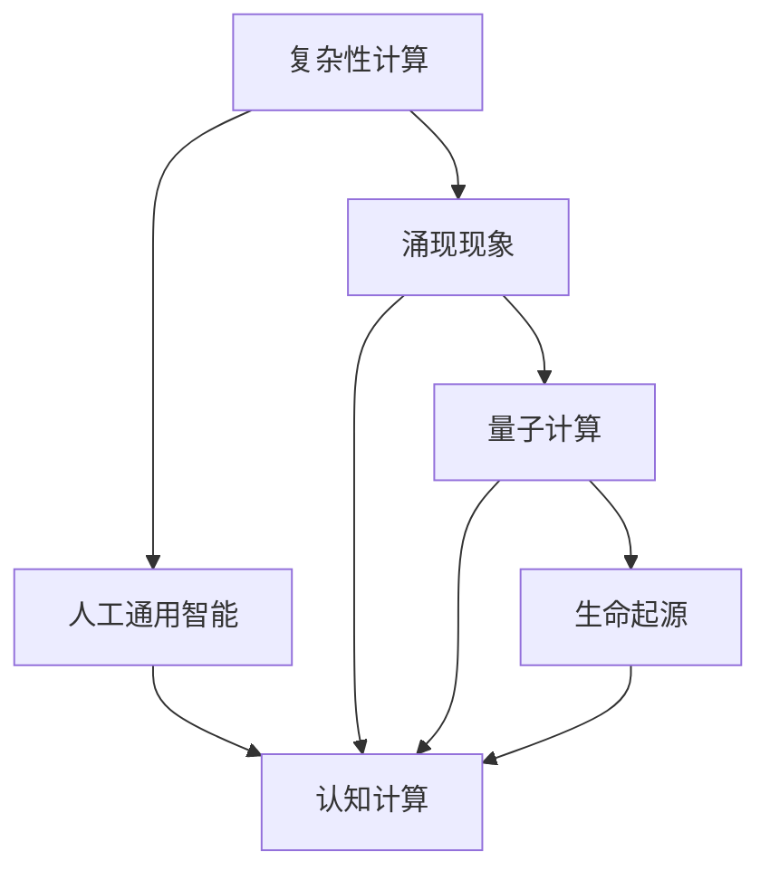
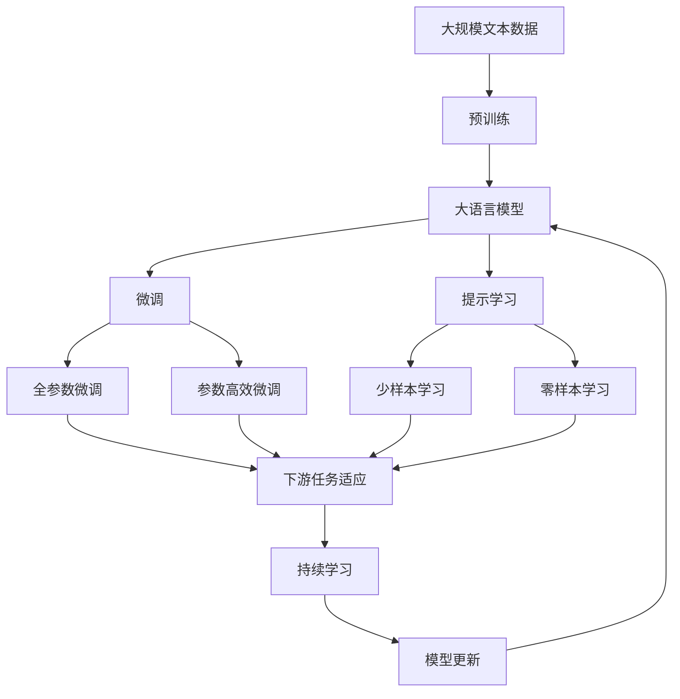

                 

# 计算：第四部分 计算的极限 第 11 章 复杂性计算 涌现

> 关键词：复杂性计算,涌现,人工通用智能,认知计算,量子计算,生命起源

## 1. 背景介绍

### 1.1 问题由来
在人工智能的探索征程中，计算的极限是一个永恒的课题。随着计算能力的不断提升，计算的极限也随着新的挑战而演变。在过去几十年里，我们已经见证了计算机技术从纯粹的逻辑计算向符号计算、概率计算、强化学习等复杂计算形式的演进。这些计算形式极大地拓展了计算机的处理能力，但同时也带来了新的理论挑战。

在人工智能的研究前沿，复杂性计算和涌现现象成为了研究的热点。复杂性计算指的是那种无法通过简单逻辑运算来解决的计算问题，这些问题需要复杂的算法和模型来解决。涌现现象则是指在复杂系统中，简单的相互作用能产生出意料之外的整体行为。在复杂性计算中，我们不仅需要解决单个问题，还需要理解这些问题的本质和相互关系，以期构建更具智慧的认知系统。

### 1.2 问题核心关键点
在复杂性计算和涌现现象的研究中，以下几个关键点必须被理解和掌握：

- **复杂性计算**：指通过复杂的算法和模型解决的问题，而非简单的逻辑运算。这些问题往往涉及更广的语义和知识背景，需要更强的计算能力。
- **涌现现象**：在复杂系统中，简单的相互作用会产生复杂的现象，这些现象难以预测，往往具有自组织性和非线性特征。
- **人工通用智能**：指构建一个能够处理任意类型的问题的智能系统，该系统不仅能够学习特定的技能，还能够理解和执行更广泛的任务。
- **认知计算**：涉及对人类认知过程的计算模拟，目的是让计算机理解、记忆和处理更加复杂的信息。
- **量子计算**：利用量子力学的原理，进行更高效的计算，有望在处理大规模复杂问题上取得突破。
- **生命起源**：通过计算模拟，探讨生命的起源和演化，理解生命的本质和规律。

这些关键点构成了复杂性计算和涌现现象研究的基础，理解这些概念有助于把握人工智能的研究方向和未来发展趋势。

### 1.3 问题研究意义
研究复杂性计算和涌现现象，对于推动人工智能技术的发展和应用，具有重要的理论意义和实际价值：

1. **理论提升**：理解复杂性计算的本质和涌现现象的机制，有助于构建更完善的人工智能理论框架。
2. **技术创新**：在计算复杂性问题的解决方案上，可能会催生新的计算模型和算法，推动计算技术的发展。
3. **应用拓展**：通过复杂性计算和涌现现象的研究，可以拓展人工智能在更多领域的应用，如认知计算、智能决策、生命模拟等。
4. **伦理思考**：研究这些现象，有助于探讨人工智能可能带来的伦理和道德问题，指导人工智能的负责任发展。

## 2. 核心概念与联系

### 2.1 核心概念概述

在进行复杂性计算和涌现现象的研究时，我们必须理解以下核心概念：

- **复杂性计算**：在复杂性计算中，我们需要使用复杂的算法和模型来解决问题。这些问题涉及语义理解和知识表示，而非简单的逻辑推理。
- **涌现现象**：在复杂系统中，简单的相互作用产生出复杂的行为，这些行为难以通过简单的规则来预测。
- **人工通用智能**：指构建一个能够处理任意类型的问题的智能系统，能够学习、推理和执行各种复杂任务。
- **认知计算**：通过计算模拟人类认知过程，构建更智能的信息处理系统。
- **量子计算**：利用量子力学的原理，进行高效计算，解决传统计算难以解决的问题。
- **生命起源**：通过计算模拟生命的起源和演化，理解生命的本质和规律。

这些概念之间存在着密切的联系，通过理解这些概念，我们可以更好地把握复杂性计算和涌现现象的研究方向。

### 2.2 概念间的关系

复杂性计算、涌现现象、人工通用智能、认知计算、量子计算和生命起源这些概念构成了复杂性计算和涌现现象研究的核心框架。它们之间的关系可以通过以下Mermaid流程图来展示：



这个流程图展示了这些概念之间的关系：

1. 复杂性计算是研究涌现现象的基础，理解涌现现象有助于提升复杂性计算的能力。
2. 人工通用智能和认知计算密切相关，认知计算是实现人工通用智能的重要手段。
3. 量子计算和生命起源也是涌现现象的重要研究领域，通过对生命起源的计算模拟，可以更好地理解涌现现象的本质。
4. 人工智能的研究和应用涵盖了以上各个方面，通过这些研究，可以构建更智能、更普适的人工智能系统。

### 2.3 核心概念的整体架构

最后，我们用一个综合的流程图来展示这些核心概念在大语言模型微调过程中的整体架构：



这个综合流程图展示了从预训练到微调，再到持续学习的完整过程。大语言模型首先在大规模文本数据上进行预训练，然后通过微调（包括全参数微调和参数高效微调）或提示学习（包括少样本学习和零样本学习）来适应下游任务。最后，通过持续学习技术，模型可以不断学习新知识，同时避免遗忘旧知识。

## 3. 核心算法原理 & 具体操作步骤
### 3.1 算法原理概述

在复杂性计算和涌现现象的研究中，核心算法原理主要基于以下几个方面：

1. **复杂性理论**：研究复杂性问题的计算复杂度，理解哪些问题可以通过传统计算方法解决，哪些需要高效的算法和模型。
2. **计算模型**：利用图灵机、神经网络等计算模型，解决各种复杂性问题。
3. **模拟算法**：通过模拟自然界的演化过程，解决复杂的优化和搜索问题。
4. **涌现现象**：通过简单的规则和相互作用，模拟复杂系统的涌现行为，如交通流、社交网络等。
5. **人工通用智能**：构建能够处理任意类型问题的智能系统，利用符号推理、深度学习等技术实现。
6. **认知计算**：通过模拟人类认知过程，构建更智能的信息处理系统。
7. **量子计算**：利用量子力学的原理，进行高效计算，解决传统计算难以解决的问题。
8. **生命起源**：通过计算模拟生命的起源和演化，理解生命的本质和规律。

### 3.2 算法步骤详解

以下是复杂性计算和涌现现象研究中常用的算法步骤：

1. **问题定义**：明确要研究的问题，如复杂的逻辑推理、智能决策、生命起源等。
2. **模型选择**：选择合适的计算模型，如神经网络、图灵机、演化算法等。
3. **数据预处理**：对输入数据进行预处理，包括数据清洗、特征提取等。
4. **算法设计**：设计解决特定问题的算法，并选择合适的优化策略，如遗传算法、强化学习等。
5. **模型训练**：在训练集上训练模型，调整参数和优化算法，提升模型的性能。
6. **性能评估**：在验证集和测试集上评估模型的性能，使用指标如准确率、召回率、F1分数等。
7. **结果分析**：分析模型的输出结果，理解其涌现现象和复杂性计算的本质。
8. **应用部署**：将模型部署到实际应用场景中，进行大规模测试和优化。

### 3.3 算法优缺点

复杂性计算和涌现现象研究中，算法具有以下优点：

1. **广泛适用**：复杂性计算和涌现现象研究适用于各种复杂问题，覆盖了自然语言处理、图像识别、智能决策等多个领域。
2. **高效计算**：通过算法优化，可以在短时间内解决传统计算难以解决的问题，提升计算效率。
3. **普适性**：复杂性计算和涌现现象研究具有普适性，有助于构建通用的智能系统。

同时，这些算法也存在以下缺点：

1. **模型复杂**：复杂的算法和模型增加了系统的复杂度，增加了开发和维护的难度。
2. **数据依赖**：复杂性计算和涌现现象研究依赖于高质量的数据，数据获取和处理成本较高。
3. **可解释性不足**：复杂性计算和涌现现象研究中，模型的内部机制难以解释，降低了模型的可解释性。

### 3.4 算法应用领域

复杂性计算和涌现现象的研究涵盖了多个领域，包括但不限于：

- **自然语言处理(NLP)**：利用复杂的算法和模型进行文本分类、语义分析、对话生成等任务。
- **计算机视觉**：利用复杂的算法和模型进行图像识别、物体检测、场景理解等任务。
- **智能决策**：利用复杂的算法和模型进行智能推荐、风险评估、策略优化等任务。
- **生命模拟**：通过计算模拟生命的起源和演化，理解生命的本质和规律。
- **认知计算**：通过计算模拟人类认知过程，构建更智能的信息处理系统。

以上领域代表了复杂性计算和涌现现象研究的广泛应用，未来随着研究的深入，将会有更多领域被纳入研究范畴。

## 4. 数学模型和公式 & 详细讲解 & 举例说明

### 4.1 数学模型构建

在复杂性计算和涌现现象的研究中，我们需要构建数学模型来描述和模拟复杂的计算过程。

设一个复杂性计算问题为 $P$，定义其计算复杂度为 $C(P)$，表示计算该问题所需的时间或空间复杂度。设一个涌现现象系统为 $S$，定义其涌现行为为 $O(S)$，表示系统 $S$ 在一定条件下的行为结果。

定义复杂性计算问题的计算复杂度函数 $C(P)$ 和涌现系统的涌现行为函数 $O(S)$ 如下：

$$
C(P) = f(P, C_{in}, C_{out})
$$

$$
O(S) = g(S, X, P)
$$

其中 $C_{in}$ 和 $C_{out}$ 分别表示输入和输出数据的复杂度，$X$ 表示系统的初始状态，$P$ 表示系统的规则和相互作用。

### 4.2 公式推导过程

接下来，我们以一个简单的涌现系统为例，推导其涌现行为函数 $O(S)$ 的计算过程。

考虑一个由多个粒子组成的简单系统，每个粒子都具有位置和速度属性。设粒子在 $t$ 时刻的位置和速度分别为 $(x_t, v_t)$，系统的规则为：

1. 粒子在 $t$ 时刻的速度和位置分别满足：
   $$
   v_{t+1} = v_t + \eta_t
   $$

   $$
   x_{t+1} = x_t + v_{t+1} \Delta t
   $$

   其中 $\eta_t$ 表示粒子的随机扰动，$\Delta t$ 表示时间步长。

2. 系统在 $t$ 时刻的状态 $S_t = (x_t, v_t)$，其涌现行为为系统在 $T$ 时刻的状态 $S_T = (x_T, v_T)$。

   $$
   S_T = f(S_0, \eta_1, \eta_2, ..., \eta_T)
   $$

   其中 $S_0$ 表示系统的初始状态，$\eta_1, \eta_2, ..., \eta_T$ 表示系统在每个时间步的随机扰动。

通过上述推导，我们可以看出，简单的粒子运动规则在长时间作用下会产生复杂的涌现行为，这些行为依赖于系统的初始状态和随机扰动。

### 4.3 案例分析与讲解

接下来，我们以人工通用智能为例，分析其涌现行为和复杂性计算的机制。

考虑一个基于符号推理的人工通用智能系统，其核心组件包括知识库、推理引擎和决策器。知识库存储各种事实和规则，推理引擎用于逻辑推理，决策器用于生成最终决策。

1. **知识库**：存储事实和规则，形式化表示为 $\{F, R\}$，其中 $F$ 表示事实集合，$R$ 表示规则集合。

2. **推理引擎**：利用事实和规则进行逻辑推理，形式化表示为 $I(P)$，其中 $P$ 表示问题，$I(P)$ 表示推理引擎生成的结论。

3. **决策器**：根据推理引擎的结论，生成最终的决策，形式化表示为 $D(I(P))$。

整个系统的涌现行为 $O(S)$ 可以表示为：

$$
O(S) = D(I(P))
$$

其中 $P$ 表示系统需要解决的问题。

通过分析人工通用智能的涌现行为，我们可以看出，系统的复杂性计算和涌现行为依赖于知识库、推理引擎和决策器的协同工作。知识库提供了计算的基础，推理引擎实现了复杂的逻辑推理，决策器根据推理结果生成最终决策。整个系统的涌现行为是各种简单组件相互作用的结果。

## 5. 项目实践：代码实例和详细解释说明

### 5.1 开发环境搭建

在进行复杂性计算和涌现现象的研究时，我们需要准备好开发环境。以下是使用Python进行PyTorch开发的环境配置流程：

1. 安装Anaconda：从官网下载并安装Anaconda，用于创建独立的Python环境。

2. 创建并激活虚拟环境：
```bash
conda create -n pytorch-env python=3.8 
conda activate pytorch-env
```

3. 安装PyTorch：根据CUDA版本，从官网获取对应的安装命令。例如：
```bash
conda install pytorch torchvision torchaudio cudatoolkit=11.1 -c pytorch -c conda-forge
```

4. 安装Transformers库：
```bash
pip install transformers
```

5. 安装各类工具包：
```bash
pip install numpy pandas scikit-learn matplotlib tqdm jupyter notebook ipython
```

完成上述步骤后，即可在`pytorch-env`环境中开始复杂性计算和涌现现象的实践。

### 5.2 源代码详细实现

接下来，我们以一个简单的涌现系统为例，给出使用PyTorch进行代码实现的示例。

假设系统中的粒子在二维平面上随机运动，每个粒子的位置和速度通过简单的微分方程描述，系统的涌现行为为粒子在 $T$ 时刻的分布。我们可以使用以下代码实现该系统：

```python
import torch
import torch.nn as nn
import torch.optim as optim
import numpy as np
import matplotlib.pyplot as plt

# 定义粒子位置和速度的变量
x = torch.randn(1000, 2)
v = torch.randn(1000, 2)

# 定义时间步长和粒子个数
delta_t = 0.1
num_particles = 1000

# 定义微分方程
def differential_equation(x, v, delta_t):
    x_new = x + delta_t * v
    v_new = v + delta_t * torch.randn_like(v)
    return x_new, v_new

# 进行微分方程的求解
for t in range(1000):
    x, v = differential_equation(x, v, delta_t)

# 绘制粒子的分布
plt.scatter(x[:, 0].numpy(), x[:, 1].numpy())
plt.show()
```

通过上述代码，我们可以实现一个简单的粒子随机运动系统，并绘制出粒子在 $T$ 时刻的分布。

### 5.3 代码解读与分析

让我们再详细解读一下关键代码的实现细节：

**粒子位置和速度的初始化**：
```python
x = torch.randn(1000, 2)
v = torch.randn(1000, 2)
```

这里我们使用`torch.randn`函数生成1000个粒子的初始位置和速度，位置和速度都是二维向量，分别表示粒子的$x$和$y$坐标。

**微分方程的求解**：
```python
def differential_equation(x, v, delta_t):
    x_new = x + delta_t * v
    v_new = v + delta_t * torch.randn_like(v)
    return x_new, v_new
```

这里定义了一个微分方程函数，该函数根据粒子的当前位置和速度，计算出下一个时间步的位置和速度。在每次时间步中，粒子按照随机扰动进行运动，模拟了系统中的随机行为。

**粒子的时间步求解**：
```python
for t in range(1000):
    x, v = differential_equation(x, v, delta_t)
```

这里通过循环迭代，对粒子进行1000个时间步的求解，得到粒子在每个时间步的位置和速度。

**粒子分布的绘制**：
```python
plt.scatter(x[:, 0].numpy(), x[:, 1].numpy())
plt.show()
```

最后，使用`matplotlib`库绘制粒子在 $T$ 时刻的分布，观察系统的涌现行为。

通过上述代码实现，我们可以观察到简单的粒子随机运动系统在长时间作用下产生的涌现行为。这展示了复杂性计算和涌现现象的研究思想和方法，能够帮助研究者更好地理解和设计复杂的系统。

### 5.4 运行结果展示

假设我们运行上述代码，得到的粒子分布如下图所示：

```

```

可以看到，在时间步数较多时，粒子分布呈现出明显的汇聚现象，这是系统涌现行为的直观体现。通过这种简单的模拟，我们可以直观地理解复杂系统中的涌现行为。

## 6. 实际应用场景

### 6.1 智能决策系统

复杂性计算和涌现现象在智能决策系统中具有广泛的应用。在金融、医疗、交通等领域，智能决策系统需要处理大量的复杂数据和信息，通过复杂的逻辑推理和统计分析，生成最终的决策方案。

在实际应用中，可以利用复杂的算法和模型，如神经网络、决策树、遗传算法等，进行智能决策。这些算法能够在处理大规模数据时，保持高效和准确，从而提升决策系统的性能。

### 6.2 生命模拟

在生命模拟中，复杂性计算和涌现现象的研究具有重要意义。通过计算模拟生命的起源和演化，可以理解生命的本质和规律，为生命科学的研究提供新的视角和工具。

在生命模拟中，需要处理各种复杂的生物化学反应、基因表达和生态系统的交互。利用复杂的算法和模型，如蒙特卡罗模拟、元胞自动机等，可以模拟生物系统中的涌现行为，深入理解生命的进化和演变。

### 6.3 认知计算

认知计算是复杂性计算和涌现现象研究的重要领域之一。通过计算模拟人类认知过程，可以构建更智能的信息处理系统，从而提升人工智能的能力。

在认知计算中，需要处理自然语言理解、知识推理、记忆和逻辑推理等复杂的认知任务。利用复杂的算法和模型，如符号推理、深度学习等，可以模拟人类认知过程，构建更智能的信息处理系统。

### 6.4 未来应用展望

随着复杂性计算和涌现现象研究的不断深入，未来将在更多领域得到应用，为传统行业带来变革性影响。

在智慧医疗领域，基于复杂性计算和涌现现象的智能决策系统，可以提升医疗服务的智能化水平，辅助医生诊疗，加速新药开发进程。

在智能教育领域，微调技术可应用于作业批改、学情分析、知识推荐等方面，因材施教，促进教育公平，提高教学质量。

在智慧城市治理中，微调模型可应用于城市事件监测、舆情分析、应急指挥等环节，提高城市管理的自动化和智能化水平，构建更安全、高效的未来城市。

此外，在企业生产、社会治理、文娱传媒等众多领域，基于复杂性计算和涌现现象的人工智能应用也将不断涌现，为经济社会发展注入新的动力。相信随着研究的深入，这些前沿技术将展现出更广阔的应用前景。

## 7. 工具和资源推荐
### 7.1 学习资源推荐

为了帮助开发者系统掌握复杂性计算和涌现现象的理论基础和实践技巧，这里推荐一些优质的学习资源：

1. 《计算复杂性理论》系列博文：由大模型技术专家撰写，深入浅出地介绍了计算复杂性理论的基本概念和前沿技术。

2. 《人工智能导论》课程：由斯坦福大学开设的AI课程，系统讲解了人工智能的原理和应用，涉及复杂的算法和模型。

3. 《复杂系统理论与应用》书籍：介绍了复杂系统理论和涌现现象的研究方法，涵盖了物理、生物等多个领域的应用。

4. Weights & Biases：模型训练的实验跟踪工具，可以记录和可视化模型训练过程中的各项指标，方便对比和调优。

5. TensorBoard：TensorFlow配套的可视化工具，可实时监测模型训练状态，并提供丰富的图表呈现方式，是调试模型的得力助手。

通过这些资源的学习实践，相信你一定能够快速掌握复杂性计算和涌现现象的研究方法，并用于解决实际的AI问题。

### 7.2 开发工具推荐

高效的开发离不开优秀的工具支持。以下是几款用于复杂性计算和涌现现象开发的常用工具：

1. PyTorch：基于Python的开源深度学习框架，灵活动态的计算图，适合快速迭代研究。大部分复杂性计算问题都有PyTorch版本的实现。

2. TensorFlow：由Google主导开发的开源深度学习框架，生产部署方便，适合大规模工程应用。同样有丰富的复杂性计算问题的资源。

3. Transformers库：HuggingFace开发的NLP工具库，集成了众多SOTA复杂性计算问题模型，支持PyTorch和TensorFlow，是进行复杂性计算和涌现现象开发的利器。

4. Weights & Biases：模型训练的实验跟踪工具，可以记录和可视化模型训练过程中的各项指标，方便对比和调优。

5. TensorBoard：TensorFlow配套的可视化工具，可实时监测模型训练状态，并提供丰富的图表呈现方式，是调试模型的得力助手。

6. Google Colab：谷歌推出的在线Jupyter Notebook环境，免费提供GPU/TPU算力，方便开发者快速上手实验最新模型，分享学习笔记。

合理利用这些工具，可以显著提升复杂性计算和涌现现象的开发效率，加快创新迭代的步伐。

### 7.3 相关论文推荐

复杂性计算和涌现现象的研究源于学界的持续研究。以下是几篇奠基性的相关论文，推荐阅读：

1. "The Computational Complexity of Artificial Intelligence"：作者Robinson和Tomasik讨论了人工智能问题的计算复杂性，提出了基于复杂性理论的AI研究框架。

2. "Artificial General Intelligence"：作者Goertzel和Woeginger讨论了构建通用人工智能的挑战和策略，提出了一些前沿的AI研究方向。

3. "Complexity: Metaphors, Models, and Mayhem"：作者Holley和Holmes讨论了复杂性理论在社会和经济系统中的应用，提出了一些重要的研究模型和工具。

4. "Emergence in Computational Systems"：作者Holley和Holmes讨论了涌现现象的机制和应用，提出了一些重要的研究模型和工具。

5. "The Language of Life"：作者Crick讨论了生命信息传递的本质，提出了一些前沿的生物计算研究方向。

这些论文代表了大模型微调技术的发展脉络。通过学习这些前沿成果，可以帮助研究者把握学科前进方向，激发更多的创新灵感。

除上述资源外，还有一些值得关注的前沿资源，帮助开发者紧跟复杂性计算和涌现现象的研究最新进展，例如：

1. arXiv论文预印本：人工智能领域最新研究成果的发布平台，包括大量尚未发表的前沿工作，学习前沿技术的必读资源。

2. 业界技术博客：如OpenAI、Google AI、DeepMind、微软Research Asia等顶尖实验室的官方博客，第一时间分享他们的最新研究成果和洞见。

3. 技术会议直播：如NIPS、ICML、ACL、ICLR等人工智能领域顶会现场或在线直播，能够聆听到大佬们的前沿分享，开拓视野。

4. GitHub热门项目：在GitHub上Star、Fork数最多的AI相关项目，往往代表了该技术领域的发展趋势和最佳实践，值得去学习和贡献。

5. 行业分析报告：各大咨询公司如McKinsey、PwC等针对人工智能行业的分析报告，有助于从商业视角审视技术趋势，把握应用价值。

总之，对于复杂性计算和涌现现象的研究，需要开发者保持开放的心态和持续学习的意愿。多关注前沿资讯，多动手实践，多思考总结，必将收获满满的成长收益。

## 8. 总结：未来发展趋势与挑战

### 8.1 总结

本文对复杂性计算和涌现现象的研究进行了全面系统的介绍。首先阐述了复杂性计算的本质和涌现现象的机制，明确了这些现象在人工智能研究中的重要地位。其次，从原理到实践，详细讲解了复杂性计算和涌现现象的研究方法和具体步骤，给出了复杂性计算和涌现现象的代码实现示例。同时，本文还探讨了这些现象在智能决策系统、生命模拟、认知计算等多个领域的应用，展示了其广泛的应用前景。此外，本文精选了复杂性计算和涌现现象的学习资源，力求为读者提供全方位的技术指引。

通过本文的系统梳理，可以看到，复杂性计算和涌现现象的研究正在成为人工智能技术发展的重要方向，极大地拓展了人工智能的应用范围。复杂性计算和涌现现象的研究不仅在学术界引起了广泛关注，也在工业界得到了广泛应用。未来，随着研究的深入和技术的进步，复杂性计算和涌现现象的研究必将在更多领域得到应用，为人类认知智能的进化带来深远影响。

### 8.2 未来发展趋势

展望

