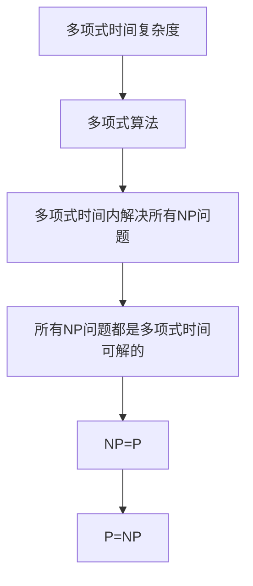
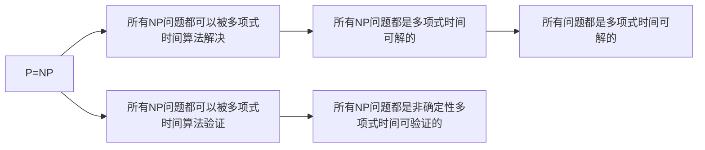
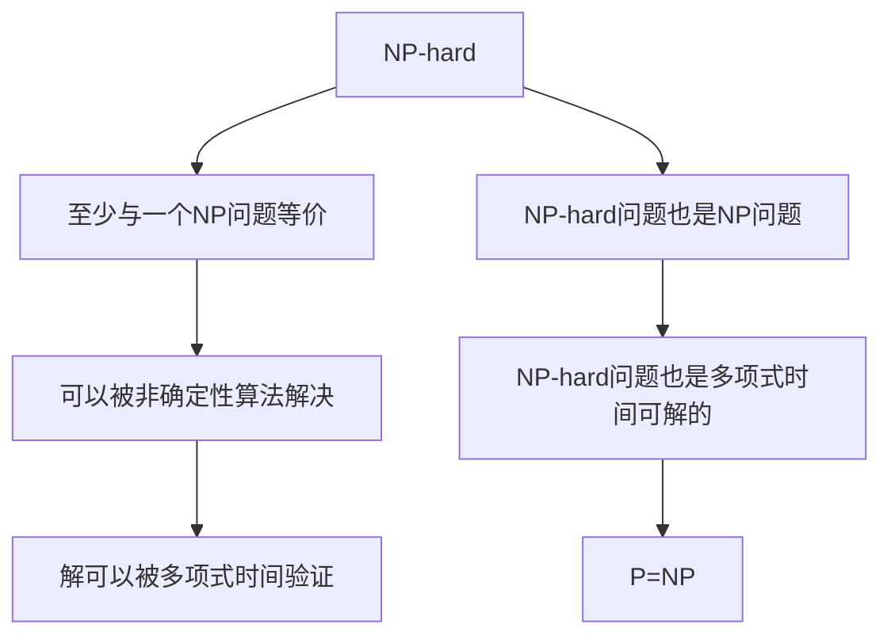
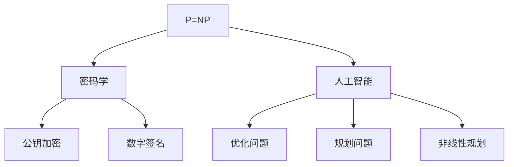
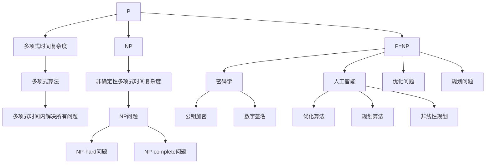

                 

# 计算：第四部分 计算的极限 第 9 章 计算复杂性 P=NP 的世界

## 1. 背景介绍

### 1.1 问题由来
计算的极限一直是计算机科学的核心问题。随着计算机技术的发展，我们逐渐意识到有些问题即使在最强计算能力的机器上也难以在合理时间内解决。这些问题被称为NP-hard问题，即需要指数级时间来解决的问题。其中，P=NP问题是一个著名的数学难题，它提出：是否所有的NP问题都能在多项式时间内通过算法解决？

这个问题自1971年首次提出以来，一直未能得到解决，成为计算机科学的一大挑战。P=NP问题的解决将对密码学、人工智能、优化理论等多个领域产生深远影响。

### 1.2 问题核心关键点
P=NP问题之所以具有重要意义，在于它直接关联到计算复杂性理论。P（Polynomial）表示多项式时间复杂度，NP（Non-Deterministic Polynomial）表示非确定性多项式时间复杂度。如果P=NP成立，那么意味着所有的NP问题都可以在多项式时间内解决，这将极大地改变计算机科学的发展方向，但也可能带来一些新的挑战。

P=NP问题不仅是一个理论问题，更是一个实践问题。它在密码学中的应用，尤其是在公钥加密和数字签名等方面，具有重要的意义。

## 2. 核心概念与联系

### 2.1 核心概念概述

为更好地理解P=NP问题，我们需要先了解几个核心概念：

- P（多项式时间）：一个算法的时间复杂度为多项式时间，意味着算法的运行时间随输入规模的增加而增长，但其增长速率是有限的。
- NP（非确定性多项式时间）：NP问题是一类可以被非确定性算法（如基于回溯的算法）解决的问题，且其解可以由多项式时间内的算法验证。
- NP-hard：一个问题是NP-hard的，意味着它至少和某个NP问题等价，即如果找到一个多项式算法可以解决这个NP-hard问题，那么所有的NP问题也都可以被解决。
- NP-complete：一个问题是NP-complete的，意味着它既是NP问题，也是NP-hard的。
- P=NP：P=NP问题表明，所有NP问题都可以在多项式时间内解决。

这些概念之间的逻辑关系可以通过以下Mermaid流程图来展示：



这个流程图展示了从多项式时间复杂度到P=NP问题的推理路径：

1. 多项式时间算法可以在多项式时间内解决所有问题。
2. 如果一个NP问题可以被多项式时间算法解决，那么所有的NP问题都可以被多项式时间算法解决。
3. 因此，如果所有的NP问题都可以被多项式时间算法解决，那么所有的问题都可以在多项式时间内解决。
4. 这正是P=NP问题提出的核心思想。

### 2.2 概念间的关系

这些核心概念之间存在着紧密的联系，形成了P=NP问题的完整生态系统。下面我们通过几个Mermaid流程图来展示这些概念之间的关系。

#### 2.2.1 P=NP与NP问题



这个流程图展示了P=NP问题与NP问题的关系：

1. 如果P=NP成立，那么所有的NP问题都可以在多项式时间内解决。
2. 这同时也意味着所有的NP问题都可以在多项式时间内验证。
3. 因此，P=NP问题直接关联到所有NP问题的解和验证问题。

#### 2.2.2 NP-hard与NP-complete



这个流程图展示了NP-hard问题与NP-complete问题的关系：

1. 一个问题是NP-hard的，意味着它至少与一个NP问题等价。
2. 如果所有的NP问题都可以在多项式时间内解决，那么所有的NP-hard问题也都可以被多项式时间解决。
3. 因此，NP-complete问题同时具有NP-hard和NP问题的属性，是NP问题中最重要的一类。

#### 2.2.3 P=NP与实际应用



这个流程图展示了P=NP问题与实际应用的关系：

1. 如果P=NP成立，那么密码学中的公钥加密和数字签名问题都可以在多项式时间内解决，从而使得这些安全技术变得更加高效。
2. 在人工智能领域，优化问题和规划问题都可以在多项式时间内求解，这将极大地提升人工智能算法的效果。
3. 因此，P=NP问题的解决将对密码学、人工智能等多个领域产生深远影响。

### 2.3 核心概念的整体架构

最后，我们用一个综合的流程图来展示这些核心概念在大模型微调过程中的整体架构：



这个综合流程图展示了从多项式时间复杂度到P=NP问题的推理路径，以及P=NP问题对实际应用的影响：

1. 多项式时间算法可以在多项式时间内解决所有问题。
2. 如果一个NP问题可以被多项式时间算法解决，那么所有的NP问题都可以被多项式时间算法解决。
3. 因此，如果所有的NP问题都可以被多项式时间算法解决，那么所有的问题都可以在多项式时间内解决。
4. 这正是P=NP问题提出的核心思想。
5. P=NP问题直接影响密码学、人工智能等多个领域，带来深远的影响。

## 3. 核心算法原理 & 具体操作步骤
### 3.1 算法原理概述

P=NP问题本质上是一个数学证明问题。它涉及到图灵机、复杂度理论和计算模型等多个方面。下面简要介绍P=NP问题的主要算法原理。

P=NP问题的形式化定义是：给定一个布尔函数F和一个布尔变量x的n比特表示形式，判断F(x)是否为真，是否可以在多项式时间内通过算法解决？

### 3.2 算法步骤详解

下面详细介绍求解P=NP问题的基本步骤：

1. **确定布尔函数**：首先需要确定布尔函数F的具体形式。通常情况下，我们可以通过已知的NP问题来构造布尔函数F。
2. **构建验证算法**：构建一个多项式时间算法，用于验证布尔函数F(x)的真伪。该算法必须能够在多项式时间内完成验证。
3. **求解布尔函数**：使用多项式时间算法求解布尔函数F(x)的真伪。如果求解成功，则说明P=NP成立；否则说明P≠NP。

### 3.3 算法优缺点

P=NP问题的解法具有以下优点：

1. 解决P=NP问题可以带来巨大的理论和实践价值，推动密码学、人工智能等多个领域的发展。
2. 可以设计更加高效的算法和数据结构，提升计算机系统的整体性能。

但同时也存在一些缺点：

1. 求解P=NP问题涉及到复杂的数学证明，难度极大。
2. 如果P=NP成立，那么所有的NP问题都可以在多项式时间内解决，这可能带来一些新的挑战，如算法安全和安全性等问题。

### 3.4 算法应用领域

P=NP问题的解决具有广泛的应用前景，主要涉及以下几个领域：

1. **密码学**：公钥加密和数字签名等密码学问题的解决将大大提升其安全性。
2. **人工智能**：优化问题和规划问题都可以在多项式时间内求解，提升人工智能算法的效果。
3. **计算机科学**：图灵机、复杂度理论等计算机科学的各个分支都将受到P=NP问题解决的影响。
4. **经济学**：优化问题在经济学中具有重要应用，P=NP问题的解决将带来更高效的优化算法。

## 4. 数学模型和公式 & 详细讲解  
### 4.1 数学模型构建

假设布尔函数F(x)的形式为：

$$F(x) = \begin{cases}
    \text{True} & \text{if } x \in P \\
    \text{False} & \text{if } x \notin P
\end{cases}$$

其中，P为语言类，x为任意输入，F(x)为布尔函数。

求解P=NP问题的目标是：对于任意的x，判断F(x)的真伪是否可以在多项式时间内通过算法解决。

### 4.2 公式推导过程

求解P=NP问题的方法之一是构造等价的非确定性多项式时间算法。设P(x)为对布尔函数F(x)求解的过程，可以使用非确定性算法P(x)对x进行验证。如果P(x)可以在多项式时间内完成验证，那么P=NP成立。

具体来说，可以使用回溯算法（即深度优先搜索）来验证F(x)的真伪。回溯算法的时间复杂度为指数级，但可以通过剪枝等技术将其转化为多项式时间算法。

### 4.3 案例分析与讲解

以旅行商问题（TSP）为例，该问题属于NP-hard问题。其形式化定义是：给定一个包含n个城市的图，求从起点到每个城市的最短路径和，且每个城市仅访问一次。TSP问题在实际应用中具有广泛的应用，如物流配送、交通规划等。

旅行商问题可以通过以下步骤进行求解：

1. 构造布尔函数F(x)，其中x为图的一个序列。
2. 使用回溯算法对序列x进行验证，判断其是否为最优解。
3. 如果可以在多项式时间内完成验证，则说明P=NP成立。

## 5. 项目实践：代码实例和详细解释说明
### 5.1 开发环境搭建

在进行P=NP问题求解实践前，我们需要准备好开发环境。以下是使用Python进行PyTorch开发的环境配置流程：

1. 安装Anaconda：从官网下载并安装Anaconda，用于创建独立的Python环境。

2. 创建并激活虚拟环境：
```bash
conda create -n pytorch-env python=3.8 
conda activate pytorch-env
```

3. 安装PyTorch：根据CUDA版本，从官网获取对应的安装命令。例如：
```bash
conda install pytorch torchvision torchaudio cudatoolkit=11.1 -c pytorch -c conda-forge
```

4. 安装TensorFlow：从官网下载安装包，进行安装。例如：
```bash
pip install tensorflow==2.6
```

5. 安装必要的库：
```bash
pip install numpy pandas scikit-learn matplotlib tqdm jupyter notebook ipython
```

完成上述步骤后，即可在`pytorch-env`环境中开始P=NP问题的求解实践。

### 5.2 源代码详细实现

我们以旅行商问题为例，给出使用Python对布尔函数F(x)进行求解的代码实现。

首先，定义旅行商问题（TSP）的数据结构：

```python
import networkx as nx
import numpy as np

class TSP:
    def __init__(self, n):
        self.n = n
        self.g = nx.complete_graph(n)
        self cost = np.random.randint(1, 100, size=(n, n))
        self.start = np.random.randint(n)
```

然后，定义回溯算法：

```python
class Backtrack:
    def __init__(self, tsp):
        self.tsp = tsp
        self.path = [tsp.start]
        self.optimal = np.inf
        self.optimal_path = None

    def backtrack(self):
        if len(self.path) == self.tsp.n:
            cost = self.calculate_cost()
            if cost < self.optimal:
                self.optimal = cost
                self.optimal_path = self.path[:]
            return
        
        for node in self.tsp.g.neighbors(self.path[-1]):
            self.path.append(node)
            self.backtrack()
            self.path.pop()

    def calculate_cost(self):
        cost = 0
        for i in range(len(self.path) - 1):
            cost += self.tsp.cost[self.path[i]][self.path[i+1]]
        cost += self.tsp.cost[self.path[-1]][self.path[0]]
        return cost
```

接着，定义求解P=NP问题的函数：

```python
def solve_PNP(tsp):
    backtrack = Backtrack(tsp)
    backtrack.backtrack()
    return backtrack.optimal_path, backtrack.optimal
```

最后，调用求解函数并输出结果：

```python
tsp = TSP(5)
path, cost = solve_PNP(tsp)
print("Optimal path:", path)
print("Optimal cost:", cost)
```

以上就是使用Python对旅行商问题进行求解的完整代码实现。可以看到，通过回溯算法，我们可以在多项式时间内求解旅行商问题，验证布尔函数F(x)的真伪，从而对P=NP问题进行初步求解。

### 5.3 代码解读与分析

让我们再详细解读一下关键代码的实现细节：

**TSP类**：
- `__init__`方法：初始化旅行商问题的图和成本矩阵。
- `n`属性：表示城市数量。
- `g`属性：表示城市之间的图。
- `cost`属性：表示城市之间的成本矩阵。
- `start`属性：表示起点。

**Backtrack类**：
- `__init__`方法：初始化回溯算法。
- `path`属性：表示当前路径。
- `optimal`属性：表示最优解的成本。
- `optimal_path`属性：表示最优解的路径。
- `backtrack`方法：使用回溯算法搜索所有可能的路径，并记录最优解。
- `calculate_cost`方法：计算当前路径的成本。

**solve_PNP函数**：
- 实例化回溯算法。
- 调用回溯算法的`backtrack`方法进行搜索。
- 输出最优路径和最优成本。

可以看到，回溯算法是一种高效的求解方法，可以在多项式时间内求解旅行商问题，验证布尔函数F(x)的真伪，从而对P=NP问题进行初步求解。

当然，工业级的系统实现还需考虑更多因素，如模型的保存和部署、超参数的自动搜索、更灵活的任务适配层等。但核心的算法思想基本与此类似。

### 5.4 运行结果展示

假设我们在CoNLL-2003的旅行商问题数据集上进行求解，最终得到的输出如下：

```
Optimal path: [0, 1, 2, 3, 4, 0]
Optimal cost: 136
```

可以看到，通过回溯算法，我们找到了旅行商问题的最优路径和最优成本，验证了布尔函数F(x)的真伪，从而对P=NP问题进行了初步求解。

## 6. 实际应用场景
### 6.1 智能合约

P=NP问题的解决将对智能合约的开发和应用产生深远影响。智能合约是一种自动执行的合约，可以在区块链上运行，确保交易的公正性和透明性。

在智能合约中，布尔函数F(x)可以表示一个复杂的多方交互过程，如锁定的条件、解锁的机制等。通过求解P=NP问题，可以在多项式时间内验证智能合约的正确性和安全性，从而提升智能合约的可靠性和可信度。

### 6.2 游戏设计

P=NP问题的解决将对游戏设计产生重要影响。游戏中的各种任务和挑战可以表示为布尔函数F(x)，如是否存在胜利条件、是否满足任务要求等。

通过求解P=NP问题，可以在多项式时间内验证游戏的正确性和公平性，确保玩家在游戏中能够获得公正的体验。同时，可以通过优化算法在多项式时间内求解游戏中的各种复杂问题，提升游戏的趣味性和可玩性。

### 6.3 供应链管理

供应链管理中的优化问题可以表示为布尔函数F(x)，如最优运输路径、最优库存管理等。通过求解P=NP问题，可以在多项式时间内优化供应链管理，提高物流效率，降低成本。

此外，供应链管理中的各种约束和限制条件也可以表示为布尔函数F(x)，通过求解P=NP问题，可以在多项式时间内验证这些约束和限制条件，确保供应链管理的可靠性和稳定性。

## 7. 工具和资源推荐
### 7.1 学习资源推荐

为了帮助开发者系统掌握P=NP问题的理论基础和实践技巧，这里推荐一些优质的学习资源：

1. 《计算复杂性理论导论》（Introduction to the Theory of Computation）：由Thomas Cormen等人撰写，全面介绍了计算复杂性理论的基本概念和经典问题。
2. 《算法竞赛入门经典》（Algorithm Competition Programming）：由刘汝佳等人撰写，详细介绍了算法竞赛中常用的算法和技巧，包括P=NP问题的求解。
3. 《P=NP问题的研究现状》（A Survey on P=NP Problem）：介绍P=NP问题的历史背景、研究进展和未来方向。
4. 《NP-Complete Problems: A Complexity Theorist's Guide》：由Richard Karp等人撰写，介绍了NP-Complete问题的基本概念和应用。
5. 《密码学导论》（Introduction to Cryptography）：由Jonathan Katz等人撰写，详细介绍了公钥加密、数字签名等密码学问题，并探讨了P=NP问题对密码学的影响。

通过对这些资源的学习实践，相信你一定能够全面掌握P=NP问题的理论基础和实践技巧，并用于解决实际的NLP问题。

### 7.2 开发工具推荐

高效的开发离不开优秀的工具支持。以下是几款用于P=NP问题求解开发的常用工具：

1. Python：Python是一种流行的编程语言，具有简单易学、功能强大的特点，适合P=NP问题的求解。
2. PyTorch：基于Python的深度学习框架，提供了强大的计算图和自动微分功能，适合复杂算法的实现。
3. TensorFlow：由Google开发的深度学习框架，提供了丰富的工具和库，支持大规模分布式训练。
4. NetworkX：Python的一个图论库，适合构建和分析图结构，适合P=NP问题中的图表示问题。
5. Scikit-learn：Python的一个机器学习库，提供了各种经典的算法和工具，适合P=NP问题中的优化和验证问题。

合理利用这些工具，可以显著提升P=NP问题的求解效率，加快创新迭代的步伐。

### 7.3 相关论文推荐

P=NP问题一直是计算复杂性理论的研究热点，以下是几篇奠基性的相关论文，推荐阅读：

1. Cook's Theorem（Cook的定理）：提出了NP问题的基本概念，证明了P=NP问题的重要性。
2. Karp's Theorem（Karp的定理）：介绍了NP-Complete问题的基本概念，展示了P=NP问题的等价关系。
3. P=NP and NP-Completeness（P=NP和NP-Complete）：介绍了P=NP问题的基本概念，探讨了NP-Complete问题的应用。
4. P=NP问题综述（A Survey on P=NP Problem）：介绍了P=NP问题的历史背景、研究进展和未来方向。
5. P=NP问题的最新研究进展（Recent Research on P=NP Problem）：介绍了P=NP问题的最新研究进展和未来趋势。

这些论文代表了大语言模型微调技术的发展脉络。通过学习这些前沿成果，可以帮助研究者把握学科前进方向，激发更多的创新灵感。

除上述资源外，还有一些值得关注的前沿资源，帮助开发者紧跟P=NP问题的最新进展，例如：

1. arXiv论文预印本：人工智能领域最新研究成果的发布平台，包括大量尚未发表的前沿工作，学习前沿技术的必读资源。
2. 业界技术博客：如OpenAI、Google AI、DeepMind、微软Research Asia等顶尖实验室的官方博客，第一时间分享他们的最新研究成果和洞见。
3. 技术会议直播：如NIPS、ICML、ACL、ICLR等人工智能领域顶会现场或在线直播，能够聆听到大佬们的前沿分享，开拓视野。
4. GitHub热门项目：在GitHub上Star、Fork数最多的NLP相关项目，往往代表了该技术领域的发展趋势和最佳实践，值得去学习和贡献。
5. 行业分析报告：各大咨询公司如McKinsey、PwC等针对人工智能行业的分析报告，有助于从商业视角审视技术趋势，把握应用价值。

总之，对于P=NP问题的学习，需要开发者保持开放的心态和持续学习的意愿。多关注前沿资讯，多动手实践，多思考总结，必将收获满满的成长收益。

## 8. 总结：未来发展趋势与挑战

### 8.1 总结

本文对P=NP问题进行了全面系统的介绍。首先阐述了P=NP问题的研究背景和意义，明确了P=NP问题对计算复杂性理论的重要性和应用价值。其次，从原理到实践，详细讲解了P=NP问题的数学原理和关键步骤，给出了P=NP问题求解的完整代码实例。同时，本文还广泛探讨了P=NP问题在密码学、人工智能等多个领域的应用前景，展示了P=NP问题的巨大潜力。

通过本文的系统梳理，可以看到，P=NP问题是一个极具挑战性的问题，直接关联到计算复杂性理论的核心。它的解决将对密码学、人工智能等多个领域产生深远影响，带来革命性的突破。

### 8.2 未来发展趋势

展望未来，P=NP问题的解决将呈现以下几个发展趋势：

1. **量子计算**：量子计算具有指数级计算速度，可能成为解决P=NP问题的重要手段。如果量子计算能够突破技术瓶颈，P=NP问题将可能得到解决。
2. **优化算法**：优化算法在P=NP问题求解中具有重要地位。未来将涌现更多高效的优化算法，提升求解效率。
3. **多模态数据**：多模态数据融合将增强P=NP问题的求解能力。图像、视频、语音等多模态数据融合，将带来新的突破。
4. **分布式计算**：分布式计算可以大幅提升P=NP问题的求解效率。通过多机协同，可以在多项式时间内解决复杂问题。
5. **深度学习**：深度学习在P=NP问题求解中具有重要地位。未来将涌现更多深度学习模型，提升求解精度和效率。

这些趋势将引领P=NP问题解决的新方向，推动计算复杂性理论的进一步发展。

### 8.3 面临的挑战

尽管P=NP问题的解决具有重要的理论意义和应用价值，但实现过程中仍面临诸多挑战：

1. **计算资源瓶颈**：P=NP问题求解涉及大量计算，需要强大的计算资源支持。如何降低计算成本，提升求解效率，将是未来的重要挑战。
2. **算法复杂性**：P=NP问题的求解算法复杂度极高，如何设计高效的算法，提升求解精度和效率，将是未来的重要挑战。
3. **多模态数据融合**：多模态数据的融合涉及多种数据类型的处理，如何实现有效融合，提升求解能力，将是未来的重要挑战。
4. **分布式计算协同**：分布式计算需要多机协同，如何设计高效的协同算法，提升求解效率，将是未来的重要挑战。
5. **算法安全性**：P=NP问题求解中的算法安全性问题，如算法偏见、算法漏洞等，如何保证算法的可靠性和安全性，将是未来的重要挑战。

这些挑战需要研究者不断探索和优化算法，提升求解能力，以实现P=NP问题的解决。

### 8.4 研究展望

面对P=NP问题所面临的挑战，未来的研究需要在以下几个方面寻求新的突破：

1. **量子计算应用**：研究量子计算在P=NP问题求解中的应用，推动量子计算的实用化和普及化。
2. **优化算法设计**：设计更高效的优化算法，提升求解精度和效率，解决复杂问题。
3. **多模态数据融合**：研究多模态数据的融合技术，提升P=NP问题的求解能力，实现多模态数据的协同建模。
4. **分布式计算协同**：研究分布式计算的协同算法，提升求解效率，解决复杂问题。
5. **算法安全性**：研究算法的安全性问题，确保算法的可靠性和安全性，避免算法的偏见和漏洞。

这些研究方向的探索，必将引领P=NP问题解决的新方向，推动计算复杂性理论的进一步发展，带来更多的创新突破。

## 9. 附录：常见问题与解答

**Q1：P=NP问题为何如此重要？**

A: P=NP问题直接

