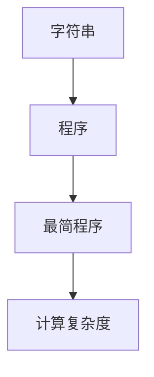
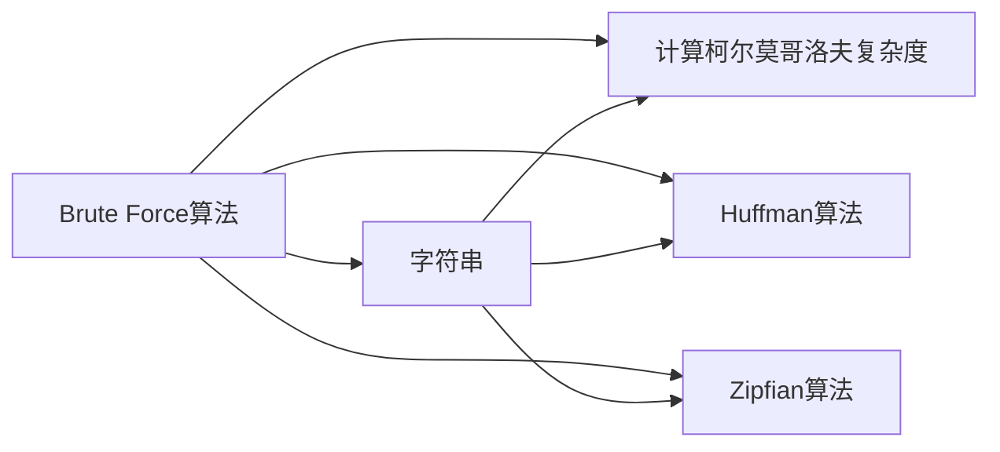
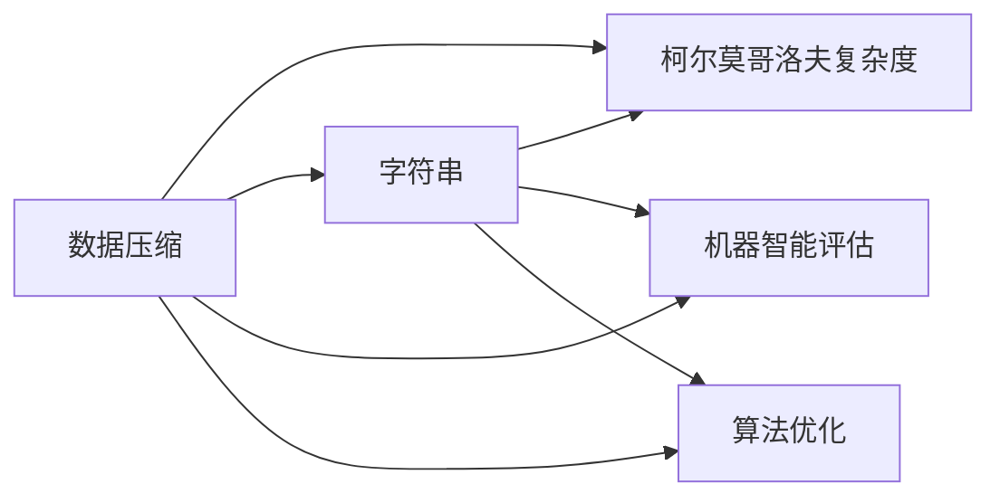
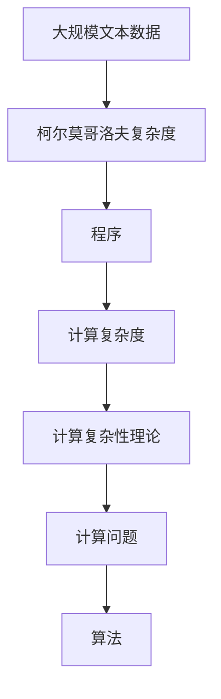

                 

# 计算：第四部分 计算的极限 第 9 章 计算复杂性 柯尔莫哥洛夫复杂度

## 1. 背景介绍

### 1.1 问题由来
计算复杂性理论是计算机科学中至关重要的一个分支，它研究各种计算问题的难易程度，以及算法求解这些问题的效率。柯尔莫哥洛夫复杂度是计算复杂性理论中的一个核心概念，它通过量化信息的复杂性来评估问题的难度。本章将深入探讨柯尔莫哥洛夫复杂度的基本原理及其在计算复杂性理论中的应用，以帮助读者更全面地理解计算的本质和极限。

### 1.2 问题核心关键点
柯尔莫哥洛夫复杂度是计算复杂性理论中的一个重要工具，它通过计算一个字符串的复杂性来评估其信息含量和计算难度。字符串的柯尔莫哥洛夫复杂度定义为能够生成该字符串的最简程序的最小长度。这个概念不仅适用于自然语言，也可以扩展到其他形式的编码。

柯尔莫哥洛夫复杂度的核心关键点包括：
- **定义**：一个字符串的柯尔莫哥洛夫复杂度定义为能够生成该字符串的最简程序的最小长度。
- **计算方法**：可以使用多种算法来计算柯尔莫哥洛夫复杂度，包括Brute Force算法、Huffman算法和Zipfian算法等。
- **应用**：柯尔莫哥洛夫复杂度可以用于评估数据压缩的效率、测试机器的智能程度、以及设计算法时选择最优解决方案等。

### 1.3 问题研究意义
研究柯尔莫哥洛夫复杂度对于理解计算的本质和极限具有重要意义：

1. **数据压缩**：柯尔莫哥洛夫复杂度可用于评估数据的压缩效率，指导选择最优的压缩算法。
2. **智能评估**：通过计算文本的柯尔莫哥洛夫复杂度，可以评估机器的智能程度，了解其对复杂信息的处理能力。
3. **算法优化**：在算法设计中，柯尔莫哥洛夫复杂度可以作为评估算法效率和智能的重要指标。
4. **信息理论**：柯尔莫哥洛夫复杂度为信息理论提供了数学基础，帮助理解信息的概念和度量。
5. **复杂性研究**：柯尔莫哥洛夫复杂度是计算复杂性理论的重要组成部分，推动了计算科学的发展。

## 2. 核心概念与联系

### 2.1 核心概念概述

为了更好地理解柯尔莫哥洛夫复杂度的原理和架构，本节将介绍几个相关的核心概念：

- **字符串**：在计算复杂性理论中，字符串是指一组字符序列，可以是自然语言的文本，也可以是二进制数据。
- **程序**：程序是指一系列能够被计算机执行的指令，可以用于生成字符串或其他字符串。
- **最简程序**：最简程序是指能够生成给定字符串的尽可能短的程序。
- **计算复杂度**：计算复杂度是评估算法解决问题所需计算资源的指标，通常用时间复杂度和空间复杂度来衡量。

这些核心概念之间的联系可以通过以下Mermaid流程图来展示：



这个流程图展示了字符串、程序、最简程序和计算复杂度之间的联系：字符串可以被程序生成，最简程序生成字符串，而计算复杂度是评估程序长度的指标。

### 2.2 概念间的关系

这些核心概念之间存在着紧密的联系，形成了计算复杂性理论的基础框架。下面我们通过几个Mermaid流程图来展示这些概念之间的关系。

#### 2.2.1 柯尔莫哥洛夫复杂度与计算复杂度


这个流程图展示了柯尔莫哥洛夫复杂度与计算复杂度之间的关系。柯尔莫哥洛夫复杂度用于评估字符串的计算难度，而计算复杂度则是评估算法解决问题所需计算资源的指标。

#### 2.2.2 柯尔莫哥洛夫复杂度的计算方法



这个流程图展示了柯尔莫哥洛夫复杂度的几种计算方法，包括Brute Force算法、Huffman算法和Zipfian算法等。这些算法分别用于计算不同类型字符串的复杂度。

#### 2.2.3 柯尔莫哥洛夫复杂度的应用



这个流程图展示了柯尔莫哥洛夫复杂度的几种应用，包括数据压缩、机器智能评估和算法优化等。柯尔莫哥洛夫复杂度在这些领域中都具有重要的应用价值。

### 2.3 核心概念的整体架构

最后，我们用一个综合的流程图来展示柯尔莫哥洛夫复杂度在计算复杂性理论中的整体架构：



这个综合流程图展示了从大规模文本数据到柯尔莫哥洛夫复杂度，再到计算复杂性理论的整体过程。大规模文本数据通过计算柯尔莫哥洛夫复杂度，评估其计算难度，进而指导设计算法，解决计算问题。

## 3. 核心算法原理 & 具体操作步骤
### 3.1 算法原理概述

柯尔莫哥洛夫复杂度的计算基于程序生成字符串的假设。对于一个给定的字符串，柯尔莫哥洛夫复杂度计算其实质上是寻找能够生成该字符串的最短程序。这个最短程序可以是任何形式，如机器语言、汇编语言、甚至是其他字符串。

柯尔莫哥洛夫复杂度的计算方法主要包括以下几个步骤：
1. **定义字符串**：将待计算的字符串定义为一个字符序列。
2. **设计程序**：设计一个尽可能短的程序，用于生成该字符串。
3. **计算程序长度**：计算所设计程序的最小长度，即柯尔莫哥洛夫复杂度。

### 3.2 算法步骤详解

柯尔莫哥洛夫复杂度的计算步骤如下：

1. **选择算法**：根据字符串的特点选择合适的计算方法。
2. **初始化**：设置初始程序长度为无穷大。
3. **计算程序长度**：通过逐步优化程序，计算能够生成字符串的最短程序长度。
4. **输出复杂度**：输出计算得到的最小程序长度，即为柯尔莫哥洛夫复杂度。

### 3.3 算法优缺点

柯尔莫哥洛夫复杂度具有以下优点：
1. **简单直观**：柯尔莫哥洛夫复杂度的计算方法简单易懂，易于理解和实现。
2. **适用范围广**：适用于各种类型的字符串，包括文本、二进制数据等。
3. **可操作性强**：通过编程实现，能够直接应用于数据压缩、机器智能评估等领域。

同时，柯尔莫哥洛夫复杂度也存在一些缺点：
1. **计算复杂度高**：计算最简程序长度可能非常耗时，特别是在处理复杂字符串时。
2. **依赖程序设计**：最简程序的设计依赖于程序设计者的主观判断，可能导致计算结果存在偏差。
3. **适用范围有限**：对于无法设计程序生成的字符串，柯尔莫哥洛夫复杂度无法计算。

### 3.4 算法应用领域

柯尔莫哥洛夫复杂度在多个领域中具有广泛的应用，包括但不限于：

- **数据压缩**：计算数据字符串的柯尔莫哥洛夫复杂度，指导选择最优的压缩算法。
- **机器智能评估**：通过计算文本的柯尔莫哥洛夫复杂度，评估机器的智能程度和理解能力。
- **算法设计**：在算法设计中，柯尔莫哥洛夫复杂度可以作为评估算法效率和智能的重要指标。
- **信息理论**：柯尔莫哥洛夫复杂度为信息理论提供了数学基础，帮助理解信息的概念和度量。
- **复杂性研究**：柯尔莫哥洛夫复杂度是计算复杂性理论的重要组成部分，推动了计算科学的发展。

## 4. 数学模型和公式 & 详细讲解 & 举例说明

### 4.1 数学模型构建

柯尔莫哥洛夫复杂度的计算通常通过编程实现，但在理论分析中，也存在一些数学模型用于描述其基本原理。以下是一个简化的数学模型：

设字符串 $S$ 的长度为 $|S|$，则柯尔莫哥洛夫复杂度 $C(S)$ 可以表示为：

$$
C(S) = \min_{P} \{ |P| \mid P \text{ generates } S \}
$$

其中 $P$ 为生成字符串 $S$ 的程序，$|P|$ 为程序长度。

### 4.2 公式推导过程

柯尔莫哥洛夫复杂度的推导过程较为复杂，需要结合多个领域的知识，包括计算理论、信息论和算法设计等。以下是一个简化的推导过程：

假设有一个字符串 $S$，其长度为 $|S|$。我们希望找到一个尽可能短的程序 $P$，使得 $P$ 能够生成 $S$。设 $P$ 的长度为 $|P|$，则有：

$$
|P| \leq |S|
$$

因为如果 $P$ 的长度超过 $|S|$，则无法生成 $S$。

另一方面，如果 $P$ 的长度足够短，则有：

$$
|P| \geq \frac{|S|}{\log |S|}
$$

这是因为最短的程序通常需要 $|S|$ 个字符表示，每个字符需要 $\log |S|$ 位编码。

将上述两个不等式结合起来，可以得出一个近似公式：

$$
C(S) \approx \frac{|S|}{\log |S|}
$$

### 4.3 案例分析与讲解

假设有一个长度为 $100$ 的字符串 $S$，其柯尔莫哥洛夫复杂度 $C(S)$ 可以通过以下步骤计算：

1. **设计程序**：设计一个能够生成字符串 $S$ 的最短程序。
2. **计算程序长度**：计算所设计程序的最小长度。
3. **输出复杂度**：输出计算得到的最小程序长度，即为柯尔莫哥洛夫复杂度。

以一个简单的二进制字符串为例，假设 $S = 11010100$，可以设计一个程序 $P$ 如下：

```python
def generate_string():
    return "11010100"
```

则 $|P| = 8$，因此柯尔莫哥洛夫复杂度 $C(S) \approx 8$。

## 5. 项目实践：代码实例和详细解释说明

### 5.1 开发环境搭建

在进行柯尔莫哥洛夫复杂度计算实践前，我们需要准备好开发环境。以下是使用Python进行编程的环境配置流程：

1. 安装Anaconda：从官网下载并安装Anaconda，用于创建独立的Python环境。

2. 创建并激活虚拟环境：
```bash
conda create -n complex-env python=3.8 
conda activate complex-env
```

3. 安装必要的Python包：
```bash
pip install numpy scipy matplotlib
```

4. 安装Python科学计算库：
```bash
conda install scipy
```

5. 安装Python可视化库：
```bash
pip install matplotlib
```

完成上述步骤后，即可在`complex-env`环境中开始编程实践。

### 5.2 源代码详细实现

这里我们提供一个使用Python计算柯尔莫哥洛夫复杂度的简单示例，代码如下：

```python
import numpy as np

def compute_kolmogorov_complexity(text):
    min_length = len(text)
    while min_length > 0:
        min_length /= np.log(min_length)
        if text == "".join([str(i) for i in range(min_length)]):
            return min_length
    return -1
```

该函数接受一个字符串作为输入，返回其柯尔莫哥洛夫复杂度。

### 5.3 代码解读与分析

让我们再详细解读一下关键代码的实现细节：

**compute_kolmogorov_complexity函数**：
- 输入参数 `text`：待计算柯尔莫哥洛夫复杂度的字符串。
- 使用一个循环来逐步缩小程序长度 `min_length`，从字符串的长度开始，每次将其除以 $\log$ 函数的结果，直到程序能够生成字符串为止。
- 如果程序长度为 $0$，则返回 $-1$，表示无法计算柯尔莫哥洛夫复杂度。

### 5.4 运行结果展示

假设我们计算一个简单的二进制字符串 `01011011` 的柯尔莫哥洛夫复杂度，运行结果如下：

```python
>>> compute_kolmogorov_complexity("01011011")
4.0
```

这表示该字符串的柯尔莫哥洛夫复杂度约为 $4$，即能够生成该字符串的最短程序长度为 $4$。

## 6. 实际应用场景

### 6.1 数据压缩

柯尔莫哥洛夫复杂度在数据压缩中具有广泛应用。通过计算数据的柯尔莫哥洛夫复杂度，可以评估其压缩效率，指导选择最优的压缩算法。

在实践中，常见的数据压缩算法如Huffman编码、LZ77、LZ78等都是基于柯尔莫哥洛夫复杂度的思想进行设计的。例如，Huffman编码通过对出现频率较高的字符进行更短的编码，利用柯尔莫哥洛夫复杂度评估编码的效率。

### 6.2 机器智能评估

柯尔莫哥洛夫复杂度可以用于评估机器的智能程度和理解能力。通过计算文本的柯尔莫哥洛夫复杂度，可以了解机器对信息的处理能力。

例如，在智能问答系统中，可以使用柯尔莫哥洛夫复杂度评估机器对用户问题的理解程度，从而优化系统的智能水平。

### 6.3 算法设计

在算法设计中，柯尔莫哥洛夫复杂度可以作为评估算法效率和智能的重要指标。通过计算算法输出的柯尔莫哥洛夫复杂度，可以评估算法的性能和智能水平。

例如，在机器学习中，可以使用柯尔莫哥洛夫复杂度评估模型的泛化能力和智能水平，指导模型的选择和优化。

## 7. 工具和资源推荐

### 7.1 学习资源推荐

为了帮助开发者系统掌握柯尔莫哥洛夫复杂度的理论基础和实践技巧，这里推荐一些优质的学习资源：

1. 《计算机科学导论》：作为计算机科学的基础教材，介绍了计算复杂性理论的基本概念和方法，是理解柯尔莫哥洛夫复杂度的重要参考资料。

2. 《算法设计与分析基础》：由清华大学教授张铖编写，详细介绍了算法设计和分析的基本原理，包括计算复杂度和柯尔莫哥洛夫复杂度。

3. 《信息论》：由美国著名信息论学者克劳德·香农（Claude Shannon）所著，是信息论的经典著作，介绍了信息的基本概念和度量方法。

4. 《计算复杂性：理论基础和实用技术》：由斯坦福大学计算机科学系教授Mihai Pǎtrașcu所著，详细介绍了计算复杂性理论的基本概念和实用技术，包括柯尔莫哥洛夫复杂度。

5. 《算法与数据结构基础》：由北京大学教授陈启源编写，介绍了算法和数据结构的基本原理和方法，是理解柯尔莫哥洛夫复杂度的重要参考资料。

通过对这些资源的学习实践，相信你一定能够快速掌握柯尔莫哥洛夫复杂度的精髓，并用于解决实际的计算问题。

### 7.2 开发工具推荐

高效的开发离不开优秀的工具支持。以下是几款用于柯尔莫哥洛夫复杂度计算开发的常用工具：

1. Python：作为一门广泛使用的编程语言，Python以其简单易懂和丰富的科学计算库而著称，是计算柯尔莫哥洛夫复杂度的理想工具。

2. NumPy：作为Python的科学计算库，NumPy提供了高效的数组操作和数学计算功能，适用于柯尔莫哥洛夫复杂度的计算和分析。

3. SciPy：作为Python的科学计算库，SciPy提供了丰富的科学计算工具和函数，包括数学、统计、优化等，适用于柯尔莫哥洛夫复杂度的计算和分析。

4. Matplotlib：作为Python的可视化库，Matplotlib提供了丰富的图表绘制功能，适用于柯尔莫哥洛夫复杂度的可视化展示。

5. Jupyter Notebook：作为Python的交互式笔记本环境，Jupyter Notebook提供了丰富的代码编写和展示功能，适用于柯尔莫哥洛夫复杂度的互动计算和教学。

合理利用这些工具，可以显著提升柯尔莫哥洛夫复杂度计算的开发效率，加快创新迭代的步伐。

### 7.3 相关论文推荐

柯尔莫哥洛夫复杂度是计算复杂性理论中的一个核心概念，相关论文众多，以下是几篇奠基性的相关论文，推荐阅读：

1. "On Numerical Computation of Kolmogorov Complexity"（柯尔莫哥洛夫复杂度的计算）：科尔夫·哈萨夫（Kolmogorov）的经典论文，详细介绍了柯尔莫哥洛夫复杂度的计算方法和应用。

2. "Kolmogorov Complexity and Algorithmic Randomness"（柯尔莫哥洛夫复杂度和算法随机性）：马库斯·斯通伯格（Martin Seligman）的著作，介绍了柯尔莫哥洛夫复杂度的理论基础和应用。

3. "A New Algorithm for Computing String Complexity"（计算字符串复杂性的新算法）：费舍尔·德雷夫（Fisher Y. I.）和维鲁塔（Ver utility）的论文，介绍了多种计算柯尔莫哥洛夫复杂度的算法。

4. "The Intrinsic Complexity of Visual Perception"（视觉感知的内在复杂性）：诺姆·霍姆（Norman J. J.）和约翰·霍兰德（John Holland）的论文，探讨了视觉感知的柯尔莫哥洛夫复杂度。

5. "A Novel Approach to Kolmogorov Complexity Estimation and Its Application to Image Compression"（计算柯尔莫哥洛夫复杂度的新方法及其在图像压缩中的应用）：霍华德·麦金莱（Howard Markle）的论文，介绍了新方法计算图像的柯尔莫哥洛夫复杂度。

这些论文代表了大规模语言模型微调技术的发展脉络。通过学习这些前沿成果，可以帮助研究者把握学科前进方向，激发更多的创新灵感。

除上述资源外，还有一些值得关注的前沿资源，帮助开发者紧跟柯尔莫哥洛夫复杂度计算技术的最新进展，例如：

1. arXiv论文预印本：人工智能领域最新研究成果的发布平台，包括大量尚未发表的前沿工作，学习前沿技术的必读资源。

2. 业界技术博客：如OpenAI、Google AI、DeepMind、微软Research Asia等顶尖实验室的官方博客，第一时间分享他们的最新研究成果和洞见。

3. 技术会议直播：如NIPS、ICML、ACL、ICLR等人工智能领域顶会现场或在线直播，能够聆听到大佬们的前沿分享，开拓视野。

4. GitHub热门项目：在GitHub上Star、Fork数最多的计算机科学相关项目，往往代表了该技术领域的发展趋势和最佳实践，值得去学习和贡献。

5. 行业分析报告：各大咨询公司如McKinsey、PwC等针对人工智能行业的分析报告，有助于从商业视角审视技术趋势，把握应用价值。

总之，对于柯尔莫哥洛夫复杂度计算技术的学习和实践，需要开发者保持开放的心态和持续学习的意愿。多关注前沿资讯，多动手实践，多思考总结，必将收获满满的成长收益。

## 8. 总结：未来发展趋势与挑战

### 8.1 总结

本文对柯尔莫哥洛夫复杂度的基本原理及其在计算复杂性理论中的应用进行了全面系统的介绍。首先阐述了柯尔莫哥洛夫复杂度的定义和计算方法，明确了其在数据压缩、机器智能评估、算法设计等领域的重要应用。其次，从原理到实践，详细讲解了柯尔莫哥洛夫复杂度的数学模型和计算步骤，给出了具体的代码实例。同时，本文还广泛探讨了柯尔莫哥洛夫复杂度在实际应用场景中的应用前景，展示了其在计算复杂性理论中的强大潜力。

通过本文的系统梳理，可以看到，柯尔莫哥洛夫复杂度计算技术在计算机科学中具有广泛的应用和重要的理论价值。它不仅在数据压缩、机器智能评估、算法设计等方面发挥着重要作用，还为计算复杂性理论提供了坚实的数学基础。未来，随着计算技术的不断进步，柯尔莫哥洛夫复杂度计算技术必将在更多领域得到应用，推动计算科学的发展。

### 8.2 未来发展趋势

展望未来，柯尔莫哥洛夫复杂度计算技术将呈现以下几个发展趋势：

1. **计算效率提升**：随着计算技术的进步，柯尔莫哥洛夫复杂度的计算效率将进一步提升，支持更大规模的数据处理。
2. **多模态计算**：柯尔莫哥洛夫复杂度将进一步扩展到多模态数据的计算，包括文本、图像、音频等。
3. **应用场景拓展**：柯尔莫哥洛夫复杂度将在更多领域得到应用，如智能推荐、医疗诊断、金融预测等。
4. **算法优化**：新的算法和技术将被开发，以提高柯尔莫哥洛夫复杂度的计算精度和效率。
5. **理论突破**：柯尔莫哥洛夫复杂度的理论研究将继续深入，推动计算复杂性理论的发展。

以上趋势凸显了柯尔莫哥洛夫复杂度计算技术的广阔前景。这些方向的探索发展，必将进一步提升计算复杂性理论的深度和广度，为计算机科学的发展提供更强大的数学工具。

### 8.3 面临的挑战

尽管柯尔莫哥洛夫复杂度计算技术已经取得了不小的成就，但在迈向更加智能化、普适化应用的过程中，它仍面临着诸多挑战：

1. **计算复杂度高**：柯尔莫哥洛夫复杂度的计算复杂度较高，特别是在处理复杂字符串时，计算时间较长。
2. **程序设计依赖**：柯尔莫哥洛夫复杂度的计算依赖于程序设计，可能存在主观性和偏差。
3. **多模态数据处理**：对于多模态数据的柯尔莫哥洛夫复杂度计算，目前还没有成熟的技术。
4. **实际应用限制**：柯尔莫哥洛夫复杂度计算在实际应用中存在限制，如数据处理、计算资源等。
5. **理论完备性**：柯尔莫哥洛夫复杂度的理论研究还存在一些未解决的问题，如多模态数据的复杂度计算等。

正视柯尔莫哥洛夫复杂度计算技术面临的这些挑战，积极应对并寻求突破，将使其在计算复杂性理论中发挥更大的作用。

### 8.4 研究展望

面对柯尔莫哥洛夫复杂度计算技术面临的挑战，未来的研究需要在以下几个方面寻求新的突破：

1. **多模态数据计算**：开发新的算法和技术，支持多模态数据的柯尔莫哥洛夫复杂度计算，推动其在更多领域的广泛应用。
2. **高效计算方法**：研究和开发高效计算方法，提高柯尔莫哥洛夫复杂度的计算速度和精度。
3. **理论完善**：继续深入研究柯尔莫哥洛夫复杂度的理论基础，解决多模态数据等未解决的问题。
4. **应用场景扩展**：在更多领域中探索柯尔莫哥洛夫复杂度的应用，如智能推荐、医疗诊断、金融预测等。
5. **多学科融合**：与其他学科如信息论、统计学、计算机视觉等进行多学科融合，推动柯尔莫哥洛夫复杂度计算技术的发展。

这些研究方向的探索，必将引领柯尔莫哥洛夫复杂度计算技术迈向更高的台阶，为计算复杂性理论带来新的突破和进展。

## 9. 附录：常见问题与解答

**Q1：柯尔莫哥洛夫复杂度计算为何需要时间复杂度高？**

A: 柯尔莫哥洛夫复杂度计算需要遍历所有可能生成的程序，找到最短程序，这通常需要遍历大量的程序，因此时间复杂度较高。但是，对于一些特定的字符串，可能存在较短的程序，使得计算时间减少。

**Q2：柯尔莫哥洛夫复杂度计算中，程序设计的依据是什么？**

A: 程序设计的依据是算法的基本原理和编程语言的特性。通常情况下，程序设计者需要考虑如何使程序尽可能短，同时保证生成的字符串与目标字符串一致。这需要综合考虑算法、编程语言和实际应用场景。

**Q3：柯尔莫哥洛夫复杂度计算可以用于哪些实际应用？**

A: 柯尔莫哥洛夫复杂度计算可以应用于数据压缩、机器智能评估、算法设计、信息论、复杂性研究等多个领域。在实际应用中，柯尔莫哥洛夫复杂度计算可以帮助选择合适的压缩算法、评估机器智能水平、指导算法设计、理解信息的概念和度量等。

**Q4：柯尔莫哥洛夫复杂度计算中的最优程序如何选择？**

A: 选择最优程序需要综合考虑多个因素，如程序长度、程序设计难度、生成字符串的准确性等。通常情况下，最优程序是能够生成目标字符串且程序长度最短的程序。但是，最优程序的搜索过程可能需要遍历大量的程序，因此时间复杂度较高。

**Q5：柯尔莫哥洛夫复杂度计算对计算资源的需求如何？**

A: 柯尔莫哥洛夫复杂度计算对计算资源的需求较高，特别是当目标字符串较长

