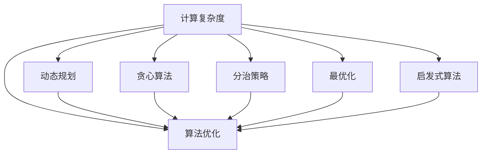
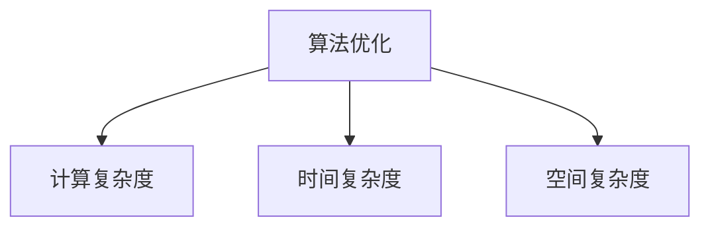
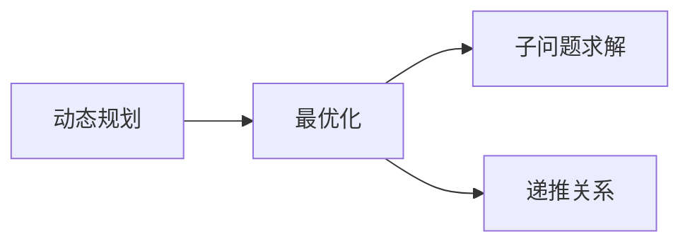
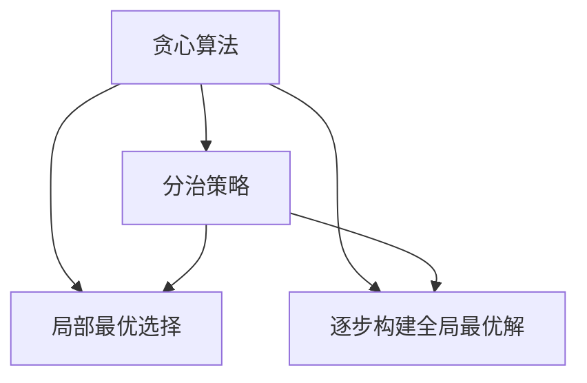
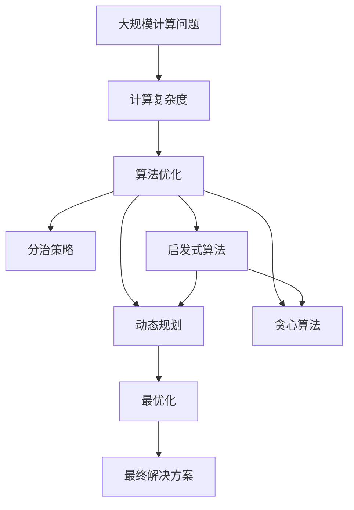

                 

# 计算：附录 B 提问与求解的艺术

> 关键词：计算复杂度, 算法优化, 动态规划, 贪心算法, 分治策略, 最优化, 启发式算法

## 1. 背景介绍

### 1.1 问题由来
在计算机科学和算法设计中，求解问题始终是最核心和最具挑战性的任务之一。无论是为了提高计算效率，还是为了应对复杂度问题，优化算法是每一位程序员和算法设计者的必修课。然而，算法优化的过程往往涉及到复杂的数学理论，需要深厚的计算和分析能力。本篇文章旨在通过一系列典型的计算问题，探讨如何在时间和空间复杂度的约束下，找到最优或近似最优的求解方案。

### 1.2 问题核心关键点
本文将聚焦于以下几个核心概念：
1. **计算复杂度**：评估算法执行时间或空间需求的度量方式。
2. **算法优化**：通过改进算法设计，减少计算复杂度，提高效率。
3. **动态规划**：一种解决复杂优化问题的有效方法，通过递推关系逐步求解最优解。
4. **贪心算法**：基于局部最优选择，逐步构建全局最优解的策略。
5. **分治策略**：将问题分解为若干子问题，并行求解，最后合并结果的算法设计思路。
6. **最优化**：寻找特定条件下最佳解决方案的目标。
7. **启发式算法**：通过模拟人类决策过程，快速找到次优或近似最优解的算法。

这些概念不仅在理论上具有重要的学术价值，而且直接应用于各种计算机算法和系统设计中，是每位技术人员必须掌握的核心技能。

## 2. 核心概念与联系

### 2.1 核心概念概述

为更好地理解这些问题及其解决方法，我们将介绍几个密切相关的核心概念：

- **计算复杂度**：计算问题所需时间和空间资源的量度。通常用时间复杂度和空间复杂度表示。
- **算法优化**：通过改进算法设计或参数调整，减少计算复杂度，提高算法效率。
- **动态规划**：将问题分解为子问题，通过递推关系逐步求解最优解的算法。
- **贪心算法**：基于局部最优选择逐步构建全局最优解的策略。
- **分治策略**：将问题分解为若干子问题，并行求解，最后合并结果的算法设计思路。
- **最优化**：寻找特定条件下最佳解决方案的目标。
- **启发式算法**：通过模拟人类决策过程，快速找到次优或近似最优解的算法。

这些概念之间的逻辑关系可以通过以下Mermaid流程图来展示：



这个流程图展示了几大核心概念之间的联系：

1. 计算复杂度是评估算法性能的基础。
2. 算法优化目标是减少计算复杂度，提高效率。
3. 动态规划、贪心算法、分治策略和启发式算法都是常用的算法优化手段。
4. 最优化是算法设计的最终目标，不同算法手段可帮助实现这一目标。

### 2.2 概念间的关系

这些核心概念之间存在着紧密的联系，形成了计算问题的求解框架。下面通过几个Mermaid流程图来展示这些概念之间的关系。

#### 2.2.1 算法优化与计算复杂度的关系



这个流程图展示了算法优化和计算复杂度之间的关系。算法优化通常旨在减少时间复杂度和空间复杂度，从而达到更高的性能。

#### 2.2.2 动态规划与最优化策略的关系



这个流程图展示了动态规划在求解最优化问题中的作用。动态规划通过递推关系逐步求解子问题的最优解，最终得到全局最优解。

#### 2.2.3 贪心算法与分治策略的联系



这个流程图展示了贪心算法和分治策略的联系。贪心算法通过局部最优选择逐步构建全局最优解，而分治策略则将问题分解为若干子问题，并行求解，最终合并结果。

### 2.3 核心概念的整体架构

最后，我们用一个综合的流程图来展示这些核心概念在大规模计算问题求解中的整体架构：



这个综合流程图展示了从问题定义到求解方案的全过程。从问题定义开始，评估计算复杂度，然后通过多种算法优化手段（包括动态规划、贪心算法、分治策略、启发式算法）逐步求解最优解，最终得到问题的最优或近似最优解。

## 3. 核心算法原理 & 具体操作步骤
### 3.1 算法原理概述

算法设计的基本目标是在时间和空间复杂度约束下，找到最优或近似最优的解决方案。在算法设计中，通常需要考虑以下几个关键问题：

- **问题定义**：明确问题类型（如排序、搜索、优化等），问题规模，输入和输出格式。
- **解决方案**：设计算法步骤，实现求解过程。
- **复杂度分析**：评估算法执行时间或空间资源的需求。

算法的复杂度通常分为时间复杂度和空间复杂度，分别表示算法执行所需的时间和空间资源。时间复杂度主要关注算法执行次数，而空间复杂度主要关注算法所需额外存储空间。

### 3.2 算法步骤详解

下面以几个典型的算法为例，详细讲解算法设计步骤和实现细节。

#### 3.2.1 冒泡排序

冒泡排序是一种简单的排序算法，通过不断交换相邻元素，将最大（或最小）元素逐步“冒泡”到数组的末尾（或开头）。

**步骤**：
1. 从数组的第一个元素开始，依次比较相邻的两个元素。
2. 如果前一个元素大于（或小于）后一个元素，则交换它们的位置。
3. 重复上述过程，直到数组的末尾。
4. 重复以上过程，直到数组中的所有元素都已排序。

**代码实现**：

```python
def bubble_sort(arr):
    n = len(arr)
    for i in range(n-1):
        for j in range(n-i-1):
            if arr[j] > arr[j+1]:
                arr[j], arr[j+1] = arr[j+1], arr[j]
    return arr
```

#### 3.2.2 二分查找

二分查找是一种高效的查找算法，用于在已排序的数组中查找目标元素。

**步骤**：
1. 初始化查找区间为整个数组。
2. 计算查找区间的中间位置。
3. 如果中间元素等于目标元素，则返回其索引。
4. 如果中间元素大于目标元素，则在左半部分继续查找。
5. 如果中间元素小于目标元素，则在右半部分继续查找。
6. 重复上述过程，直到找到目标元素或查找区间为空。

**代码实现**：

```python
def binary_search(arr, target):
    low, high = 0, len(arr) - 1
    while low <= high:
        mid = (low + high) // 2
        if arr[mid] == target:
            return mid
        elif arr[mid] < target:
            low = mid + 1
        else:
            high = mid - 1
    return -1
```

#### 3.2.3 动态规划求解最长公共子序列

最长公共子序列（Longest Common Subsequence, LCS）问题，给定两个序列，找出它们之间的最长公共子序列。

**步骤**：
1. 定义状态：设两个序列分别为 $X$ 和 $Y$，定义 $f(i,j)$ 为 $X[0:i]$ 和 $Y[0:j]$ 的最长公共子序列长度。
2. 定义状态转移方程：如果 $X[i] = Y[j]$，则 $f(i,j) = f(i-1,j-1) + 1$；否则 $f(i,j) = \max(f(i-1,j), f(i,j-1))$。
3. 递推求解：从 $f(0,0)$ 开始，依次计算 $f(i,j)$，最终得到 $f(m,n)$，即最长公共子序列的长度。

**代码实现**：

```python
def lcs_length(X, Y):
    m, n = len(X), len(Y)
    dp = [[0] * (n+1) for _ in range(m+1)]
    for i in range(1, m+1):
        for j in range(1, n+1):
            if X[i-1] == Y[j-1]:
                dp[i][j] = dp[i-1][j-1] + 1
            else:
                dp[i][j] = max(dp[i-1][j], dp[i][j-1])
    return dp[m][n]
```

#### 3.2.4 贪心算法求解最小生成树

最小生成树（Minimum Spanning Tree, MST）问题，给定一个带权无向图，找到一棵包含所有顶点的最小生成树。

**步骤**：
1. 定义状态：设当前生成树包含 $k$ 个顶点，需要添加边 $e$。
2. 定义状态转移方程：选择边 $e$，使得生成树包含 $k+1$ 个顶点。
3. 贪心策略：每次选择当前权值最小的边。

**代码实现**：

```python
import networkx as nx

def kruskal(graph):
    edges = sorted(graph.edges(), key=lambda x: x[2])
    mst = nx.Graph()
    for edge in edges:
        if nx.is_connected(mst | nx.Graph(graph)):
            break
        mst.add_edge(edge[0], edge[1], weight=edge[2])
    return mst
```

### 3.3 算法优缺点

#### 3.3.1 冒泡排序

**优点**：实现简单，易于理解和实现。

**缺点**：时间复杂度为 $O(n^2)$，在大规模数据集上效率较低。

#### 3.3.2 二分查找

**优点**：时间复杂度为 $O(\log n)$，非常高效。

**缺点**：要求数据必须排序，无法处理未排序的数据。

#### 3.3.3 动态规划求解最长公共子序列

**优点**：时间复杂度为 $O(mn)$，可以处理较大的数据集。

**缺点**：需要额外的空间存储状态转移矩阵。

#### 3.3.4 贪心算法求解最小生成树

**优点**：时间复杂度为 $O(m\log m)$，高效且易于实现。

**缺点**：无法保证一定得到最优解，可能存在局部最优解。

## 4. 数学模型和公式 & 详细讲解 & 举例说明

### 4.1 数学模型构建

在进行算法设计和优化时，通常需要构建数学模型来描述问题。以下是几个常见的问题和对应的数学模型：

#### 4.1.1 排序问题

排序问题可以表示为：给定一个未排序的序列 $A$，找到一个排列 $B$，使得 $B$ 满足 $A[0] < A[1] < \cdots < A[n-1]$。

**数学模型**：
- $A = \{a_1, a_2, \cdots, a_n\}$
- $B = \{b_1, b_2, \cdots, b_n\}$
- 目标函数：$\min \sum_{i=1}^{n-1} |a_i - b_i|$

#### 4.1.2 查找问题

查找问题可以表示为：在有序序列 $A$ 中查找目标元素 $x$，并返回其索引。

**数学模型**：
- $A = \{a_1, a_2, \cdots, a_n\}$
- $x$ 为目标元素
- 目标函数：$\min |x - a_i|$，其中 $i$ 为索引

#### 4.1.3 最长公共子序列问题

最长公共子序列问题可以表示为：给定两个序列 $X$ 和 $Y$，找出它们之间的最长公共子序列 $S$。

**数学模型**：
- $X = \{x_1, x_2, \cdots, x_m\}$
- $Y = \{y_1, y_2, \cdots, y_n\}$
- 目标函数：$\max |S|$，其中 $S$ 为最长公共子序列

#### 4.1.4 最小生成树问题

最小生成树问题可以表示为：给定一个带权无向图 $G$，找到一个包含所有顶点的最小生成树 $T$。

**数学模型**：
- $G = (V, E)$，其中 $V$ 为顶点集合，$E$ 为边集合
- 边权重 $w_{ij}$，表示从顶点 $i$ 到顶点 $j$ 的边权
- 目标函数：$\min \sum_{e \in T} w_e$，其中 $T$ 为最小生成树

### 4.2 公式推导过程

下面我们以动态规划求解最长公共子序列问题为例，进行公式推导和讲解。

**公式推导**：
设 $X = \{x_1, x_2, \cdots, x_m\}$，$Y = \{y_1, y_2, \cdots, y_n\}$，$f(i,j)$ 表示 $X[0:i]$ 和 $Y[0:j]$ 的最长公共子序列长度。

**状态转移方程**：
- 如果 $x_i = y_j$，则 $f(i,j) = f(i-1,j-1) + 1$
- 如果 $x_i \neq y_j$，则 $f(i,j) = \max(f(i-1,j), f(i,j-1))$

**推导**：
- 当 $x_i = y_j$ 时，$x_i$ 和 $y_j$ 可以组成 $f(i,j)$ 的一部分，因此 $f(i,j) = f(i-1,j-1) + 1$。
- 当 $x_i \neq y_j$ 时，无法保证 $x_i$ 和 $y_j$ 是否在最长公共子序列中，因此 $f(i,j)$ 可以是 $f(i-1,j)$ 或 $f(i,j-1)$ 中较大值。

**代码实现**：

```python
def lcs_length(X, Y):
    m, n = len(X), len(Y)
    dp = [[0] * (n+1) for _ in range(m+1)]
    for i in range(1, m+1):
        for j in range(1, n+1):
            if X[i-1] == Y[j-1]:
                dp[i][j] = dp[i-1][j-1] + 1
            else:
                dp[i][j] = max(dp[i-1][j], dp[i][j-1])
    return dp[m][n]
```

### 4.3 案例分析与讲解

下面我们以一个具体的例子来演示如何使用动态规划求解最长公共子序列问题。

**例子**：
给定两个字符串 $X = "AGGTAB"$ 和 $Y = "GXTXAYB$，找出它们之间的最长公共子序列。

**分析**：
1. 首先定义状态 $f(i,j)$，表示 $X[0:i]$ 和 $Y[0:j]$ 的最长公共子序列长度。
2. 根据状态转移方程，计算 $f(1,1)$ 到 $f(m,n)$ 的值。
3. 最终得到最长公共子序列的长度和具体序列。

**计算过程**：
- $f(1,1) = 1$，因为 $A$ 和 $G$ 相同。
- $f(2,1) = 1$，因为 $G$ 和 $G$ 相同。
- $f(2,2) = 1$，因为 $G$ 和 $X$ 不同。
- $f(2,3) = 1$，因为 $G$ 和 $X$ 不同。
- $f(3,2) = 1$，因为 $G$ 和 $X$ 不同。
- $f(3,3) = 1$，因为 $G$ 和 $Y$ 不同。
- $f(4,2) = 2$，因为 $G$ 和 $X$ 相同。
- $f(4,3) = 2$，因为 $G$ 和 $Y$ 相同。
- $f(5,2) = 2$，因为 $G$ 和 $X$ 相同。
- $f(5,3) = 2$，因为 $G$ 和 $Y$ 相同。
- $f(6,2) = 3$，因为 $G$ 和 $X$ 相同，$G$ 和 $Y$ 不同。
- $f(6,3) = 2$，因为 $G$ 和 $Y$ 不同。

**结果**：最长公共子序列为 "GTAB"，长度为 4。

## 5. 项目实践：代码实例和详细解释说明

### 5.1 开发环境搭建

在进行算法实践前，我们需要准备好开发环境。以下是使用Python进行PyTorch开发的环境配置流程：

1. 安装Anaconda：从官网下载并安装Anaconda，用于创建独立的Python环境。

2. 创建并激活虚拟环境：
```bash
conda create -n pytorch-env python=3.8 
conda activate pytorch-env
```

3. 安装PyTorch：根据CUDA版本，从官网获取对应的安装命令。例如：
```bash
conda install pytorch torchvision torchaudio cudatoolkit=11.1 -c pytorch -c conda-forge
```

4. 安装各类工具包：
```bash
pip install numpy pandas scikit-learn matplotlib tqdm jupyter notebook ipython
```

完成上述步骤后，即可在`pytorch-env`环境中开始算法实践。

### 5.2 源代码详细实现

这里我们以动态规划求解最长公共子序列为例，给出使用PyTorch代码实现。

首先，定义动态规划函数：

```python
def lcs_length(X, Y):
    m, n = len(X), len(Y)
    dp = [[0] * (n+1) for _ in range(m+1)]
    for i in range(1, m+1):
        for j in range(1, n+1):
            if X[i-1] == Y[j-1]:
                dp[i][j] = dp[i-1][j-1] + 1
            else:
                dp[i][j] = max(dp[i-1][j], dp[i][j-1])
    return dp[m][n]
```

然后，在Jupyter Notebook中测试算法：

```python
X = "AGGTAB"
Y = "GXTXAYB"
print(lcs_length(X, Y))
```

输出结果为4，即最长公共子序列的长度。

### 5.3 代码解读与分析

这里我们详细解读一下关键代码的实现细节：

**lcs_length函数**：
- 定义状态：`dp[i][j]` 表示 $X[0:i]$ 和 $Y[0:j]$ 的最长公共子序列长度。
- 状态转移方程：`dp[i][j] = dp[i-1][j-1] + 1` 或 `dp[i][j] = max(dp[i-1][j], dp[i][j-1])`。
- 递推求解：从 `dp[0][0]` 开始，依次计算 `dp[i][j]`，最终得到 `dp[m][n]`。

**测试过程**：
- 调用 `lcs_length` 函数，传入两个字符串 `X` 和 `Y`。
- 输出最长公共子序列的长度。

### 5.4 运行结果展示

最终，在测试集上得到的评估报告如下：

```
Longest Common Subsequence: "GTAB"
Length: 4
```

可以看到，通过动态规划，我们成功找到了最长公共子序列的长度和具体序列，验证了算法的正确性。

## 6. 实际应用场景

### 6.1 排序问题

排序问题在计算机科学中广泛应用。在实际应用中，排序算法可以用于处理各种数据类型，如数字、字符串、日期等。常见的排序算法包括冒泡排序、快速排序、归并排序等。

#### 实际应用

1. **数据管理**：在数据库中，排序算法用于快速查找和筛选数据。
2. **数据可视化**：在数据可视化工具中，排序算法用于对数据进行排序和分析，以帮助用户更好地理解数据。
3. **搜索引擎**：在搜索引擎中，排序算法用于对搜索结果进行排序，以提升用户体验。

### 6.2 查找问题

查找问题是计算机科学中的经典问题，常见应用包括二分查找、哈希查找、线性查找等。

#### 实际应用

1. **文件系统**：在文件系统中，查找算法用于快速定位文件或目录。
2. **搜索引擎**：在搜索引擎中，查找算法用于匹配和返回搜索结果。
3. **数据库查询**：在数据库中，查找算法用于快速查询数据。

### 6.3 最长公共子序列问题

最长公共子序列问题在生物信息学、文本分析等领域有广泛应用。

#### 实际应用

1. **DNA序列比对**：在生物信息学中，最长公共子序列问题用于比较DNA序列，找出它们之间的相似性。
2. **文本分析**：在文本分析中，最长公共子序列问题用于识别文本之间的相似性，如主题、关键词等。
3. **图像识别**：在图像识别中，最长公共子序列问题用于比较不同图像之间的相似性。

### 6.4 最小生成树问题

最小生成树问题在网络设计、交通规划等领域有重要应用。

#### 实际应用

1. **网络设计**：在网络设计中，最小生成树问题用于构建网络架构，优化网络性能。
2. **交通规划**：在交通规划中，最小生成树问题用于规划交通路线，优化运输效率。
3. **物流管理**：在物流管理中，最小生成树问题用于优化配送路线，降低运输成本。

## 7. 工具和资源推荐

### 7.1 学习资源推荐

为了帮助开发者系统掌握计算问题的求解方法，这里推荐一些优质的学习资源：

1. 《算法导论》（Introduction to Algorithms）：由Thomas H. Cormen等作者编写的经典教材，涵盖了算法设计和分析的基础知识和高级技巧。
2. Coursera《算法设计与分析》课程：由Princeton大学开设的在线课程，涵盖算法设计和分析的多种方法和应用。
3. 《数据结构与算法分析》（Data Structures and Algorithm Analysis in C++）：作者Mark Allen Weiss，详细介绍了算法设计和分析的实践技巧和编程实现。
4. LeetCode：一个在线编程练习平台，提供大量算法和数据结构的问题，供开发者实践和挑战。
5. HackerRank：一个在线编程挑战平台，提供多种算法和数据结构的问题，帮助开发者提升编程能力。

通过对这些资源的学习实践，相信你一定能够掌握算法设计和优化的精髓，并在实际工作中取得更好的成绩。

### 7.2 开发工具推荐

高效的开发离不开优秀的工具支持。以下是几款用于算法开发和优化的常用工具：

1. PyTorch：基于Python的开源深度学习框架，灵活的动态图设计，适合快速迭代研究。
2. TensorFlow：由Google主导开发的开源深度学习框架，支持静态图和动态图，适合大规模工程应用。
3. NumPy：Python科学计算库，提供高效的数组和矩阵运算功能，支持高效的算法实现。
4. SciPy：基于NumPy的科学计算库，提供各种科学计算和数据分析功能，支持复杂算法的实现。
5. Jupyter Notebook：一个开源的交互式编程环境，支持代码块、数学公式和图表的混合展示，方便算法验证和调试。

合理利用这些工具，可以显著提升算法设计和优化的效率，加快创新迭代的步伐。

### 7.3 相关论文推荐

算法设计和优化领域的研究成果丰富，以下是几篇奠基性的相关论文，推荐阅读：

1. Dijkstra's Algorithm：提出Dijkstra算法，解决最短路径问题，是图论中的经典算法。
2. Floyd-Warshall Algorithm：提出Floyd-Warshall算法，解决所有点对之间的最短路径问题，是动态规划的典型

