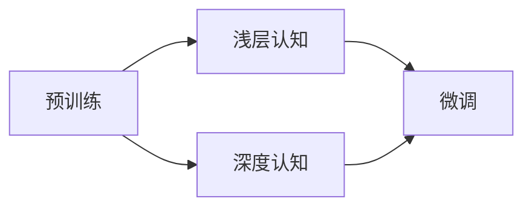

                 

# 认知发展中的浅薄与深刻对比

## 1. 背景介绍

在当今信息爆炸的时代，人们获取和处理信息的渠道愈加多样，深度认知能力面临前所未有的挑战。大模型所具备的泛化能力，一方面为深度认知提供了一种新的可能性，另一方面也给浅层认知带来了新的思维范式。本文通过探讨大模型与传统认知理论之间的异同，揭示了浅薄与深刻认知能力的发展轨迹，并对其未来趋势进行展望。

## 2. 核心概念与联系

### 2.1 核心概念概述

1. **深度认知**：以逻辑思维和推理能力为核心的认知能力，涉及复杂问题求解、因果关系推断、抽象概念形成等方面。深度认知往往需要较长时间的学习和积累。

2. **浅层认知**：以模式识别和记忆为核心的认知能力，涉及感知、记忆、联想等方面。浅层认知能快速形成直观的认知，但深度和逻辑性较弱。

3. **大模型**：通过自监督学习在大量数据上进行预训练的语言模型，如BERT、GPT等。大模型具备强大的泛化能力和语言理解能力。

4. **认知发展**：通过学习和训练，大模型逐步具备深度认知和浅层认知能力。在大模型的不同预训练和微调阶段，其认知能力会表现出显著的差异。

5. **模型复杂度**：大模型的复杂度可以通过参数量、模型结构、训练数据等维度来衡量。复杂度越高，模型的认知能力通常也越强。

### 2.2 概念间的关系

认知发展中的浅薄与深刻能力，可以类比为大模型的不同复杂度。在大模型的不同预训练和微调阶段，其浅层和深度认知能力分别得到了不同程度的提升。通过模型复杂度这一维度，可以系统地分析大模型认知能力的变化。

## 3. 核心算法原理 & 具体操作步骤
### 3.1 算法原理概述

大模型的认知能力发展可以分为两个主要阶段：预训练和微调。

- **预训练阶段**：通过在大规模无标签文本数据上自监督学习，大模型获取了广泛的语言知识和常识。这一阶段主要提升其浅层认知能力，如词汇理解、文本结构识别等。

- **微调阶段**：在特定下游任务上，通过有监督学习对大模型进行微调。微调主要提升其深度认知能力，如特定领域的语言理解、推理和生成等。

大模型的认知能力发展过程可以用以下示意图表示：



在预训练阶段，大模型主要提升了浅层认知能力；在微调阶段，大模型进一步发展了深度认知能力。微调后的模型可以更好地应对特定领域的任务，表现出更强的深度认知能力。

### 3.2 算法步骤详解

1. **数据预处理**：收集大规模无标签文本数据，如维基百科、新闻、书籍等。将数据进行分词、归一化等预处理，准备进行模型训练。

2. **模型预训练**：在大规模数据上使用自监督任务进行预训练，如掩码语言模型、下一句预测等。预训练提升模型的浅层认知能力。

3. **微调任务设计**：选择特定下游任务，设计合适的任务适配层和损失函数。常用的任务包括分类、匹配、生成等。

4. **微调模型训练**：在标注数据上使用有监督学习进行微调。微调提升模型的深度认知能力。

5. **评估与部署**：在测试集上评估微调后的模型性能，部署模型至生产环境，进行实际应用。

### 3.3 算法优缺点

大模型微调的优缺点如下：

**优点**：
- **泛化能力强**：通过在大规模数据上的预训练，大模型具备强大的泛化能力，能处理多样化的下游任务。
- **可扩展性好**：大模型可以在新任务上进行快速微调，适应新的应用场景。
- **浅层认知能力高**：预训练阶段提升了浅层认知能力，如词汇理解、文本结构识别等。

**缺点**：
- **深度认知能力有限**：微调过程主要提升深度认知能力，但模型仍受限于预训练知识。
- **过拟合风险**：小样本微调可能导致过拟合，影响模型泛化能力。
- **计算资源消耗大**：预训练和微调过程需要大量计算资源和时间，对硬件要求较高。

### 3.4 算法应用领域

大模型微调方法广泛应用在自然语言处理（NLP）领域，涵盖文本分类、命名实体识别、关系抽取、问答系统、机器翻译、文本摘要、对话系统等诸多任务。

## 4. 数学模型和公式 & 详细讲解

### 4.1 数学模型构建

在微调任务中，通常采用交叉熵损失函数。假设微调任务为分类任务，训练样本为 $(x_i, y_i)$，模型输出为 $p(y_i|x_i)$，则交叉熵损失函数为：

$$
\mathcal{L} = -\frac{1}{N} \sum_{i=1}^N \log p(y_i|x_i)
$$

其中 $N$ 为训练样本数量。

### 4.2 公式推导过程

设微调模型为 $M_{\theta}$，其中 $\theta$ 为模型参数。在微调任务 $T$ 上，模型的输出为 $\hat{y}=M_{\theta}(x)$。交叉熵损失函数为：

$$
\mathcal{L}(\theta) = -\frac{1}{N}\sum_{i=1}^N \log \hat{y}_i
$$

其中 $\hat{y}_i$ 为模型对第 $i$ 个样本的预测结果，$y_i$ 为真实标签。模型参数 $\theta$ 的更新公式为：

$$
\theta \leftarrow \theta - \eta \nabla_{\theta}\mathcal{L}(\theta)
$$

其中 $\eta$ 为学习率，$\nabla_{\theta}\mathcal{L}(\theta)$ 为损失函数对模型参数的梯度。

### 4.3 案例分析与讲解

以BERT模型为例，假设有情感分析任务，数据集为 $\{(x_i, y_i)\}_{i=1}^N$，其中 $x_i$ 为文本，$y_i$ 为情感标签（0 或 1）。微调过程如下：

1. **数据预处理**：将文本 $x_i$ 转化为模型输入，设定标签 $y_i$ 为 0 或 1。
2. **模型预训练**：使用BERT在大规模无标签数据上预训练，提升浅层认知能力。
3. **微调模型设计**：设计一个二分类任务适配层，设定交叉熵损失函数。
4. **微调模型训练**：在情感分析数据集上训练微调模型，更新参数 $\theta$。
5. **评估与部署**：在测试集上评估模型性能，部署模型进行情感分析。

## 5. 项目实践：代码实例和详细解释说明

### 5.1 开发环境搭建

1. **安装PyTorch**：
```bash
pip install torch torchvision torchaudio
```

2. **安装Transformers库**：
```bash
pip install transformers
```

3. **安装BERT模型**：
```bash
pip install transformers
```

### 5.2 源代码详细实现

以BERT微调进行情感分析为例，实现代码如下：

```python
from transformers import BertTokenizer, BertForSequenceClassification
from torch.utils.data import DataLoader, Dataset
import torch
import numpy as np

# 定义数据集类
class SentimentDataset(Dataset):
    def __init__(self, texts, labels, tokenizer):
        self.tokenizer = tokenizer
        self.texts = texts
        self.labels = labels
        
    def __len__(self):
        return len(self.texts)
    
    def __getitem__(self, item):
        text = self.texts[item]
        label = self.labels[item]
        
        encoding = self.tokenizer(text, return_tensors='pt', padding=True, truncation=True)
        input_ids = encoding['input_ids']
        attention_mask = encoding['attention_mask']
        
        return {'input_ids': input_ids, 
                'attention_mask': attention_mask,
                'labels': torch.tensor(label)}

# 训练和评估函数
def train_epoch(model, data_loader, optimizer, device):
    model.train()
    total_loss = 0
    for batch in data_loader:
        input_ids = batch['input_ids'].to(device)
        attention_mask = batch['attention_mask'].to(device)
        labels = batch['labels'].to(device)
        
        model.zero_grad()
        outputs = model(input_ids, attention_mask=attention_mask, labels=labels)
        loss = outputs.loss
        total_loss += loss.item()
        loss.backward()
        optimizer.step()
        
    return total_loss / len(data_loader)

def evaluate(model, data_loader, device):
    model.eval()
    correct = 0
    total = 0
    for batch in data_loader:
        input_ids = batch['input_ids'].to(device)
        attention_mask = batch['attention_mask'].to(device)
        labels = batch['labels'].to(device)
        
        outputs = model(input_ids, attention_mask=attention_mask, labels=labels)
        predictions = outputs.logits.argmax(dim=1)
        
        correct += (predictions == labels).sum().item()
        total += labels.size(0)
    
    return correct / total

# 加载模型和数据
model = BertForSequenceClassification.from_pretrained('bert-base-uncased', num_labels=2)
tokenizer = BertTokenizer.from_pretrained('bert-base-uncased')
train_dataset = SentimentDataset(train_data, train_labels, tokenizer)
val_dataset = SentimentDataset(val_data, val_labels, tokenizer)
test_dataset = SentimentDataset(test_data, test_labels, tokenizer)

# 设置超参数
device = torch.device('cuda') if torch.cuda.is_available() else torch.device('cpu')
optimizer = AdamW(model.parameters(), lr=2e-5)

# 训练过程
for epoch in range(num_epochs):
    train_loss = train_epoch(model, train_loader, optimizer, device)
    val_accuracy = evaluate(model, val_loader, device)
    
    print(f'Epoch {epoch+1}, train loss: {train_loss:.3f}, val accuracy: {val_accuracy:.3f}')

# 评估和部署
test_accuracy = evaluate(model, test_loader, device)
print(f'Test accuracy: {test_accuracy:.3f}')
```

### 5.3 代码解读与分析

以上代码展示了BERT模型在情感分析任务上的微调过程。主要步骤包括数据集定义、模型加载、训练和评估函数的设计以及训练过程的实现。

1. **数据集定义**：定义数据集类 `SentimentDataset`，实现 `__len__` 和 `__getitem__` 方法，将文本数据和标签转化为模型所需的输入。
2. **模型加载**：使用 `BertForSequenceClassification` 加载BERT模型，并设定标签数量。
3. **训练和评估函数**：定义训练和评估函数，实现前向传播、损失计算、梯度更新和模型评估。
4. **训练过程**：使用优化器和设备，进行模型训练和验证。

## 6. 实际应用场景

### 6.1 智能客服系统

智能客服系统通过大模型微调技术，可以实现快速响应客户咨询、理解客户意图、提供个性化推荐等功能。在实际应用中，系统可以使用微调后的对话模型，实时获取客户输入，通过语言理解生成合适回复，提升客户体验。

### 6.2 金融舆情监测

金融舆情监测系统通过微调大模型，可以实时监测市场舆论动向，识别负面信息，帮助金融机构及时应对潜在的风险。系统可以使用微调后的文本分类和情感分析模型，自动对网络新闻和评论进行分类和情感标注，预警异常情况。

### 6.3 个性化推荐系统

个性化推荐系统通过微调大模型，可以分析用户历史行为数据，推荐相关内容。系统可以使用微调后的语言模型，提取用户兴趣点，生成个性化的推荐列表，提升推荐效果。

### 6.4 未来应用展望

未来，大模型微调技术将进一步拓展应用领域，如智慧医疗、智能教育、智慧城市等。大模型将逐步成为各行业的重要基础设施，推动各行各业的数字化转型。同时，微调技术也将不断优化，提升模型的泛化能力和应用效果。

## 7. 工具和资源推荐

### 7.1 学习资源推荐

1. **深度学习基础**：《深度学习》课程，斯坦福大学，Andrew Ng讲授。
2. **自然语言处理**：《自然语言处理综论》，Daniel Jurafsky和James H. Martin合著。
3. **大模型技术**：《Transformer from Basics to Benchmarks》，Yu Wu等著。

### 7.2 开发工具推荐

1. **PyTorch**：高效灵活的深度学习框架，适用于模型开发和研究。
2. **TensorFlow**：生产部署友好的深度学习框架，适用于工业应用。
3. **HuggingFace Transformers**：NLP领域领先的大模型库，提供丰富的预训练模型和微调API。

### 7.3 相关论文推荐

1. **BERT**：《BERT: Pre-training of Deep Bidirectional Transformers for Language Understanding》，Jacob Devlin等著。
2. **GPT-3**：《Language Models are Unsupervised Multitask Learners》，OpenAI等著。
3. **LoRA**：《LoRA: Language Representations by Rotating Attentions》，Guillaume Lample等著。

## 8. 总结：未来发展趋势与挑战

### 8.1 研究成果总结

本文探讨了大模型在认知发展中的浅薄与深刻对比，揭示了预训练和微调对认知能力提升的影响。通过系统分析大模型的复杂度与认知能力之间的关系，对大模型微调方法进行了深入解读。

### 8.2 未来发展趋势

未来，大模型微调技术将持续发展，主要趋势包括：
1. **模型复杂度提升**：大模型的复杂度将进一步提升，具备更强的浅层和深度认知能力。
2. **多模态融合**：大模型将逐步支持图像、视频等多模态数据，提升模型的综合理解能力。
3. **元学习研究**：元学习技术将进一步发展，提升大模型的学习效率和适应性。
4. **跨领域迁移**：大模型将具备更强的跨领域迁移能力，支持多种应用场景。

### 8.3 面临的挑战

大模型微调技术虽然取得显著进展，但仍面临诸多挑战：
1. **计算资源消耗大**：大模型微调需要大量计算资源和时间。
2. **数据依赖性强**：微调效果受限于数据质量和标注量。
3. **过拟合风险高**：小样本微调容易导致过拟合。
4. **模型鲁棒性不足**：大模型面临过拟合和泛化能力不足的问题。

### 8.4 研究展望

未来，大模型微调技术的研究方向包括：
1. **无监督学习**：探索无监督学习技术，降低对标注数据的依赖。
2. **对抗训练**：引入对抗训练技术，提高模型鲁棒性和泛化能力。
3. **参数高效微调**：开发更高效的微调方法，减少计算资源消耗。
4. **多模态融合**：研究多模态数据的微调方法，提升综合理解能力。

总之，大模型微调技术的发展将进一步推动人工智能技术的成熟和普及，助力各行业数字化转型。通过不断优化和创新，大模型微调技术必将在未来展现更加广阔的应用前景。

## 9. 附录：常见问题与解答

**Q1：大模型微调是否适用于所有NLP任务？**

A: 大模型微调在大多数NLP任务上都能取得不错的效果，特别是对于数据量较小的任务。但对于一些特定领域的任务，如医学、法律等，仅仅依靠通用语料预训练的模型可能难以很好地适应。此时需要在特定领域语料上进一步预训练，再进行微调，才能获得理想效果。

**Q2：微调过程中如何选择合适的学习率？**

A: 微调的学习率一般要比预训练时小1-2个数量级，如果使用过大的学习率，容易破坏预训练权重，导致过拟合。一般建议从1e-5开始调参，逐步减小学习率，直至收敛。也可以使用warmup策略，在开始阶段使用较小的学习率，再逐渐过渡到预设值。需要注意的是，不同的优化器(如AdamW、Adafactor等)以及不同的学习率调度策略，可能需要设置不同的学习率阈值。

**Q3：采用大模型微调时会面临哪些资源瓶颈？**

A: 目前主流的预训练大模型动辄以亿计的参数规模，对算力、内存、存储都提出了很高的要求。GPU/TPU等高性能设备是必不可少的，但即便如此，超大批次的训练和推理也可能遇到显存不足的问题。因此需要采用一些资源优化技术，如梯度积累、混合精度训练、模型并行等，来突破硬件瓶颈。同时，模型的存储和读取也可能占用大量时间和空间，需要采用模型压缩、稀疏化存储等方法进行优化。

**Q4：如何缓解微调过程中的过拟合问题？**

A: 过拟合是微调面临的主要挑战，尤其是在标注数据不足的情况下。常见的缓解策略包括：
1. 数据增强：通过回译、近义替换等方式扩充训练集
2. 正则化：使用L2正则、Dropout、Early Stopping等避免过拟合
3. 对抗训练：引入对抗样本，提高模型鲁棒性
4. 参数高效微调：只调整少量参数(如Adapter、Prefix等)，减小过拟合风险
5. 多模型集成：训练多个微调模型，取平均输出，抑制过拟合

这些策略往往需要根据具体任务和数据特点进行灵活组合。只有在数据、模型、训练、推理等各环节进行全面优化，才能最大限度地发挥大模型微调的威力。

**Q5：微调模型在落地部署时需要注意哪些问题？**

A: 将微调模型转化为实际应用，还需要考虑以下因素：
1. 模型裁剪：去除不必要的层和参数，减小模型尺寸，加快推理速度
2. 量化加速：将浮点模型转为定点模型，压缩存储空间，提高计算效率
3. 服务化封装：将模型封装为标准化服务接口，便于集成调用
4. 弹性伸缩：根据请求流量动态调整资源配置，平衡服务质量和成本
5. 监控告警：实时采集系统指标，设置异常告警阈值，确保服务稳定性
6. 安全防护：采用访问鉴权、数据脱敏等措施，保障数据和模型安全

大模型微调为NLP应用开启了广阔的想象空间，但如何将强大的性能转化为稳定、高效、安全的业务价值，还需要工程实践的不断打磨。唯有从数据、算法、工程、业务等多个维度协同发力，才能真正实现人工智能技术在垂直行业的规模化落地。总之，微调需要开发者根据具体任务，不断迭代和优化模型、数据和算法，方能得到理想的效果。

---

作者：禅与计算机程序设计艺术 / Zen and the Art of Computer Programming

