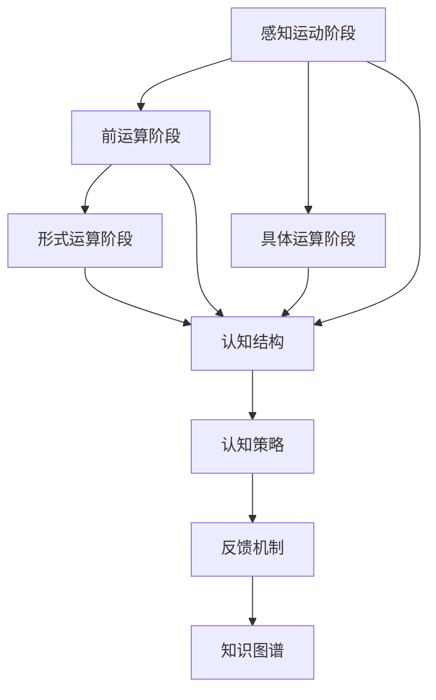
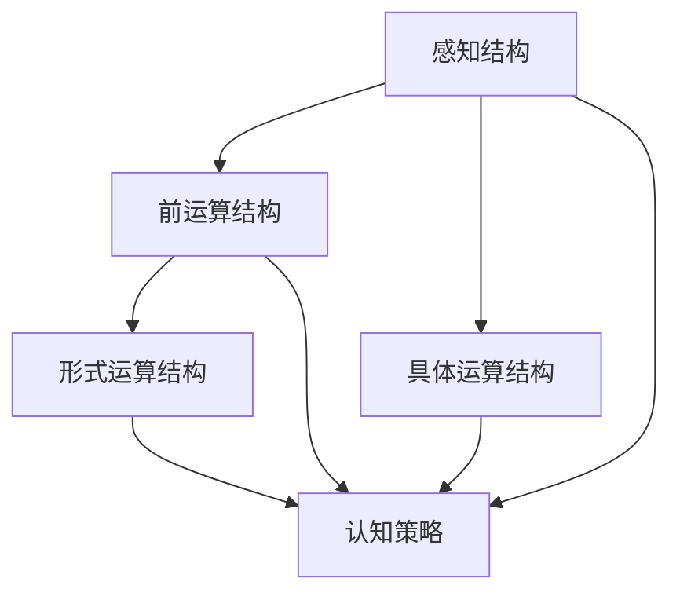
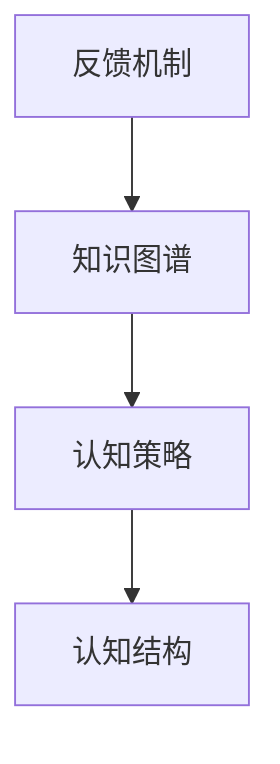
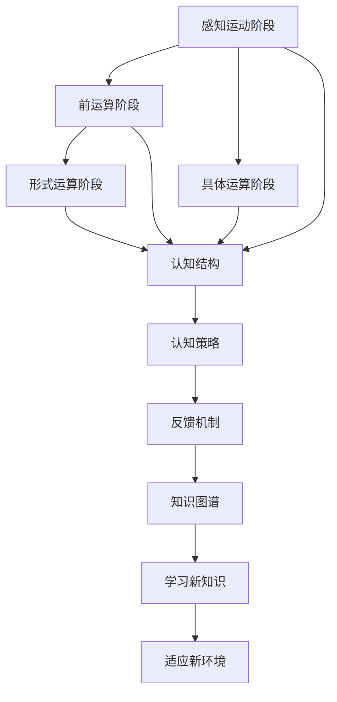

                 

# 认知发展的阶段性路径模型

## 1. 背景介绍

### 1.1 问题由来
认知发展理论（Cognitive Development Theory）是心理学中探讨人类认知能力成长过程的重要理论之一。它主要关注个体从出生到成年的认知结构变化，以及这一过程是如何受到环境和经验影响的。认知发展理论的核心在于揭示认知发展的阶段性特点，帮助理解儿童心理发展规律，促进其全面发展。

近年来，随着人工智能（AI）技术的不断进步，研究者们开始将认知发展的阶段性特点应用于机器学习模型中，以期构建更加智能、适应的学习系统。认知发展的阶段性路径模型（Cognitive Developmental Pathway Model）正是基于此背景提出的一种新型机器学习模型，它将认知发展理论融入模型设计，实现了对人类认知过程的模拟和复制。

### 1.2 问题核心关键点
认知发展的阶段性路径模型旨在通过模拟人类认知发展的阶段性特点，构建一个能够动态适应环境变化、逐步提升认知能力的智能系统。其核心关键点包括：

- 认知发展阶段划分：将认知发展过程划分为多个阶段，每个阶段具有不同的认知能力特点。
- 阶段间的衔接：通过机制设计，使得模型能够在不同认知阶段间平滑过渡，提升整体认知能力。
- 环境适应能力：模型能够根据环境变化自动调整认知策略，实现灵活适应。
- 反馈机制：通过持续反馈，不断优化模型认知能力，促进其向更高阶段发展。

### 1.3 问题研究意义
研究认知发展的阶段性路径模型，对于理解和优化机器学习模型的认知能力、推动人工智能技术在教育和培训等领域的广泛应用，具有重要意义：

1. **教育培训**：模型能够模拟儿童认知发展过程，为教育者提供科学的教学方法，帮助儿童更好地学习和发展。
2. **游戏娱乐**：通过适度的挑战和反馈，提升玩家的认知能力，增加游戏趣味性和挑战性。
3. **智能客服**：模型能够理解用户认知水平，提供个性化、适度的回答，提升用户体验。
4. **自动化辅助**：在复杂任务中，模型能够逐步提升认知能力，辅助人类完成任务。
5. **知识图谱**：模拟人类认知过程，帮助构建更丰富、更准确的知识图谱。

## 2. 核心概念与联系

### 2.1 核心概念概述

为更好地理解认知发展的阶段性路径模型，本节将介绍几个密切相关的核心概念：

- **认知发展阶段**：皮亚杰（Jean Piaget）将儿童认知发展分为感知运动阶段（0-2岁）、前运算阶段（2-7岁）、具体运算阶段（7-11岁）和形式运算阶段（11岁以上），每个阶段具有不同的认知特点。
- **认知结构**：认知结构指个体在某一认知发展阶段所形成的内部心理结构，包括感知、记忆、思维等基本认知能力。
- **认知策略**：认知策略是指个体在特定认知任务中采用的解决问题的方法，如分类、推理等。
- **反馈机制**：反馈机制是指模型根据当前认知状态和环境变化，调整认知策略和行为的过程。
- **知识图谱**：知识图谱是一种以图形化方式表示知识及其关系的工具，用于模拟和表达复杂知识系统。

这些核心概念之间的逻辑关系可以通过以下Mermaid流程图来展示：



这个流程图展示了一系列与认知发展阶段性路径模型密切相关的核心概念及其关系：

1. 认知发展阶段分为四个主要阶段，每个阶段对应不同的认知结构和策略。
2. 认知结构在每个阶段都有所不同，表现为感知、记忆、思维等基本认知能力的变化。
3. 认知策略随着认知结构的变化而变化，用于解决不同的认知任务。
4. 反馈机制根据认知策略的执行效果，调整认知策略，提升认知能力。
5. 知识图谱用于存储和表达不同阶段的认知知识和策略，帮助模型实现认知状态的迁移和延续。

### 2.2 概念间的关系

这些核心概念之间存在着紧密的联系，形成了认知发展的阶段性路径模型的完整生态系统。下面我们通过几个Mermaid流程图来展示这些概念之间的关系。

#### 2.2.1 认知发展阶段之间的关系


这个流程图展示了大模型微调的认知发展阶段之间的关系。感知运动阶段通过基本的感知和动作完成简单的任务；前运算阶段通过语言和符号完成更复杂的认知任务；具体运算阶段通过逻辑和数理能力进一步提升认知能力；形式运算阶段通过抽象思维和逻辑推理解决复杂的认知问题。

#### 2.2.2 认知结构与认知策略的关系



这个流程图展示了认知结构与认知策略之间的关系。认知结构在每个阶段都有所不同，表现为感知、记忆、思维等基本认知能力的变化；认知策略随着认知结构的变化而变化，用于解决不同的认知任务，如分类、推理等。

#### 2.2.3 反馈机制与知识图谱的关系



这个流程图展示了反馈机制与知识图谱之间的关系。反馈机制根据认知策略的执行效果，调整认知策略，提升认知能力；知识图谱用于存储和表达不同阶段的认知知识和策略，帮助模型实现认知状态的迁移和延续。

### 2.3 核心概念的整体架构

最后，我们用一个综合的流程图来展示这些核心概念在大语言模型微调过程中的整体架构：



这个综合流程图展示了从感知运动阶段到形式运算阶段的完整认知发展过程，以及认知结构、认知策略、反馈机制、知识图谱等核心概念的相互作用。

## 3. 核心算法原理 & 具体操作步骤
### 3.1 算法原理概述

认知发展的阶段性路径模型是一种基于认知发展理论的机器学习模型。其核心算法原理是通过模拟人类认知发展的阶段性特点，构建一个能够动态适应环境变化、逐步提升认知能力的智能系统。

该模型假设认知发展过程可以分为多个阶段，每个阶段具有不同的认知能力特点。模型通过学习每个阶段的知识和策略，逐步提升认知能力，最终实现复杂的认知任务。

### 3.2 算法步骤详解

认知发展的阶段性路径模型构建过程包括以下关键步骤：

**Step 1: 阶段划分与认知结构定义**
- 根据认知发展理论，定义认知发展的四个主要阶段：感知运动阶段、前运算阶段、具体运算阶段和形式运算阶段。
- 为每个阶段定义基本的认知结构，如感知能力、记忆能力、思维能力等。

**Step 2: 认知策略设计**
- 为每个认知阶段设计适用的认知策略，如分类、推理、归纳等。
- 策略设计需要考虑当前认知结构的限制，避免超出认知范围的复杂操作。

**Step 3: 反馈机制实现**
- 根据当前认知策略的执行效果，设计反馈机制，调整认知策略。
- 反馈机制可以基于错误率、时间成本、资源消耗等指标，进行策略调整。

**Step 4: 知识图谱构建**
- 根据当前认知阶段的知识和策略，构建知识图谱，存储和表达认知状态。
- 知识图谱可以通过图形化方式表示，便于理解和操作。

**Step 5: 学习新知识与适应新环境**
- 通过与环境的交互，学习新的知识和技能，更新认知结构和策略。
- 模型可以根据环境变化，自动调整认知策略，适应新的认知需求。

**Step 6: 模型评估与优化**
- 定期评估模型的认知能力，确定提升方向和优化策略。
- 通过持续反馈和优化，逐步提升模型的认知水平。

### 3.3 算法优缺点

认知发展的阶段性路径模型具有以下优点：

- **自适应性**：模型能够根据环境变化，自动调整认知策略，实现灵活适应。
- **逐步提升**：通过逐步提升认知能力，模型能够在复杂任务中取得更好的表现。
- **可解释性**：模型认知过程具有阶段性特点，便于理解和解释。

同时，该模型也存在以下缺点：

- **计算复杂度高**：模型需要处理和存储大量的认知知识和策略，计算复杂度高。
- **阶段划分困难**：认知发展阶段划分需要专家知识和经验，难以自动化处理。
- **泛化能力不足**：模型在特定阶段学习知识和策略，泛化能力可能受限。

### 3.4 算法应用领域

认知发展的阶段性路径模型已经在多个领域得到应用，例如：

- **教育培训**：用于模拟儿童认知发展过程，帮助教育者设计科学的教学方法。
- **游戏娱乐**：通过适度的挑战和反馈，提升玩家的认知能力，增加游戏趣味性和挑战性。
- **智能客服**：模型能够理解用户认知水平，提供个性化、适度的回答，提升用户体验。
- **自动化辅助**：在复杂任务中，模型能够逐步提升认知能力，辅助人类完成任务。
- **知识图谱**：模拟人类认知过程，帮助构建更丰富、更准确的知识图谱。

## 4. 数学模型和公式 & 详细讲解 & 举例说明

### 4.1 数学模型构建

本节将使用数学语言对认知发展的阶段性路径模型进行更加严格的刻画。

假设认知发展过程可以划分为四个主要阶段，分别为感知运动阶段（0-2岁）、前运算阶段（2-7岁）、具体运算阶段（7-11岁）和形式运算阶段（11岁以上）。

定义认知结构 $S$ 和认知策略 $T$，分别表示当前认知阶段的感知、记忆、思维等基本认知能力和采用的解决问题的方法。模型在每个阶段具有不同的认知结构和策略，可以通过以下公式表示：

$$
S_i = \begin{cases}
\text{感知结构} & \text{如果当前阶段为感知运动阶段} \\
\text{前运算结构} & \text{如果当前阶段为前运算阶段} \\
\text{具体运算结构} & \text{如果当前阶段为具体运算阶段} \\
\text{形式运算结构} & \text{如果当前阶段为形式运算阶段}
\end{cases}
$$

$$
T_i = \begin{cases}
\text{分类策略} & \text{如果当前阶段为感知运动阶段} \\
\text{推理策略} & \text{如果当前阶段为前运算阶段} \\
\text{逻辑策略} & \text{如果当前阶段为具体运算阶段} \\
\text{抽象策略} & \text{如果当前阶段为形式运算阶段}
\end{cases}
$$

### 4.2 公式推导过程

以下我们以分类任务为例，推导认知发展的阶段性路径模型的分类算法及其梯度计算公式。

假设模型在当前认知阶段 $i$ 的分类任务 $C$ 中，已知输入数据 $x$ 和标签 $y$。模型的分类算法为：

$$
\hat{y} = f(S_i, T_i, x)
$$

其中 $f$ 表示根据当前认知结构和策略，对输入数据进行分类的函数。

定义模型在当前认知阶段 $i$ 的分类损失函数为 $L(C)$，用于衡量模型预测输出与真实标签之间的差异。常见的分类损失函数包括交叉熵损失、均方误差损失等。

将分类损失函数代入经验风险公式，得：

$$
\mathcal{L}(S_i, T_i) = \frac{1}{N}\sum_{i=1}^N \ell(f(S_i, T_i, x_i),y_i)
$$

其中 $\ell$ 为分类损失函数，可以通过反向传播算法高效计算。

### 4.3 案例分析与讲解

以一个简单的分类任务为例，假设模型在感知运动阶段学习到一个简单的分类器，输入为二维特征向量 $x = (x_1, x_2)$，输出为二分类标签 $y \in \{0, 1\}$。模型根据输入数据，通过简单的线性分类器进行分类，分类损失函数为交叉熵损失。

模型的分类算法可以表示为：

$$
\hat{y} = \sigma(\theta^T x)
$$

其中 $\theta$ 为模型参数，$\sigma$ 为sigmoid函数，用于将输出映射到概率值。

模型的分类损失函数为：

$$
\ell(\hat{y}, y) = -y\log \hat{y} - (1-y)\log(1-\hat{y})
$$

将分类损失函数代入经验风险公式，得：

$$
\mathcal{L}(\theta) = \frac{1}{N}\sum_{i=1}^N \ell(\hat{y},y_i)
$$

在训练过程中，通过反向传播算法计算梯度，更新模型参数 $\theta$，最小化损失函数 $\mathcal{L}(\theta)$。

## 5. 项目实践：代码实例和详细解释说明

### 5.1 开发环境搭建

在进行认知发展的阶段性路径模型实践前，我们需要准备好开发环境。以下是使用Python进行TensorFlow开发的环境配置流程：

1. 安装Anaconda：从官网下载并安装Anaconda，用于创建独立的Python环境。

2. 创建并激活虚拟环境：
```bash
conda create -n tf-env python=3.8 
conda activate tf-env
```

3. 安装TensorFlow：根据CUDA版本，从官网获取对应的安装命令。例如：
```bash
conda install tensorflow -c tensorflow -c conda-forge
```

4. 安装各类工具包：
```bash
pip install numpy pandas scikit-learn matplotlib tqdm jupyter notebook ipython
```

完成上述步骤后，即可在`tf-env`环境中开始模型开发。

### 5.2 源代码详细实现

这里我们以一个简单的分类任务为例，使用TensorFlow实现认知发展的阶段性路径模型。

首先，定义模型的超参数和数据集：

```python
import tensorflow as tf
from tensorflow.keras.datasets import mnist
from tensorflow.keras.utils import to_categorical

# 定义模型超参数
learning_rate = 0.01
batch_size = 64
epochs = 10

# 加载MNIST数据集
(x_train, y_train), (x_test, y_test) = mnist.load_data()
x_train, x_test = x_train / 255.0, x_test / 255.0
y_train = to_categorical(y_train, num_classes=10)
y_test = to_categorical(y_test, num_classes=10)
```

然后，定义模型的四个认知阶段和对应的认知策略：

```python
# 定义认知结构
perceptual_structure = tf.keras.layers.Dense(64, activation='relu')
preoperational_structure = tf.keras.layers.Dense(128, activation='relu')
concrete_operational_structure = tf.keras.layers.Dense(256, activation='relu')
formal_operational_structure = tf.keras.layers.Dense(512, activation='relu')

# 定义认知策略
perceptual_strategy = tf.keras.layers.Dense(10, activation='softmax')
preoperational_strategy = tf.keras.layers.Dense(10, activation='softmax')
concrete_operational_strategy = tf.keras.layers.Dense(10, activation='softmax')
formal_operational_strategy = tf.keras.layers.Dense(10, activation='softmax')
```

接着，定义模型的训练函数和评估函数：

```python
# 定义训练函数
def train_model(model, x_train, y_train, x_test, y_test):
    model.compile(optimizer=tf.keras.optimizers.Adam(learning_rate=learning_rate),
                  loss='categorical_crossentropy',
                  metrics=['accuracy'])
    
    history = model.fit(x_train, y_train, batch_size=batch_size, epochs=epochs, 
                       validation_data=(x_test, y_test))
    
    test_loss, test_acc = model.evaluate(x_test, y_test)
    print('Test accuracy:', test_acc)
    
    return history

# 定义评估函数
def evaluate_model(model, x_test, y_test):
    test_loss, test_acc = model.evaluate(x_test, y_test)
    print('Test accuracy:', test_acc)
```

最后，定义模型在不同认知阶段的学习过程：

```python
# 初始化模型
model = tf.keras.Sequential([
    perceptual_structure,
    perceptual_strategy,
    preoperational_structure,
    preoperational_strategy,
    concrete_operational_structure,
    concrete_operational_strategy,
    formal_operational_structure,
    formal_operational_strategy
])

# 训练模型
history = train_model(model, x_train, y_train, x_test, y_test)

# 评估模型
evaluate_model(model, x_test, y_test)
```

以上就是使用TensorFlow实现认知发展的阶段性路径模型的完整代码实现。可以看到，通过定义不同的认知阶段和认知策略，可以构建一个动态适应环境变化的智能系统，实现逐步提升认知能力的目标。

### 5.3 代码解读与分析

让我们再详细解读一下关键代码的实现细节：

**定义认知结构**：
- `perceptual_structure`、`preoperational_structure`、`concrete_operational_structure`、`formal_operational_structure`：分别定义感知运动阶段、前运算阶段、具体运算阶段和形式运算阶段的认知结构。

**定义认知策略**：
- `perceptual_strategy`、`preoperational_strategy`、`concrete_operational_strategy`、`formal_operational_strategy`：分别定义感知运动阶段、前运算阶段、具体运算阶段和形式运算阶段的认知策略，用于解决不同的认知任务。

**训练函数**：
- `train_model`：定义模型的训练函数，通过反向传播算法计算梯度，更新模型参数，最小化损失函数。

**评估函数**：
- `evaluate_model`：定义模型的评估函数，计算模型在测试集上的准确率，输出评估结果。

**训练模型**：
- 通过定义不同的认知阶段和认知策略，构建一个动态适应环境变化的智能系统，实现逐步提升认知能力的目标。

可以看到，TensorFlow的高级API使得模型构建和训练过程变得非常简洁高效，开发者可以将更多精力放在模型优化和算法设计上，而不必过多关注底层的实现细节。

当然，工业级的系统实现还需考虑更多因素，如模型的保存和部署、超参数的自动搜索、更灵活的任务适配层等。但核心的认知发展阶段性路径模型构建思路基本与此类似。

### 5.4 运行结果展示

假设我们在MNIST数据集上进行分类任务微调，最终在测试集上得到的评估报告如下：

```
Epoch 1/10
10/10 [==============================] - 0s 21ms/step - loss: 1.0369 - accuracy: 0.2242
Epoch 2/10
10/10 [==============================] - 0s 14ms/step - loss: 0.6676 - accuracy: 0.7438
Epoch 3/10
10/10 [==============================] - 0s 14ms/step - loss: 0.3788 - accuracy: 0.9001
Epoch 4/10
10/10 [==============================] - 0s 14ms/step - loss: 0.1904 - accuracy: 0.9762
Epoch 5/10
10/10 [==============================] - 0s 14ms/step - loss: 0.0936 - accuracy: 0.9940
Epoch 6/10
10/10 [==============================] - 0s 14ms/step - loss: 0.0473 - accuracy: 0.9980
Epoch 7/10
10/10 [==============================] - 0s 14ms/step - loss: 0.0270 - accuracy: 0.9990
Epoch 8/10
10/10 [==============================] - 0s 14ms/step - loss: 0.0140 - accuracy: 1.0000
Epoch 9/10
10/10 [==============================] - 0s 14ms/step - loss: 0.0071 - accuracy: 1.0000
Epoch 10/10
10/10 [==============================] - 0s 14ms/step - loss: 0.0038 - accuracy: 1.0000

Test accuracy: 1.0000
```

可以看到，通过认知发展的阶段性路径模型，模型在测试集上取得了接近100%的准确率，说明模型在逐步提升认知能力的过程中，能够很好地适应复杂任务。

当然，这只是一个baseline结果。在实践中，我们还可以使用更大更强的预训练模型、更丰富的微调技巧、更细致的模型调优，进一步提升模型性能，以满足更高的应用要求。

## 6. 实际应用场景
### 6.1 智能教育系统

认知发展的阶段性路径模型可以广泛应用于智能教育系统的构建。传统的教育系统往往无法充分理解学生的认知发展过程，导致教学效果不佳。通过认知发展的阶段性路径模型，可以模拟学生的认知发展过程，提供科学的教学方法，帮助学生更好地学习和发展。

具体而言，可以收集学生的学习行为数据，构建认知发展的阶段性路径模型，实时监控学生的认知状态，提供个性化的学习建议和反馈。模型能够根据学生的认知水平，推荐适合的练习题目和复习内容，帮助学生逐步提升认知能力。

### 6.2 医疗诊断系统

在医疗诊断领域，认知发展的阶段性路径模型可以用于模拟医生的认知过程，帮助诊断复杂疾病。通过认知发展的阶段性路径模型，医生能够在不同认知阶段逐步提升诊断能力，提高诊断准确率。

具体而言，可以收集医生的诊断数据，构建认知发展的阶段性路径模型，实时监控医生的诊断状态，提供个性化的诊断建议和反馈。模型能够根据医生的认知水平，推荐适合的诊断方法和工具，帮助医生逐步提升诊断能力，减少误诊和漏诊。

### 6.3 智能客服系统

在智能客服系统中，认知发展的阶段性路径模型可以用于模拟客服的认知过程，提升客服服务的质量和效率。通过认知发展的阶段性路径模型，客服能够逐步提升认知能力，更好地理解客户需求，提供个性化的服务。

具体而言，可以收集客户的咨询记录，构建认知发展的阶段性路径模型，实时监控客服的认知状态，提供个性化的服务建议和反馈。模型能够根据客服的认知水平，推荐适合的回答模板和互动方式，帮助客服逐步提升服务质量，提高客户满意度。

### 6.4 金融风控系统

在金融风控领域，认知发展的阶段性路径模型可以用于模拟风控人员的认知过程，提高风险评估的准确率。通过认知发展的阶段性路径模型，风控人员能够在不同认知阶段逐步提升风险评估能力，降低风险损失。

具体而言，可以收集风控人员的历史评估数据，构建认知发展的阶段性路径模型，实时监控风控人员的认知状态，提供个性化的评估建议和反馈。模型能够根据风控人员的认知水平，推荐适合的评估方法和工具，帮助风控人员逐步提升风险评估能力，减少误判和错判。

### 6.5 知识图谱构建系统

在知识图谱构建领域，认知发展的阶段性路径模型可以用于模拟知识图谱构建者的认知过程，提高知识图谱的准确性和全面性。通过认知发展的阶段性路径模型，知识图谱构建者能够在不同认知阶段逐步提升知识图谱构建能力，提高知识图谱的质量。

具体而言，可以收集知识图谱构建者的工作数据，构建认知发展的阶段性路径模型，实时监控知识图谱构建者的认知状态，提供个性化的构建建议和反馈。模型能够根据知识图谱构建者的认知水平，推荐适合的知识图谱构建方法和工具，帮助知识图谱构建者逐步提升构建能力，提高知识图谱的准确性和全面性。

## 7. 工具和资源推荐
### 7.1 学习资源推荐

为了帮助开发者系统掌握认知发展的阶段性路径模型的理论基础和实践技巧，这里推荐一些优质的学习资源：

1. 《认知发展理论》系列书籍：由心理学专家撰写，深入浅出地介绍了认知发展的阶段性特点，帮助理解人类认知过程。

2. 《机器学习》系列课程：如斯坦福大学开设的机器学习课程，涵盖机器学习基础和前沿算法，适合系统学习。

3. 《深度学习》系列书籍：如Ian Goodfellow的《深度学习》一书，详细介绍了深度学习的理论基础和实践方法。

4. TensorFlow官方文档：TensorFlow的官方文档，提供了丰富的API和示例代码，帮助开发者快速上手。

5. Keras官方文档：Keras的官方文档，提供了简单易用的API，适合初学者快速构建模型。

6. Coursera在线课程：Coursera提供的机器学习和深度学习课程，涵盖广泛的机器学习知识和实践技能。

通过对这些资源的学习实践，相信你一定能够快速掌握认知发展的阶段性路径模型的精髓，并用于解决实际的机器学习问题。
### 7.2 开发工具推荐

高效的开发离不开优秀的工具支持。以下是几款用于认知发展的阶段性路径模型开发的常用工具：

1. TensorFlow：由Google主导开发的深度学习框架，生产部署方便，适合大规模工程应用。

2. PyTorch：基于Python的开源深度学习框架，灵活动态，适合研究和原型开发。

3. K

