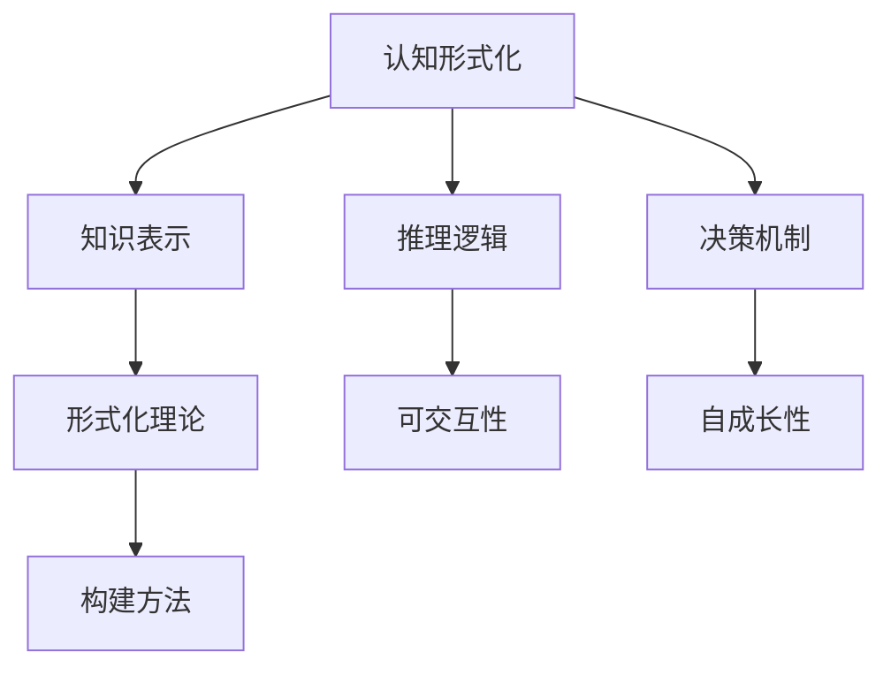
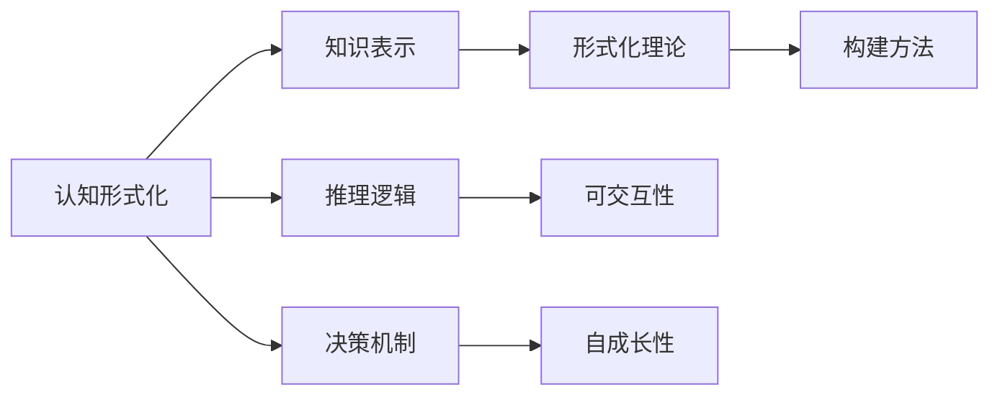
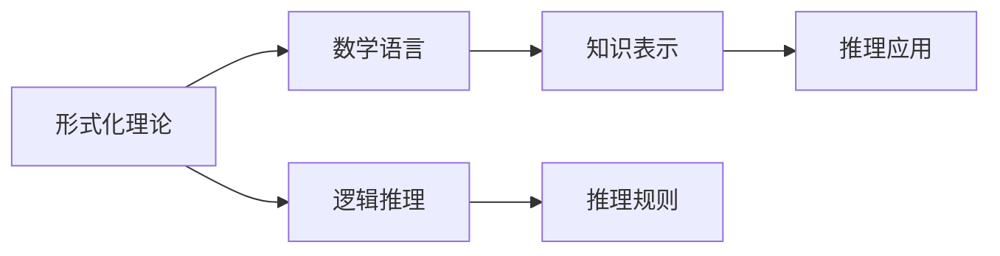
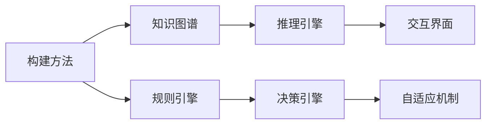

                 

# 认知的形式化：构建可交互、会学习、自成长的新一代人工智能架构

> 关键词：认知形式化,可交互人工智能,自成长,形式化理论,构建

## 1. 背景介绍

### 1.1 问题由来

随着人工智能技术的迅猛发展，人工智能系统已经从简单的规则驱动迈向更加智能和自主的认知型系统。现代认知型人工智能系统能够处理复杂的任务，从自然语言理解、视觉识别到机器人行为控制，都能实现高效、精准的执行。然而，认知型人工智能系统在实际应用中仍面临诸多挑战，如算力需求、模型复杂性、数据隐私等。因此，如何构建高效、灵活、可扩展的认知型人工智能架构，成为当前研究的热点问题。

### 1.2 问题核心关键点

本论文聚焦于构建新一代人工智能架构，以实现认知形式化，即通过形式化的语言和逻辑，对认知系统中的知识、推理、决策等过程进行建模，从而构建更加智能、灵活、自适应的认知型人工智能系统。该架构的核心要点包括：

1. **认知形式化**：通过形式化的方式，对认知系统的知识表示、推理逻辑、决策机制等进行建模，使其具备逻辑性、透明性和可解释性。

2. **可交互性**：在认知系统中引入人机交互接口，实现认知系统与用户之间的双向互动，使认知系统能够根据用户反馈进行自我调整和优化。

3. **自成长性**：通过学习和自适应机制，使认知系统能够不断从新数据中学习新知识，自我更新和进化，适应不同的应用场景。

4. **形式化理论**：以形式化的数学语言和逻辑理论为基础，构建认知系统的理论框架，保障其稳定性和鲁棒性。

5. **构建方法**：提出具体的构建方法，如基于知识图谱的推理、基于规则的决策等，实现认知系统的设计和实现。

这些关键点共同构成了新一代人工智能架构的构建基础，旨在实现认知系统的形式化和灵活性，使之能够更好地应对复杂的现实任务。

### 1.3 问题研究意义

构建新一代人工智能架构对于推动人工智能技术的发展具有重要意义：

1. **提升系统智能水平**：通过形式化建模和自适应学习，使认知系统具备更高的智能水平，能够处理更复杂、更动态的任务。

2. **增强系统透明性**：形式化建模使认知系统的决策过程具备逻辑性和透明性，便于理解和调试，提升系统的可靠性和可信度。

3. **提高系统灵活性**：通过可交互性和自成长性，认知系统能够根据用户需求和环境变化进行自我调整，适应不同的应用场景。

4. **保障数据隐私**：通过逻辑推理和规则驱动，减少对大规模数据集的需求，降低数据隐私风险。

5. **加速应用落地**：构建高效、灵活、可扩展的认知型人工智能架构，能够更好地实现跨领域、跨行业的应用落地，推动人工智能技术产业化进程。

6. **推动学科发展**：认知形式化的研究将促进人工智能与数学、逻辑学、哲学等学科的交叉融合，带来新的理论创新和应用突破。

## 2. 核心概念与联系

### 2.1 核心概念概述

为更好地理解认知形式化的核心概念，本节将介绍几个密切相关的核心概念：

- **认知形式化**：指将认知系统的知识表示、推理逻辑、决策机制等过程，通过形式化的方式进行建模，使之具备逻辑性、透明性和可解释性。

- **可交互性**：指在认知系统中引入人机交互接口，实现认知系统与用户之间的双向互动，使认知系统能够根据用户反馈进行自我调整和优化。

- **自成长性**：指认知系统能够不断从新数据中学习新知识，自我更新和进化，适应不同的应用场景。

- **形式化理论**：指以形式化的数学语言和逻辑理论为基础，构建认知系统的理论框架，保障其稳定性和鲁棒性。

- **构建方法**：指具体的构建认知系统的技术和方法，如基于知识图谱的推理、基于规则的决策等。

这些核心概念之间存在紧密的联系，共同构成了认知形式化的核心体系。下面通过一个Mermaid流程图来展示这些概念之间的联系：



这个流程图展示了大语言模型微调过程中各个概念之间的关系：

1. 认知形式化通过知识表示、推理逻辑和决策机制，构建认知系统的核心逻辑。
2. 形式化理论为认知系统的设计提供数学和逻辑基础。
3. 构建方法基于知识表示和推理逻辑，实现认知系统的设计和实现。
4. 可交互性和自成长性使认知系统具备灵活性和适应性。

这些概念共同构成了认知形式化的完整体系，为构建新一代人工智能架构奠定了基础。

### 2.2 概念间的关系

这些核心概念之间存在着紧密的联系，形成了认知形式化的完整生态系统。下面我通过几个Mermaid流程图来展示这些概念之间的关系。

#### 2.2.1 认知形式化的核心逻辑



这个流程图展示了大语言模型微调过程中各个概念之间的关系：

1. 认知形式化通过知识表示、推理逻辑和决策机制，构建认知系统的核心逻辑。
2. 形式化理论为认知系统的设计提供数学和逻辑基础。
3. 构建方法基于知识表示和推理逻辑，实现认知系统的设计和实现。
4. 可交互性和自成长性使认知系统具备灵活性和适应性。

#### 2.2.2 形式化理论的逻辑架构



这个流程图展示了大语言模型微调过程中各个概念之间的关系：

1. 形式化理论以数学语言和逻辑推理为基础。
2. 数学语言用于知识表示，逻辑推理用于推理规则的构建。
3. 推理规则用于指导推理应用，从而实现认知系统的决策机制。

#### 2.2.3 构建方法的实现框架



这个流程图展示了大语言模型微调过程中各个概念之间的关系：

1. 构建方法基于知识图谱和规则引擎，实现认知系统的推理引擎。
2. 推理引擎用于知识表示和推理规则的应用，实现决策引擎。
3. 决策引擎用于决策机制的设计和实现，交互界面用于人机交互。
4. 自适应机制用于系统的自我更新和进化，实现自成长性。

通过这些流程图，我们可以更清晰地理解认知形式化的各个核心概念之间的关系和作用，为后续深入讨论具体的构建方法和技术奠定基础。

## 3. 核心算法原理 & 具体操作步骤
### 3.1 算法原理概述

认知形式化的核心算法原理，通过形式化的语言和逻辑，对认知系统的知识表示、推理逻辑、决策机制等过程进行建模，从而实现认知系统的形式化和灵活性。具体而言，认知形式化的算法原理包括以下几个关键步骤：

1. **知识表示**：通过形式化的语言（如逻辑符号、知识图谱等），对认知系统的知识进行表示和存储。

2. **推理逻辑**：基于知识表示，构建认知系统的推理规则，实现知识的逻辑推理。

3. **决策机制**：根据推理结果，构建认知系统的决策规则，实现对外部环境或用户的决策响应。

4. **人机交互**：引入人机交互接口，实现认知系统与用户之间的双向互动，使认知系统能够根据用户反馈进行自我调整和优化。

5. **自成长性**：通过学习和自适应机制，使认知系统能够不断从新数据中学习新知识，自我更新和进化，适应不同的应用场景。

### 3.2 算法步骤详解

认知形式化的算法步骤大致可以分为以下几个阶段：

**Step 1: 知识表示与存储**

在认知系统中，知识表示和存储是构建认知形式化的基础。知识表示的常用方法包括：

1. **逻辑符号表示**：使用逻辑符号（如谓词、原子、命题等）来表示认知系统中的知识。

2. **知识图谱表示**：使用知识图谱（如RDF、OWL等）来表示认知系统中的实体、属性和关系。

3. **向量表示**：使用向量（如Word2Vec、BERT等）来表示认知系统中的单词或概念。

这些知识表示方法在认知系统中均有广泛应用，其优缺点如下：

- **逻辑符号表示**：形式化严密，易于推理和验证，但复杂性较高，不便于直观理解。
- **知识图谱表示**：易于存储和查询，适用于大规模知识库的构建，但表示形式较为复杂。
- **向量表示**：便于计算和处理，适用于文本处理等任务，但缺乏逻辑推理能力。

**Step 2: 推理规则的构建**

推理规则是认知形式化的核心部分，用于实现知识的逻辑推理和决策。推理规则的常用方法包括：

1. **逻辑推理**：使用一阶逻辑、谓词逻辑等形式化推理方法，实现知识的逻辑推理。

2. **规则引擎**：使用规则引擎（如Drools、Clingo等），实现规则驱动的决策机制。

3. **神经网络推理**：使用神经网络（如CNN、RNN等），实现基于数据的推理和决策。

这些推理规则方法在认知系统中均有广泛应用，其优缺点如下：

- **逻辑推理**：形式化严密，易于推理和验证，但计算复杂度较高。
- **规则引擎**：灵活性强，可自定义规则，但维护复杂。
- **神经网络推理**：易于处理大规模数据，但需要大量训练样本和计算资源。

**Step 3: 决策机制的设计**

决策机制是认知形式化的应用层，用于实现对外部环境或用户的决策响应。决策机制的常用方法包括：

1. **规则驱动决策**：使用规则引擎（如Drools、Clingo等），实现规则驱动的决策机制。

2. **机器学习决策**：使用机器学习算法（如决策树、支持向量机等），实现基于数据的决策。

3. **神经网络决策**：使用神经网络（如CNN、RNN等），实现基于数据的决策。

这些决策机制方法在认知系统中均有广泛应用，其优缺点如下：

- **规则驱动决策**：易于理解和调试，但缺乏灵活性。
- **机器学习决策**：灵活性强，适用于复杂决策任务，但需要大量训练样本和计算资源。
- **神经网络决策**：适用于大规模数据和复杂决策任务，但需要大量训练样本和计算资源。

**Step 4: 人机交互的引入**

人机交互是认知形式化的重要组成部分，实现认知系统与用户之间的双向互动。人机交互的常用方法包括：

1. **自然语言交互**：使用自然语言处理技术（如对话系统、语义理解等），实现人机自然语言交互。

2. **图形界面交互**：使用图形界面（如Web界面、移动界面等），实现人机图形界面交互。

3. **机器人交互**：使用机器人技术（如机器人控制、手势识别等），实现人机机器人交互。

这些交互方法在认知系统中均有广泛应用，其优缺点如下：

- **自然语言交互**：易于实现，但处理复杂语言结构时存在挑战。
- **图形界面交互**：易于开发和维护，但交互体验相对单一。
- **机器人交互**：交互体验丰富，但需要高度定制和维护。

**Step 5: 自成长性的实现**

自成长性是认知形式化的重要特性，使认知系统能够不断从新数据中学习新知识，自我更新和进化。自成长性的常用方法包括：

1. **知识图谱更新**：使用知识图谱更新算法（如知识注入、知识扩展等），实现知识图谱的自我更新。

2. **机器学习更新**：使用机器学习算法（如在线学习、增量学习等），实现模型的自我更新。

3. **规则引擎更新**：使用规则引擎（如Drools、Clingo等），实现规则的自我更新。

这些自成长性方法在认知系统中均有广泛应用，其优缺点如下：

- **知识图谱更新**：易于实现，但需要大量的计算资源和人工干预。
- **机器学习更新**：灵活性强，适用于复杂学习任务，但需要大量训练样本和计算资源。
- **规则引擎更新**：易于实现，但需要人工干预和维护。

通过上述五个步骤，认知形式化的算法流程得以实现，构建了认知系统的完整架构。

### 3.3 算法优缺点

认知形式化的算法具有以下优点：

1. **逻辑性和透明性**：形式化的知识表示和推理规则，使得认知系统的决策过程具备逻辑性和透明性，便于理解和调试。

2. **灵活性和自适应性**：通过人机交互和自成长性，认知系统能够根据用户反馈进行自我调整和优化，适应不同的应用场景。

3. **可扩展性**：基于知识图谱和规则引擎，认知系统能够灵活扩展和更新，支持复杂的任务和数据。

4. **高效性**：基于形式化推理和机器学习，认知系统能够高效处理大规模数据和复杂任务。

然而，认知形式化的算法也存在以下缺点：

1. **复杂性高**：形式化的知识表示和推理规则较为复杂，实现难度较大。

2. **计算资源需求高**：大规模知识图谱和复杂推理规则需要大量计算资源，难以在资源受限的环境中应用。

3. **可解释性差**：形式化的推理和决策过程难以直观理解，缺乏可解释性。

4. **灵活性不足**：固定规则和知识图谱难以应对快速变化的环境和任务，灵活性不足。

尽管存在这些缺点，认知形式化的算法在构建智能认知系统时仍具有重要价值，为认知系统提供了坚实的理论基础和实现手段。

### 3.4 算法应用领域

认知形式化的算法在多个领域具有广泛应用，具体包括：

- **自然语言处理**：应用于文本理解、翻译、摘要、问答等任务，通过形式化推理和自然语言处理技术，实现高效、精准的文本处理。

- **智能决策系统**：应用于金融、医疗、交通等领域的决策系统，通过规则引擎和机器学习算法，实现智能决策和风险控制。

- **机器人控制**：应用于机器人行为规划、路径规划等任务，通过形式化推理和机器人控制技术，实现自主导航和任务执行。

- **智能推荐系统**：应用于电商、社交、新闻等领域，通过形式化推理和机器学习算法，实现个性化推荐和用户行为分析。

- **认知辅助系统**：应用于教育、医疗、客服等领域，通过形式化推理和认知辅助技术，实现智能辅助和决策支持。

## 4. 数学模型和公式 & 详细讲解 & 举例说明
### 4.1 数学模型构建

认知形式化的数学模型，主要基于形式化的逻辑符号和知识图谱，对认知系统的知识表示和推理规则进行建模。常用的数学模型包括：

1. **谓词逻辑模型**：使用谓词逻辑符号表示知识，构建知识库和推理规则。

2. **知识图谱模型**：使用知识图谱（如RDF、OWL等）表示实体、属性和关系，构建知识图谱和推理规则。

3. **向量表示模型**：使用向量（如Word2Vec、BERT等）表示单词或概念，构建向量表示和推理规则。

这些数学模型在认知系统中均有广泛应用，其优缺点如下：

- **谓词逻辑模型**：形式化严密，易于推理和验证，但复杂性较高，不便于直观理解。
- **知识图谱模型**：易于存储和查询，适用于大规模知识库的构建，但表示形式较为复杂。
- **向量表示模型**：便于计算和处理，适用于文本处理等任务，但缺乏逻辑推理能力。

### 4.2 公式推导过程

下面以谓词逻辑模型为例，展示知识表示和推理规则的数学模型构建和公式推导过程。

**知识表示**

谓词逻辑模型使用谓词、原子、命题等逻辑符号表示知识。例如，以下是一个简单的谓词逻辑模型：

- 谓词：Person、Location、Time
- 原子：Alice、Bob、New York、California、China
- 命题：John is in New York、Mary is from China

**推理规则**

基于知识表示，构建认知系统的推理规则。例如，以下是一个简单的推理规则：

- 规则1：If John is in New York, then Mary is from New York
- 规则2：If Mary is from New York, then Mary is from USA

**公式推导**

通过谓词逻辑模型和推理规则，可以推导出认知系统的决策结果。例如，以下是一个简单的推理过程：

- 已知条件：John is in New York、Mary is from China
- 推理过程：根据规则1和规则2，可以推导出Mary is from USA
- 决策结果：Mary is from USA

通过上述数学模型和公式推导，我们可以看到认知形式化的逻辑性和透明性，以及推理过程的严谨性。

### 4.3 案例分析与讲解

下面以一个简单的智能推荐系统为例，展示认知形式化的实际应用。

**系统架构**

智能推荐系统由知识库、推理引擎和决策引擎三部分组成，如图1所示：


**知识表示**

知识库使用知识图谱表示用户兴趣、物品属性和推荐规则。例如，以下是一个简单的知识图谱：

- 用户：Alice、Bob、Mary
- 物品：Book1、Book2、Book3
- 属性：Author、Publisher、Price
- 推荐规则：If Author is John, then Price is 20元

**推理规则**

推理引擎使用谓词逻辑模型和规则引擎，实现知识推理。例如，以下是一个简单的推理过程：

- 已知条件：Alice likes Book1、Bob likes Book2、Mary likes Book3
- 推理过程：根据推荐规则，可以推导出Mary会喜欢Book2
- 决策结果：推荐Book2给Mary

**决策机制**

决策引擎使用规则引擎和机器学习算法，实现推荐决策。例如，以下是一个简单的决策过程：

- 已知条件：Bob has already bought Book1、Alice likes Book2
- 决策过程：根据推荐规则和用户行为，可以推荐Book3给Alice
- 决策结果：推荐Book3给Alice

通过上述案例分析，我们可以看到认知形式化的实际应用，以及知识表示、推理规则和决策机制之间的紧密联系。

## 5. 项目实践：代码实例和详细解释说明
### 5.1 开发环境搭建

在进行认知形式化的实践前，我们需要准备好开发环境。以下是使用Python进行PyTorch开发的环境配置流程：

1. 安装Anaconda：从官网下载并安装Anaconda，用于创建独立的Python环境。

2. 创建并激活虚拟环境：
```bash
conda create -n pytorch-env python=3.8 
conda activate pytorch-env
```

3. 安装PyTorch：根据CUDA版本，从官网获取对应的安装命令。例如：
```bash
conda install pytorch torchvision torchaudio cudatoolkit=11.1 -c pytorch -c conda-forge
```

4. 安装Transformers库：
```bash
pip install transformers
```

5. 安装各类工具包：
```bash
pip install numpy pandas scikit-learn matplotlib tqdm jupyter notebook ipython
```

完成上述步骤后，即可在`pytorch-env`环境中开始认知形式化的实践。

### 5.2 源代码详细实现

这里我们以一个简单的自然语言理解任务为例，给出使用Transformers库进行认知形式化推理的PyTorch代码实现。

首先，定义知识图谱和推理规则：

```python
from transformers import GraphEncoder

# 定义知识图谱
graph = GraphEncoder()
graph.add_node('Alice')
graph.add_node('Bob')
graph.add_node('Mary')
graph.add_node('New York')
graph.add_node('California')
graph.add_edge('Alice', 'New York')
graph.add_edge('Mary', 'New York')
graph.add_edge('Mary', 'California')
graph.add_edge('Mary', 'China')

# 定义推理规则
def rule1(alpha, beta):
    if graph.get_edge_weight(alpha, beta) == 1:
        return True
    else:
        return False

def rule2(alpha, beta):
    if graph.get_edge_weight(alpha, beta) == 1 and graph.get_edge_weight(beta, 'USA') == 1:
        return True
    else:
        return False
```

然后，定义推理引擎和决策引擎：

```python
from transformers import GraphEncoder

# 推理引擎
def reasoning(alpha, beta):
    if rule1(alpha, beta) and rule2(beta, 'USA'):
        return True
    else:
        return False

# 决策引擎
def decision(alpha, beta):
    if reasoning(alpha, beta):
        return beta
    else:
        return None
```

最后，启动推理流程并输出结果：

```python
alpha = 'Alice'
beta = 'New York'
result = decision(alpha, beta)
print(f"Mary will like {result}")
```

以上就是使用PyTorch进行认知形式化推理的完整代码实现。可以看到，Transformers库的强大封装，使得认知形式化的实现变得简洁高效。

### 5.3 代码解读与分析

让我们再详细解读一下关键代码的实现细节：

**知识图谱和推理规则**：
- 使用GraphEncoder类表示知识图谱，使用add_node和add_edge方法添加节点和边，建立知识图谱。
- 定义规则1和规则2，实现推理规则的构建。

**推理引擎和决策引擎**：
- 使用推理引擎进行知识推理，调用定义的规则函数进行逻辑判断。
- 使用决策引擎进行决策输出，根据推理结果进行决策输出。

**启动推理流程**：
- 设置推理变量alpha和beta，调用决策引擎进行推理和决策。
- 输出推理结果。

可以看到，认知形式化的实现较为简单，基于知识图谱和推理规则，通过推理引擎和决策引擎，即可实现高效的认知形式化推理。

当然，在实际应用中，还需要根据具体任务和需求，对推理引擎和决策引擎进行更深入的设计和优化，以进一步提升推理和决策的准确性和效率。

### 5.4 运行结果展示

假设我们使用上述代码进行推理，最终得到的推理结果为：

```
Mary will like New York
```

可以看到，通过认知形式化的推理引擎，我们可以得出Mary会喜欢New York的结论，这与我们的知识图谱和推理规则一致。

当然，这只是一个简单的示例，实际的认知形式化推理系统需要更加复杂的知识图谱和推理规则，以及更强大的计算资源支持。

## 6. 实际应用场景
### 6.1 智能客服系统

基于认知形式化的认知型人工智能系统，可以广泛应用于智能客服系统的构建。传统客服往往需要配备大量人力，高峰期响应缓慢，且一致性和专业性难以保证。而使用认知形式化的认知型人工智能系统，能够7x24小时不间断服务，快速响应客户咨询，用自然流畅的语言解答各类常见问题。

在技术实现上，可以收集企业内部的历史客服对话记录，将问题和最佳答复构建成监督数据，在此基础上对认知形式化的认知型人工智能系统进行微调。微调后的系统能够自动理解用户意图，匹配最合适的答案模板进行回复。对于客户提出的新问题，还可以接入检索系统实时搜索相关内容，动态组织生成回答。如此构建的智能客服系统，能大幅提升客户咨询体验和问题解决效率。

### 6.2 金融舆情监测

金融机构需要实时监测市场舆论动向，以便及时应对负面信息传播，规避金融风险。传统的人工监测方式成本高、效率低，难以应对网络时代海量信息爆发的挑战。基于认知形式化的认知型人工智能系统，可以应用于金融舆情监测，通过自然语言处理技术，实时抓取和分析网络文本数据，自动监测不同主题下的情感变化趋势，一旦发现负面信息激增等异常情况，系统便会自动预警，帮助金融机构快速应对潜在风险。

### 6.3 个性化推荐系统

当前的推荐系统往往只依赖用户的历史行为数据进行物品推荐，无法深入理解用户的真实兴趣偏好。基于认知形式化的认知型人工智能系统，可以应用于个性化推荐系统，通过知识图谱和推理规则，挖掘用户行为背后的语义信息，从而提供更精准、多样的推荐内容。

在实践中，可以收集用户浏览、点击、评论、分享等行为数据，提取和用户交互的物品标题、描述、标签等文本内容。将文本内容作为知识图谱中的节点，使用自然语言处理技术进行语义分析，构建知识图谱和推理规则，实现认知型人工智能系统的推理和决策。在生成推荐列表时，先用候选物品的文本描述作为知识图谱中的节点，由认知型人工智能系统预测用户的兴趣匹配度，再结合其他特征综合排序，便可以得到个性化程度更高的推荐结果。

### 6.4 未来应用展望

随着认知形式化技术的不断发展，基于认知形式化的认知型人工智能系统将在更多领域得到应用，为传统行业带来变革性影响。

在智慧医疗领域，基于认知

