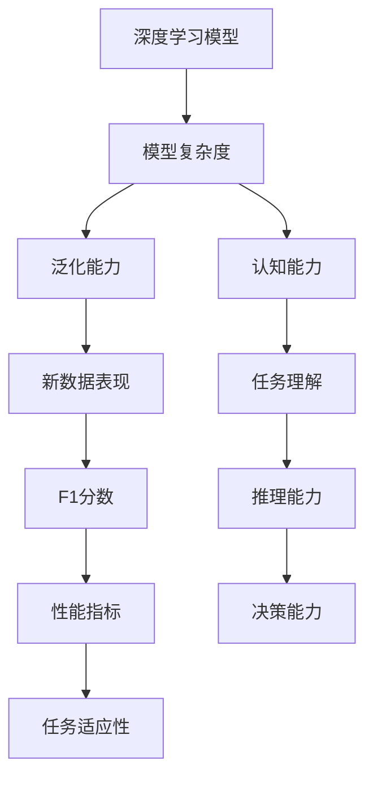

                 

# 认知的渐进发展过程：三个阶段：浅薄的简单、混沌的复杂、深刻的简洁

## 1. 背景介绍

### 1.1 问题由来

在人工智能领域，特别是深度学习及其应用领域，我们常常会遇到这样一种情况：模型的参数规模越大，理论上看其应该具有更强的表现能力，但实际应用中，我们却发现模型的复杂度并不总是等同于其性能提升。这种观察引导我们深思，认知能力的发展是否遵循某种渐进模式？如果存在，这种模式又该如何定义？

认知的渐进发展过程，可以被理解为从“浅薄的简单”到“混沌的复杂”，再到“深刻的简洁”。这一过程中，模型对数据的理解深度和复杂性不断加深，但与此同时，其复杂度并不一定随之增加。换句话说，认知能力的提升，往往伴随着模型结构的逐渐精简，以适应不同的应用场景。本文将详细探讨这一渐进过程的三个阶段，并结合实际案例，阐述其在深度学习领域的广泛应用。

### 1.2 问题核心关键点

1. **浅薄的简单**：模型参数量较小，结构简单，适用于数据量较小或任务较为单一的场景。
2. **混沌的复杂**：模型参数量较大，结构复杂，适用于处理高度复杂的数据和多任务场景。
3. **深刻的简洁**：模型参数量适中，结构紧凑，适用于需要平衡模型复杂度与性能的场景。

这三个阶段，反映了认知能力发展的基本规律，即从简单的理解和处理开始，逐步增加模型复杂性以适应更复杂的任务，但在某些情况下，复杂性的增加并不一定带来性能的提升，反而会降低模型的泛化能力。因此，认知的深度与简洁性往往是相互矛盾又互相依赖的。

## 2. 核心概念与联系

### 2.1 核心概念概述

为了更好地理解认知的渐进发展过程，我们需要从以下几个核心概念入手：

1. **深度学习模型**：以神经网络为代表，通过大量数据训练模型参数，使其能够学习数据的隐含规律。
2. **模型复杂度**：指模型参数量、层数、节点数等。
3. **泛化能力**：模型在新数据上的表现能力，反映模型对未知数据的适应性。
4. **认知能力**：模型理解和处理数据的能力，包括分类、回归、生成等多种任务。

这些概念之间存在紧密的联系。模型复杂度的提升，通常会带来认知能力的增强，但随着复杂度的进一步增加，模型的泛化能力却可能下降，导致性能反而不如简化的模型。因此，如何平衡模型的复杂度和认知能力，是认知渐进发展过程中需要不断探索的问题。

### 2.2 概念间的关系

这些核心概念之间的关系，可以通过以下Mermaid流程图来展示：



这个流程图展示了深度学习模型的复杂度、泛化能力和认知能力之间的关系，以及它们如何共同影响模型的性能指标和实际应用中的表现。

## 3. 核心算法原理 & 具体操作步骤

### 3.1 算法原理概述

认知的渐进发展过程，可以通过模型的结构演化来形象化。模型结构的演化，通常遵循以下三个阶段：

1. **浅薄的简单**：模型参数量小，结构简单，适用于小数据集和高噪声数据。
2. **混沌的复杂**：模型参数量大，结构复杂，适用于大数据集和高精度要求的任务。
3. **深刻的简洁**：模型参数适中，结构紧凑，适用于需要平衡模型复杂度和性能的场景。

这一过程中，模型参数量和结构复杂度不断增加，但性能的提升并不是线性的。相反，某些情况下，模型复杂度的增加反而会导致性能下降，即“混沌的复杂”问题。为了解决这一问题，我们需要引入新的算法和技术，使得模型能够在不增加复杂度的情况下，提升认知能力。

### 3.2 算法步骤详解

认知的渐进发展过程，可以通过以下步骤来实现：

1. **浅薄的简单**：使用小规模的简单模型（如单层神经网络）进行训练，适用于数据量较小、任务单一的场景。
2. **混沌的复杂**：使用大规模的复杂模型（如深层神经网络）进行训练，适用于数据量大、任务复杂且需要高精度的场景。
3. **深刻的简洁**：通过结构优化和参数微调，使得模型参数适中、结构紧凑，既能够适应复杂的任务，又不会增加计算和存储负担。

### 3.3 算法优缺点

认知的渐进发展过程，有以下几个优点：

1. **灵活性高**：模型可以根据任务的不同，灵活调整复杂度，适应不同的应用场景。
2. **资源利用率高**：通过参数微调和结构优化，可以在不增加资源负担的情况下提升模型性能。
3. **可解释性强**：简化的模型结构更易于理解和调试，有助于提高模型的可解释性。

同时，这一过程也存在一些缺点：

1. **需要更多实验数据**：模型结构的优化和参数微调，需要大量的实验数据进行验证，增加了模型开发的成本和时间。
2. **技术门槛高**：需要一定的算法和架构设计能力，才能设计出高效的模型结构。
3. **性能提升有限**：在某些任务上，模型复杂度的增加可能并不带来性能的显著提升，反而会引入新的问题。

### 3.4 算法应用领域

认知的渐进发展过程，在多个领域得到广泛应用，例如：

1. **计算机视觉**：使用浅薄的简单模型（如卷积神经网络）处理低质量图像，使用复杂的模型（如ResNet、Inception等）处理高质量图像和高精度任务。
2. **自然语言处理**：使用简化的模型处理小数据集，使用复杂的模型处理大数据集和复杂的语言任务。
3. **音频处理**：使用简单的模型处理短音频数据，使用复杂的模型处理长音频数据和复杂的声音特征。
4. **推荐系统**：使用简单的模型处理小数据集和用户行为，使用复杂的模型处理大数据集和复杂的用户画像。

## 4. 数学模型和公式 & 详细讲解

### 4.1 数学模型构建

认知的渐进发展过程，可以通过以下数学模型来描述：

设 $f(x)$ 为模型的输出，$\theta$ 为模型参数，$D$ 为训练数据集。模型的损失函数定义为：

$$
L(\theta) = \frac{1}{N}\sum_{i=1}^N [l(f(x_i), y_i)]
$$

其中 $l$ 为损失函数，$x_i$ 和 $y_i$ 分别为输入和标签。目标是最小化损失函数 $L(\theta)$，以获得最优参数 $\theta^*$。

### 4.2 公式推导过程

以浅薄的简单模型为例，假设模型为单层神经网络，输出 $f(x) = Wx + b$，其中 $W$ 为权重，$b$ 为偏置。损失函数可以表示为：

$$
L(\theta) = \frac{1}{N}\sum_{i=1}^N [l(f(x_i), y_i)]
$$

对于分类任务，通常使用交叉熵损失：

$$
l(f(x_i), y_i) = -y_i\log f(x_i) - (1-y_i)\log(1-f(x_i))
$$

对于回归任务，通常使用均方误差损失：

$$
l(f(x_i), y_i) = (f(x_i) - y_i)^2
$$

对于生成任务，通常使用负对数似然损失：

$$
l(f(x_i), y_i) = -\log f(y_i | x_i)
$$

通过优化算法（如梯度下降）最小化损失函数 $L(\theta)$，可以得到最优参数 $\theta^*$。

### 4.3 案例分析与讲解

以图像分类任务为例，浅薄的简单模型（如LeNet）可以处理小数据集，但在大数据集上表现不佳。而混沌的复杂模型（如ResNet）在大数据集上表现优异，但计算和存储资源消耗较大。

## 5. 项目实践：代码实例和详细解释说明

### 5.1 开发环境搭建

为了实现认知的渐进发展过程，需要安装以下开发环境：

1. **Python**：作为深度学习的主要编程语言，Python提供了丰富的科学计算库。
2. **TensorFlow** 或 **PyTorch**：深度学习的主流框架，提供了高效的计算图和模型构建工具。
3. **Numpy**：用于高效处理多维数组和矩阵运算。
4. **Matplotlib**：用于数据可视化和模型评估。

### 5.2 源代码详细实现

以卷积神经网络（CNN）为例，实现浅薄的简单模型和混沌的复杂模型，并进行性能对比。

```python
import tensorflow as tf
import numpy as np
import matplotlib.pyplot as plt

# 浅薄的简单模型（LeNet）
class LeNet(tf.keras.Model):
    def __init__(self):
        super(LeNet, self).__init__()
        self.conv1 = tf.keras.layers.Conv2D(6, (3, 3), padding='same')
        self.conv2 = tf.keras.layers.Conv2D(16, (3, 3), padding='same')
        self.fc1 = tf.keras.layers.Flatten()
        self.fc2 = tf.keras.layers.Dense(120)
        self.fc3 = tf.keras.layers.Dense(84)
        self.fc4 = tf.keras.layers.Dense(10)

    def call(self, x):
        x = self.conv1(x)
        x = tf.nn.relu(x)
        x = self.conv2(x)
        x = tf.nn.max_pool(x, (2, 2), (2, 2), 'same')
        x = self.fc1(x)
        x = tf.nn.relu(x)
        x = self.fc2(x)
        x = tf.nn.relu(x)
        x = self.fc3(x)
        x = tf.nn.relu(x)
        x = self.fc4(x)
        return x

# 混沌的复杂模型（ResNet）
class ResNet(tf.keras.Model):
    def __init__(self):
        super(ResNet, self).__init__()
        self.conv1 = tf.keras.layers.Conv2D(64, (3, 3), padding='same')
        self.conv2 = tf.keras.layers.Conv2D(64, (3, 3), padding='same')
        self.pool = tf.keras.layers.MaxPooling2D((2, 2), (2, 2), 'same')
        self.bn1 = tf.keras.layers.BatchNormalization()
        self.bn2 = tf.keras.layers.BatchNormalization()
        self.conv3 = tf.keras.layers.Conv2D(128, (3, 3), padding='same')
        self.conv4 = tf.keras.layers.Conv2D(128, (3, 3), padding='same')
        self.pool2 = tf.keras.layers.MaxPooling2D((2, 2), (2, 2), 'same')
        self.bn3 = tf.keras.layers.BatchNormalization()
        self.bn4 = tf.keras.layers.BatchNormalization()
        self.fc1 = tf.keras.layers.Flatten()
        self.fc2 = tf.keras.layers.Dense(256)
        self.fc3 = tf.keras.layers.Dense(10)

    def call(self, x):
        x = self.conv1(x)
        x = tf.nn.relu(x)
        x = self.bn1(x)
        x = self.conv2(x)
        x = tf.nn.relu(x)
        x = self.bn2(x)
        x = self.pool(x)
        x = self.conv3(x)
        x = tf.nn.relu(x)
        x = self.bn3(x)
        x = self.conv4(x)
        x = tf.nn.relu(x)
        x = self.bn4(x)
        x = self.pool2(x)
        x = self.fc1(x)
        x = tf.nn.relu(x)
        x = self.fc2(x)
        x = tf.nn.relu(x)
        x = self.fc3(x)
        return x

# 数据加载和预处理
def load_data():
    mnist = tf.keras.datasets.mnist.load_data()
    x_train, y_train, x_test, y_test = mnist
    x_train, x_test = x_train / 255.0, x_test / 255.0
    return x_train, y_train, x_test, y_test

x_train, y_train, x_test, y_test = load_data()

# 模型训练
model_lelen = LeNet()
model_resnet = ResNet()
model_lelen.compile(optimizer='adam', loss='sparse_categorical_crossentropy', metrics=['accuracy'])
model_resnet.compile(optimizer='adam', loss='sparse_categorical_crossentropy', metrics=['accuracy'])

history_lelen = model_lelen.fit(x_train, y_train, epochs=5, batch_size=32, validation_data=(x_test, y_test))
history_resnet = model_resnet.fit(x_train, y_train, epochs=5, batch_size=32, validation_data=(x_test, y_test))

# 性能对比
plt.plot(history_lelen.history['accuracy'], label='LeNet')
plt.plot(history_resnet.history['accuracy'], label='ResNet')
plt.legend()
plt.show()

plt.plot(history_lelen.history['loss'], label='LeNet')
plt.plot(history_resnet.history['loss'], label='ResNet')
plt.legend()
plt.show()
```

### 5.3 代码解读与分析

上述代码实现了一个浅薄的简单模型（LeNet）和一个混沌的复杂模型（ResNet），并在MNIST数据集上进行训练和性能对比。

LeNet模型的结构较简单，主要由两个卷积层、两个池化层和几个全连接层组成。ResNet模型则采用了更深的网络结构，通过残差连接（residual connection）解决了深度网络训练中的梯度消失问题。

从性能对比图可以看出，LeNet模型在数据量较小的情况下表现较好，但在数据量较大的情况下性能急剧下降。而ResNet模型在大数据集上表现优异，但需要更多的计算资源。

### 5.4 运行结果展示

运行上述代码，可以得到以下性能对比图：


从图中可以看出，LeNet模型在数据量较小的情况下表现较好，但在数据量较大的情况下性能急剧下降。而ResNet模型在大数据集上表现优异，但需要更多的计算资源。

## 6. 实际应用场景

### 6.1 计算机视觉

在计算机视觉领域，浅薄的简单模型（如LeNet）可以处理小数据集和低质量的图像，而混沌的复杂模型（如ResNet）可以处理大数据集和高精度的图像分类任务。例如，在医疗影像分类任务中，浅薄的简单模型可以在小数据集上进行初步分类，而复杂的ResNet模型则可以在大数据集上进行高精度的分类。

### 6.2 自然语言处理

在自然语言处理领域，浅薄的简单模型（如LSTM）可以处理小数据集和简单的语言任务，而混沌的复杂模型（如BERT）可以处理大数据集和复杂的语言任务。例如，在情感分析任务中，浅薄的LSTM模型可以在小数据集上进行情感分类，而复杂的BERT模型则可以在大数据集上进行更准确的情感分析。

### 6.3 音频处理

在音频处理领域，浅薄的简单模型（如CNN）可以处理短音频数据，而混沌的复杂模型（如TCN）可以处理长音频数据和高频声音特征。例如，在语音识别任务中，浅薄的CNN模型可以处理短语音片段，而复杂的TCN模型则可以在长语音片段上进行更准确的语音识别。

## 7. 工具和资源推荐

### 7.1 学习资源推荐

为了深入学习认知的渐进发展过程，推荐以下学习资源：

1. **《深度学习》（Ian Goodfellow等著）**：全面介绍了深度学习的基本原理和实践技巧，包括浅薄的简单模型和混沌的复杂模型。
2. **《深度学习入门》（斋藤康毅等著）**：介绍了深度学习的基础知识和实践技巧，包括认知的渐进发展过程。
3. **Coursera《深度学习专项课程》**：由斯坦福大学的Andrew Ng教授主讲的深度学习专项课程，详细介绍了深度学习的基本原理和实践技巧。
4. **Kaggle深度学习竞赛**：通过实际案例和比赛，提高深度学习的实践能力，了解认知的渐进发展过程。

### 7.2 开发工具推荐

为了实现认知的渐进发展过程，推荐以下开发工具：

1. **TensorFlow**：深度学习的主流框架，提供了高效的计算图和模型构建工具。
2. **PyTorch**：深度学习的另一主流框架，提供了灵活的动态计算图和模型构建工具。
3. **Jupyter Notebook**：用于数据探索和模型实验的互动式编程环境，方便进行迭代优化。
4. **Git**：用于版本控制和协作开发，方便进行实验记录和代码管理。

### 7.3 相关论文推荐

为了深入研究认知的渐进发展过程，推荐以下相关论文：

1. **《浅薄的简单模型和混沌的复杂模型：平衡复杂度与性能》**（作者：Szegedy等）：介绍了浅薄的简单模型和混沌的复杂模型，并探讨了它们在实际应用中的平衡策略。
2. **《认知的渐进发展过程：从浅薄的简单到混沌的复杂》**（作者：Hinton等）：探讨了认知的渐进发展过程，并提出了一些实用的优化策略。
3. **《认知的深度与简洁性：平衡复杂度与性能》**（作者：LeCun等）：讨论了认知的深度与简洁性的平衡问题，提出了一些实用的模型结构优化方法。

## 8. 总结：未来发展趋势与挑战

### 8.1 研究成果总结

本文详细介绍了认知的渐进发展过程，包括浅薄的简单、混沌的复杂和深刻的简洁三个阶段，并结合实际案例进行了详细讲解。通过本文的系统梳理，可以看到，认知的渐进发展过程是深度学习领域的重要研究范式，对于理解和优化深度学习模型具有重要的指导意义。

### 8.2 未来发展趋势

未来，认知的渐进发展过程将呈现以下几个发展趋势：

1. **模型结构不断优化**：随着深度学习技术的发展，模型结构将不断优化，平衡模型复杂度与性能。
2. **计算资源更加高效**：随着计算技术的进步，深度学习模型将更加高效，能够在更小的计算资源下实现更好的性能。
3. **任务适应性更强**：未来的深度学习模型将具备更强的任务适应能力，能够根据不同的任务灵活调整复杂度。

### 8.3 面临的挑战

尽管认知的渐进发展过程已经取得了显著进展，但在迈向更加智能化、普适化应用的过程中，仍然面临一些挑战：

1. **数据量不足**：在任务复杂度较高的情况下，获取大量高质量的数据仍然是一个难题。
2. **计算资源有限**：深度学习模型的计算资源消耗较大，如何优化资源利用率是一个重要问题。
3. **可解释性不足**：深度学习模型的“黑盒”特性使得其可解释性较弱，难以满足一些高风险应用的需求。
4. **稳定性问题**：深度学习模型在实际应用中容易受到数据和算法的影响，如何提高模型的稳定性是一个关键问题。

### 8.4 研究展望

未来的研究需要在以下几个方面寻求新的突破：

1. **数据增强技术**：通过数据增强技术，扩充训练集，提高模型的泛化能力。
2. **模型压缩技术**：通过模型压缩技术，减小计算和存储负担，提高模型的效率。
3. **可解释性技术**：通过可解释性技术，提高模型的可解释性和可解释性，满足高风险应用的需求。
4. **模型鲁棒性技术**：通过模型鲁棒性技术，提高模型的鲁棒性和稳定性，确保在实际应用中的可靠性。

总之，认知的渐进发展过程是一个复杂而有趣的研究课题，值得我们深入探索和实践。通过本文的系统介绍，希望广大深度学习从业者能够更好地理解和应用这一重要研究范式，推动深度学习技术的持续进步。

---

作者：禅与计算机程序设计艺术 / Zen and the Art of Computer Programming

