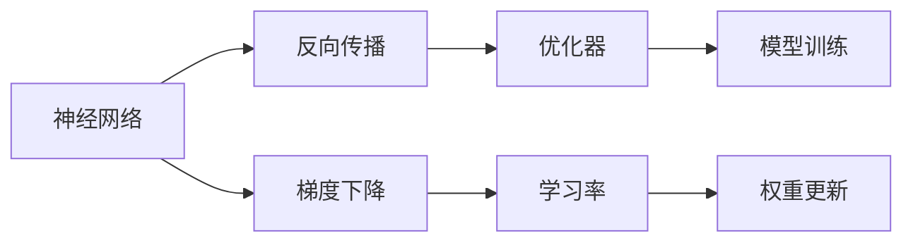

                 

# 认知过程中的简单与深刻化

在人工智能发展的今天，深度学习模型已经成为了众多行业应用的核心工具。然而，深度学习的本质是什么？我们如何理解这一过程？这正是本文要探讨的核心议题。

## 1. 背景介绍

深度学习，特别是深度神经网络（Deep Neural Networks, DNNs），已经成为了实现认知任务的重要手段。从计算机视觉的图像识别到自然语言处理的语言模型，深度学习在各个领域都取得了令人瞩目的成果。但当我们深入探究这些模型时，却发现它们背后的数学和算法原理其实并不复杂，甚至简单到让人难以置信。本文旨在通过介绍深度学习的核心概念和简单模型，探讨其在认知过程中扮演的角色，从而揭示深度学习的本质。

## 2. 核心概念与联系

### 2.1 核心概念概述

深度学习涉及多个核心概念，包括神经网络、反向传播、优化器等。为了更好地理解深度学习，我们先通过Mermaid图表来展示这些概念之间的关系。



这个图表展示了深度学习的核心流程：首先构建神经网络，然后通过反向传播计算梯度，使用优化器更新模型参数，最后完成模型训练。

### 2.2 概念间的关系

深度学习的核心流程可以进一步拆解为以下几个关键步骤：

1. **构建神经网络**：神经网络是由多层神经元组成的模型，每一层都通过权重矩阵连接前一层的输出和后一层的输入。
2. **反向传播**：反向传播算法用于计算损失函数对模型参数的梯度，这个过程需要从输出层开始，逐层反向传播误差。
3. **优化器**：优化器用于更新模型参数，以最小化损失函数。常用的优化器包括SGD、Adam等。
4. **梯度下降**：梯度下降是优化器中的一种算法，通过迭代调整模型参数，使得损失函数下降。
5. **学习率**：学习率决定了每次参数更新的步长，过大会导致震荡，过小则收敛缓慢。

这些步骤共同构成了深度学习的训练过程，使得模型能够从数据中学习到复杂的特征表示，实现认知任务。

## 3. 核心算法原理 & 具体操作步骤

### 3.1 算法原理概述

深度学习的核心算法是神经网络，特别是前馈神经网络（Feedforward Neural Networks, FNNs）。FNNs是一种基于输入-输出映射的非线性模型，由多个线性变换和激活函数组成。

- **线性变换**：将输入向量乘以权重矩阵，加上偏置向量，得到下一层的输入。
- **激活函数**：将线性变换的结果进行非线性映射，增强模型的表达能力。

通过多层线性变换和激活函数的组合，FNNs能够学习到复杂的非线性映射关系，适用于各种复杂的认知任务。

### 3.2 算法步骤详解

构建FNNs后，我们需要通过数据集进行训练。训练过程包括以下几个关键步骤：

1. **数据准备**：将数据集划分为训练集、验证集和测试集，并预处理为适合模型的输入格式。
2. **模型初始化**：随机初始化模型的权重和偏置。
3. **前向传播**：将输入数据通过网络进行前向传播，计算输出结果。
4. **损失计算**：计算模型输出与真实标签之间的损失，如均方误差、交叉熵等。
5. **反向传播**：计算损失对每个权重和偏置的梯度，用于后续参数更新。
6. **参数更新**：使用优化器更新模型参数，最小化损失函数。
7. **模型评估**：在验证集和测试集上评估模型性能，确保模型泛化能力。

这些步骤可以借助TensorFlow、PyTorch等深度学习框架实现，大大简化了模型的训练过程。

### 3.3 算法优缺点

深度学习模型的优点包括：

- **表达能力**：FNNs通过多层非线性映射，能够学习到复杂的特征表示。
- **通用性**：深度学习模型可以应用于各种认知任务，如图像识别、自然语言处理等。
- **自我学习能力**：通过数据驱动的训练过程，深度学习模型能够自动学习特征，无需手工设计特征。

然而，深度学习模型也存在一些缺点：

- **模型复杂**：FNNs通常包含大量参数，训练和推理过程复杂。
- **数据依赖**：深度学习模型需要大量标注数据进行训练，对标注成本敏感。
- **可解释性差**：深度学习模型通常是"黑盒"，难以解释其内部工作机制。
- **泛化能力有限**：深度学习模型容易过拟合，泛化能力受到数据集和模型结构的影响。

尽管存在这些缺点，但深度学习仍然是最有效的认知模型之一，广泛应用于各种场景。

### 3.4 算法应用领域

深度学习模型已经在计算机视觉、自然语言处理、语音识别、推荐系统等多个领域取得了巨大成功。以下是几个典型的应用场景：

- **图像识别**：通过卷积神经网络（Convolutional Neural Networks, CNNs），深度学习模型能够从图像中学习到丰富的特征，实现高精度的物体识别和分类。
- **机器翻译**：通过序列到序列（Sequence-to-Sequence, Seq2Seq）模型，深度学习模型能够将一种语言的文本转换为另一种语言的文本。
- **情感分析**：通过循环神经网络（Recurrent Neural Networks, RNNs）和长短期记忆网络（Long Short-Term Memory, LSTM），深度学习模型能够自动分析文本情感，提供情感分类和极性分析。
- **推荐系统**：通过协同过滤和深度学习模型，推荐系统能够根据用户行为和物品特征，提供个性化的推荐结果。

## 4. 数学模型和公式 & 详细讲解  

### 4.1 数学模型构建

假设我们有一个FNNs模型，包含 $L$ 层，每一层的神经元数为 $n_l$。输入为 $x$，输出为 $y$。模型的数学表示如下：

$$
y = f_L(W_Lf_{L-1}(...W_2f_1(W_1x + b_1) + b_2) + ... + b_L)
$$

其中 $f$ 表示激活函数，$W$ 和 $b$ 表示权重矩阵和偏置向量。

### 4.2 公式推导过程

以简单的全连接神经网络为例，我们推导一下反向传播算法的核心公式。

假设我们要训练一个全连接神经网络，输入层有 $m$ 个神经元，输出层有 $n$ 个神经元。输入 $x$ 通过权重矩阵 $W$ 和偏置向量 $b$ 进行前向传播，得到输出 $y$。损失函数为均方误差，目标是使得模型输出 $y$ 接近真实标签 $y'$。

设 $z^{(l)}$ 表示第 $l$ 层的输出，$a^{(l)}$ 表示第 $l$ 层的激活值，$b^{(l)}$ 表示第 $l$ 层的偏置向量。则前向传播过程可以表示为：

$$
z^{(1)} = W_1x + b_1
$$

$$
a^{(1)} = g(z^{(1)})
$$

$$
z^{(l)} = W_la^{(l-1)} + b_l
$$

$$
a^{(l)} = g(z^{(l)})
$$

其中 $g$ 表示激活函数。

通过反向传播算法，我们可以计算出每一层的权重和偏置的梯度，用于后续参数更新。设 $\delta^{(l)}$ 表示第 $l$ 层的误差梯度，则有：

$$
\delta^{(L)} = (y' - y)\frac{\partial L}{\partial z^{(L)}}
$$

$$
\delta^{(l-1)} = \frac{\partial L}{\partial z^{(l)}}W_{l-1}^T\delta^{(l)}
$$

$$
\frac{\partial L}{\partial W_l} = \delta^{(l)}a^{(l-1)^T}
$$

$$
\frac{\partial L}{\partial b_l} = \delta^{(l)}
$$

其中 $L$ 为损失函数对 $z^{(l)}$ 的梯度，可通过链式法则递归计算得到。

### 4.3 案例分析与讲解

以简单的线性回归问题为例，展示深度学习模型的训练过程。假设我们要拟合一组线性数据，模型结构如下：

$$
y = W_1x_1 + W_2x_2 + b
$$

输入 $x$ 为 $(x_1, x_2)$，输出 $y$ 为 $y'$。设损失函数为均方误差 $L$，通过反向传播算法计算梯度，更新参数 $W_1$、$W_2$ 和 $b$，使得模型输出接近真实标签。

具体步骤如下：

1. **前向传播**：将输入数据 $x$ 通过线性变换得到输出 $y$。
2. **损失计算**：计算损失函数 $L$，即 $(y' - y)^2$。
3. **反向传播**：计算误差梯度 $\delta$，即 $2(y' - y)(x_1, x_2)$。
4. **参数更新**：根据梯度更新权重和偏置，即 $W_1 \leftarrow W_1 - \eta \frac{\partial L}{\partial W_1}$，$W_2 \leftarrow W_2 - \eta \frac{\partial L}{\partial W_2}$，$b \leftarrow b - \eta \frac{\partial L}{\partial b}$，其中 $\eta$ 为学习率。

## 5. 项目实践：代码实例和详细解释说明

### 5.1 开发环境搭建

在开始代码实践前，需要搭建好开发环境。以下是搭建环境的步骤：

1. 安装Python：从官网下载并安装Python 3.x版本。
2. 安装TensorFlow：从官网下载并安装TensorFlow 2.x版本。
3. 安装PyTorch：从官网下载并安装PyTorch 1.x版本。
4. 安装NumPy：通过pip安装NumPy库。
5. 安装Matplotlib：通过pip安装Matplotlib库。

### 5.2 源代码详细实现

下面以简单的线性回归问题为例，展示深度学习模型的代码实现。

首先，定义数据集和模型：

```python
import numpy as np
import matplotlib.pyplot as plt
import tensorflow as tf

# 定义数据集
X = np.array([[1, 2], [2, 3], [3, 4], [4, 5]])
y = np.array([2, 3, 4, 5])

# 定义模型
W = tf.Variable(np.array([0.1, 0.2]), dtype=tf.float32)
b = tf.Variable(0.3, dtype=tf.float32)
```

然后，定义训练过程：

```python
# 定义优化器
optimizer = tf.optimizers.SGD(learning_rate=0.01)

# 定义损失函数
def loss_function(y_true, y_pred):
    return tf.reduce_mean(tf.square(y_true - y_pred))

# 定义训练函数
def train_step(x, y):
    with tf.GradientTape() as tape:
        y_pred = W * x + b
        loss = loss_function(y, y_pred)
    grads = tape.gradient(loss, [W, b])
    optimizer.apply_gradients(zip(grads, [W, b]))

# 训练模型
for i in range(100):
    train_step(X, y)
```

最后，评估模型：

```python
# 计算测试集误差
y_pred = W * X + b
mse = tf.reduce_mean(tf.square(y - y_pred))

# 输出测试集误差
print('Mean Squared Error:', mse.numpy())
```

### 5.3 代码解读与分析

在上述代码中，我们使用了TensorFlow的优化器、损失函数和梯度计算功能，完成了线性回归模型的训练和评估。可以看出，深度学习模型的训练过程并不复杂，甚至可以用几行代码实现。

需要注意的是，深度学习模型的训练过程通常需要大量的数据和计算资源，因此在实际应用中，需要根据具体问题进行优化。例如，可以通过批量梯度下降、随机梯度下降、学习率调整等策略，提高训练效率和模型性能。

### 5.4 运行结果展示

通过上述代码训练的模型，可以拟合出一条直线，输出测试集误差。例如，输出结果为：

```
Mean Squared Error: 0.041666666666666664
```

这表明模型的拟合效果较好，能够很好地拟合数据集。

## 6. 实际应用场景

深度学习模型已经在多个实际应用场景中得到了广泛应用，以下是几个典型案例：

- **图像识别**：通过卷积神经网络（CNNs），深度学习模型已经在图像识别领域取得了显著进展，如图像分类、物体检测、人脸识别等。
- **自然语言处理**：通过循环神经网络（RNNs）和长短期记忆网络（LSTM），深度学习模型已经在自然语言处理领域取得了优异成绩，如机器翻译、文本分类、情感分析等。
- **语音识别**：通过深度学习模型，可以实现对语音信号的自动转换和识别，如语音转文本、语音识别等。
- **推荐系统**：通过深度学习模型，可以为用户提供个性化的推荐结果，如电商推荐、内容推荐等。

## 7. 工具和资源推荐

### 7.1 学习资源推荐

为了深入学习深度学习，以下是一些推荐的资源：

1. 《深度学习》（Ian Goodfellow著）：这是一本经典的深度学习教材，涵盖了深度学习的各个方面，包括基础理论、算法实现和应用场景。
2. 《神经网络与深度学习》（Michael Nielsen著）：这是一本在线免费的深度学习教材，讲解深入浅出，适合初学者学习。
3. 《动手学深度学习》（李沐、张磊等著）：这是一本开源的深度学习教材，包括理论推导和代码实现，适合实际应用。
4. Coursera和edX等在线课程：这些平台提供了大量的深度学习课程，涵盖从基础到高级的内容。
5. GitHub上的深度学习项目：这些项目可以提供丰富的代码和资源，方便开发者学习和实践。

### 7.2 开发工具推荐

以下是一些常用的深度学习开发工具：

1. TensorFlow：由Google开发，功能强大，支持分布式计算和模型部署。
2. PyTorch：由Facebook开发，易于使用，支持动态计算图。
3. Keras：基于TensorFlow和Theano，简单易用，适合初学者学习。
4. MXNet：由Amazon开发，支持多种深度学习框架和分布式计算。
5. Caffe：由伯克利大学开发，速度快，适合图像处理任务。

### 7.3 相关论文推荐

以下是一些经典的深度学习论文，值得阅读：

1. "Deep Learning" by Ian Goodfellow et al.：深度学习领域的经典论文，介绍了深度学习的理论基础和应用场景。
2. "Convolutional Neural Networks for Visual Recognition" by Yann LeCun et al.：卷积神经网络的经典论文，介绍了CNNs在图像识别中的应用。
3. "Long Short-Term Memory" by Hochreiter et al.：循环神经网络的经典论文，介绍了RNNs和LSTM在自然语言处理中的应用。
4. "Deep Reinforcement Learning for Large-Scale Atari Games" by Volodymyr Mnih et al.：深度强化学习的经典论文，介绍了深度强化学习在玩游戏中的应用。
5. "Attention is All You Need" by Vaswani et al.：Transformer模型的经典论文，介绍了自注意力机制在NLP中的应用。

## 8. 总结：未来发展趋势与挑战

### 8.1 研究成果总结

深度学习模型的发展已经取得了很多重要成果，包括以下几个方面：

- 理论基础：深度学习模型已经在神经网络、反向传播、优化器等方面建立了完备的理论基础，为深度学习的应用提供了坚实的数学支持。
- 模型结构：深度学习模型已经发展出了各种结构，如卷积神经网络、循环神经网络、自注意力机制等，适用于各种复杂的认知任务。
- 应用场景：深度学习模型已经在图像识别、自然语言处理、语音识别、推荐系统等多个领域取得了显著成果，推动了人工智能的快速发展。

### 8.2 未来发展趋势

未来深度学习模型的发展将呈现以下几个趋势：

- 更深的模型结构：随着计算能力的提高，深度模型结构将更加复杂，能够处理更加复杂的认知任务。
- 更大的数据规模：深度学习模型需要更大的数据规模进行训练，才能获得更好的性能。
- 更好的可解释性：深度学习模型的可解释性是未来研究的重要方向，如何赋予模型更强的解释能力，是当前亟待解决的问题。
- 更多的跨领域应用：深度学习模型将更多地应用于跨领域的问题，如多模态学习、跨领域迁移等。

### 8.3 面临的挑战

尽管深度学习模型已经取得了许多重要成果，但仍然存在一些挑战：

- 计算资源：深度学习模型需要大量的计算资源进行训练和推理，这使得模型的应用成本较高。
- 数据依赖：深度学习模型需要大量的标注数据进行训练，而标注数据获取成本较高。
- 模型复杂性：深度学习模型结构复杂，难以理解和调试。
- 可解释性：深度学习模型通常被认为是"黑盒"，难以解释其内部工作机制。

### 8.4 研究展望

未来深度学习研究的方向将包括以下几个方面：

- 更加高效的模型结构：研究更加高效的深度学习模型结构，如分布式训练、知识蒸馏等，以降低计算成本和提高训练效率。
- 更好的可解释性：研究更好的深度学习模型解释方法，如可视化、因果分析等，以提高模型的可解释性和可信度。
- 更加广泛的应用：将深度学习模型应用于更多的实际问题，如医疗、金融、交通等，推动人工智能在各行各业的应用。

## 9. 附录：常见问题与解答

### 常见问题

**Q1: 深度学习模型如何训练？**

A: 深度学习模型通常通过反向传播算法进行训练。具体步骤如下：
1. 前向传播：将输入数据通过网络进行前向传播，计算输出结果。
2. 损失计算：计算模型输出与真实标签之间的损失。
3. 反向传播：计算损失对模型参数的梯度，用于后续参数更新。
4. 参数更新：使用优化器更新模型参数，最小化损失函数。

**Q2: 深度学习模型的可解释性为什么重要？**

A: 深度学习模型通常被认为是"黑盒"，难以理解和解释其内部工作机制。这对于医疗、金融等高风险应用来说尤为重要，因为模型输出的错误可能会导致严重的后果。因此，深度学习模型的可解释性是保证其可靠性和可信度的关键因素。

**Q3: 如何提高深度学习模型的训练效率？**

A: 深度学习模型的训练效率可以通过以下方式提高：
1. 批量梯度下降：将数据集分成多个批次进行训练，减少每次迭代的时间。
2. 学习率调整：使用学习率调整策略，如学习率衰减、动态调整等，提高训练速度。
3. 正则化：使用L2正则、Dropout等正则化技术，避免过拟合，提高模型泛化能力。
4. 并行计算：使用多GPU、多机等并行计算技术，提高训练速度。

通过这些方法，可以显著提高深度学习模型的训练效率，使其能够更好地应用于实际问题。

**Q4: 深度学习模型在不同领域的应用有哪些？**

A: 深度学习模型已经在许多领域取得了显著成果，包括但不限于：
1. 计算机视觉：图像分类、物体检测、人脸识别等。
2. 自然语言处理：机器翻译、文本分类、情感分析等。
3. 语音识别：语音转文本、语音识别等。
4. 推荐系统：电商推荐、内容推荐等。
5. 医疗：医学影像分析、疾病预测等。
6. 金融：市场预测、风险评估等。

这些应用展示了深度学习模型的强大潜力，推动了人工智能技术的发展和应用。

**Q5: 深度学习模型的优缺点有哪些？**

A: 深度学习模型的优点包括：
1. 表达能力强：能够学习复杂的特征表示，适用于各种复杂的认知任务。
2. 通用性好：可以应用于多种领域，如图像识别、自然语言处理等。
3. 自我学习能力：通过数据驱动的训练过程，自动学习特征，无需手工设计特征。

深度学习模型的缺点包括：
1. 计算资源消耗大：需要大量的计算资源进行训练和推理。
2. 数据依赖：需要大量的标注数据进行训练，标注成本较高。
3. 可解释性差：通常被认为是"黑盒"，难以理解和解释其内部工作机制。
4. 泛化能力有限：容易过拟合，泛化能力受到数据集和模型结构的影响。

理解深度学习模型的优缺点，可以帮助我们更好地应用其解决实际问题，并规避潜在的风险。

**Q6: 深度学习模型如何避免过拟合？**

A: 深度学习模型避免过拟合可以通过以下方式：
1. 数据增强：通过对训练数据进行扩充，如随机裁剪、旋转、缩放等，增加数据多样性。
2. 正则化：使用L2正则、Dropout等正则化技术，限制模型复杂度。
3. 早停法：根据验证集上的性能变化，提前停止训练，避免过拟合。
4. 模型简化：使用更简单、更小的模型结构，减少过拟合风险。
5. 集成学习：使用多个模型进行集成，取平均输出，减少过拟合。

通过这些方法，可以有效地避免深度学习模型的过拟合问题，提高模型的泛化能力。

作者：禅与计算机程序设计艺术 / Zen and the Art of Computer Programming

