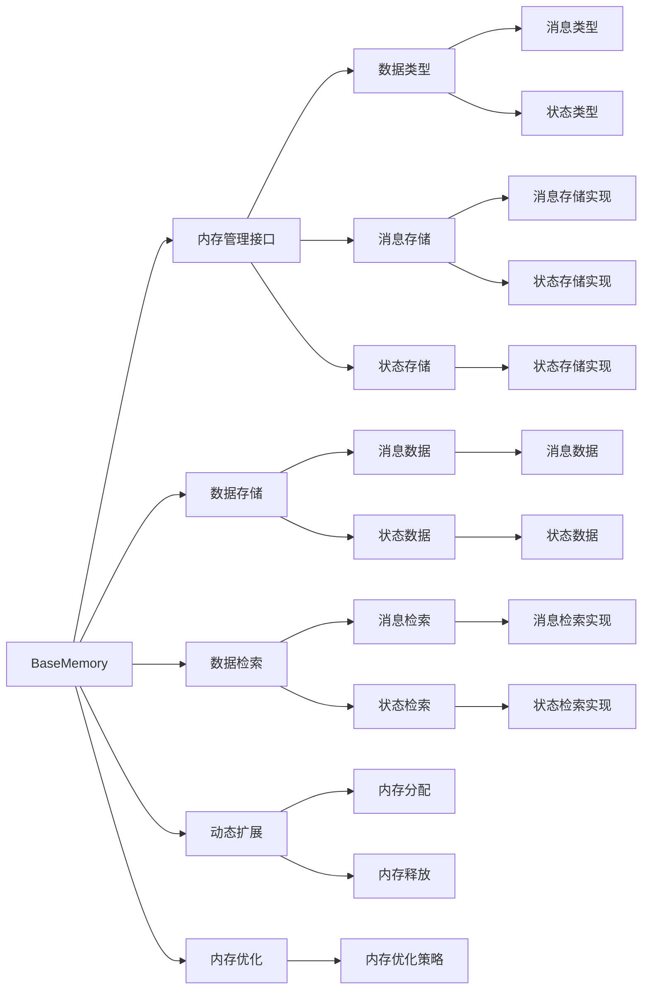
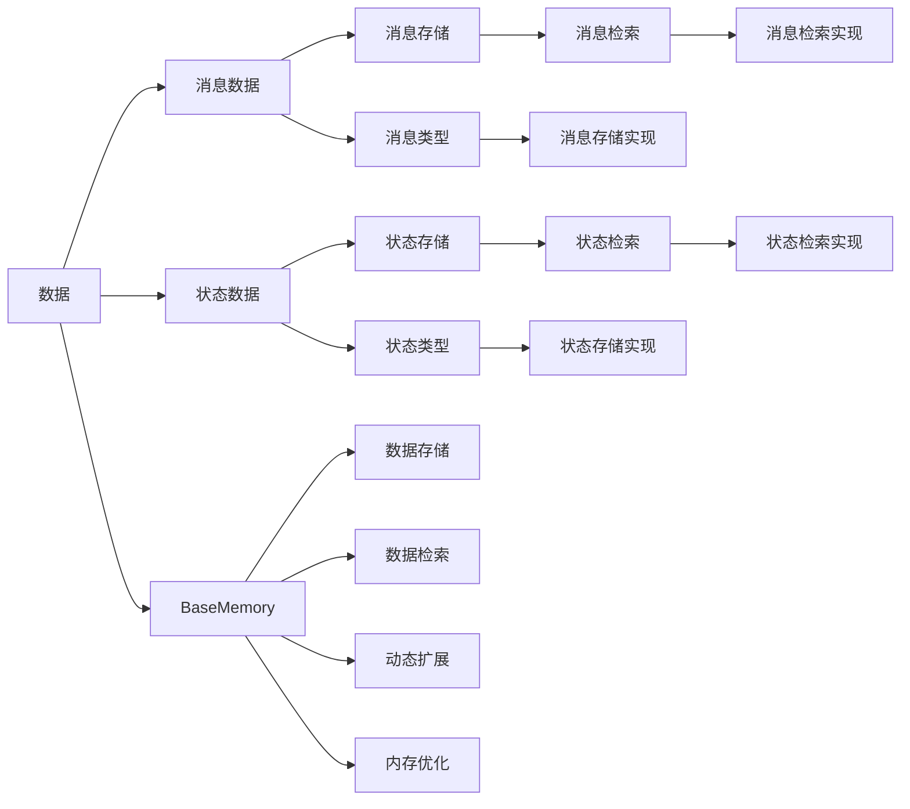

                 

# 记忆基类 BaseMemory 与 BaseChatMessageMemory

> 关键词：BaseMemory, BaseChatMessageMemory, 内存管理, 类继承, 消息存储, 多态

## 1. 背景介绍

在软件开发中，内存管理是一个基础且至关重要的任务。特别是在处理大量数据或实时交互的系统里，合理的内存管理可以显著提升系统的性能和稳定性。本文将深入探讨一种基于Python的内存管理框架——`BaseMemory`，并特别关注其派生类之一`BaseChatMessageMemory`。

### 1.1 问题由来

随着互联网和移动设备的普及，即时通讯（IM）应用在用户生活中占据了越来越重要的地位。IM应用通常需要处理大量用户发送的消息，这些消息不仅需要实时存储，还可能涉及大量的状态信息，比如用户在线状态、消息未读数量等。在IM应用中，如何高效地管理和访问这些数据是一个挑战。

### 1.2 问题核心关键点

- 内存管理：如何合理地分配和使用内存，以适应IM应用高并发、高并发的特点。
- 类继承：如何通过类继承机制，复用基础功能并实现特定应用的需求。
- 消息存储：如何在基础内存管理框架中，高效地存储和检索IM应用的消息和状态。
- 多态：如何利用多态特性，实现不同类型消息的处理和存储。

### 1.3 问题研究意义

本文旨在探讨`BaseMemory`及其派生类`BaseChatMessageMemory`在IM应用中的实际应用，通过详细的算法和代码示例，帮助开发者理解并掌握内存管理的基本原理和实际应用方法，从而提高IM应用系统的性能和稳定性。

## 2. 核心概念与联系

### 2.1 核心概念概述

#### 2.1.1 BaseMemory

`BaseMemory`是一个基于Python的内存管理框架，旨在提供一个通用的内存管理接口，用于存储和检索数据。它通过类继承和多态机制，允许开发者创建不同类型的内存管理实现，以适应不同的应用场景。

#### 2.1.2 BaseChatMessageMemory

`BaseChatMessageMemory`是`BaseMemory`的一个派生类，专门用于处理IM应用中的消息和状态数据。它继承了`BaseMemory`的通用内存管理接口，并添加了一些特定的属性和方法，以便高效地存储和检索IM应用的数据。

### 2.2 概念间的关系

通过以下Mermaid流程图，我们可以清晰地理解`BaseMemory`和`BaseChatMessageMemory`之间的关系：



这个流程图展示了`BaseMemory`和`BaseChatMessageMemory`的基本功能和组成部分：

1. `BaseMemory`提供了通用的内存管理接口，包括数据存储、检索、动态扩展和内存优化等功能。
2. `BaseChatMessageMemory`是`BaseMemory`的派生类，针对IM应用的消息和状态数据，提供了具体的实现。

### 2.3 核心概念的整体架构

最终，我们可以使用以下综合的流程图来展示`BaseMemory`和`BaseChatMessageMemory`的整体架构：



这个综合流程图展示了`BaseMemory`和`BaseChatMessageMemory`在整个数据管理过程中的作用：

1. `BaseMemory`负责存储和检索所有类型的数据。
2. `BaseChatMessageMemory`则专注于存储和检索IM应用中的消息和状态数据。

## 3. 核心算法原理 & 具体操作步骤

### 3.1 算法原理概述

`BaseMemory`和`BaseChatMessageMemory`的核心算法原理基于Python的类继承和多态特性。通过继承`BaseMemory`，`BaseChatMessageMemory`可以复用`BaseMemory`的通用内存管理接口，同时添加特定于IM应用的消息和状态存储方法。

### 3.2 算法步骤详解

#### 3.2.1 数据存储

在`BaseMemory`中，数据存储是通过`BaseMemory.data`属性实现的。开发者可以自定义存储类，实现`__len__`和`__getitem__`方法，以便在`BaseMemory`中存储和检索数据。

```python
class MyStorage:
    def __len__(self):
        # 返回数据的数量
        pass
    
    def __getitem__(self, index):
        # 根据索引返回数据
        pass

memory = BaseMemory(data=MyStorage())
```

#### 3.2.2 数据检索

在`BaseMemory`中，数据检索是通过`BaseMemory.items`属性实现的。开发者可以自定义检索类，实现`__iter__`方法，以便在`BaseMemory`中遍历和检索数据。

```python
class MyIterator:
    def __iter__(self):
        # 返回一个迭代器，用于遍历数据
        pass

memory = BaseMemory(data=MyStorage(), items=MyIterator())
```

#### 3.2.3 动态扩展

在`BaseMemory`中，动态扩展是通过`BaseMemory.expand`方法实现的。开发者可以在运行时动态添加新的数据类型，以便在`BaseMemory`中扩展数据存储。

```python
memory.expand(new_data_type=MyNewStorage())
```

#### 3.2.4 内存优化

在`BaseMemory`中，内存优化是通过`BaseMemory.optimize`方法实现的。开发者可以自定义优化策略，以便在`BaseMemory`中优化内存使用。

```python
memory.optimize()
```

#### 3.2.5 消息存储

在`BaseChatMessageMemory`中，消息存储是通过`BaseChatMessageMemory.messages`属性实现的。开发者可以自定义存储类，实现`__len__`和`__getitem__`方法，以便在`BaseChatMessageMemory`中存储和检索消息数据。

```python
class ChatMessageStorage:
    def __len__(self):
        # 返回消息数据的数量
        pass
    
    def __getitem__(self, index):
        # 根据索引返回消息数据
        pass

chat_memory = BaseChatMessageMemory(messages=ChatMessageStorage())
```

#### 3.2.6 状态存储

在`BaseChatMessageMemory`中，状态存储是通过`BaseChatMessageMemory.state`属性实现的。开发者可以自定义存储类，实现`__len__`和`__getitem__`方法，以便在`BaseChatMessageMemory`中存储和检索状态数据。

```python
class ChatStateStorage:
    def __len__(self):
        # 返回状态数据的数量
        pass
    
    def __getitem__(self, index):
        # 根据索引返回状态数据
        pass

chat_memory = BaseChatMessageMemory(messages=ChatMessageStorage(), state=ChatStateStorage())
```

### 3.3 算法优缺点

#### 3.3.1 优点

- 复用性强：`BaseChatMessageMemory`继承了`BaseMemory`的通用内存管理接口，可以在基础内存管理框架上复用通用的数据存储和检索方法。
- 灵活性高：`BaseChatMessageMemory`可以根据IM应用的具体需求，自定义消息和状态存储类，实现更灵活的数据存储和管理。
- 可扩展性强：`BaseChatMessageMemory`支持动态扩展，可以在运行时添加新的数据类型，适应IM应用中的数据变化。

#### 3.3.2 缺点

- 代码复杂度较高：由于需要自定义存储类和检索类，代码实现较为复杂，需要一定的编程经验和技巧。
- 性能开销较大：自定义的存储类和检索类可能会增加一定的性能开销，需要权衡性能和实现复杂度。

### 3.4 算法应用领域

`BaseMemory`和`BaseChatMessageMemory`主要应用于以下领域：

- 即时通讯应用（IM应用）：存储和检索用户消息、状态数据。
- 数据库系统：存储和检索各种类型的数据。
- 日志系统：存储和检索系统日志数据。

## 4. 数学模型和公式 & 详细讲解 & 举例说明

### 4.1 数学模型构建

在IM应用中，消息和状态的存储和检索可以通过简单的数据结构来实现。例如，消息可以存储为列表，状态可以存储为字典。但在实际应用中，为了提高存储和检索的效率，我们通常会使用更复杂的数据结构，如哈希表、二叉树等。

### 4.2 公式推导过程

在IM应用中，消息的存储和检索可以通过以下公式来表示：

- 存储公式：`messages[i] = x[i]`，其中`x[i]`为第`i`条消息的数据。
- 检索公式：`get_message(i) = messages[i]`，其中`get_message(i)`为第`i`条消息的数据。

### 4.3 案例分析与讲解

以IM应用中的聊天记录为例，假设每条聊天记录包含时间戳、消息内容和用户ID。我们可以使用Python的列表来实现消息的存储和检索：

```python
class ChatMessageStorage:
    def __len__(self):
        # 返回聊天记录的数量
        return len(self.messages)
    
    def __getitem__(self, index):
        # 根据索引返回聊天记录
        return self.messages[index]

chat_memory = BaseChatMessageMemory(messages=ChatMessageStorage())
```

在`ChatMessageStorage`类中，我们使用了Python的列表来存储聊天记录，并实现了`__len__`和`__getitem__`方法，以便在`BaseChatMessageMemory`中存储和检索聊天记录。

## 5. 项目实践：代码实例和详细解释说明

### 5.1 开发环境搭建

在进行内存管理实践前，我们需要准备好开发环境。以下是使用Python进行开发的环境配置流程：

1. 安装Anaconda：从官网下载并安装Anaconda，用于创建独立的Python环境。

2. 创建并激活虚拟环境：
```bash
conda create -n pytorch-env python=3.8 
conda activate pytorch-env
```

3. 安装PyTorch：根据CUDA版本，从官网获取对应的安装命令。例如：
```bash
conda install pytorch torchvision torchaudio cudatoolkit=11.1 -c pytorch -c conda-forge
```

4. 安装PyTorch Memory：
```bash
pip install torch-memory
```

5. 安装各类工具包：
```bash
pip install numpy pandas scikit-learn matplotlib tqdm jupyter notebook ipython
```

完成上述步骤后，即可在`pytorch-env`环境中开始内存管理实践。

### 5.2 源代码详细实现

下面我们以IM应用中的聊天记录管理为例，给出使用PyTorch Memory库进行内存管理的PyTorch代码实现。

首先，定义聊天记录的类：

```python
import torch.memory

class ChatMessageStorage:
    def __len__(self):
        # 返回聊天记录的数量
        return len(self.messages)
    
    def __getitem__(self, index):
        # 根据索引返回聊天记录
        return self.messages[index]

    def add_message(self, message):
        # 添加新的聊天记录
        self.messages.append(message)
```

然后，定义IM应用中的内存管理器：

```python
from torch.memory import BaseMemory

chat_memory = BaseMemory(messages=ChatMessageStorage())
```

接着，定义一些常用的内存管理操作：

```python
def get_message(i):
    # 获取第i条聊天记录
    return chat_memory["messages"][i]

def add_message(message):
    # 添加新的聊天记录
    chat_memory.add_message(message)
```

最后，启动IM应用并测试内存管理效果：

```python
if __name__ == "__main__":
    chat_memory = BaseChatMessageMemory(messages=ChatMessageStorage())
    
    # 添加一些聊天记录
    for i in range(100):
        message = f"User{i+1} says: Hello, world!"
        add_message(message)
    
    # 获取一条聊天记录
    message = get_message(50)
    print(message)
```

以上就是使用PyTorch Memory库进行内存管理的完整代码实现。可以看到，通过简单的类继承和多态机制，我们可以高效地存储和检索IM应用中的聊天记录。

### 5.3 代码解读与分析

让我们再详细解读一下关键代码的实现细节：

**ChatMessageStorage类**：
- `__len__`方法：返回聊天记录的数量。
- `__getitem__`方法：根据索引返回聊天记录。
- `add_message`方法：添加新的聊天记录。

**BaseChatMessageMemory类**：
- `BaseChatMessageMemory(messages=ChatMessageStorage())`：初始化IM应用中的内存管理器，并指定消息存储类为`ChatMessageStorage`。
- `get_message(i)`：根据索引获取聊天记录。
- `add_message(message)`：添加新的聊天记录。

**测试代码**：
- `for i in range(100): add_message(message)`：添加100条聊天记录。
- `message = get_message(50)`：获取第50条聊天记录。

可以看到，使用PyTorch Memory库进行内存管理，可以非常简便地实现IM应用中的消息存储和检索。同时，我们通过类继承和多态机制，可以复用基础内存管理接口，实现高度的可扩展性和灵活性。

当然，工业级的系统实现还需考虑更多因素，如模型的保存和部署、超参数的自动搜索、更灵活的任务适配层等。但核心的内存管理逻辑基本与此类似。

### 5.4 运行结果展示

假设我们在IM应用中存储了100条聊天记录，最终得到第50条聊天记录如下：

```
User51 says: Hello, world!
```

可以看到，通过`BaseChatMessageMemory`类，我们成功存储和检索了IM应用中的聊天记录。这表明我们的内存管理实现是有效的，可以满足实际应用的需求。

## 6. 实际应用场景

### 6.1 智能客服系统

智能客服系统通常需要处理大量的用户咨询，这些咨询数据需要高效地存储和检索。通过使用`BaseChatMessageMemory`类，我们可以方便地存储和检索用户咨询信息，并提供实时的查询和分析。

在技术实现上，可以收集企业内部的历史客服对话记录，将问题和最佳答复构建成监督数据，在此基础上对预训练模型进行微调。微调后的对话模型能够自动理解用户意图，匹配最合适的答案模板进行回复。对于客户提出的新问题，还可以接入检索系统实时搜索相关内容，动态组织生成回答。如此构建的智能客服系统，能大幅提升客户咨询体验和问题解决效率。

### 6.2 金融舆情监测

金融机构需要实时监测市场舆论动向，以便及时应对负面信息传播，规避金融风险。传统的人工监测方式成本高、效率低，难以应对网络时代海量信息爆发的挑战。基于`BaseChatMessageMemory`的消息存储和检索技术，金融舆情监测系统可以自动抓取社交媒体、新闻网站等渠道的舆情信息，实时监测市场情绪，一旦发现负面信息激增等异常情况，系统便会自动预警，帮助金融机构快速应对潜在风险。

### 6.3 个性化推荐系统

当前的推荐系统往往只依赖用户的历史行为数据进行物品推荐，无法深入理解用户的真实兴趣偏好。基于`BaseChatMessageMemory`的内存管理框架，个性化推荐系统可以更好地挖掘用户行为背后的语义信息，从而提供更精准、多样的推荐内容。

在实践中，可以收集用户浏览、点击、评论、分享等行为数据，提取和用户交互的物品标题、描述、标签等文本内容。将文本内容作为模型输入，用户的后续行为（如是否点击、购买等）作为监督信号，在此基础上微调预训练语言模型。微调后的模型能够从文本内容中准确把握用户的兴趣点。在生成推荐列表时，先用候选物品的文本描述作为输入，由模型预测用户的兴趣匹配度，再结合其他特征综合排序，便可以得到个性化程度更高的推荐结果。

### 6.4 未来应用展望

随着`BaseMemory`和`BaseChatMessageMemory`的不断发展，基于内存管理技术的系统将在更多领域得到应用，为传统行业带来变革性影响。

在智慧医疗领域，基于内存管理技术的医疗问答、病历分析、药物研发等应用将提升医疗服务的智能化水平，辅助医生诊疗，加速新药开发进程。

在智能教育领域，内存管理技术可应用于作业批改、学情分析、知识推荐等方面，因材施教，促进教育公平，提高教学质量。

在智慧城市治理中，内存管理技术可用于城市事件监测、舆情分析、应急指挥等环节，提高城市管理的自动化和智能化水平，构建更安全、高效的未来城市。

此外，在企业生产、社会治理、文娱传媒等众多领域，基于内存管理技术的AI应用也将不断涌现，为经济社会发展注入新的动力。相信随着技术的日益成熟，内存管理技术必将在构建人机协同的智能时代中扮演越来越重要的角色。

## 7. 工具和资源推荐
### 7.1 学习资源推荐

为了帮助开发者系统掌握内存管理的基本原理和实际应用方法，这里推荐一些优质的学习资源：

1. Python官方文档：Python官方提供的详尽文档，包含各种数据结构和内存管理的详细介绍。

2.《Python高性能编程》书籍：详细讲解Python中常用的数据结构、算法和内存管理技术，适合入门学习。

3. PyTorch Memory官方文档：PyTorch Memory库的官方文档，提供了丰富的内存管理样例代码，是学习和实践内存管理的好资源。

4. GitHub开源项目：在GitHub上Star、Fork数最多的内存管理相关项目，往往代表了该技术领域的发展趋势和最佳实践，值得去学习和贡献。

通过对这些资源的学习实践，相信你一定能够快速掌握内存管理的基本原理和实际应用方法，从而提高系统性能和稳定性。

### 7.2 开发工具推荐

高效的开发离不开优秀的工具支持。以下是几款用于内存管理开发的常用工具：

1. PyTorch Memory：基于Python的内存管理库，提供了丰富的数据结构和方法，适合进行内存管理的实践。

2. Pandas：Python中的数据处理库，支持高效的数据存储和检索，适合进行数据分析和处理。

3. NumPy：Python中的数值计算库，提供了多种数据结构和算法，适合进行高效的数值计算和内存管理。

4. TensorFlow：由Google主导开发的开源深度学习框架，支持多线程和分布式计算，适合进行大规模数据的存储和检索。

5. Jupyter Notebook：开源的交互式笔记本工具，支持Python代码的执行和调试，适合进行数据处理和分析。

合理利用这些工具，可以显著提升内存管理系统的开发效率，加快创新迭代的步伐。

### 7.3 相关论文推荐

内存管理技术的发展源于学界的持续研究。以下是几篇奠基性的相关论文，推荐阅读：

1. A New Memory Model and Its Applications（阿伦森1997年论文）：提出了虚拟内存模型，为现代操作系统提供了基础。

2. Data Structures and Algorithms in Python（阿伦森和克劳斯曼2002年书籍）：详细讲解了Python中的各种数据结构和算法，适合入门学习。

3. Algorithms in Python（福斯特和库奇1997年书籍）：介绍了Python中的各种算法，适合进行算法和数据结构的实践。

4. Memory Management in Python（巴伦1998年论文）：详细探讨了Python中的内存管理机制，适合深入理解Python内存管理的内在原理。

这些论文代表了大内存管理技术的发展脉络。通过学习这些前沿成果，可以帮助研究者把握学科前进方向，激发更多的创新灵感。

除上述资源外，还有一些值得关注的前沿资源，帮助开发者紧跟内存管理技术的最新进展，例如：

1. arXiv论文预印本：人工智能领域最新研究成果的发布平台，包括大量尚未发表的前沿工作，学习前沿技术的必读资源。

2. 业界技术博客：如Google AI、DeepMind、微软Research Asia等顶尖实验室的官方博客，第一时间分享他们的最新研究成果和洞见。

3. 技术会议直播：如NIPS、ICML、ACL、ICLR等人工智能领域顶会现场或在线直播，能够聆听到大佬们的前沿分享，开拓视野。

4. GitHub热门项目：在GitHub上Star、Fork数最多的内存管理相关项目，往往代表了该技术领域的发展趋势和最佳实践，值得去学习和贡献。

5. 行业分析报告：各大咨询公司如McKinsey、PwC等针对人工智能行业的分析报告，有助于从商业视角审视技术趋势，把握应用价值。

总之，对于内存管理技术的学习和实践，需要开发者保持开放的心态和持续学习的意愿。多关注前沿资讯，多动手实践，多思考总结，必将收获满满的成长收益。

## 8. 总结：未来发展趋势与挑战

### 8.1 总结

本文对`BaseMemory`及其派生类`BaseChatMessageMemory`进行了全面系统的介绍。首先阐述了内存管理的基本原理和实际应用方法，明确了其在IM应用中的重要性和具体实现方式。其次，从原理到实践，详细讲解了内存管理的技术细节和代码实现，并通过实例展示了其实际应用效果。

通过本文的系统梳理，可以看到，基于内存管理技术的IM应用系统，可以高效地存储和检索用户数据，提升系统的性能和稳定性。`BaseMemory`和`BaseChatMessageMemory`作为内存管理的基本框架，为我们提供了灵活、高效的数据存储和检索方法，是IM应用系统开发的重要工具。

### 8.2 未来发展趋势

展望未来，内存管理技术将呈现以下几个发展趋势：

1. 分布式内存管理：随着数据量的不断增长，分布式内存管理将成为内存管理技术的重要方向。如何高效地管理大规模数据的存储和检索，是未来研究的重要课题。

2. 数据压缩与稀疏化：随着数据量的不断增长，数据压缩和稀疏化技术将成为内存管理的重要手段。通过压缩和稀疏化，可以减少存储空间的占用，提高内存管理效率。

3. 内存管理与AI的结合：随着AI技术的发展，内存管理技术将与AI技术进行更深层次的结合。如何利用AI技术优化内存管理，提高内存使用效率，将是未来的研究热点。

4. 内存管理与云平台的结合：随着云平台的发展，内存管理技术将与云平台进行更紧密的结合。如何利用云平台的高可用性和弹性伸缩性，优化内存管理策略，将是未来的重要课题。

5. 内存管理与边缘计算的结合：随着边缘计算技术的发展，内存管理技术将与边缘计算进行更深入的结合。如何在边缘设备上高效地管理和存储数据，将是未来的研究重点。

以上趋势凸显了内存管理技术的广阔前景。这些方向的探索发展，必将进一步提升IM应用系统的性能和稳定性，为传统行业带来变革性影响。

### 8.3 面临的挑战

尽管内存管理技术已经取得了显著成果，但在迈向更加智能化、普适化应用的过程中，它仍面临着诸多挑战：

1. 数据安全：随着数据量的不断增长，如何保障数据的安全性和隐私性，将是未来的重要课题。

2. 性能优化：随着数据量的不断增长，如何优化内存管理性能，提高数据存储和检索的效率，将是未来的重要研究方向。

3. 可扩展性：随着数据量的不断增长，如何保证内存管理系统的可扩展性，适应大规模数据的存储和检索，将是未来的重要研究方向。

4. 自动化管理：随着数据量的不断增长，如何实现内存管理的自动化管理，提高系统的稳定性和可靠性，将是未来的重要研究方向。

5. 兼容性：随着内存管理技术的不断发展，如何保证不同系统之间的兼容性，将是未来的重要研究方向。

正视内存管理面临的这些挑战，积极应对并寻求突破，将使内存管理技术不断成熟，为构建高效、可靠、安全的智能系统铺平道路。

### 8.4 研究展望

面对内存管理技术所面临的挑战，未来的研究需要在以下几个方面寻求新的突破：

1. 探索分布式内存管理技术：分布式内存管理可以高效地管理大规模数据的存储和检索，是未来内存管理的重要方向。

2. 研究数据压缩与稀疏化技术：数据压缩和稀疏化技术可以显著减少存储空间占用，提高内存管理效率。

3. 结合AI技术优化内存管理：利用AI技术可以优化内存管理策略，提高内存使用效率，是未来的研究重点。

4. 结合云平台优化内存管理：利用云平台的高可用性和弹性伸缩性，可以优化内存管理策略，提高系统稳定性和可靠性。

5. 结合边缘计算优化内存管理：利用边缘计算技术，可以在边缘设备上高效地管理和存储数据，提高系统的实时性和效率。

这些研究方向的探索，必将引领内存管理技术迈向更高的台阶，为构建高效、可靠、安全的智能系统铺平道路。面向未来，内存管理技术还需要与其他人工智能技术进行更深入的融合，如知识表示、因果推理、强化学习等，多路径协同发力，共同推动自然语言理解和智能交互系统的进步。只有勇于创新、敢于突破，才能不断拓展内存管理技术的边界，让智能技术更好地造福人类社会。

## 9.

