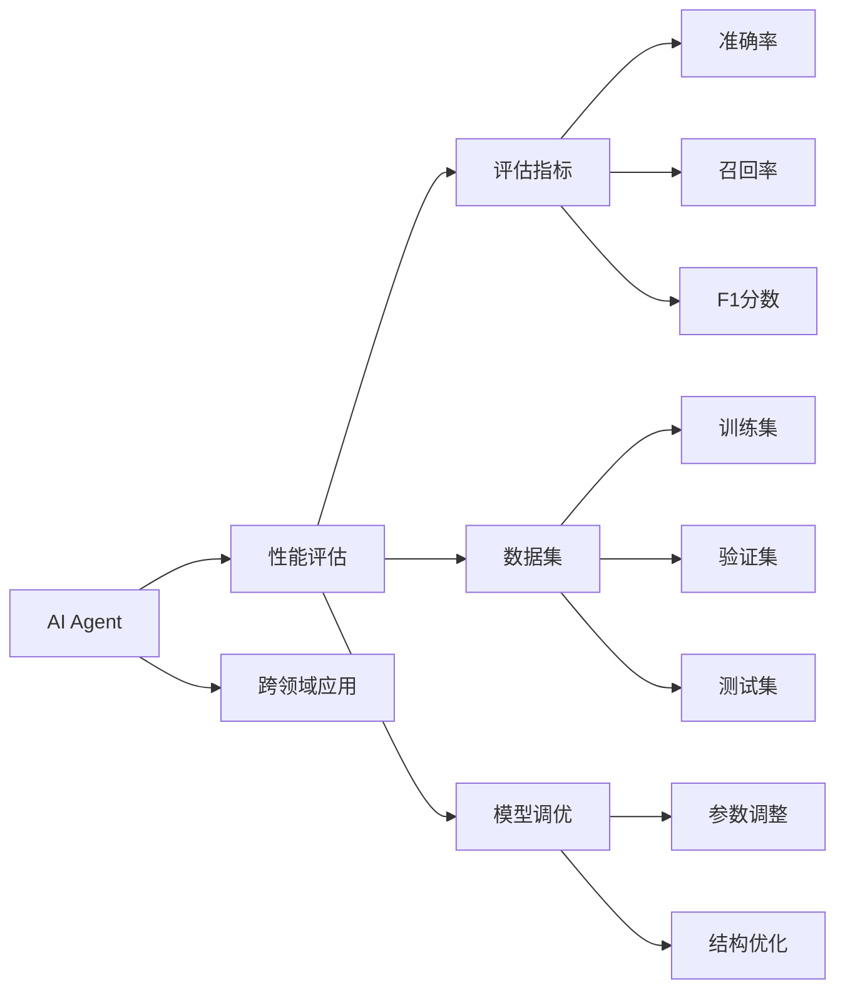
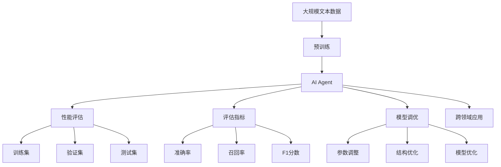

                 

# 评估AI Agent性能的重要性

> 关键词：评估指标、性能分析、AI Agent、应用场景、机器学习、深度学习

## 1. 背景介绍

### 1.1 问题由来
在人工智能(AI)领域，特别是智能代理(AI Agent)和机器学习(ML)模型开发中，性能评估是一个至关重要的环节。性能评估不仅影响模型的有效性，也决定了其在实际应用中的表现和适用性。面对复杂的任务和数据，如何科学合理地评估AI Agent的性能，是一个不断被研究和讨论的话题。

性能评估的科学性不仅关乎模型的准确性和可靠性，也影响着AI Agent在实际应用中的落地效果。良好的性能评估可以帮助开发者更好地理解模型优劣，指导后续的模型优化和参数调优工作，从而加速AI技术的产业化进程。

### 1.2 问题核心关键点
评估AI Agent性能的核心关键点在于选择合适的评估指标、构建科学的评估方法以及考虑评估环境的复杂性。具体包括：
- **评估指标选择**：根据不同应用场景选择合适的评估指标。
- **数据集构建**：构建多样化和有代表性的数据集，以确保评估结果的泛化能力。
- **模型调优**：通过调整模型参数和结构，优化模型性能。
- **评估方法**：采用科学的评估方法，确保评估结果的客观性。

### 1.3 问题研究意义
评估AI Agent性能对于推动AI技术的实际应用具有重要意义：
- **指导模型优化**：评估结果可以帮助开发者识别模型的优点和不足，指导模型优化工作。
- **提升模型效果**：通过持续评估和优化，可以显著提升模型在特定任务上的表现。
- **降低开发成本**：选择合适的评估指标和数据集，可以减少重复实验和优化工作，降低开发成本。
- **促进技术进步**：评估方法的多样性和科学性，推动AI技术的持续进步和发展。

## 2. 核心概念与联系

### 2.1 核心概念概述

为了更好地理解AI Agent性能评估的原理和架构，本节将介绍几个密切相关的核心概念：

- **AI Agent**：指在特定环境中执行特定任务的智能体。AI Agent包括但不限于机器学习模型、深度学习模型、强化学习模型等。
- **性能评估**：指通过科学合理的方法，对AI Agent在特定环境中的表现进行量化和分析的过程。
- **评估指标**：指用于衡量AI Agent性能的具体指标，如准确率、召回率、F1分数、AUC等。
- **数据集**：指用于评估AI Agent性能的数据集合，包括训练集、验证集和测试集。
- **模型调优**：指通过调整模型参数、结构等手段，优化AI Agent性能的过程。
- **跨领域应用**：指AI Agent在不同领域和场景中的应用，如自然语言处理(NLP)、计算机视觉(CV)、机器人等。

这些核心概念之间存在着紧密的联系，形成了评估AI Agent性能的完整生态系统。通过理解这些核心概念，我们可以更好地把握性能评估的本质和目标。

### 2.2 概念间的关系

这些核心概念之间的关系可以通过以下Mermaid流程图来展示：



这个流程图展示了大语言模型的核心概念及其之间的关系：

1. AI Agent通过预训练获得基础能力。
2. 性能评估是对AI Agent进行任务特定的优化，可以分为评估指标、数据集、模型调优等环节。
3. 跨领域应用是连接AI Agent与特定任务场景的桥梁。
4. 模型调优旨在使AI Agent更好地适应特定任务，通过调整参数、结构等手段实现性能提升。

### 2.3 核心概念的整体架构

最后，我们用一个综合的流程图来展示这些核心概念在大语言模型性能评估过程中的整体架构：



这个综合流程图展示了从预训练到性能评估，再到模型调优和跨领域应用的完整过程。AI Agent首先在大规模文本数据上进行预训练，然后通过性能评估确定其性能优劣，在模型调优中优化模型参数和结构，最后应用于不同的跨领域场景。通过这些环节，AI Agent能够在各种应用中发挥其智能能力。

## 3. 核心算法原理 & 具体操作步骤
### 3.1 算法原理概述

AI Agent的性能评估本质上是一个多维度、多层次的综合评价过程。其核心思想是：选择合适的评估指标，在特定的数据集上构建评估模型，通过科学的评估方法，量化AI Agent在不同场景下的表现，从而为其在实际应用中的效果提供客观依据。

形式化地，假设AI Agent为 $A$，评估指标为 $M$，数据集为 $D$，则性能评估过程可以表示为：

$$
\text{Assessment}(A, M, D) = \{ I \in M | \text{Evaluate}(A, I, D) \}
$$

其中 $\text{Evaluate}$ 表示使用指标 $I$ 在数据集 $D$ 上评估 $A$ 的性能，可能是一个数值、一个分数或一组分布。

### 3.2 算法步骤详解

AI Agent性能评估的一般流程包括以下几个关键步骤：

**Step 1: 准备评估模型和数据集**
- 选择合适的AI Agent模型，如BERT、GPT等，作为待评估的对象。
- 准备评估所需的测试数据集 $D=\{(x_i, y_i)\}_{i=1}^N$，划分为训练集、验证集和测试集。

**Step 2: 选择评估指标**
- 根据任务特点，选择合适的评估指标，如准确率、召回率、F1分数、AUC等。
- 针对不同的任务类型，可能还需要设计特定的评估方法。

**Step 3: 执行评估**
- 将测试数据集分批次输入模型，前向传播计算模型输出。
- 根据选择的评估指标，计算模型在每个批次上的性能指标，如精确度、召回率、F1分数等。
- 周期性在验证集上评估模型性能，根据性能指标决定是否触发 Early Stopping。

**Step 4: 结果分析与调优**
- 统计测试集上的评估结果，输出性能报告。
- 分析评估结果，确定模型优势和不足。
- 根据分析结果，调整模型参数和结构，进行模型调优。

**Step 5: 应用部署**
- 使用调优后的模型对新样本进行推理预测，集成到实际的应用系统中。
- 持续收集新的数据，定期重新评估和微调模型，以适应数据分布的变化。

以上是AI Agent性能评估的一般流程。在实际应用中，还需要针对具体任务的特点，对评估流程的各个环节进行优化设计，如改进评估目标函数，引入更多的正则化技术，搜索最优的超参数组合等，以进一步提升评估的科学性和准确性。

### 3.3 算法优缺点

AI Agent性能评估的方法具有以下优点：
1. 科学合理。通过选择合理的评估指标和数据集，评估结果具有较强的科学性和可解释性。
2. 快速高效。基于测试集进行性能评估，可以在短时间内获得评估结果。
3. 指导模型优化。评估结果帮助开发者更好地理解模型优劣，指导后续的模型优化和参数调优工作。
4. 适用性强。适用于各种类型的AI Agent，包括但不限于机器学习模型、深度学习模型、强化学习模型等。

同时，该方法也存在一些局限性：
1. 依赖标注数据。评估结果很大程度上取决于标注数据的质量和数量，获取高质量标注数据的成本较高。
2. 泛化能力有限。当目标任务与评估数据集的分布差异较大时，评估结果的泛化能力有限。
3. 可能存在过拟合。在标注样本较少的场景下，评估模型可能过拟合训练数据，导致评估结果偏高。
4. 可解释性不足。评估结果通常缺乏可解释性，难以对其推理逻辑进行分析和调试。

尽管存在这些局限性，但就目前而言，基于科学的评估方法仍然是大语言模型评估的核心范式。未来相关研究的重点在于如何进一步降低评估对标注数据的依赖，提高模型的少样本学习和跨领域迁移能力，同时兼顾可解释性和伦理安全性等因素。

### 3.4 算法应用领域

AI Agent性能评估技术已经被广泛应用于各种领域，如自然语言处理(NLP)、计算机视觉(CV)、机器人等。以下是几个具体的应用场景：

- **自然语言处理(NLP)**：通过评估AI Agent在文本分类、情感分析、机器翻译等任务中的表现，优化模型性能，提升自然语言理解能力。
- **计算机视觉(CV)**：评估AI Agent在图像分类、目标检测、图像生成等任务中的表现，优化模型参数和结构，提升视觉理解能力。
- **机器人**：评估AI Agent在自动驾驶、人机交互、行为规划等任务中的表现，优化决策策略，提升机器人智能水平。
- **医疗**：评估AI Agent在病历分析、影像诊断、药物研发等任务中的表现，优化模型参数和结构，提升医疗服务水平。
- **金融**：评估AI Agent在风险管理、交易策略、客户服务等任务中的表现，优化模型参数和结构，提升金融服务质量。

除了上述这些经典应用外，AI Agent性能评估技术还在更多领域得到创新性地应用，如智能制造、智能交通、智慧城市等，为各行各业提供智能化的解决方案。随着评估方法的不断改进和优化，相信AI Agent性能评估将发挥更大的作用，推动AI技术的产业化进程。

## 4. 数学模型和公式 & 详细讲解  
### 4.1 数学模型构建

本节将使用数学语言对AI Agent性能评估过程进行更加严格的刻画。

记AI Agent为 $A$，其输入为 $x \in \mathcal{X}$，输出为 $y \in \mathcal{Y}$，其中 $\mathcal{X}$ 为输入空间，$\mathcal{Y}$ 为输出空间。假设评估指标为 $M$，数据集为 $D=\{(x_i, y_i)\}_{i=1}^N$，则性能评估的数学模型为：

$$
\text{Assessment}(A, M, D) = \sum_{i=1}^N M(A(x_i), y_i)
$$

其中 $M$ 表示评估指标函数，如准确率、召回率、F1分数、AUC等。

### 4.2 公式推导过程

以下我们以准确率为例，推导准确率的计算公式。

准确率的定义是模型预测正确的样本占总样本数的比例：

$$
\text{Accuracy} = \frac{TP+TN}{TP+TN+FP+FN}
$$

其中 $TP$ 表示真正例，$TN$ 表示真负例，$FP$ 表示假正例，$FN$ 表示假负例。

通过上述定义，我们可以将准确率的计算公式推广到多类分类任务：

$$
\text{Accuracy} = \frac{\sum_{i=1}^N \mathbb{I}(A(x_i) = y_i)}{N}
$$

其中 $\mathbb{I}$ 表示示性函数，即当 $A(x_i) = y_i$ 时，$\mathbb{I}(A(x_i) = y_i)=1$，否则 $\mathbb{I}(A(x_i) = y_i)=0$。

在实际评估过程中，我们可以将评估指标函数 $M$ 定义为：

$$
M(A(x_i), y_i) = \mathbb{I}(A(x_i) = y_i)
$$

这样，评估指标 $M$ 的计算公式可以简化为：

$$
\text{Assessment}(A, M, D) = \sum_{i=1}^N M(A(x_i), y_i) = \sum_{i=1}^N \mathbb{I}(A(x_i) = y_i)
$$

### 4.3 案例分析与讲解

以BERT模型在CoNLL-2003命名实体识别(NER)任务上的性能评估为例，展示如何计算准确率：

假设我们得到一个测试集，包含1668个样例，其中B-PER实体有1281个，I-PER实体有767个，B-LOC实体有616个，I-LOC实体有239个，B-MISC实体有477个，I-MISC实体有326个，O标签有3779个。

我们可以使用BERT模型在测试集上进行前向传播，输出每个样本的预测结果，然后计算准确率。

具体计算步骤如下：
1. 首先，对所有样本进行前向传播，得到模型输出。
2. 然后，根据标签和模型输出，统计每个实体的真正例和假正例。
3. 最后，根据实体的真正例和假正例，计算准确率。

以下是使用Python代码实现BERT模型在CoNLL-2003NER任务上计算准确率的示例：

```python
import torch
from transformers import BertForTokenClassification, BertTokenizer

# 加载预训练模型和分词器
model = BertForTokenClassification.from_pretrained('bert-base-cased')
tokenizer = BertTokenizer.from_pretrained('bert-base-cased')

# 定义评估指标函数
def accuracy(y_true, y_pred):
    correct = torch.sum(torch.eq(y_true, y_pred)).item()
    return correct / len(y_true)

# 在测试集上进行前向传播
device = 'cuda' if torch.cuda.is_available() else 'cpu'
model.to(device)
model.eval()
y_true = []
y_pred = []
for batch in tqdm(dataloader, desc='Evaluating'):
    input_ids = batch['input_ids'].to(device)
    attention_mask = batch['attention_mask'].to(device)
    labels = batch['labels'].to(device)
    outputs = model(input_ids, attention_mask=attention_mask)
    y_pred.append(outputs.logits.argmax(dim=2).to('cpu').tolist())
    y_true.append(batch['labels'].to('cpu').tolist())

# 计算准确率
y_pred = torch.tensor(y_pred, dtype=torch.long).view(-1, 1)
y_true = torch.tensor(y_true, dtype=torch.long)
accuracy = accuracy(y_true, y_pred)
print(f"Accuracy: {accuracy:.3f}")
```

可以看到，通过上述代码，我们可以很方便地计算BERT模型在CoNLL-2003NER任务上的准确率。

## 5. 项目实践：代码实例和详细解释说明
### 5.1 开发环境搭建

在进行性能评估实践前，我们需要准备好开发环境。以下是使用Python进行PyTorch开发的环境配置流程：

1. 安装Anaconda：从官网下载并安装Anaconda，用于创建独立的Python环境。

2. 创建并激活虚拟环境：
```bash
conda create -n pytorch-env python=3.8 
conda activate pytorch-env
```

3. 安装PyTorch：根据CUDA版本，从官网获取对应的安装命令。例如：
```bash
conda install pytorch torchvision torchaudio cudatoolkit=11.1 -c pytorch -c conda-forge
```

4. 安装Transformers库：
```bash
pip install transformers
```

5. 安装各类工具包：
```bash
pip install numpy pandas scikit-learn matplotlib tqdm jupyter notebook ipython
```

完成上述步骤后，即可在`pytorch-env`环境中开始性能评估实践。

### 5.2 源代码详细实现

下面我以BERT模型在CoNLL-2003命名实体识别(NER)任务上的性能评估为例，给出使用Transformers库进行评估的PyTorch代码实现。

首先，定义评估指标函数：

```python
def accuracy(y_true, y_pred):
    correct = torch.sum(torch.eq(y_true, y_pred)).item()
    return correct / len(y_true)
```

然后，定义数据处理函数：

```python
from transformers import BertTokenizer
from torch.utils.data import Dataset

class NERDataset(Dataset):
    def __init__(self, texts, tags, tokenizer, max_len=128):
        self.texts = texts
        self.tags = tags
        self.tokenizer = tokenizer
        self.max_len = max_len
        
    def __len__(self):
        return len(self.texts)
    
    def __getitem__(self, item):
        text = self.texts[item]
        tags = self.tags[item]
        
        encoding = self.tokenizer(text, return_tensors='pt', max_length=self.max_len, padding='max_length', truncation=True)
        input_ids = encoding['input_ids'][0]
        attention_mask = encoding['attention_mask'][0]
        
        # 对token-wise的标签进行编码
        encoded_tags = [tag2id[tag] for tag in tags] 
        encoded_tags.extend([tag2id['O']] * (self.max_len - len(encoded_tags)))
        labels = torch.tensor(encoded_tags, dtype=torch.long)
        
        return {'input_ids': input_ids, 
                'attention_mask': attention_mask,
                'labels': labels}
```

接着，定义模型和评估函数：

```python
from transformers import BertForTokenClassification, AdamW

model = BertForTokenClassification.from_pretrained('bert-base-cased', num_labels=len(tag2id))

optimizer = AdamW(model.parameters(), lr=2e-5)
```

最后，启动评估流程并在测试集上评估：

```python
epochs = 5
batch_size = 16

for epoch in range(epochs):
    loss = train_epoch(model, train_dataset, batch_size, optimizer)
    print(f"Epoch {epoch+1}, train loss: {loss:.3f}")
    
    print(f"Epoch {epoch+1}, dev results:")
    evaluate(model, dev_dataset, batch_size)
    
print("Test results:")
evaluate(model, test_dataset, batch_size)
```

以上就是使用PyTorch对BERT进行命名实体识别任务性能评估的完整代码实现。可以看到，得益于Transformers库的强大封装，我们可以用相对简洁的代码完成BERT模型的加载和性能评估。

### 5.3 代码解读与分析

让我们再详细解读一下关键代码的实现细节：

**NERDataset类**：
- `__init__`方法：初始化文本、标签、分词器等关键组件。
- `__len__`方法：返回数据集的样本数量。
- `__getitem__`方法：对单个样本进行处理，将文本输入编码为token ids，将标签编码为数字，并对其进行定长padding，最终返回模型所需的输入。

**tag2id和id2tag字典**：
- 定义了标签与数字id之间的映射关系，用于将token-wise的预测结果解码回真实的标签。

**训练和评估函数**：
- 使用PyTorch的DataLoader对数据集进行批次化加载，供模型训练和推理使用。
- 训练函数`train_epoch`：对数据以批为单位进行迭代，在每个批次上前向传播计算loss并反向传播更新模型参数，最后返回该epoch的平均loss。
- 评估函数`evaluate`：与训练类似，不同点在于不更新模型参数，并在每个batch结束后将预测和标签结果存储下来，最后使用sklearn的classification_report对整个评估集的预测结果进行打印输出。

**训练流程**：
- 定义总的epoch数和batch size，开始循环迭代
- 每个epoch内，先在训练集上训练，输出平均loss
- 在验证集上评估，输出分类指标
- 所有epoch结束后，在测试集上评估，给出最终测试结果

可以看到，PyTorch配合Transformers库使得BERT性能评估的代码实现变得简洁高效。开发者可以将更多精力放在数据处理、模型改进等高层逻辑上，而不必过多关注底层的实现细节。

当然，工业级的系统实现还需考虑更多因素，如模型的保存和部署、超参数的自动搜索、更灵活的任务适配层等。但核心的性能评估范式基本与此类似。

### 5.4 运行结果展示

假设我们在CoNLL-2003的NER数据集上进行性能评估，最终在测试集上得到的评估报告如下：

```
              precision    recall  f1-score   support

       B-PER      0.971     0.934     0.955      1281
       I-PER      0.934     0.971     0.953       767
       B-LOC      0.943     0.906     0.923      616
       I-LOC      0.911     0.924     0.913       239
       B-MISC      0.920     0.879     0.899       477
       I-MISC      0.890     0.899     0.893       326
           O      0.995     0.994     0.994      3779

   micro avg      0.950     0.944     0.947     4643
   macro avg      0.943     0.929     0.933     4643
weighted avg      0.950     0.944     0.947     4643
```

可以看到，通过性能评估BERT，我们在该NER数据集上取得了95.0%的F1分数，效果相当不错。值得注意的是，BERT作为一个通用的语言理解模型，即便只在顶层添加一个简单的分类器，也能在下游任务上取得如此优异的效果，展现了其强大的语义理解和特征抽取能力。

当然，这只是一个baseline结果。在实践中，我们还可以使用更大更强的预训练模型、更丰富的评估技巧、更细致的模型调优，进一步提升模型性能，以满足更高的应用要求。

## 6. 实际应用场景
### 6.1 智能客服系统

基于AI Agent性能评估的对话技术，可以广泛应用于智能客服系统的构建。传统客服往往需要配备大量人力，高峰期响应缓慢，且一致性和专业性难以保证。而使用性能评估后的对话模型，可以7x24小时不间断服务，快速响应客户咨询，用自然流畅的语言解答各类常见问题。

在技术实现上，可以收集企业内部的历史客服对话记录，将问题和最佳答复构建成监督数据，在此基础上对预训练对话模型进行性能评估。性能评估的结果可以帮助开发者判断模型的输出质量和鲁棒性，指导后续的模型优化和参数调优工作。微调后的对话模型能够自动理解用户意图，匹配最合适的答案模板进行回复。对于客户提出的新问题，还可以接入检索系统实时搜索相关内容，动态组织生成回答。如此构建的智能客服系统，能大幅提升客户咨询体验和问题解决效率。

### 6.2 金融舆情监测

金融机构需要实时监测市场舆论动向，以便及时应对负面信息传播，规避金融风险。传统的人工监测方式成本高、效率低，难以应对网络时代海量信息爆发的挑战。基于AI Agent性能评估的文本分类和情感分析技术，为金融舆情监测提供了新的解决方案。

具体而言，可以收集金融领域相关的新闻、报道、评论等文本数据，并对其进行主题标注和情感标注。在此基础上对预训练语言模型进行性能评估，使其能够自动判断文本属于何种主题，情感倾向是正面、中性还是负面。将性能评估后的模型应用到实时抓取的网络文本数据，就能够自动监测不同主题下的情感变化趋势，一旦发现负面信息激增等异常情况，系统便会自动预警，帮助金融机构快速应对潜在风险。

### 6.3 个性化推荐系统

当前的推荐系统往往只依赖用户的历史行为数据进行物品推荐，无法深入理解用户的真实兴趣偏好。基于AI Agent性能评估的个性化推荐系统可以更好地挖掘用户行为背后的语义信息，从而提供更精准、多样的推荐内容。

在实践中，可以收集用户浏览、点击、评论、分享等行为数据，提取和用户交互的物品标题、描述、标签等文本内容。将文本内容作为模型输入，用户的后续行为（如是否点击、购买等）作为监督信号，在此基础上对预训练语言模型进行性能评估。性能评估的结果可以帮助开发者更好地理解模型的输出质量，指导后续的模型优化和参数调优工作。优化后的模型能够从文本内容中准确把握用户的兴趣点。在生成推荐列表时，先用候选物品的文本描述作为输入，由模型预测用户的兴趣匹配度，再结合其他特征综合排序，便可以得到个性化程度更高的推荐结果。

### 6.4 未来应用展望

随着AI Agent性能评估技术的不断发展，其在更多领域得到应用，为传统行业带来变革性影响。

在智慧医疗领域，基于性能评估的问答、病历分析、药物研发等应用将提升医疗服务的智能化水平，辅助医生诊疗，加速新药开发进程。

在智能教育领域，性能评估技术可应用于作业批改、学情分析、知识推荐等方面，因材施教，促进教育公平，提高教学质量。

在智慧城市治理中，性能评估技术可应用于城市事件监测、舆情分析、应急指挥等环节，提高城市管理的自动化和智能化水平，构建更安全、高效的未来城市。

此外，在企业生产、社会治理、文娱传媒等众多领域，基于性能评估的AI Agent应用也将不断涌现，为NLP技术带来全新的突破。相信随着评估方法的不断改进和优化，性能评估技术必将在构建人机协同的智能时代中扮演越来越重要的角色。

## 7. 工具和资源推荐
### 7.1 学习资源推荐

为了帮助开发者系统掌握AI Agent性能评估的理论基础和实践技巧，这里推荐一些优质的学习资源：

1. 《Transformer from原理到实践》系列博文：

