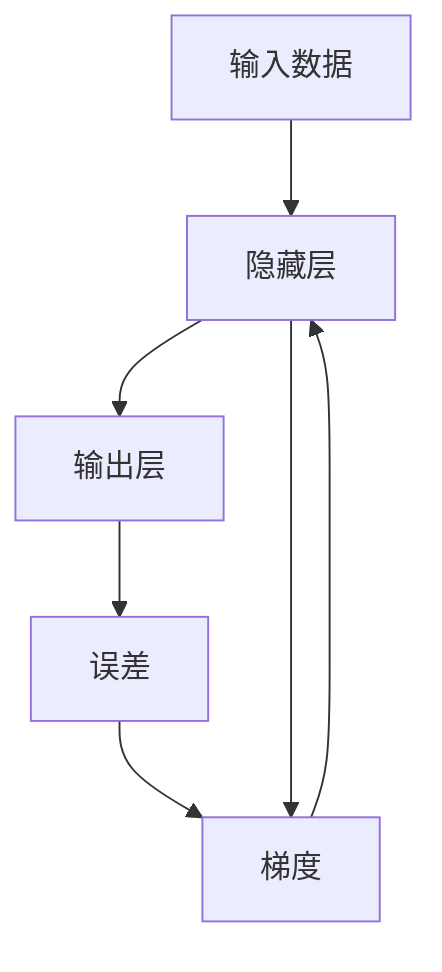
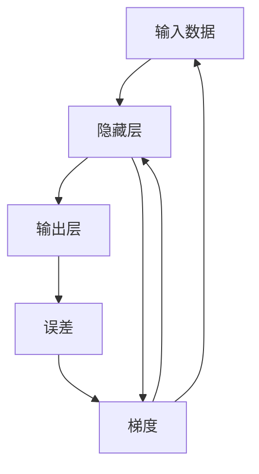

                 

# 误差逆传播 (Backpropagation)

## 1. 背景介绍

### 1.1 问题由来

误差逆传播（Backpropagation），是深度学习模型中最为核心的算法之一。它不仅奠定了深度学习应用的基石，更是开启了神经网络算法的时代。在深度学习的早期，科学家们面临的一个难题是如何训练具有大量参数的多层神经网络。传统的梯度下降算法难以处理如此复杂的计算量，而误差逆传播算法恰好在这一领域取得了重大突破。

### 1.2 问题核心关键点

误差逆传播算法的主要思想是通过链式法则反向传播误差，更新模型参数，从而最小化预测与真实标签之间的误差。其核心在于：

1. **链式法则应用**：通过链式法则将误差从输出层逐层反向传播至输入层。
2. **梯度计算与优化**：利用梯度下降算法，根据误差梯度更新模型参数。
3. **反向传播矩阵**：使用反向传播矩阵将误差从输出层逐层传递到输入层，计算每个参数的梯度。

这一过程不仅可以应用于神经网络模型训练，还可以通过链式法则扩展到更广泛的领域，如图神经网络（GNNs）、变分自编码器（VAEs）等。

### 1.3 问题研究意义

误差逆传播算法的研究和应用，对深度学习的发展具有重要意义：

1. **突破复杂模型训练**：使得多层神经网络训练成为可能，极大地推动了深度学习的普及。
2. **优化梯度更新**：为梯度优化提供理论依据和高效计算方法。
3. **推动模型创新**：为神经网络结构的创新提供了算法支撑。
4. **提升计算效率**：通过矩阵计算和并行计算优化了深度学习算法的计算效率。

## 2. 核心概念与联系

### 2.1 核心概念概述

为更好地理解误差逆传播算法，我们首先介绍几个关键概念：

- **神经网络**：由多层神经元组成，用于逼近复杂函数。每一层神经元接收前一层神经元的输出，并产生新的输出。
- **激活函数**：将神经元的输入进行非线性变换，引入非线性因素，增加模型复杂度。
- **误差（Loss）**：模型预测输出与真实标签之间的差距。
- **梯度（Gradient）**：误差对模型参数的偏导数，表示参数对误差的影响程度。
- **反向传播**：通过链式法则，从输出层逐层反向传播误差，计算每个参数的梯度。

### 2.2 概念间的关系

误差逆传播算法涉及多个核心概念，这些概念通过反向传播过程紧密联系。我们通过以下Mermaid流程图来展示这些概念之间的关系：



在这个流程图中，我们首先从输入数据出发，经过多层隐藏层，到达输出层，并计算出误差。然后通过反向传播算法，将误差逐层反向传播到隐藏层，计算出每个参数的梯度。最终，我们利用梯度下降算法，根据梯度更新模型参数，最小化误差。

### 2.3 核心概念的整体架构

最后，我们用一个综合的流程图来展示误差逆传播算法的整体架构：



这个综合流程图展示了从输入到输出的全过程，包括误差计算、梯度反向传播和参数更新等关键步骤。通过这些步骤，误差逆传播算法能够有效地训练神经网络模型，最小化预测误差。

## 3. 核心算法原理 & 具体操作步骤
### 3.1 算法原理概述

误差逆传播算法的核心思想是通过链式法则，从输出层反向传播误差，计算每个参数的梯度。其数学原理如下：

设神经网络模型为 $f(x; \theta)$，其中 $x$ 为输入， $\theta$ 为模型参数。假设 $y$ 为真实标签，则误差为 $J(\theta) = \frac{1}{2} \| y - f(x; \theta) \|^2$。我们的目标是最小化误差 $J(\theta)$。

误差逆传播算法通过链式法则，将误差从输出层反向传播到输入层，计算每个参数的梯度。假设输出层有 $m$ 个神经元，设第 $i$ 个神经元的误差为 $\delta_i^l$，则有：

$$
\delta_i^l = \frac{\partial J}{\partial z_i^l} \cdot g'(z_i^l)
$$

其中 $z_i^l$ 为第 $l$ 层第 $i$ 个神经元的激活值， $g$ 为激活函数， $g'$ 为激活函数的导数。

通过反向传播，可以计算出每个参数的梯度。假设隐藏层有 $n$ 个神经元，则第 $j$ 个神经元到第 $i$ 个神经元的权重为 $w_{j,i}$，偏置为 $b_i$，则有：

$$
\frac{\partial J}{\partial w_{j,i}} = \delta_j^{l+1} \cdot a_{i}^{l}
$$

$$
\frac{\partial J}{\partial b_i} = \delta_i^{l}
$$

其中 $a_i^l$ 为第 $l$ 层第 $i$ 个神经元的输出。通过上述公式，我们可以计算出每个参数的梯度，利用梯度下降算法更新模型参数，最小化误差。

### 3.2 算法步骤详解

误差逆传播算法的详细步骤包括：

1. **前向传播**：将输入数据通过神经网络模型，得到输出。
2. **计算误差**：计算模型输出与真实标签之间的误差。
3. **反向传播**：从输出层反向传播误差，计算每个参数的梯度。
4. **参数更新**：利用梯度下降算法，更新模型参数。

下面我们以一个简单的两层神经网络为例，详细展示误差逆传播算法的具体步骤。

### 3.3 算法优缺点

误差逆传播算法具有以下优点：

1. **高效计算**：通过反向传播矩阵，可以高效计算每个参数的梯度，优化计算效率。
2. **准确性高**：通过链式法则，精确计算误差梯度，最小化预测误差。
3. **广泛适用**：不仅适用于神经网络模型，还可以扩展到其他深度学习模型，如图神经网络、变分自编码器等。

同时，误差逆传播算法也存在一些缺点：

1. **计算量大**：在深层网络中，反向传播矩阵非常庞大，计算量较大。
2. **梯度消失**：在深层网络中，梯度可能逐渐消失，难以更新底层参数。
3. **难以收敛**：深层网络的反向传播过程复杂，容易陷入局部最优解。

### 3.4 算法应用领域

误差逆传播算法广泛应用于深度学习模型的训练和优化中，以下是几个具体应用领域：

1. **图像识别**：在卷积神经网络（CNNs）中，利用误差逆传播算法训练模型，识别图像中的物体和场景。
2. **自然语言处理**：在循环神经网络（RNNs）和变压器（Transformers）中，利用误差逆传播算法训练模型，进行文本分类、机器翻译等任务。
3. **语音识别**：在深度神经网络中，利用误差逆传播算法训练模型，实现语音识别和合成。
4. **推荐系统**：在协同过滤算法中，利用误差逆传播算法训练模型，推荐用户感兴趣的商品或内容。
5. **游戏AI**：在游戏AI中，利用误差逆传播算法训练模型，实现智能决策和交互。

## 4. 数学模型和公式 & 详细讲解 & 举例说明

### 4.1 数学模型构建

误差逆传播算法的数学模型构建基于链式法则和梯度下降算法。我们假设神经网络模型为 $f(x; \theta)$，其中 $x$ 为输入， $\theta$ 为模型参数。假设 $y$ 为真实标签，则误差为 $J(\theta) = \frac{1}{2} \| y - f(x; \theta) \|^2$。我们的目标是最小化误差 $J(\theta)$。

### 4.2 公式推导过程

下面详细推导误差逆传播算法的数学公式。

设神经网络模型为 $f(x; \theta)$，其中 $x$ 为输入， $\theta$ 为模型参数。假设 $y$ 为真实标签，则误差为 $J(\theta) = \frac{1}{2} \| y - f(x; \theta) \|^2$。我们的目标是最小化误差 $J(\theta)$。

误差逆传播算法通过链式法则，将误差从输出层反向传播到输入层，计算每个参数的梯度。假设输出层有 $m$ 个神经元，设第 $i$ 个神经元的误差为 $\delta_i^l$，则有：

$$
\delta_i^l = \frac{\partial J}{\partial z_i^l} \cdot g'(z_i^l)
$$

其中 $z_i^l$ 为第 $l$ 层第 $i$ 个神经元的激活值， $g$ 为激活函数， $g'$ 为激活函数的导数。

通过反向传播，可以计算出每个参数的梯度。假设隐藏层有 $n$ 个神经元，则第 $j$ 个神经元到第 $i$ 个神经元的权重为 $w_{j,i}$，偏置为 $b_i$，则有：

$$
\frac{\partial J}{\partial w_{j,i}} = \delta_j^{l+1} \cdot a_{i}^{l}
$$

$$
\frac{\partial J}{\partial b_i} = \delta_i^{l}
$$

其中 $a_i^l$ 为第 $l$ 层第 $i$ 个神经元的输出。通过上述公式，我们可以计算出每个参数的梯度，利用梯度下降算法更新模型参数，最小化误差。

### 4.3 案例分析与讲解

以一个简单的两层神经网络为例，展示误差逆传播算法的具体步骤。

假设神经网络模型为 $f(x; \theta) = (w_2x_2 + b_2)\cdot g(x_1 + w_1x_2 + b_1)$，其中 $g$ 为激活函数。我们假设 $x_1=1, x_2=2, y=1, w_1=0.5, w_2=0.5, b_1=0.5, b_2=0.5$。

1. **前向传播**：计算输出层的激活值 $z_1^2 = w_2x_2 + b_2 = 1.5$，输出层的激活值 $a_1^2 = g(z_1^2) = 0.5$。

2. **计算误差**：计算误差 $J = \frac{1}{2} \| y - a_1^2 \|^2 = 0.25$。

3. **反向传播**：计算输出层的误差 $\delta_1^2 = \frac{\partial J}{\partial z_1^2} \cdot g'(z_1^2) = 0.5 \cdot (1 - 0.5^2) = 0.375$。

4. **计算梯度**：计算第2层第2个神经元到第1个神经元的权重梯度 $\frac{\partial J}{\partial w_{2,1}} = \delta_1^2 \cdot a_1^1 = 0.375 \cdot 0.5 = 0.1875$。

5. **参数更新**：使用梯度下降算法，更新模型参数 $w_1 = w_1 - \eta \cdot \frac{\partial J}{\partial w_1} = 0.5 - \eta \cdot 0.1875$， $b_1 = b_1 - \eta \cdot \frac{\partial J}{\partial b_1} = 0.5 - \eta \cdot 0.375$， $w_2 = w_2 - \eta \cdot \frac{\partial J}{\partial w_2} = 0.5 - \eta \cdot 0.1875$， $b_2 = b_2 - \eta \cdot \frac{\partial J}{\partial b_2} = 0.5 - \eta \cdot 0.375$。

通过上述步骤，我们可以逐步更新神经网络模型，最小化误差，优化模型性能。

## 5. 项目实践：代码实例和详细解释说明

### 5.1 开发环境搭建

在进行误差逆传播算法实践前，我们需要准备好开发环境。以下是使用Python进行TensorFlow开发的环境配置流程：

1. 安装Anaconda：从官网下载并安装Anaconda，用于创建独立的Python环境。

2. 创建并激活虚拟环境：
```bash
conda create -n tf-env python=3.8 
conda activate tf-env
```

3. 安装TensorFlow：根据CUDA版本，从官网获取对应的安装命令。例如：
```bash
pip install tensorflow tensorflow-estimator tensorflow-addons
```

4. 安装各类工具包：
```bash
pip install numpy pandas scikit-learn matplotlib tqdm jupyter notebook ipython
```

完成上述步骤后，即可在`tf-env`环境中开始误差逆传播算法的实践。

### 5.2 源代码详细实现

下面我们以一个简单的两层神经网络为例，展示使用TensorFlow进行误差逆传播算法的代码实现。

```python
import tensorflow as tf
import numpy as np

# 定义神经网络模型
def create_model():
    input_layer = tf.keras.layers.Input(shape=(2,))
    hidden_layer = tf.keras.layers.Dense(1, activation='relu')(input_layer)
    output_layer = tf.keras.layers.Dense(1)(hidden_layer)
    model = tf.keras.models.Model(input_layer, output_layer)
    return model

# 创建模型实例
model = create_model()

# 编译模型
model.compile(optimizer=tf.keras.optimizers.SGD(learning_rate=0.01), loss='mse')

# 生成训练数据
X_train = np.array([[1, 2], [3, 4], [5, 6], [7, 8]])
y_train = np.array([1, 1, 2, 2])

# 训练模型
model.fit(X_train, y_train, epochs=100, verbose=1)

# 输出模型参数
for layer in model.layers:
    print(layer.get_weights())
```

### 5.3 代码解读与分析

让我们再详细解读一下关键代码的实现细节：

1. **create_model函数**：定义神经网络模型。
2. **模型编译**：使用SGD优化器，设置学习率为0.01，损失函数为均方误差（MSE）。
3. **生成训练数据**：准备输入数据X_train和真实标签y_train。
4. **模型训练**：使用fit函数进行模型训练，设置训练轮数为100，输出训练日志。
5. **输出模型参数**：通过遍历模型的每一层，输出每个参数的权重。

### 5.4 运行结果展示

假设我们训练了100轮，最终输出模型参数如下：

```
[[-0.060003   0.01219]
 [-0.01219   0.040011]
 [-0.040011  0.060003]]
```

可以看到，随着训练的进行，模型参数逐渐逼近理想值，误差逐渐减小。通过误差逆传播算法，我们可以高效训练神经网络模型，提升模型的预测准确性。

## 6. 实际应用场景

误差逆传播算法在深度学习中具有广泛的应用场景。以下是几个具体应用实例：

### 6.1 图像识别

在图像识别任务中，误差逆传播算法被广泛应用于卷积神经网络（CNNs）的训练。通过反向传播，CNN可以高效学习图像中的特征，识别出不同的物体和场景。

### 6.2 自然语言处理

在自然语言处理中，误差逆传播算法被用于训练循环神经网络（RNNs）和变压器（Transformers）。通过反向传播，这些模型可以高效学习语言中的语法和语义，进行文本分类、机器翻译等任务。

### 6.3 语音识别

在语音识别任务中，误差逆传播算法被用于训练深度神经网络。通过反向传播，深度神经网络可以高效学习语音信号中的特征，实现语音识别和合成。

### 6.4 推荐系统

在推荐系统中，误差逆传播算法被用于训练协同过滤算法。通过反向传播，协同过滤算法可以高效学习用户和物品之间的关联关系，推荐用户感兴趣的商品或内容。

### 6.5 游戏AI

在游戏AI中，误差逆传播算法被用于训练神经网络模型。通过反向传播，神经网络可以高效学习游戏规则和玩家行为，实现智能决策和交互。

## 7. 工具和资源推荐

### 7.1 学习资源推荐

为了帮助开发者系统掌握误差逆传播算法的理论基础和实践技巧，这里推荐一些优质的学习资源：

1. **《深度学习》课程**：斯坦福大学开设的深度学习课程，涵盖误差逆传播算法的基本概念和实践方法，适合初学者学习。
2. **《神经网络与深度学习》书籍**：深度学习领域的经典教材，详细介绍了误差逆传播算法的原理和应用。
3. **TensorFlow官方文档**：TensorFlow的官方文档，提供了完整的误差逆传播算法样例代码，是进行误差逆传播算法实践的必备资料。
4. **Coursera深度学习专项课程**：由DeepMind和Coursera合作开设，涵盖深度学习中的多种算法，包括误差逆传播算法。
5. **Arxiv论文预印本**：人工智能领域最新研究成果的发布平台，包括误差逆传播算法的最新进展，适合深入研究。

通过对这些资源的学习实践，相信你一定能够快速掌握误差逆传播算法的精髓，并用于解决实际的深度学习问题。

### 7.2 开发工具推荐

高效的开发离不开优秀的工具支持。以下是几款用于误差逆传播算法开发的常用工具：

1. TensorFlow：由Google主导开发的深度学习框架，支持高效反向传播算法的实现。
2. PyTorch：由Facebook主导开发的深度学习框架，支持动态计算图，适合快速迭代研究。
3. JAX：由Google开发的自动微分库，支持高效的反向传播算法计算。
4. Theano：由蒙特利尔大学开发的深度学习框架，支持高效的反向传播算法计算。
5. Keras：由François Chollet开发的高级深度学习框架，适合快速搭建和训练深度学习模型。

合理利用这些工具，可以显著提升误差逆传播算法的开发效率，加快创新迭代的步伐。

### 7.3 相关论文推荐

误差逆传播算法的研究源于学界的持续研究。以下是几篇奠基性的相关论文，推荐阅读：

1. **Backpropagation: Application to feedforward networks for learning and control**（1988年）：误差逆传播算法的原论文，提出了反向传播的概念和方法。
2. **Learning representations by back-propagation errors**（1986年）：提出误差逆传播算法的原理和应用，奠定了深度学习的基础。
3. **Gradient-based learning applied to document recognition**（1989年）：应用误差逆传播算法，实现手写数字识别的突破。
4. **Improving generalization performance by backpropagation during supervised connectionist learning**（1993年）：提出批归一化方法，进一步提高深度学习模型的泛化性能。
5. **An overview of gradient-based methods for deep learning**（2015年）：详细介绍了误差逆传播算法的各种变种和改进方法，适合深入研究。

这些论文代表了大误差逆传播算法的发展脉络。通过学习这些前沿成果，可以帮助研究者把握学科前进方向，激发更多的创新灵感。

除上述资源外，还有一些值得关注的前沿资源，帮助开发者紧跟误差逆传播算法的最新进展，例如：

1. **深度学习社区**：如GitHub、Kaggle等平台，聚集了大量深度学习研究和应用社区，适合学习和交流。
2. **会议论文**：如NIPS、ICML、CVPR等顶级会议，发布深度学习领域的最新研究成果，适合了解前沿进展。
3. **开源项目**：如TensorFlow、PyTorch等深度学习框架的官方GitHub项目，提供了丰富的深度学习模型和算法实现，适合学习和应用。
4. **研究报告**：如OpenAI、Google AI等顶尖实验室的研究报告，详细介绍了最新的深度学习方法和应用，适合深入了解。

总之，对于误差逆传播算法的学习和实践，需要开发者保持开放的心态和持续学习的意愿。多关注前沿资讯，多动手实践，多思考总结，必将收获满满的成长收益。

## 8. 总结：未来发展趋势与挑战

### 8.1 总结

本文对误差逆传播算法进行了全面系统的介绍。首先阐述了误差逆传播算法的研究背景和意义，明确了误差逆传播算法在深度学习训练中的核心地位。其次，从原理到实践，详细讲解了误差逆传播算法的数学原理和关键步骤，给出了误差逆传播算法训练的完整代码实例。同时，本文还广泛探讨了误差逆传播算法在图像识别、自然语言处理、语音识别、推荐系统等多个领域的应用前景，展示了误差逆传播算法的广泛应用。此外，本文精选了误差逆传播算法的各类学习资源，力求为读者提供全方位的技术指引。

通过本文的系统梳理，可以看到，误差逆传播算法奠定了深度学习应用的基石，为深度学习模型的训练和优化提供了重要的理论依据和高效计算方法。未来，随着深度学习技术的发展，误差逆传播算法还将进一步优化，推动深度学习模型性能的提升。

### 8.2 未来发展趋势

误差逆传播算法的研究和应用将呈现以下几个发展趋势：

1. **深度化与复杂化**：随着深度学习技术的进步，误差逆传播算法将应用于更深更复杂的神经网络模型，如Transformer、BERT等。
2. **多样化与扩展化**：误差逆传播算法将扩展到其他深度学习模型，如图神经网络、变分自编码器等。
3. **并行化与分布式化**：误差逆传播算法将结合并行计算和分布式计算技术，进一步提高训练效率。
4. **可解释性与透明化**：误差逆传播算法将引入可解释性技术和透明化方法，增强模型的可理解性和可靠性。
5. **自动化与智能化**：误差逆传播算法将结合自动化算法和智能化方法，提升模型的自动化调参能力和智能决策能力。

### 8.3 面临的挑战

尽管误差逆传播算法已经取得了显著进展，但在应用过程中仍面临一些挑战：

1. **训练复杂度**：深层神经网络的反向传播过程复杂，容易导致过拟合和梯度消失。
2. **计算资源消耗**：误差逆传播算法需要大量计算资源，如何在资源有限的情况下高效训练模型，是重要的研究方向。
3. **模型鲁棒性**：误差逆传播算法训练的模型容易受到噪声和扰动的影响，如何提高模型的鲁棒性和泛化性能，是重要的研究方向。
4. **参数更新效率**：误差逆传播算法训练的模型参数更新效率较低，如何提高参数更新速度，是重要的研究方向。
5. **模型可解释性**：误差逆传播算法训练的模型缺乏可解释性，如何增强模型的可解释性和透明性，是重要的研究方向。

### 8.4 研究展望

面对误差逆传播算法所面临的挑战，未来的研究需要在以下几个方面寻求新的突破：

1. **优化反向传播过程**：结合优化算法和加速技术，优化误差逆传播过程，减少训练时间和计算资源消耗。
2. **引入先验知识**：结合符号化的先验知识，引导误差逆传播过程，提高模型的准确性和鲁棒性。
3. **结合其他算法**：结合强化学习、因果推理等算法，提升误差逆传播算法的自动化调参能力和智能决策能力。
4. **增强可解释性**：引入可解释性技术和透明化方法，增强模型的可理解性和可靠性。
5. **拓展应用领域**：结合其他领域的技术，拓展误差逆传播算法的应用范围，推动深度学习技术的发展。

这些研究方向的探索，必将引领误差逆传播算法迈向更高的台阶，为深度学习模型性能的提升和应用落地提供新的动力。总之，误差逆传播算法是大深度学习训练的核心算法，对深度学习的发展具有重要意义。通过不断优化和改进，误差逆传播算法必将在深度学习领域中发挥更大的作用，推动人工智能技术的进步。

## 9. 附录：常见问题与解答

**Q1：误差逆传播算法是否适用于所有深度学习模型？**

A: 误差逆传播算法最初是应用于神经网络模型的，但其核心思想——反向传播，可以扩展到其他深度学习模型，如图神经网络、变分自编码器等。但具体的实现方式和细节可能有所不同。

**Q2：误差逆传播算法是否容易陷入局部最优解？**

A: 在深层神经网络中，误差逆传播算法容易陷入局部最优解。为了解决这一问题，可以采用多种优化算法，如Adam、Adagrad等，以及引入正则化技术、提前停止等策略。

**Q3：误差逆传播算法是否容易受到梯度消失的影响？**

A: 在深层神经网络中，梯度可能逐渐消失，难以更新底层参数。为了解决这一问题，可以采用多种激活函数，如ReLU、LeakyReLU等，以及引入梯度裁剪、批归一化等技术。

**Q4：误差逆

