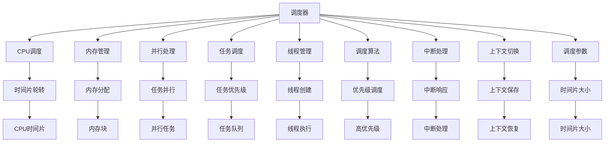
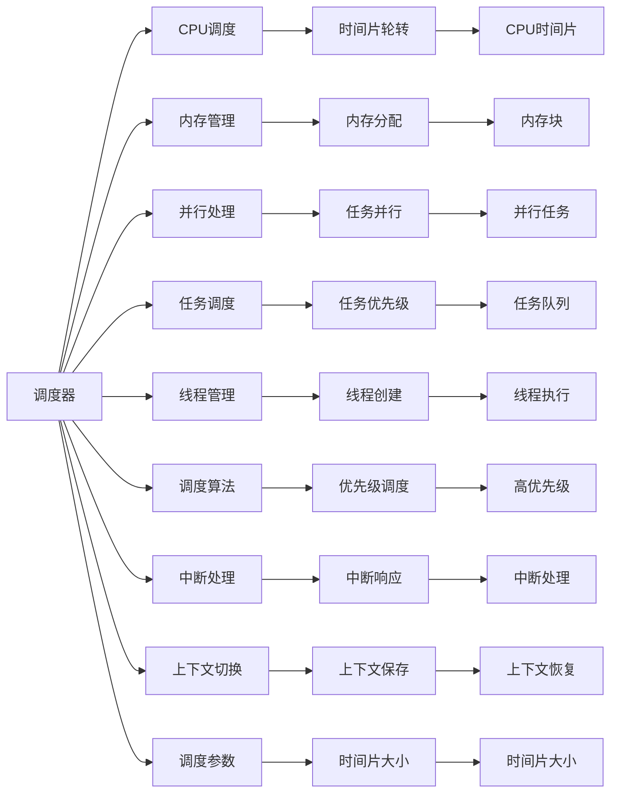
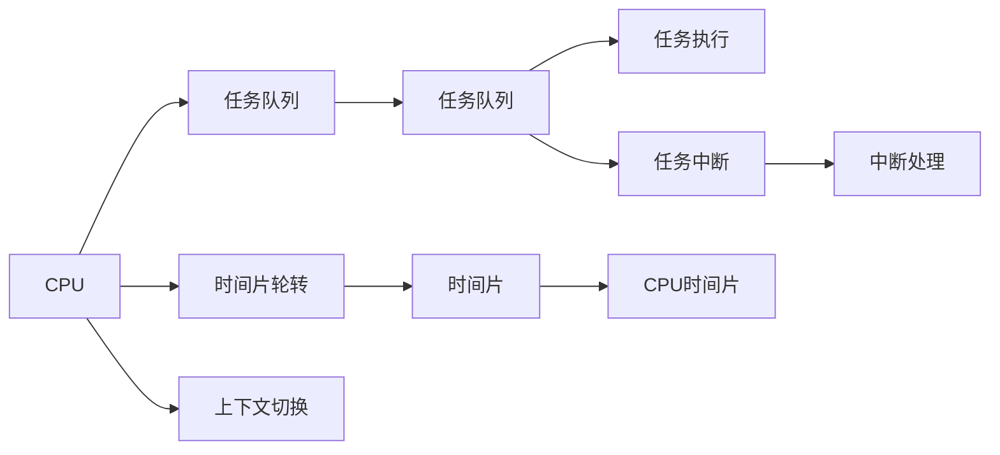
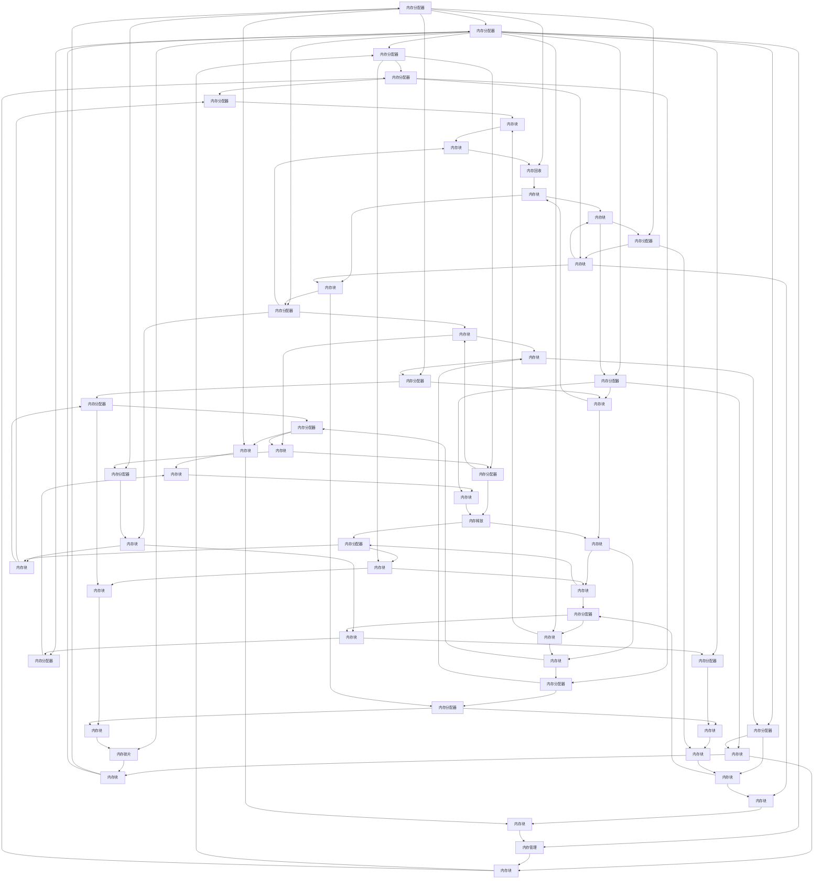

                 

# 调度器 原理与代码实例讲解

> 关键词：
调度器, CPU调度, 内存管理, 并行处理, 任务调度, 线程管理, 调度算法

## 1. 背景介绍

### 1.1 问题由来

在多任务操作系统和分布式系统中，调度器是一个至关重要的组件，它负责决定哪个任务可以获取处理器或内存资源。调度器的性能直接影响系统的整体响应速度和资源利用率。调度器通常采用一些算法来优化任务调度，比如时间片轮转、优先级调度、多级队列等。

然而，在实际应用中，调度器面临着诸如资源有限、任务异构、突发事件等多方面的挑战，这要求调度器不仅要有高效的算法，还要有良好的系统设计和合理的参数配置。

### 1.2 问题核心关键点

调度器的工作原理包括以下几个关键点：

1. **任务调度算法**：决定任务的执行顺序，常用的算法包括时间片轮转、优先级调度、多级队列等。
2. **资源分配策略**：决定如何分配CPU时间片、内存等资源，以保证系统资源的公平性和高效利用。
3. **中断处理机制**：负责处理系统调用、信号等中断事件，保证系统的稳定性和可靠性。
4. **上下文切换**：在任务之间切换时，保存和恢复任务的状态，保证系统的正确性和性能。
5. **调度参数配置**：通过参数调节调度器的行为，比如时间片大小、优先级范围等。

这些关键点共同构成了调度器的核心功能，确保了系统的稳定性和资源利用率。

### 1.3 问题研究意义

调度器是现代操作系统和分布式系统的核心组件，其性能直接影响系统的整体表现。优化调度器的算法和设计，可以提高系统的响应速度、吞吐量和资源利用率，降低系统的延迟和开销，从而提升用户体验和应用性能。

调度器的研究对于操作系统、分布式系统、嵌入式系统等领域具有重要意义。了解调度器的原理和实现细节，可以帮助开发者设计高效、可靠的系统，加速各种应用场景的开发和部署。

## 2. 核心概念与联系

### 2.1 核心概念概述

为了更好地理解调度器的原理和实现，本节将介绍几个密切相关的核心概念：

1. **调度器(Scheduler)**：操作系统中用于管理任务调度的组件，负责决定哪些任务可以获取处理器或内存资源。
2. **CPU调度(CPU Scheduling)**：在多任务操作系统中，决定哪个任务可以获取CPU时间片，以保证系统公平性和高效利用。
3. **内存管理(Memory Management)**：在分布式系统中，决定如何分配和管理内存资源，以保证系统的稳定性和资源利用率。
4. **并行处理(Parallel Processing)**：通过任务调度和资源分配，实现多任务并行执行，提高系统性能。
5. **任务调度(Task Scheduling)**：决定任务的执行顺序和优先级，保证任务的公平性和高效执行。
6. **线程管理(Threads Management)**：在多线程应用中，管理线程的创建、销毁和调度，以保证线程的安全性和并发性。
7. **调度算法(Scheduling Algorithms)**：用于任务调度的算法，包括时间片轮转、优先级调度、多级队列等。
8. **中断处理(Interrupt Handling)**：处理系统调用、信号等中断事件，保证系统的稳定性和可靠性。
9. **上下文切换(Context Switching)**：在任务之间切换时，保存和恢复任务的状态，保证系统的正确性和性能。
10. **调度参数(Scheduling Parameters)**：通过参数调节调度器的行为，比如时间片大小、优先级范围等。

这些核心概念之间的逻辑关系可以通过以下Mermaid流程图来展示：



这个流程图展示了一个典型的调度器系统，包括多个核心组件和它们之间的逻辑关系。

### 2.2 概念间的关系

这些核心概念之间存在着紧密的联系，形成了调度器的完整生态系统。下面我们通过几个Mermaid流程图来展示这些概念之间的关系。

#### 2.2.1 调度器的学习范式



这个流程图展示了一个典型的调度器系统，包括多个核心组件和它们之间的逻辑关系。

#### 2.2.2 CPU调度的逻辑



这个流程图展示了CPU调度的基本逻辑，包括任务队列、时间片轮转、任务执行、中断处理和上下文切换等步骤。

#### 2.2.3 内存管理的逻辑



这个流程图展示了内存管理的逻辑，包括任务队列、内存分配、内存回收和内存碎片管理等步骤。

### 2.3 核心概念的整体架构

最后，我们用一个综合的流程图来展示这些核心概念在大调度器微调过程中的整体架构：

```mermaid
graph TB
    A[任务队列] --> B[内存管理]
    A --> C[CPU调度]
    A --> D[并行处理]
    A --> E[任务调度]
    A --> F[线程管理]
    A --> G[调度算法]
    A --> H[中断处理]
    A --> I[上下文切换]
    A --> J[调度参数]
    B --> K[内存分配]
    C --> L[时间片轮转]
    D --> M[任务并行]
    E --> N[任务优先级]
    F --> O[线程创建]
    G --> P[优先级调度]
    H --> Q[中断响应]
    I --> R[上下文保存]
    J --> S[时间片大小]
    K --> T[内存块]
    L --> U[时间片]
    M --> V[并行任务]
    N --> W[任务队列]
    O --> X[线程执行]
    P --> Y[高优先级]
    Q --> Z[中断处理]
    R --> AA[上下文恢复]
    S --> BB[时间片大小]
    T --> U[内存块]
    U --> V[内存块]
    V --> W[内存块]
    W --> X[内存块]
    X --> Y[内存块]
    Y --> Z[内存块]
    Z --> $[内存块]
    $ --> _[内存块]
    _ --> `[内存块]
    ` --> a[内存块]
    a --> b[内存块]
    b --> c[内存块]
    c --> d[内存块]
    d --> e[内存块]
    e --> f[内存块]
    f --> g[内存块]
    g --> h[内存块]
    h --> i[内存块]
    i --> j[内存块]
    j --> k[内存块]
    k --> l[内存块]
    l --> m[内存块]
    m --> n[内存块]
    n --> o[内存块]
    o --> p[内存块]
    p --> q[内存块]
    q --> r[内存块]
    r --> s[内存块]
    s --> t[内存块]
    t --> u[内存块]
    u --> v[内存块]
    v --> w[内存块]
    w --> x[内存块]
    x --> y[内存块]
    y --> z[内存块]
    z --> A[内存块]
    A --> B[内存块]
    B --> C[内存块]
    C --> D[内存块]
    D --> E[内存块]
    E --> F[内存块]
    F --> G[内存块]
    G --> H[内存块]
    H --> I[内存块]
    I --> J[内存块]
    J --> K[内存块]
    K --> L[内存块]
    L --> M[内存块]
    M --> N[内存块]
    N --> O[内存块]
    O --> P[内存块]
    P --> Q[内存块]
    Q --> R[内存块]
    R --> S[内存块]
    S --> T[内存块]
    T --> U[内存块]
    U --> V[内存块]
    V --> W[内存块]
    W --> X[内存块]
    X --> Y[内存块]
    Y --> Z[内存块]
    Z --> $[内存块]
    $ --> _[内存块]
    _ --> `[内存块]
    ` --> a[内存块]
    a --> b[内存块]
    b --> c[内存块]
    c --> d[内存块]
    d --> e[内存块]
    e --> f[内存块]
    f --> g[内存块]
    g --> h[内存块]
    h --> i[内存块]
    i --> j[内存块]
    j --> k[内存块]
    k --> l[内存块]
    l --> m[内存块]
    m --> n[内存块]
    n --> o[内存块]
    o --> p[内存块]
    p --> q[内存块]
    q --> r[内存块]
    r --> s[内存块]
    s --> t[内存块]
    t --> u[内存块]
    u --> v[内存块]
    v --> w[内存块]
    w --> x[内存块]
    x --> y[内存块]
    y --> z[内存块]
    z --> A[内存块]
    A --> B[内存块]
    B --> C[内存块]
    C --> D[内存块]
    D --> E[内存块]
    E --> F[内存块]
    F --> G[内存块]
    G --> H[内存块]
    H --> I[内存块]
    I --> J[内存块]
    J --> K[内存块]
    K --> L[内存块]
    L --> M[内存块]
    M --> N[内存块]
    N --> O[内存块]
    O --> P[内存块]
    P --> Q[内存块]
    Q --> R[内存块]
    R --> S[内存块]
    S --> T[内存块]
    T --> U[内存块]
    U --> V[内存块]
    V --> W[内存块]
    W --> X[内存块]
    X --> Y[内存块]
    Y --> Z[内存块]
    Z --> $[内存块]
    $ --> _[内存块]
    _ --> `[内存块]
    ` --> a[内存块]
    a --> b[内存块]
    b --> c[内存块]
    c --> d[内存块]
    d --> e[内存块]
    e --> f[内存块]
    f --> g[内存块]
    g --> h[内存块]
    h --> i[内存块]
    i --> j[内存块]
    j --> k[内存块]
    k --> l[内存块]
    l --> m[内存块]
    m --> n[内存块]
    n --> o[内存块]
    o --> p[内存块]
    p --> q[内存块]
    q --> r[内存块]
    r --> s[内存块]
    s --> t[内存块]
    t --> u[内存块]
    u --> v[内存块]
    v --> w[内存块]
    w --> x[内存块]
    x --> y[内存块]
    y --> z[内存块]
    z --> A[内存块]
    A --> B[内存块]
    B --> C[内存块]
    C --> D[内存块]
    D --> E[内存块]
    E --> F[内存块]
    F --> G[内存块]
    G --> H[内存块]
    H --> I[内存块]
    I --> J[内存块]
    J --> K[内存块]
    K --> L[内存块]
    L --> M[内存块]
    M --> N[内存块]
    N --> O[内存块]
    O --> P[内存块]
    P --> Q[内存块]
    Q --> R[内存块]
    R --> S[内存块]
    S --> T[内存块]
    T --> U[内存块]
    U --> V[内存块]
    V --> W[内存块]
    W --> X[内存块]
    X --> Y[内存块]
    Y --> Z[内存块]
    Z --> $[内存块]
    $ --> _[内存块]
    _ --> `[内存块]
    ` --> a[内存块]
    a --> b[内存块]
    b --> c[内存块]
    c --> d[内存块]
    d --> e[内存块]
    e --> f[内存块]
    f --> g[内存块]
    g --> h[内存块]
    h --> i[内存块]
    i --> j[内存块]
    j --> k[内存块]
    k --> l[内存块]
    l --> m[内存块]
    m --> n[内存块]
    n --> o[内存块]
    o --> p[内存块]
    p --> q[内存块]
    q --> r[内存块]
    r --> s[内存块]
    s --> t[内存块]
    t --> u[内存块]
    u --> v[内存块]
    v --> w[内存块]
    w --> x[内存块]
    x --> y[内存块]
    y --> z[内存块]
    z --> A[内存块]
    A --> B[内存块]
    B --> C[内存块]
    C --> D[内存块]
    D --> E[内存块]
    E --> F[内存块]
    F --> G[内存块]
    G --> H[内存块]
    H --> I[内存块]
    I --> J[内存块]
    J --> K[内存块]
    K --> L[内存块]
    L --> M[内存块]
    M --> N[内存块]
    N --> O[内存块]
    O --> P[内存块]
    P --> Q[内存块]
    Q --> R[内存块]
    R --> S[内存块]
    S --> T[内存块]
    T --> U[内存块]
    U --> V[内存块]
    V --> W[内存块]
    W --> X[内存块]
    X --> Y[内存块]
    Y --> Z[内存块]
    Z --> $[内存块]
    $ --> _[内存块]
    _ --> `[内存块]
    ` --> a[内存块]
    a --> b[内存块]
    b --> c[内存块]
    c --> d[内存块]
    d --> e[内存块]
    e --> f[内存块]
    f --> g[内存块]
    g --> h[内存块]
    h --> i[内存块]
    i --> j[内存块]
    j --> k[内存块]
    k --> l[内存块]
    l --> m[内存块]
    m --> n[内存块]
    n --> o[内存块]
    o --> p[内存块]
    p --> q[内存块]
    q --> r[内存块]
    r --> s[内存块]
    s --> t[内存块]
    t --> u[内存块]
    u --> v[内存块]
    v --> w[内存块]
    w --> x[内存块]
    x --> y[内存块]
    y --> z[内存块]
    z --> A[内存块]
    A --> B[内存块]
    B --> C[内存块]
    C --> D[内存块]
    D --> E[内存块]
    E --> F[内存块]
    F --> G[内存块]
    G --> H[内存块]
    H --> I[内存块]
    I --> J[内存块]
    J --> K[内存块]
    K --> L[内存块]
    L --> M[内存块]
    M --> N[内存块]
    N --> O[内存块]
    O --> P[内存块]
    P --> Q[内存块]
    Q --> R[内存块]
    R --> S[内存块]
    S --> T[内存块]
    T --> U[内存块]
    U --> V[内存块]
    V --> W[内存块]
    W --> X[内存块]
    X --> Y[内存块]
    Y --> Z[内存块]
    Z --> $[内存块]
    $ --> _[内存块]
    _ --> `[内存块]
    ` --> a[内存块]
    a --> b[内存块]
    b --> c[内存块]
    c --> d[内存块]
    d --> e[内存块]
    e --> f[内存块]
    f --> g[内存块]
    g --> h[内存块]
    h --> i[内存块]
    i --> j[内存块]
    j --> k[内存块]
    k --> l[内存块]
    l --> m[内存块]
    m --> n[内存块]
    n --> o[内存块]
    o --> p[内存块]
    p --> q[内存块]
    q --> r[内存块]
    r --> s[内存块]
    s --> t[内存块]
    t --> u[内存块]
    u --> v[内存块]
    v --> w[内存块]
    w --> x[内存块]
    x --> y[内存块]
    y --> z[内存块]
    z --> A[内存块]
    A --> B[内存块]
    B --> C[内存块]
    C --> D[内存块]
    D --> E[内存块]
    E --> F[内存块]
    F --> G[内存块]
    G --> H[内存块]
    H --> I[内存块]
    I --> J[内存块]
    J --> K[内存块]
    K --> L[内存块]
    L --> M[内存块]
    M --> N[内存块]
    N --> O[内存块]
    O --> P[内存块]
    P --> Q[内存块]
    Q --> R[内存块]
    R --> S[内存块]
    S --> T[内存块]
    T --> U[内存块]
    U --> V[内存块]
    V --> W[内存块]
    W --> X[内存块]
    X --> Y[内存块]
    Y --> Z[内存块]
    Z --> $[内存块]
    $ --> _[内存块]
    _ --> `[内存块]
    ` --> a[内存块]
    a --> b[内存块]
    b --> c[内存块]
    c --> d[内存块]
    d --> e[内存块]
    e --> f[内存块]
    f --> g[内存块]
    g --> h[内存块]
    h --> i[内存块]
    i --> j[内存块]
    j --> k[内存块]
    k --> l[内存块]
    l --> m[内存块]
    m --> n[内存块]
    n --> o[内存块]
    o --> p[内存块]
    p --> q[内存块]
    q --> r[内存块]
    r --> s[内存块]
    s --> t[内存块]
    t --> u[内存块]
    u --> v[内存块]
    v --> w[内存块]
    w --> x[内存块]
    x --> y[内存块]
    y --> z[内存块]
    z --> A[内存块]
    A --> B[内存块]
    B --> C[内存块]
    C --> D[内存块]
    D --> E[内存块]
    E --> F[内存块]
    F --> G[内存块]
    G --> H[内存块]
    H --> I[内存块]
    I --> J[内存块]
    J --> K[内存块]
    K --> L[内存块]
    L --> M[内存块]
    M --> N[内存块]
    N --> O[内存块]
    O --> P[内存块]
    P --> Q[内存块]
    Q --> R[内存块]
    R --> S[内存块]
    S --> T[内存块]
    T --> U[内存块]
    U --> V[内存

