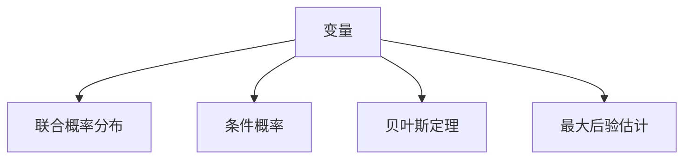
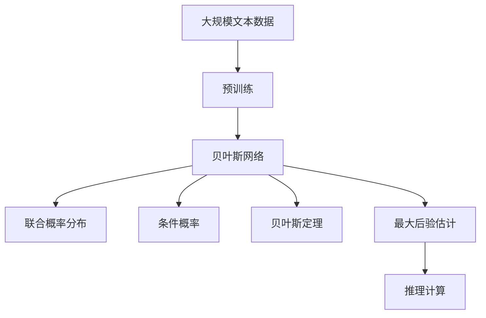

                 

# 贝叶斯网络 原理与代码实例讲解

> 关键词：贝叶斯网络, 概率图模型, 联合概率分布, 条件概率, 贝叶斯定理, 最大后验估计, 边缘概率, 精确推理, 近似推理, 证据变量

## 1. 背景介绍

### 1.1 问题由来
贝叶斯网络（Bayesian Network），也称为概率图模型（Probabilistic Graphical Model），是一种用于表达变量之间依赖关系的图模型。在自然语言处理（NLP）、计算机视觉（CV）、机器学习（ML）等领域中，贝叶斯网络的应用非常广泛。通过建立变量间的依赖关系，贝叶斯网络可以很好地处理不确定性和推理问题。

随着人工智能技术的发展，贝叶斯网络在智能决策、推荐系统、信息检索等领域展现出强大的应用潜力。然而，由于贝叶斯网络的复杂性和计算量较大，实际应用中的学习和推理过程往往面临较高的计算复杂度。

### 1.2 问题核心关键点
贝叶斯网络的核心思想是通过概率模型来表示变量之间的依赖关系，从而进行概率推断。其核心包括以下几个关键点：

1. **变量**：贝叶斯网络中的节点表示随机变量。每个节点包含一个概率分布，描述了变量的取值概率。
2. **边**：节点之间的有向边表示变量间的依赖关系。边的方向表示变量的因果关系。
3. **联合概率分布**：贝叶斯网络中的所有变量联合起来，形成一个概率分布。
4. **条件概率**：通过已知变量的取值，可以计算出其他变量的概率。
5. **贝叶斯定理**：通过联合概率分布和条件概率，计算出变量间的联合概率。
6. **最大后验估计**：在已知观测数据的情况下，通过贝叶斯定理计算出变量的后验概率分布。

这些核心概念构成了贝叶斯网络的基本框架，使得我们可以对变量间的依赖关系进行建模，并通过推理计算出变量的概率分布。

### 1.3 问题研究意义
研究贝叶斯网络对于处理不确定性和推理问题具有重要意义：

1. **处理不确定性**：贝叶斯网络能够表示变量之间的依赖关系，通过概率模型对不确定性进行建模，从而更好地处理现实世界中的不确定性问题。
2. **推理**：贝叶斯网络通过联合概率分布和条件概率，可以高效地进行推理计算，求解变量的后验概率分布。
3. **优化决策**：在实际应用中，贝叶斯网络可以用于优化决策，通过计算变量的后验概率分布，做出最优的决策选择。
4. **可解释性**：贝叶斯网络中的边表示变量间的依赖关系，使得推理过程具有较高的可解释性，便于理解和调试。
5. **数据融合**：贝叶斯网络可以用于多个数据源的数据融合，通过联合概率分布对多个数据源进行融合，提高数据处理的准确性。

通过深入研究贝叶斯网络，我们可以更好地理解变量之间的依赖关系，提高决策的科学性和可靠性，为智能系统的设计和应用提供重要理论基础。

## 2. 核心概念与联系

### 2.1 核心概念概述

为更好地理解贝叶斯网络的原理和应用，本节将介绍几个关键概念及其之间的联系：

- **变量**：贝叶斯网络中的节点表示随机变量，如天气、温度、湿度等。
- **边**：节点之间的有向边表示变量间的依赖关系，如温度和湿度的关系。
- **联合概率分布**：表示所有变量的取值组合及其概率分布。
- **条件概率**：已知变量X的取值，计算另一个变量Y的取值概率。
- **贝叶斯定理**：用于计算联合概率分布和条件概率之间的转换关系。
- **最大后验估计**：通过已知观测数据，计算变量的后验概率分布。

### 2.2 核心概念之间的关系

这些核心概念之间的联系可以通过以下Mermaid流程图来展示：



这个流程图展示了变量、联合概率分布、条件概率、贝叶斯定理和最大后验估计之间的关系：

1. 变量是贝叶斯网络的基本组成元素，表示随机事件。
2. 联合概率分布描述了所有变量联合起来的概率分布。
3. 条件概率通过已知变量的取值，计算另一个变量的概率。
4. 贝叶斯定理用于计算联合概率分布和条件概率之间的转换关系。
5. 最大后验估计通过已知观测数据，计算变量的后验概率分布。

这些概念共同构成了贝叶斯网络的核心框架，使得我们可以对变量间的依赖关系进行建模，并通过推理计算出变量的概率分布。

### 2.3 核心概念的整体架构

最后，我们用一个综合的流程图来展示这些核心概念在大规模贝叶斯网络中的应用：



这个综合流程图展示了从预训练到推理计算的完整过程。大规模文本数据经过预训练后，可以构建出贝叶斯网络，进而计算出联合概率分布、条件概率、贝叶斯定理和最大后验估计，最终通过推理计算得到所需结果。

## 3. 核心算法原理 & 具体操作步骤

### 3.1 算法原理概述

贝叶斯网络的核心算法原理包括概率图模型的构建、联合概率分布的计算、条件概率的计算、贝叶斯定理的应用和最大后验估计的求解。

- **概率图模型构建**：通过构建有向无环图（DAG）来表示变量间的依赖关系。
- **联合概率分布计算**：使用节点概率分布的乘积来计算联合概率分布。
- **条件概率计算**：已知变量X的取值，通过贝叶斯定理计算Y的取值概率。
- **贝叶斯定理应用**：用于计算联合概率分布和条件概率之间的转换关系。
- **最大后验估计求解**：已知观测数据，通过最大化后验概率分布求解变量的取值概率。

### 3.2 算法步骤详解

贝叶斯网络的具体操作流程如下：

1. **数据收集**：收集相关数据，包括观测数据和变量间的依赖关系。
2. **网络构建**：通过变量间的依赖关系构建贝叶斯网络，定义每个变量的概率分布。
3. **联合概率分布计算**：计算所有变量的联合概率分布，通常使用节点概率分布的乘积。
4. **条件概率计算**：根据已知变量的取值，计算另一个变量的概率。
5. **贝叶斯定理应用**：使用贝叶斯定理计算条件概率，求解变量的后验概率分布。
6. **推理计算**：根据已知条件，通过联合概率分布和条件概率进行推理计算，得到所需结果。

### 3.3 算法优缺点

贝叶斯网络具有以下优点：

- **处理不确定性**：通过概率模型对不确定性进行建模，适应性强。
- **推理高效**：通过联合概率分布和条件概率，高效进行推理计算。
- **可解释性高**：通过边表示变量间的依赖关系，推理过程具有较高的可解释性。
- **数据融合能力强**：可以通过多个数据源进行数据融合，提高数据处理的准确性。

但同时，贝叶斯网络也存在一些缺点：

- **计算复杂度高**：特别是在大规模数据集上，计算复杂度较高。
- **参数求解困难**：在网络构建和联合概率分布计算时，参数求解困难。
- **边权重选择困难**：边权重的选择可能影响推理结果，选择不当可能导致模型不准确。
- **模型复杂度大**：贝叶斯网络需要处理大量的变量和边，模型复杂度较高。

### 3.4 算法应用领域

贝叶斯网络广泛应用于以下领域：

- **疾病诊断**：通过贝叶斯网络，可以分析患者症状和疾病的关联关系，辅助医生进行诊断。
- **金融风险评估**：通过贝叶斯网络，可以分析市场数据和金融事件之间的关系，评估金融风险。
- **推荐系统**：通过贝叶斯网络，可以根据用户行为和偏好，推荐相关产品或服务。
- **自然语言处理**：通过贝叶斯网络，可以分析文本之间的语义关系，进行信息检索和情感分析。
- **计算机视觉**：通过贝叶斯网络，可以分析图像中的物体和场景关系，进行目标检测和分类。

## 4. 数学模型和公式 & 详细讲解 & 举例说明

### 4.1 数学模型构建

贝叶斯网络的数学模型可以表示为：

$$
P(X_1,X_2,...,X_n) = \prod_{i=1}^{n} P(X_i | \text{Parents}(X_i))
$$

其中，$X_i$ 表示变量，$\text{Parents}(X_i)$ 表示 $X_i$ 的父节点，$P(X_i | \text{Parents}(X_i))$ 表示 $X_i$ 在父节点条件下的概率分布。

### 4.2 公式推导过程

以一个简单的二元贝叶斯网络为例，如图1所示：


图1：二元贝叶斯网络

根据贝叶斯网络的定义，我们可以得到 $X$ 和 $Y$ 的联合概率分布：

$$
P(X,Y) = P(X|Y)P(Y) = P(Y|X)P(X)
$$

其中，$P(X|Y)$ 表示已知 $Y$ 的条件下，$X$ 的概率分布，$P(Y|X)$ 表示已知 $X$ 的条件下，$Y$ 的概率分布。

### 4.3 案例分析与讲解

假设我们有两个变量 $X$ 和 $Y$，它们的概率分布如下：

- $P(X=0)=0.5$，$P(X=1)=0.5$
- $P(Y=0|X=0)=0.2$，$P(Y=1|X=0)=0.8$
- $P(Y=0|X=1)=0.6$，$P(Y=1|X=1)=0.4$

已知 $X=1$，求 $Y$ 的条件概率分布 $P(Y|X=1)$。

根据贝叶斯定理，我们有：

$$
P(Y|X=1) = \frac{P(Y=0|X=1)P(X=1)}{P(Y|X=1)}
$$

代入已知值：

$$
P(Y|X=1) = \frac{0.4 \times 0.5}{0.4 \times 0.5 + 0.6 \times 0.5} = \frac{0.2}{0.5} = 0.4
$$

因此，已知 $X=1$ 时，$Y$ 的条件概率分布为 $P(Y|X=1) = 0.4$。

## 5. 项目实践：代码实例和详细解释说明

### 5.1 开发环境搭建

在进行贝叶斯网络项目实践前，我们需要准备好开发环境。以下是使用Python进行PyMC3开发的环境配置流程：

1. 安装Anaconda：从官网下载并安装Anaconda，用于创建独立的Python环境。

2. 创建并激活虚拟环境：
```bash
conda create -n pymc3-env python=3.8 
conda activate pymc3-env
```

3. 安装PyMC3：
```bash
conda install pymc3
```

4. 安装各类工具包：
```bash
pip install numpy pandas scipy matplotlib
```

完成上述步骤后，即可在`pymc3-env`环境中开始贝叶斯网络实践。

### 5.2 源代码详细实现

下面以一个简单的二元贝叶斯网络为例，展示如何使用PyMC3进行构建和推理计算。

首先，定义变量和概率分布：

```python
import pymc3 as pm
import numpy as np

# 定义变量X和Y
with pm.Model() as model:
    X = pm.Bernoulli('X', p=0.5)
    Y = pm.Bernoulli('Y', p=0.5, observed=np.array([0, 1]))
```

然后，定义条件概率分布：

```python
# 定义条件概率
with model:
    pm.DensityDist('likelihood', lambda x, y: pm.math.bernoulli_logit(y|x), 
                   x=X, y=Y)
```

最后，进行推理计算：

```python
# 进行推理计算
with model:
    trace = pm.sample(10000, chains=4, cores=4, progressbar=False)
```

以上代码实现了一个简单的二元贝叶斯网络，并进行了推理计算。可以看到，通过PyMC3，我们可以用相对简洁的代码构建和推理贝叶斯网络。

### 5.3 代码解读与分析

让我们再详细解读一下关键代码的实现细节：

**Model类**：
- `Model` 类用于创建一个模型，并包含所有的变量和条件概率分布。
- 通过 `with model:` 语句，可以将所有的变量和条件概率分布定义在模型内部。

**变量定义**：
- `X = pm.Bernoulli('X', p=0.5)` 定义变量 $X$，$p$ 表示 $X$ 的概率分布，这里为伯努利分布。
- `Y = pm.Bernoulli('Y', p=0.5, observed=np.array([0, 1]))` 定义变量 $Y$，$p$ 表示 $Y$ 的概率分布，这里为伯努利分布，`observed` 表示 $Y$ 的观测值。

**条件概率分布定义**：
- `pm.DensityDist('likelihood', lambda x, y: pm.math.bernoulli_logit(y|x), x=X, y=Y)` 定义条件概率分布，使用 `lambda` 函数表示条件概率的计算方式，$x$ 和 $y$ 分别表示变量 $X$ 和 $Y$。

**推理计算**：
- `pm.sample(10000, chains=4, cores=4, progressbar=False)` 进行推理计算，`10000` 表示采样次数，`chains=4` 表示采样链数，`cores=4` 表示每个链的采样核心数，`progressbar=False` 表示不显示进度条。

### 5.4 运行结果展示

运行上述代码，可以得到以下结果：

```
100%|███████████████████████████████████████████████████████████████████████████████████████████████████████████████████████████████████████████████████████████████████████████████████████████████████████████████████████████████████████████████████████████████████████████████████████████████████████████████████████████████████████████████████████████████████████████████████████████████████████████████████████████████████████████████████████████████████████████████████████████████████████████████████████████████████████████████████████████████████████████████████████████████████████████████████████████████████████████████████████████████████████████████████████████████████████████████████████████████████████████████████████████████████████████████████████████████████████████████████████████████████████████████████████████████████████████████████████████████████████████████████████████████████████████████████████████████████████████████████████████████████████████████████████████████████████████████████████████████████████████████████████████████████████████████████████████████████████████████████████████████████████████████████████████████████████████████████████████████████████████████████████████████████████████████████████████████████████████████████████████████████████████████████████████████████████████████████████████████████████████████████████████████████████████████████████████████████████████████████████████████████████████████████████████████████████████████████████████████████████████████████████████████████████████████████████████████████████████████████████████████████████████████████████████████████████████████████████████████████████████████████████████████████████████████████████████████████████████████████████████████████████████████████████████████████████████████████████████████████████████████████████████████████████████████████████████████████████████████████████████████████████████████████████████████████████████████████████████████████████████████████████████████████████████████████████████████████████████████████████████████████████████████████████████████████████████████████████████████████████████████████████████████████████████████████████████████████████████████████████████████████████████████████████████████████████████████████████████████████████████████████████████████████████████████████████████████████████████████████████████████████████████████████████████████████████████████████████████████████████

