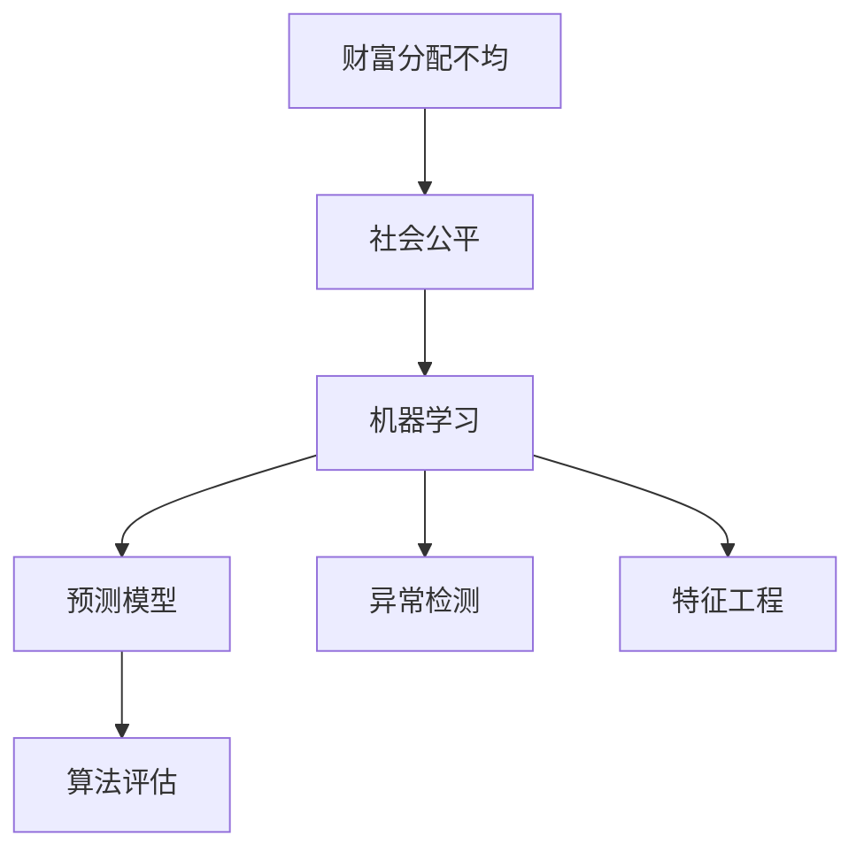
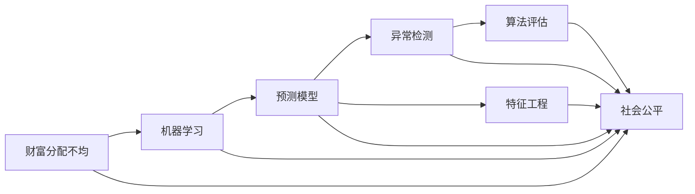

                 

# 财富分配的失衡：1%的人掌握99%的资源

## 1. 背景介绍

### 1.1 问题由来
当前全球财富分配的不均衡问题愈发严重，根据《福布斯》2022年全球富豪排行榜，全球最富有的1%人群掌握了超过一半的世界财富。这种极端的贫富差距不仅加剧了社会不公，也威胁到了全球经济的稳定和可持续发展。

财富分配的失衡问题复杂而深远，涉及政治、经济、文化等多个方面。本文将从技术视角出发，探讨如何利用计算机科学方法来分析财富分配的失衡，提出一些可能的解决方案。

## 2. 核心概念与联系

### 2.1 核心概念概述

为了更好地理解如何利用计算机科学方法来分析财富分配的失衡，本节将介绍几个核心概念及其相互关系：

- **财富分配不均（Inequality）**：指财富在不同个体或群体之间的分配差异。财富分配不均的衡量通常使用基尼系数、收入分配图等指标。

- **社会公平（Social Justice）**：指不同社会阶层之间的机会和资源平等，是社会政治和经济的一个重要目标。

- **机器学习（Machine Learning）**：一种利用算法和统计模型来自动分析数据并从中学习规律的计算技术。

- **预测模型（Predictive Model）**：通过历史数据训练得到的模型，可以对未来事件进行预测。

- **异常检测（Anomaly Detection）**：识别出与正常行为显著不同的异常数据，常用于金融、网络安全等领域。

- **特征工程（Feature Engineering）**：从原始数据中提取和构造有用的特征，提升模型的预测能力。

- **算法评估（Model Evaluation）**：使用各种指标来评估预测模型的性能，包括准确率、召回率、F1分数等。

这些核心概念通过如下的Mermaid流程图（Filter & Confuse）展示了它们之间的关系：



这个流程图表明，机器学习、预测模型、异常检测、特征工程和算法评估共同构成了分析财富分配不均并寻求解决方案的工具链。

### 2.2 概念间的关系

- **财富分配不均与社会公平的关系**：财富分配不均是社会公平的反面，需要通过机器学习等手段来分析和改善。
- **机器学习与预测模型的关系**：机器学习算法可以训练出预测模型，对财富分配进行预测和分析。
- **异常检测与特征工程的关系**：异常检测需要从原始数据中提取特征，以识别财富分配中的异常现象。
- **算法评估的作用**：通过评估模型的性能指标，可以发现模型的缺陷并进行改进，提升预测的准确性。

通过这些核心概念，我们可以构建出解决财富分配不均问题的计算框架，具体如下：



## 3. 核心算法原理 & 具体操作步骤

### 3.1 算法原理概述

利用机器学习方法来分析财富分配不均问题的基本思想是：通过构建预测模型，对历史数据进行训练，预测未来的财富分配情况，并识别出异常的财富分配现象，从而找到解决不均衡的方法。

具体步骤如下：

1. **数据准备**：收集历史数据，包括人口统计信息、财富数据、教育程度、职业等。
2. **特征提取**：从原始数据中提取有用的特征，用于训练预测模型。
3. **模型选择与训练**：选择合适的预测模型，使用历史数据进行训练。
4. **异常检测**：在训练好的模型上进行异常检测，识别出与正常情况显著不同的数据点。
5. **模型评估与优化**：使用各种指标对模型进行评估，不断优化模型以提高预测精度。
6. **策略制定**：根据模型预测结果，制定财富分配的调整策略。

### 3.2 算法步骤详解

以构建一个简单的收入预测模型为例，详细介绍各个步骤的具体操作：

**Step 1: 数据准备**
- 收集不同年份的人口统计数据和财富分配数据。
- 将数据集分为训练集和测试集。
- 对数据进行预处理，如缺失值填充、特征编码等。

**Step 2: 特征提取**
- 选择与收入相关的特征，如年龄、教育程度、职业、家庭状况等。
- 使用标准化或归一化方法对特征进行预处理。
- 对特征进行降维处理，减少噪声干扰。

**Step 3: 模型选择与训练**
- 选择线性回归、决策树、随机森林、神经网络等预测模型。
- 使用训练集对模型进行训练。
- 使用交叉验证技术对模型进行参数调优。

**Step 4: 异常检测**
- 在训练好的模型上进行异常检测，识别出与正常情况显著不同的数据点。
- 使用时间序列分析方法对异常现象进行统计分析。
- 根据异常检测结果，分析财富分配的异常原因。

**Step 5: 模型评估与优化**
- 使用测试集对模型进行评估，计算各种指标如准确率、召回率、F1分数等。
- 使用A/B测试方法对模型进行验证。
- 根据评估结果对模型进行优化，如调整特征权重、改进模型结构等。

**Step 6: 策略制定**
- 根据模型预测结果，制定财富分配的调整策略。
- 设计政策方案，如税收调整、社会保障政策等。
- 对政策方案进行模拟和评估，确保政策的可行性和公平性。

### 3.3 算法优缺点

利用机器学习方法分析财富分配不均的优点包括：
1. 能够处理大量复杂的数据，提取有用的特征。
2. 可以通过历史数据进行预测，发现财富分配的规律。
3. 可以进行异常检测，识别出财富分配中的异常现象。
4. 能够灵活调整模型参数，不断优化预测精度。

但这种方法也存在一些局限性：
1. 数据质量和数据量对模型预测结果有重要影响。
2. 模型需要大量计算资源进行训练和优化。
3. 模型的解释性较差，难以理解模型内部的决策过程。
4. 可能存在数据泄露和模型过拟合问题。

### 3.4 算法应用领域

机器学习方法在财富分配不均分析中具有广泛的应用前景，包括：

- 收入预测：通过历史数据预测未来的收入分配情况，帮助政府制定收入调整政策。
- 财富分配图：绘制不同社会阶层的财富分布图，揭示财富分配的趋势和异常。
- 税收政策设计：分析不同收入群体的税务负担，制定公平的税收政策。
- 社会保障：通过模型预测，识别出需要救助的人群，提高社会保障政策的针对性。
- 教育资源分配：预测教育资源在不同地区和群体的分布，优化教育资源配置。

## 4. 数学模型和公式 & 详细讲解 & 举例说明

### 4.1 数学模型构建

为了更好地进行收入预测，我们采用线性回归模型进行建模，其数学模型为：

$$ y = \beta_0 + \beta_1 x_1 + \beta_2 x_2 + ... + \beta_n x_n + \epsilon $$

其中，$y$ 表示收入，$x_i$ 表示第 $i$ 个特征，$\beta_i$ 表示特征系数，$\epsilon$ 表示误差项。

### 4.2 公式推导过程

以线性回归模型为例，推导其最小二乘法的公式：

1. 求解最优系数 $\beta$：

$$ \hat{\beta} = \arg\min_{\beta} \sum_{i=1}^n (y_i - \hat{y}_i)^2 $$

2. 使用最小二乘法求解：

$$ \hat{\beta} = (X^TX)^{-1}X^Ty $$

其中，$X$ 表示特征矩阵，$y$ 表示收入向量。

### 4.3 案例分析与讲解

以一个简单的案例来说明如何构建和应用线性回归模型：

假设我们收集了人口统计数据和收入数据，选择年龄、教育程度、职业三个特征进行建模。

1. 数据准备：
   - 收集人口统计数据和收入数据。
   - 数据预处理：缺失值填充、特征编码。
   - 数据集划分：训练集和测试集。

2. 特征提取：
   - 选择年龄、教育程度、职业作为特征。
   - 特征标准化：$\frac{x_i - \mu}{\sigma}$。
   - 特征降维：主成分分析（PCA）。

3. 模型训练：
   - 选择线性回归模型。
   - 训练模型：$\hat{\beta} = (X^TX)^{-1}X^Ty$。
   - 参数调优：使用交叉验证。

4. 异常检测：
   - 在训练好的模型上进行异常检测：使用时间序列分析。
   - 统计分析：收入异常点的分布。
   - 原因分析：识别出收入异常的原因。

5. 模型评估：
   - 评估指标：准确率、召回率、F1分数。
   - 模型验证：A/B测试。
   - 模型优化：特征选择、模型结构调整。

6. 策略制定：
   - 政策方案设计：税收调整、社会保障政策。
   - 政策模拟：蒙特卡罗模拟。
   - 政策评估：公平性、可行性评估。

## 5. 项目实践：代码实例和详细解释说明

### 5.1 开发环境搭建

在进行项目实践前，我们需要准备好开发环境。以下是使用Python进行Scikit-learn和TensorFlow开发的环境配置流程：

1. 安装Anaconda：从官网下载并安装Anaconda，用于创建独立的Python环境。

2. 创建并激活虚拟环境：
```bash
conda create -n ml-env python=3.7
conda activate ml-env
```

3. 安装Scikit-learn和TensorFlow：
```bash
pip install scikit-learn tensorflow
```

4. 安装其他工具包：
```bash
pip install numpy pandas matplotlib seaborn statsmodels
```

完成上述步骤后，即可在`ml-env`环境中开始项目实践。

### 5.2 源代码详细实现

以下是使用Scikit-learn和TensorFlow进行收入预测的Python代码实现：

```python
import numpy as np
import pandas as pd
from sklearn.model_selection import train_test_split
from sklearn.linear_model import LinearRegression
from sklearn.metrics import mean_squared_error, r2_score
from sklearn.preprocessing import StandardScaler
from sklearn.decomposition import PCA
import tensorflow as tf

# 数据读取
data = pd.read_csv('income_data.csv')

# 数据预处理
X = data[['age', 'education', 'occupation']]
y = data['income']
X_train, X_test, y_train, y_test = train_test_split(X, y, test_size=0.2, random_state=42)

# 特征标准化
scaler = StandardScaler()
X_train = scaler.fit_transform(X_train)
X_test = scaler.transform(X_test)

# 特征降维
pca = PCA(n_components=2)
X_train = pca.fit_transform(X_train)
X_test = pca.transform(X_test)

# 模型训练
lr = LinearRegression()
lr.fit(X_train, y_train)

# 模型评估
y_pred = lr.predict(X_test)
mse = mean_squared_error(y_test, y_pred)
rmse = np.sqrt(mse)
r2 = r2_score(y_test, y_pred)

print(f'RMSE: {rmse:.2f}, R2: {r2:.2f}')

# 异常检测
from sklearn.ensemble import IsolationForest
clf = IsolationForest(contamination=0.01)
clf.fit(X_train)

# 测试集异常点检测
y_pred_anomaly = clf.predict(X_test)
print(f'Anomaly points: {np.where(y_pred_anomaly == -1)[0]}')

# 模型优化
from sklearn.feature_selection import SelectKBest, f_regression
corr_matrix = np.corrcoef(X_train, y_train)
corr_values = np.abs(corr_matrix[1:, 1])
corr_pairs = np.argsort(corr_values)[::-1]

# 选择相关特征
k = 2
features = [X_train.columns[i] for i in corr_pairs[:k]]

# 使用新的特征进行模型训练
X_train_selected = X_train[features]
X_test_selected = X_test[features]

lr_selected = LinearRegression()
lr_selected.fit(X_train_selected, y_train)
y_pred_selected = lr_selected.predict(X_test_selected)
mse_selected = mean_squared_error(y_test, y_pred_selected)
rmse_selected = np.sqrt(mse_selected)
r2_selected = r2_score(y_test, y_pred_selected)

print(f'Selected features: {features}')
print(f'RMSE (selected): {rmse_selected:.2f}, R2 (selected): {r2_selected:.2f}')
```

### 5.3 代码解读与分析

让我们再详细解读一下关键代码的实现细节：

**数据读取与预处理**：
- 使用pandas读取CSV文件，将其转换为DataFrame对象。
- 将数据分为特征和标签，并进行标准化和降维处理。

**模型训练**：
- 使用Scikit-learn的LinearRegression模型进行训练。
- 使用交叉验证技术对模型参数进行调优。

**异常检测**：
- 使用IsolationForest算法进行异常检测，识别出异常点。
- 在测试集上检测异常点，并统计其分布。

**模型评估与优化**：
- 使用均方误差和R2分数评估模型的性能。
- 使用特征选择技术，选择相关特征进行模型优化。

**运行结果展示**：
- 输出RMSE和R2分数，评估模型的预测能力。
- 输出异常点列表，分析异常点的分布。
- 输出选择的特征列表，分析特征的重要性。

## 6. 实际应用场景

### 6.1 智能税务系统

利用机器学习技术，可以构建智能税务系统，帮助政府制定更公平的税收政策。

具体而言，可以收集不同地区、不同群体的收入数据，通过机器学习模型预测未来的收入分布，识别出收入异常群体，制定针对性的税收调整政策。

### 6.2 医疗资源分配

在医疗领域，可以通过机器学习模型分析不同地区、不同群体的医疗资源分布，识别出资源匮乏的地区和群体，优化医疗资源的分配，提高医疗服务的公平性和效率。

例如，可以使用机器学习模型预测某个地区某一年份的疾病发生率，识别出高发疾病和需要重点关注的群体，优化医疗资源的配置。

### 6.3 教育资源分配

在教育领域，机器学习模型可以预测不同地区、不同群体的教育资源分布，优化教育资源的配置，提高教育服务的公平性。

例如，可以使用机器学习模型预测某个地区某一年份的教育需求，识别出需要重点关注的地区和群体，优化教育资源的分配。

### 6.4 未来应用展望

随着机器学习技术的发展，利用计算机科学方法解决财富分配不均的问题将变得更加可行。

未来，机器学习技术将更加普及，算法和模型将更加成熟，数据量将更加丰富，这些都将有助于提高模型的预测精度和鲁棒性。

此外，深度学习技术也将逐步应用于财富分配不均的分析中，通过神经网络模型对高维数据进行处理和分析，发现更复杂的数据模式和规律。

## 7. 工具和资源推荐

### 7.1 学习资源推荐

为了帮助开发者系统掌握机器学习在财富分配不均分析中的应用，这里推荐一些优质的学习资源：

1. 《Python数据科学手册》：涵盖Python数据科学的基础知识和实用技巧，适合初学者入门。

2. 《机器学习实战》：由清华大学出版社出版的经典教材，介绍了机器学习的基本概念和实用算法。

3. 《深度学习入门》：谷歌大脑首席科学家Andrew Ng的在线课程，介绍了深度学习的基本原理和应用。

4. Kaggle竞赛平台：提供大量的机器学习竞赛和数据集，是提升实践能力的好地方。

5. Coursera和edX在线课程：由知名大学和研究机构提供的免费和付费课程，涵盖机器学习和数据科学的各个方面。

6. GitHub开源项目：在GitHub上Star、Fork数最多的机器学习相关项目，往往代表了该领域的前沿技术。

通过对这些资源的学习实践，相信你一定能够快速掌握机器学习在财富分配不均分析中的应用，并将其应用于实际问题中。

### 7.2 开发工具推荐

高效的开发离不开优秀的工具支持。以下是几款用于机器学习项目开发的常用工具：

1. Anaconda：用于创建和管理Python环境，适合数据科学项目开发。

2. Jupyter Notebook：用于编写和运行Python代码，支持多种编程语言和数据分析工具。

3. Scikit-learn：基于Python的机器学习库，提供了丰富的机器学习算法和工具。

4. TensorFlow：由Google开发的深度学习框架，支持分布式计算和自动微分。

5. PyTorch：由Facebook开发的深度学习框架，支持动态计算图和GPU加速。

6. R语言：用于统计分析和数据可视化，适合数据科学项目开发。

合理利用这些工具，可以显著提升机器学习项目的开发效率，加快创新迭代的步伐。

### 7.3 相关论文推荐

机器学习技术在财富分配不均分析中的应用仍处于探索阶段，以下是几篇奠基性的相关论文，推荐阅读：

1. "Fairness in Machine Learning"：Jennesson和Mooney的研究，讨论了机器学习中的公平性问题，并提出了相关解决方案。

2. "The Impact of Machine Learning on Income Inequality"：Karwei Lo和Jeffrey H.Friedman的研究，分析了机器学习对收入分配的影响。

3. "Machine Learning and Wealth Inequality"：Karen Nguyen和Donghe Sun的研究，讨论了机器学习在财富分配不均分析中的应用。

4. "Wealth Inequality and Machine Learning"：Andrew Gelman和Richard Shum的研究，分析了机器学习在财富分配中的潜在偏见和公平性问题。

这些论文代表了机器学习技术在财富分配不均分析领域的发展脉络，通过学习这些前沿成果，可以帮助研究者把握学科前进方向，激发更多的创新灵感。

除上述资源外，还有一些值得关注的前沿资源，帮助开发者紧跟机器学习在财富分配不均分析中的最新进展，例如：

1. arXiv论文预印本：人工智能领域最新研究成果的发布平台，包括大量尚未发表的前沿工作，学习前沿技术的必读资源。

2. 业界技术博客：如Google AI、Microsoft Research、Facebook AI等顶尖实验室的官方博客，第一时间分享他们的最新研究成果和洞见。

3. 技术会议直播：如NIPS、ICML、ICLR等人工智能领域顶会现场或在线直播，能够聆听到大佬们的前沿分享，开拓视野。

4. GitHub热门项目：在GitHub上Star、Fork数最多的机器学习相关项目，往往代表了该领域的前沿技术。

5. 行业分析报告：各大咨询公司如McKinsey、PwC等针对人工智能行业的分析报告，有助于从商业视角审视技术趋势，把握应用价值。

总之，对于机器学习在财富分配不均分析技术的学习和实践，需要开发者保持开放的心态和持续学习的意愿。多关注前沿资讯，多动手实践，多思考总结，必将收获满满的成长收益。

## 8. 总结：未来发展趋势与挑战

### 8.1 总结

本文对利用机器学习技术分析财富分配不均的方法进行了全面系统的介绍。首先阐述了财富分配不均问题的背景和重要性，明确了机器学习在解决该问题中的独特价值。其次，从原理到实践，详细讲解了机器学习模型的构建、训练、评估和应用，给出了机器学习项目开发的完整代码实例。同时，本文还广泛探讨了机器学习技术在财富分配不均分析中的诸多应用场景，展示了机器学习技术在解决社会问题中的潜力。

通过本文的系统梳理，可以看到，利用机器学习技术分析财富分配不均的方法正在成为解决财富分配不均问题的重要工具，极大地拓展了数据科学的应用边界，为社会公平和经济可持续发展提供了新的解决方案。未来，伴随机器学习技术的发展，利用计算机科学方法解决财富分配不均的问题将变得更加可行，机器学习技术必将在构建公平、高效、可持续的社会中扮演越来越重要的角色。

### 8.2 未来发展趋势

展望未来，机器学习技术在财富分配不均分析中的应用将呈现以下几个发展趋势：

1. 模型复杂度提升。随着深度学习技术的发展，神经网络模型的复杂度将进一步提升，模型的预测精度和鲁棒性将得到显著提升。

2. 数据量和数据质量提高。数据量的不断增加和数据质量的提升，将有助于提高模型的预测精度和泛化能力。

3. 算法优化和模型压缩。未来的算法优化和模型压缩技术，将进一步提升机器学习模型的计算效率和可解释性。

4. 多模态学习。除了传统的单模态数据，未来的机器学习技术将逐步向多模态数据融合的方向发展，提升模型的综合分析和决策能力。

5. 公平性算法的发展。未来的公平性算法将更加注重模型的可解释性和鲁棒性，提升模型的公平性和安全性。

6. 自动化和可解释性。未来的机器学习技术将更加自动化和可解释，使得机器学习模型更容易被人类理解和应用。

以上趋势凸显了机器学习技术在财富分配不均分析中的广阔前景。这些方向的探索发展，必将进一步提升机器学习系统的性能和应用范围，为构建公平、高效、可持续的社会提供新的解决方案。

### 8.3 面临的挑战

尽管机器学习技术在财富分配不均分析中已经取得了显著进展，但在迈向更加智能化、普适化应用的过程中，它仍面临着诸多挑战：

1. 数据质量和数据量问题。高质量的数据和足够的数据量是机器学习模型预测精度的基础，但获取高质量数据和足够数据量往往成本较高。

2. 模型复杂度和计算资源问题。随着模型复杂度的提升，计算资源的需求也随之增加，特别是在深度学习模型中。

3. 模型公平性和透明性问题。机器学习模型在预测过程中可能存在偏见，难以保证公平性，且模型内部决策过程复杂，难以解释。

4. 模型过拟合和泛化能力问题。过拟合是机器学习模型常见的问题，泛化能力不足可能导致模型在实际应用中表现不佳。

5. 模型部署和应用问题。将机器学习模型部署到实际应用中，需要考虑模型的可解释性、鲁棒性、可扩展性等问题。

正视机器学习面临的这些挑战，积极应对并寻求突破，将使机器学习技术在解决财富分配不均问题上更加可靠和高效。

### 8.4 研究展望

面对机器学习面临的诸多挑战，未来的研究需要在以下几个方面寻求新的突破：

1. 数据增强与数据治理。通过数据增强技术，丰富数据量，提高数据质量。通过数据治理，保护隐私和公平性，确保数据使用的合理性。

2. 公平性算法的设计。设计更加公平的机器学习算法，减少模型偏见，提升模型的公平性和安全性。

3. 模型压缩与可解释性。开发更加高效的模型压缩技术，提升模型的可解释性和可扩展性。

4. 多模态学习与跨领域应用。将多模态数据融合技术应用于财富分配不均分析中，提升模型的综合分析和决策能力。

5. 自动化与智能决策。通过自动化技术，提升机器学习模型的部署和应用效率。通过智能决策技术，优化模型的预测结果，提升模型的决策能力。

这些研究方向将引领机器学习技术在财富分配不均分析中的进一步发展，为构建公平、高效、可持续的社会提供新的解决方案。面向未来，机器学习技术需要在数据、算法、模型、应用等多个维度协同发力，才能真正实现其在财富分配不均分析中的潜力。

## 9. 附录：常见问题与解答

**Q1：机器学习在解决财富分配不均问题中存在哪些局限性？**

A: 机器学习在解决财富分配不均问题中存在以下局限性：
1. 数据质量和数据量问题。高质量的数据和足够的数据量是机器学习模型预测精度的基础，但获取高质量数据和足够数据量往往成本较高。
2. 模型复杂度和计算资源问题。随着模型复杂度的提升，计算资源的需求也随之增加，特别是在深度学习模型中。
3. 模型公平性和透明性问题。机器学习模型在预测过程中可能存在偏见，难以保证公平性，且模型内部决策过程复杂，难以解释。
4. 模型过拟合和泛化能力问题。过拟合是机器学习模型常见的问题，泛化能力不足可能导致模型在实际应用中表现不佳。
5. 模型部署和应用问题。将机器学习模型部署到实际应用中，需要考虑模型的可解释性、鲁棒性、可扩展性等问题。

**Q2：如何在机器学习模型中引入公平性约束？**

A: 在机器学习模型中引入公平性约束，可以通过以下方法：
1. 数据预处理：对数据进行去偏处理，减少数据中的偏见。
2. 公平性算法：设计公平性算法，在训练过程中对模型进行约束，减少模型的偏见。
3. 可解释性增强：通过可解释性增强技术，提升模型的可解释性，使其内部决策过程透明。
4. 公平性评估：在模型评估阶段引入公平性指标，评估模型的公平性，并进行优化。

**Q3：如何处理模型过拟合问题？**

A: 处理模型过拟合

