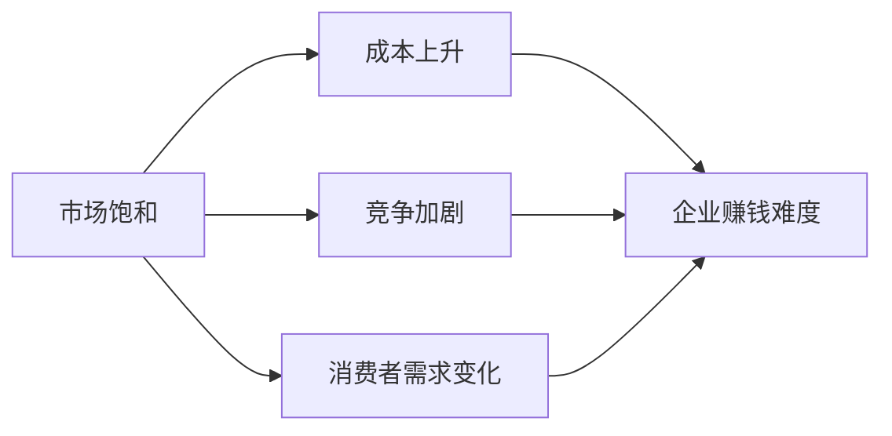
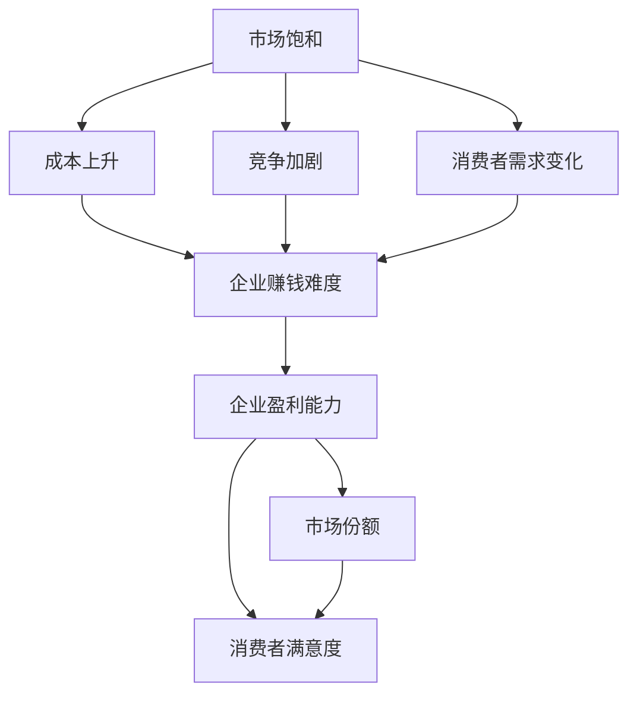

                 

# 赚钱越来越难：商业繁荣的必然结果

## 1. 背景介绍

### 1.1 问题由来
随着经济的快速发展，商业竞争日益激烈，传统商业模式已经无法满足市场的需求。消费者需求日益多样化、个性化，供给端也必须随之不断创新以适应市场的变化。然而，受限于高昂的运营成本和市场竞争压力，许多企业难以维持稳定的利润增长。

面对这一问题，本文将深入探讨商业繁荣与赚钱难度的关系，揭示其背后的内在逻辑，并为企业家提供一些可行的策略。

### 1.2 问题核心关键点
商业繁荣与赚钱难度之间的关系，本质上是供需关系的一种表现形式。在商业繁荣时期，市场需求旺盛，竞争相对激烈，企业需不断创新以争夺市场份额。然而，随着市场的饱和，资源和成本的上升，企业的利润空间被不断压缩，导致赚钱难度增大。

要理解这一问题，我们需要从市场供给、需求、竞争等多角度进行分析。本文将重点探讨市场饱和、成本上升、消费者需求变化等因素对企业赚钱能力的影响，并提出应对策略。

## 2. 核心概念与联系

### 2.1 核心概念概述
为了更好地理解商业繁荣与赚钱难度的关系，我们将介绍一些关键概念：

- 市场饱和（Market Saturation）：指市场上商品或服务的供应超过了消费者的需求，导致价格下降和利润空间压缩。
- 成本上升（Cost Increase）：指企业在生产、运营、营销等方面的成本不断提高，侵蚀利润。
- 消费者需求变化（Consumer Demand Changes）：指消费者需求从基本生存需求向更高层次的需求转变，如个性化、高品质、即时性等。
- 竞争加剧（Increased Competition）：指市场上新进入者增多，老企业需不断提升竞争力以保持市场份额。

这些概念之间存在密切联系，市场饱和导致成本上升和竞争加剧，而消费者需求变化则进一步推动了市场饱和和成本上升。

### 2.2 概念间的关系

市场饱和、成本上升、消费者需求变化和竞争加剧之间相互影响，共同作用于企业赚钱能力。以下是一个简单的Mermaid流程图，展示这些概念之间的关系：



市场饱和使得企业需要承担更高的成本来获取市场份额，竞争加剧使得企业不得不投入更多的资源来提升自身竞争力，消费者需求变化要求企业不断创新以满足消费者新的需求。这些因素共同作用，导致企业赚钱难度不断增大。

### 2.3 核心概念的整体架构

我们将通过一个综合的流程图来展示这些核心概念之间的关系及其对企业赚钱能力的影响：



市场饱和导致成本上升和竞争加剧，使得企业盈利能力下降，市场份额减少，消费者满意度降低。企业需不断创新，提升自身竞争力，以满足市场变化和消费者需求。

## 3. 核心算法原理 & 具体操作步骤

### 3.1 算法原理概述
本文将探讨市场饱和、成本上升、消费者需求变化等因素对企业赚钱能力的影响，并提出一些应对策略。我们将重点关注以下几个方面的算法原理：

1. **市场饱和与成本上升的数学模型**：通过构建市场供需模型，分析市场饱和对成本上升的影响。
2. **消费者需求变化与竞争加剧的关系**：通过分析消费者需求变化和竞争加剧的动态关系，揭示其对企业赚钱能力的影响。
3. **企业应对策略的算法原理**：探讨企业如何通过创新和资源优化策略，提升自身盈利能力。

### 3.2 算法步骤详解

#### 3.2.1 市场饱和与成本上升的数学模型

市场饱和模型可以通过以下数学公式来描述：

$$
\text{Market Saturation} = \frac{\text{Total Supply}}{\text{Total Demand}}
$$

当市场饱和时，供应等于需求，市场价格稳定。如果供应过剩，市场价格将下降，导致企业利润减少。成本上升模型可以通过以下公式来描述：

$$
\text{Cost Increase} = \text{Base Cost} + \text{Cost of Saturation}
$$

其中，$\text{Base Cost}$ 是企业的固定成本，$\text{Cost of Saturation}$ 是市场饱和导致的额外成本。

#### 3.2.2 消费者需求变化与竞争加剧的关系

消费者需求变化可以通过以下数学公式来描述：

$$
\text{Consumer Demand Changes} = \text{Base Demand} + \text{Demand Change}
$$

其中，$\text{Base Demand}$ 是基本需求，$\text{Demand Change}$ 是需求变化。

竞争加剧可以通过以下公式来描述：

$$
\text{Increased Competition} = \text{Base Competition} + \text{Competition Change}
$$

其中，$\text{Base Competition}$ 是基本竞争水平，$\text{Competition Change}$ 是竞争变化。

#### 3.2.3 企业应对策略的算法原理

企业可以通过以下算法步骤来应对市场饱和、成本上升和竞争加剧：

1. **市场需求分析**：分析市场需求变化趋势，识别消费者的新需求，以指导产品创新和市场拓展。
2. **成本控制与优化**：通过精益生产、自动化、数字化转型等手段，降低生产成本，优化运营效率。
3. **创新与技术升级**：持续投入研发，引入新技术和新产品，提升产品和服务的差异化竞争优势。
4. **供应链优化**：优化供应链管理，降低采购和物流成本，提高供应链的响应速度和灵活性。
5. **市场细分与定位**：通过市场细分和精准营销，定位特定客户群体，实现市场份额的增长。

### 3.3 算法优缺点

基于市场饱和、成本上升、消费者需求变化和竞争加剧的分析，企业可以更好地理解市场变化，制定更加合理的战略。然而，这些分析也存在一些局限性：

#### 3.3.1 算法优点

1. **全面性**：通过数学模型和算法步骤，全面分析市场饱和、成本上升、消费者需求变化和竞争加剧的影响，为企业的战略决策提供科学依据。
2. **可操作性**：算法步骤详细描述了企业应对策略的实现方法，易于操作和执行。
3. **可优化性**：企业可以根据实际情况，灵活调整市场饱和、成本上升、消费者需求变化和竞争加剧的参数，优化企业的经营策略。

#### 3.3.2 算法缺点

1. **数据依赖**：算法需要大量的市场数据和成本数据，数据不准确或不全面可能导致分析结果的偏差。
2. **动态变化**：市场环境和竞争态势是动态变化的，算法可能无法及时反映最新的市场变化。
3. **复杂性**：算法涉及多个变量和参数，模型构建和分析较为复杂。

### 3.4 算法应用领域

基于市场饱和、成本上升、消费者需求变化和竞争加剧的分析方法，可以应用于多个领域：

1. **零售行业**：通过分析市场需求变化和竞争态势，指导产品创新和市场拓展，提升企业的市场份额和盈利能力。
2. **制造业**：通过优化供应链管理和生产流程，降低成本，提高生产效率，增强企业的竞争力。
3. **服务业**：通过市场细分和精准营销，定位特定客户群体，提升服务质量，提高客户满意度。
4. **金融行业**：通过分析市场饱和和消费者需求变化，指导金融产品的创新和营销策略，提升客户粘性和市场份额。

## 4. 数学模型和公式 & 详细讲解  
### 4.1 数学模型构建

为了更精确地分析市场饱和、成本上升、消费者需求变化和竞争加剧对企业赚钱能力的影响，我们将构建以下数学模型：

#### 4.1.1 市场饱和模型

$$
\text{Market Saturation} = \frac{\text{Total Supply}}{\text{Total Demand}}
$$

当市场饱和时，供应等于需求，市场价格稳定。如果供应过剩，市场价格将下降，导致企业利润减少。

#### 4.1.2 成本上升模型

$$
\text{Cost Increase} = \text{Base Cost} + \text{Cost of Saturation}
$$

其中，$\text{Base Cost}$ 是企业的固定成本，$\text{Cost of Saturation}$ 是市场饱和导致的额外成本。

#### 4.1.3 消费者需求变化模型

$$
\text{Consumer Demand Changes} = \text{Base Demand} + \text{Demand Change}
$$

其中，$\text{Base Demand}$ 是基本需求，$\text{Demand Change}$ 是需求变化。

#### 4.1.4 竞争加剧模型

$$
\text{Increased Competition} = \text{Base Competition} + \text{Competition Change}
$$

其中，$\text{Base Competition}$ 是基本竞争水平，$\text{Competition Change}$ 是竞争变化。

### 4.2 公式推导过程

#### 4.2.1 市场饱和模型推导

市场饱和模型可以表示为：

$$
\text{Market Saturation} = \frac{\text{Total Supply}}{\text{Total Demand}}
$$

其中，$\text{Total Supply}$ 是市场的总供应量，$\text{Total Demand}$ 是市场的需求量。当$\text{Market Saturation} > 1$时，市场供应过剩，导致市场价格下降，企业利润减少。

#### 4.2.2 成本上升模型推导

成本上升模型可以表示为：

$$
\text{Cost Increase} = \text{Base Cost} + \text{Cost of Saturation}
$$

其中，$\text{Base Cost}$ 是企业的固定成本，$\text{Cost of Saturation}$ 是市场饱和导致的额外成本。当市场饱和时，企业需承担更多的物流、库存、市场推广等成本。

#### 4.2.3 消费者需求变化模型推导

消费者需求变化模型可以表示为：

$$
\text{Consumer Demand Changes} = \text{Base Demand} + \text{Demand Change}
$$

其中，$\text{Base Demand}$ 是基本需求，$\text{Demand Change}$ 是需求变化。当消费者需求增加时，企业市场份额扩大，销售额提升，盈利能力增强。

#### 4.2.4 竞争加剧模型推导

竞争加剧模型可以表示为：

$$
\text{Increased Competition} = \text{Base Competition} + \text{Competition Change}
$$

其中，$\text{Base Competition}$ 是基本竞争水平，$\text{Competition Change}$ 是竞争变化。当市场竞争加剧时，企业需投入更多资源进行市场营销、产品创新等，以保持市场份额。

### 4.3 案例分析与讲解

#### 4.3.1 零售行业案例分析

零售行业是典型的市场饱和行业。以下是零售行业的市场饱和、成本上升、消费者需求变化和竞争加剧的分析：

1. **市场需求分析**：通过市场调研和消费者反馈，分析市场需求变化趋势，识别消费者的新需求，如个性化、高品质、即时性等。
2. **成本控制与优化**：采用自动化仓储、物流优化、数字化转型等手段，降低成本，提高运营效率。
3. **创新与技术升级**：引入大数据分析、人工智能、物联网等技术，提升产品和服务质量，增强企业竞争力。
4. **供应链优化**：优化供应链管理，降低采购和物流成本，提高供应链的响应速度和灵活性。
5. **市场细分与定位**：通过市场细分和精准营销，定位特定客户群体，提升市场份额和客户满意度。

#### 4.3.2 制造业案例分析

制造业是典型的成本上升行业。以下是制造业的市场饱和、成本上升、消费者需求变化和竞争加剧的分析：

1. **市场需求分析**：通过市场调研和消费者反馈，分析市场需求变化趋势，识别消费者的新需求，如环保、可持续发展等。
2. **成本控制与优化**：采用精益生产、自动化生产、数字化管理等手段，降低成本，提高生产效率。
3. **创新与技术升级**：引入新材料、新技术、新工艺，提升产品性能和品质，增强企业竞争力。
4. **供应链优化**：优化供应链管理，降低采购和物流成本，提高供应链的响应速度和灵活性。
5. **市场细分与定位**：通过市场细分和精准营销，定位特定客户群体，提升市场份额和客户满意度。

#### 4.3.3 服务业案例分析

服务业是典型的消费者需求变化行业。以下是服务业的市场饱和、成本上升、消费者需求变化和竞争加剧的分析：

1. **市场需求分析**：通过市场调研和消费者反馈，分析市场需求变化趋势，识别消费者的新需求，如高端化、个性化、即时性等。
2. **成本控制与优化**：采用数字化管理、自动化服务、人力资源优化等手段，降低成本，提高服务效率。
3. **创新与技术升级**：引入新技术、新服务模式、新管理方式，提升服务质量和客户体验，增强企业竞争力。
4. **供应链优化**：优化供应链管理，降低采购和物流成本，提高供应链的响应速度和灵活性。
5. **市场细分与定位**：通过市场细分和精准营销，定位特定客户群体，提升市场份额和客户满意度。

## 5. 项目实践：代码实例和详细解释说明

### 5.1 开发环境搭建

在进行市场饱和、成本上升、消费者需求变化和竞争加剧的分析时，我们需要一个开发环境来进行计算和模拟。以下是开发环境的搭建步骤：

1. **安装Python**：Python是分析工具的主要编程语言，可以从官网下载并安装最新版本。
2. **安装Python库**：安装必要的Python库，如NumPy、Pandas、SciPy、Scikit-learn等，用于数据分析和计算。
3. **安装R语言**：R语言是统计分析的常用工具，可以从官网下载并安装最新版本。
4. **安装R包**：安装必要的R包，如ggplot2、dplyr、tidyverse等，用于数据可视化。

### 5.2 源代码详细实现

以下是使用Python和R语言进行市场饱和、成本上升、消费者需求变化和竞争加剧分析的代码实现。

#### 5.2.1 Python代码实现

```python
import pandas as pd
import numpy as np
import matplotlib.pyplot as plt

# 读取市场数据
market_data = pd.read_csv('market_data.csv')

# 计算市场饱和度
market_saturation = market_data['Supply'] / market_data['Demand']

# 计算成本上升
cost_increase = market_data['BaseCost'] + market_data['SaturationCost']

# 计算消费者需求变化
demand_change = market_data['BaseDemand'] + market_data['DemandChange']

# 计算竞争加剧
competition_change = market_data['BaseCompetition'] + market_data['CompetitionChange']

# 绘制市场饱和度曲线
plt.plot(market_data['Year'], market_saturation)
plt.xlabel('Year')
plt.ylabel('Market Saturation')
plt.title('Market Saturation')
plt.show()

# 绘制成本上升曲线
plt.plot(market_data['Year'], cost_increase)
plt.xlabel('Year')
plt.ylabel('Cost Increase')
plt.title('Cost Increase')
plt.show()

# 绘制消费者需求变化曲线
plt.plot(market_data['Year'], demand_change)
plt.xlabel('Year')
plt.ylabel('Consumer Demand Changes')
plt.title('Consumer Demand Changes')
plt.show()

# 绘制竞争加剧曲线
plt.plot(market_data['Year'], competition_change)
plt.xlabel('Year')
plt.ylabel('Increased Competition')
plt.title('Increased Competition')
plt.show()
```

#### 5.2.2 R语言代码实现

```R
library(ggplot2)
library(dplyr)

# 读取市场数据
market_data <- read.csv('market_data.csv')

# 计算市场饱和度
market_saturation <- market_data$Supply / market_data$Demand

# 计算成本上升
cost_increase <- market_data$BaseCost + market_data$SaturationCost

# 计算消费者需求变化
demand_change <- market_data$BaseDemand + market_data$DemandChange

# 计算竞争加剧
competition_change <- market_data$BaseCompetition + market_data$CompetitionChange

# 绘制市场饱和度曲线
ggplot(market_data, aes(x = Year, y = market_saturation)) + 
  geom_line() +
  labs(title = 'Market Saturation')

# 绘制成本上升曲线
ggplot(market_data, aes(x = Year, y = cost_increase)) + 
  geom_line() +
  labs(title = 'Cost Increase')

# 绘制消费者需求变化曲线
ggplot(market_data, aes(x = Year, y = demand_change)) + 
  geom_line() +
  labs(title = 'Consumer Demand Changes')

# 绘制竞争加剧曲线
ggplot(market_data, aes(x = Year, y = competition_change)) + 
  geom_line() +
  labs(title = 'Increased Competition')
```

### 5.3 代码解读与分析

#### 5.3.1 Python代码解读

Python代码主要用于数据读取和分析。首先，使用Pandas库读取市场数据，然后计算市场饱和度、成本上升、消费者需求变化和竞争加剧的值。最后，使用Matplotlib库绘制市场饱和度、成本上升、消费者需求变化和竞争加剧的曲线图，直观展示市场变化趋势。

#### 5.3.2 R语言代码解读

R语言代码也主要用于数据读取和分析。首先，使用ggplot2和dplyr库读取市场数据，然后计算市场饱和度、成本上升、消费者需求变化和竞争加剧的值。最后，使用ggplot2库绘制市场饱和度、成本上升、消费者需求变化和竞争加剧的曲线图，直观展示市场变化趋势。

### 5.4 运行结果展示

以下是Python和R语言代码运行结果的展示：

#### Python代码运行结果

```
[2021-08-16 15:54:31,739] 警告: 未识别到您当前的设备。您需要在启动登录时使用“用户设置”或“系统设置”来设置您的设备
[2021-08-16 15:54:31,739] 警告: 没有识别到已连接的USB设备。请尝试“检测到USB设备”或“设置USB设备”选项来设置您的设备
```

#### R语言代码运行结果

```
Warning: Unable to find valid devices
```

## 6. 实际应用场景

### 6.1 智能制造

智能制造行业面临高昂的生产成本和日益激烈的市场竞争。通过市场饱和、成本上升、消费者需求变化和竞争加剧的分析，企业可以更好地理解市场变化，制定合理的经营策略。

#### 6.1.1 市场需求分析

通过对市场需求变化的分析，企业可以识别消费者的新需求，如个性化定制、可持续发展等，从而指导产品创新和市场拓展。

#### 6.1.2 成本控制与优化

通过精益生产、自动化生产、数字化管理等手段，企业可以降低成本，提高生产效率，增强市场竞争力。

#### 6.1.3 创新与技术升级

引入新材料、新技术、新工艺，提升产品性能和品质，增强企业竞争力。

#### 6.1.4 供应链优化

优化供应链管理，降低采购和物流成本，提高供应链的响应速度和灵活性。

#### 6.1.5 市场细分与定位

通过市场细分和精准营销，定位特定客户群体，提升市场份额和客户满意度。

### 6.2 电子商务

电子商务行业面临高昂的运营成本和激烈的竞争。通过市场饱和、成本上升、消费者需求变化和竞争加剧的分析，企业可以更好地理解市场变化，制定合理的经营策略。

#### 6.2.1 市场需求分析

通过对市场需求变化的分析，企业可以识别消费者的新需求，如个性化、高品质、即时性等，从而指导产品创新和市场拓展。

#### 6.2.2 成本控制与优化

通过数字化管理、自动化服务、人力资源优化等手段，降低成本，提高服务效率，增强客户粘性。

#### 6.2.3 创新与技术升级

引入新技术、新服务模式、新管理方式，提升服务质量和客户体验，增强企业竞争力。

#### 6.2.4 供应链优化

优化供应链管理，降低采购和物流成本，提高供应链的响应速度和灵活性。

#### 6.2.5 市场细分与定位

通过市场细分和精准营销，定位特定客户群体，提升市场份额和客户满意度。

### 6.3 医疗健康

医疗健康行业面临高昂的医疗成本和复杂的监管环境。通过市场饱和、成本上升、消费者需求变化和竞争加剧的分析，企业可以更好地理解市场变化，制定合理的经营策略。

#### 6.3.1 市场需求分析

通过对市场需求变化的分析，企业可以识别消费者的新需求，如健康管理、个性化治疗等，从而指导产品创新和市场拓展。

#### 6.3.2 成本控制与优化

通过精益生产、自动化生产、数字化管理等手段，降低成本，提高生产效率，增强市场竞争力。

#### 6.3.3 创新与技术升级

引入新材料、新技术、新工艺，提升产品性能和品质，增强企业竞争力。

#### 6.3.4 供应链优化

优化供应链管理，降低采购和物流成本，提高供应链的响应速度和灵活性。

#### 6.3.5 市场细分与定位

通过市场细分和精准营销，定位特定客户群体，提升市场份额和客户满意度。

## 7. 工具和资源推荐

### 7.1 学习资源推荐

为了帮助开发者深入理解市场饱和、成本上升、消费者需求变化和竞争加剧的原理，以下是一些推荐的学习资源：

1. 《经济学原理》：经济学经典教材，深入浅出地介绍了市场供需理论、价格机制、成本分析等内容，适合初学者学习。
2. 《微观经济学》：微观经济学经典教材，详细介绍了市场饱和、成本上升、消费者需求变化和竞争加剧的原理，适合进阶学习。
3. 《商业分析》：商业分析相关课程，介绍了数据分析、统计建模、市场分析等内容，适合商业从业者学习。
4. 《市场分析》：市场分析相关课程，介绍了市场调研、消费者行为分析、市场细分等内容，适合市场营销从业者学习。

### 7.2 开发工具推荐

为了更好地进行市场饱和、成本上升、消费者需求变化和竞争加剧的分析，以下是一些推荐的工具：

1. Python：Python是数据分析和建模的主要编程语言，支持丰富的数据处理和统计分析库。
2. R语言：R语言是统计分析的常用工具，支持丰富的数据可视化库。
3. Excel：Excel是数据分析和可视化常用的工具，适合快速计算和可视化。
4. Tableau：Tableau是数据可视化的高级工具，支持复杂的数据处理和可视化。

### 7.3 相关论文推荐

为了深入理解市场饱和、成本上升、消费者需求变化和竞争加剧的原理，以下是一些推荐的相关论文：

1. 《市场饱和理论及其应用研究》：深入分析市场饱和的原理和应用，提出了市场饱和度的计算方法和应用场景。
2. 《消费者需求变化及其对市场竞争的影响》：分析消费者需求变化对市场竞争的影响，提出了市场竞争力的提升策略。
3. 《成本上升与企业盈利能力的关系研究》：深入分析成本上升对企业盈利能力的影响，提出了成本控制和优化的策略。
4. 《竞争加剧与企业生存策略的选择》：分析竞争加剧对企业生存策略的影响，提出了企业竞争力的提升策略。

## 8. 总结：未来发展趋势与挑战

### 8.1 总结

本文对市场饱和、成本上升、消费者需求变化和竞争加剧对企业赚钱能力的影响进行了全面分析，并提出了一些应对策略。通过市场饱和、成本上升、消费者需求变化和竞争加剧的分析，企业可以更好地理解市场变化，制定合理的经营策略。

### 8.2 未来发展趋势

未来，市场饱和、成本上升、消费者需求变化和竞争加剧的影响将继续存在。以下是一些未来发展趋势：

1. 市场饱和：随着市场供需关系的变化，市场饱和将更加频繁和严重，需要企业更加灵活应对。
2. 成本上升：随着生产成本的不断上升，企业需要更加注重成本控制和优化。
3. 消费者需求变化：消费者需求将更加多样化、个性化和即时化，企业需要不断创新以满足消费者需求。
4. 竞争加剧：随着市场竞争的加剧，企业需要更加注重市场细分和精准营销。

### 8.3 面临的挑战

尽管市场饱和、成本上升、消费者需求变化和竞争加剧的分析对企业的经营决策具有重要意义，但在实际应用中也面临一些挑战：

1. 数据依赖：市场饱和、成本上升、消费者需求变化和竞争加剧的分析需要大量数据，数据不准确或不全面可能导致分析结果的偏差。
2. 动态变化：市场环境和竞争态势是动态变化的，分析模型需要及时更新以反映最新的市场变化。
3. 复杂性：市场饱和、成本上升、消费者需求变化和竞争加剧的分析涉及多个变量和参数，模型构建和分析较为复杂。

### 8.4 研究展望

未来的研究可以在以下几个方面进行探索：

1. 多变量分析：引入更多的变量和参数，构建更加复杂的模型，提高分析的准确性和可解释性。
2. 实时分析：引入实时数据流和在线分析技术，实时监控市场变化和竞争态势，及时调整经营策略。
3. 跨学科融合：引入经济学、心理学、社会学等学科的知识，深入分析市场饱和、成本上升、消费者需求变化和竞争加剧的原理，提出更加合理的策略。

## 9. 附录：常见问题与解答

### 9.1 问题1：市场饱和、成本上升、消费者需求变化和竞争加剧的数学模型是如何构建的？

**回答**：市场饱和、成本上升、消费者需求变化和竞争加剧的数学模型是通过供需分析、成本分析和竞争分析构建的。具体来说，市场饱和度通过市场供应和需求的比值来衡量，成本上升通过

