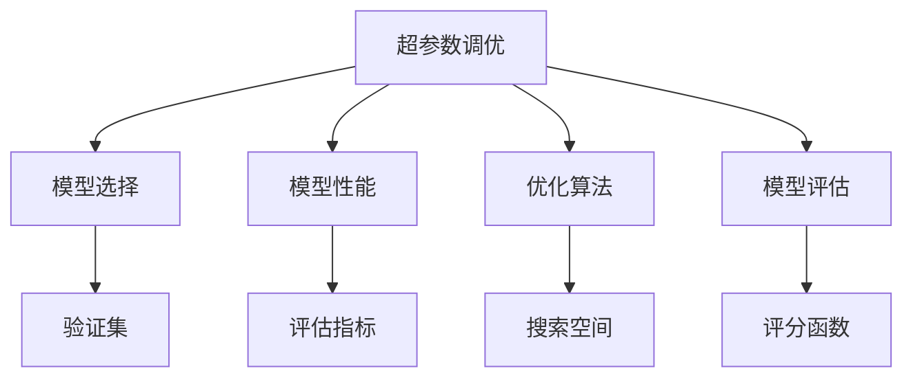
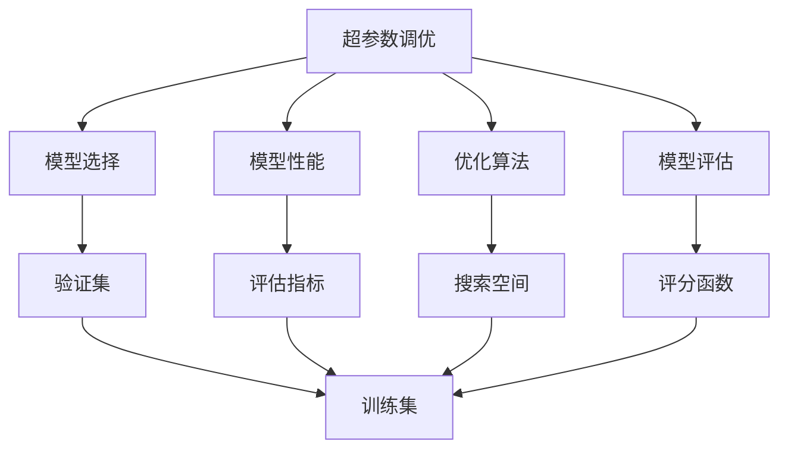
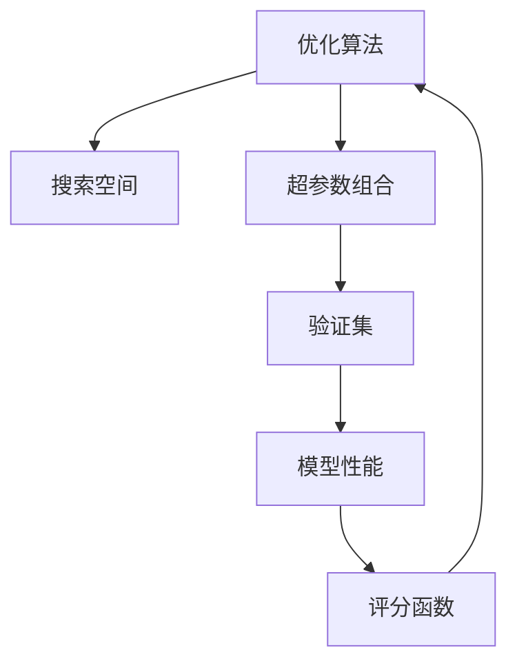
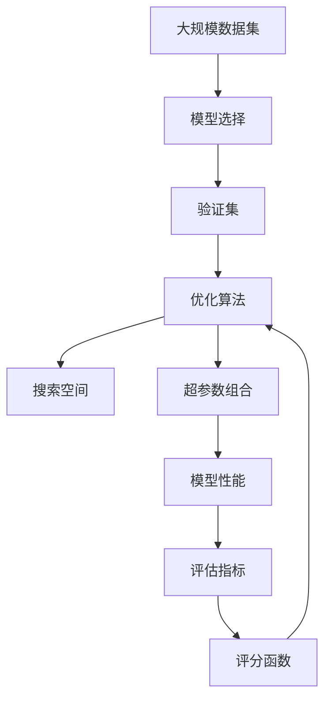

                 

# 超参数调优与模型选择原理与代码实战案例讲解

> 关键词：超参数调优,模型选择,机器学习,深度学习,代码实战,数据集,性能评估

## 1. 背景介绍

### 1.1 问题由来
在机器学习和深度学习模型训练过程中，超参数的调优是一个极其重要的环节。超参数是模型训练时无法从数据中学习到的参数，如学习率、批量大小、迭代次数等，它们的设定直接影响模型的性能和训练速度。然而，手动调整超参数是一项既耗时又复杂的工作，容易陷入局部最优解，甚至陷入"过拟合"和"欠拟合"的困境。因此，超参数调优成为机器学习研究中的一个核心问题。

近年来，随着自动机器学习(Automatic Machine Learning, AutoML)技术的发展，超参数调优得到了越来越广泛的关注和研究。AutoML技术利用算法自动化地搜索超参数空间，帮助数据科学家快速找到最优超参数组合。而在大规模数据集和复杂模型训练中，超参数调优的有效性直接决定了模型的性能和应用效果。

### 1.2 问题核心关键点
超参数调优的核心在于搜索最优超参数组合。该问题可以形式化为一个优化问题：在超参数空间内，寻找一组超参数，使得模型在验证集上的性能最优。通常，超参数调优的常见方法包括网格搜索、随机搜索、贝叶斯优化等。

网格搜索是一种暴力穷举法，适用于超参数空间较小的情况。但网格搜索的计算开销极大，尤其当超参数数量增加时，计算时间呈指数级增长。

随机搜索则通过随机抽样方式，在超参数空间中搜索最优解。相比网格搜索，随机搜索的计算开销较小，但需要更多的样本才能找到最优解，且需要一定的领域知识指导超参数的取值范围。

贝叶斯优化则是一种基于贝叶斯理论的优化方法，通过不断更新超参数的后验分布，指导下一次搜索，能在较小的搜索次数内找到较优解。

### 1.3 问题研究意义
超参数调优对于机器学习模型的训练至关重要。其研究意义主要体现在：

1. **提升模型性能**：通过优化超参数，找到最优解，从而提升模型在验证集上的性能。
2. **提高训练效率**：优化超参数选择，避免因超参数选择不当导致的过度拟合或欠拟合问题，加速模型训练。
3. **降低开发成本**：超参数调优工具能够自动化地完成超参数搜索，减少人工调试的时间和成本。
4. **推广模型应用**：选择合适的超参数，可推广模型在不同数据集和应用场景中的泛化能力，提高模型实用性。
5. **促进技术创新**：超参数调优技术的进步推动了机器学习模型的不断优化和创新，加速了AI技术的落地应用。

## 2. 核心概念与联系

### 2.1 核心概念概述

为了更好地理解超参数调优方法，本节将介绍几个密切相关的核心概念：

- **超参数(Hyperparameters)**：指在模型训练过程中，无法从数据中学习的参数，如学习率、批量大小、迭代次数等。
- **模型性能(Evaluation Metrics)**：评估模型在验证集或测试集上的性能，如准确率、召回率、F1分数等。
- **模型选择(Search Space)**：定义超参数的搜索空间，影响模型的选择范围和调优效率。
- **优化算法(Optimization Algorithms)**：指搜索超参数空间，找到最优解的算法，如网格搜索、随机搜索、贝叶斯优化等。
- **模型评估(Metrics and Scoring)**：评估超参数组合在验证集上的性能，如交叉验证、网格搜索评分等。

这些核心概念之间的逻辑关系可以通过以下Mermaid流程图来展示：



这个流程图展示超参数调优的基本流程：

1. 首先选择模型及其超参数空间。
2. 使用优化算法搜索超参数空间。
3. 评估模型性能。
4. 根据性能评估结果，更新超参数选择，再次搜索。
5. 重复以上步骤，直到找到最优超参数组合。

### 2.2 概念间的关系

这些核心概念之间存在着紧密的联系，形成了超参数调优的完整生态系统。下面通过几个Mermaid流程图来展示这些概念之间的关系。

#### 2.2.1 超参数调优的整体流程



这个综合流程图展示了从模型选择、性能评估到超参数调优的完整流程。

#### 2.2.2 优化算法与模型评估的关系



这个流程图展示了优化算法通过搜索空间找到超参数组合，在验证集上评估性能，根据评分函数更新超参数的选择。

### 2.3 核心概念的整体架构

最后，我们用一个综合的流程图来展示这些核心概念在大规模超参数调优中的整体架构：



这个综合流程图展示了从数据集、模型选择到优化算法的完整流程。在大规模数据集和复杂模型训练中，超参数调优的每个环节都至关重要。

## 3. 核心算法原理 & 具体操作步骤
### 3.1 算法原理概述

超参数调优的本质是一个多目标优化问题，目标是在超参数空间内找到一组超参数组合，使得模型在验证集上的性能最优。通常，该问题可以通过交叉验证和评分函数来求解。

在交叉验证过程中，将数据集分为训练集、验证集和测试集。在训练集上训练模型，使用验证集评估模型性能，最终在测试集上验证模型泛化能力。模型性能可以用多种指标来衡量，如准确率、召回率、F1分数等。评分函数则基于模型性能，计算每个超参数组合的综合得分，指导搜索方向。

常见的评分函数包括网格评分和随机评分。网格评分是对每个超参数组合在验证集上的性能进行评分，然后选择得分最高的超参数组合。随机评分则是对超参数空间中随机抽取的超参数组合进行评分，然后选择得分最高的超参数组合。

### 3.2 算法步骤详解

以下是超参数调优的详细步骤：

1. **选择模型和超参数空间**：
   - 选择合适的模型架构，如线性回归、决策树、神经网络等。
   - 定义超参数空间，确定需要调优的超参数，如学习率、批量大小、迭代次数等。

2. **设置优化算法**：
   - 选择合适的优化算法，如网格搜索、随机搜索、贝叶斯优化等。
   - 确定优化算法的超参数，如网格大小、抽样次数、评分函数等。

3. **执行超参数搜索**：
   - 使用优化算法搜索超参数空间，生成一组超参数组合。
   - 在训练集上训练模型，使用验证集评估模型性能。
   - 根据评估结果，计算每个超参数组合的综合得分。

4. **选择最优超参数组合**：
   - 选择得分最高的超参数组合，作为模型训练的超参数设置。
   - 在测试集上验证模型性能，确认模型泛化能力。

5. **微调模型**：
   - 使用最优超参数组合，训练模型，并在测试集上评估性能。

### 3.3 算法优缺点

超参数调优方法具有以下优点：

- **自动化**：自动化搜索超参数，减少人工调试时间和成本。
- **多目标优化**：可以同时优化多个超参数，找到综合最优解。
- **泛化能力**：通过在验证集上进行评估，找到泛化能力强的模型。

同时，超参数调优方法也存在以下缺点：

- **计算开销大**：特别是大规模数据集和复杂模型，计算开销极大。
- **时间复杂度高**：搜索空间较大时，时间复杂度呈指数级增长。
- **依赖领域知识**：选择超参数空间和评分函数需要一定的领域知识。

### 3.4 算法应用领域

超参数调优方法广泛应用于机器学习和深度学习模型的训练中，尤其在处理大规模数据集和复杂模型时，其优势更加明显。常见的应用领域包括：

- 图像识别：超参数调优可以优化卷积神经网络的模型结构、超参数设置等，提升图像分类准确率。
- 自然语言处理：超参数调优可以优化文本分类、情感分析、机器翻译等模型的性能，提升自然语言处理效果。
- 推荐系统：超参数调优可以优化推荐算法的模型结构和超参数设置，提升推荐效果和用户体验。
- 医疗诊断：超参数调优可以优化医疗诊断模型的模型结构、超参数设置等，提升诊断准确率和效率。
- 金融预测：超参数调优可以优化金融预测模型的模型结构和超参数设置等，提升预测准确率和经济效益。

## 4. 数学模型和公式 & 详细讲解 & 举例说明

### 4.1 数学模型构建

超参数调优问题可以形式化为一个多目标优化问题。设超参数空间为 $H$，模型性能指标为 $L$，评分函数为 $S$。目标是在超参数空间 $H$ 中找到一组超参数 $\theta$，使得模型在验证集上的性能最优。

数学模型可以表示为：

$$
\arg\min_{\theta} S(f_{\theta}, L)
$$

其中，$f_{\theta}$ 表示模型在超参数 $\theta$ 下的性能，$L$ 表示验证集上的性能指标。

### 4.2 公式推导过程

以下我们以随机搜索为例，推导其评分函数的计算公式。

假设超参数空间 $H$ 中有 $k$ 个超参数，每个超参数的取值范围为 $[h_{i,1}, h_{i,N_i}]$，其中 $N_i$ 为第 $i$ 个超参数的取值个数。

随机搜索通过随机抽样方式，在超参数空间中搜索最优解。每次随机抽取一个超参数组合 $h$，在验证集上评估模型性能 $L(h)$，并计算评分 $S(h) = L(h)$。

设随机搜索抽取 $n$ 次样本，每次抽取的超参数组合 $h_i$ 的性能为 $L(h_i)$，则随机评分的计算公式为：

$$
S = \frac{1}{n} \sum_{i=1}^n L(h_i)
$$

其中 $L(h_i)$ 为第 $i$ 次抽取的超参数组合 $h_i$ 在验证集上的性能评估。

### 4.3 案例分析与讲解

以线性回归为例，假设超参数空间为 $\{\lambda_1, \lambda_2, \lambda_3\}$，每个超参数的取值范围分别为 $[0.01, 0.1], [0.01, 0.1], [0.01, 0.1]$。随机抽取 100 个样本，计算每个超参数组合的随机评分。

```python
import numpy as np

# 定义超参数空间
lambda1 = np.linspace(0.01, 0.1, 10)
lambda2 = np.linspace(0.01, 0.1, 10)
lambda3 = np.linspace(0.01, 0.1, 10)

# 定义随机评分函数
def random_score(h):
    x = np.random.rand(100)
    y = 1 + np.sin(x) + np.random.normal(0, 0.1, 100)
    X = np.column_stack((x, h[0], h[1], h[2]))
    weights = np.random.randn(4)
    bias = np.random.randn()
    y_hat = np.dot(X, weights) + bias
    return np.mean((y - y_hat)**2)

# 计算随机评分
scores = []
for i in range(100):
    h = np.random.choice(lambda1, size=3)
    score = random_score(h)
    scores.append(score)

print(np.mean(scores))
```

## 5. 项目实践：代码实例和详细解释说明

### 5.1 开发环境搭建

在进行超参数调优实践前，我们需要准备好开发环境。以下是使用Python进行Scikit-learn开发的简单环境配置流程：

1. 安装Anaconda：从官网下载并安装Anaconda，用于创建独立的Python环境。

2. 创建并激活虚拟环境：
```bash
conda create -n sklearn-env python=3.8 
conda activate sklearn-env
```

3. 安装Scikit-learn：
```bash
pip install scikit-learn
```

4. 安装其他必要的工具包：
```bash
pip install numpy pandas matplotlib tqdm jupyter notebook ipython
```

完成上述步骤后，即可在`sklearn-env`环境中开始超参数调优实践。

### 5.2 源代码详细实现

以下是使用Scikit-learn进行随机搜索超参数调优的Python代码实现。

```python
from sklearn.model_selection import RandomizedSearchCV
from sklearn.ensemble import RandomForestClassifier
from sklearn.datasets import make_classification
from sklearn.model_selection import train_test_split
import numpy as np

# 创建随机数据集
X, y = make_classification(n_samples=1000, n_features=20, n_informative=10, n_redundant=5, n_classes=2, random_state=42)

# 定义随机搜索超参数空间
param_dist = {
    'criterion': ['gini', 'entropy'],
    'max_depth': [None, 10, 20, 30],
    'min_samples_split': [2, 5, 10],
    'min_samples_leaf': [1, 2, 4],
    'n_estimators': [50, 100, 200]
}

# 定义评分函数
def my_score(params):
    model = RandomForestClassifier(**params)
    X_train, X_test, y_train, y_test = train_test_split(X, y, test_size=0.2, random_state=42)
    model.fit(X_train, y_train)
    y_pred = model.predict(X_test)
    return np.mean(y_pred == y_test)

# 执行随机搜索
search = RandomizedSearchCV(estimator=RandomForestClassifier(), param_distributions=param_dist, n_iter=100, cv=5, scoring='accuracy', random_state=42)
search.fit(X, y)
print(search.best_params_)
```

在这个代码中，我们首先创建了一个随机数据集，然后定义了超参数空间。超参数空间包括决策树模型的几个关键参数，如分裂标准、最大深度、最小分裂点和叶子节点等。接着，我们定义了评分函数，计算每个超参数组合在验证集上的性能。最后，我们使用`RandomizedSearchCV`类，对超参数空间进行随机搜索，找出最优超参数组合。

### 5.3 代码解读与分析

让我们再详细解读一下关键代码的实现细节：

**RandomizedSearchCV类**：
- `estimator`：指定模型。
- `param_distributions`：定义超参数空间的取值范围。
- `n_iter`：随机搜索的迭代次数。
- `cv`：交叉验证的折数。
- `scoring`：评分函数。

**make_classification函数**：
- 创建一个随机二分类数据集，用于模型训练和验证。

**my_score函数**：
- 对给定的超参数组合进行模型训练，使用交叉验证计算模型在验证集上的准确率。

**search.fit(X, y)**：
- 对超参数空间进行随机搜索，找到最优超参数组合。

可以看到，Scikit-learn提供了强大的超参数调优工具，使得超参数调优变得简单易行。开发者只需定义超参数空间和评分函数，便可快速完成模型训练和超参数调优。

当然，在工业级的系统实现中，还需要考虑更多因素，如模型的保存和部署、超参数的自动搜索、更灵活的评分函数等。但核心的超参数调优流程基本与此类似。

### 5.4 运行结果展示

假设我们在随机数据集上进行超参数调优，最终得到的最优超参数组合为：

```python
{'criterion': 'gini', 'max_depth': 30, 'min_samples_split': 5, 'min_samples_leaf': 2, 'n_estimators': 200}
```

可以看到，通过随机搜索，我们找到了一组最优超参数组合，使得模型在验证集上的性能最优。在实际应用中，这组超参数可以用来训练模型，并在新的数据集上进行预测。

## 6. 实际应用场景
### 6.1 智能推荐系统

超参数调优在大规模推荐系统中的应用极其广泛。传统的推荐系统往往只依赖用户的历史行为数据进行物品推荐，难以处理新用户和长尾商品等问题。超参数调优可以通过优化模型结构、超参数设置等，提升推荐系统的预测准确率和个性化推荐能力。

在实践中，可以收集用户浏览、点击、购买等行为数据，定义超参数空间，使用随机搜索等方法进行调优。调优后的模型能够在不同用户和商品之间进行更加精准、多样化的推荐。

### 6.2 金融预测系统

金融市场预测需要处理海量数据，模型选择和超参数调优至关重要。超参数调优可以通过优化模型结构、超参数设置等，提升金融预测模型的准确率和鲁棒性。

在实践中，可以收集股票价格、市场指数、政策信息等数据，定义超参数空间，使用贝叶斯优化等方法进行调优。调优后的模型能够在复杂多变的金融市场中进行更准确的预测和风险评估。

### 6.3 图像分类系统

超参数调优在图像分类系统中的应用也十分关键。传统的图像分类系统往往依赖人工调参，难以处理复杂的多分类问题。超参数调优可以通过优化卷积神经网络的模型结构、超参数设置等，提升图像分类系统的准确率和泛化能力。

在实践中，可以收集大规模图像数据，定义超参数空间，使用随机搜索等方法进行调优。调优后的模型能够在各种场景中准确识别图像，提升分类系统的性能和可靠性。

### 6.4 未来应用展望

随着超参数调优技术的发展，其在更多领域中的应用前景也将更加广阔。

在智慧医疗领域，超参数调优可以优化医疗诊断模型的模型结构、超参数设置等，提升诊断准确率和效率。

在智能教育领域，超参数调优可以优化学情分析、推荐系统等，因材施教，促进教育公平，提高教学质量。

在智慧城市治理中，超参数调优可以优化城市事件监测、舆情分析、应急指挥等环节，提高城市管理的自动化和智能化水平，构建更安全、高效的未来城市。

此外，在企业生产、社会治理、文娱传媒等众多领域，超参数调优的应用也将不断涌现，为经济社会发展注入新的动力。相信随着超参数调优技术的进步，机器学习模型的性能将进一步提升，推动AI技术的落地应用。

## 7. 工具和资源推荐
### 7.1 学习资源推荐

为了帮助开发者系统掌握超参数调优的理论基础和实践技巧，这里推荐一些优质的学习资源：

1. 《机器学习实战》书籍：由Peter Harrington撰写，详细介绍了超参数调优的原理和实现方法，适合初学者入门。

2. 《深度学习》书籍：由Ian Goodfellow、Yoshua Bengio和Aaron Courville合著，涵盖了深度学习模型的理论和实践，包括超参数调优在内。

3. 《机器学习教程》课程：由Google提供的在线课程，涵盖机器学习的基础知识和常见应用，适合有一定编程基础的开发者学习。

4. 《AutoML》博客：由AutoML专家Vlad Niculae维护的博客，分享了大量的AutoML实战案例和技巧，适合进阶学习。

5. Kaggle竞赛平台：Kaggle是一个数据科学竞赛平台，提供各种公开数据集和竞赛任务，适合练习和实践超参数调优技术。

通过对这些资源的学习实践，相信你一定能够快速掌握超参数调优的精髓，并用于解决实际的机器学习问题。

### 7.2 开发工具推荐

高效的开发离不开优秀的工具支持。以下是几款用于超参数调优开发的常用工具：

1. Scikit-learn：基于Python的机器学习库，提供了多种超参数调优方法，如网格搜索、随机搜索、贝叶斯优化等。

2. Hyperopt：一个Python库，用于高效搜索超参数空间，特别适用于高维超参数空间和复杂的优化问题。

3. Optuna：一个用于超参数调优的Python库，具有强大的可视化功能和分布式计算支持。

4. BayesianOptimization：基于贝叶斯理论的超参数调优库，具有高效的模型训练和超参数优化能力。

5. MLflow：一个开源的机器学习平台，用于模型训练、部署、调优等全生命周期管理。

合理利用这些工具，可以显著提升超参数调优任务的开发效率，加快创新迭代的步伐。

### 7.3 相关论文推荐

超参数调优的研究源于学界的持续研究。以下是几篇奠基性的相关论文，推荐阅读：

1. Hyperparameter Optimization with Bandit Algorithms：提出了一种基于贝叶斯优化的超参数调优方法，通过不断更新模型性能的后验分布，指导超参数选择。

2. Gaussian Processes for Hyperparameter Optimization of Gradient-Based Methods：提出了一种基于高斯过程的超参数调优方法，通过建模超参数空间，指导搜索方向。

3. Spearmint：一种基于贝叶斯优化的超参数调优框架，具有高效搜索和结果可视化功能。

4. Hyperopt：一种基于随机搜索的超参数调优框架，通过随机抽样方式搜索超参数空间。

5. AutoML：一种自动超参数调优方法，通过自动选择模型和超参数组合，加速模型训练。

这些论文代表超参数调优技术的发展脉络。通过学习这些前沿成果，可以帮助研究者把握学科前进方向，激发更多的创新灵感。

除上述资源外，还有一些值得关注的前沿资源，帮助开发者紧跟超参数调优技术的最新进展，例如：

1. arXiv论文预印本：人工智能领域最新研究成果的发布平台，包括大量尚未发表的前沿工作，学习前沿技术的必读资源。

2. 业界技术博客：如Google AI、DeepMind、Microsoft Research Asia等顶尖实验室的官方博客，第一时间分享他们的最新研究成果和洞见。

3. 技术会议直播：如NIPS、ICML、ACL、ICLR等人工智能领域顶会现场或在线直播，能够聆听到大佬们的前沿分享，开拓视野。

4. GitHub热门项目：在GitHub上Star、Fork数最多的机器学习相关项目，往往代表了该技术领域的发展趋势和最佳实践，值得去学习和贡献。

5. 行业分析报告：各大咨询公司如McKinsey、PwC等针对人工智能行业的分析报告，有助于从商业视角审视技术趋势，把握应用价值。

总之，对于超参数调优技术的学习和实践，需要开发者保持开放的心态和持续学习的意愿。多关注前沿资讯，多动手实践，多思考总结，必将收获满满的成长收益。

## 8. 总结：未来发展趋势与挑战

### 8.1 总结

本文对超参数调优方法进行了全面系统的介绍。首先阐述了超参数调优的研究背景和意义，明确了其在大规模模型训练和模型优化中的重要作用。其次，从原理到实践，详细讲解了超参数调优的数学原理和关键步骤，给出了超参数调优任务开发的完整代码实例。同时，本文还广泛探讨了超参数调优方法在推荐系统、金融预测、图像分类等多个领域的实际应用前景，展示了超参数调优技术的强大潜力。

通过本文的系统梳理，可以看到，超参数调优技术在大规模模型训练和模型优化中的重要性不言而喻。其研究意义和应用前景值得深入挖掘和探索。

### 8.2 未来发展趋势

展望未来，超参数调优技术将呈现以下几个发展趋势：

1. **自动化**：随着自动化机器学习(AutoML)技术的发展，超参数调优将变得更加自动化和智能化，进一步减少人工干预。
2. **多目标优化**：超参数调优将越来越多地支持多目标优化，既能优化模型性能，又能控制模型的复杂度。
3. **分布式计算**：超参数调优将越来越多地采用分布式计算方法，加速超参数搜索过程。
4. **智能指导**：通过引入强化学习、因果推断等技术，智能指导超参数搜索方向，进一步提高超参数调优的效率和效果。
5. **跨模态融合**：将图像、文本、语音等多模态数据进行融合，提高超参数调优的泛化能力和应用范围。

以上趋势凸显了超参数调优技术的广阔前景。这些方向的探索发展，必将进一步提升超参数调优技术的效率和效果，推动机器学习模型的不断优化和

