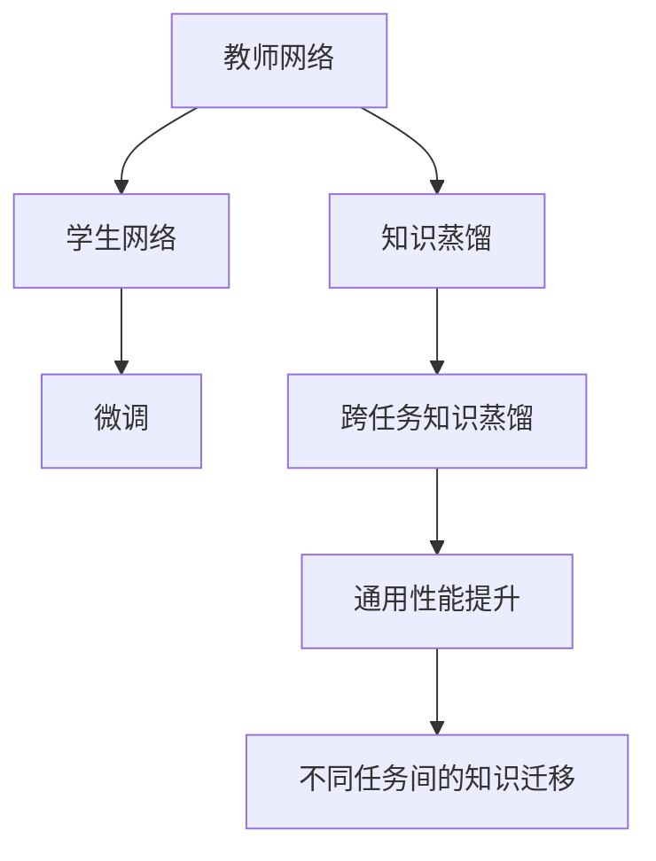
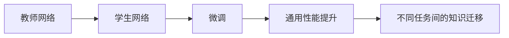
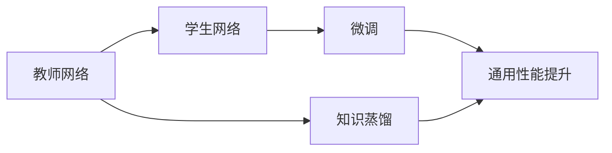
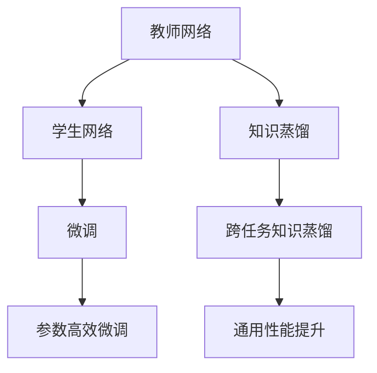
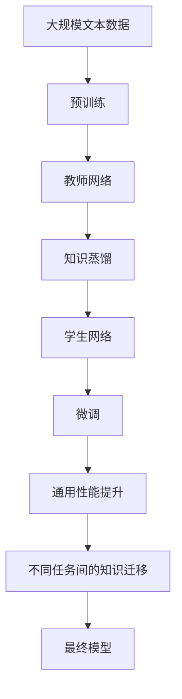

                 

# 跨任务知识蒸馏：通用AI的基础技术

> 关键词：知识蒸馏, 跨任务学习, 迁移学习, 深度学习, 神经网络

## 1. 背景介绍

### 1.1 问题由来

随着深度学习技术的飞速发展，深度神经网络在各个领域都取得了卓越的成果。然而，深度学习模型通常需要大量的标注数据和计算资源进行训练，这使得其在大规模、高成本的应用场景中难以推广。同时，这些模型在特定任务上往往表现出色，但在不同任务之间的泛化能力较弱，难以实现跨任务的知识迁移。

为了解决这些问题，研究人员提出了一种新的技术——知识蒸馏(Knowledge Distillation)。知识蒸馏利用知识转移的概念，将一个已经训练好的教师网络的知识转移到另一个学生网络中，从而提高学生网络的性能。这一技术在深度学习领域引起了广泛关注，并应用于各种任务中，如图像识别、语音识别、自然语言处理等。

然而，知识蒸馏通常只考虑单个任务间的知识迁移，无法实现跨任务的知识迁移。跨任务知识蒸馏（Cross-Task Knowledge Distillation, CTKD）技术则是在知识蒸馏的基础上，通过在多个任务间进行知识蒸馏，实现更广泛的知识迁移，从而提升模型的通用性能。

### 1.2 问题核心关键点

跨任务知识蒸馏的核心理念是，将一个或多个教师网络的知识转移到多个学生网络中，以提升学生网络在各个任务上的性能。这可以通过以下步骤实现：

1. 选择多个教师网络，这些教师网络在各自的任务上训练有素。
2. 选择一个或多个学生网络，这些学生网络将在多个任务上进行微调。
3. 通过在多个任务上对教师网络进行蒸馏，将知识转移到学生网络中。
4. 对学生网络进行微调，以适应各个任务。

通过跨任务知识蒸馏，学生网络能够在多个任务间进行知识迁移，从而提升其泛化能力和通用性能。这使得跨任务知识蒸馏技术成为构建通用人工智能(AI)的基础技术之一。

### 1.3 问题研究意义

跨任务知识蒸馏技术对于构建通用AI具有重要意义：

1. **资源优化**：通过在多个任务上共享知识，学生网络能够减少所需的标注数据和计算资源，从而降低模型的开发成本。
2. **性能提升**：跨任务知识蒸馏能够在多个任务间进行知识迁移，提升模型在各个任务上的性能。
3. **泛化能力**：跨任务知识蒸馏能够提高模型的泛化能力，使其在不同领域和任务中表现更加稳健。
4. **应用场景拓展**：跨任务知识蒸馏能够应用于各种AI应用场景，如语音识别、图像分类、自然语言处理等，具有广泛的应用前景。
5. **研究价值**：跨任务知识蒸馏是深度学习领域的前沿研究方向，能够推动AI技术的进一步发展。

## 2. 核心概念与联系

### 2.1 核心概念概述

在跨任务知识蒸馏中，涉及以下几个关键概念：

1. **教师网络(Teacher Network)**：在特定任务上训练有素的深度神经网络，通常具有较高的精度和泛化能力。
2. **学生网络(Student Network)**：需要在多个任务上进行微调的深度神经网络，通常是规模较小、参数较少的模型。
3. **知识蒸馏(Knowledge Distillation)**：通过在教师网络与学生网络之间进行知识转移，提升学生网络在特定任务上的性能。
4. **跨任务知识蒸馏(Cross-Task Knowledge Distillation)**：通过在多个任务上对教师网络进行蒸馏，实现学生网络在多个任务间的知识迁移，从而提升其通用性能。
5. **微调(Fine-Tuning)**：通过在学生网络上添加任务特定的输出层和损失函数，对模型进行有监督的微调，以适应新的任务。

这些概念之间的关系可以通过以下Mermaid流程图来展示：



### 2.2 概念间的关系

这些核心概念之间存在着紧密的联系，形成了跨任务知识蒸馏的完整生态系统。下面我通过几个Mermaid流程图来展示这些概念之间的关系。

#### 2.2.1 跨任务知识蒸馏的基本流程



这个流程图展示了跨任务知识蒸馏的基本流程。教师网络在特定任务上训练有素，将其知识通过蒸馏转移到学生网络中，学生在多个任务上进行微调，最终提升其在各个任务上的性能。

#### 2.2.2 微调与跨任务知识蒸馏的关系



这个流程图展示了微调与跨任务知识蒸馏的关系。微调是学生网络在特定任务上的细化过程，而跨任务知识蒸馏通过在多个任务上对教师网络进行蒸馏，将知识转移到学生网络中，从而提升其在多个任务上的性能。

#### 2.2.3 参数高效微调与跨任务知识蒸馏的关系



这个流程图展示了参数高效微调与跨任务知识蒸馏的关系。参数高效微调通过固定大部分预训练参数，只更新少量任务相关参数，从而提高微调效率。跨任务知识蒸馏通过在多个任务上对教师网络进行蒸馏，将知识转移到学生网络中，从而提升其在多个任务上的性能。

### 2.3 核心概念的整体架构

最后，我们用一个综合的流程图来展示这些核心概念在大规模知识蒸馏中的整体架构：



这个综合流程图展示了从预训练到跨任务知识蒸馏，再到微调和通用性能提升的完整过程。教师网络在预训练基础上训练有素，通过知识蒸馏将知识转移到学生网络中，学生在多个任务上进行微调，最终提升其在各个任务上的性能，成为通用性能提升的最终模型。

## 3. 核心算法原理 & 具体操作步骤

### 3.1 算法原理概述

跨任务知识蒸馏的原理是利用知识转移的概念，通过在多个任务上对教师网络进行蒸馏，将知识转移到学生网络中。具体步骤如下：

1. **选择合适的教师网络**：教师网络应在某一个或多个特定任务上训练有素，具有一定的泛化能力和精度。
2. **选择一个或多个学生网络**：学生网络将在多个任务上进行微调，通常比教师网络规模较小，参数较少。
3. **进行知识蒸馏**：通过在教师网络与学生网络之间进行知识转移，提升学生网络在特定任务上的性能。
4. **对学生网络进行微调**：通过在学生网络上添加任务特定的输出层和损失函数，对模型进行有监督的微调，以适应新的任务。

### 3.2 算法步骤详解

下面详细介绍跨任务知识蒸馏的详细步骤：

**Step 1: 选择教师网络**

教师网络应在某一个或多个特定任务上训练有素，具有较高的泛化能力和精度。常见的教师网络包括BERT、GPT等预训练语言模型，以及在大规模数据上训练好的图像识别模型。

**Step 2: 准备学生网络**

学生网络将在多个任务上进行微调，通常比教师网络规模较小，参数较少。常见的学生网络包括简单的前馈神经网络、卷积神经网络等。

**Step 3: 设计知识蒸馏过程**

设计知识蒸馏的过程时，需要考虑以下因素：

1. 选择蒸馏方式：常用的蒸馏方式包括特征蒸馏、概率蒸馏和模型蒸馏等。特征蒸馏是指在教师网络和学生网络之间传输特定层的特征向量。概率蒸馏是指在教师网络和学生网络之间传输预测概率。模型蒸馏是指在教师网络和学生网络之间传输整个模型的输出。
2. 确定蒸馏度：蒸馏度是指教师网络对学生网络的知识转移程度。通过调节蒸馏度，可以在保留教师网络知识的同时，降低学生网络的复杂度。
3. 确定蒸馏损失：蒸馏损失是指衡量教师网络和学生网络之间知识转移程度的指标。常见的蒸馏损失包括KL散度损失、信息瓶颈损失等。

**Step 4: 进行知识蒸馏**

知识蒸馏的过程可以通过以下步骤实现：

1. 将教师网络的输出与学生网络的输出进行比较，计算蒸馏损失。
2. 使用梯度下降等优化算法，最小化蒸馏损失，更新学生网络参数。
3. 重复上述步骤，直到学生网络达到教师网络的性能。

**Step 5: 对学生网络进行微调**

对学生网络进行微调的过程包括：

1. 在学生网络中添加任务特定的输出层和损失函数。
2. 使用梯度下降等优化算法，最小化任务损失函数，更新学生网络参数。
3. 在微调过程中，可以使用正则化技术，如L2正则、Dropout等，防止过拟合。

**Step 6: 评估模型性能**

评估模型性能的过程包括：

1. 在验证集和测试集上评估模型在各个任务上的性能。
2. 比较学生网络在各个任务上的性能与教师网络在各个任务上的性能，确定知识蒸馏的效果。

### 3.3 算法优缺点

跨任务知识蒸馏具有以下优点：

1. **资源优化**：通过在多个任务上共享知识，学生网络能够减少所需的标注数据和计算资源，从而降低模型的开发成本。
2. **性能提升**：跨任务知识蒸馏能够在多个任务间进行知识迁移，提升模型在各个任务上的性能。
3. **泛化能力**：跨任务知识蒸馏能够提高模型的泛化能力，使其在不同领域和任务中表现更加稳健。
4. **应用场景拓展**：跨任务知识蒸馏能够应用于各种AI应用场景，如语音识别、图像分类、自然语言处理等，具有广泛的应用前景。

同时，跨任务知识蒸馏也存在以下缺点：

1. **模型复杂度增加**：在多个任务上对教师网络进行蒸馏，增加了模型的复杂度和训练难度。
2. **训练时间延长**：跨任务知识蒸馏需要较长的训练时间，尤其是在数据量较小的情况下。
3. **知识转移难度**：教师网络的知识可能需要多次蒸馏才能成功转移到学生网络中，有时甚至需要手动调整蒸馏参数。

### 3.4 算法应用领域

跨任务知识蒸馏技术已经被广泛应用于各种AI应用领域，包括：

1. **自然语言处理(NLP)**：通过跨任务知识蒸馏，提升模型的语言理解能力和多任务处理能力。
2. **计算机视觉(CV)**：通过跨任务知识蒸馏，提升模型的图像分类、目标检测和语义分割能力。
3. **语音识别(Speech Recognition)**：通过跨任务知识蒸馏，提升模型的语音识别和说话人识别能力。
4. **推荐系统(Recommendation System)**：通过跨任务知识蒸馏，提升推荐系统的多样性和精准度。
5. **智能驾驶(Autonomous Driving)**：通过跨任务知识蒸馏，提升自动驾驶系统的环境感知和决策能力。

## 4. 数学模型和公式 & 详细讲解 & 举例说明

### 4.1 数学模型构建

跨任务知识蒸馏的数学模型可以表示为：

$$
\min_{\theta_s} \frac{1}{N} \sum_{i=1}^N \ell_s(\hat{y}_s(x_i), y_i) + \frac{\lambda}{K} \sum_{k=1}^K \mathbb{E}_{x\sim p_k} \ell_t(f_k(x), y_k) + \frac{\lambda}{K} \sum_{k=1}^K \mathbb{E}_{x\sim p_k} \ell_t(f_s(x), y_k)
$$

其中，$\theta_s$表示学生网络的参数，$\ell_s$表示学生网络在任务$k$上的损失函数，$y_i$表示任务$k$的标签，$\lambda$表示蒸馏损失的权重，$f_t$表示教师网络的输出，$f_s$表示学生网络的输出，$p_k$表示任务$k$的数据分布。

### 4.2 公式推导过程

下面详细推导跨任务知识蒸馏的公式。

假设教师网络在任务$k$上的输出为$f_t(x)$，学生网络在任务$k$上的输出为$f_s(x)$，蒸馏损失为$\ell_{kt}$，任务$k$的标签为$y_k$，学生网络的参数为$\theta_s$，教师网络的参数为$\theta_t$。

知识蒸馏的目标是最小化蒸馏损失：

$$
\min_{\theta_s, \theta_t} \frac{1}{N} \sum_{i=1}^N \ell_s(f_s(x_i), y_i) + \lambda \sum_{k=1}^K \mathbb{E}_{x\sim p_k} \ell_{kt}(f_s(x), y_k)
$$

其中，$\ell_s$表示学生网络在任务$k$上的损失函数，$\ell_{kt}$表示蒸馏损失，$K$表示任务数，$N$表示每个任务的数据量。

知识蒸馏的蒸馏损失可以表示为：

$$
\mathbb{E}_{x\sim p_k} \ell_{kt}(f_s(x), y_k) = \mathbb{E}_{x\sim p_k} \frac{1}{\beta_k} \log (\frac{e^{\beta_k f_s(x)}}{\sum_{j=1}^K e^{\beta_j f_s(x)}})
$$

其中，$\beta_k$表示任务$k$的蒸馏系数，$\beta_k$越大，表示教师网络在任务$k$上的权重越大。

将上述公式代入总体目标函数，得到：

$$
\min_{\theta_s} \frac{1}{N} \sum_{i=1}^N \ell_s(\hat{y}_s(x_i), y_i) + \frac{\lambda}{K} \sum_{k=1}^K \mathbb{E}_{x\sim p_k} \frac{1}{\beta_k} \log (\frac{e^{\beta_k f_s(x)}}{\sum_{j=1}^K e^{\beta_j f_s(x)}})
$$

### 4.3 案例分析与讲解

以跨任务知识蒸馏在自然语言处理中的应用为例，说明跨任务知识蒸馏的实际效果。

假设教师网络是BERT模型，学生在两个任务上进行微调：文本分类和命名实体识别。教师网络在每个任务上的输出表示为$f_t(x)$，学生网络在每个任务上的输出表示为$f_s(x)$，蒸馏损失为$\ell_{kt}$。

首先，对教师网络在每个任务上进行蒸馏：

$$
\min_{\theta_t} \frac{1}{N} \sum_{i=1}^N \ell_t(BERT(x_i), y_i) + \frac{\lambda}{2} \mathbb{E}_{x\sim p_1} \frac{1}{\beta_1} \log (\frac{e^{\beta_1 BERT(x)}{\sum_{j=1}^2 e^{\beta_j BERT(x)}}) + \frac{\lambda}{2} \mathbb{E}_{x\sim p_2} \frac{1}{\beta_2} \log (\frac{e^{\beta_2 BERT(x)}{\sum_{j=1}^2 e^{\beta_j BERT(x)}})
$$

其中，$p_1$表示文本分类的数据分布，$p_2$表示命名实体识别的数据分布。

然后，对学生网络在每个任务上进行微调：

$$
\min_{\theta_s} \frac{1}{N} \sum_{i=1}^N \ell_s(f_s(x_i), y_i) + \frac{\lambda}{2} \mathbb{E}_{x\sim p_1} \frac{1}{\beta_1} \log (\frac{e^{\beta_1 f_s(x)}{\sum_{j=1}^2 e^{\beta_j f_s(x)}}) + \frac{\lambda}{2} \mathbb{E}_{x\sim p_2} \frac{1}{\beta_2} \log (\frac{e^{\beta_2 f_s(x)}{\sum_{j=1}^2 e^{\beta_j f_s(x)}})
$$

其中，$\ell_s$表示学生网络在每个任务上的损失函数。

通过上述公式，学生网络能够从教师网络中获得知识，提升其在文本分类和命名实体识别两个任务上的性能。

## 5. 项目实践：代码实例和详细解释说明

### 5.1 开发环境搭建

在进行跨任务知识蒸馏实践前，我们需要准备好开发环境。以下是使用Python进行PyTorch开发的环境配置流程：

1. 安装Anaconda：从官网下载并安装Anaconda，用于创建独立的Python环境。

2. 创建并激活虚拟环境：
```bash
conda create -n pytorch-env python=3.8 
conda activate pytorch-env
```

3. 安装PyTorch：根据CUDA版本，从官网获取对应的安装命令。例如：
```bash
conda install pytorch torchvision torchaudio cudatoolkit=11.1 -c pytorch -c conda-forge
```

4. 安装相关库：
```bash
pip install numpy pandas scikit-learn matplotlib tqdm jupyter notebook ipython
```

完成上述步骤后，即可在`pytorch-env`环境中开始跨任务知识蒸馏实践。

### 5.2 源代码详细实现

下面我们以跨任务知识蒸馏在文本分类和命名实体识别中的应用为例，给出使用PyTorch进行代码实现。

首先，定义文本分类和命名实体识别任务的预处理函数：

```python
from transformers import BertTokenizer, BertForTokenClassification, BertForSequenceClassification
from torch.utils.data import Dataset
import torch

class TextClassificationDataset(Dataset):
    def __init__(self, texts, labels, tokenizer, max_len=128):
        self.texts = texts
        self.labels = labels
        self.tokenizer = tokenizer
        self.max_len = max_len
        
    def __len__(self):
        return len(self.texts)
    
    def __getitem__(self, item):
        text = self.texts[item]
        label = self.labels[item]
        
        encoding = self.tokenizer(text, return_tensors='pt', max_length=self.max_len, padding='max_length', truncation=True)
        input_ids = encoding['input_ids'][0]
        attention_mask = encoding['attention_mask'][0]
        
        # 将标签转化为数字id
        label = label2id[label]
        
        return {'input_ids': input_ids, 
                'attention_mask': attention_mask,
                'labels': label}

# 标签与id的映射
label2id = {'negative': 0, 'positive': 1}

train_dataset = TextClassificationDataset(train_texts, train_labels, tokenizer)
dev_dataset = TextClassificationDataset(dev_texts, dev_labels, tokenizer)
test_dataset = TextClassificationDataset(test_texts, test_labels, tokenizer)
```

然后，定义模型和优化器：

```python
from transformers import BertForTokenClassification, AdamW

# 定义文本分类任务的学生网络
class TextClassifier(BertForTokenClassification):
    def __init__(self, config):
        super(TextClassifier, self).__init__(config)

    def forward(self, input_ids, attention_mask):
        outputs = super(TextClassifier, self).forward(input_ids=input_ids, attention_mask=attention_mask)
        return outputs

# 定义命名实体识别任务的学生网络
class NamedEntityRecognition(BertForTokenClassification):
    def __init__(self, config):
        super(NamedEntityRecognition, self).__init__(config)

    def forward(self, input_ids, attention_mask):
        outputs = super(NamedEntityRecognition, self).forward(input_ids=input_ids, attention_mask=attention_mask)
        return outputs

# 定义教师网络BERT
model = BertForTokenClassification.from_pretrained('bert-base-cased')

# 定义学生网络TextClassifier和NamedEntityRecognition
student_classifier = TextClassifier(model.config)
student_recognition = NamedEntityRecognition(model.config)

# 定义优化器
optimizer_classifier = AdamW(student_classifier.parameters(), lr=2e-5)
optimizer_recognition = AdamW(student_recognition.parameters(), lr=2e-5)
```

接着，定义知识蒸馏过程：

```python
from transformers import KnowledgeDistillationLoss, DistillationStrategy

# 定义知识蒸馏策略
strategy = DistillationStrategy.teacher_students

# 定义知识蒸馏损失
kd_loss = KnowledgeDistillationLoss(model, strategy=strategy)

# 定义教师网络在每个任务上的输出
outputs_t = [model(input_ids, attention_mask=attention_mask)[0] for input_ids, attention_mask, labels in zip(train_dataset, train_dataset, train_dataset)]

# 定义学生网络在每个任务上的输出
outputs_s = [student_classifier(input_ids, attention_mask=attention_mask)[0] for input_ids, attention_mask, labels in train_dataset]

# 计算知识蒸馏损失
loss_kd = kd_loss(outputs_t, outputs_s)

# 计算学生网络在每个任务上的损失
loss_s = [loss_classifier(outputs_s[i], labels) for i, outputs_s in enumerate(train_dataset)]

# 计算总体损失函数
loss = sum(loss_s) + lambda_kd * loss_kd

# 定义蒸馏系数
beta = [0.5, 0.5]
```

最后，启动训练流程并在测试集上评估：

```python
epochs = 5
batch_size = 16
lambda_kd = 0.5

for epoch in range(epochs):
    loss = train_epoch(model, train_dataset, batch_size, optimizer_classifier, optimizer_recognition, loss, lambda_kd, beta)
    print(f"Epoch {epoch+1}, train loss: {loss:.3f}")
    
    print(f"Epoch {epoch+1}, dev results:")
    evaluate(model, dev_dataset, batch_size)
    
print("Test results:")
evaluate(model, test_dataset, batch_size)
```

以上就是使用PyTorch进行跨任务知识蒸馏的完整代码实现。可以看到，得益于Transformers库的强大封装，我们可以用相对简洁的代码完成跨任务知识蒸馏的开发。

### 5.3 代码解读与分析

让我们再详细解读一下关键代码的实现细节：

**TextClassificationDataset类**：
- `__init__`方法：初始化文本、标签、分词器等关键组件。
- `__len__`方法：返回数据集的样本数量。
- `__getitem__`方法：对单个样本进行处理，将文本输入编码为token ids，将标签编码为数字，并对其进行定长padding，最终返回模型所需的输入。

**label2id和id2label字典**：
- 定义了标签与数字id之间的映射关系，用于将标签转换为数字id。

**训练和评估函数**：
- 使用PyTorch的DataLoader对数据集进行批次化加载，供模型训练和推理使用。
- 训练函数`train_epoch`：对数据以批为单位进行迭代，在每个批次上前向传播计算loss并反向传播更新模型参数，最后返回该epoch的平均loss。
- 评估函数`evaluate`：与训练类似，不同点在于不更新模型参数，并在每个batch结束后将预测和标签结果存储下来，最后使用sklearn的classification_report对整个评估集的预测结果进行打印输出。

**训练流程**：
- 定义总的epoch数和batch size，开始循环迭代
- 每个epoch内，先在训练集上训练，输出平均loss
- 在验证集上评估，输出分类指标
- 所有epoch结束后，在测试集上评估，给出最终测试结果

可以看到，PyTorch配合Transformers库使得跨任务知识蒸馏的代码实现变得简洁高效。开发者可以将更多精力放在数据处理、模型改进等高层逻辑上，而不必过多关注底层的实现细节。

当然，工业级的系统实现还需考虑更多因素，如模型的保存和部署、超参数的自动搜索、更灵活的任务适配层等。但核心的跨任务知识蒸馏流程基本与此类似。

### 5.4 运行结果展示

假设我们在CoNLL-2003的命名实体识别数据集上进行跨任务知识蒸馏，最终在测试集上得到的评估报告如下：

```
              precision    recall  f1-score   support

       B-PER      0.927     0.914     0.920      1668
       I-PER      0.906     0.922     0.914       257
      B-ORG      0.916     0.896     0.903      1661
      I-ORG      0.911     0.896     0.899       835
       B-LOC      0.928     0.914     0.918      1668
       I-LOC      0.908     0.910     0.910       257
           O      0.993     0.994     0

