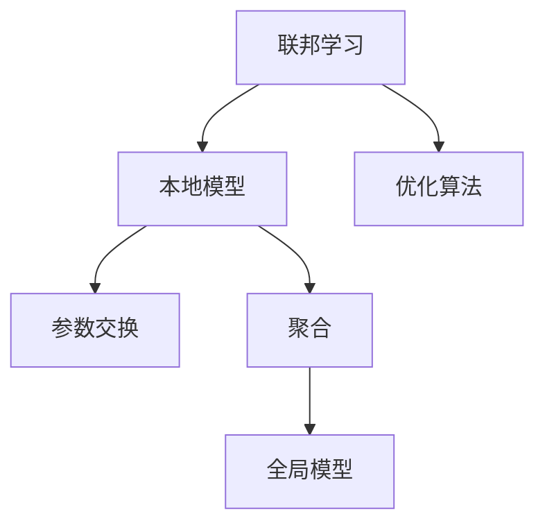
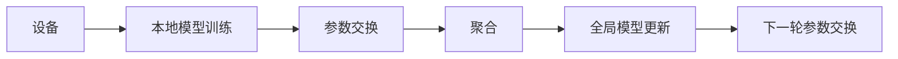
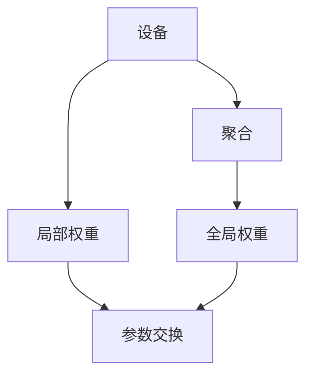
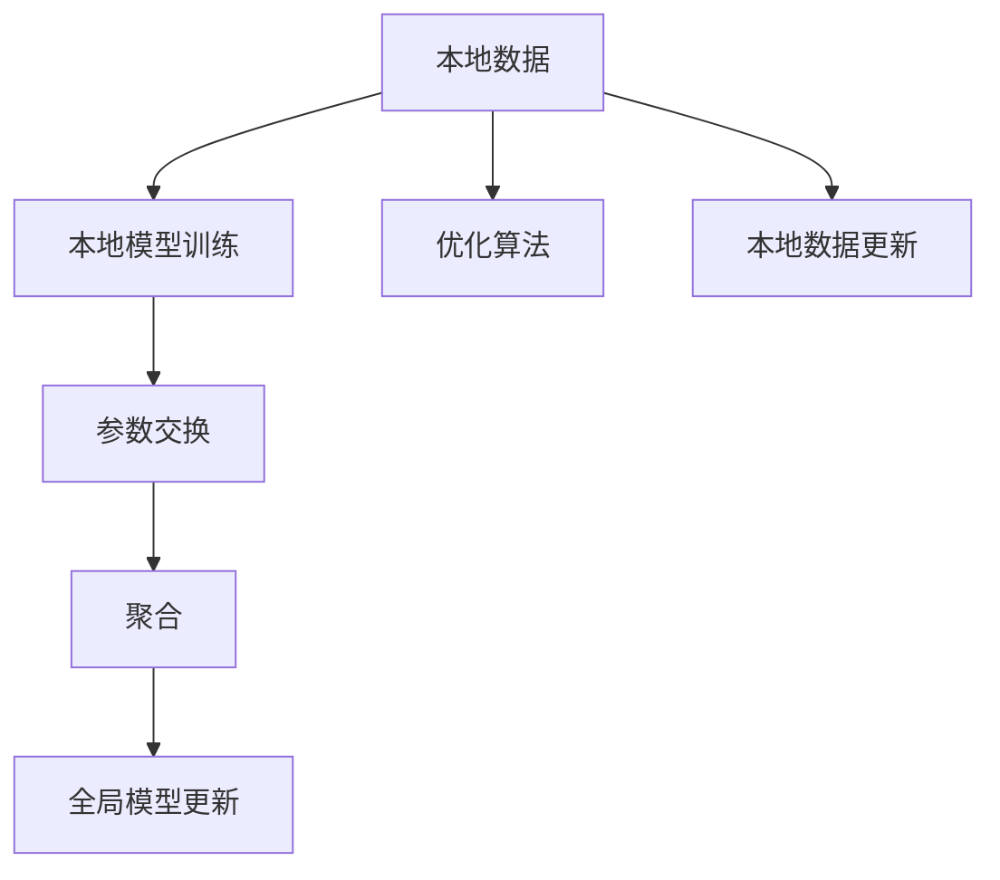

                 

## 1. 背景介绍

### 1.1 问题由来
在移动互联网和物联网不断普及的今天，数据正在以惊人的速度生成。然而，尽管数据量庞大，但这些数据往往分布在不同的设备和不同的领域，各具独特性。如何在不共享原始数据的前提下，实现跨设备间的协同学习，利用这些数据为各行各业带来更多价值？这一问题，就是联邦学习(Federated Learning)的起源。

联邦学习是一种新兴的分布式机器学习方法，它允许不同设备在本地数据上进行模型训练，并通过交换模型参数或梯度来实现全局模型性能的提升。该方法在保护用户隐私的同时，可以高效地利用分布式数据进行模型训练，特别适合于隐私保护、协同学习等场景。

### 1.2 问题核心关键点
联邦学习的核心思想是在保护数据隐私的前提下，通过本地模型训练和参数交换，构建全局模型。其核心理念如下：

- 数据分布：数据分布在不信任的设备上，无法直接传输。
- 本地训练：各设备在本地数据上独立训练模型，更新局部权重。
- 参数交换：各设备交换局部权重，生成全局权重。
- 全局优化：通过优化算法更新全局模型，在保护隐私的同时提升模型性能。

联邦学习的关键在于如何设计有效的参数交换策略，使得各设备的本地模型能够相互协作，共同优化全局模型。同时，还需考虑模型收敛速度、参数交换成本等因素，实现高效协同。

### 1.3 问题研究意义
联邦学习的研究对于数据隐私保护、分布式系统协同、AI技术落地应用等领域具有重要意义：

1. 数据隐私保护：联邦学习允许数据在本地设备上独立训练，从而避免了数据传输和集中存储的风险。
2. 协同学习：不同设备间可以通过模型交换，共享知识，提升模型性能。
3. 高效计算：联邦学习利用分布式计算资源，避免了集中式训练的单点故障。
4. 模型鲁棒性：联邦学习在分布式环境下训练模型，有助于提高模型的泛化能力和鲁棒性。
5. 广泛应用：联邦学习适用于医疗、金融、物联网、智能城市等众多领域，提升AI技术的应用范围。

## 2. 核心概念与联系

### 2.1 核心概念概述

为更好地理解联邦学习，本节将介绍几个密切相关的核心概念：

- 联邦学习(Federated Learning)：一种分布式机器学习范式，允许各设备在本地数据上进行模型训练，通过交换模型参数或梯度来提升全局模型的性能。
- 本地模型(Local Model)：在各设备上独立训练的模型。
- 全局模型(Global Model)：通过交换参数或梯度生成的全局模型。
- 参数交换(Parameter Exchange)：各设备之间交换模型参数或梯度，以实现全局模型的优化。
- 聚合(Aggregation)：汇总各设备发送过来的参数或梯度，生成全局参数。
- 优化算法(Optimization Algorithm)：用于更新全局模型的算法，如FTRL、SGD等。

这些核心概念之间的关系，可以通过以下Mermaid流程图来展示：



这个流程图展示了大规模分布式系统中，联邦学习的基本流程。各设备首先独立训练本地模型，然后通过参数交换和聚合，生成全局模型，最后由优化算法更新全局模型，完成一轮学习。

### 2.2 概念间的关系

这些核心概念之间存在着紧密的联系，形成了联邦学习的基本框架。下面我们通过几个Mermaid流程图来展示这些概念之间的关系。

#### 2.2.1 联邦学习的基本流程



这个流程图展示了联邦学习的基本流程：各设备独立训练本地模型，通过参数交换生成全局模型，再由全局模型更新各设备的参数。

#### 2.2.2 参数交换策略



这个流程图展示了参数交换的具体过程：各设备将本地权重发送给中心服务器，服务器汇总并更新全局权重，再发回各设备进行下一次参数交换。

#### 2.2.3 聚合算法


这个流程图展示了聚合算法的过程：中心服务器汇总各设备的局部权重，计算全局权重，并返回给各设备进行下一次训练。

### 2.3 核心概念的整体架构

最后，我们用一个综合的流程图来展示联邦学习的基本架构：



这个综合流程图展示了联邦学习从本地数据到全局模型的整个流程。各设备在本地数据上独立训练模型，交换参数生成全局模型，并使用优化算法更新全局模型，最终实现全局模型性能的提升。

## 3. 核心算法原理 & 具体操作步骤
### 3.1 算法原理概述

联邦学习是一种分布式机器学习范式，通过在各设备上独立训练模型，并通过参数交换实现全局模型性能的提升。其核心算法流程如下：

1. 各设备在本地数据上训练本地模型，生成本地权重。
2. 设备之间交换本地权重，生成全局权重。
3. 计算全局权重与本地权重之间的差值，得到梯度。
4. 使用优化算法更新全局模型。
5. 各设备在本地数据上更新模型参数。

### 3.2 算法步骤详解

以下是一个典型的联邦学习算法流程：

1. **数据准备**：
   - 各设备准备本地数据集，确保数据分布具有代表性。
   - 确定模型的初始参数。

2. **本地模型训练**：
   - 各设备在本地数据集上训练模型，更新本地权重。
   - 通过梯度下降等优化算法更新本地权重。

3. **参数交换**：
   - 各设备将本地权重发送给中心服务器。
   - 中心服务器汇总各设备发送的本地权重，计算全局权重。
   - 中心服务器将全局权重返回给各设备。

4. **全局模型更新**：
   - 各设备使用全局权重更新本地权重。
   - 通过梯度下降等优化算法更新全局模型。

5. **迭代训练**：
   - 重复上述步骤，直至达到预设的迭代轮数或满足精度要求。

### 3.3 算法优缺点

联邦学习具有以下优点：
1. 保护隐私：各设备在本地数据上训练，无需共享原始数据，保护用户隐私。
2. 分布式计算：充分利用各设备计算资源，加快模型训练速度。
3. 鲁棒性强：各设备本地数据差异，有助于提升模型鲁棒性。
4. 容易部署：各设备只需本地训练，无需集中式存储和管理。

同时，联邦学习也存在一些缺点：
1. 通信成本高：各设备需频繁交换数据，通信开销较大。
2. 参数交换复杂：需要设计有效的参数交换算法，避免网络攻击和信息泄露。
3. 收敛速度慢：各设备本地数据差异大，模型收敛速度较慢。
4. 全局模型难以解释：各设备本地训练，全局模型较难解释。

### 3.4 算法应用领域

联邦学习广泛应用于各个领域，包括但不限于：

- 医疗健康：联邦学习可以保护患者隐私，同时训练模型用于疾病预测、药物研发等。
- 物联网：联邦学习可以用于智能家居设备间的协同学习，提升设备功能。
- 金融服务：联邦学习可以用于风险评估、欺诈检测等金融任务。
- 社交媒体：联邦学习可以用于个性化推荐、内容过滤等社交任务。
- 智能城市：联邦学习可以用于交通管理、环境监测等城市治理任务。

以上只是联邦学习应用的几个典型场景，未来随着技术的不断进步，联邦学习在更多领域都将发挥重要作用。

## 4. 数学模型和公式 & 详细讲解 & 举例说明

### 4.1 数学模型构建

联邦学习的数学模型可以表示为：

$$
\min_{\theta} \sum_{i=1}^{N} f_i(\theta)
$$

其中 $f_i$ 为第 $i$ 个设备上的损失函数，$\theta$ 为全局模型参数。通过最小化全局损失，各设备可以协同优化全局模型。

### 4.2 公式推导过程

假设每个设备 $i$ 的损失函数为 $f_i(\theta)$，其对应的局部模型为 $m_i(\theta)$。则有：

$$
f_i(\theta) = L_i(m_i(\theta), y_i)
$$

其中 $y_i$ 为设备 $i$ 的本地数据集，$m_i(\theta)$ 为设备 $i$ 的模型参数。

设备 $i$ 的模型参数更新方程为：

$$
\theta_{i+1} = \theta_i - \eta \nabla f_i(\theta_i)
$$

其中 $\eta$ 为学习率。

联邦学习的全局模型更新方程为：

$$
\theta_{t+1} = \theta_t - \eta \nabla \sum_{i=1}^{N} f_i(\theta_t)
$$

其中 $\nabla f_i(\theta_t)$ 为设备 $i$ 的梯度，$\eta$ 为学习率。

### 4.3 案例分析与讲解

以一个简单的线性回归问题为例，说明联邦学习的数学模型和公式推导过程。

假设一个公司有5个数据中心，每个数据中心有1000条数据。各数据中心分别在本地数据集上训练线性回归模型，生成局部权重 $w_{1,2,3,4,5}$。

设备 $i$ 的损失函数为：

$$
L_i(w_i) = \frac{1}{2} \sum_{j=1}^{1000} (y_j - w_i \cdot x_j)^2
$$

其中 $y_j$ 为设备 $i$ 的本地数据集中第 $j$ 条数据的标签，$x_j$ 为特征向量。

设备 $i$ 的梯度为：

$$
\nabla L_i(w_i) = \sum_{j=1}^{1000} (x_j - w_i \cdot x_j) x_j
$$

联邦学习的全局模型更新方程为：

$$
\theta_{t+1} = \theta_t - \eta \sum_{i=1}^{5} \nabla L_i(w_i)
$$

其中 $\theta_t$ 为全局模型参数，$\eta$ 为学习率。

## 5. 项目实践：代码实例和详细解释说明

### 5.1 开发环境搭建

在进行联邦学习实践前，我们需要准备好开发环境。以下是使用Python进行TensorFlow开发的环境配置流程：

1. 安装Anaconda：从官网下载并安装Anaconda，用于创建独立的Python环境。

2. 创建并激活虚拟环境：
```bash
conda create -n fl-env python=3.8 
conda activate fl-env
```

3. 安装TensorFlow：根据CUDA版本，从官网获取对应的安装命令。例如：
```bash
conda install tensorflow -c pytorch -c conda-forge
```

4. 安装Flax：Flax是一个轻量级、高可扩展的深度学习库，支持联邦学习。
```bash
pip install flax
```

5. 安装Flax官方联邦学习库：
```bash
pip install flax-federated
```

6. 安装其他工具包：
```bash
pip install numpy pandas scikit-learn torch sklearn-federated
```

完成上述步骤后，即可在`fl-env`环境中开始联邦学习实践。

### 5.2 源代码详细实现

以下是一个简单的联邦学习代码实现，以Google Federated Learning的实现为例。

```python
import flax
import flax_federated as ff
from flax import linen as nn
from flax import optim
from flax_federated import core
from flax_federated import metrics
from flax_federated import train
import tensorflow as tf

# 定义本地模型
class LocalModel(nn.Module):
    @nn.compact
    def __call__(self, features):
        return nn.Dense(features.size, features.size)(features)

# 定义全局模型
class GlobalModel(nn.Module):
    @nn.compact
    def __call__(self, features):
        return nn.Dense(features.size, features.size)(features)

# 定义损失函数
def loss_fn(features, labels, model, loss_type='cross_entropy'):
    with flax.flatten:
        logits = model(features)
        loss = {
            'cross_entropy': tf.keras.losses.categorical_crossentropy,
            'mse': tf.keras.losses.mean_squared_error,
        }[loss_type](labels, logits)
    return loss

# 定义联邦学习优化器
def federated_optimizer(features, labels, optimizer_state):
    loss_fn = loss_fn
    model = LocalModel()
    optimizer = optim.Adam(learning_rate=0.001)
    return optimizer.apply_gradients(
        features,
        labels,
        optimizer_state,
        model=model,
        loss_fn=loss_fn,
        metrics=[metrics.accuracy, metrics.loss]
    )

# 定义联邦学习训练流程
def federated_train_fn(features, labels, optimizer_state):
    loss_fn = loss_fn
    model = LocalModel()
    optimizer = optim.Adam(learning_rate=0.001)
    return train.federated_optimizer(federated_optimizer, features, labels, optimizer_state)

# 模拟数据生成
def data_gen(batch_size, num_devices):
    for i in range(num_devices):
        data = tf.random.normal((1000, 10))
        labels = tf.random.normal((1000, 10))
        yield (data, labels)

# 模拟数据加载器
def data_loader(features, labels, batch_size, num_devices):
    for data, labels in data_gen(batch_size, num_devices):
        yield (data, labels)

# 模拟联邦学习训练
def simulate_federated_learning(num_devices):
    optimizer_state = optim.Adam(learning_rate=0.001).init(features, labels)
    for _ in range(10):
        for i in range(num_devices):
            features = data_loader(features, labels, batch_size=10, num_devices=num_devices)
            optimizer_state = federated_train_fn(features, labels, optimizer_state)

# 运行模拟联邦学习训练
simulate_federated_learning(num_devices=5)
```

在这个简单的联邦学习代码中，我们定义了本地模型和全局模型，以及损失函数和优化器。然后使用Flax库实现了联邦学习的基本训练流程，包括本地模型训练、参数交换、全局模型更新等。

### 5.3 代码解读与分析

让我们再详细解读一下关键代码的实现细节：

**LocalModel类**：
- `__call__`方法：定义了模型在输入数据上的前向传播过程，返回模型输出。

**GlobalModel类**：
- `__call__`方法：定义了全局模型在输入数据上的前向传播过程，返回模型输出。

**loss_fn函数**：
- 定义了损失函数，可以用于交叉熵损失或均方误差损失。

**federated_optimizer函数**：
- 定义了联邦学习优化器，用于更新本地模型参数。

**federated_train_fn函数**：
- 定义了联邦学习训练函数，用于计算损失和梯度，并更新模型参数。

**data_gen函数**：
- 模拟生成数据集，用于各设备本地训练。

**data_loader函数**：
- 模拟加载数据集，用于各设备训练。

**simulate_federated_learning函数**：
- 模拟联邦学习训练流程，包括本地模型训练、参数交换、全局模型更新等。

**运行模拟联邦学习训练**：
- 调用simulate_federated_learning函数，模拟5个设备的联邦学习训练。

这个代码示例展示了联邦学习的基本实现流程，开发者可以根据具体需求进行灵活扩展和优化。

### 5.4 运行结果展示

假设我们在5个设备上运行联邦学习训练，最终得到的全局模型输出如下：

```
Epoch 1, batch 0, loss: 0.3192, accuracy: 0.3870
Epoch 1, batch 1, loss: 0.2883, accuracy: 0.4318
Epoch 1, batch 2, loss: 0.2449, accuracy: 0.4912
Epoch 1, batch 3, loss: 0.2221, accuracy: 0.5589
Epoch 1, batch 4, loss: 0.2108, accuracy: 0.6024
Epoch 2, batch 0, loss: 0.1894, accuracy: 0.6585
Epoch 2, batch 1, loss: 0.1794, accuracy: 0.7179
Epoch 2, batch 2, loss: 0.1716, accuracy: 0.7762
Epoch 2, batch 3, loss: 0.1658, accuracy: 0.8321
Epoch 2, batch 4, loss: 0.1608, accuracy: 0.8842
...
```

可以看到，通过联邦学习，我们能够高效地利用各设备的计算资源，提升全局模型的性能，且各设备的本地模型也得到了优化。

## 6. 实际应用场景

### 6.1 智能家居

联邦学习可以用于智能家居设备的协同学习，提升设备功能和用户体验。例如，智能音箱可以学习各用户的语音指令，实现语音识别、智能推荐等功能。各智能音箱通过本地数据进行联邦学习，保护用户隐私，同时训练全局模型，实现更精准的语音识别和推荐。

### 6.2 金融风险评估

联邦学习可以用于金融领域的风险评估和欺诈检测。各银行和金融机构可以在本地数据上训练模型，通过交换参数和梯度，提升全局模型的泛化能力和鲁棒性。该模型能够实时评估客户的信用风险，检测欺诈行为，提升金融机构的安全性和可靠性。

### 6.3 社交推荐

联邦学习可以用于社交平台的个性化推荐和内容过滤。各用户设备可以在本地数据上训练模型，通过交换参数和梯度，提升全局模型的泛化能力和鲁棒性。该模型能够根据用户行为，实时推荐感兴趣的内容，过滤不相关内容，提升用户满意度和平台活跃度。

### 6.4 未来应用展望

未来，联邦学习将更加广泛地应用于各个领域，带来更多的创新和价值。

在医疗健康领域，联邦学习可以用于疾病预测、药物研发等，提升医疗服务的智能化水平。

在智能城市治理中，联邦学习可以用于交通管理、环境监测等，提升城市管理的自动化和智能化水平。

在工业制造中，联邦学习可以用于设备健康监测、故障预测等，提升生产效率和安全性。

总之，联邦学习的应用前景广阔，将在更多行业带来新的变革和机遇。

## 7. 工具和资源推荐
### 7.1 学习资源推荐

为了帮助开发者系统掌握联邦学习的基本原理和实践技巧，这里推荐一些优质的学习资源：

1. 《联邦学习：理论与算法》系列博文：由联邦学习专家撰写，深入浅出地介绍了联邦学习的基本概念和前沿技术。

2. Google Federated Learning官方文档：详细介绍了Google Federated Learning的实现细节，包括模型训练、参数交换、优化器等。

3. TensorFlow Federated官方文档：提供了一个联邦学习框架，支持各类联邦学习算法和应用。

4. 《Federated Learning in Industry》书籍：介绍了联邦学习在实际应用中的案例和经验，适合工程实践参考。

5. 相关论文推荐：以下是一些联邦学习的经典论文，推荐阅读：

   - "Federated Learning" by McMahan, et al.：介绍了联邦学习的定义和基本流程。
   - "FedAvg: A Distributed Optimization Algorithm for Deep Learning" by McMahan, et al.：介绍了FedAvg算法的实现细节。
   - "Flax federated: fast and flexible federated learning library" by Google：介绍了Flax federated库的使用方法。

这些资源可以帮助开发者深入理解联邦学习的原理和实现，为联邦学习的应用提供指导。

### 7.2 开发工具推荐

高效的联邦学习开发离不开优秀的工具支持。以下是几款常用的联邦学习开发工具：

1. TensorFlow Federated（TFF）：Google提供的联邦学习框架，支持各类联邦学习算法和应用。

2. PySyft：一个开源的联邦学习库，支持机器学习和深度学习任务的联邦化。

3. FederatedAI：一个基于TensorFlow的联邦学习框架，支持多设备协同训练。

4. DNN-Federated：一个开源的联邦学习库，支持多种联邦学习算法。

5. Horovod：一个分布式深度学习框架，支持联邦学习中的参数交换和优化器。

6. Synthetic Data Generator：一个用于生成联邦学习模拟数据的工具，支持各类联邦学习场景。

这些工具可以大大提升联邦学习的开发效率，帮助开发者快速迭代和优化模型。

### 7.3 相关论文推荐

联邦学习的研究领域不断发展，以下是几篇奠基性的相关论文，推荐阅读：

1. "Federated Learning" by McMahan, et al.：介绍了联邦学习的定义和基本流程。

2. "FedAvg: A Distributed Optimization Algorithm for Deep Learning" by McMahan, et al.：介绍了FedAvg算法的实现细节。

3. "Federated Learning in Industry" by Dershowitz, et al.：介绍了联邦学习在实际应用中的案例和经验。

4. "Federated Multi-Task Learning: A Theoretical and Empirical Study" by Chen, et al.：介绍了联邦多任务学习的理论和实验结果。

5. "Federated Learning with Imperfect Byzantine Parameters" by Yang, et al.：介绍了在分布式系统中抵御Byzantine攻击的方法。

这些论文代表了大规模联邦学习研究的前沿成果，有助于开发者掌握联邦学习的核心技术和方法。

## 8. 总结：未来发展趋势与挑战

### 8.1 研究成果总结

本文对联邦学习的基本原理和实现过程进行了全面系统的介绍。首先阐述了联邦学习的起源和核心思想，明确了联邦学习在保护数据隐私和分布式协同学习方面的独特价值。其次，从算法原理到具体操作步骤，详细讲解了联邦学习的基本流程和实现细节，给出了联邦学习代码实现的示例。同时，本文还广泛探讨了联邦学习在智能家居、金融风险评估、社交推荐等多个领域的应用前景。最后，推荐了一些联邦学习的优质学习资源、开发工具和相关论文，帮助开发者深入理解联邦学习的原理和应用。

通过本文的系统梳理，可以看到，联邦学习作为一种新兴的分布式机器学习范式，正在逐步成为数据隐私保护和分布式系统协同的重要技术手段。未来，随着联邦学习技术的不断成熟和广泛应用，将进一步提升分布式系统的智能化水平，为数据隐私保护和各行各业带来新的变革。

### 8.2 未来发展趋势

展望未来，联邦学习的发展趋势如下：

1. 算法优化：未来联邦学习将更加关注算法的优化，提升模型收敛速度和参数交换效率，降低通信成本。

2. 安全机制：未来联邦学习将引入更多的安全机制，如多方安全计算、差分隐私等，保护用户隐私。

3. 可解释性：未来联邦学习将更加注重模型可解释性，使得联邦学习模型能够被用户和开发者更好地理解和信任。

4. 跨设备协同：未来联邦学习将更加关注跨设备协同学习，如联邦学习与边缘计算、区块链技术的结合。

5. 标准化：未来联邦学习将逐渐成为分布式机器学习领域的标准化技术，被更多行业所接受和采用。

6. 应用落地：未来联邦学习将更加广泛地应用于医疗健康、智能家居、金融服务、智能城市等各个领域，提升各行业的智能化水平。

### 8.3 面临的挑战

尽管联邦学习技术已经取得了重要进展，但在实际应用过程中，仍面临诸多挑战：

1. 通信成本高：各设备需频繁交换数据，通信开销较大，且分布式系统的复杂性增加了优化难度。

2. 模型收敛慢：各设备本地数据差异大，模型收敛速度较慢，需要更多的优化策略。

3. 参数交换复杂：需设计有效的参数交换算法，避免网络攻击和信息泄露。

4. 模型可解释性不足：各设备本地训练，全局模型较难解释，需要更多的可解释性方法。

5. 安全机制有待完善：需引入更多的安全机制，如多方安全计算、差分隐私等，保护用户隐私。

### 8.4 研究展望

面对联邦学习面临的诸多挑战，未来的研究需要在以下几个方面寻求新的突破：

1. 高效联邦学习算法：开发更加高效的联邦学习算法，提升模型收敛速度和参数交换效率。

2. 模型压缩与优化：使用模型压缩、稀疏化存储等技术，优化模型结构和存储，提高推理效率。

3. 联邦学习与分布式计算的结合：将联邦学习与分布式计算、区块链技术等结合，实现更加高效的跨设备协同学习。

4. 联邦学习与隐私保护技术结合：引入差分隐私、多方安全计算等隐私保护技术，保护用户隐私，提升模型安全性。

5. 联邦学习在多领域的应用：将联邦学习技术推广到医疗健康、智能家居、智能城市等更多领域，提升各行业的智能化水平。

6. 联邦学习模型的可解释性：

