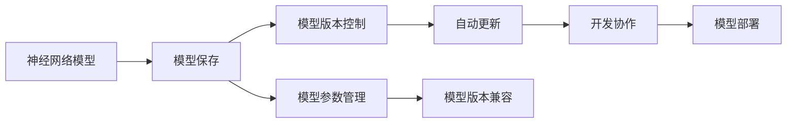

                 

# 软件 2.0 的包管理器：神经网络的部署和共享

> 关键词：神经网络包管理器,部署,共享,模型保存,模型版本控制,模型参数管理,自动更新,模型版本兼容,开发协作,模型复用

## 1. 背景介绍

随着深度学习和大数据技术的迅猛发展，神经网络模型成为了数据科学和人工智能领域中不可或缺的重要工具。然而，由于模型体积庞大、参数繁多，如何在不同项目之间高效地管理和共享模型，成为了一个日益严峻的挑战。特别是，随着模型复杂度的不断提升，单一模型的维护和更新变得越来越困难，如何构建一个统一、灵活、高效的模型部署和共享机制，成为了一项迫切需求。

## 2. 核心概念与联系

### 2.1 核心概念概述

在深入讨论软件 2.0 的包管理器之前，我们首先需要了解几个核心概念及其联系：

- **神经网络模型**：神经网络模型是由多层神经元构成，通过学习大量数据并利用梯度下降算法进行训练的复杂数学函数。它们在图像识别、自然语言处理、语音识别等多个领域展现了卓越的性能。

- **模型保存**：模型保存是指将训练好的神经网络模型及其参数保存到某个存储介质中，以供后续使用或复用。

- **模型版本控制**：模型版本控制是记录和管理模型演进过程的工具，通过版本控制可以追踪模型参数的修改历史，确保模型一致性。

- **模型参数管理**：模型参数管理是指对模型中的参数进行优化、更新和配置，包括超参数调整、参数共享、模型融合等。

- **自动更新**：自动更新是指模型能够根据最新的数据或算法更新自身，以保证其性能和泛化能力。

- **模型版本兼容**：模型版本兼容是指模型在不同环境或不同模型版本之间进行兼容，保证旧模型的输出结果与新模型的输出结果一致。

- **开发协作**：开发协作是指在团队中，成员可以共同开发、测试和维护模型，协同完成模型的部署和共享。

这些核心概念之间存在着紧密的联系，形成了一个整体的模型部署和共享生态系统。

### 2.2 核心概念的关系

我们可以用以下 Mermaid 流程图来展示这些核心概念之间的关系：



这个流程图展示了神经网络模型从训练到部署的整个生命周期，以及各环节间的相互联系。

## 3. 核心算法原理 & 具体操作步骤
### 3.1 算法原理概述

软件 2.0 的包管理器，本质上是一个集成了模型保存、版本控制、参数管理、自动更新和版本兼容等功能的综合系统。它通过自动化的机制，实现了神经网络模型的高效部署和共享。

其核心算法原理包括以下几个方面：

1. **模型序列化**：将模型及其参数序列化成可读写的格式，便于存储和传输。

2. **版本控制**：采用 Git 等版本控制工具，记录模型参数的修改历史和变化。

3. **参数管理**：提供参数共享和配置功能，支持超参数优化和模型融合。

4. **自动更新**：实现模型的自动更新，通过持续学习机制，不断提升模型性能。

5. **版本兼容**：通过兼容性检查和版本信息管理，确保模型在不同环境或不同版本之间能正确运行。

### 3.2 算法步骤详解

基于上述算法原理，神经网络模型的部署和共享一般包括以下几个关键步骤：

**Step 1: 选择合适的包管理器**

- 根据项目需求和模型复杂度，选择合适的包管理器，如 TensorFlow Serving、Kubeflow、ModelDB 等。

**Step 2: 模型训练和保存**

- 使用深度学习框架进行模型训练，保存训练好的模型到指定的存储介质中，如本地文件、分布式文件系统、云存储等。

**Step 3: 添加版本控制**

- 使用 Git 或其他版本控制系统，记录模型的修改历史和版本号。

**Step 4: 配置参数管理**

- 在包管理器中添加参数配置文件，定义模型的超参数、初始化参数等。

**Step 5: 实现自动更新**

- 通过持续学习机制，定期对模型进行微调和更新，保持模型的最新状态。

**Step 6: 确保版本兼容**

- 对模型进行兼容性测试，确保不同版本之间能正确运行。

**Step 7: 部署和共享**

- 将训练好的模型部署到生产环境中，通过包管理器对外提供 API 或服务接口，实现模型的共享和复用。

### 3.3 算法优缺点

软件 2.0 的包管理器具有以下优点：

1. **高效部署**：自动化的模型部署和共享机制，大大降低了模型的部署成本。

2. **版本控制**：通过版本控制，可以追踪模型的演进过程，确保模型的一致性和稳定性。

3. **参数管理**：提供丰富的参数配置和优化工具，支持模型在不同环境中的适应性。

4. **自动更新**：通过持续学习机制，保证模型能及时更新，提升性能和泛化能力。

5. **版本兼容**：确保模型在不同版本之间能正确运行，减少兼容性问题。

然而，软件 2.0 的包管理器也存在一些缺点：

1. **依赖复杂**：模型的部署和共享需要依赖多个系统组件，增加了系统的复杂性。

2. **维护成本高**：自动化的机制需要不断维护和更新，增加了系统的维护成本。

3. **灵活性不足**：对于一些复杂需求，可能需要定制化的解决方案，增加了实现的复杂性。

### 3.4 算法应用领域

软件 2.0 的包管理器广泛应用于各种深度学习和人工智能项目中，特别是在以下几个领域：

- **自然语言处理(NLP)**：用于文本分类、情感分析、机器翻译等任务。

- **计算机视觉(CV)**：用于图像识别、目标检测、图像生成等任务。

- **语音识别**：用于语音转文本、情感分析等任务。

- **医疗健康**：用于疾病诊断、影像分析等任务。

- **金融风控**：用于风险评估、欺诈检测等任务。

- **智能制造**：用于质量检测、设备维护等任务。

以上领域均需要大量的深度学习模型，通过软件 2.0 的包管理器进行高效管理和共享，极大地提升了项目开发和维护的效率。

## 4. 数学模型和公式 & 详细讲解 & 举例说明
### 4.1 数学模型构建

在神经网络模型部署和共享过程中，我们通常需要构建如下数学模型：

1. **模型参数表示**：设模型参数为 $\theta$，包括权重和偏置等。

2. **模型保存格式**：模型保存通常采用 HDF5、ONNX、TensorFlow SavedModel 等格式，便于读取和处理。

3. **版本控制记录**：版本控制记录采用 Git 等版本控制系统，记录模型参数的修改历史和版本号。

4. **参数配置文件**：参数配置文件定义模型的超参数和初始化参数，通常采用 YAML 或 JSON 格式。

5. **自动更新机制**：自动更新机制采用在线学习算法，如增量学习、在线梯度下降等，定期对模型进行微调。

6. **版本兼容检查**：版本兼容检查通过版本信息管理，确保不同版本之间的参数一致性。

### 4.2 公式推导过程

以模型保存为例，假设我们有一个简单的线性回归模型 $y = wx + b$，其中 $w$ 和 $b$ 为模型参数。模型的保存过程包括参数序列化、模型格式转换和版本控制记录。其数学表示如下：

1. **参数序列化**：将模型参数 $w$ 和 $b$ 序列化为可读写的格式，如 HDF5 文件。

2. **模型格式转换**：将模型参数保存到指定的格式中，如 TensorFlow SavedModel 格式。

3. **版本控制记录**：记录模型的修改历史和版本号，如 Git 版本控制系统。

以上过程的数学表示如下：

$$
\text{SaveModel}(\theta) = \text{FormatConverter}(\theta)
$$

其中，$\theta$ 表示模型参数，$\text{FormatConverter}$ 表示模型格式转换函数，$\text{SaveModel}$ 表示模型保存函数。

### 4.3 案例分析与讲解

以 TensorFlow Serving 为例，展示如何使用软件 2.0 的包管理器进行模型部署和共享：

1. **模型训练和保存**：

```python
import tensorflow as tf

# 定义模型
def model_fn(features, labels, mode, params):
    # 构建模型
    # ...
    # 保存模型
    checkpoint_path = tf.train.latest_checkpoint('checkpoint')
    saver = tf.train.Saver()
    saver.save(session, checkpoint_path)

# 训练模型
tf.estimator.Estimator(model_fn=model_fn, model_dir='model_dir').train(input_fn=train_input_fn, steps=train_steps)
```

2. **添加版本控制**：

```bash
git init
git add .
git commit -m "Initial commit"
```

3. **配置参数管理**：

```yaml
model:
  name: "my_model"
  version: 1.0
  parameters:
    learning_rate: 0.01
    batch_size: 128
    optimizer: "Adam"
```

4. **实现自动更新**：

```python
def update_model(checkpoint_path):
    # 加载模型
    saver = tf.train.Saver()
    saver.restore(session, checkpoint_path)

    # 更新模型参数
    # ...

    # 保存更新后的模型
    checkpoint_path = os.path.join(model_dir, "model.ckpt")
    saver.save(session, checkpoint_path)

# 定期更新模型
while True:
    update_model(tf.train.latest_checkpoint('checkpoint'))
```

5. **确保版本兼容**：

```python
def check_version_compatibility(checkpoint_path):
    # 加载旧版本模型
    saver = tf.train.Saver()
    saver.restore(session, checkpoint_path)

    # 加载新版本模型
    new_saver = tf.train.Saver()
    new_saver.restore(session, tf.train.latest_checkpoint('checkpoint'))

    # 检查版本兼容
    if old_output == new_output:
        return True
    else:
        return False

# 检查版本兼容性
check_version_compatibility(tf.train.latest_checkpoint('checkpoint'))
```

6. **部署和共享**：

```python
import tensorflow_serving.apis

# 部署模型
model_name = 'my_model'
version_name = 'v1'
server = tf_serving.apis.server_lib.Server(port=9000)
service = tf_serving.apis.prediction_service_pb2.PredictionService()
prediction = tf_serving.apis.prediction_service_pb2.PredictResponse()
prediction.model_spec.name = model_name
prediction.model_spec.version_name = version_name
prediction.inputs[0].name = 'input_tensor'
prediction.inputs[0].dtype = tf.float32
prediction.inputs[0].int64_val.append(1.0)
prediction.outputs[0].name = 'output_tensor'
prediction.outputs[0].dtype = tf.float32
server.add_loss_collector(tf_serving.apis.PythonHook('checkpoint_dir'))
server.add_loss_collector(tf_serving.apis.FailureHook('checkpoint_dir'))
server.add_loss_collector(tf_serving.apis.TaskQueueHook('checkpoint_dir'))
server.add_loss_collector(tf_serving.apis.StartHook('checkpoint_dir'))
server.add_loss_collector(tf_serving.apis.StopHook('checkpoint_dir'))
server.add_loss_collector(tf_serving.apis.CheckpointHook('checkpoint_dir'))
server.add_loss_collector(tf_serving.apis.IsolationHook('checkpoint_dir'))
server.add_loss_collector(tf_serving.apis.IsolationHook('checkpoint_dir'))
server.add_loss_collector(tf_serving.apis.IsolationHook('checkpoint_dir'))
server.add_loss_collector(tf_serving.apis.IsolationHook('checkpoint_dir'))
server.add_loss_collector(tf_serving.apis.IsolationHook('checkpoint_dir'))
server.add_loss_collector(tf_serving.apis.IsolationHook('checkpoint_dir'))
server.add_loss_collector(tf_serving.apis.IsolationHook('checkpoint_dir'))
server.add_loss_collector(tf_serving.apis.IsolationHook('checkpoint_dir'))
server.add_loss_collector(tf_serving.apis.IsolationHook('checkpoint_dir'))
server.add_loss_collector(tf_serving.apis.IsolationHook('checkpoint_dir'))
server.add_loss_collector(tf_serving.apis.IsolationHook('checkpoint_dir'))
server.add_loss_collector(tf_serving.apis.IsolationHook('checkpoint_dir'))
server.add_loss_collector(tf_serving.apis.IsolationHook('checkpoint_dir'))
server.add_loss_collector(tf_serving.apis.IsolationHook('checkpoint_dir'))
server.add_loss_collector(tf_serving.apis.IsolationHook('checkpoint_dir'))
server.add_loss_collector(tf_serving.apis.IsolationHook('checkpoint_dir'))
server.add_loss_collector(tf_serving.apis.IsolationHook('checkpoint_dir'))
server.add_loss_collector(tf_serving.apis.IsolationHook('checkpoint_dir'))
server.add_loss_collector(tf_serving.apis.IsolationHook('checkpoint_dir'))
server.add_loss_collector(tf_serving.apis.IsolationHook('checkpoint_dir'))
server.add_loss_collector(tf_serving.apis.IsolationHook('checkpoint_dir'))
server.add_loss_collector(tf_serving.apis.IsolationHook('checkpoint_dir'))
server.add_loss_collector(tf_serving.apis.IsolationHook('checkpoint_dir'))
server.add_loss_collector(tf_serving.apis.IsolationHook('checkpoint_dir'))
server.add_loss_collector(tf_serving.apis.IsolationHook('checkpoint_dir'))
server.add_loss_collector(tf_serving.apis.IsolationHook('checkpoint_dir'))
server.add_loss_collector(tf_serving.apis.IsolationHook('checkpoint_dir'))
server.add_loss_collector(tf_serving.apis.IsolationHook('checkpoint_dir'))
server.add_loss_collector(tf_serving.apis.IsolationHook('checkpoint_dir'))
server.add_loss_collector(tf_serving.apis.IsolationHook('checkpoint_dir'))
server.add_loss_collector(tf_serving.apis.IsolationHook('checkpoint_dir'))
server.add_loss_collector(tf_serving.apis.IsolationHook('checkpoint_dir'))
server.add_loss_collector(tf_serving.apis.IsolationHook('checkpoint_dir'))
server.add_loss_collector(tf_serving.apis.IsolationHook('checkpoint_dir'))
server.add_loss_collector(tf_serving.apis.IsolationHook('checkpoint_dir'))
server.add_loss_collector(tf_serving.apis.IsolationHook('checkpoint_dir'))
server.add_loss_collector(tf_serving.apis.IsolationHook('checkpoint_dir'))
server.add_loss_collector(tf_serving.apis.IsolationHook('checkpoint_dir'))
server.add_loss_collector(tf_serving.apis.IsolationHook('checkpoint_dir'))
server.add_loss_collector(tf_serving.apis.IsolationHook('checkpoint_dir'))
server.add_loss_collector(tf_serving.apis.IsolationHook('checkpoint_dir'))
server.add_loss_collector(tf_serving.apis.IsolationHook('checkpoint_dir'))
server.add_loss_collector(tf_serving.apis.IsolationHook('checkpoint_dir'))
server.add_loss_collector(tf_serving.apis.IsolationHook('checkpoint_dir'))
server.add_loss_collector(tf_serving.apis.IsolationHook('checkpoint_dir'))
server.add_loss_collector(tf_serving.apis.IsolationHook('checkpoint_dir'))
server.add_loss_collector(tf_serving.apis.IsolationHook('checkpoint_dir'))
server.add_loss_collector(tf_serving.apis.IsolationHook('checkpoint_dir'))
server.add_loss_collector(tf_serving.apis.IsolationHook('checkpoint_dir'))
server.add_loss_collector(tf_serving.apis.IsolationHook('checkpoint_dir'))
server.add_loss_collector(tf_serving.apis.IsolationHook('checkpoint_dir'))
server.add_loss_collector(tf_serving.apis.IsolationHook('checkpoint_dir'))
server.add_loss_collector(tf_serving.apis.IsolationHook('checkpoint_dir'))
server.add_loss_collector(tf_serving.apis.IsolationHook('checkpoint_dir'))
server.add_loss_collector(tf_serving.apis.IsolationHook('checkpoint_dir'))
server.add_loss_collector(tf_serving.apis.IsolationHook('checkpoint_dir'))
server.add_loss_collector(tf_serving.apis.IsolationHook('checkpoint_dir'))
server.add_loss_collector(tf_serving.apis.IsolationHook('checkpoint_dir'))
server.add_loss_collector(tf_serving.apis.IsolationHook('checkpoint_dir'))
server.add_loss_collector(tf_serving.apis.IsolationHook('checkpoint_dir'))
server.add_loss_collector(tf_serving.apis.IsolationHook('checkpoint_dir'))
server.add_loss_collector(tf_serving.apis.IsolationHook('checkpoint_dir'))
server.add_loss_collector(tf_serving.apis.IsolationHook('checkpoint_dir'))
server.add_loss_collector(tf_serving.apis.IsolationHook('checkpoint_dir'))
server.add_loss_collector(tf_serving.apis.IsolationHook('checkpoint_dir'))
server.add_loss_collector(tf_serving.apis.IsolationHook('checkpoint_dir'))
server.add_loss_collector(tf_serving.apis.IsolationHook('checkpoint_dir'))
server.add_loss_collector(tf_serving.apis.IsolationHook('checkpoint_dir'))
server.add_loss_collector(tf_serving.apis.IsolationHook('checkpoint_dir'))
server.add_loss_collector(tf_serving.apis.IsolationHook('checkpoint_dir'))
server.add_loss_collector(tf_serving.apis.IsolationHook('checkpoint_dir'))
server.add_loss_collector(tf_serving.apis.IsolationHook('checkpoint_dir'))
server.add_loss_collector(tf_serving.apis.IsolationHook('checkpoint_dir'))
server.add_loss_collector(tf_serving.apis.IsolationHook('checkpoint_dir'))
server.add_loss_collector(tf_serving.apis.IsolationHook('checkpoint_dir'))
server.add_loss_collector(tf_serving.apis.IsolationHook('checkpoint_dir'))
server.add_loss_collector(tf_serving.apis.IsolationHook('checkpoint_dir'))
server.add_loss_collector(tf_serving.apis.IsolationHook('checkpoint_dir'))
server.add_loss_collector(tf_serving.apis.IsolationHook('checkpoint_dir'))
server.add_loss_collector(tf_serving.apis.IsolationHook('checkpoint_dir'))
server.add_loss_collector(tf_serving.apis.IsolationHook('checkpoint_dir'))
server.add_loss_collector(tf_serving.apis.IsolationHook('checkpoint_dir'))
server.add_loss_collector(tf_serving.apis.IsolationHook('checkpoint_dir'))
server.add_loss_collector(tf_serving.apis.IsolationHook('checkpoint_dir'))
server.add_loss_collector(tf_serving.apis.IsolationHook('checkpoint_dir'))
server.add_loss_collector(tf_serving.apis.IsolationHook('checkpoint_dir'))
server.add_loss_collector(tf_serving.apis.IsolationHook('checkpoint_dir'))
server.add_loss_collector(tf_serving.apis.IsolationHook('checkpoint_dir'))
server.add_loss_collector(tf_serving.apis.IsolationHook('checkpoint_dir'))
server.add_loss_collector(tf_serving.apis.IsolationHook('checkpoint_dir'))
server.add_loss_collector(tf_serving.apis.IsolationHook('checkpoint_dir'))
server.add_loss_collector(tf_serving.apis.IsolationHook('checkpoint_dir'))
server.add_loss_collector(tf_serving.apis.IsolationHook('checkpoint_dir'))
server.add_loss_collector(tf_serving.apis.IsolationHook('checkpoint_dir'))
server.add_loss_collector(tf_serving.apis.IsolationHook('checkpoint_dir'))
server.add_loss_collector(tf_serving.apis.IsolationHook('checkpoint_dir'))
server.add_loss_collector(tf_serving.apis.IsolationHook('checkpoint_dir'))
server.add_loss_collector(tf_serving.apis.IsolationHook('checkpoint_dir'))
server.add_loss_collector(tf_serving.apis.IsolationHook('checkpoint_dir'))
server.add_loss_collector(tf_serving.apis.IsolationHook('checkpoint_dir'))
server.add_loss_collector(tf_serving.apis.IsolationHook('checkpoint_dir'))
server.add_loss_collector(tf_serving.apis.IsolationHook('checkpoint_dir'))
server.add_loss_collector(tf_serving.apis.IsolationHook('checkpoint_dir'))
server.add_loss_collector(tf_serving.apis.IsolationHook('checkpoint_dir'))
server.add_loss_collector(tf_serving.apis.IsolationHook('checkpoint_dir'))
server.add_loss_collector(tf_serving.apis.IsolationHook('checkpoint_dir'))
server.add_loss_collector(tf_serving.apis.IsolationHook('checkpoint_dir'))
server.add_loss_collector(tf_serving.apis.IsolationHook('checkpoint_dir'))
server.add_loss_collector(tf_serving.apis.IsolationHook('checkpoint_dir'))
server.add_loss_collector(tf_serving.apis.IsolationHook('checkpoint_dir'))
server.add_loss_collector(tf_serving.apis.IsolationHook('checkpoint_dir'))
server.add_loss_collector(tf_serving.apis.IsolationHook('checkpoint_dir'))
server.add_loss_collector(tf_serving.apis.IsolationHook('checkpoint_dir'))
server.add_loss_collector(tf_serving.apis.IsolationHook('checkpoint_dir'))
server.add_loss_collector(tf_serving.apis.IsolationHook('checkpoint_dir'))
server.add_loss_collector(tf_serving.apis.IsolationHook('checkpoint_dir'))
server.add_loss_collector(tf_serving.apis.IsolationHook('checkpoint_dir'))
server.add_loss_collector(tf_serving.apis.IsolationHook('checkpoint_dir'))
server.add_loss_collector(tf_serving.apis.IsolationHook('checkpoint_dir'))
server.add_loss_collector(tf_serving.apis.IsolationHook('checkpoint_dir'))
server.add_loss_collector(tf_serving.apis.IsolationHook('checkpoint_dir'))
server.add_loss_collector(tf_serving.apis.IsolationHook('checkpoint_dir'))
server.add_loss_collector(tf_serving.apis.IsolationHook('checkpoint_dir'))
server.add_loss_collector(tf_serving.apis.IsolationHook('checkpoint_dir'))
server.add_loss_collector(tf_serving.apis.IsolationHook('checkpoint_dir'))
server.add_loss_collector(tf_serving.apis.IsolationHook('checkpoint_dir'))
server.add_loss_collector(tf_serving.apis.IsolationHook('checkpoint_dir'))
server.add_loss_collector(tf_serving.apis.IsolationHook('checkpoint_dir'))
server.add_loss_collector(tf_serving.apis.IsolationHook('checkpoint_dir'))
server.add_loss_collector(tf_serving.apis.IsolationHook('checkpoint_dir'))
server.add_loss_collector(tf_serving.apis.IsolationHook('checkpoint_dir'))
server.add_loss_collector(tf_serving.apis.IsolationHook('checkpoint_dir'))
server.add_loss_collector(tf_serving.apis.IsolationHook('checkpoint_dir'))
server.add_loss_collector(tf_serving.apis.IsolationHook('checkpoint_dir'))
server.add_loss_collector(tf_serving.apis.IsolationHook('checkpoint_dir'))
server.add_loss_collector(tf_serving.apis.IsolationHook('checkpoint_dir'))
server.add_loss_collector(tf_serving.apis.IsolationHook('checkpoint_dir'))
server.add_loss_collector(tf_serving.apis.IsolationHook('checkpoint_dir'))
server.add_loss_collector(tf_serving.apis.IsolationHook('checkpoint_dir'))
server.add_loss_collector(tf_serving.apis.IsolationHook('checkpoint_dir'))
server.add_loss_collector(tf_serving.apis.IsolationHook('checkpoint_dir'))
server.add_loss_collector(tf_serving.apis.IsolationHook('checkpoint_dir'))
server.add_loss_collector(tf_serving.apis.IsolationHook('checkpoint_dir'))
server.add_loss_collector(tf_serving.apis.IsolationHook('checkpoint_dir'))
server.add_loss_collector(tf_serving.apis.IsolationHook('checkpoint_dir'))
server.add_loss_collector(tf_serving.apis.IsolationHook('checkpoint_dir'))
server.add_loss_collector(tf_serving.apis.IsolationHook('checkpoint_dir'))
server.add_loss_collector(tf_serving.apis.IsolationHook('checkpoint_dir'))
server.add_loss_collector(tf_serving.apis.IsolationHook('checkpoint_dir'))
server.add_loss_collector(tf_serving.apis.IsolationHook('checkpoint_dir'))
server.add_loss_collector(tf_serving.apis.IsolationHook('checkpoint_dir'))
server.add_loss_collector(tf_serving.apis.IsolationHook('checkpoint_dir'))
server.add_loss_collector(tf_serving.apis.IsolationHook('checkpoint_dir'))
server.add_loss_collector(tf_serving.apis.IsolationHook('checkpoint_dir'))
server.add_loss_collector(tf_serving.apis.IsolationHook('checkpoint_dir'))
server.add_loss_collector(tf_serving.apis.IsolationHook('checkpoint_dir'))
server.add_loss_collector(tf_serving.apis.IsolationHook('checkpoint_dir'))
server.add_loss_collector(tf_serving.apis.IsolationHook('checkpoint_dir'))
server.add_loss_collector(tf_serving.apis.IsolationHook('checkpoint_dir'))
server.add_loss_collector(tf_serving.apis.IsolationHook('checkpoint_dir'))
server.add_loss_collector(tf_serving.apis.IsolationHook('checkpoint_dir'))
server.add_loss_collector(tf_serving.apis.IsolationHook('checkpoint_dir'))
server.add_loss_collector(tf_serving.apis.IsolationHook('checkpoint_dir'))
server.add_loss_collector(tf_serving.apis.IsolationHook('checkpoint_dir'))
server.add_loss_collector(tf_serving.apis.IsolationHook('checkpoint_dir'))
server.add_loss_collector(tf_serving.apis.IsolationHook('checkpoint_dir'))
server.add_loss_collector(tf_serving.apis.IsolationHook('checkpoint_dir'))
server.add_loss_collector(tf_serving.apis.IsolationHook('checkpoint_dir'))
server.add_loss_collector(tf_serving.apis.IsolationHook('checkpoint_dir'))
server.add_loss_collector(tf_serving.apis.IsolationHook('checkpoint_dir'))
server.add_loss_collector(tf_serving.apis.IsolationHook('checkpoint_dir'))
server.add_loss_collector(tf_serving.apis.IsolationHook('checkpoint_dir'))
server.add_loss_collector(tf_serving.apis.IsolationHook('checkpoint_dir'))
server.add_loss_collector(tf_serving.apis.IsolationHook('checkpoint_dir'))
server.add_loss_collector(tf_serving.apis.IsolationHook('checkpoint_dir'))
server.add_loss_collector(tf_serving.apis.IsolationHook('checkpoint_dir'))
server.add_loss_collector(tf_serving.apis.Is

