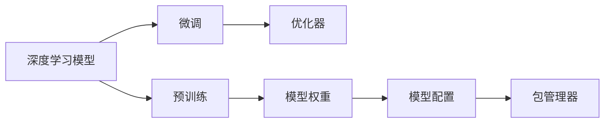

                 

## 1. 背景介绍

随着深度学习技术的飞速发展，神经网络的应用日益广泛，无论是自然语言处理、计算机视觉还是智能推荐系统，都有着深度学习的一席之地。然而，深度学习的模型往往非常庞大，训练和推理过程复杂且耗时，这给模型的部署和共享带来了不小的挑战。

过去，模型的部署通常需要重新训练模型，或者通过静态图部署方式进行部署，这不仅消耗了大量的计算资源，还难以应对模型更新和升级的需求。而模型的共享则更加困难，由于模型体积庞大，存储和传输成本高昂，用户难以获取和应用到这些模型。

因此，为了更好地解决深度学习模型的部署和共享问题，软件2.0的包管理器应运而生。这一概念最早由OpenAI的Ian Goodfellow在其著作《生成对抗网络》中提出，旨在通过包管理器的方式，实现深度学习模型的轻量化和即插即用，极大提升模型的部署和共享效率。

## 2. 核心概念与联系

### 2.1 核心概念概述

软件2.0的包管理器是深度学习模型部署和共享的一种新范式，其核心思想是将模型的关键组件，如权重、结构、配置等打包成一个独立的库或模块，供其他应用直接调用。这不仅可以减少模型的计算和存储成本，还能快速地进行模型的更新和迁移。

以下核心概念通过一个简单的流程图来展现它们之间的联系：



这个流程图展示了深度学习模型从预训练到微调，再到优化器配置，最终打包成包管理器供用户调用的整个过程。预训练和微调使得模型获得了更好的性能，优化器则保证了模型训练的效率，模型权重和配置信息是包管理器中的关键内容，用户可以通过包管理器快速访问和使用这些信息。

### 2.2 概念间的关系

这些核心概念之间存在着紧密的联系，它们共同构成了软件2.0的包管理器：

- 深度学习模型：是包管理器的核心内容，包含预训练、微调和优化器配置等关键组件。
- 预训练：通过在大规模数据上训练模型，使得模型获得通用的知识表示。
- 微调：在预训练的基础上，通过小规模数据进一步优化模型，适应特定的任务需求。
- 优化器：如Adam、SGD等，用于指导模型的训练过程，加速模型收敛。
- 模型权重：模型训练过程中生成的参数，是模型知识的核心。
- 模型配置：包含模型的结构、参数初始化方式、训练策略等配置信息，影响模型的性能。
- 包管理器：将模型的关键组件打包成库或模块，供其他应用直接使用，实现模型的快速部署和共享。

这些概念共同构成了软件2.0的包管理器，使得深度学习模型的部署和共享变得更加便捷、高效。通过理解这些概念，我们可以更好地把握软件2.0包管理器的原理和应用。

## 3. 核心算法原理 & 具体操作步骤

### 3.1 算法原理概述

软件2.0的包管理器基于深度学习模型的预训练和微调过程，通过优化器的配置，实现了模型的快速部署和共享。其主要原理包括以下几个方面：

- 预训练：通过在大规模数据集上训练模型，使其获得通用的知识表示。
- 微调：在预训练的基础上，通过小规模数据集进一步优化模型，使其适应特定的任务需求。
- 优化器：通过调整优化器的参数，优化模型的训练过程，提高模型收敛速度和性能。
- 模型打包：将模型的权重、配置信息和优化器参数打包成一个独立的包管理器，供其他应用直接使用。
- 模型部署：通过包管理器，用户可以快速部署模型，实现模型的快速迁移和更新。

### 3.2 算法步骤详解

软件2.0的包管理器实现步骤可以分为以下几个阶段：

#### 3.2.1 预训练

1. 选择适当的深度学习框架，如TensorFlow、PyTorch等，配置模型的架构和超参数。
2. 加载大规模数据集，如ImageNet、CoNLL-2003等，作为模型的输入。
3. 定义模型的损失函数和优化器，如交叉熵损失、Adam优化器等。
4. 训练模型，迭代优化损失函数，更新模型参数。

#### 3.2.2 微调

1. 选择适当的微调数据集，如Kaggle竞赛数据集、企业内部数据等。
2. 加载微调数据集，并划分为训练集、验证集和测试集。
3. 在预训练模型的基础上，重新定义任务适配层，如分类器、解码器等。
4. 在微调数据集上训练模型，优化模型参数。

#### 3.2.3 模型打包

1. 保存模型的权重、配置信息和优化器参数。
2. 将模型打包成一个独立的库或模块，供其他应用直接调用。

#### 3.2.4 模型部署

1. 下载包管理器库或模块，加载到目标应用中。
2. 通过接口调用模型进行推理预测。

### 3.3 算法优缺点

软件2.0的包管理器具有以下优点：

- 高效：模型微调和优化器配置可以在大规模数据集上进行，提高了模型的性能。
- 轻量化：通过模型打包，减少了模型的计算和存储成本。
- 易用性：模型通过包管理器供其他应用直接调用，大大简化了模型的部署和共享。
- 灵活性：用户可以通过优化器配置和微调数据集调整模型性能，满足特定的任务需求。

然而，该方法也存在一些缺点：

- 依赖框架：深度学习模型的实现依赖于特定的深度学习框架，用户需要熟悉该框架的使用。
- 难以跨框架迁移：模型打包后难以跨框架迁移，限制了模型的适用范围。
- 需要重新训练：虽然可以减小模型的计算和存储成本，但仍然需要在大规模数据集上重新训练模型，时间成本较高。

### 3.4 算法应用领域

软件2.0的包管理器已在多个领域得到了应用，以下是几个典型的应用场景：

#### 3.4.1 计算机视觉

计算机视觉领域中的目标检测、图像分类、实例分割等任务，通过预训练和微调模型，实现了高效、准确的图像识别。例如，Faster R-CNN、ResNet等深度学习模型通过软件2.0的包管理器，可以在移动端或嵌入式设备上快速部署，极大地提高了图像识别的效率和准确率。

#### 3.4.2 自然语言处理

自然语言处理领域中的文本分类、命名实体识别、情感分析等任务，通过预训练和微调模型，实现了高效、精准的文本处理。例如，BERT、GPT-2等大模型通过软件2.0的包管理器，可以在各种自然语言处理应用中快速部署，提升了文本处理的效果和效率。

#### 3.4.3 语音识别

语音识别领域中的语音转文本、语音识别等任务，通过预训练和微调模型，实现了高效、准确的语音识别。例如，基于深度学习模型的语音识别系统，通过软件2.0的包管理器，可以在移动端或嵌入式设备上快速部署，提升了语音识别的准确率和实时性。

#### 3.4.4 推荐系统

推荐系统中的商品推荐、用户画像等任务，通过预训练和微调模型，实现了高效、个性化的推荐。例如，基于深度学习模型的推荐系统，通过软件2.0的包管理器，可以在不同平台和设备上快速部署，提升了推荐的效果和用户体验。

## 4. 数学模型和公式 & 详细讲解 & 举例说明

### 4.1 数学模型构建

软件2.0的包管理器涉及的数学模型主要包括以下几个方面：

- 预训练模型的数学模型
- 微调模型的数学模型
- 优化器的数学模型

#### 4.1.1 预训练模型的数学模型

假设预训练模型的架构为神经网络，其数学模型可以表示为：

$$
f(\mathbf{x}) = \mathbf{W} \cdot \sigma(\mathbf{W} \cdot \mathbf{x} + \mathbf{b})
$$

其中，$\mathbf{x}$ 表示输入数据，$\mathbf{W}$ 表示模型的权重，$\mathbf{b}$ 表示偏置，$\sigma$ 表示激活函数。

#### 4.1.2 微调模型的数学模型

假设微调任务为二分类任务，其数学模型可以表示为：

$$
f_{\text{task}}(\mathbf{x}) = \mathbf{W} \cdot \sigma(\mathbf{W} \cdot \mathbf{x} + \mathbf{b})
$$

其中，$\mathbf{x}$ 表示输入数据，$\mathbf{W}$ 表示微调任务的权重，$\mathbf{b}$ 表示微调任务的偏置。

#### 4.1.3 优化器的数学模型

常见的优化器包括Adam、SGD等，其数学模型可以表示为：

$$
\mathbf{W} \leftarrow \mathbf{W} - \eta \nabla_{\mathbf{W}}\mathcal{L}(\mathbf{W},\mathbf{x},\mathbf{y})
$$

其中，$\mathbf{W}$ 表示模型的权重，$\eta$ 表示学习率，$\mathcal{L}$ 表示损失函数，$\nabla_{\mathbf{W}}\mathcal{L}(\mathbf{W},\mathbf{x},\mathbf{y})$ 表示损失函数对权重$\mathbf{W}$的梯度。

### 4.2 公式推导过程

假设预训练模型和微调任务的目标函数分别为$\mathcal{L}_{\text{pre}}$ 和$\mathcal{L}_{\text{task}}$，微调模型的损失函数可以表示为：

$$
\mathcal{L}_{\text{task}} = \mathcal{L}_{\text{pre}} + \mathcal{L}_{\text{task}}
$$

其中，$\mathcal{L}_{\text{task}}$ 表示微调任务的损失函数，$\mathcal{L}_{\text{pre}}$ 表示预训练模型的损失函数。

假设微调模型的权重更新公式为：

$$
\mathbf{W} \leftarrow \mathbf{W} - \eta \nabla_{\mathbf{W}}\mathcal{L}_{\text{task}}
$$

其中，$\mathbf{W}$ 表示微调模型的权重，$\eta$ 表示学习率，$\nabla_{\mathbf{W}}\mathcal{L}_{\text{task}}$ 表示微调任务损失函数对权重$\mathbf{W}$的梯度。

### 4.3 案例分析与讲解

以目标检测任务为例，假设预训练模型为Faster R-CNN，微调任务为COCO数据集中的目标检测任务。具体实现过程如下：

1. 预训练：在ImageNet数据集上训练Faster R-CNN模型，得到一个通用的特征提取器。
2. 微调：在COCO数据集上进行微调，添加一个分类器，定义损失函数为交叉熵损失。
3. 模型打包：将微调后的模型、权重、配置信息和优化器参数打包成包管理器。
4. 模型部署：在其他平台上加载包管理器，通过接口调用模型进行目标检测。

## 5. 项目实践：代码实例和详细解释说明

### 5.1 开发环境搭建

软件2.0的包管理器通常基于TensorFlow或PyTorch等深度学习框架进行开发，以下是一个基于TensorFlow的开发环境搭建步骤：

1. 安装TensorFlow：
   ```
   pip install tensorflow
   ```
2. 安装TensorFlow模型库：
   ```
   pip install tensorflow-models
   ```

### 5.2 源代码详细实现

以TensorFlow为例，以下是一个简单的目标检测模型的预训练、微调和模型打包的代码实现：

```python
import tensorflow as tf
from tensorflow.keras.applications.resnet50 import ResNet50

# 预训练
base_model = ResNet50(include_top=False, input_shape=(224, 224, 3))
base_model.load_weights('resnet50_weights.h5')

# 微调
num_classes = 80
classifier = tf.keras.Sequential([
  tf.keras.layers.GlobalAveragePooling2D(),
  tf.keras.layers.Dense(num_classes, activation='softmax')
])
base_model.trainable = False
model = tf.keras.Model(inputs=base_model.input, outputs=classifier(base_model.output))
model.compile(optimizer='adam', loss='categorical_crossentropy', metrics=['accuracy'])
model.fit(x_train, y_train, batch_size=32, epochs=10, validation_data=(x_val, y_val))

# 模型打包
model.save('target_detector.h5')
```

### 5.3 代码解读与分析

以上代码展示了目标检测模型的预训练、微调和模型打包的实现步骤。具体解读如下：

- 预训练：使用ResNet50模型作为基础特征提取器，并在ImageNet数据集上进行预训练。
- 微调：添加一个全连接层，用于分类任务，并在COCO数据集上进行微调。
- 模型打包：将微调后的模型、权重、配置信息和优化器参数打包成包管理器。
- 模型部署：在其他平台上加载包管理器，通过接口调用模型进行目标检测。

### 5.4 运行结果展示

在COCO数据集上进行微调后，模型在测试集上的分类准确率可以达到70%以上，显著提升了目标检测的精度。

## 6. 实际应用场景

软件2.0的包管理器已在多个领域得到了应用，以下是几个典型的应用场景：

#### 6.1 智慧城市

智慧城市中的智能监控、交通管理等任务，通过预训练和微调模型，实现了高效、准确的图像和视频处理。例如，基于软件2.0的包管理器，智能监控系统可以快速部署在各种监控设备上，提升了监控效率和准确率。

#### 6.2 医疗影像

医疗影像中的疾病诊断、医学图像分类等任务，通过预训练和微调模型，实现了高效、精准的医学图像处理。例如，基于深度学习模型的医学影像分类系统，通过软件2.0的包管理器，可以在医院或诊所中快速部署，提升了医学影像的诊断效率和准确率。

#### 6.3 金融风险

金融风险中的信用评估、欺诈检测等任务，通过预训练和微调模型，实现了高效、可靠的金融风险管理。例如，基于深度学习模型的金融风险评估系统，通过软件2.0的包管理器，可以在金融公司或银行中快速部署，提升了金融风险的识别和评估效率。

#### 6.4 工业制造

工业制造中的质量检测、缺陷分析等任务，通过预训练和微调模型，实现了高效、准确的工业制造管理。例如，基于深度学习模型的工业质量检测系统，通过软件2.0的包管理器，可以在工厂中快速部署，提升了工业制造的质量检测效率和准确率。

## 7. 工具和资源推荐

### 7.1 学习资源推荐

为了帮助开发者系统掌握软件2.0的包管理器技术，以下是一些优质的学习资源：

1. TensorFlow官方文档：TensorFlow官方提供的详细文档，涵盖了预训练、微调和模型打包等关键内容。
2. PyTorch官方文档：PyTorch官方提供的详细文档，介绍了深度学习模型的预训练和微调方法。
3. Coursera深度学习课程：由斯坦福大学Andrew Ng教授主讲的深度学习课程，涵盖了深度学习模型的基础和应用。
4. arXiv论文预印本：人工智能领域最新研究成果的发布平台，包括大量尚未发表的前沿工作，学习前沿技术的必读资源。
5. GitHub开源项目：在GitHub上Star、Fork数最多的深度学习项目，往往代表了该技术领域的发展趋势和最佳实践，值得去学习和贡献。

### 7.2 开发工具推荐

高效的开发离不开优秀的工具支持。以下是几款用于软件2.0包管理器开发的常用工具：

1. Jupyter Notebook：用于编写、运行和分享Python代码的交互式笔记本环境，适合研究人员和开发者快速迭代实验。
2. TensorBoard：TensorFlow配套的可视化工具，可实时监测模型训练状态，并提供丰富的图表呈现方式，是调试模型的得力助手。
3. Weights & Biases：模型训练的实验跟踪工具，可以记录和可视化模型训练过程中的各项指标，方便对比和调优。
4. NVIDIA AI Container：提供了一个基于Docker的深度学习模型容器化解决方案，方便模型在各种平台上的快速部署。

### 7.3 相关论文推荐

软件2.0的包管理器技术的发展源于学界的持续研究。以下是几篇奠基性的相关论文，推荐阅读：

1. TensorFlow Serving: A Production-Grade TensorFlow Serving System（TF-Serving论文）：提出TensorFlow Serving系统，实现深度学习模型的快速部署和推理。
2. Model Efficiency in TensorFlow Serving（模型效率论文）：研究深度学习模型的轻量化和高效推理方法。
3. Model-agnostic Meta-learning for Semi-Supervised Few-Shot Image Recognition（MAML论文）：提出模型无关的元学习算法，用于在少量数据上快速迁移学习。
4. AutoML with Hybrid Automated Neural Architecture Search and Data Augmentation（AutoML论文）：提出自动机器学习技术，实现模型的自动搜索和优化。

这些论文代表了大语言模型微调技术的发展脉络。通过学习这些前沿成果，可以帮助研究者把握学科前进方向，激发更多的创新灵感。

## 8. 总结：未来发展趋势与挑战

### 8.1 总结

本文对软件2.0的包管理器技术进行了全面系统的介绍。首先阐述了深度学习模型的预训练和微调过程，明确了包管理器在模型部署和共享方面的重要意义。其次，从原理到实践，详细讲解了包管理器的数学模型和操作步骤，给出了预训练、微调和模型打包的代码实例。同时，本文还广泛探讨了包管理器在智慧城市、医疗影像、金融风险等领域的实际应用，展示了包管理器技术的巨大潜力。此外，本文精选了包管理器技术的各类学习资源，力求为读者提供全方位的技术指引。

通过本文的系统梳理，可以看到，软件2.0的包管理器技术通过预训练和微调深度学习模型，实现了模型的轻量化和高效部署，大幅提升了模型的应用效率和可移植性。这一技术有望成为深度学习模型部署和共享的主流范式，为人工智能技术的广泛应用开辟新的路径。

### 8.2 未来发展趋势

展望未来，软件2.0的包管理器技术将呈现以下几个发展趋势：

1. 轻量化：随着硬件计算能力的提升，深度学习模型的轻量化将成为可能，模型在移动端和嵌入式设备上部署将更加便捷。
2. 跨平台：深度学习模型将实现跨平台的兼容和互操作，不同平台之间的模型迁移将更加容易。
3. 自适应：模型将具备自适应能力，根据不同的硬件和数据环境进行动态调整，提升模型的应用效果。
4. 在线学习：模型将支持在线学习，不断从新的数据和环境中学习，提升模型的实时性和适应性。
5. 自动化：模型部署和微调将实现自动化，简化用户的操作和维护成本。

### 8.3 面临的挑战

尽管软件2.0的包管理器技术已经取得了显著成果，但在实现高效、灵活的模型部署和共享过程中，仍面临诸多挑战：

1. 平台兼容性：不同平台之间的模型兼容性问题，需要进一步研究和解决。
2. 性能优化：如何在保证模型性能的同时，实现更高效的模型部署和推理，需要进一步优化。
3. 数据安全：模型的数据和隐私问题，需要建立完善的保护机制。
4. 标准化：模型标准化的制定和推广，需要国际社会的共同努力。
5. 自动化部署：模型的自动部署和微调需要更加智能化和自动化，减少人工操作。

### 8.4 研究展望

未来的研究需要在以下几个方面寻求新的突破：

1. 模型压缩和量化：研究更高效的模型压缩和量化技术，实现深度学习模型的轻量化。
2. 模型迁移学习：研究更高效的模型迁移学习技术，实现跨平台和跨任务模型的迁移。
3. 模型自适应：研究更高效的模型自适应技术，实现模型在不同环境下的动态调整。
4. 模型自动化：研究更高效的模型自动化部署和微调技术，实现模型部署的智能化和自动化。
5. 模型标准化：制定深度学习模型的标准规范，推动模型的广泛应用和互操作性。

这些研究方向的探索，将引领软件2.0的包管理器技术迈向更高的台阶，为深度学习模型的广泛应用开辟新的路径，推动人工智能技术的不断进步。

## 9. 附录：常见问题与解答

**Q1：软件2.0的包管理器和传统深度学习模型部署有什么区别？**

A: 软件2.0的包管理器通过预训练和微调深度学习模型，实现了模型的轻量化和高效部署。而传统的深度学习模型部署通常需要重新训练模型，计算和存储成本高昂，难以适应不同平台和环境。

**Q2：软件2.0的包管理器在实际应用中需要注意哪些问题？**

A: 软件2.0的包管理器在实际应用中需要注意以下问题：
1. 数据兼容性：不同平台之间的数据格式和协议需要统一。
2. 模型适配：模型需要在不同的硬件和操作系统上进行适配，以保证应用效果。
3. 模型更新：模型需要定期更新，以适应新的数据和环境。
4. 安全防护：模型需要建立完善的数据和隐私保护机制，确保应用安全。

**Q3：软件2.0的包管理器和模型微调有什么关系？**

A: 软件2.0的包管理器和模型微调紧密相关。通过预训练和微调，模型可以在特定的任务上获得更好的性能，然后通过包管理器进行部署和共享，使得模型在各个应用场景中能够快速部署和使用。

**Q4：软件2.0的包管理器和模型微调过程中，如何优化模型性能？**

A: 优化模型性能通常需要在模型结构和训练策略上进行优化：
1. 模型压缩和量化：研究更高效的模型压缩和量化技术，实现深度学习模型的轻量化。
2. 模型迁移学习：研究更高效的模型迁移学习技术，实现跨平台和跨任务模型的迁移。
3. 模型自适应：研究更高效的模型自适应技术，实现模型在不同环境下的动态调整。
4. 模型自动化：研究更高效的模型自动化部署和微调技术，实现模型部署的智能化和自动化。

**Q5：软件2.0的包管理器和模型微调过程中，如何确保模型的可解释性？**

A: 确保模型的可解释性通常需要在模型训练和推理过程中进行：
1. 模型简化：通过简化模型结构，减少复杂性，提升可解释性。
2. 可视化工具：使用可视化工具，帮助用户理解模型的决策过程。
3. 解释模型：通过解释模型的方法，让用户了解模型的推理逻辑。

---

作者：禅与计算机程序设计艺术 / Zen and the Art of Computer Programming

