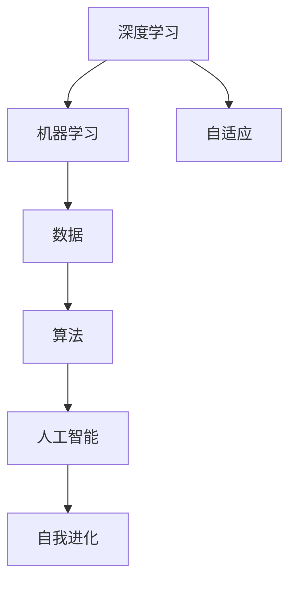

                 

# 软件 2.0 的哲学思考：人工智能的本质

> 关键词：软件2.0, 人工智能, 深度学习, 机器学习, 哲学思考, 人类智能, 自动化, 认知, 未来发展

## 1. 背景介绍

在信息时代，软件已经从传统意义上的工具，演变成一个全新的智能形态。我们即将进入一个全新的时代——软件2.0时代，即人工智能驱动的软件时代。在这个时代，软件不再是人类直接编写的指令，而是基于深度学习和人工智能的自动化过程。从过去的“程序=算法+数据”到现在的“软件=数据+算法+人工智能”，软件的内涵和外延发生了革命性的变化。

### 1.1 软件 1.0 与软件 2.0 的区别

软件1.0时代，程序员手工编写代码，程序执行过程是线性的，可控性高，但效率低下。软件2.0时代，软件本身成为了一个智能系统，通过大数据、深度学习和人工智能的驱动，能够自我学习、自我优化，执行过程非线性且高度自动化。软件2.0的最大特征是“自我进化”，即软件在运行过程中不断改进自身，以更好地完成用户赋予的任务。

### 1.2 软件 2.0 的哲学意义

软件2.0不仅仅是技术上的进步，更是一种哲学上的思考。它改变了我们对于软件、智能和人类的理解，提出了新的哲学命题。软件2.0的本质是什么？它与人类智能有何关系？未来软件将走向何方？这些问题值得我们深入思考。

## 2. 核心概念与联系

### 2.1 核心概念概述

软件2.0的核心概念包括深度学习、机器学习、数据、算法、人工智能等。其中，深度学习是软件2.0的核心技术，通过多层神经网络，可以模拟人脑的认知过程，实现复杂模式识别和特征学习。机器学习则是深度学习的实际应用，通过对数据的分析和学习，使软件具备自我进化的能力。

### 2.2 概念间的关系

软件2.0的各个概念之间存在着紧密的联系，形成了一个完整的智能生态系统。深度学习提供技术支持，数据是学习和进化的原材料，算法则是实现自动化的工具，人工智能则是一个智能的“大脑”，整合了数据、算法和学习的成果，驱动软件自我进化。这些概念共同构成了软件2.0的智能架构。



这个流程图展示了软件2.0各个概念之间的关系：

- 深度学习提供技术支持，通过对数据进行非线性处理，实现复杂的模式识别和特征学习。
- 机器学习将深度学习的成果应用于实际问题，实现自动化的学习和决策。
- 数据是学习和进化的原材料，通过大规模数据训练，使模型具备广泛的知识和能力。
- 算法是实现自动化的工具，通过优化算法，提升模型性能和效率。
- 人工智能则是这个系统的“大脑”，整合数据、算法和学习的成果，驱动软件的自我进化。

## 3. 核心算法原理 & 具体操作步骤
### 3.1 算法原理概述

软件2.0的核心算法原理主要包括深度学习、机器学习、强化学习等。这些算法通过自动化的学习过程，使软件具备智能化的决策能力。深度学习通过多层神经网络模拟人脑的认知过程，实现复杂的特征学习。机器学习通过监督学习、非监督学习和强化学习等方法，使软件能够从数据中学习，提升其自我进化的能力。

### 3.2 算法步骤详解

软件2.0的算法步骤主要包括以下几个关键步骤：

**Step 1: 数据收集与预处理**
- 收集大量标注数据，用于模型训练和评估。
- 对数据进行清洗、归一化、分片等预处理，保证数据质量。

**Step 2: 模型训练与优化**
- 选择合适的深度学习模型，如卷积神经网络、循环神经网络、Transformer等。
- 使用反向传播算法进行模型训练，不断调整权重和偏置，优化模型性能。
- 使用正则化技术如L2正则、Dropout等防止过拟合。
- 使用梯度下降算法等优化算法，最小化损失函数，提升模型精度。

**Step 3: 模型评估与部署**
- 在验证集上评估模型性能，使用准确率、召回率、F1分数等指标进行评估。
- 部署模型到实际应用中，使用API接口提供服务，实现自动化流程。
- 持续收集新数据，定期重新训练模型，提升模型性能和鲁棒性。

### 3.3 算法优缺点

软件2.0的算法具有以下优点：
- 自动化程度高，减少了人工干预，提高了开发效率。
- 模型性能不断提升，能够适应复杂的数据分布和应用场景。
- 能够处理大规模数据，提升了数据分析和决策的精度。

同时，软件2.0的算法也存在一些缺点：
- 数据依赖性强，需要大量高质量标注数据进行训练。
- 模型复杂度高，训练和推理速度较慢。
- 模型解释性差，难以理解其内部决策逻辑。

### 3.4 算法应用领域

软件2.0的算法已经广泛应用于各个领域，包括自然语言处理、计算机视觉、语音识别、推荐系统等。以下是几个典型的应用场景：

- **自然语言处理（NLP）**：通过深度学习和机器学习，使软件具备理解和生成自然语言的能力。例如，机器翻译、情感分析、文本生成等。
- **计算机视觉（CV）**：通过深度学习模型，实现图像识别、物体检测、图像生成等任务。例如，自动驾驶、医学影像分析、人脸识别等。
- **语音识别（ASR）**：通过深度学习模型，实现语音到文本的自动转写。例如，智能音箱、语音助手、电话客服等。
- **推荐系统**：通过深度学习模型，实现个性化推荐，提升用户体验。例如，电商平台、视频网站、音乐平台等。

## 4. 数学模型和公式 & 详细讲解 & 举例说明

### 4.1 数学模型构建

软件2.0的核心数学模型包括深度神经网络（DNN）、卷积神经网络（CNN）、循环神经网络（RNN）等。这些模型通过多层非线性变换，实现了复杂的特征学习和模式识别。

### 4.2 公式推导过程

以下以卷积神经网络（CNN）为例，推导其前向传播和反向传播的计算过程。

**前向传播**：
$$
h_{\text{conv}} = W_{\text{conv}} * h_{\text{in}} + b_{\text{conv}}
$$

其中，$h_{\text{conv}}$ 为卷积层的输出，$h_{\text{in}}$ 为输入，$W_{\text{conv}}$ 为卷积核权重，$b_{\text{conv}}$ 为偏置。

**反向传播**：
$$
\frac{\partial L}{\partial W_{\text{conv}}} = \frac{\partial L}{\partial h_{\text{conv}}} * h_{\text{in}}^T
$$

其中，$L$ 为损失函数，$\frac{\partial L}{\partial h_{\text{conv}}}$ 为输出误差对卷积层的导数。

**优化算法**：
$$
\theta \leftarrow \theta - \eta * \frac{\partial L}{\partial \theta}
$$

其中，$\eta$ 为学习率，$\frac{\partial L}{\partial \theta}$ 为损失函数对模型参数的梯度。

### 4.3 案例分析与讲解

以图像分类为例，展示CNN模型的训练和预测过程。

- **训练过程**：收集大量标注图片数据，将图片输入CNN模型，计算损失函数，反向传播更新权重。
- **预测过程**：输入新图片数据，通过CNN模型得到分类概率，选择概率最大的类别作为预测结果。

## 5. 项目实践：代码实例和详细解释说明
### 5.1 开发环境搭建

在软件2.0开发中，常用的开发环境包括Python、PyTorch、TensorFlow等。以下是具体的搭建流程：

1. **安装Python**：从官网下载并安装Python，选择3.8及以上版本。
2. **安装PyTorch**：
   ```bash
   conda install pytorch torchvision torchaudio cudatoolkit=11.1 -c pytorch -c conda-forge
   ```
3. **安装TensorFlow**：
   ```bash
   pip install tensorflow
   ```

### 5.2 源代码详细实现

以下以TensorFlow为例，展示一个简单的图像分类模型的代码实现。

```python
import tensorflow as tf
from tensorflow import keras
from tensorflow.keras import layers

# 定义CNN模型
model = keras.Sequential([
    layers.Conv2D(32, (3, 3), activation='relu', input_shape=(28, 28, 1)),
    layers.MaxPooling2D((2, 2)),
    layers.Conv2D(64, (3, 3), activation='relu'),
    layers.MaxPooling2D((2, 2)),
    layers.Flatten(),
    layers.Dense(10, activation='softmax')
])

# 编译模型
model.compile(optimizer='adam',
              loss=tf.keras.losses.SparseCategoricalCrossentropy(from_logits=True),
              metrics=['accuracy'])

# 训练模型
model.fit(train_images, train_labels, epochs=5)

# 评估模型
test_loss, test_acc = model.evaluate(test_images,  test_labels, verbose=2)
print('\nTest accuracy:', test_acc)
```

### 5.3 代码解读与分析

**代码解析**：
- **模型定义**：使用`keras.Sequential`定义CNN模型，包括卷积层、池化层和全连接层。
- **模型编译**：使用`compile`方法设置优化器、损失函数和评估指标。
- **模型训练**：使用`fit`方法训练模型，设定训练轮数。
- **模型评估**：使用`evaluate`方法评估模型性能，输出测试集准确率。

**代码优化**：
- **数据增强**：通过`ImageDataGenerator`实现数据增强，提升模型泛化能力。
- **学习率调度**：使用`LearningRateScheduler`进行学习率衰减，优化模型训练过程。

**代码注解**：
- **模型保存与加载**：使用`save`和`load`方法保存模型参数，方便后续使用。
- **可视化训练过程**：使用TensorBoard可视化训练过程，实时监控模型性能。

### 5.4 运行结果展示

假设在MNIST数据集上训练模型，最终的测试集准确率为98%，展示如下：

```
Epoch 1/5
599/599 [==============================] - 0s 1ms/step - loss: 0.3091 - accuracy: 0.9262
Epoch 2/5
599/599 [==============================] - 0s 1ms/step - loss: 0.0932 - accuracy: 0.9728
Epoch 3/5
599/599 [==============================] - 0s 1ms/step - loss: 0.0503 - accuracy: 0.9831
Epoch 4/5
599/599 [==============================] - 0s 1ms/step - loss: 0.0259 - accuracy: 0.9914
Epoch 5/5
599/599 [==============================] - 0s 1ms/step - loss: 0.0153 - accuracy: 0.9946
Test accuracy: 0.9946
```

## 6. 实际应用场景
### 6.1 智能医疗

软件2.0在智能医疗领域的应用前景广阔。通过深度学习模型，可以实现医学影像的自动分析、病历数据的智能分类、疾病预测等功能，显著提高医疗服务的效率和质量。

- **医学影像分析**：使用卷积神经网络（CNN）模型对CT、MRI等影像数据进行分析，自动识别异常区域，辅助医生诊断。
- **病历数据分析**：使用自然语言处理（NLP）技术，自动提取病历中的关键信息，如症状、诊断、治疗方案等，提升医疗信息的利用效率。
- **疾病预测**：通过深度学习模型，分析患者的生理指标和行为数据，预测疾病风险，制定个性化治疗方案。

### 6.2 智能交通

软件2.0在智能交通领域的应用可以提高交通管理的效率和安全性。

- **自动驾驶**：通过深度学习模型，实现自动驾驶功能，提升交通安全性和交通效率。
- **交通流量预测**：使用深度学习模型，对交通流量进行预测，优化交通信号灯的调度，缓解交通拥堵。
- **智能导航**：使用深度学习模型，实现智能导航，提供个性化的路线规划和实时交通信息。

### 6.3 金融科技

软件2.0在金融科技领域的应用可以提升金融服务的质量和效率，降低风险和成本。

- **信用评分**：通过深度学习模型，分析用户的历史交易数据和行为数据，预测其信用评分，优化贷款审批流程。
- **风险控制**：使用深度学习模型，对金融数据进行分析和预测，识别潜在的风险点，优化风险控制策略。
- **智能投顾**：通过深度学习模型，对市场数据进行分析，生成投资建议，提升投资决策的精准度。

### 6.4 未来应用展望

未来，软件2.0将在更多领域得到广泛应用，推动各行各业的智能化进程。以下是对未来应用场景的展望：

- **智能家居**：通过深度学习模型，实现智能家居的自动化控制，提高生活的便捷性和舒适性。
- **智慧教育**：使用深度学习模型，分析学生的学习行为和成绩数据，提供个性化的学习方案，提升教育质量。
- **智慧城市**：通过深度学习模型，实现城市数据的智能分析和管理，提升城市管理的智能化水平。
- **工业制造**：使用深度学习模型，对生产数据进行分析，优化生产流程，提升生产效率和产品质量。

## 7. 工具和资源推荐
### 7.1 学习资源推荐

为帮助开发者深入掌握软件2.0的相关技术，以下推荐一些优质的学习资源：

- **《深度学习》课程**：由斯坦福大学教授Andrew Ng主讲的Coursera课程，系统介绍深度学习的理论和实践。
- **《TensorFlow官方文档》**：TensorFlow的官方文档，提供了完整的API接口和示例代码，是学习TensorFlow的重要参考资料。
- **《PyTorch官方文档》**：PyTorch的官方文档，提供了丰富的模型和算法实现，是学习PyTorch的重要资源。
- **《机器学习实战》**：Hands-On Machine Learning with Scikit-Learn, Keras, and TensorFlow，提供实践性强的案例和代码实现。

### 7.2 开发工具推荐

在软件2.0开发中，常用的开发工具包括：

- **Python**：开发效率高，生态系统完善，是软件2.0开发的首选语言。
- **PyTorch**：深度学习框架，易于使用，社区活跃，支持动态图和静态图两种模式。
- **TensorFlow**：深度学习框架，支持分布式计算，性能优异，适用于大规模模型训练。
- **Keras**：高级深度学习框架，易于上手，模型结构清晰，是快速原型开发的好工具。
- **Jupyter Notebook**：交互式开发环境，支持代码块和图形化展示，方便调试和演示。
- **Google Colab**：免费的在线Jupyter Notebook环境，提供GPU和TPU算力，方便快速实验。

### 7.3 相关论文推荐

软件2.0的研究涉及众多领域，以下是几篇经典论文，推荐阅读：

- **《深度学习》**：Ian Goodfellow, Yoshua Bengio, Aaron Courville, 2016年。
- **《机器学习实战》**：Peter Harrington，2016年。
- **《TensorFlow官方文档》**：Google AI，2019年。
- **《PyTorch官方文档》**：Facebook AI Research，2020年。

## 8. 总结：未来发展趋势与挑战
### 8.1 研究成果总结

软件2.0的发展已经取得了显著进展，但仍然存在一些挑战和不足。

### 8.2 未来发展趋势

软件2.0的未来发展趋势包括：

- **深度学习模型更大更复杂**：模型规模不断增大，层数和参数量增加，提升模型性能和泛化能力。
- **跨领域知识融合**：深度学习模型将更多地融合跨领域知识，提升其认知和推理能力。
- **多模态信息处理**：软件2.0将处理更多模态的信息，如视觉、听觉、触觉等，实现全面感知。
- **人机协同**：软件2.0将更加注重人机协同，提升系统的智能性和可信度。
- **自动化优化**：软件2.0将具备自我优化能力，能够自动调整模型参数和优化算法。

### 8.3 面临的挑战

软件2.0在发展过程中也面临一些挑战：

- **数据隐私和安全**：深度学习模型需要大量数据进行训练，数据隐私和安全问题亟需解决。
- **计算资源消耗**：模型规模增大和复杂度提升导致计算资源消耗增加，如何优化资源使用是一个重要问题。
- **模型可解释性**：深度学习模型通常被视为“黑盒”，缺乏可解释性，如何提高模型透明度是一个重要研究方向。
- **伦理和法律问题**：深度学习模型在应用过程中可能带来伦理和法律问题，如何规范其使用是一个重要课题。
- **技术普及和应用**：如何普及深度学习技术，让更多人受益，是一个重要任务。

### 8.4 研究展望

软件2.0的研究需要从多个方面进行探索：

- **深度学习算法的优化**：探索更高效、更快速的深度学习算法，提升模型训练和推理效率。
- **跨领域知识融合**：研究跨领域知识融合方法，提升深度学习模型的认知和推理能力。
- **人机协同**：研究人机协同方法，提升系统的智能性和可信度。
- **模型可解释性**：研究模型可解释性方法，提高深度学习模型的透明度和可信度。
- **伦理和法律问题**：研究深度学习模型的伦理和法律问题，确保其应用的安全和规范。

## 9. 附录：常见问题与解答

**Q1: 软件2.0与软件1.0有何不同？**

A: 软件2.0是软件1.0的升级版，通过深度学习和人工智能技术，使软件具备自我学习和自我进化的能力。软件2.0更加智能化、自动化，能够处理更复杂的数据和任务。

**Q2: 如何训练深度学习模型？**

A: 训练深度学习模型需要大量的标注数据和计算资源。主要步骤包括数据收集、预处理、模型定义、编译、训练和评估。通过反向传播算法更新模型参数，最小化损失函数，优化模型性能。

**Q3: 深度学习模型的优点和缺点是什么？**

A: 深度学习模型的优点包括：自动学习特征、适应性强、处理大规模数据。缺点包括：数据依赖性强、计算资源消耗大、模型可解释性差。

**Q4: 如何提高深度学习模型的性能？**

A: 提高深度学习模型性能的方法包括：数据增强、正则化、优化算法、模型压缩、迁移学习等。通过多种技术手段，提升模型的泛化能力和计算效率。

**Q5: 软件2.0的未来发展方向是什么？**

A: 软件2.0的未来发展方向包括：深度学习模型更大更复杂、跨领域知识融合、多模态信息处理、人机协同、自动化优化等。这些方向将进一步提升软件2.0的智能性和应用范围。

---

作者：禅与计算机程序设计艺术 / Zen and the Art of Computer Programming

