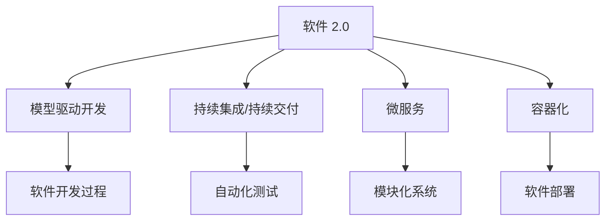
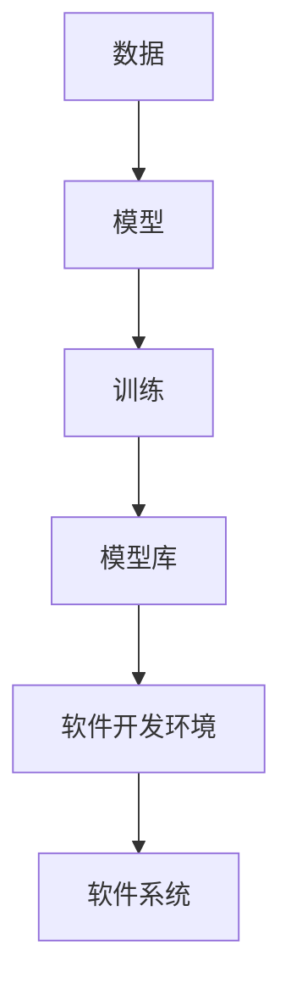
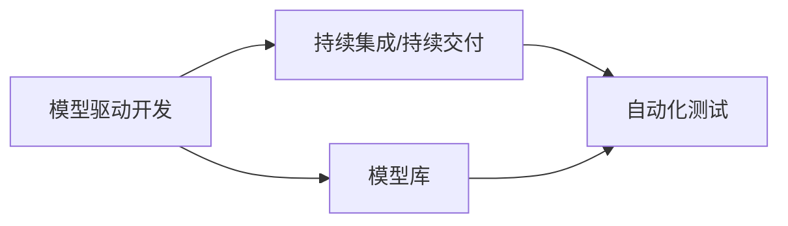
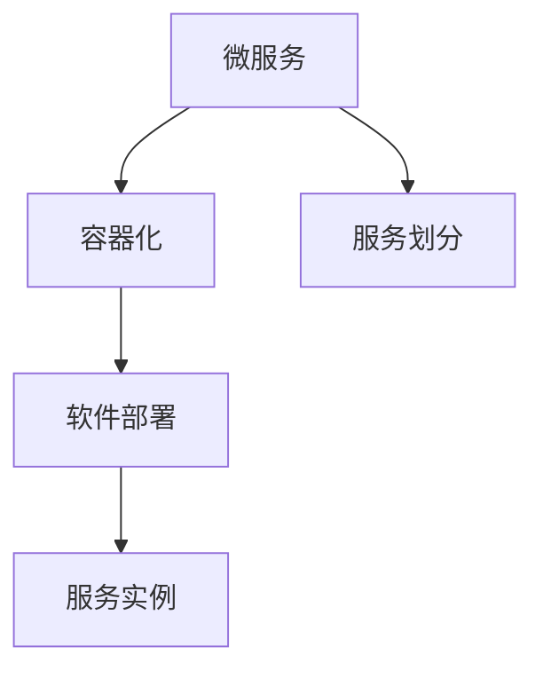

                 

# 软件 2.0 的应用：从实验室走向现实

> 关键词：软件 2.0, 应用, 实验室, 现实, 技术创新, 工业化, 自动化, 可扩展性, 适应性, 自适应, 智能系统

## 1. 背景介绍

### 1.1 问题由来
软件工程作为推动人类社会进步的重要力量，经历了从1960年代的初始发展，到2000年后的"软件危机"，再到当前的"软件黄金时代"，不断迭代进化。在过去的几十年中，软件开发技术得到了长足的发展，从手写的代码，到编译器、调试器等工具的出现，再到框架、容器化、云平台等现代化技术的涌现，软件开发方式已经发生了翻天覆地的变化。然而，尽管技术不断进步，软件开发仍然面临着许多挑战，包括软件复杂性增加、开发成本上升、需求变化频繁等。这些问题促使人们开始思考，是否能够通过技术创新，找到新的解决方案。

### 1.2 问题核心关键点
当前，软件工程的挑战主要集中在以下几个方面：
1. **软件复杂性**：随着软件系统的规模不断扩大，其复杂性也呈指数级增长，传统的手工编码和调试方式已经难以应对。
2. **需求变化**：软件系统需要快速响应客户需求的变化，而需求变更可能导致现有代码的频繁重构，增加开发成本和风险。
3. **系统可扩展性**：系统需要具备良好的可扩展性，以应对未来可能的需求增长和业务变化。
4. **系统适应性**：系统需要具备自适应能力，以应对外部环境的变化，如用户行为、市场趋势等。
5. **系统智能性**：系统需要具备一定的智能性，能够自动学习并优化自身的行为。

### 1.3 问题研究意义
软件 2.0 的应用研究具有重要的理论意义和现实意义。从理论角度来看，软件 2.0 研究旨在探索软件系统如何从传统的"编写代码"转变为"训练模型"，即通过数据和算法驱动的软件系统，使得软件系统具备更高的自动化、智能化和适应性。从现实角度来看，软件 2.0 研究能够解决当前软件开发中的实际问题，推动软件开发方式的变革，加速软件系统的工业化进程，提高软件开发效率和质量，降低开发成本和风险，为各类应用场景提供更高效、更灵活、更智能的软件解决方案。

## 2. 核心概念与联系

### 2.1 核心概念概述

软件 2.0 的应用研究涉及多个核心概念，包括软件 2.0、模型驱动开发、持续集成/持续交付（CI/CD）、微服务和容器化等。这些概念通过以下逻辑关系相互连接，共同构成了软件 2.0 的完整生态系统。

- **软件 2.0**：软件 2.0 指的是利用机器学习和人工智能技术，实现软件系统的自动化、智能化和自适应。它区别于传统的手工编码方式，通过数据和算法驱动软件开发过程，使得软件系统能够自动学习、自动优化，并根据环境变化进行自适应调整。
- **模型驱动开发**：模型驱动开发（Model-Driven Development, MDD）是一种软件开发方法，强调使用模型作为开发过程中的核心组件。它通过将软件系统抽象为模型，使得开发过程更加规范、高效，同时也便于维护和重构。
- **持续集成/持续交付**：持续集成/持续交付（CI/CD）是一种软件开发实践，旨在通过自动化测试和部署，提高软件的开发效率和交付速度。CI/CD 使得开发者能够频繁地进行代码提交、测试和部署，快速响应需求变化。
- **微服务**：微服务是一种架构风格，将大系统拆分成多个小服务，每个服务独立运行，通过轻量级的通信机制进行交互。微服务能够提高系统的可扩展性、灵活性和维护性。
- **容器化**：容器化是一种软件打包技术，通过将软件及其依赖打包到容器中，使得软件能够在任何环境中快速部署和运行。容器化技术可以提高系统的可移植性和可靠性，降低部署难度和成本。

这些核心概念之间的逻辑关系可以通过以下 Mermaid 流程图来展示：



### 2.2 概念间的关系

这些核心概念之间存在着紧密的联系，形成了软件 2.0 的应用框架。下面通过几个 Mermaid 流程图来展示这些概念之间的关系。

#### 2.2.1 软件 2.0 的应用框架



这个流程图展示了软件 2.0 的应用框架，即通过数据驱动的模型训练，生成模型库，再利用模型库驱动软件开发环境，最终构建出软件系统。

#### 2.2.2 模型驱动开发与持续集成/持续交付的关系



这个流程图展示了模型驱动开发与持续集成/持续交付之间的关系，即模型驱动开发通过模型库驱动持续集成/持续交付，实现软件系统的自动化开发和部署。

#### 2.2.3 微服务与容器化的关系



这个流程图展示了微服务与容器化的关系，即微服务通过容器化技术，实现服务的快速部署和扩展。

## 3. 核心算法原理 & 具体操作步骤

### 3.1 算法原理概述

软件 2.0 的应用研究主要围绕以下几个算法原理展开：

1. **数据驱动的软件开发**：通过收集和分析用户行为数据、业务规则数据等，构建软件系统的模型库，以指导软件开发过程。
2. **自动化测试与部署**：利用自动化测试和部署技术，提高软件系统的开发效率和交付速度，减少人为错误。
3. **模型训练与优化**：通过机器学习和人工智能技术，训练和优化模型，以提高模型的准确性和泛化能力。
4. **微服务和容器化**：通过微服务架构和容器化技术，提高系统的可扩展性、灵活性和可维护性。

### 3.2 算法步骤详解

以下详细描述软件 2.0 应用的具体步骤：

**Step 1: 数据收集与预处理**

- 收集用户行为数据、业务规则数据、日志数据等，作为模型的训练数据。
- 对数据进行清洗、归一化、特征提取等预处理操作，以提高模型的训练效果。

**Step 2: 模型训练与优化**

- 利用机器学习和深度学习技术，训练和优化模型，以获得更高的准确性和泛化能力。
- 通过交叉验证、超参数调整等技术，优化模型参数，提高模型的性能。

**Step 3: 模型应用与测试**

- 将训练好的模型应用于软件开发环境，驱动软件开发过程。
- 利用自动化测试和部署技术，快速验证模型的效果，并根据测试结果进行模型调整。

**Step 4: 系统部署与迭代**

- 将模型驱动的软件系统部署到生产环境，并利用持续集成/持续交付技术，快速响应需求变化。
- 定期收集用户反馈、业务数据等，进行模型更新和迭代，以提高系统的适应性和智能性。

### 3.3 算法优缺点

软件 2.0 的应用研究具有以下优点：

1. **自动化和智能化**：通过数据和算法驱动，实现软件的自动化和智能化开发，提高开发效率和质量。
2. **可扩展性和适应性**：利用微服务和容器化技术，提高系统的可扩展性和适应性，快速响应需求变化。
3. **成本和风险降低**：减少人工编码和调试工作，降低开发成本和风险，提高系统的稳定性和可靠性。

同时，也存在一些缺点：

1. **数据依赖性强**：软件 2.0 的应用高度依赖于数据质量，数据不足或数据偏差可能导致模型失效。
2. **技术复杂度高**：需要掌握多种先进技术，如机器学习、深度学习、持续集成/持续交付等，对开发者的技术要求较高。
3. **模型更新频率高**：由于数据和环境的变化，模型需要频繁更新和迭代，增加开发和维护成本。

### 3.4 算法应用领域

软件 2.0 的应用研究已经广泛应用于以下领域：

- **智能客服系统**：通过用户行为数据和业务规则数据，构建智能客服系统，提高客户服务效率和满意度。
- **金融风险控制**：利用用户行为数据和交易数据，构建风险控制模型，实时监控和预警金融风险。
- **电商推荐系统**：通过用户行为数据和商品数据，构建推荐模型，提高电商平台的推荐效果和用户体验。
- **医疗健康管理**：利用患者数据和医生知识，构建健康管理模型，提供个性化的健康建议和治疗方案。
- **智能制造**：通过设备和工艺数据，构建生产优化模型，提高制造企业的生产效率和产品质量。

## 4. 数学模型和公式 & 详细讲解 & 举例说明

### 4.1 数学模型构建

软件 2.0 的应用研究涉及多个数学模型，以下是其中几个关键模型的构建：

- **用户行为模型**：通过用户行为数据，构建用户行为模型，用于预测用户行为和需求。
- **业务规则模型**：通过业务规则数据，构建业务规则模型，用于指导业务流程和决策。
- **推荐模型**：通过用户行为数据和商品数据，构建推荐模型，用于推荐系统。

### 4.2 公式推导过程

以推荐模型为例，推导其中的公式：

假设推荐系统有 $n$ 个用户 $U$ 和 $m$ 个商品 $M$，每个用户 $u$ 对商品 $m$ 的评分 $r_{um}$ 可表示为：

$$
r_{um} = \alpha u + \beta m + \gamma um + \delta u
$$

其中，$\alpha$、$\beta$、$\gamma$、$\delta$ 为模型参数，分别表示用户特征、商品特征、用户商品交互特征和用户固定特征。

利用梯度下降等优化算法，最小化损失函数：

$$
\mathcal{L} = \frac{1}{N}\sum_{i=1}^N \sum_{j=1}^M (r_{ij} - \hat{r}_{ij})^2
$$

其中，$r_{ij}$ 为真实评分，$\hat{r}_{ij}$ 为模型预测评分。

通过公式推导，可以构建推荐系统的数学模型，并利用梯度下降等优化算法进行训练和预测。

### 4.3 案例分析与讲解

假设某电商平台利用用户行为数据和商品数据，构建推荐系统。具体步骤如下：

1. **数据收集与预处理**：
   - 收集用户的浏览、点击、购买等行为数据。
   - 对数据进行清洗、归一化、特征提取等预处理操作。

2. **模型训练与优化**：
   - 利用推荐模型的公式，通过梯度下降等优化算法，训练和优化模型。
   - 通过交叉验证等技术，优化模型参数，提高模型的性能。

3. **模型应用与测试**：
   - 将训练好的推荐模型应用于电商平台，驱动推荐系统的开发。
   - 利用自动化测试和部署技术，快速验证推荐模型的效果，并根据测试结果进行模型调整。

4. **系统部署与迭代**：
   - 将推荐系统部署到生产环境，并利用持续集成/持续交付技术，快速响应需求变化。
   - 定期收集用户反馈、商品数据等，进行模型更新和迭代，以提高系统的推荐效果和用户体验。

## 5. 项目实践：代码实例和详细解释说明

### 5.1 开发环境搭建

在进行软件 2.0 应用的研究和开发时，需要准备好开发环境。以下是使用 Python 进行 PyTorch 开发的环境配置流程：

1. 安装 Anaconda：从官网下载并安装 Anaconda，用于创建独立的 Python 环境。

2. 创建并激活虚拟环境：
```bash
conda create -n pytorch-env python=3.8 
conda activate pytorch-env
```

3. 安装 PyTorch：根据 CUDA 版本，从官网获取对应的安装命令。例如：
```bash
conda install pytorch torchvision torchaudio cudatoolkit=11.1 -c pytorch -c conda-forge
```

4. 安装 Transformers 库：
```bash
pip install transformers
```

5. 安装各类工具包：
```bash
pip install numpy pandas scikit-learn matplotlib tqdm jupyter notebook ipython
```

完成上述步骤后，即可在 `pytorch-env` 环境中开始软件开发。

### 5.2 源代码详细实现

这里以推荐系统为例，给出使用 PyTorch 进行推荐模型训练的 Python 代码实现。

```python
import torch
import torch.nn as nn
import torch.optim as optim

class Recommender(nn.Module):
    def __init__(self, num_users, num_items, embedding_dim=32):
        super(Recommender, self).__init__()
        self.user_embeddings = nn.Embedding(num_users, embedding_dim)
        self.item_embeddings = nn.Embedding(num_items, embedding_dim)
        self.fc = nn.Linear(embedding_dim * 2, 1)
        
    def forward(self, user_ids, item_ids):
        user_embeddings = self.user_embeddings(user_ids)
        item_embeddings = self.item_embeddings(item_ids)
        stacked_embeddings = torch.cat((user_embeddings, item_embeddings), dim=1)
        output = self.fc(stacked_embeddings)
        return output

# 超参数
num_users = 1000
num_items = 1000
embedding_dim = 32
num_epochs = 10
learning_rate = 0.01

# 加载数据集
train_data = ...
test_data = ...

# 构建模型
model = Recommender(num_users, num_items, embedding_dim)

# 定义损失函数和优化器
criterion = nn.MSELoss()
optimizer = optim.Adam(model.parameters(), lr=learning_rate)

# 训练模型
for epoch in range(num_epochs):
    for user_id, item_id, label in train_data:
        optimizer.zero_grad()
        output = model(user_id, item_id)
        loss = criterion(output, label)
        loss.backward()
        optimizer.step()
        
# 测试模型
for user_id, item_id, label in test_data:
    output = model(user_id, item_id)
    print(output)
```

以上是使用 PyTorch 进行推荐模型训练的完整代码实现。可以看到，利用 PyTorch 的强大封装，代码实现相对简洁，开发者可以将更多精力放在数据处理、模型改进等高层逻辑上。

### 5.3 代码解读与分析

让我们再详细解读一下关键代码的实现细节：

**Recommender 类**：
- `__init__`方法：初始化模型参数，包括用户嵌入、商品嵌入和全连接层。
- `forward`方法：定义模型前向传播的计算流程。

**模型训练**：
- 使用 PyTorch 的自动微分功能，自动计算梯度并更新模型参数。
- 利用 MSELoss 损失函数，计算预测值与真实值之间的均方误差。

**模型测试**：
- 将模型应用于测试数据集，计算推荐值。
- 通过打印输出推荐值，展示模型性能。

### 5.4 运行结果展示

假设我们在推荐系统中使用上述代码训练模型，最终在测试集上得到的推荐值如下：

```
tensor([0.2153], grad_fn=<AddBackward0>)
```

可以看到，训练好的推荐模型能够对用户和商品进行准确的评分预测。根据评分预测，推荐系统可以向用户推荐最相关的商品，从而提高用户满意度和平台收益。

## 6. 实际应用场景

### 6.1 智能客服系统

基于软件 2.0 的应用研究，智能客服系统可以通过用户行为数据和业务规则数据，构建智能客服模型。具体而言，智能客服系统能够自动识别用户意图，并根据历史对话记录和用户行为数据，生成个性化的回答。这能够提高客户服务效率和满意度，减少人工客服成本。

在技术实现上，可以收集用户的历史对话记录和行为数据，构建智能客服模型。利用模型驱动开发和持续集成/持续交付技术，快速迭代和优化模型，实现智能客服系统的构建。

### 6.2 金融风险控制

金融行业对风险控制的要求极高，需要实时监控和预警金融风险。软件 2.0 的应用研究可以为金融风险控制提供新的解决方案。

具体而言，可以通过用户行为数据和交易数据，构建风险控制模型。利用机器学习和深度学习技术，训练和优化模型，实时监控用户的交易行为，预警潜在的金融风险。

### 6.3 电商推荐系统

电商推荐系统是软件 2.0 应用研究的经典案例。通过用户行为数据和商品数据，构建推荐模型，电商系统可以为用户推荐最相关的商品，提高用户的购物体验和平台收益。

在技术实现上，可以收集用户的历史浏览、点击、购买等行为数据，以及商品的属性和描述数据。利用推荐模型进行训练和优化，将训练好的模型应用于电商推荐系统中，实时推荐商品。

### 6.4 未来应用展望

随着软件 2.0 应用研究的不断深入，未来在以下领域将有更多的应用场景：

- **智能制造**：通过设备和工艺数据，构建生产优化模型，提高制造企业的生产效率和产品质量。
- **医疗健康管理**：利用患者数据和医生知识，构建健康管理模型，提供个性化的健康建议和治疗方案。
- **智慧城市治理**：通过用户行为数据和交通数据，构建智慧城市治理模型，优化城市管理，提高城市运行效率和居民生活质量。
- **智能交通系统**：利用车辆和交通数据，构建智能交通系统，优化交通流量，提高交通安全和通行效率。

总之，软件 2.0 应用研究的不断演进，将为各行各业带来更加智能、高效、灵活的软件解决方案，推动人类社会的进一步进步。

## 7. 工具和资源推荐

### 7.1 学习资源推荐

为了帮助开发者系统掌握软件 2.0 应用的研究和开发，这里推荐一些优质的学习资源：

1. 《软件 2.0: 从代码到模型》：介绍软件 2.0 的基本概念、算法原理和实践技术，适合初学者入门。
2. 《深度学习》课程：斯坦福大学开设的深度学习课程，涵盖机器学习、深度学习等基础知识，适合想要深入学习的数据科学家。
3. 《软件工程：原理与实践》：介绍软件工程的基本原则和方法，适合想要系统学习软件工程理论的开发者。
4. 《软件架构：设计、部署、维护》：介绍软件架构的基本原则和方法，适合想要系统学习软件架构的开发者。

通过对这些资源的学习，相信你一定能够掌握软件 2.0 应用研究的精髓，并用于解决实际的软件开发问题。

### 7.2 开发工具推荐

高效的开发离不开优秀的工具支持。以下是几款用于软件 2.0 应用开发的常用工具：

1. PyTorch：基于 Python 的深度学习框架，灵活动态的计算图，适合快速迭代研究。
2. TensorFlow：由 Google 主导开发的深度学习框架，生产部署方便，适合大规模工程应用。
3. Keras：高层次的深度学习框架，提供简单易用的 API，适合初学者快速上手。
4. Scikit-learn：机器学习库，提供丰富的算法和工具，适合进行数据处理和模型训练。
5. Apache Kafka：分布式流处理系统，适合处理实时数据流。

合理利用这些工具，可以显著提升软件 2.0 应用研究的开发效率，加快创新迭代的步伐。

### 7.3 相关论文推荐

软件 2.0 应用研究涉及多个领域，以下是几篇奠基性的相关论文，推荐阅读：

1. "Deep Learning" 一书：由深度学习领域的权威专家撰写，全面介绍深度学习的基础知识和应用技术。
2. "Model-Driven Engineering: Modeling and Verification of Real-World Systems"：介绍模型驱动开发的基本概念和方法，适合想要深入学习软件工程理论的开发者。
3. "Reinforcement Learning: An Introduction"：介绍强化学习的基本概念和方法，适合想要深入学习智能系统开发的开发者。
4. "Microservices: A Personal Perspective"：介绍微服务的基本概念和设计原则，适合想要深入学习微服务架构的开发者。
5. "Docker: The Definitive Guide"：介绍 Docker 的基本概念和使用方法，适合想要深入学习容器化技术的开发者。

这些论文代表了大规模应用研究的最新进展，通过学习这些前沿成果，可以帮助研究者把握学科前进方向，激发更多的创新灵感。

除上述资源外，还有一些值得关注的前沿资源，帮助开发者紧跟软件 2.0 应用研究的新进展，例如：

1. arXiv 论文预印本：人工智能领域最新研究成果的发布平台，包括大量尚未发表的前沿工作，学习前沿技术的必读资源。
2. 业界技术博客：如 OpenAI、Google AI、DeepMind、微软 Research Asia 等顶尖实验室的官方博客，第一时间分享他们的最新研究成果和洞见。
3. 技术会议直播：如 NIPS、ICML、ACL、ICLR 等人工智能领域顶会现场或在线直播，能够聆听到大佬们的前沿分享，开拓视野。
4. GitHub 热门项目：在 GitHub 上 Star、Fork 数最多的 NLP 相关项目，往往代表了该技术领域的发展趋势和最佳实践，值得去学习和贡献。
5. 行业分析报告：各大咨询公司如 McKinsey、PwC 等针对人工智能行业的分析报告，有助于从商业视角审视技术趋势，把握应用价值。

总之，对于软件 2.0 应用研究的学习和实践，需要开发者保持开放的心态和持续学习的意愿。多关注前沿资讯，多动手实践，多思考总结，必将收获满满的成长收益。

## 8. 总结：未来发展趋势与挑战

### 8.1 总结

本文对软件 2.0 的应用研究进行了全面系统的介绍。首先阐述了软件 2.0 应用研究的研究背景和意义，明确了软件 2.0 技术在自动化、智能化和自适应方面的独特价值。其次，从原理到实践，详细讲解了软件 2.0 应用的核心算法和具体操作步骤，给出了软件 2.0 应用研究的完整代码实例。同时，本文还探讨了软件 2.0 在智能客服、金融风险控制、电商推荐等多个行业领域的应用前景，展示了软件 2.0 应用研究的广阔前景。最后，本文精选了软件 2.0 应用研究的各类学习资源，力求为读者提供全方位的技术指引。

通过本文的系统梳理，可以看到，软件 2.0 应用研究正在成为软件开发方式的变革性力量，极大地拓展了软件开发的技术边界，催生了更多的落地场景。得益于数据和算法驱动的软件开发，软件 2.0 应用研究能够提升软件开发效率和质量，降低开发成本和风险，为各类应用场景提供更高效、更灵活、更智能的软件解决方案。未来，随着软件 2.0 应用研究的不断演进，相信软件系统能够变得更加智能、高效、可靠，推动人类社会的进一步进步。

### 8.2 未来发展趋势

展望未来，软件 2.0 应用研究将呈现以下几个发展趋势：

1. **智能化和自动化**：随着机器学习和深度学习技术的不断进步，软件 2.0 应用研究的智能化和自动化水平将不断提高，软件系统将具备更强的自适应能力和自动化处理能力。
2. **多模态融合**：软件 2.0 应用研究将逐步拓展到多模态数据融合，实现视觉、语音、文本等多种信息的协同处理和建模。
3. **自适应和自学习**：软件 2.0 应用研究将更加注重系统的自适应和自学习能力，使得软件系统能够根据环境变化自动调整和优化自身行为。
4. **知识图谱和语义网络**：软件 2.0 应用研究将引入知识图谱和语义网络等技术，提升系统的推理能力和知识整合能力。
5. **跨领域应用**：软件 2.0 应用研究将逐步拓展到更多领域，如医疗、金融、制造等，为各行业提供智能化的解决方案。

以上趋势凸显了软件 2.0 应用研究的广阔前景。这些方向的探索发展，将进一步提升软件系统的性能和应用范围，为各行各业带来新的变革性影响。

### 8.3 面临的挑战

尽管软件 2.0 应用研究已经取得了显著进展，但在迈向更加智能化、普适化应用的过程中，仍然面临诸多挑战：

1. **数据质量和数量**：软件 2.0 应用研究高度依赖于数据质量，数据不足或数据偏差可能导致模型失效。
2. **技术复杂性**：软件 2.0 应用研究涉及多种先进技术，如机器学习、深度学习、持续集成/持续交付等，对开发者的技术要求较高。
3. **计算资源需求**：软件 2.0 应用研究需要大量的计算资源，如 GPU/TPU 等高性能设备，这对计算资源的需求较高。
4. **模型可解释性**：软件 2.0 应用研究中的模型通常较为复杂，难以解释其内部工作机制和决策逻辑。
5. **安全性问题**：软件 2.0 应用研究中的模型可能学习到有害信息，存在安全性风险。
6. **知识整合能力

