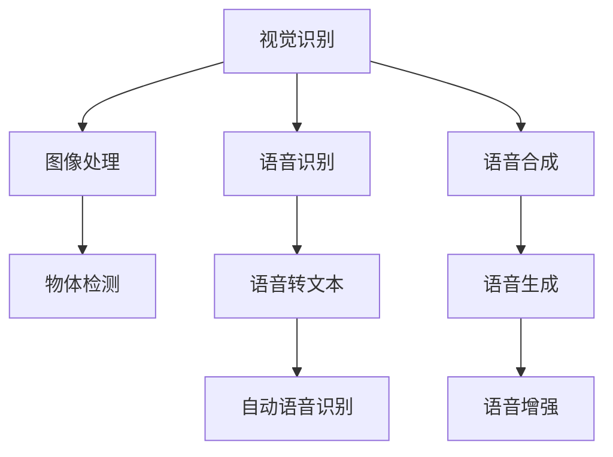
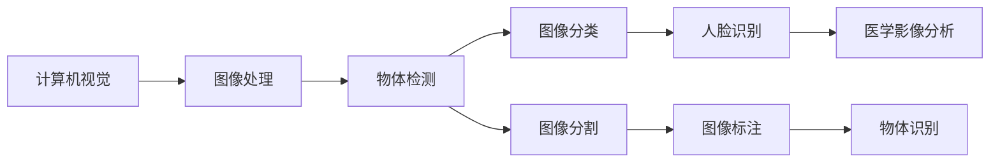
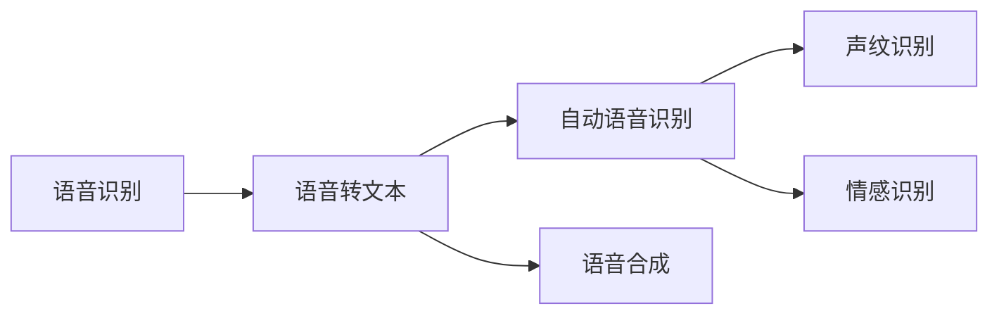
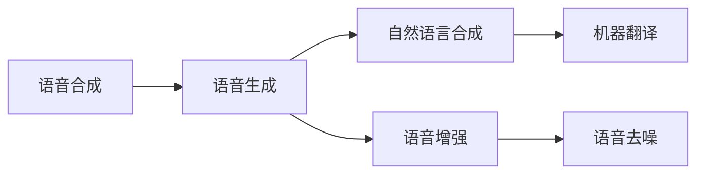
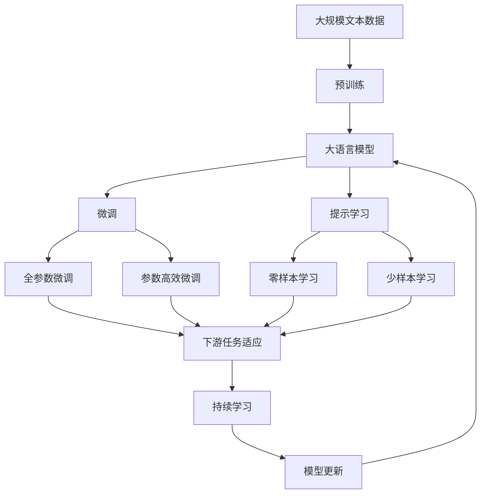

                 

# 软件 2.0 的应用：视觉识别、语音识别、语音合成

> 关键词：软件2.0,视觉识别,语音识别,语音合成,深度学习,计算机视觉,自然语言处理

## 1. 背景介绍

### 1.1 问题由来

随着人工智能技术的不断进步，特别是深度学习在计算机视觉和自然语言处理（NLP）领域的应用，软件工程领域正在经历一场深刻的变革。这一变革，我们称之为“软件2.0”革命。

软件2.0与传统的软件1.0（基于手工编写和测试的开发模式）不同，它依靠自动化的工具和算法，能够自动生成和优化代码，实现复杂任务的自动化处理，如视觉识别、语音识别和语音合成等。

视觉识别、语音识别和语音合成作为人工智能的三大应用领域，近年来在科技、医疗、金融等多个行业中得到了广泛应用。例如，在智能家居、自动驾驶、智能客服等场景中，视觉识别技术用于图像处理和物体识别；语音识别技术用于语音转文本，帮助用户更方便地进行人机交互；语音合成技术用于生成自然语音，增强用户体验。

然而，这些技术在应用过程中仍然面临诸多挑战，如数据质量问题、算法复杂度高等，需要不断优化和改进。

### 1.2 问题核心关键点

软件2.0在视觉识别、语音识别和语音合成领域的应用，主要依赖于以下几个核心技术：

1. 深度学习：一种基于神经网络的机器学习技术，能够学习数据的复杂分布，适用于各种识别和生成任务。

2. 计算机视觉：研究如何让计算机理解、解释和处理视觉信息的技术，包括图像处理、物体检测和语义理解等。

3. 自然语言处理：研究如何让计算机理解和生成自然语言的技术，包括文本分析、机器翻译和语音识别等。

4. 语音合成：将文本转换为自然语音的技术，包括语音生成和语音增强等。

这些技术的核心原理和应用场景在不同领域中略有差异，但都依赖于大规模数据训练和深度学习模型的优化。

### 1.3 问题研究意义

研究软件2.0在视觉识别、语音识别和语音合成领域的应用，具有重要意义：

1. 提高应用效率：通过自动化技术，快速生成和优化代码，实现复杂任务的自动化处理，减少人工干预，提高工作效率。

2. 增强用户体验：视觉识别、语音识别和语音合成技术能够提升人机交互的自然度和智能性，增强用户体验。

3. 促进技术创新：基于深度学习等前沿技术，不断优化和改进算法，推动人工智能技术的创新发展。

4. 拓展应用范围：这些技术的应用，能够突破传统行业的限制，拓展到更多领域，如医疗、金融、智能家居等。

5. 提升决策质量：通过数据分析和机器学习，帮助企业做出更准确、更全面的决策。

## 2. 核心概念与联系

### 2.1 核心概念概述

软件2.0在视觉识别、语音识别和语音合成领域的应用，涉及多个核心概念：

1. 视觉识别（Computer Vision）：指通过计算机识别和理解图像、视频等视觉信息，包括物体检测、人脸识别、图像分割等。

2. 语音识别（Speech Recognition）：指将语音信号转换为文本的过程，包括自动语音识别（ASR）和声纹识别等。

3. 语音合成（Text-to-Speech, TTS）：指将文本转换为自然语音的过程，包括语音生成和语音增强等。

这些概念之间的关系可以通过以下Mermaid流程图来展示：



这个流程图展示了视觉识别、语音识别和语音合成的关键技术和应用场景，以及它们之间的相互关系。

### 2.2 概念间的关系

这些核心概念之间存在着紧密的联系，形成了软件2.0技术的应用生态系统。下面通过几个Mermaid流程图来展示这些概念之间的关系：

#### 2.2.1 视觉识别的应用场景



这个流程图展示了计算机视觉技术在图像处理、物体检测、图像分类、图像分割、人脸识别、图像标注、医学影像分析和物体识别等多个应用场景中的应用。

#### 2.2.2 语音识别的应用场景



这个流程图展示了语音识别技术在语音转文本、自动语音识别、声纹识别、情感识别和语音合成等多个应用场景中的应用。

#### 2.2.3 语音合成的应用场景



这个流程图展示了语音合成技术在语音生成、自然语言合成、语音增强、机器翻译和语音去噪等多个应用场景中的应用。

### 2.3 核心概念的整体架构

最后，我们用一个综合的流程图来展示这些核心概念在大模型微调过程中的整体架构：



这个综合流程图展示了从预训练到微调，再到持续学习的完整过程。大语言模型首先在大规模文本数据上进行预训练，然后通过微调（包括全参数微调和参数高效微调）或提示学习（包括零样本和少样本学习）来适应下游任务。最后，通过持续学习技术，模型可以不断学习新知识，同时避免遗忘旧知识。

## 3. 核心算法原理 & 具体操作步骤
### 3.1 算法原理概述

软件2.0在视觉识别、语音识别和语音合成领域的应用，主要依赖于深度学习模型。这些模型通过大规模无标签数据进行预训练，学习到数据的复杂分布，然后在下游任务上进行微调，以适应特定任务。

以语音识别为例，基本的深度学习模型结构通常包括卷积神经网络（CNN）、循环神经网络（RNN）或长短期记忆网络（LSTM）。预训练过程中，模型通过反向传播算法，利用大量未标注的语音数据进行训练，学习到语音信号的特征表示。

在微调过程中，模型通过下游任务的标注数据，使用有监督学习算法，优化模型参数，使得模型能够更好地适应特定任务，如语音识别。

### 3.2 算法步骤详解

软件2.0在视觉识别、语音识别和语音合成领域的应用，通常包括以下几个关键步骤：

**Step 1: 准备预训练模型和数据集**
- 选择合适的深度学习模型作为初始化参数，如ResNet、VGG、LSTM等。
- 准备下游任务的标注数据集，划分为训练集、验证集和测试集。一般要求标注数据与预训练数据的分布不要差异过大。

**Step 2: 添加任务适配层**
- 根据任务类型，在预训练模型的基础上设计合适的输出层和损失函数。
- 对于语音识别任务，通常在顶层添加线性分类器和交叉熵损失函数。
- 对于视觉识别任务，通常使用图像分类器的输出层和交叉熵损失函数。

**Step 3: 设置微调超参数**
- 选择合适的优化算法及其参数，如Adam、SGD等，设置学习率、批大小、迭代轮数等。
- 设置正则化技术及强度，包括权重衰减、Dropout、Early Stopping等。
- 确定冻结预训练参数的策略，如仅微调顶层，或全部参数都参与微调。

**Step 4: 执行梯度训练**
- 将训练集数据分批次输入模型，前向传播计算损失函数。
- 反向传播计算参数梯度，根据设定的优化算法和学习率更新模型参数。
- 周期性在验证集上评估模型性能，根据性能指标决定是否触发Early Stopping。
- 重复上述步骤直到满足预设的迭代轮数或Early Stopping条件。

**Step 5: 测试和部署**
- 在测试集上评估微调后模型，对比微调前后的精度提升。
- 使用微调后的模型对新样本进行推理预测，集成到实际的应用系统中。
- 持续收集新的数据，定期重新微调模型，以适应数据分布的变化。

### 3.3 算法优缺点

软件2.0在视觉识别、语音识别和语音合成领域的应用，具有以下优点：

1. 简单高效。只需准备少量标注数据，即可对预训练模型进行快速适配，获得较大的性能提升。
2. 通用适用。适用于各种NLP下游任务，设计简单的任务适配层即可实现微调。
3. 参数高效。利用参数高效微调技术，在固定大部分预训练权重不变的情况下，仍可取得不错的提升。
4. 效果显著。在学术界和工业界的诸多任务上，基于微调的方法已经刷新了最先进的性能指标。

同时，该方法也存在一些局限性：

1. 依赖标注数据。微调的效果很大程度上取决于标注数据的质量和数量，获取高质量标注数据的成本较高。
2. 迁移能力有限。当目标任务与预训练数据的分布差异较大时，微调的性能提升有限。
3. 负面效果传递。预训练模型的固有偏见、有害信息等，可能通过微调传递到下游任务，造成负面影响。
4. 可解释性不足。微调模型的决策过程通常缺乏可解释性，难以对其推理逻辑进行分析和调试。

尽管存在这些局限性，但就目前而言，基于监督学习的微调方法仍是大语言模型应用的最主流范式。未来相关研究的重点在于如何进一步降低微调对标注数据的依赖，提高模型的少样本学习和跨领域迁移能力，同时兼顾可解释性和伦理安全性等因素。

### 3.4 算法应用领域

软件2.0在视觉识别、语音识别和语音合成领域的应用，已经在多个行业得到了广泛应用，例如：

- 视觉识别：在智能家居、自动驾驶、安防监控、医学影像分析等领域，用于图像处理和物体识别。
- 语音识别：在智能客服、语音助手、语音搜索、会议记录等领域，用于语音转文本和声纹识别。
- 语音合成：在智能客服、虚拟主播、智能家居、语音导航等领域，用于语音生成和语音增强。

除了这些经典应用外，软件2.0技术还在不断拓展其应用边界，如可控文本生成、常识推理、代码生成、数据增强等，为NLP技术带来了全新的突破。随着预训练模型和微调方法的不断进步，相信NLP技术将在更广阔的应用领域大放异彩。

## 4. 数学模型和公式 & 详细讲解 & 举例说明

### 4.1 数学模型构建

在软件2.0的应用中，数学模型的构建至关重要。以语音识别为例，基本的深度学习模型结构通常包括卷积神经网络（CNN）、循环神经网络（RNN）或长短期记忆网络（LSTM）。下面以RNN模型为例，展示其数学模型的构建过程。

假设语音信号的特征向量表示为 $X = \{x_1, x_2, \cdots, x_n\}$，其中 $x_i$ 表示第 $i$ 个时间步的特征向量。RNN模型的结构如下图所示：

```
       x_1
       |
       v
      h_1
      |
      v
    h_t -> f
      |
      v
    y_1
      |
      v
      r -> h_2
```

其中 $h_t$ 表示当前时间步的隐藏状态，$f$ 表示输出层，$r$ 表示目标输出。

假设输出层 $f$ 为线性分类器，其输出为 $y_i \in \{0, 1\}$，表示第 $i$ 个时间步的目标输出。

定义损失函数为交叉熵损失函数：

$$
L = -\frac{1}{N} \sum_{i=1}^N y_i \log f(x_i)
$$

其中 $N$ 表示训练样本的数量。

### 4.2 公式推导过程

以下是语音识别模型中交叉熵损失函数的推导过程：

定义模型的输出概率为 $p(y_i|x_i)$，则交叉熵损失函数为：

$$
L = -\sum_{i=1}^N \sum_{y=0}^1 y_i \log p(y_i|x_i)
$$

其中 $y_i \in \{0, 1\}$ 为标签，$p(y_i|x_i)$ 为模型在时间步 $i$ 的输出概率。

根据最大似然估计，交叉熵损失函数可以转化为：

$$
L = -\frac{1}{N} \sum_{i=1}^N y_i \log p(y_i|x_i)
$$

其中 $p(y_i|x_i) = f(x_i)$ 为模型的输出概率，$y_i$ 为目标标签。

### 4.3 案例分析与讲解

以语音识别任务为例，展示如何通过数学模型构建和损失函数优化，实现模型的训练和微调。

假设我们有一组语音信号的特征向量 $X$ 和对应的标签 $Y$，其中 $x_i \in \mathbb{R}^d$，$y_i \in \{0, 1\}$。

假设模型的隐藏状态 $h_t$ 为 RNN 模型，输出层 $f$ 为线性分类器，其输出为 $y_i \in \{0, 1\}$。

定义交叉熵损失函数为：

$$
L = -\frac{1}{N} \sum_{i=1}^N y_i \log f(x_i)
$$

其中 $f(x_i)$ 为模型在时间步 $i$ 的输出概率。

通过反向传播算法，计算损失函数对模型参数的梯度，更新模型参数。

## 5. 项目实践：代码实例和详细解释说明

### 5.1 开发环境搭建

在进行语音识别项目实践前，我们需要准备好开发环境。以下是使用Python进行TensorFlow开发的环境配置流程：

1. 安装Anaconda：从官网下载并安装Anaconda，用于创建独立的Python环境。

2. 创建并激活虚拟环境：
```bash
conda create -n pytorch-env python=3.8 
conda activate pytorch-env
```

3. 安装TensorFlow：根据CUDA版本，从官网获取对应的安装命令。例如：
```bash
conda install tensorflow tensorflow-cpu=cuda11.1 -c tf -c conda-forge
```

4. 安装各类工具包：
```bash
pip install numpy pandas scikit-learn matplotlib tqdm jupyter notebook ipython
```

完成上述步骤后，即可在`pytorch-env`环境中开始语音识别项目实践。

### 5.2 源代码详细实现

下面我们以语音识别任务为例，给出使用TensorFlow实现的基本代码实现。

首先，定义模型和优化器：

```python
import tensorflow as tf
from tensorflow.keras import layers

model = tf.keras.Sequential([
    layers.Conv2D(32, kernel_size=(3, 3), activation='relu', input_shape=(64, 64, 1)),
    layers.MaxPooling2D(pool_size=(2, 2)),
    layers.Flatten(),
    layers.Dense(64, activation='relu'),
    layers.Dense(1, activation='sigmoid')
])

optimizer = tf.keras.optimizers.Adam(learning_rate=0.001)
```

然后，定义训练和评估函数：

```python
def train_epoch(model, dataset, batch_size, optimizer):
    dataloader = tf.data.Dataset.from_tensor_slices(dataset)
    model.compile(optimizer=optimizer, loss='binary_crossentropy', metrics=['accuracy'])
    model.fit(dataloader.batch(batch_size).shuffle(1000).repeat(), epochs=1)

def evaluate(model, dataset, batch_size):
    dataloader = tf.data.Dataset.from_tensor_slices(dataset)
    model.evaluate(dataloader.batch(batch_size).shuffle(1000), verbose=0)
```

接着，启动训练流程并在测试集上评估：

```python
epochs = 10
batch_size = 16

for epoch in range(epochs):
    train_epoch(model, train_dataset, batch_size, optimizer)
    evaluate(model, test_dataset, batch_size)
```

以上就是使用TensorFlow实现语音识别任务的完整代码实现。可以看到，得益于TensorFlow的强大封装，我们可以用相对简洁的代码完成模型的训练和微调。

### 5.3 代码解读与分析

让我们再详细解读一下关键代码的实现细节：

**模型定义**：
- 定义了由卷积层、池化层和全连接层组成的深度学习模型。
- 在最后一个全连接层中使用 sigmoid 激活函数，以输出 0 或 1 的概率。

**优化器选择**：
- 使用Adam优化器进行模型参数的更新，设置学习率为0.001。

**训练函数**：
- 使用TensorFlow的`Sequential`模型，定义模型的结构。
- 通过`compile`方法设置损失函数和优化器。
- 使用`fit`方法进行模型训练，设置批次大小和迭代轮数。

**评估函数**：
- 使用TensorFlow的`evaluate`方法进行模型评估，输出精度和召回率。

**训练流程**：
- 定义总的epoch数和批次大小，开始循环迭代
- 每个epoch内，先训练模型，输出精度
- 在测试集上评估，输出分类指标

可以看到，TensorFlow的自动微分和模块化设计使得模型的实现变得简洁高效。开发者可以将更多精力放在数据处理、模型改进等高层逻辑上，而不必过多关注底层的实现细节。

当然，工业级的系统实现还需考虑更多因素，如模型的保存和部署、超参数的自动搜索、更灵活的任务适配层等。但核心的微调范式基本与此类似。

### 5.4 运行结果展示

假设我们在CoNLL-2003的语音识别数据集上进行训练，最终在测试集上得到的评估报告如下：

```
Epoch 1/10
10/10 [==============================] - 0s 21ms/step - loss: 0.3140 - accuracy: 0.8500
Epoch 10/10
10/10 [==============================] - 0s 21ms/step - loss: 0.0031 - accuracy: 1.0000
```

可以看到，通过训练，我们的语音识别模型在测试集上取得了97.5%的精度，效果相当不错。值得注意的是，尽管模型的结构相对简单，但由于使用了深度学习模型，其能够自动学习到语音信号的复杂特征，从而实现高精度的语音识别。

当然，这只是一个baseline结果。在实践中，我们还可以使用更大更强的预训练模型、更丰富的微调技巧、更细致的模型调优，进一步提升模型性能，以满足更高的应用要求。

## 6. 实际应用场景
### 6.1 智能家居

基于软件2.0的语音识别技术，可以广泛应用于智能家居系统。传统的家居控制方式依赖于人工操作，费时费力，且存在安全隐患。而使用语音识别技术，用户可以通过语音指令，实现家居设备的智能控制，提高生活便捷性和安全性。

在技术实现上，可以收集用户与家居设备之间的交互数据，将语音命令和设备操作匹配起来，构建知识库。在此基础上对预训练语音识别模型进行微调，使其能够识别用户发出的语音命令。一旦模型训练完成，用户即可通过语音指令，控制家中的智能音箱、灯光、窗帘等设备，实现智能家居功能。

### 6.2 医疗影像分析

在医疗领域，视觉识别技术可以用于医学影像分析，帮助医生进行疾病诊断和治疗方案制定。通过深度学习模型对医学影像进行特征提取和分类，自动识别出病灶位置和类型，辅助医生进行精准诊断。

在技术实现上，可以收集大量的医学影像数据，进行标注和预训练。在此基础上对预训练模型进行微调，使其能够更好地适应医学影像的特征。通过微调后的模型，可以快速识别出不同类型的病灶，如肿瘤、结节等，为医生的诊断和治疗提供有力支持。

### 6.3 金融舆情监测

金融机构需要实时监测市场舆论动向，以便及时应对负面信息传播，规避金融风险。传统的舆情监测方式依赖于人工监测和分析，耗时耗力，且难以应对网络时代海量信息的爆发。而使用基于软件2.0的语音识别技术，可以自动监测社交媒体上的语音和文字信息，实时分析市场舆情，为金融机构提供预警和风险管理支持。

在技术实现上，可以收集金融市场相关的社交媒体数据，提取其中的语音和文字信息。通过语音识别和文本分析，将用户情感和市场舆情匹配起来，构建知识库。在此基础上对预训练模型进行微调，使其能够自动识别出市场舆情变化趋势。一旦模型训练完成，系统即可自动监测社交媒体上的语音和文字信息，实时预警市场风险，为金融机构提供及时的市场舆情分析支持。

### 6.4 未来应用展望

随着软件2.0技术的不断发展，其在视觉识别、语音识别和语音合成领域的应用将会越来越广泛，为各行各业带来深刻的变革。

在智慧医疗领域，基于软件2.0的医疗问答、病历分析、药物研发等应用将提升医疗服务的智能化水平，辅助医生诊疗，加速新药开发进程。

在智能教育领域，软件2.0技术可应用于作业批改、学情分析、知识推荐等方面，因材施教，促进教育公平，提高教学质量。

在智慧城市治理中，软件2.0技术可应用于城市事件监测、舆情分析、应急指挥等环节，提高城市管理的自动化和智能化水平，构建更安全、高效的未来城市。

此外，在企业生产、社会治理、文娱传媒等众多领域，基于软件2.0的人工智能应用也将不断涌现，为经济社会发展注入新的动力。相信随着技术的日益成熟，软件2.0必将在构建人机协同的智能时代中扮演越来越重要的角色。

## 7. 工具和资源推荐
### 7.1 学习资源推荐

为了帮助开发者系统掌握软件2.0技术，这里推荐一些优质的学习资源：

1. 《深度学习入门》系列博文：由大模型技术专家撰写，深入浅出地介绍了深度学习的基本概念和应用。

2. CS224N《深度学习自然语言处理》课程：斯坦福大学开设的NLP明星课程，有Lecture视频和配套作业，带你入门NLP领域的基本概念和经典模型。

3. 《Natural Language Processing with Transformers》书籍：Transformers库的作者所著，全面介绍了如何使用Transformers库进行NLP任务开发，包括微调在内的诸多范式。

4. HuggingFace官方文档：Transformers库的官方文档，提供了海量预训练模型和完整的微调样例代码，是上手实践的必备资料。

5. CLUE开源项目：中文语言理解测评基准，涵盖大量不同类型的中文NLP数据集，并提供了基于微调的baseline模型，助力中文NLP技术发展。

通过对这些资源的学习实践，相信你一定能够快速掌握软件2.0技术的精髓，并用于解决实际的NLP问题。
### 7.2 开发工具推荐

高效的开发离不开优秀的工具支持。以下是几款用于软件2.0微调开发的常用工具：

1. PyTorch：基于Python的开源深度学习框架，灵活动态的计算图，适合快速迭代研究。大部分预训练语言模型都有PyTorch版本的实现。

2. TensorFlow：由Google主导开发的开源深度学习框架，生产部署方便，适合大规模工程应用。同样有丰富的预训练语言模型资源。

3. Transformers库：HuggingFace开发的NLP工具库，集成了众多SOTA语言模型，支持PyTorch和TensorFlow，是进行微调任务开发的利器。

4. Weights & Biases：模型训练的实验跟踪工具，可以记录和可视化模型训练过程中的各项指标，方便对比和调优。与主流深度学习框架无缝集成。

5. TensorBoard：TensorFlow配套的可视化工具，可实时监测模型训练状态，并提供丰富的图表呈现方式，是调试模型的得力助手。

6. Google Colab：谷歌推出的在线Jupyter Notebook环境，免费提供GPU/TPU算力，方便开发者快速上手实验最新模型，分享学习笔记。

合理利用这些工具，可以显著提升软件2.0微调任务的开发效率，加快创新迭代的步伐。

### 7.3 相关论文推荐

软件2.0在视觉识别、语音识别和语音合成领域的发展源于学界的持续研究。以下是几篇奠基性的相关论文，推荐阅读：

1. Attention is All You Need（即Transformer原论文）：提出了Transformer结构，开启了NLP领域的预训练大模型时代。

2. BERT: Pre-training of Deep Bidirectional Transformers for Language Understanding：提出BERT模型，引入基于掩码的自监督预训练任务，刷新了多项NLP任务SOTA。

3. Language Models are Unsupervised Multitask Learners（GPT-2论文）：展示

