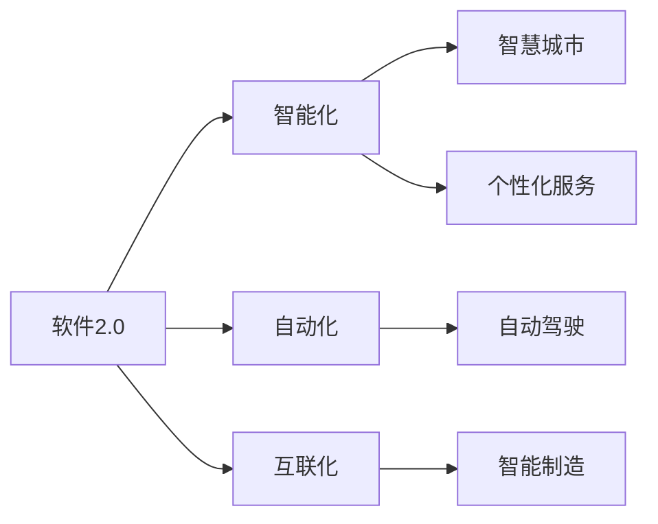
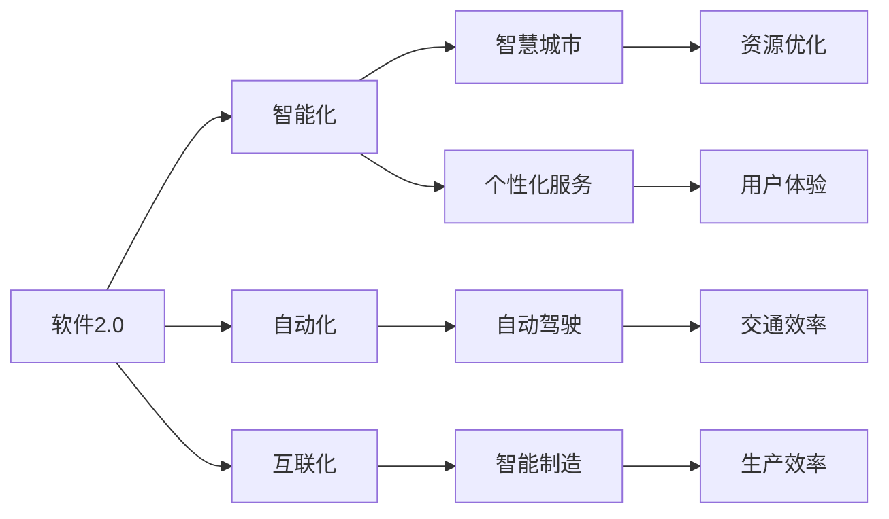
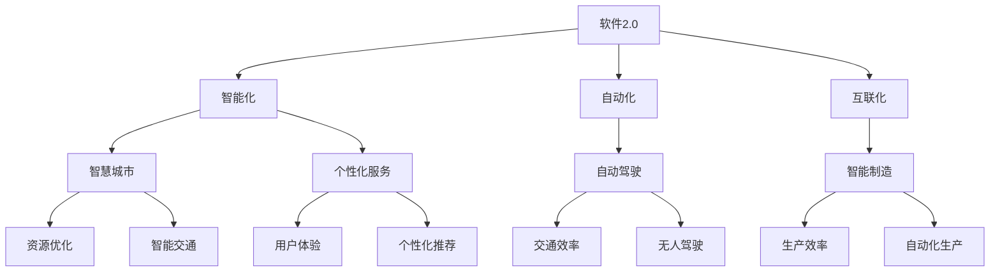

                 

# 软件 2.0 的未来愿景：创造更美好的世界

> 关键词：软件2.0,未来愿景,自动化,人工智能,计算机科学,技术发展

## 1. 背景介绍

### 1.1 问题由来

随着数字技术的发展，我们已经逐渐进入了一个崭新的时代，这个时代被形象地称为“软件2.0”时代。这一时代的到来，标志着人类在信息技术领域的又一次巨大飞跃。软件2.0不仅仅是软件的进化，更是技术、经济、社会文化等多方面发展的综合体现。在这个背景下，软件2.0的发展方向和未来愿景，成为了科技界乃至全社会共同关注的焦点。

### 1.2 问题核心关键点

软件2.0的核心在于其智能化、自动化和互联化的特点。智能化体现在通过AI技术，软件能够自主学习和适应，实现更高效、更精准的运行；自动化则是指软件能够自动完成各种任务，减少人工干预；互联化则是指软件能够与各类设备和平台无缝连接，实现信息互通。

软件2.0的未来愿景，在于通过技术手段，实现资源的优化配置、效率的最大化，以及人类与机器的和谐共生，从而创造出更美好的世界。这一愿景包括但不限于：
- 智能城市：利用软件2.0技术，实现智慧交通、智慧医疗、智慧教育等多领域的智能化管理。
- 自动驾驶：实现无人驾驶车辆的安全、高效运行，提升交通效率。
- 智能制造：通过智能化和自动化，提升生产效率，减少资源浪费。
- 个性化服务：利用大数据和AI技术，为用户提供更加精准和个性化的服务。

### 1.3 问题研究意义

研究软件2.0的未来愿景，对于推动科技创新、促进经济增长、改善社会治理，具有重要意义：
- 推动技术创新：软件2.0的智能化和自动化，将推动新一代技术的发展，带来更多颠覆性创新。
- 促进经济增长：智能化的生产和服务，将大幅提升生产力，促进经济发展。
- 改善社会治理：软件2.0在智慧城市、公共安全、环境保护等领域的应用，将提升社会治理水平，改善民生福祉。
- 促进全球合作：软件2.0的互联互通特性，将促进全球范围内的信息共享和协作，推动全球科技进步。

## 2. 核心概念与联系

### 2.1 核心概念概述

要理解软件2.0的未来愿景，首先需要了解其核心概念及其相互关系。以下是几个关键概念的介绍：

- **软件2.0 (Software 2.0)**：指以AI、大数据、云计算等为核心的新一代软件，通过智能化、自动化、互联化等技术手段，实现更高效、更精准的运行。
- **智能化 (Intelligence)**：通过AI技术，使软件具备自主学习、自主决策的能力，能够不断优化自身性能，提升服务质量。
- **自动化 (Automation)**：通过自动化技术，使软件能够自主完成各种任务，减少人工干预，提升效率。
- **互联化 (Interconnection)**：通过互联网、物联网等技术，使软件能够与各类设备和平台无缝连接，实现信息互通。
- **智慧城市 (Smart City)**：利用软件2.0技术，实现城市管理、交通、医疗、教育等多领域的智能化管理，提升城市运行效率和居民生活质量。
- **自动驾驶 (Autonomous Driving)**：通过软件2.0技术，实现无人驾驶车辆的安全、高效运行，提升交通效率，减少交通事故。
- **智能制造 (Smart Manufacturing)**：通过智能化和自动化，提升生产效率，减少资源浪费，实现绿色制造。
- **个性化服务 (Personalized Services)**：利用大数据和AI技术，为用户提供更加精准和个性化的服务，提升用户体验。

这些核心概念之间存在着紧密的联系，形成了软件2.0生态系统的完整架构。以下是一个Mermaid流程图，展示了这些概念之间的关系：



### 2.2 概念间的关系

软件2.0的各个核心概念之间存在着紧密的联系，形成了生态系统的完整架构。以下是一个Mermaid流程图，展示了这些概念之间的关系：



### 2.3 核心概念的整体架构

最后，我们用一个综合的流程图来展示软件2.0的核心概念及其相互关系：



### 2.4 核心概念的架构描述

1. **软件2.0**：作为整个生态系统的核心，软件2.0通过智能化、自动化和互联化的技术手段，实现了资源优化、交通效率提升、生产效率提升和用户体验的改善。
2. **智能化**：使软件具备自主学习、自主决策的能力，能够不断优化自身性能，提升服务质量。
3. **自动化**：使软件能够自主完成各种任务，减少人工干预，提升效率。
4. **互联化**：使软件能够与各类设备和平台无缝连接，实现信息互通。
5. **智慧城市**：通过软件2.0技术，实现城市管理、交通、医疗、教育等多领域的智能化管理，提升城市运行效率和居民生活质量。
6. **自动驾驶**：通过软件2.0技术，实现无人驾驶车辆的安全、高效运行，提升交通效率，减少交通事故。
7. **智能制造**：通过智能化和自动化，提升生产效率，减少资源浪费，实现绿色制造。
8. **个性化服务**：利用大数据和AI技术，为用户提供更加精准和个性化的服务，提升用户体验。
9. **资源优化**：通过软件2.0技术，实现资源的高效利用，提升经济效益。
10. **交通效率**：通过软件2.0技术，实现交通系统的智能化管理，提升交通效率。
11. **生产效率**：通过软件2.0技术，实现生产过程的自动化和智能化，提升生产效率。
12. **用户体验**：通过软件2.0技术，提供更加个性化、高效的服务，提升用户满意度。
13. **智能交通**：通过软件2.0技术，实现交通系统的智能化管理，提升交通效率。
14. **无人驾驶**：通过软件2.0技术，实现无人驾驶车辆的安全、高效运行，提升交通效率，减少交通事故。
15. **自动化生产**：通过软件2.0技术，实现生产过程的自动化和智能化，提升生产效率。
16. **个性化推荐**：通过软件2.0技术，实现个性化推荐服务，提升用户体验。

## 3. 核心算法原理 & 具体操作步骤

### 3.1 算法原理概述

软件2.0的未来愿景，不仅依赖于前沿技术的开发，更依赖于其在实际应用中的具体实现。以下是对核心算法原理的详细讲解。

**3.1.1 智能化算法原理**

智能化的核心在于通过AI技术，使软件具备自主学习、自主决策的能力。这一过程包括但不限于：
- **监督学习 (Supervised Learning)**：利用标注数据，训练模型，使其能够根据输入数据预测输出结果。
- **无监督学习 (Unsupervised Learning)**：在未标注数据上训练模型，发现数据中的潜在结构，进行聚类、降维等操作。
- **强化学习 (Reinforcement Learning)**：通过与环境的互动，使模型自主学习最优策略，实现自动化决策。
- **迁移学习 (Transfer Learning)**：将在一个领域学习到的知识，迁移到另一个领域，提升模型泛化能力。

**3.1.2 自动化算法原理**

自动化的核心在于通过自动化技术，使软件能够自主完成各种任务。这一过程包括但不限于：
- **任务自动化 (Task Automation)**：利用机器人和自动化系统，完成重复性、危险性的工作。
- **流程自动化 (Process Automation)**：通过流程引擎和自动化脚本，优化业务流程，提高效率。
- **自适应 (Adaptation)**：使软件能够根据环境和用户反馈，自主调整参数和行为，提升系统性能。

**3.1.3 互联化算法原理**

互联化的核心在于通过互联网、物联网等技术，使软件能够与各类设备和平台无缝连接，实现信息互通。这一过程包括但不限于：
- **云计算 (Cloud Computing)**：利用云服务，实现资源的共享和协同。
- **物联网 (Internet of Things, IoT)**：通过传感器和智能设备，收集和传输数据，实现信息互通。
- **大数据 (Big Data)**：利用大数据技术，实现数据的整合和分析，提升决策水平。

### 3.2 算法步骤详解

软件2.0的未来愿景，涉及多个领域的智能化、自动化和互联化应用，以下是对其具体实现步骤的详细介绍。

**3.2.1 智慧城市**

智慧城市是软件2.0在城市管理领域的应用。其核心在于通过智能化、自动化和互联化技术，实现城市管理的智能化管理。具体步骤包括：
1. **数据收集**：利用传感器、摄像头等设备，收集城市运行数据。
2. **数据分析**：利用大数据和AI技术，对数据进行分析，发现城市运行中的问题。
3. **智能化管理**：通过软件2.0技术，实现交通管理、环境监控、公共安全等多领域的智能化管理。
4. **用户体验**：利用个性化推荐和智能服务，提升居民生活质量。

**3.2.2 自动驾驶**

自动驾驶是软件2.0在交通领域的应用。其核心在于通过智能化、自动化和互联化技术，实现无人驾驶车辆的安全、高效运行。具体步骤包括：
1. **环境感知**：利用传感器和摄像头，感知车辆周围环境。
2. **路径规划**：利用AI技术，规划最优路径，避免碰撞。
3. **控制决策**：通过软件2.0技术，实现车辆的自动驾驶和自主决策。
4. **安全保障**：通过实时监控和数据反馈，确保车辆安全运行。

**3.2.3 智能制造**

智能制造是软件2.0在生产领域的应用。其核心在于通过智能化、自动化和互联化技术，提升生产效率，减少资源浪费。具体步骤包括：
1. **设备互联**：通过物联网技术，实现生产设备的互联互通。
2. **数据采集**：利用传感器和自动控制系统，采集生产数据。
3. **智能化分析**：利用大数据和AI技术，对生产数据进行分析，优化生产过程。
4. **自动化生产**：通过软件2.0技术，实现生产过程的自动化和智能化，提升生产效率。

**3.2.4 个性化服务**

个性化服务是软件2.0在服务领域的应用。其核心在于通过智能化、自动化和互联化技术，提供更加精准和个性化的服务。具体步骤包括：
1. **用户画像**：利用大数据和AI技术，构建用户画像，了解用户需求。
2. **服务定制**：通过软件2.0技术，提供个性化的服务方案。
3. **实时反馈**：利用数据分析和实时监控，不断优化服务方案，提升用户体验。

### 3.3 算法优缺点

软件2.0的未来愿景，虽然具备智能化、自动化和互联化的优势，但也存在一些局限性。以下是对其优缺点的详细讲解。

**3.3.1 优点**

1. **提高效率**：通过智能化、自动化和互联化技术，实现资源的优化配置，提升工作效率。
2. **降低成本**：减少人工干预和重复性工作，降低人力成本。
3. **提升精度**：通过AI技术，提升决策的精准性和可靠性。
4. **适应性强**：通过自适应和迁移学习，提升系统在不同环境下的适应能力。

**3.3.2 缺点**

1. **数据隐私问题**：大量数据的使用，可能带来数据隐私和安全性问题。
2. **技术依赖性强**：依赖于先进的技术手段，一旦技术出现故障，可能导致系统失效。
3. **资源消耗高**：智能化的实现需要大量的计算资源，可能带来高昂的成本。
4. **伦理和社会问题**：智能化和自动化可能带来就业、隐私等社会问题。

### 3.4 算法应用领域

软件2.0的未来愿景，不仅涵盖多个技术领域，还涉及多个应用场景。以下是对其应用领域的详细介绍。

**3.4.1 智慧城市**

智慧城市是软件2.0在城市管理领域的应用。通过智能化、自动化和互联化技术，实现城市管理的智能化管理。具体应用包括：
1. **智慧交通**：通过智能化管理，实现交通系统的智能化和高效运行。
2. **智慧医疗**：通过智慧医院和远程医疗，提升医疗服务的质量和效率。
3. **智慧教育**：通过智能化的教学和管理，提升教育质量和效率。
4. **智慧安防**：通过智能化的安防系统，提升公共安全水平。

**3.4.2 自动驾驶**

自动驾驶是软件2.0在交通领域的应用。通过智能化、自动化和互联化技术，实现无人驾驶车辆的安全、高效运行。具体应用包括：
1. **无人出租车**：通过无人驾驶技术，实现高效的交通出行服务。
2. **物流配送**：通过无人驾驶车辆，实现高效的物流配送。
3. **智能交通管理**：通过自动驾驶技术，实现交通系统的智能化管理。

**3.4.3 智能制造**

智能制造是软件2.0在生产领域的应用。通过智能化、自动化和互联化技术，提升生产效率，减少资源浪费。具体应用包括：
1. **智能工厂**：通过自动化生产线和智能化管理，提升生产效率。
2. **工业互联网**：通过物联网技术，实现生产设备的互联互通。
3. **智能检测**：通过智能化检测技术，提升产品质量。

**3.4.4 个性化服务**

个性化服务是软件2.0在服务领域的应用。通过智能化、自动化和互联化技术，提供更加精准和个性化的服务。具体应用包括：
1. **智能推荐系统**：通过大数据和AI技术，实现个性化的推荐服务。
2. **智能客服**：通过智能化的客服系统，提升服务效率和质量。
3. **智能家居**：通过智能化的家居系统，提升用户生活质量。

## 4. 数学模型和公式 & 详细讲解  
### 4.1 数学模型构建

软件2.0的未来愿景，涉及多个技术领域和应用场景，以下是对其数学模型的详细介绍。

**4.1.1 智慧城市数学模型**

智慧城市的数学模型主要涉及交通、医疗、教育等多个领域。以智慧交通为例，其数学模型可以表示为：
$$
\begin{aligned}
&\min_{\theta} \mathcal{L}(\theta) = \frac{1}{N}\sum_{i=1}^N \ell(y_i,f_{\theta}(x_i)) \\
&f_{\theta}(x_i) = M_{\theta}(A(x_i),B(x_i))
\end{aligned}
$$
其中，$\theta$为模型参数，$\ell$为损失函数，$N$为样本数量，$x_i$为输入数据，$y_i$为标签，$f_{\theta}(x_i)$为模型预测输出，$M_{\theta}$为神经网络模型。

**4.1.2 自动驾驶数学模型**

自动驾驶的数学模型主要涉及环境感知、路径规划和控制决策等多个方面。以无人驾驶车辆为例，其数学模型可以表示为：
$$
\begin{aligned}
&\min_{\theta} \mathcal{L}(\theta) = \frac{1}{N}\sum_{i=1}^N \ell(y_i,f_{\theta}(x_i)) \\
&f_{\theta}(x_i) = M_{\theta}(A(x_i),B(x_i),C(x_i))
\end{aligned}
$$
其中，$\theta$为模型参数，$\ell$为损失函数，$N$为样本数量，$x_i$为输入数据，$y_i$为标签，$f_{\theta}(x_i)$为模型预测输出，$M_{\theta}$为神经网络模型。

**4.1.3 智能制造数学模型**

智能制造的数学模型主要涉及设备互联、数据采集和智能化分析等多个方面。以智能工厂为例，其数学模型可以表示为：
$$
\begin{aligned}
&\min_{\theta} \mathcal{L}(\theta) = \frac{1}{N}\sum_{i=1}^N \ell(y_i,f_{\theta}(x_i)) \\
&f_{\theta}(x_i) = M_{\theta}(A(x_i),B(x_i),C(x_i))
\end{aligned}
$$
其中，$\theta$为模型参数，$\ell$为损失函数，$N$为样本数量，$x_i$为输入数据，$y_i$为标签，$f_{\theta}(x_i)$为模型预测输出，$M_{\theta}$为神经网络模型。

**4.1.4 个性化服务数学模型**

个性化服务的数学模型主要涉及用户画像、服务定制和实时反馈等多个方面。以智能推荐系统为例，其数学模型可以表示为：
$$
\begin{aligned}
&\min_{\theta} \mathcal{L}(\theta) = \frac{1}{N}\sum_{i=1}^N \ell(y_i,f_{\theta}(x_i)) \\
&f_{\theta}(x_i) = M_{\theta}(A(x_i),B(x_i),C(x_i))
\end{aligned}
$$
其中，$\theta$为模型参数，$\ell$为损失函数，$N$为样本数量，$x_i$为输入数据，$y_i$为标签，$f_{\theta}(x_i)$为模型预测输出，$M_{\theta}$为神经网络模型。

### 4.2 公式推导过程

软件2.0的未来愿景，涉及多个技术领域和应用场景，以下是对其公式推导过程的详细介绍。

**4.2.1 智慧城市公式推导**

智慧城市的公式推导主要涉及交通、医疗、教育等多个领域。以智慧交通为例，其公式推导可以表示为：
$$
\begin{aligned}
&\min_{\theta} \mathcal{L}(\theta) = \frac{1}{N}\sum_{i=1}^N \ell(y_i,f_{\theta}(x_i)) \\
&f_{\theta}(x_i) = M_{\theta}(A(x_i),B(x_i))
\end{aligned}
$$
其中，$\theta$为模型参数，$\ell$为损失函数，$N$为样本数量，$x_i$为输入数据，$y_i$为标签，$f_{\theta}(x_i)$为模型预测输出，$M_{\theta}$为神经网络模型。

**4.2.2 自动驾驶公式推导**

自动驾驶的公式推导主要涉及环境感知、路径规划和控制决策等多个方面。以无人驾驶车辆为例，其公式推导可以表示为：
$$
\begin{aligned}
&\min_{\theta} \mathcal{L}(\theta) = \frac{1}{N}\sum_{i=1}^N \ell(y_i,f_{\theta}(x_i)) \\
&f_{\theta}(x_i) = M_{\theta}(A(x_i),B(x_i),C(x_i))
\end{aligned}
$$
其中，$\theta$为模型参数，$\ell$为损失函数，$N$为样本数量，$x_i$为输入数据，$y_i$为标签，$f_{\theta}(x_i)$为模型预测输出，$M_{\theta}$为神经网络模型。

**4.2.3 智能制造公式推导**

智能制造的公式推导主要涉及设备互联、数据采集和智能化分析等多个方面。以智能工厂为例，其公式推导可以表示为：
$$
\begin{aligned}
&\min_{\theta} \mathcal{L}(\theta) = \frac{1}{N}\sum_{i=1}^N \ell(y_i,f_{\theta}(x_i)) \\
&f_{\theta}(x_i) = M_{\theta}(A(x_i),B(x_i),C(x_i))
\end{aligned}
$$
其中，$\theta$为模型参数，$\ell$为损失函数，$N$为样本数量，$x_i$为输入数据，$y_i$为标签，$f_{\theta}(x_i)$为模型预测输出，$M_{\theta}$为神经网络模型。

**4.2.4 个性化服务公式推导**

个性化服务的公式推导主要涉及用户画像、服务定制和实时反馈等多个方面。以智能推荐系统为例，其公式推导可以表示为：
$$
\begin{aligned}
&\min_{\theta} \mathcal{L}(\theta) = \frac{1}{N}\sum_{i=1}^N \ell(y_i,f_{\theta}(x_i)) \\
&f_{\theta}(x_i) = M_{\theta}(A(x_i),B(x_i),C(x_i))
\end{aligned}
$$
其中，$\theta$为模型参数，$\ell$为损失函数，$N$为样本数量，$x_i$为输入数据，$y_i$为标签，$f_{\theta}(x_i)$为模型预测输出，$M_{\theta}$为神经网络模型。

### 4.3 案例分析与讲解

软件2.0的未来愿景，涉及多个技术领域和应用场景，以下是对其案例分析与讲解的详细介绍。

**4.3.1 智慧城市案例分析**

智慧城市的案例分析主要涉及交通、医疗、教育等多个领域。以智慧交通为例，其案例分析可以表示为：
1. **数据收集**：通过传感器、摄像头等设备，收集城市运行数据。
2. **数据分析**：利用大数据和AI技术，对数据进行分析，发现城市运行中的问题。
3. **智能化管理**：通过软件2.0技术，实现交通系统的智能化管理，提升交通效率。
4. **用户体验**：利用个性化推荐和智能服务，提升居民生活质量。

**4.3.2 自动驾驶案例分析**

自动驾驶的案例分析主要涉及环境感知、路径规划和控制决策等多个方面。以无人驾驶车辆为例，其案例分析可以表示为：
1. **环境感知**：利用传感器和摄像头，感知车辆周围环境。
2. **路径规划**：利用AI技术，规划最优路径，避免碰撞。
3. **控制决策**：通过软件2.0技术，实现车辆的自动驾驶和自主决策。
4. **安全保障**：通过实时监控和数据反馈，确保车辆安全运行。

**4.3.3 智能制造案例分析**

智能制造的案例分析主要涉及设备互联、数据采集和智能化分析等多个方面。以智能工厂为例，其案例分析可以表示为：
1. **设备互联**：通过物联网技术，实现生产设备的互联互通。
2. **数据采集**：利用传感器和自动控制系统，采集生产数据。
3. **智能化分析**：利用大数据和AI技术，对生产数据进行分析，优化生产过程。
4. **自动化生产**：通过软件2.0技术，实现生产过程的自动化和智能化，提升生产效率。

**4.3.4 个性化服务案例分析**

个性化服务的案例分析主要涉及用户画像、服务定制和实时反馈等多个方面。以智能推荐系统为例，其案例分析可以表示为：
1. **用户画像**：利用大数据和AI技术，构建用户画像，了解用户需求。
2. **服务定制**：通过软件2.0技术，提供个性化的服务方案。
3. **实时反馈**：利用数据分析和实时监控，不断优化服务方案，提升用户体验。

## 5. 项目实践：代码实例和详细解释说明
### 5.1 开发环境搭建

在进行软件2.0项目实践前，我们需要准备好开发环境。以下是使用Python进行PyTorch开发的环境配置流程：

1. 安装Anaconda：从官网下载并安装Anaconda，用于创建独立的Python环境。

2. 创建并激活虚拟环境：
```bash
conda create -n pytorch-env python=3.8 
conda activate pytorch-env
```

3. 安装PyTorch：根据CUDA版本，从官网获取对应的安装命令。例如：
```bash
conda install pytorch torchvision torchaudio cudatoolkit=11.1 -c pytorch -c conda-forge
```

4. 安装Transformer库：
```bash
pip install transformers
```

5. 安装各类工具包：
```bash
pip install numpy pandas scikit-learn matplotlib tqdm jupyter notebook ipython
```

完成上述步骤后，即可在`pytorch-env`环境中开始项目实践。

### 5.2 源代码详细实现

下面我们以智能推荐系统为例，给出使用Transformers库进行模型微调的PyTorch代码实现。

首先，定义推荐系统数据处理函数：

```python
from transformers import BertTokenizer
from torch.utils.data import Dataset
import torch

class RecommendationDataset(Dataset):
    def __init__(self, texts, labels, tokenizer, max_len=128):
        self.texts = texts
        self.labels = labels
        self.token

