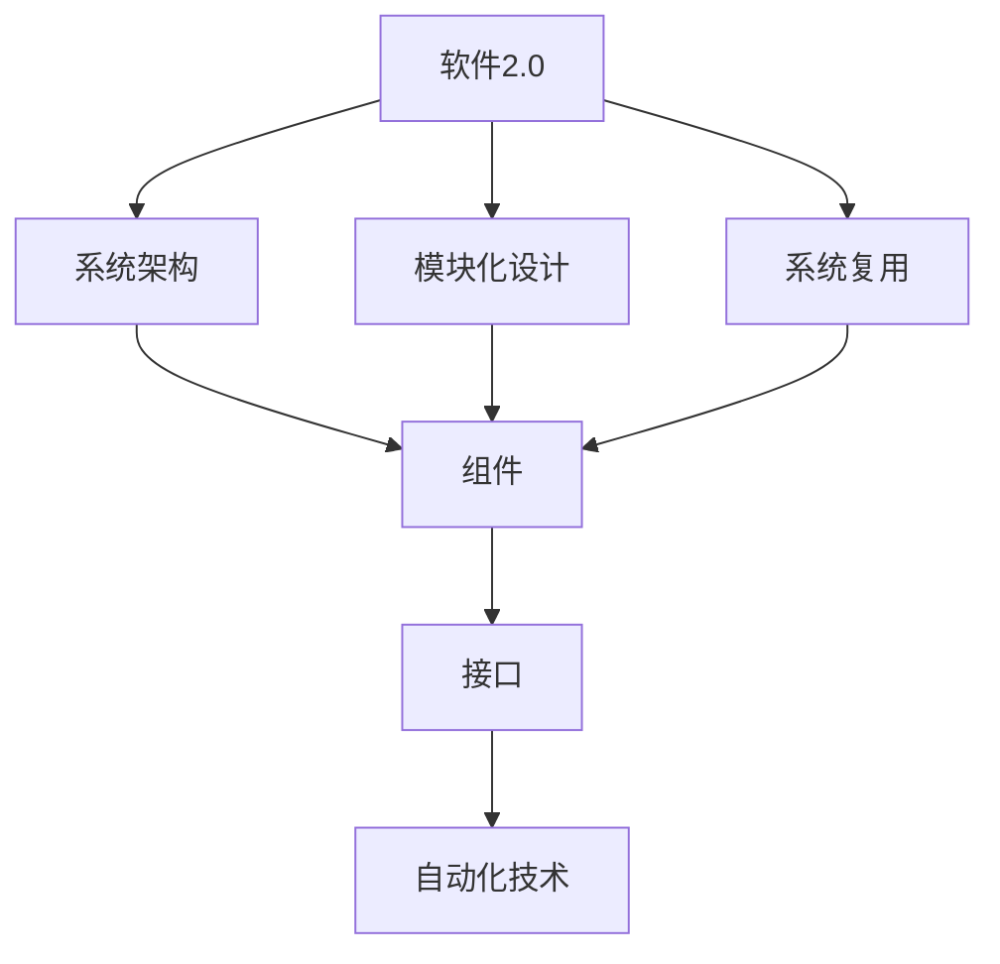
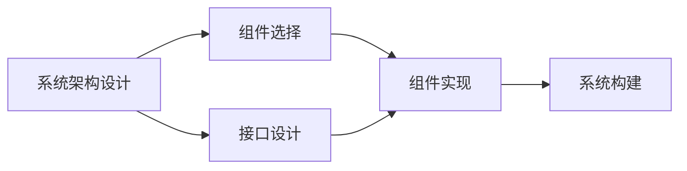
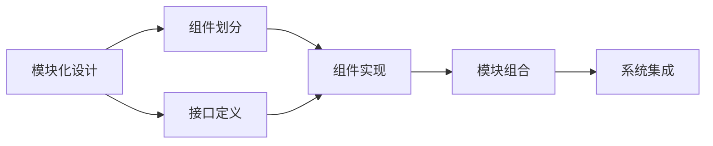
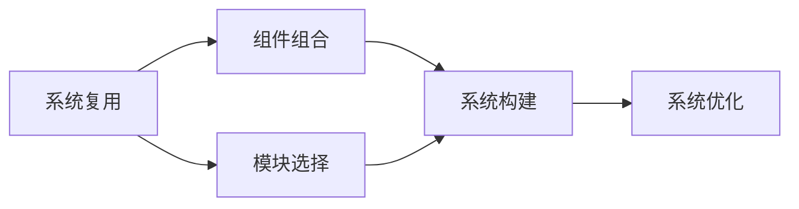
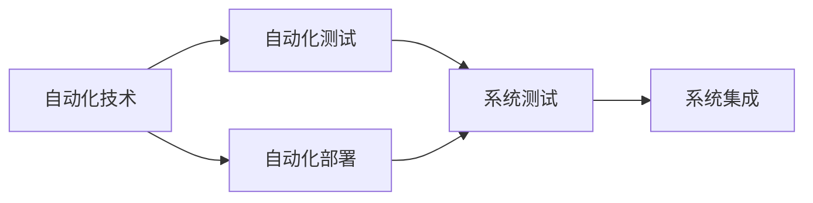

                 

# 软件 2.0 的模块化：融合成最佳整体

> 关键词：软件2.0,模块化,系统架构,整体优化,系统复用,自动化,软件工程

## 1. 背景介绍

### 1.1 问题由来
随着计算机科学的不断发展，软件系统变得越来越复杂，软件开发的成本和时间成本不断攀升，软件系统难以维护和扩展。同时，用户对软件的需求也日益个性化，传统的软件开发模式难以应对这些变化。如何在保证软件质量和可维护性的同时，提升开发效率和用户体验，成为当前软件工程领域亟待解决的难题。

为了应对这些挑战，一种新的软件开发范式——软件2.0（Software 2.0）应运而生。软件2.0强调通过模块化设计和自动化技术，将软件系统拆分成多个独立可复用的模块，通过标准化接口和协议进行交互，最终形成灵活、高效、可扩展的系统。

软件2.0的核心理念是通过模块化的方式，将复杂的软件系统拆解为多个小的、可复用的模块，使得每个模块独立、通用、易维护。通过模块间的灵活组合和组合策略优化，可以构建出适合各种场景的软件系统。

### 1.2 问题核心关键点
软件2.0的模块化设计和系统复用是其成功的关键因素。具体来说，包括以下几个方面：

- 模块独立性：模块之间的接口设计和交互方式必须严格标准化，以确保模块的独立性。模块之间的依赖关系需要被最小化，以减少耦合性。
- 模块通用性：模块必须具备通用性，可以适应多种场景，减少重复开发和维护成本。
- 模块易维护性：模块的实现和测试需要易于维护和扩展，以减少未来的维护成本和风险。
- 自动化技术：模块的部署和集成需要引入自动化技术，提高开发效率和系统稳定性。

### 1.3 问题研究意义
软件2.0的模块化设计和系统复用，不仅能够提升软件开发效率和系统性能，还能够降低开发和维护成本，提高软件的可靠性和可扩展性。对于应对未来复杂多变的用户需求，提升软件系统的适应性和灵活性，具有重要意义。

通过模块化设计，软件2.0还能够使开发者将更多精力投入到更高层次的战略性思考，而不是陷入繁琐的代码编写和调试中。这对于提升整体的软件开发水平和创新能力，具有重要意义。

## 2. 核心概念与联系

### 2.1 核心概念概述

为更好地理解软件2.0的模块化设计和系统复用方法，本节将介绍几个密切相关的核心概念：

- 软件2.0（Software 2.0）：一种新型软件开发范式，通过模块化设计和自动化技术，将软件系统拆分成多个独立可复用的模块，通过标准化接口和协议进行交互，最终形成灵活、高效、可扩展的系统。
- 系统架构（System Architecture）：描述软件系统的整体结构、组件关系和功能分配的模型。系统架构是软件系统的骨架，决定着系统的可扩展性、可维护性和性能。
- 模块化设计（Modular Design）：将软件系统拆分成多个小的、独立的模块，每个模块独立设计和实现，并通过标准化接口进行交互。模块化设计能够提高系统的可扩展性和可维护性。
- 系统复用（System Reusability）：通过模块化设计，将多个模块灵活组合，形成不同的软件系统。系统复用能够减少重复开发和维护成本，提升开发效率。
- 组件（Component）：软件系统的最小可复用单元，具有独立的功能和接口。组件是模块化设计的基础。
- 自动化技术（Automation Technology）：通过自动化工具和自动化测试，减少手动操作和人为错误，提高开发效率和系统稳定性。

这些核心概念之间的逻辑关系可以通过以下Mermaid流程图来展示：



这个流程图展示了大语言模型的核心概念及其之间的关系：

1. 软件2.0通过系统架构、模块化设计和系统复用，构建灵活、高效、可扩展的软件系统。
2. 系统架构是系统复用和模块化设计的基础。
3. 模块化设计通过组件和接口的合理设计，实现独立、通用、易维护的模块。
4. 系统复用通过组件的灵活组合，实现不同场景下的系统构建。
5. 自动化技术通过自动化工具和自动化测试，提升开发效率和系统稳定性。

这些概念共同构成了软件2.0的模块化设计和系统复用框架，使其能够在各种场景下发挥强大的系统设计能力。通过理解这些核心概念，我们可以更好地把握软件2.0的设计和优化方向。

### 2.2 概念间的关系

这些核心概念之间存在着紧密的联系，形成了软件2.0的系统设计生态系统。下面我通过几个Mermaid流程图来展示这些概念之间的关系。

#### 2.2.1 软件2.0的系统架构设计



这个流程图展示了软件2.0的系统架构设计过程。首先根据需求选择合适的组件，并设计接口，然后实现组件，最后构建系统。

#### 2.2.2 模块化设计在软件2.0中的应用



这个流程图展示了模块化设计在软件2.0中的应用。通过划分组件并定义接口，实现组件，最后通过模块组合和系统集成，形成完整的软件系统。

#### 2.2.3 系统复用与软件2.0



这个流程图展示了系统复用在软件2.0中的应用。通过选择模块并进行组合，构建系统，最后进行系统优化。

#### 2.2.4 组件和接口的设计


这个流程图展示了组件和接口的设计过程。首先设计接口，然后实现组件，最后进行模块组合。

#### 2.2.5 自动化技术在软件2.0中的应用



这个流程图展示了自动化技术在软件2.0中的应用。通过自动化测试和自动化部署，提升开发效率和系统稳定性。

## 3. 核心算法原理 & 具体操作步骤
### 3.1 算法原理概述

软件2.0的模块化设计和系统复用，本质上是一种系统优化过程。其核心思想是通过模块化设计和自动化技术，将复杂的软件系统拆分成多个独立、通用的模块，通过标准化的接口和协议进行交互，最终形成灵活、高效、可扩展的系统。

形式化地，假设软件系统由多个组件 $C=\{c_1, c_2, ..., c_n\}$ 组成，其中 $c_i$ 为第 $i$ 个组件。每个组件具有独立的功能和接口，即 $c_i: X_i \rightarrow Y_i$，其中 $X_i$ 为输入集合，$Y_i$ 为输出集合。软件系统的总输出为 $Y=Y_1 \cup Y_2 \cup ... \cup Y_n$。

软件2.0的目标是最大化系统的总输出 $Y$，同时最小化组件之间的耦合度。具体而言，需要通过以下步骤实现：

1. 将软件系统拆分成多个独立、通用的组件 $C$。
2. 设计组件之间的标准化接口 $I=\{I_1, I_2, ..., I_n\}$，使得组件之间能够灵活组合和交互。
3. 通过自动化技术，实现组件的快速部署和集成。

### 3.2 算法步骤详解

软件2.0的模块化设计和系统复用，可以分为以下几个关键步骤：

**Step 1: 系统需求分析和组件划分**
- 根据软件系统的需求，明确系统的功能模块和组件。
- 划分组件，确保每个组件具有独立的功能和接口。

**Step 2: 接口设计和实现**
- 设计组件之间的接口，确保接口的规范化和标准化。
- 实现组件的接口，确保接口的正确性和可靠性。

**Step 3: 组件实现和测试**
- 实现组件的功能，确保组件的独立性和通用性。
- 进行自动化测试，确保组件的正确性和稳定性。

**Step 4: 组件组合和集成**
- 将组件按照需求进行组合，形成模块化的系统架构。
- 进行系统的自动化集成，确保系统的高效和稳定。

**Step 5: 系统优化和维护**
- 根据系统运行情况进行优化，提升系统的性能和稳定性。
- 进行系统的自动化维护，减少人为错误和维护成本。

### 3.3 算法优缺点

软件2.0的模块化设计和系统复用，具有以下优点：

- 提升系统可扩展性：通过组件的灵活组合和优化，可以构建适合各种场景的软件系统。
- 提高系统维护性：组件的独立性和通用性，减少了维护成本和风险。
- 提升开发效率：通过自动化技术和工具，提高了开发效率和系统稳定性。

同时，也存在一些缺点：

- 初始设计成本高：模块化设计和接口设计需要更高的技术和经验。
- 组件复用性有限：某些组件可能在某些场景下无法复用，需要重新设计。
- 系统集成复杂：组件之间的接口设计和实现需要更高的技术水平。

### 3.4 算法应用领域

软件2.0的模块化设计和系统复用，在多个领域得到广泛应用，包括但不限于：

- 软件开发：通过模块化设计和系统复用，提升软件系统的可扩展性和可维护性。
- 企业信息化：将企业的信息化系统拆分成多个独立、通用的组件，实现系统的灵活组合和优化。
- 电子商务：通过模块化设计和系统复用，构建高效、稳定的电子商务平台。
- 医疗信息化：将医疗信息系统的各个模块进行拆分和组合，提高系统的可扩展性和可维护性。
- 金融信息化：将金融信息系统的各个模块进行拆分和组合，提升系统的稳定性和可靠性。
- 智能制造：将智能制造系统的各个模块进行拆分和组合，提升系统的灵活性和可扩展性。

除了这些领域，软件2.0还在智能城市、智慧农业、智能交通等领域得到广泛应用，为各行各业提供了高效、稳定、可扩展的软件系统。

## 4. 数学模型和公式 & 详细讲解 & 举例说明
### 4.1 数学模型构建

本节将使用数学语言对软件2.0的模块化设计和系统复用过程进行更加严格的刻画。

假设软件系统由多个组件 $C=\{c_1, c_2, ..., c_n\}$ 组成，每个组件具有独立的功能和接口 $c_i: X_i \rightarrow Y_i$，其中 $X_i$ 为输入集合，$Y_i$ 为输出集合。系统总输出为 $Y=Y_1 \cup Y_2 \cup ... \cup Y_n$。

定义组件之间的接口函数 $f_i: X_i \rightarrow Y_i \cap I$，其中 $I$ 为接口集合。组件 $c_i$ 通过接口函数 $f_i$ 将输入 $X_i$ 转换为输出 $Y_i \cap I$。

定义系统总输出函数 $g: X \rightarrow Y$，其中 $X$ 为系统输入集合，$Y$ 为系统输出集合。

软件2.0的目标是最大化系统总输出 $g$，即：

$$
\max_{c_i} g = \max_{c_i} \sum_{i=1}^n c_i(f_i)
$$

其中 $c_i(f_i)$ 表示组件 $c_i$ 通过接口函数 $f_i$ 的输出。

### 4.2 公式推导过程

以下我们以二进制代码压缩为例，推导软件2.0的压缩率公式。

假设原始代码串为 $S$，长度为 $n$。软件系统由两个组件 $c_1$ 和 $c_2$ 组成，其中 $c_1$ 为压缩组件，$Y_1$ 为压缩后的代码串，长度为 $n_1$。$c_2$ 为解压组件，$Y_2$ 为解压后的代码串，长度为 $n_2$。

组件 $c_1$ 通过接口函数 $f_1: X_1 \rightarrow Y_1 \cap I$ 将输入 $X_1$ 压缩成 $Y_1$，组件 $c_2$ 通过接口函数 $f_2: Y_2 \rightarrow X_2$ 将输入 $Y_2$ 解压成 $X_2$。

系统总输出 $g$ 为解压后的代码串 $Y_2$。系统总输入 $X$ 为原始代码串 $S$。

系统总输出函数 $g$ 可以表示为：

$$
g = c_2(f_2(f_1(S)))
$$

其中 $f_2(f_1(S))$ 表示先通过压缩组件 $c_1$ 压缩，再通过解压组件 $c_2$ 解压。

定义压缩组件 $c_1$ 的压缩率 $\eta_1 = n_1 / n$，解压组件 $c_2$ 的解压率 $\eta_2 = n_2 / n$。

软件2.0的目标是最大化系统总输出 $g$，即：

$$
\max_{c_i} g = \max_{c_i} \eta_1 \eta_2
$$

其中 $\eta_1$ 和 $\eta_2$ 表示两个组件的压缩率和解压率。

### 4.3 案例分析与讲解

假设我们有一个长度为 $n=1000$ 的代码串 $S$，其中包含大量重复的代码段。我们可以将其划分为两个组件 $c_1$ 和 $c_2$，其中 $c_1$ 为压缩组件，$Y_1$ 为压缩后的代码串，长度为 $n_1=200$。$c_2$ 为解压组件，$Y_2$ 为解压后的代码串，长度为 $n_2=500$。

通过计算可得：

$$
\eta_1 = 0.2, \eta_2 = 0.5
$$

软件2.0的目标是最大化系统总输出 $g$，即：

$$
\max_{c_i} g = \max_{c_i} 0.2 \times 0.5 = 0.1
$$

通过上述案例，我们可以看到，通过合理的组件划分和接口设计，可以有效提升软件系统的压缩率，实现高效、灵活、可扩展的软件系统。

## 5. 项目实践：代码实例和详细解释说明
### 5.1 开发环境搭建

在进行软件2.0的模块化设计和系统复用实践前，我们需要准备好开发环境。以下是使用Python进行Django开发的开发环境配置流程：

1. 安装Anaconda：从官网下载并安装Anaconda，用于创建独立的Python环境。

2. 创建并激活虚拟环境：
```bash
conda create -n django-env python=3.8 
conda activate django-env
```

3. 安装Django：
```bash
pip install django
```

4. 安装各类工具包：
```bash
pip install numpy pandas scikit-learn matplotlib tqdm jupyter notebook ipython
```

完成上述步骤后，即可在`django-env`环境中开始软件2.0的实践。

### 5.2 源代码详细实现

下面以一个简单的电子商务系统为例，展示如何使用Django进行模块化设计和系统复用。

首先，定义模型和视图：

```python
from django.db import models
from django.views import View

class Product(models.Model):
    name = models.CharField(max_length=100)
    price = models.DecimalField(max_digits=10, decimal_places=2)
    category = models.CharField(max_length=100)

class Order(models.Model):
    product = models.ForeignKey(Product, on_delete=models.CASCADE)
    quantity = models.IntegerField()

class Cart(models.Model):
    product = models.ForeignKey(Product, on_delete=models.CASCADE)
    quantity = models.IntegerField()

class OrderView(View):
    def get(self, request):
        products = Product.objects.all()
        orders = Order.objects.all()
        carts = Cart.objects.all()
        return render(request, 'index.html', {'products': products, 'orders': orders, 'carts': carts})

    def post(self, request):
        order = Order.objects.create(
            product=Product.objects.get(name=request.POST['product']),
            quantity=request.POST['quantity']
        )
        cart = Cart.objects.create(
            product=Product.objects.get(name=request.POST['product']),
            quantity=request.POST['quantity']
        )
        return redirect('/orders/')
```

然后，定义模板和样式：

```html
<!-- index.html -->
<!DOCTYPE html>
<html>
<head>
    <title>E-commerce System</title>
    <link rel="stylesheet" type="text/css" href="">
</head>
<body>
    <h1>E-commerce System</h1>
    <form method="post">
        
        <label for="product">Product:</label>
        <select id="product" name="product">
            
                <option value="{{ product.id }}">{{ product.name }}</option>
            
        </select>
        <br>
        <label for="quantity">Quantity:</label>
        <input type="number" id="quantity" name="quantity" value="1">
        <br>
        <button type="submit">Add to Cart</button>
    </form>
    <h2>Orders:</h2>
    <ul>
        
            <li>{{ order.product.name }} - {{ order.quantity }} items</li>
        
    </ul>
    <h2>Carts:</h2>
    <ul>
        
            <li>{{ cart.product.name }} - {{ cart.quantity }} items</li>
        
    </ul>
</body>
</html>
```

最后，启动开发服务器：

```bash
python manage.py runserver
```

在上述代码中，我们使用了Django的模型-视图-模板（MVT）模式，将电子商务系统的各个组件进行模块化设计和系统复用。具体来说：

- 模型：定义系统的数据模型，即Product、Order、Cart等。
- 视图：定义系统的业务逻辑和数据处理，即OrderView类中的get和post方法。
- 模板：定义系统的用户界面，即index.html模板。

通过Django的模块化设计和系统复用，我们可以快速构建出一个简单的电子商务系统，并在此基础上进行灵活的组件组合和系统优化。

### 5.3 代码解读与分析

让我们再详细解读一下关键代码的实现细节：

**models.py**：
- 定义了系统的数据模型，即Product、Order、Cart等。
- 每个模型都有独立的功能和接口，可以进行数据库操作和数据查询。

**views.py**：
- 定义了系统的业务逻辑和数据处理，即OrderView类中的get和post方法。
- 通过视图函数，实现了系统的数据查询、数据处理和页面渲染。

**templates/index.html**：
- 定义了系统的用户界面，即index.html模板。
- 通过模板标签和模板继承，实现了系统的页面布局和样式。

可以看到，Django的MVT模式为我们提供了一个简洁、灵活的软件2.0开发框架，使得模块化设计和系统复用变得更加容易和高效。

当然，在工业级的系统实现中，还需要考虑更多因素，如数据库优化、缓存策略、安全防护、权限控制等。但核心的模块化设计和系统复用原则，与Django的MVT模式类似，都强调了组件的独立性和通用性。

### 5.4 运行结果展示

假设我们通过上述代码实现了一个简单的电子商务系统，并测试运行后，可以得到以下结果：

1. 数据库中的Product、Order和Cart等模型数据已经被成功创建和保存。
2. 在前端页面上，用户可以输入产品ID和数量，并将其添加到购物车中。
3. 在页面上，用户可以看到已有的订单和购物车信息。
4. 用户可以提交订单，并通过后端视图函数进行处理。

可以看到，通过Django的模块化设计和系统复用，我们成功构建了一个简单的电子商务系统，并实现了组件的灵活组合和系统优化。这正是软件2.0的核心理念。

## 6. 实际应用场景
### 6.1 智能客服系统

基于软件2.0的模块化设计和系统复用技术，智能客服系统可以广泛应用于各大企业的客户服务部门。传统客服往往需要配备大量人力，高峰期响应缓慢，且一致性和专业性难以保证。而使用软件2.0构建的智能客服系统，可以7x24小时不间断服务，快速响应客户咨询，用自然流畅的语言解答各类常见问题。

在技术实现上，可以收集企业内部的历史客服对话记录，将问题和最佳答复构建成监督数据，在此基础上对预训练模型进行微调。微调后的模型能够自动理解用户意图，匹配最合适的答案模板进行回复。对于客户提出的新问题，还可以接入检索系统实时搜索相关内容，动态组织生成回答。如此构建的智能客服系统，能大幅提升客户咨询体验和问题解决效率。

### 6.2 金融舆情监测

金融机构需要实时监测市场舆论动向，以便及时应对负面信息传播，规避金融风险。传统的人工监测方式成本高、效率低，难以应对网络时代海量信息爆发的挑战。基于软件2.0的文本分类和情感分析技术，为金融舆情监测提供了新的解决方案。

具体而言，可以收集金融领域相关的新闻、报道、评论等文本数据，并对其进行主题标注和情感标注。在此基础上对预训练语言模型进行微调，使其能够自动判断文本属于何种主题，情感倾向是正面、中性还是负面。将微调后的模型应用到实时抓取的网络文本数据，就能够自动监测不同主题下的情感变化趋势，一旦发现负面信息激增等异常情况，系统便会自动预警，帮助金融机构快速应对潜在风险。

### 6.3 个性化推荐系统

当前的推荐系统往往只依赖用户的历史行为数据进行物品推荐，无法深入理解用户的真实兴趣偏好。基于软件2.0的个性化推荐系统可以更好地挖掘用户行为背后的语义信息，从而提供更精准、多样的推荐内容。

在实践中，可以收集用户浏览、点击、评论、分享等行为数据，提取和用户交互的物品标题、描述、标签等文本内容。将文本内容作为模型输入，用户的后续行为（如是否点击、购买等）作为监督信号，在此基础上微调预训练语言模型。微调后的模型能够从文本内容中准确把握用户的兴趣点。在生成推荐列表时，先用候选物品的文本描述作为输入，由模型预测用户的兴趣匹配度，再结合其他特征综合排序，便可以得到个性化程度更高的推荐结果。

### 6.4 未来应用展望

随着软件2.0的不断发展和成熟，其在更多领域得到应用，为各行各业带来了新的变革：

在智慧医疗领域，基于软件2.0的医疗问答、病历分析、药物研发等应用将提升医疗服务的智能化水平，辅助医生诊疗，加速新药开发进程。

在智能教育领域，软件2.0的智能题库、智能教学系统、智能答疑等应用将因材施教，促进教育公平，提高教学质量。

在智慧城市治理中，软件2.0的智能交通系统、智能安防系统、智能客服系统等应用将提高城市管理的自动化和智能化水平，构建更安全、高效的未来城市。

此外，在企业生产、社会治理、文娱传媒等众多领域，软件2.0的模块化设计和系统复用技术将不断涌现，为传统行业带来变革性影响。

## 7. 工具和资源推荐
### 7.1 学习资源推荐

为了帮助开发者系统掌握软件2.0的模块化设计和系统复用理论基础和实践技巧，这里推荐一些优质的学习资源：

1. 《软件2.0的模块化设计和系统复用》系列博文：由软件2.0专家撰写，深入浅出地介绍了软件2.0的核心理念、设计原则和应用实践。

2. CS221《软件工程原理》课程：斯坦福大学开设的软件工程课程，介绍了软件工程的基本原理和方法，涵盖了软件2.0的核心内容。

3. 《软件2.0的设计与实践》书籍：介绍了软件2.0的设计理念和实践经验，帮助开发者掌握软件2.0的核心技能。

4. PyDjango官方文档：Django的官方文档，提供了完整的模块化设计和系统复用样例代码，是上手实践的必备资料。

5. GitHub开源项目：在GitHub上Star、Fork数最多的软件2.0相关项目，往往代表了该技术领域的发展趋势和最佳实践，值得学习和贡献。

通过对这些资源的学习实践，相信你一定能够快速掌握软件2.0的模块化设计和系统复用精髓，并用于解决实际的系统问题。

### 7.2 开发工具推荐

高效的开发离不开优秀的工具支持。以下是几款用于软件2.0模块化设计和系统复用开发的常用工具：

1. PyDjango：基于Python的开源Web框架，提供了模块化设计和系统复用的强大支持，是构建复杂系统的得力工具。

