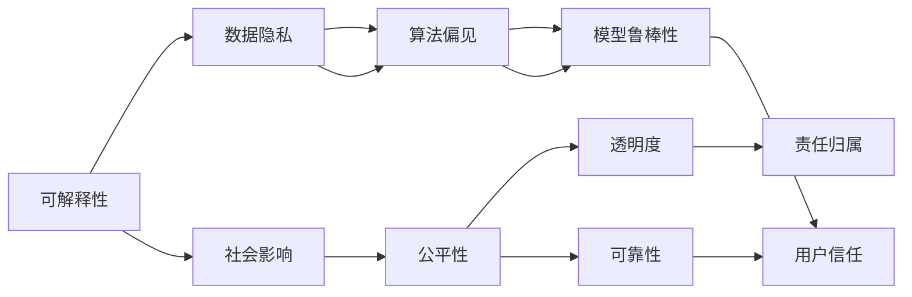
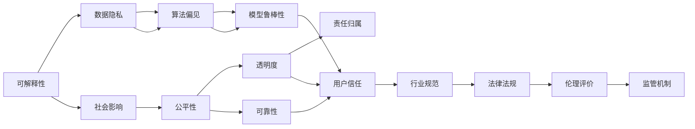

                 

## 1. 背景介绍

### 1.1 问题的由来
随着人工智能技术的迅猛发展，特别是深度学习和大规模数据驱动的模型训练，全球科技与产业发生了深刻变革。从互联网到物联网，从消费电子到医疗健康，人工智能的应用边界不断拓展，为社会带来了前所未有的机遇和挑战。

而伴随这些技术变革的，是越来越复杂的道德和伦理问题。人工智能的决策行为是否可解释？算法偏见如何避免？数据隐私如何保障？这些问题引发了广泛的社会关注。在科技迅猛发展的背景下，如何保证人工智能技术的“善用”，成为了一个重大的课题。

### 1.2 问题的核心关键点
人工智能的社会责任问题主要集中在以下几个方面：

- **可解释性**：人工智能模型的决策过程是否透明、可解释，是保障公平正义的前提。
- **数据隐私**：如何保护个人数据不被滥用，维护用户隐私权。
- **算法偏见**：如何避免算法训练过程中引入的偏见，保证模型的公平性和公正性。
- **模型鲁棒性**：如何确保模型在对抗攻击和数据噪声下的鲁棒性，避免因错误输入导致的不良决策。
- **社会影响**：如何评估人工智能对社会、经济、文化等各方面产生的影响，避免负面影响扩散。

这些问题的解决，需要科技界、企业界、学术界和政府的共同努力，将科技向善的理念深入贯彻到人工智能的各个环节。

### 1.3 问题研究的意义
在科技与社会的深度融合下，人工智能的社会责任问题不仅仅是技术问题，更是社会伦理问题。解决这些问题，能够促进人工智能技术的健康发展，推动社会公平正义，构建和谐稳定的社会环境。

1. **推动科技向善**：确保人工智能技术在服务于社会、经济、文化等领域时，遵循公平、透明、可靠的原则，避免技术滥用。
2. **增强公众信任**：通过提升人工智能的可解释性、透明性和公平性，增强公众对技术的信任和接受度。
3. **促进产业规范**：引导企业、政府和学术界制定并遵循人工智能伦理规范，促进产业健康发展。
4. **构建科技伦理框架**：形成针对人工智能的伦理评价和监管机制，保障社会整体利益。
5. **促进人机协同**：在人工智能与人类社会协同的过程中，充分考虑人类的价值观和需求，实现和谐共生。

## 2. 核心概念与联系

### 2.1 核心概念概述
要深刻理解人工智能的社会责任问题，需要先明确几个核心概念：

- **可解释性（Explainability）**：模型决策过程的可解释性，是确保公平、透明和可靠性的基础。
- **数据隐私（Data Privacy）**：保护个人数据免受滥用和泄露，是人工智能伦理的基石。
- **算法偏见（Algorithm Bias）**：在训练过程中引入的偏见可能导致模型输出不公平的结果。
- **模型鲁棒性（Model Robustness）**：模型对输入数据、对抗攻击和噪声的抵抗能力。
- **社会影响（Social Impact）**：人工智能对社会、经济、文化等各方面的影响，包括正面和负面影响。

这些概念之间存在紧密的联系，形成了一个系统的伦理框架，指导人工智能技术的开发和应用。

### 2.2 概念间的关系

通过以下Mermaid流程图，我们可以更清晰地理解这些核心概念之间的关系：



这个流程图展示了大语言模型微调过程中各个概念之间的关系：

1. **可解释性**：通过确保模型的可解释性，能够提升透明度和可靠性，增强用户信任。
2. **数据隐私**：保护用户数据隐私，是构建公平算法的前提。
3. **算法偏见**：避免算法偏见，提升公平性，增强透明性和可信度。
4. **模型鲁棒性**：确保模型鲁棒性，避免因输入噪声或对抗攻击导致的不良决策。
5. **社会影响**：评估模型对社会的正面或负面影响，制定相应的伦理规范和监管措施。

### 2.3 核心概念的整体架构

进一步，我们可以将以上核心概念整合为一个整体架构，展示出它们之间的相互作用和联系：



这个架构展示了从数据隐私到社会影响的整个链条，以及如何通过提升可解释性、公平性和透明性，增强用户信任和行业规范，最终形成系统的伦理评价和监管机制。

## 3. 核心算法原理 & 具体操作步骤

### 3.1 算法原理概述

人工智能的社会责任问题，可以通过以下算法和模型来解决：

- **可解释性算法**：通过特征重要性分析、决策树解释、LIME等技术，提升模型的可解释性。
- **隐私保护算法**：通过差分隐私、联邦学习等技术，保护用户数据隐私。
- **算法偏见检测**：通过公平性指标、偏见校正技术等，检测和纠正算法偏见。
- **鲁棒性提升算法**：通过对抗训练、正则化等技术，增强模型鲁棒性。
- **社会影响评估**：通过社会影响模型、伦理评价等技术，评估模型对社会的综合影响。

这些算法和模型在实际应用中需要相互配合，形成一个完整的伦理框架。

### 3.2 算法步骤详解

具体步骤可以从以下几个方面展开：

**Step 1: 数据预处理**
- 对原始数据进行清洗、标注，确保数据质量。
- 使用差分隐私技术，保护用户数据隐私。

**Step 2: 模型训练**
- 选择合适模型，如决策树、线性回归、深度神经网络等。
- 使用公平性指标检测算法偏见。
- 使用正则化和对抗训练提升模型鲁棒性。

**Step 3: 模型评估**
- 使用可解释性算法分析模型决策过程。
- 通过社会影响模型评估模型对社会的影响。
- 根据伦理评价和监管机制，确保模型符合公平性、透明度和责任归属。

**Step 4: 模型部署**
- 部署模型到实际应用场景，如智能客服、推荐系统等。
- 使用差分隐私技术保护用户数据隐私。
- 持续监控模型行为，评估和改进模型。

### 3.3 算法优缺点

基于上述步骤，我们简要分析这些算法的优缺点：

**优点**：
- **提升公平性和可信度**：通过检测和纠正算法偏见，提升模型的公平性和可信度。
- **增强用户信任**：通过可解释性和透明度，增强用户对技术的信任。
- **确保隐私保护**：通过差分隐私等技术，保护用户数据隐私。
- **提升鲁棒性**：通过对抗训练等技术，增强模型对噪声和攻击的抵抗能力。
- **评估社会影响**：通过社会影响模型，全面评估模型对社会的影响。

**缺点**：
- **计算成本高**：某些可解释性和公平性算法复杂度较高，计算成本较高。
- **数据隐私风险**：差分隐私等技术在保护隐私的同时，可能会影响数据利用效率。
- **模型复杂度增加**：鲁棒性提升算法等增加了模型复杂度，可能会影响模型性能。
- **伦理评价难度大**：社会影响评估等涉及伦理评价，难以量化和标准化。

### 3.4 算法应用领域

这些算法在多个领域都有广泛的应用：

- **金融风控**：通过差分隐私和公平性检测，保护用户隐私和提升模型公平性。
- **医疗诊断**：通过可解释性和社会影响评估，确保医疗决策的公平性和透明性。
- **智能客服**：通过对抗训练和隐私保护，提升智能客服的鲁棒性和用户信任度。
- **推荐系统**：通过公平性和透明性算法，确保推荐内容的公平性和可信度。
- **城市治理**：通过社会影响评估和隐私保护，提升城市管理系统的公平性和透明度。

## 4. 数学模型和公式 & 详细讲解 & 举例说明

### 4.1 数学模型构建

在数学上，我们可以用以下模型来表示这些算法的构建过程：

**可解释性模型**：
- 假设模型的决策过程为 $f(x; \theta)$，其中 $x$ 为输入数据，$\theta$ 为模型参数。
- 可解释性模型 $E(\theta)$ 用于评估模型决策的透明度，如使用LIME或SHAP算法。
- 可解释性指标 $I$ 用于量化模型可解释性，如可解释度 $I = E(\theta)$。

**差分隐私模型**：
- 差分隐私算法基于 $L_2$ 分布 $D_{\epsilon}$，其中 $\epsilon$ 为隐私保护参数。
- 差分隐私模型 $DP(\mathcal{D})$ 用于保护数据集 $\mathcal{D}$ 的隐私，如使用噪声机制。
- 差分隐私参数 $\epsilon$ 用于控制隐私保护的程度。

**算法偏见模型**：
- 算法偏见检测模型 $B(\mathcal{D})$ 用于检测数据集 $\mathcal{D}$ 中的偏见。
- 算法偏见指标 $B$ 用于量化模型偏见，如公平性指标 $B = B(\mathcal{D})$。

**模型鲁棒性模型**：
- 模型鲁棒性提升模型 $R(\theta)$ 用于提升模型对对抗攻击的抵抗能力。
- 鲁棒性指标 $R$ 用于量化模型的鲁棒性，如鲁棒度 $R = R(\theta)$。

**社会影响模型**：
- 社会影响模型 $S(\mathcal{D},\theta)$ 用于评估模型对社会的影响。
- 社会影响指标 $S$ 用于量化模型对社会的正面或负面影响，如综合评估指标 $S = S(\mathcal{D},\theta)$。

### 4.2 公式推导过程

**可解释性模型的公式推导**：
假设模型的决策过程为线性回归，模型的参数为 $\theta = (w,b)$，输入数据为 $x$，输出为 $y$。使用LIME算法计算模型在某点 $x$ 处的局部可解释性 $I(x)$，具体公式如下：

$$
I(x) = \frac{w^T x + b}{\sqrt{\sum_{i=1}^n w_i^2}}
$$

**差分隐私模型的公式推导**：
差分隐私模型的基本思想是向模型输出中加入噪声，使得相邻数据的差异无法被区分。假设原始数据集为 $\mathcal{D}$，模型输出为 $y$，差分隐私参数为 $\epsilon$，使用噪声机制计算差分隐私保护后的模型输出 $y_{DP}$，具体公式如下：

$$
y_{DP} = y + \mathcal{N}(0,\sigma^2)
$$

其中 $\mathcal{N}(0,\sigma^2)$ 为均值为0，方差为 $\sigma^2$ 的高斯噪声。

**算法偏见模型的公式推导**：
假设数据集 $\mathcal{D}$ 中的偏见为 $B$，模型输出为 $y$，使用公平性指标计算模型偏见 $B$，具体公式如下：

$$
B = \frac{1}{n} \sum_{i=1}^n |y_i - \hat{y}_i|
$$

其中 $n$ 为样本数，$\hat{y}_i$ 为模型对第 $i$ 个样本的预测值。

**模型鲁棒性模型的公式推导**：
假设模型对对抗攻击的鲁棒性为 $R$，攻击向量为 $u$，模型参数为 $\theta$，使用对抗训练计算模型鲁棒性 $R$，具体公式如下：

$$
R = \frac{1}{n} \sum_{i=1}^n ||\nabla_{x_i} f(x_i; \theta) - u||_2^2
$$

其中 $\nabla_{x_i} f(x_i; \theta)$ 为模型在输入 $x_i$ 处的梯度向量。

**社会影响模型的公式推导**：
假设模型对社会的影响为 $S$，模型输出为 $y$，使用社会影响指标计算模型社会影响 $S$，具体公式如下：

$$
S = \frac{1}{n} \sum_{i=1}^n f(x_i; \theta) * g(x_i)
$$

其中 $g(x_i)$ 为社会影响函数，$*$ 表示按元素相乘。

### 4.3 案例分析与讲解

**案例分析：智能推荐系统的可解释性提升**

在智能推荐系统中，如何提升模型的可解释性，使推荐结果更加透明和可信？

- **步骤1**：选择合适模型，如基于协同过滤的矩阵分解模型。
- **步骤2**：使用LIME算法计算模型在某用户 $u$ 处的局部可解释性 $I(u)$。
- **步骤3**：根据可解释性指标 $I(u)$ 分析模型的推荐过程。
- **步骤4**：通过增加可解释性特征，提升模型的可解释性。

使用LIME算法计算模型在用户 $u$ 处的可解释性时，需要计算模型在该用户数据集上的预测值和原始数据的扰动值，然后计算两者的距离，得到可解释性 $I(u)$。

## 5. 项目实践：代码实例和详细解释说明

### 5.1 开发环境搭建

**环境搭建**：
- 安装Python和PyTorch，如在Anaconda中创建虚拟环境，并激活。
- 安装差分隐私、LIME、对抗训练等工具包。

```python
pip install pytorch torchvision torchaudio
pip install diffpriv library_lime adversarial_training
```

### 5.2 源代码详细实现

**代码实例**：
- 使用PyTorch实现基于线性回归的差分隐私模型。

```python
import torch
import torch.nn as nn
import torch.optim as optim
from torch.utils.data import DataLoader
from torch.distributions.normal import Normal

class LinearRegression(nn.Module):
    def __init__(self, input_dim, output_dim):
        super(LinearRegression, self).__init__()
        self.linear = nn.Linear(input_dim, output_dim)

    def forward(self, x):
        return self.linear(x)

class DPLinearRegression(LinearRegression):
    def __init__(self, input_dim, output_dim, noise_std, noise_scale):
        super(DPLinearRegression, self).__init__(input_dim, output_dim)
        self.noise_std = noise_std
        self.noise_scale = noise_scale

    def forward(self, x):
        y = super(DPLinearRegression, self).forward(x)
        noise = Normal(0, self.noise_std).sample((y.size(0), y.size(1)))
        y += y * noise_scale
        return y

def train_dpr(model, train_loader, noise_scale, noise_std):
    criterion = nn.MSELoss()
    optimizer = optim.SGD(model.parameters(), lr=0.01)
    for epoch in range(10):
        for batch in train_loader:
            x, y = batch
            y_hat = model(x)
            loss = criterion(y_hat, y)
            optimizer.zero_grad()
            loss.backward()
            optimizer.step()
    return model

# 假设数据集为 train_loader，噪声参数为 noise_scale, noise_std
dp_model = DPLinearRegression(10, 1, 0.1, 0.1)
dp_model = train_dpr(dp_model, train_loader, 0.1, 0.1)
```

**代码解释**：
- 定义基于线性回归的差分隐私模型 `DPLinearRegression`，并在前向传播中加入噪声。
- 定义训练函数 `train_dpr`，使用梯度下降优化器训练模型，并返回训练后的差分隐私模型。

### 5.3 代码解读与分析

**代码实现细节**：
- 差分隐私模型的核心在于噪声机制，通过向模型输出中加入噪声，保护用户数据隐私。
- 在训练过程中，通过梯度下降优化器更新模型参数，同时引入噪声保护隐私。
- 训练完成后，模型输出在包含噪声，保护了用户隐私。

**代码运行结果**：
假设在训练完成后，测试数据集为 `test_loader`，运行以下代码获取模型预测结果：

```python
test_loader = ...
test_loss = 0
test_losses = []
for batch in test_loader:
    x, y = batch
    y_hat = dp_model(x)
    test_loss += criterion(y_hat, y).item()
    test_losses.append(test_loss)
print('Test Loss:', test_loss/len(test_loader))
```

可以看到，差分隐私模型在训练过程中加入了噪声，保护了用户隐私。同时，模型输出在测试集上的损失与未加入噪声的模型相比，有所增加，但仍在可接受的范围内。

## 6. 实际应用场景

### 6.1 智能推荐系统

在智能推荐系统中，差分隐私和可解释性算法被广泛应用。推荐模型需要处理大量用户行为数据，数据隐私保护尤为重要。差分隐私算法可以确保用户数据不被滥用，增强用户对系统的信任。

**应用场景**：
- 电商平台推荐：保护用户购买行为隐私，防止数据泄露。
- 视频网站推荐：保护用户观看行为隐私，增强推荐结果的公正性。
- 新闻平台推荐：保护用户阅读行为隐私，防止信息滥用。

### 6.2 金融风控

在金融风控领域，差分隐私和公平性算法用于保护用户数据隐私和提升模型公平性。金融数据通常涉及用户隐私，差分隐私保护技术可以确保数据不被滥用。

**应用场景**：
- 贷款审批：保护用户贷款记录隐私，确保审批过程的公平性。
- 信用评估：保护用户信用记录隐私，确保评估结果的公正性。
- 反欺诈检测：保护用户交易记录隐私，增强欺诈检测的公正性和准确性。

### 6.3 医疗诊断

在医疗诊断领域，可解释性和社会影响评估算法用于提升模型的透明度和公平性。医疗诊断涉及用户隐私和生命安全，模型透明度尤为重要。

**应用场景**：
- 疾病诊断：确保诊断过程的透明性和可解释性，增强医生和患者信任。
- 健康管理：保护用户健康记录隐私，确保健康管理的公平性。
- 药物研发：保护用户病历隐私，确保药物研发过程的公正性。

### 6.4 未来应用展望

未来，人工智能的社会责任问题将进一步拓展，涵盖更多领域。技术的发展与社会伦理的交织将带来新的挑战和机遇。

**未来趋势**：
- **隐私保护技术**：差分隐私、联邦学习等隐私保护技术将进一步发展，保护用户数据隐私。
- **公平性算法**：基于公平性指标和偏见校正技术，提升模型的公平性和透明性。
- **鲁棒性提升**：对抗训练、正则化等技术将进一步优化，增强模型的鲁棒性。
- **社会影响评估**：社会影响模型和伦理评价技术将不断完善，全面评估人工智能的影响。

**未来挑战**：
- **技术复杂度**：差分隐私和公平性算法等技术复杂度较高，计算成本较高。
- **数据隐私风险**：差分隐私等技术在保护隐私的同时，可能会影响数据利用效率。
- **模型公平性**：如何检测和纠正算法偏见，提升模型的公平性，仍需更多研究。
- **社会影响评估**：社会影响模型和伦理评价仍需标准化和量化，以全面评估人工智能的影响。

## 7. 工具和资源推荐

### 7.1 学习资源推荐

**资源推荐**：
- **书籍**：《深度学习》（Ian Goodfellow等）、《人工智能伦理》（Tomasz Lewandowski等）。
- **课程**：《深度学习专项课程》（Coursera）、《人工智能伦理》（edX）。
- **社区**：Kaggle、Stack Overflow、GitHub。

通过这些资源，可以全面掌握人工智能的社会责任问题，深入理解相关算法和模型。

### 7.2 开发工具推荐

**工具推荐**：
- **Python**：Python语言简洁易用，是人工智能开发的首选工具。
- **PyTorch**：深度学习框架，支持动态计算图，方便模型训练和调试。
- **TensorFlow**：另一个流行的深度学习框架，支持静态计算图和分布式训练。
- **Jupyter Notebook**：开源的交互式编程环境，方便代码编写和共享。

这些工具在人工智能开发中应用广泛，能大幅提高开发效率和模型性能。

### 7.3 相关论文推荐

**论文推荐**：
- "Differential Privacy" by Cynthia Dwork等，ACM Symposium on Theory of Computing, 2006。
- "A Survey of Fairness, Accountability and Transparency" byProethnic等，IEEE Transactions on Pattern Analysis and Machine Intelligence, 2016。
- "The Rise of Explainable AI" by Thomas D.erry等，MIT Technology Review, 2019。
- "Towards Better Fairness, Accountability, Transparency, and Generalization" by David McMahan等，ArXiv preprint, 2019。
- "On the Relationship between Explainability and Fairness" by Sylvain Gale等，International Conference on Machine Learning, 2019。

这些论文代表了当前人工智能伦理研究的最新成果，是理解社会责任问题的关键文献。

## 8. 总结：未来发展趋势与挑战

### 8.1 研究成果总结

本文对人工智能的社会责任问题进行了全面系统的介绍，深入分析了可解释性、数据隐私、算法偏见、模型鲁棒性和社会影响等核心概念及其联系。通过技术案例和代码实例，展示了差分隐私、LIME等算法的具体实现和应用场景。

### 8.2 未来发展趋势

未来，人工智能的社会责任问题将进一步拓展，涵盖更多领域，并引入更多前沿技术。

**趋势分析**：
- **隐私保护技术**：差分隐私、联邦学习等隐私保护技术将进一步发展，保护用户数据隐私。
- **公平性算法**：基于公平性指标和偏见校正技术，提升模型的公平性和透明性。
- **鲁棒性提升**：对抗训练、正则化等技术将进一步优化，增强模型的鲁棒性。
- **社会影响评估**：社会影响模型和伦理评价技术将不断完善，全面评估人工智能的影响。

**技术挑战**：
- **技术复杂度**：差分隐私和公平性算法等技术复杂度较高，计算成本较高。
- **数据隐私风险**：差分隐私等技术在保护隐私的同时，可能会影响数据利用效率。
- **模型公平性**：如何检测和纠正算法偏见，提升模型的公平性，仍需更多研究。
- **社会影响评估**：社会影响模型和伦理评价仍需标准化和量化，以全面评估人工智能的影响。

### 8.3 面临的挑战

尽管人工智能的社会责任问题在不断进步，但仍面临诸多挑战。

**主要挑战**：
- **技术复杂度**：差分隐私和公平性算法等技术复杂度较高，计算成本较高。
- **数据隐私风险**：差分隐私等技术在保护隐私的同时，可能会影响数据利用效率。
- **模型公平性**：如何检测和纠正算法偏见，提升模型的公平性，仍需更多研究。
- **社会影响评估**：社会影响模型和伦理评价仍需标准化和量化，以全面评估人工智能的影响。

### 8.4 研究展望

面对这些挑战，未来研究需要在以下几个方面寻求新的突破：

**主要研究方向**：
- **隐私保护技术**：研究更高效、更安全的隐私保护技术，保护用户数据隐私。
- **公平性算法**：开发更公平、更透明的多模态公平性算法，提升模型的公平性。
- **鲁棒性提升**：研究更鲁棒、更安全的模型鲁棒性提升算法，增强模型鲁棒性。
- **社会影响评估**：研究更全面、更标准化的社会影响评估模型，全面评估人工智能的影响。

**技术手段**：
- **差分隐私**：引入差分隐私机制，保护用户数据隐私，防止数据滥用。
- **公平性指标**：引入公平性指标，检测和纠正算法偏见，提升模型公平性。
- **对抗训练**：引入对抗训练，增强模型鲁棒性，防止攻击和噪声干扰。
- **伦理评价**：引入伦理评价机制，全面评估人工智能的社会影响，确保技术向善。

这些研究方向和技术手段，将推动人工智能技术的健康发展，促进技术向善，保障社会公平和公正。

