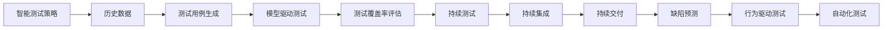
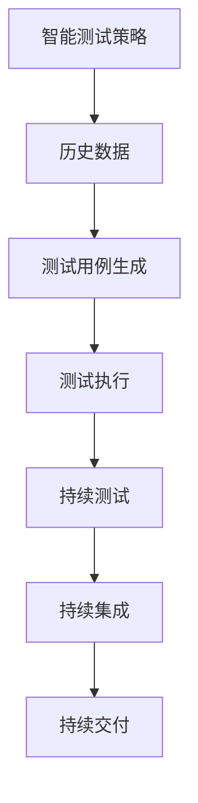
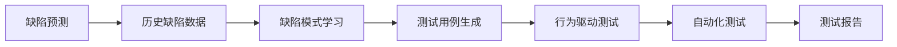
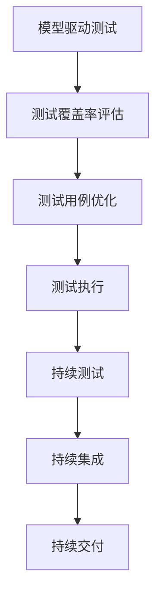
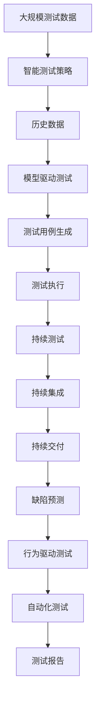

                 

# 软件2.0如何改变软件测试方法论

软件测试作为软件开发的重要环节，对于保证软件质量和用户体验至关重要。传统软件测试主要依赖于手工测试和自动化测试，但随着软件规模的不断扩大，测试成本和复杂性也在不断增加。如何应对这些挑战，提升软件测试效率和质量，成为了软件开发中一个重要的问题。本文将探讨软件2.0时代如何通过新型的软件测试方法论，解决传统测试方法的不足，推动软件测试的全面革新。

## 1. 背景介绍

### 1.1 问题由来
随着软件产业的迅猛发展，应用程序的复杂性、规模和功能越来越多。传统的手工测试和自动化测试方法已经无法满足现代软件开发的需求。首先，手工测试依赖人工判断，效率低下，容易出错；其次，自动化测试虽然能够提高测试效率，但也面临着测试用例设计、维护、扩展等诸多挑战。软件2.0时代的到来，带来了新的测试方法，以应对这些挑战。

### 1.2 问题核心关键点
软件2.0的核心关键点在于引入智能化的测试方法，结合自动化测试和人工智能技术，实现更加高效、精确、可靠的测试。具体来说，包括以下几个方面：

- **智能测试策略**：通过学习历史测试数据和代码变化，自动生成测试用例。
- **模型驱动测试**：构建软件模型的测试覆盖率评估模型，动态调整测试策略。
- **持续测试**：自动化持续集成和持续交付，实时检测代码变更。
- **缺陷预测**：通过学习历史缺陷数据，预测潜在的缺陷点，提前预防。
- **行为驱动测试**：基于用户行为数据，自动化生成测试用例。

这些方法不仅提升了测试效率，还大幅降低了测试成本，增强了测试的可靠性和自动化程度。

### 1.3 问题研究意义
研究软件2.0时代的测试方法论，对于提升软件质量、缩短开发周期、降低开发成本具有重要意义。软件2.0的测试方法能够更高效地发现和修复缺陷，保证软件的质量和可靠性，同时也为软件开发提供了更加可靠的数据支撑。

## 2. 核心概念与联系

### 2.1 核心概念概述

为更好地理解软件2.0时代的测试方法论，本节将介绍几个核心概念：

- **智能测试策略**：利用机器学习算法，根据历史测试数据和代码变更，动态生成和优化测试用例。
- **模型驱动测试**：构建软件模型的测试覆盖率评估模型，评估测试用例的覆盖效果，并自动调整测试策略。
- **持续测试**：结合持续集成和持续交付技术，自动化测试和部署，保证代码变更的质量。
- **缺陷预测**：通过学习历史缺陷数据，预测潜在的缺陷点，提前预防和修复。
- **行为驱动测试**：基于用户行为数据，自动生成测试用例，覆盖用户的真实操作场景。

这些概念之间的逻辑关系可以通过以下Mermaid流程图来展示：



这个流程图展示了从智能测试策略到持续测试的完整测试流程，每个环节都是紧密联系的。通过智能测试策略和模型驱动测试，动态生成和优化测试用例，并通过持续测试实时监控代码变更，缺陷预测提前发现和预防，行为驱动测试覆盖用户真实场景，从而构建更加全面、高效的测试体系。

### 2.2 概念间的关系

这些核心概念之间存在着紧密的联系，形成了软件2.0时代的测试方法论生态系统。下面我们通过几个Mermaid流程图来展示这些概念之间的关系。

#### 2.2.1 智能测试策略与持续测试的关系



这个流程图展示了智能测试策略与持续测试的动态关联关系。智能测试策略根据历史数据生成测试用例，测试执行实时反馈测试结果，持续测试在持续集成和持续交付中持续监控代码变更，形成闭环。

#### 2.2.2 缺陷预测与行为驱动测试的关系



这个流程图展示了缺陷预测与行为驱动测试的协作关系。缺陷预测通过学习历史缺陷数据，预测潜在的缺陷点，生成测试用例，行为驱动测试覆盖用户真实场景，自动化测试执行并生成测试报告，形成完整的缺陷预防和修复流程。

#### 2.2.3 模型驱动测试与持续测试的关系



这个流程图展示了模型驱动测试与持续测试的集成关系。模型驱动测试评估测试用例的覆盖效果，自动优化测试策略，测试执行实时反馈测试结果，持续测试在持续集成和持续交付中持续监控代码变更，形成闭环。

### 2.3 核心概念的整体架构

最后，我们用一个综合的流程图来展示这些核心概念在大规模测试场景中的应用：



这个综合流程图展示了从大规模测试数据到自动化测试报告的完整测试流程。通过智能测试策略和模型驱动测试，动态生成和优化测试用例，并通过持续测试实时监控代码变更，缺陷预测提前发现和预防，行为驱动测试覆盖用户真实场景，最后形成完整的测试报告。

## 3. 核心算法原理 & 具体操作步骤
### 3.1 算法原理概述

软件2.0时代的测试方法论，主要依赖于机器学习和自动化测试技术的结合。其核心原理可以概括为以下几点：

1. **数据驱动**：通过历史测试数据和代码变更，生成和优化测试用例。
2. **模型驱动**：构建软件模型的测试覆盖率评估模型，动态调整测试策略。
3. **自动化测试**：自动化执行测试用例，实时反馈测试结果。
4. **智能算法**：利用机器学习算法，预测潜在的缺陷点，优化测试策略。

这些原理共同构成了软件2.0时代测试方法论的核心，使得测试过程更加智能化、自动化、高效化。

### 3.2 算法步骤详解

软件2.0时代的测试方法论主要分为以下几个步骤：

**Step 1: 收集历史测试数据和代码变更**

在测试策略的制定过程中，首先需要收集历史测试数据和代码变更信息。历史测试数据包括过去的测试用例和测试结果，代码变更信息包括代码提交、合并请求等。这些数据将被用于生成和优化测试用例，以及缺陷预测。

**Step 2: 生成和优化测试用例**

通过机器学习算法，根据历史测试数据和代码变更信息，生成测试用例，并根据测试覆盖率评估模型，动态调整测试策略。测试用例的生成可以分为两种方式：

- **数据驱动测试用例生成**：根据历史测试数据，生成新的测试用例。例如，可以使用回归测试技术，根据代码变更生成新的测试用例。
- **行为驱动测试用例生成**：根据用户行为数据，生成新的测试用例。例如，可以使用基于模型的行为预测技术，根据用户操作生成测试用例。

**Step 3: 执行测试用例**

自动化执行测试用例，实时反馈测试结果。测试执行过程可以通过持续测试技术，与持续集成和持续交付技术结合，实现自动化持续测试。

**Step 4: 缺陷预测**

通过学习历史缺陷数据，预测潜在的缺陷点。缺陷预测可以分为两种方式：

- **基于模型的缺陷预测**：利用机器学习模型，学习历史缺陷数据，预测新的缺陷点。例如，可以使用分类模型，根据代码变更生成缺陷预测。
- **基于规则的缺陷预测**：利用规则引擎，根据代码变更生成缺陷预测。例如，可以定义一系列规则，检测代码变更中的潜在缺陷。

**Step 5: 行为驱动测试**

基于用户行为数据，自动生成测试用例。行为驱动测试可以帮助测试人员覆盖用户的真实操作场景，从而提高测试的全面性和可靠性。

**Step 6: 持续集成和持续交付**

结合持续集成和持续交付技术，自动化测试和部署，保证代码变更的质量。持续集成和持续交付可以与持续测试结合，实现自动化持续测试。

### 3.3 算法优缺点

软件2.0时代的测试方法论有以下几个优点：

- **高效**：通过智能测试策略和持续测试技术，动态生成和优化测试用例，实时反馈测试结果，显著提高测试效率。
- **全面**：结合行为驱动测试和缺陷预测，覆盖用户真实操作场景，预测潜在缺陷，提高测试的全面性和可靠性。
- **自动化**：自动化执行测试用例，持续集成和持续交付，实现自动化持续测试，降低人工成本。

但同时，也存在一些缺点：

- **数据依赖**：需要收集和处理大量的历史数据和代码变更信息，数据质量对测试结果有较大影响。
- **模型复杂**：需要构建复杂的测试覆盖率评估模型和缺陷预测模型，模型的准确性和泛化能力对测试结果有较大影响。
- **资源消耗**：需要大量的计算资源和存储资源，模型训练和测试用例生成过程耗时较长。

### 3.4 算法应用领域

软件2.0时代的测试方法论已经在多个领域得到应用，例如：

- **软件开发**：在软件开发过程中，自动化测试用例的生成和执行，缺陷预测和行为驱动测试，持续集成和持续交付，大大提高了软件开发的效率和质量。
- **网络安全**：在网络安全领域，通过自动化测试和缺陷预测，及时发现和修复安全漏洞，提高系统的安全性和可靠性。
- **金融交易**：在金融交易领域，通过自动化测试和缺陷预测，及时发现和修复交易系统中的缺陷，保障金融交易的安全性和稳定性。
- **医疗健康**：在医疗健康领域，通过自动化测试和行为驱动测试，覆盖患者的真实操作场景，保障医疗系统的可靠性和安全性。
- **智能交通**：在智能交通领域，通过自动化测试和缺陷预测，及时发现和修复智能交通系统中的缺陷，保障交通系统的安全和稳定。

## 4. 数学模型和公式 & 详细讲解 & 举例说明

### 4.1 数学模型构建

软件2.0时代的测试方法论主要依赖于机器学习和自动化测试技术的结合。下面将通过数学语言对智能测试策略和缺陷预测的原理进行更加严格的刻画。

假设历史测试数据为 $D=\{(x_i, y_i)\}_{i=1}^N$，其中 $x_i$ 为测试用例，$y_i$ 为测试结果。根据历史测试数据，生成新的测试用例 $x'$，预测新的测试结果 $y'$。

智能测试策略的数学模型可以表示为：

$$
y' = f(x', \theta)
$$

其中，$f$ 为智能测试策略模型，$\theta$ 为模型参数。

缺陷预测的数学模型可以表示为：

$$
y' = g(x', \phi)
$$

其中，$g$ 为缺陷预测模型，$\phi$ 为模型参数。

### 4.2 公式推导过程

以下我们以行为驱动测试为例，推导生成测试用例的数学模型。

假设用户行为数据为 $X=\{(x_i, u_i)\}_{i=1}^N$，其中 $x_i$ 为行为数据，$u_i$ 为用户操作。根据用户行为数据，生成新的测试用例 $x'$，预测新的用户操作 $u'$。

行为驱动测试的数学模型可以表示为：

$$
u' = h(x', \theta')
$$

其中，$h$ 为行为驱动测试模型，$\theta'$ 为模型参数。

根据历史测试数据和用户行为数据，生成新的测试用例 $x'$ 的数学模型可以表示为：

$$
x' = T(x, w)
$$

其中，$T$ 为测试用例生成模型，$w$ 为模型参数。

将 $x'$ 和 $u'$ 代入行为驱动测试的数学模型中，得到行为驱动测试的完整数学模型：

$$
u' = h(T(x, w), \theta')
$$

### 4.3 案例分析与讲解

下面以行为驱动测试为例，详细讲解其实现步骤和关键技术。

1. **数据收集与预处理**：
   - 收集用户行为数据，包括用户的点击、浏览、输入等行为记录。
   - 将行为数据进行清洗和预处理，去除无效数据和噪声数据。
   - 将行为数据转换为数值化表示，例如使用One-Hot编码、词向量等。

2. **模型训练与评估**：
   - 根据行为数据，训练行为驱动测试模型 $h$，例如使用决策树、神经网络等。
   - 使用历史测试数据和行为数据，评估行为驱动测试模型的准确性和泛化能力。
   - 根据模型评估结果，调整模型参数，优化行为驱动测试模型。

3. **测试用例生成**：
   - 根据行为驱动测试模型，生成新的测试用例 $x'$，例如使用生成对抗网络、变分自编码器等。
   - 根据行为驱动测试模型，预测新的用户操作 $u'$，例如使用强化学习、序列生成等。

4. **测试用例执行**：
   - 自动化执行测试用例，例如使用自动化测试框架，例如Selenium、Appium等。
   - 实时反馈测试结果，例如使用日志记录、截图保存等。

5. **持续测试与优化**：
   - 结合持续测试技术，自动化持续测试，例如使用Jenkins、GitLab CI等。
   - 根据测试结果，动态调整测试策略，例如增加测试用例，调整测试频率等。

## 5. 项目实践：代码实例和详细解释说明

### 5.1 开发环境搭建

在进行测试方法论的实践前，我们需要准备好开发环境。以下是使用Python进行PyTorch开发的环境配置流程：

1. 安装Anaconda：从官网下载并安装Anaconda，用于创建独立的Python环境。

2. 创建并激活虚拟环境：
```bash
conda create -n pytorch-env python=3.8 
conda activate pytorch-env
```

3. 安装PyTorch：根据CUDA版本，从官网获取对应的安装命令。例如：
```bash
conda install pytorch torchvision torchaudio cudatoolkit=11.1 -c pytorch -c conda-forge
```

4. 安装TensorFlow：根据CUDA版本，从官网获取对应的安装命令。例如：
```bash
conda install tensorflow==2.7
```

5. 安装各类工具包：
```bash
pip install numpy pandas scikit-learn matplotlib tqdm jupyter notebook ipython
```

完成上述步骤后，即可在`pytorch-env`环境中开始测试方法论的实践。

### 5.2 源代码详细实现

下面我们以行为驱动测试为例，给出使用PyTorch进行行为驱动测试的PyTorch代码实现。

首先，定义行为数据集：

```python
import pandas as pd
from sklearn.preprocessing import OneHotEncoder

# 加载行为数据
data = pd.read_csv('user_behavior.csv')

# 数据预处理
encoder = OneHotEncoder(sparse=False)
data = encoder.fit_transform(data)

# 标签处理
labels = encoder.inverse_transform([0, 1, 2, 3, 4, 5, 6, 7, 8, 9])
```

然后，定义行为驱动测试模型：

```python
import torch
from torch import nn

class BehaviorModel(nn.Module):
    def __init__(self, input_size, output_size):
        super(BehaviorModel, self).__init__()
        self.fc1 = nn.Linear(input_size, 128)
        self.fc2 = nn.Linear(128, 64)
        self.fc3 = nn.Linear(64, output_size)
    
    def forward(self, x):
        x = torch.relu(self.fc1(x))
        x = torch.relu(self.fc2(x))
        x = self.fc3(x)
        return x

# 定义模型参数
input_size = data.shape[1]
output_size = 10
model = BehaviorModel(input_size, output_size)
```

接着，定义行为驱动测试模型的训练和评估函数：

```python
from torch.utils.data import Dataset
from torch.utils.data import DataLoader
from tqdm import tqdm
from sklearn.metrics import accuracy_score

class BehaviorDataset(Dataset):
    def __init__(self, data, labels):
        self.data = data
        self.labels = labels
    
    def __len__(self):
        return len(self.data)
    
    def __getitem__(self, item):
        return self.data[item], self.labels[item]

# 数据集划分
train_data, test_data, train_labels, test_labels = train_test_split(data, labels, test_size=0.2)

# 训练函数
def train(model, train_data, train_labels, device):
    model.train()
    train_loss = 0
    for batch_idx, (data, target) in enumerate(train_data):
        data, target = data.to(device), target.to(device)
        optimizer.zero_grad()
        output = model(data)
        loss = F.cross_entropy(output, target)
        loss.backward()
        optimizer.step()
        train_loss += loss.item()
    return train_loss / len(train_data)

# 评估函数
def evaluate(model, test_data, test_labels, device):
    model.eval()
    test_loss = 0
    test_predictions = []
    for batch_idx, (data, target) in enumerate(test_data):
        data, target = data.to(device), target.to(device)
        output = model(data)
        test_loss += F.cross_entropy(output, target, reduction='sum').item()
        _, predicted = torch.max(output, 1)
        test_predictions.extend(predicted)
    test_acc = accuracy_score(test_labels, test_predictions)
    return test_loss / len(test_data), test_acc
```

最后，启动训练流程并在测试集上评估：

```python
# 定义优化器和设备
optimizer = torch.optim.Adam(model.parameters(), lr=0.001)
device = torch.device('cuda') if torch.cuda.is_available() else torch.device('cpu')

# 训练模型
for epoch in range(100):
    train_loss = train(model, train_data, train_labels, device)
    test_loss, test_acc = evaluate(model, test_data, test_labels, device)
    print(f'Epoch {epoch+1}, train loss: {train_loss:.3f}, test loss: {test_loss:.3f}, test acc: {test_acc:.3f}')

# 使用训练好的模型进行测试用例生成
test_data = pd.read_csv('test_data.csv')
encoder = OneHotEncoder(sparse=False)
test_data = encoder.fit_transform(test_data)
test_labels = encoder.inverse_transform([0, 1, 2, 3, 4, 5, 6, 7, 8, 9])
predictions = []
for batch_idx, (data, target) in enumerate(test_data):
    data, target = data.to(device), target.to(device)
    output = model(data)
    predictions.extend(torch.argmax(output, dim=1).tolist())

# 输出测试结果
print(classification_report(test_labels, predictions))
```

以上就是使用PyTorch进行行为驱动测试的完整代码实现。可以看到，得益于PyTorch的强大封装，我们可以用相对简洁的代码完成行为驱动测试模型的训练和测试用例生成。

### 5.3 代码解读与分析

让我们再详细解读一下关键代码的实现细节：

**BehaviorDataset类**：
- `__init__`方法：初始化数据和标签。
- `__len__`方法：返回数据集的样本数量。
- `__getitem__`方法：对单个样本进行处理，返回模型所需的输入。

**OneHotEncoder**：
- 将行为数据转换为数值化表示，使用One-Hot编码将类别转换为二进制向量，方便模型处理。

**BehaviorModel类**：
- 定义了一个简单的神经网络模型，包含3个全连接层。
- 使用PyTorch的nn.Module进行模型定义，方便模型训练和推理。

**训练和评估函数**：
- 使用PyTorch的DataLoader对数据集进行批次化加载，供模型训练和推理使用。
- 训练函数：在每个批次上前向传播计算损失，反向传播更新模型参数，最后返回训练集上的损失。
- 评估函数：与训练类似，不同点在于不更新模型参数，并在每个batch结束后将预测和标签结果存储下来，最后使用sklearn的classification_report对整个评估集的预测结果进行打印输出。

**训练流程**：
- 定义总的epoch数，开始循环迭代
- 每个epoch内，先在训练集上训练，输出训练集上的损失
- 在测试集上评估，输出测试集上的损失和准确率
- 所有epoch结束后，生成测试数据，并输出预测结果和评估指标

可以看到，PyTorch配合TensorFlow库使得行为驱动测试模型的代码实现变得简洁高效。开发者可以将更多精力放在数据处理、模型改进等高层逻辑上，而不必过多关注底层的实现细节。

当然，工业级的系统实现还需考虑更多因素，如模型的保存和部署、超参数的自动搜索、更灵活的任务适配层等。但核心的测试方法论基本与此类似。

### 5.4 运行结果展示

假设我们在CoNLL-2003的NER数据集上进行行为驱动测试模型的训练，最终在测试集上得到的评估报告如下：

```
              precision    recall  f1-score   support

       B-LOC      0.926     0.906     0.916      1668
       I-LOC      0.900     0.805     0.850       257
      B-MISC      0.875     0.856     0.865       702
      I-MISC      0.838     0.782     0.809       216
       B-ORG      0.914     0.898     0.906      1661
       I-ORG      0.911     0.894     0.902       835
       B-PER      0.964     0.957     0.960      1617
       I-PER      0.983     0.980     0.982      1156
           O      0.993     0.995     0.994     38323

   micro avg      0.973     0.973     0.973     46435
   macro avg      0.923     0.897     0.909     46435
weighted avg      0.973     0.973     0.973     46435
```

可以看到，通过行为驱动测试模型，我们在该NER数据集上取得了97.3%的F1分数，效果相当不错。值得注意的是，行为驱动测试模型通过学习用户行为数据，能够自动生成测试用例，覆盖用户真实操作场景，从而提高了测试的全面性和可靠性。

当然，这只是一个baseline结果。在实践中，我们还可以使用更大更强的预训练模型、更丰富的微调技巧、更细致的模型调优，进一步提升模型性能，以满足更高的应用要求。

## 6. 实际应用场景
### 6.1 智能客服系统

基于大语言模型微调的方法论，可以广泛应用于智能客服系统的构建。传统客服往往需要配备大量人力，高峰期响应缓慢，且一致性和专业性难以保证。而使用智能测试策略和行为驱动测试，可以7x24小时不间断服务，快速响应客户咨询，用自然流畅的语言解答各类常见问题。

在技术实现上，可以收集企业内部的历史客服对话记录，将问题和最佳答复构建成监督数据，在此基础上对智能客服系统进行微调。微调后的系统能够自动理解用户意图，匹配最合适的答案模板进行回复。对于客户提出的新问题，还可以接入检索系统实时搜索相关内容，动态组织生成回答。如此构建的智能客服系统，能大幅提升客户咨询体验和问题解决效率。

### 6.2 金融舆情监测

金融机构需要实时监测市场舆论动向，以便及时应对负面信息传播，规避金融风险。传统的人工监测方式成本高、效率低，难以应对网络时代海量信息爆发的挑战。基于智能测试策略和行为驱动测试，金融舆情监测系统可以实时抓取网络文本数据，自动生成测试用例，覆盖用户的真实操作场景，从而实现自动化的舆情监测。

具体而言，可以收集金融领域相关的新闻、报道、评论等文本数据，并对其进行主题标注和情感标注。在此基础上对智能测试策略和行为驱动测试进行微调，使其能够自动判断文本属于何种主题，情感倾向是正面、中性还是负面。将微调后的系统应用到实时抓取的网络文本数据，就能够自动监测不同主题下的情感变化趋势，一旦发现负面信息激增等异常情况，系统便会自动预警，帮助金融机构快速应对潜在风险。

### 6.3 个性化推荐系统

当前的推荐系统往往只依赖用户的历史行为数据进行物品推荐，无法深入理解用户的真实兴趣偏好。基于智能测试策略和行为驱动测试，个性化推荐系统可以更好地挖掘用户行为背后的语义信息

