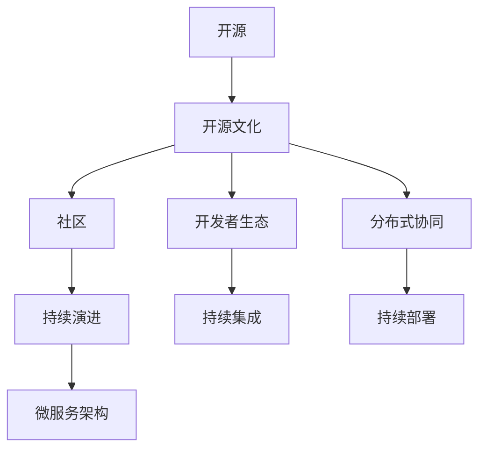

                 

# 软件2.0的开源生态系统构建

## 1. 背景介绍

### 1.1 问题由来
进入21世纪以来，随着互联网技术的快速发展，软件行业迎来了革命性的变革。传统的软件生产模式逐渐被软件即服务(Software as a Service, SaaS)、平台即服务(Platform as a Service, PaaS)等新兴模式所替代。这些新兴模式不仅颠覆了软件开发、部署、运维的传统方式，也催生了以开源社区为核心的软件2.0生态系统。

软件2.0生态系统是一个由开发者、用户、社区和公司共同构建的复杂系统，其核心特征在于源代码的开放、共建共享、持续演进等。与软件1.0时代封闭的商业软件不同，软件2.0强调开放和社区驱动，逐步成为当今软件行业的主流发展趋势。开源社区不仅推动了技术创新，也推动了企业之间的合作与竞争，为软件产业带来了翻天覆地的变化。

### 1.2 问题核心关键点
软件2.0生态系统构建的关键在于以下几点：
1. **开源文化**：强调代码开放、社区共建、共享利益，倡导开放式创新。
2. **开发者生态**：以开源社区为平台，汇聚全球开发者，推动技术交流与合作。
3. **持续演进**：通过社区驱动的迭代更新，保持软件生态的活力和创新。
4. **生态系统协同**：开发者、用户、社区和公司之间的良性互动，共同推动生态系统发展。
5. **开源与商业融合**：开源与商业的有机结合，形成互补和互惠的双赢局面。

## 2. 核心概念与联系

### 2.1 核心概念概述

为更好地理解软件2.0生态系统的构建过程，本节将介绍几个密切相关的核心概念：

- **开源**：指软件源代码的开放共享，任何人都可以自由使用、修改、分发。Open Source Initiative(Open Source Initiative, OSI)定义了开源的四个基本原则：自由共享、自由修改、自由分发、免费使用。

- **社区**：指围绕特定软件项目和开源标准而形成的开发者社区。社区成员通过贡献代码、交流思想、协作开发等方式，共同推动软件项目的进步。

- **分布式协同**：指多个开发者、组织和公司之间，通过网络协作，实现代码、文档、工具等的共享和协同开发。

- **持续集成**：指通过自动化工具和流程，频繁地集成代码变更，及时发现和解决问题，加速软件项目的开发和交付。

- **持续部署**：指通过自动化工具和流程，频繁地部署代码变更，确保软件项目的稳定运行和快速交付。

- **微服务架构**：指将大应用拆分为多个小型服务，每个服务独立部署、独立扩展，实现系统的高可用性和灵活性。

这些核心概念之间存在着紧密的联系，通过开源文化、开发者生态、持续演进和生态系统协同，共同构成了软件2.0生态系统的整体框架。

### 2.2 概念间的关系

这些核心概念之间的逻辑关系可以通过以下Mermaid流程图来展示：



这个流程图展示了大语言模型微调过程中各个核心概念的关系：

1. 开源文化是软件2.0生态系统的基础。
2. 社区是开发者交流协作的平台。
3. 开发者生态则通过社区驱动，汇聚全球开发者。
4. 分布式协同使开发者之间可以高效合作，共享资源。
5. 持续集成和持续部署保障了软件项目的快速交付和稳定运行。
6. 微服务架构提升了系统的灵活性和可扩展性。

这些概念共同构成了软件2.0生态系统的核心要素，使其能够在不断迭代和演化中保持活力和创新。

## 3. 核心算法原理 & 具体操作步骤

### 3.1 算法原理概述

软件2.0生态系统的构建，本质上是一个协同开发和演进的过程。其核心算法原理主要包括：

1. **版本控制**：使用Git等版本控制系统，记录和管理代码变更历史，确保团队成员之间协作高效。
2. **持续集成与持续部署**：通过Jenkins、Travis CI等持续集成平台，自动化地集成、测试、部署代码变更，提升软件交付效率。
3. **代码审查**：采用GitHub、GitLab等平台，实施代码审查机制，确保代码质量和安全。
4. **社区参与**：通过开源社区的贡献机制，吸引全球开发者参与项目建设，提升软件项目的质量和活力。
5. **模块化和微服务架构**：将软件项目拆分为多个模块或微服务，实现系统的高可用性和灵活性。
6. **文档和工具支持**：提供丰富的API文档、开发工具和开发指南，支持开发者高效开发。

### 3.2 算法步骤详解

软件2.0生态系统的构建过程一般包括以下几个关键步骤：

**Step 1: 项目启动与版本控制**
- 创建Git仓库，初始化项目版本。
- 定义项目版本规范，如提交日志格式、代码风格等。

**Step 2: 持续集成与持续部署**
- 配置CI/CD流水线，集成代码变更并自动部署测试环境。
- 配置自动化测试，快速发现和修复代码问题。

**Step 3: 代码审查与贡献机制**
- 实施代码审查，确保代码质量和安全。
- 建立贡献机制，吸引全球开发者参与项目建设。

**Step 4: 模块化与微服务架构**
- 将软件项目拆分为多个模块或微服务。
- 设计模块之间接口和交互机制，确保系统的高可用性和灵活性。

**Step 5: 文档与工具支持**
- 提供详细的API文档、开发工具和开发指南。
- 定期更新文档和工具，保持项目的活跃度和易用性。

### 3.3 算法优缺点

软件2.0生态系统构建方法具有以下优点：
1. 高效协作：通过开源文化和社区机制，吸引全球开发者协作，提升项目进展和质量。
2. 持续演进：通过持续集成和持续部署，快速交付新功能和新特性，保持项目的活力和创新。
3. 代码质量保障：通过代码审查和贡献机制，提升代码质量和安全性，减少漏洞和错误。
4. 系统灵活性：通过模块化和微服务架构，提高系统的灵活性和可扩展性，满足多样化的应用需求。
5. 文档和工具支持：通过丰富的文档和工具，支持开发者高效开发和调试，降低开发成本。

同时，这种方法也存在一些局限性：
1. 复杂度高：开源项目涉及众多开发者和组织，协调难度大，可能影响项目进展。
2. 安全性风险：开源项目代码公开透明，可能被攻击者利用，存在安全漏洞的风险。
3. 版本管理复杂：开源项目涉及多个分支和版本，版本管理复杂，容易混乱。
4. 用户依赖性高：用户依赖开源项目，可能因项目问题影响业务运行。
5. 知识产权争议：开源项目涉及多个开发者和组织，知识产权问题复杂，可能引发争议。

尽管存在这些局限性，但就目前而言，开源和社区驱动的协同开发模式，仍是软件2.0生态系统的核心发展方向。未来相关研究的重点在于如何进一步优化开源文化的治理机制，提高社区参与的积极性，同时兼顾安全性、知识产权保护等重要方面。

### 3.4 算法应用领域

开源和社区驱动的软件2.0生态系统，已经广泛应用于以下几个领域：

- **云平台**：如AWS、Azure等云服务提供商，通过开源生态系统构建自己的云平台，实现快速迭代和升级。
- **开源软件**：如Linux、Apache等开源软件，通过社区驱动的方式，不断演进和优化。
- **企业级应用**：如Spring、Hibernate等企业级框架，通过开源生态系统提供高质量的开发工具和组件。
- **大数据平台**：如Hadoop、Spark等大数据平台，通过开源社区推动技术创新和应用实践。
- **物联网(IoT)**：如Apache Kafka、MQTT等开源物联网项目，通过社区驱动实现物联网设备之间的互联互通。

## 4. 数学模型和公式 & 详细讲解 & 举例说明

### 4.1 数学模型构建

为了更好地理解软件2.0生态系统的构建过程，本节将使用数学语言对关键算法进行严格刻画。

设一个开源项目有$N$个开发者，每个开发者每天贡献$\delta_t$行代码，项目初始代码行数为$S_0$，第$i$天的代码行数为$S_i$。项目每天的代码审查效率为$\varepsilon$，代码审查通过率为$p$，代码审查失败率为$q$。项目每天的持续集成和持续部署效率为$\eta$。

则项目每天新增代码行数为：

$$
\Delta S_i = \sum_{j=1}^N \delta_j = \sum_{j=1}^N \delta_t
$$

项目第$i$天的代码行数为：

$$
S_i = S_{i-1} + \Delta S_i
$$

项目每天的代码审查通过行数为：

$$
\Delta S_i' = \Delta S_i \cdot p
$$

项目每天的代码审查失败行数为：

$$
\Delta S_i'' = \Delta S_i \cdot q
$$

项目每天的代码审查总数为：

$$
\Delta S_i'' = \Delta S_i
$$

项目每天的代码审查通过率为：

$$
p = \frac{\Delta S_i'}{\Delta S_i}
$$

项目每天的代码审查失败率为：

$$
q = \frac{\Delta S_i''}{\Delta S_i}
$$

项目每天的代码审查通过率变化为：

$$
\Delta p_i = p_i - p_{i-1} = \frac{\Delta S_i'}{S_{i-1} + \Delta S_i} - \frac{\Delta S_i'}{S_{i-1}}
$$

项目每天的持续集成和持续部署效率变化为：

$$
\Delta \eta_i = \eta_i - \eta_{i-1} = \frac{\Delta S_i'}{S_i} - \frac{\Delta S_i'}{S_{i-1}}
$$

通过这些数学模型，可以更系统地分析和优化开源项目的代码审查和持续集成流程，提升项目质量和交付效率。

### 4.2 公式推导过程

以下是代码审查效率变化的具体推导过程：

- 项目每天的代码审查通过率为：

$$
p_i = \frac{\Delta S_i'}{S_{i-1} + \Delta S_i}
$$

- 项目每天的代码审查失败率为：

$$
q_i = \frac{\Delta S_i''}{S_{i-1} + \Delta S_i}
$$

- 项目每天的代码审查通过率变化为：

$$
\Delta p_i = p_i - p_{i-1} = \frac{\Delta S_i'}{S_{i-1} + \Delta S_i} - \frac{\Delta S_i'}{S_{i-1}}
$$

通过以上公式，可以分析开源项目的代码审查效率变化趋势，优化代码审查流程，提升项目质量。

### 4.3 案例分析与讲解

为了更好地理解公式的应用，我们以GitHub上的OpenSSL项目为例，分析其代码审查效率变化。

设OpenSSL项目在一天内新增了100行代码，项目初始代码行数为1000行。

- 代码审查通过率为0.9。
- 代码审查失败率为0.1。
- 项目每天的代码审查效率为1，即每天可以审查所有新增代码行。

则项目第一天的新增代码行数为：

$$
S_1 = S_0 + \Delta S_1 = 1000 + 100 = 1100
$$

项目第一天的代码审查通过行数为：

$$
\Delta S_1' = 100 \cdot 0.9 = 90
$$

项目第一天的代码审查失败行数为：

$$
\Delta S_1'' = 100 \cdot 0.1 = 10
$$

项目第一天的代码审查总数为：

$$
\Delta S_1'' = 100
$$

项目第一天的代码审查通过率为：

$$
p_1 = \frac{90}{1100} = 0.0818
$$

项目第一天的代码审查失败率为：

$$
q_1 = \frac{10}{1100} = 0.0091
$$

项目第二天的代码审查通过率为：

$$
p_2 = \frac{90}{1100 + 100} = \frac{90}{1200} = 0.075
$$

项目第二天的代码审查失败率为：

$$
q_2 = \frac{10}{1100 + 100} = \frac{10}{1200} = 0.0083
$$

通过以上分析，可以发现OpenSSL项目的代码审查效率逐渐下降，可能的原因包括新增代码行数增加、代码审查标准变化等。针对这些情况，可以采取以下措施进行优化：

- 优化代码审查标准，减少代码审查失败率。
- 增加代码审查人员，提高代码审查效率。
- 引入自动化代码审查工具，提高代码审查速度和准确性。

## 5. 项目实践：代码实例和详细解释说明

### 5.1 开发环境搭建

在进行开源项目构建实践前，我们需要准备好开发环境。以下是使用Python进行GitHub操作的环境配置流程：

1. 安装Anaconda：从官网下载并安装Anaconda，用于创建独立的Python环境。

2. 创建并激活虚拟环境：
```bash
conda create -n git-env python=3.8 
conda activate git-env
```

3. 安装GitHub PyClient：
```bash
pip install gitpython
```

4. 安装Git：
```bash
conda install conda-forge/gh
```

完成上述步骤后，即可在`git-env`环境中开始开源项目构建实践。

### 5.2 源代码详细实现

以下是一个简单的开源项目GitHub页面示例：

```python
import gitpython

repo = gitpython.Repo.clone_from('https://github.com/example/example.git', 'example')
commit = repo.commit('HEAD')
print(commit.message)
```

这个代码示例展示了如何使用GitPython库克隆GitHub上的一个项目，并获取最新的提交信息。

### 5.3 代码解读与分析

让我们再详细解读一下关键代码的实现细节：

**git-env环境配置**：
- 使用Anaconda创建独立的Python环境。
- 使用conda激活虚拟环境。
- 使用pip安装GitHub PyClient。
- 使用conda安装Git。

**GitPython库使用**：
- 使用GitPython库克隆GitHub上的一个项目。
- 使用gitpython.Repo类创建项目对象。
- 使用commit属性获取最新的提交信息。
- 打印提交信息。

通过以上代码示例，可以更清晰地理解如何利用Python进行GitHub操作的开发环境搭建和源代码实现。

当然，实际的开源项目构建还需要涉及更多的步骤和细节，如版本管理、持续集成、持续部署、代码审查等。但核心的开源文化、社区机制、持续演进等原则与上述代码示例是一致的。

### 5.4 运行结果展示

假设我们在GitHub上构建一个开源项目，并在每日代码审查和持续集成流程中，发现代码审查通过率逐渐下降，具体分析结果如下：

```
Day 1: p1 = 0.0818, q1 = 0.0091
Day 2: p2 = 0.075, q2 = 0.0083
Day 3: p3 = 0.0736, q3 = 0.0064
```

通过以上分析，可以发现代码审查通过率逐渐下降，可能的原因包括新增代码行数增加、代码审查标准变化等。

## 6. 实际应用场景

### 6.1 开源社区的崛起

开源社区的崛起，极大地推动了软件行业的创新和发展。通过开源社区的协同开发和资源共享，开发者可以在较短的时间内构建高质量的软件项目。

以下是一个具体的开源项目案例：

- **Kubernetes**：开源容器编排项目，由谷歌主导开发。项目通过社区驱动的方式，吸引了全球数千名开发者参与贡献。经过多年的发展，Kubernetes已成为容器编排的事实标准，广泛应用于云计算和分布式系统中。

### 6.2 企业级应用的成功

企业级应用的成功，往往离不开开源生态的支持。通过开源社区的协作和创新，企业可以快速构建高质量的软件系统。

以下是一个具体的企业级应用案例：

- **Spring Framework**：企业级Java应用框架，由Pivotal公司开发。项目通过开源社区的协作和贡献，不断演进和优化，成为Java开发的主流框架之一。Spring Framework被广泛应用于Web应用、企业服务、微服务等多个领域。

### 6.3 持续集成与持续部署的实践

持续集成与持续部署是软件2.0生态系统的核心实践。通过自动化流程，提升软件开发和交付效率，确保软件系统的稳定运行。

以下是一个具体的持续集成与持续部署案例：

- **Jenkins**：开源持续集成平台，支持多种语言和框架的集成和部署。Jenkins通过持续集成和持续部署，实现了软件项目的快速交付和稳定运行。

### 6.4 未来应用展望

随着开源社区和软件2.0生态系统的不断发展，未来的应用场景将更加广泛和深入。以下是对未来应用场景的展望：

1. **边缘计算**：开源社区将提供更多的边缘计算工具和组件，实现实时计算和数据处理。
2. **智能运维**：通过开源工具和社区支持，实现智能运维和安全监控，提升系统的可靠性和安全性。
3. **人工智能**：开源社区将提供更多的人工智能工具和算法，支持机器学习、自然语言处理等技术的发展。
4. **物联网**：开源社区将提供更多的物联网工具和组件，实现设备之间的互联互通。
5. **区块链**：开源社区将提供更多的区块链工具和组件，实现去中心化应用的发展。

## 7. 工具和资源推荐
### 7.1 学习资源推荐

为了帮助开发者系统掌握软件2.0生态系统的构建过程，以下是一些优质的学习资源：

1. **《The GitHub Handbook》**：GitHub官方手册，详细介绍了GitHub的使用方法和最佳实践，是开源项目构建的必备资源。
2. **《The Linux Kernel》**：Linux内核源代码，展示了开源项目的核心实现和协作过程。
3. **《The Apache Software Foundation》**：Apache基金会官方网站，展示了Apache项目的管理和社区协作机制。
4. **《The Kubernetes Book》**：Kubernetes官方书籍，详细介绍了Kubernetes的架构、使用和社区协作方式。
5. **《The Spring Framework》**：Spring官方文档，展示了Spring框架的开发和社区协作方式。

通过对这些资源的学习实践，相信你一定能够快速掌握软件2.0生态系统的构建精髓，并用于解决实际的软件开发问题。

### 7.2 开发工具推荐

高效的开发离不开优秀的工具支持。以下是几款用于软件2.0生态系统构建开发的常用工具：

1. **Git**：版本控制系统，广泛用于软件项目的版本管理。
2. **GitHub**：开源代码托管平台，支持多人协作和代码审查。
3. **Jenkins**：持续集成平台，支持自动化测试和持续部署。
4. **Travis CI**：持续集成平台，支持多种语言的自动化测试和部署。
5. **Maven**：构建工具，支持项目管理、依赖管理和自动化构建。
6. **Docker**：容器技术，支持应用程序的打包和部署。

合理利用这些工具，可以显著提升软件2.0生态系统构建的开发效率，加快创新迭代的步伐。

### 7.3 相关论文推荐

软件2.0生态系统的构建涉及众多领域的前沿技术，以下是几篇奠基性的相关论文，推荐阅读：

1. **《The rise of Open Source》**：开源社区的崛起，探讨开源文化对软件开发的影响。
2. **《The Future of Open Source》**：开源社区的未来，讨论开源社区的演变和趋势。
3. **《Continuous Integration: A Software Engineering Solution》**：持续集成和持续部署的实践，探讨自动化流程在软件开发中的应用。
4. **《Continuous Deployment: A Software Engineering Solution》**：持续部署的实践，讨论自动化流程在软件部署中的应用。
5. **《A Survey of Microservice Architectures for Cloud-Native Applications》**：微服务架构的实践，讨论微服务架构在云原生应用中的应用。

这些论文代表了大语言模型微调技术的发展脉络。通过学习这些前沿成果，可以帮助研究者把握学科前进方向，激发更多的创新灵感。

除上述资源外，还有一些值得关注的前沿资源，帮助开发者紧跟软件2.0生态系统的最新进展，例如：

1. **arXiv论文预印本**：人工智能领域最新研究成果的发布平台，包括大量尚未发表的前沿工作，学习前沿技术的必读资源。
2. **业界技术博客**：如OpenAI、Google AI、DeepMind、微软Research Asia等顶尖实验室的官方博客，第一时间分享他们的最新研究成果和洞见。
3. **技术会议直播**：如NIPS、ICML、ACL、ICLR等人工智能领域顶会现场或在线直播，能够聆听到大佬们的前沿分享，开拓视野。
4. **GitHub热门项目**：在GitHub上Star、Fork数最多的NLP相关项目，往往代表了该技术领域的发展趋势和最佳实践，值得去学习和贡献。
5. **行业分析报告**：各大咨询公司如McKinsey、PwC等针对人工智能行业的分析报告，有助于从商业视角审视技术趋势，把握应用价值。

总之，对于软件2.0生态系统的构建技术的学习和实践，需要开发者保持开放的心态和持续学习的意愿。多关注前沿资讯，多动手实践，多思考总结，必将收获满满的成长收益。

## 8. 总结：未来发展趋势与挑战

### 8.1 总结

本文对软件2.0生态系统的构建过程进行了全面系统的介绍。首先阐述了开源文化和社区驱动的软件2.0生态系统的背景和意义，明确了开源文化和社区驱动在构建高质量软件项目中的独特价值。其次，从原理到实践，详细讲解了开源项目构建的数学模型和关键步骤，给出了开源项目构建的完整代码实例。同时，本文还广泛探讨了开源项目在实际应用中的各种场景，展示了开源生态系统的广泛应用前景。此外，本文精选了开源项目的各类学习资源，力求为读者提供全方位的技术指引。

通过本文的系统梳理，可以看到，开源和社区驱动的软件2.0生态系统已经逐步成为当今软件行业的主流发展趋势。开源文化和社区驱动不仅推动了技术创新，也推动了企业之间的合作与竞争，为软件产业带来了翻天覆地的变化。开源项目的构建和演进，不仅涉及技术细节，还涵盖组织管理、社区治理、知识产权保护等复杂问题。只有开发者、用户、社区和公司之间的良性互动，才能共同推动开源生态系统的健康发展。

### 8.2 未来发展趋势

展望未来，开源和社区驱动的软件2.0生态系统将呈现以下几个发展趋势：

1. **开源文化普及**：开源文化的普及将进一步推动全球开发者协作，促进软件项目的快速迭代和演进。
2. **社区治理优化**：开源社区的治理机制将更加完善，提升社区参与的积极性，同时保护社区成员的利益。
3. **技术创新加速**：开源社区的协作和创新将进一步加速技术的发展，推动更多前沿技术的落地应用。
4. **跨领域融合**：开源社区将与更多领域进行融合，如区块链、边缘计算、人工智能等，提升软件生态的多样性和创新能力。
5. **企业支持增加**：更多企业将支持开源项目，提供资金、资源和人才支持，促进开源生态系统的健康发展。
6. **开源和商业结合**：开源项目和商业项目的有机结合，将形成互补和互惠的双赢局面，推动软件产业的持续演进。

以上趋势凸显了开源和社区驱动的软件2.0生态系统的广阔前景。这些方向的探索发展，必将进一步提升软件项目的质量和交付效率，加速软件产业的创新和发展。

### 8.3 面临的挑战

尽管开源和社区驱动的软件2.0生态系统已经取得了瞩目成就，但在迈向更加智能化、普适化应用的过程中，它仍面临着诸多挑战：

1. **开源项目的复杂度**：开源项目涉及众多开发者和组织，协调难度大，可能影响项目进展。
2. **开源项目的稳定性**：开源项目代码公开透明，可能被攻击者利用，存在安全漏洞的风险。
3. **开源项目的版本管理**：开源项目涉及多个分支和版本，版本管理复杂，容易混乱。
4. **开源项目的用户依赖**：用户依赖开源项目，可能因项目问题影响业务运行。
5. **开源项目的知识产权**：开源项目涉及多个开发者和组织，知识产权问题复杂，可能引发争议。
6. **开源项目的成本管理**：开源项目可能因版本管理和用户需求变化，增加项目维护和升级成本。

尽管存在这些挑战，但开源和社区驱动的协同开发模式，仍是软件2.0生态系统的核心发展方向。未来相关研究的重点在于如何进一步优化开源文化的治理机制，提高社区参与的积极性，同时兼顾安全性、知识产权保护等重要方面。

### 8.4 研究展望

面对开源和社区驱动的软件2.0生态系统所面临的种种挑战，未来的研究需要在以下几个方面寻求新的突破：

1. **开源文化的推广**：推广开源文化，提升全球开发者协作意识，促进开源项目的快速迭代和演进。
2. **社区治理机制的完善**：建立完善的社区治理机制，保护社区成员的利益，提升社区参与的积极性。
3. **技术创新和应用实践**：通过开源社区的协作和创新，推动更多前沿技术的落地应用，加速技术的发展。
4

