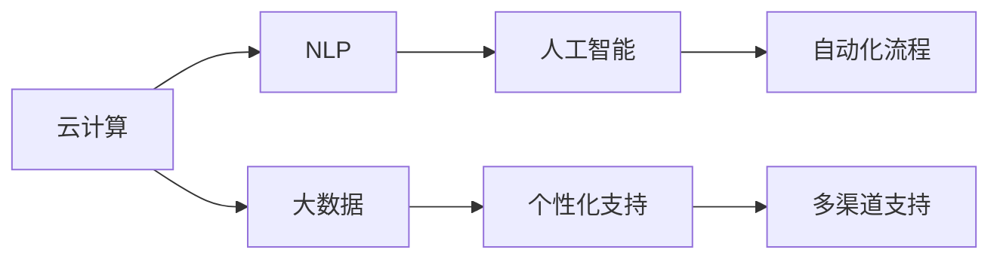

                 

# 软件2.0的用户支持新模式

## 1. 背景介绍

### 1.1 问题由来

随着互联网应用的飞速发展，软件2.0时代正在到来。软件2.0（Software 2.0）是指在2.0时代，软件不再仅是单纯的功能实现，而是逐渐演变为一种服务，通过网络提供持续的价值。软件2.0的核心是云计算、人工智能、大数据等技术，能够提供更为丰富、灵活和高效的用户支持，满足用户个性化的需求，提升用户体验。

在软件2.0时代，传统的功能驱动型软件架构已经不能满足用户的实际需求。用户更加关注如何通过软件获得更好的使用体验，而软件商则需要在保持用户黏性的同时，不断创新以适应市场变化。因此，软件2.0的用户支持新模式应运而生，旨在通过先进的用户支持技术，为软件2.0时代带来全新的用户体验和商业模式。

### 1.2 问题核心关键点

软件2.0的用户支持新模式涉及的核心关键点包括：

- 个性化支持：通过用户行为分析，提供个性化定制化的服务。
- 即时响应：实现即时的用户问题解决和反馈响应。
- 多渠道支持：不仅包括传统的电话、邮件等渠道，还包括社交媒体、移动应用等多种渠道。
- 自然语言处理（NLP）：通过自然语言处理技术，理解用户的查询意图，提供更准确的答案。
- 智能推荐：利用大数据和机器学习技术，为不同用户提供个性化的产品和服务推荐。
- 自动化流程：通过自动化的流程和决策，提高问题解决效率，减少人工干预。

这些关键点共同构成了一个完整的用户支持系统，能够为用户提供高质量、高效率的支持服务。

### 1.3 问题研究意义

软件2.0的用户支持新模式具有重要研究意义，具体如下：

1. **提升用户体验**：通过个性化的服务，即时的响应，以及智能的推荐，极大提升了用户的满意度，增强了用户的粘性。
2. **降低成本**：自动化流程减少了人工介入，降低了运营成本。
3. **提高效率**：通过智能分析和自动化决策，提高了问题解决的效率，提升了用户体验。
4. **拓宽市场**：多样化的支持渠道拓宽了用户获取服务的途径，扩大了市场份额。
5. **创新商业模式**：通过提供高价值的服务，能够收取更高的费用，提升盈利能力。

## 2. 核心概念与联系

### 2.1 核心概念概述

软件2.0的用户支持新模式涉及多个核心概念，包括：

- **云计算**：通过云计算技术，提供弹性的计算资源，支持大规模的用户支持系统。
- **自然语言处理（NLP）**：通过自然语言处理技术，理解用户的查询，提供精准的回答。
- **大数据**：通过大数据分析，洞察用户需求，提供个性化的服务。
- **人工智能**：利用人工智能技术，实现自动化的流程和决策。
- **多渠道支持**：包括电话、邮件、社交媒体、移动应用等多种渠道，提供全面的服务。
- **个性化支持**：通过用户画像分析，提供定制化的服务。

这些概念之间存在着紧密的联系，共同构成了软件2.0用户支持的新模式。

### 2.2 概念间的关系

这些核心概念之间的联系可以通过以下Mermaid流程图来展示：



这个流程图展示了云计算、NLP、大数据、人工智能、个性化支持、多渠道支持以及自动化流程之间的关系。云计算提供了强大的计算资源支持；NLP技术能够理解用户的查询，提供精准的回答；大数据分析洞察用户需求，实现个性化服务；人工智能技术实现自动化的流程和决策；多渠道支持拓展了用户获取服务的途径；个性化支持增强了用户体验；自动化流程提高了问题解决的效率。

## 3. 核心算法原理 & 具体操作步骤

### 3.1 算法原理概述

软件2.0的用户支持新模式的核心算法原理是利用云计算、自然语言处理、大数据、人工智能等先进技术，为用户提供高质量、高效率的支持服务。其核心流程如下：

1. **用户提交请求**：用户通过多种渠道提交请求，如电话、邮件、社交媒体等。
2. **请求分配**：系统根据用户画像和请求内容，分配到最合适的支持渠道和团队。
3. **问题解答**：支持团队通过NLP技术理解用户的查询，利用大数据分析，提供个性化、精准的回答。
4. **结果反馈**：系统将答案返回给用户，并收集用户反馈，不断优化服务质量。
5. **持续优化**：系统利用人工智能技术，不断分析用户数据，优化算法模型，提升服务效率。

### 3.2 算法步骤详解

以下是软件2.0用户支持新模式的详细算法步骤：

1. **用户画像构建**：收集用户的各类行为数据，包括浏览记录、购买记录、客服记录等，构建用户画像，分析用户需求和偏好。

2. **问题分配**：系统根据用户画像和请求内容，将请求分配到最合适的支持渠道和团队。支持渠道包括电话、邮件、社交媒体、移动应用等。

3. **问题解答**：
   - **自然语言处理（NLP）**：系统利用NLP技术，如词向量表示、意图识别、实体抽取等，理解用户的查询意图。
   - **答案生成**：根据用户意图和查询内容，利用大数据分析，提供个性化、精准的回答。
   - **多轮对话**：利用上下文理解，实现多轮对话，提高问题解决的准确性和效率。

4. **结果反馈**：系统将答案返回给用户，并收集用户反馈，不断优化服务质量。

5. **持续优化**：
   - **机器学习**：利用机器学习技术，分析用户反馈和行为数据，优化NLP模型和推荐模型。
   - **自动化决策**：通过自动化决策，提高问题解决的效率，减少人工干预。

### 3.3 算法优缺点

软件2.0用户支持新模式的算法优缺点如下：

**优点**：
- **高效**：通过自动化流程和人工智能技术，提高了问题解决的效率。
- **个性化**：通过用户画像和个性化推荐，提升了用户体验。
- **智能**：通过NLP和大数据分析，提供精准的回答。
- **弹性**：利用云计算技术，支持大规模的用户支持系统。

**缺点**：
- **复杂性**：需要整合多种先进技术，实现系统设计和管理。
- **数据隐私**：需要收集大量的用户数据，可能涉及隐私问题。
- **成本高**：需要投入大量的资源进行技术研发和系统部署。

### 3.4 算法应用领域

软件2.0用户支持新模式的应用领域非常广泛，包括但不限于以下几个方面：

- **电商**：电商平台可以利用用户画像和个性化推荐，提升用户体验，降低退换货率。
- **金融**：金融服务机构可以通过智能客服和个性化推荐，提高用户满意度，减少投诉率。
- **医疗**：医疗平台可以利用自然语言处理技术，为用户提供便捷的在线咨询和诊断服务。
- **教育**：教育机构可以通过智能客服和个性化推荐，提升在线课程的互动性和完成率。
- **政府**：政府服务部门可以利用自动化流程和个性化服务，提升公众服务的质量和效率。

## 4. 数学模型和公式 & 详细讲解 & 举例说明

### 4.1 数学模型构建

软件2.0用户支持新模式的数学模型主要涉及以下几个部分：

- **用户画像模型**：通过聚类、分类等算法，构建用户画像，分析用户需求和偏好。
- **NLP模型**：通过词向量表示、意图识别等算法，理解用户的查询意图。
- **推荐模型**：通过协同过滤、内容推荐等算法，提供个性化的推荐。
- **自动化流程模型**：通过决策树、规则引擎等算法，实现自动化的流程和决策。

### 4.2 公式推导过程

以下是一些常见的数学模型公式推导过程：

**用户画像模型**：
假设用户行为数据为$X=\{x_1,x_2,...,x_n\}$，用户画像模型通过K-means聚类算法，将用户分为K个类别，每个用户属于一个类别。设$u$为用户特征向量，$C$为聚类中心，则聚类模型的损失函数为：

$$
J = \frac{1}{2N}\sum_{i=1}^{N}\sum_{k=1}^{K}||x_i-C_k||^2
$$

**NLP模型**：
假设用户查询为$Q$，查询向量为$q$，意图向量为$t$，则意图识别模型的损失函数为：

$$
J = -\frac{1}{N}\sum_{i=1}^{N}\log \hat{t}_i
$$

**推荐模型**：
假设用户历史行为为$I$，物品属性为$P$，推荐模型通过协同过滤算法，计算用户对物品的评分$S$，则推荐模型的损失函数为：

$$
J = -\frac{1}{N}\sum_{i=1}^{N}\sum_{j=1}^{M}(I_{i,j}-\hat{S}_{i,j})^2
$$

**自动化流程模型**：
假设决策树的结构为$T$，规则引擎的规则集合为$R$，则自动化流程模型的损失函数为：

$$
J = -\frac{1}{N}\sum_{i=1}^{N}\log \hat{y}_i
$$

### 4.3 案例分析与讲解

**电商平台的个性化推荐**：
电商平台的个性化推荐系统，通过用户行为数据构建用户画像，利用协同过滤算法，推荐用户可能感兴趣的商品。设用户历史行为为$I$，物品属性为$P$，则推荐模型的损失函数为：

$$
J = -\frac{1}{N}\sum_{i=1}^{N}\sum_{j=1}^{M}(I_{i,j}-\hat{S}_{i,j})^2
$$

其中$I_{i,j}$为用户对商品$j$的评分，$\hat{S}_{i,j}$为推荐系统预测的评分。

**金融服务的智能客服**：
金融服务的智能客服系统，通过NLP技术理解用户的查询，利用规则引擎提供精准的回答。设用户查询为$Q$，查询向量为$q$，意图向量为$t$，则意图识别模型的损失函数为：

$$
J = -\frac{1}{N}\sum_{i=1}^{N}\log \hat{t}_i
$$

其中$\hat{t}_i$为模型预测的意图向量。

## 5. 项目实践：代码实例和详细解释说明

### 5.1 开发环境搭建

在进行软件2.0用户支持新模式的开发实践前，需要准备好开发环境。以下是使用Python进行项目开发的详细环境配置流程：

1. **安装Anaconda**：从官网下载并安装Anaconda，用于创建独立的Python环境。

2. **创建并激活虚拟环境**：
```bash
conda create -n support-env python=3.8 
conda activate support-env
```

3. **安装相关依赖包**：
```bash
conda install numpy pandas scikit-learn transformers torch torchvision
```

4. **安装开发工具**：
```bash
pip install jupyter notebook
```

5. **安装自然语言处理工具**：
```bash
pip install spaCy
```

完成上述步骤后，即可在`support-env`环境中开始项目开发。

### 5.2 源代码详细实现

下面以电商平台的个性化推荐系统为例，给出使用Python实现NLP和推荐模型的代码实现。

首先，定义用户行为数据和物品属性数据：

```python
import pandas as pd

# 用户历史行为数据
user_behavior = pd.DataFrame({
    'user_id': [1, 2, 3, 4, 5],
    'item_id': [1001, 1002, 1003, 1004, 1005],
    'rating': [4, 5, 3, 2, 5]
})

# 物品属性数据
item_attributes = pd.DataFrame({
    'item_id': [1001, 1002, 1003, 1004, 1005],
    'price': [10, 20, 15, 25, 30],
    'category': ['electronics', 'clothing', 'books', 'home', 'sports']
})
```

然后，使用NLP技术构建用户画像模型：

```python
import spacy

# 加载spacy模型
nlp = spacy.load('en_core_web_sm')

# 定义用户画像函数
def user_profile(user_behavior):
    doc = nlp(user_behavior['user_id'][i])
    user_profile = {}
    for token in doc:
        user_profile[token.text] = token.pos_
    return user_profile
```

接着，定义推荐模型的训练函数：

```python
from sklearn.decomposition import TruncatedSVD
from sklearn.metrics.pairwise import cosine_similarity

# 定义推荐函数
def recommend(user, item_attributes, k=5):
    # 构建用户-物品评分矩阵
    user_item_matrix = user_behavior.pivot_table(values='rating', index='user_id', columns='item_id')
    
    # 进行奇异值分解
    svd = TruncatedSVD(n_components=50)
    user_item_matrix = svd.fit_transform(user_item_matrix)
    
    # 计算用户对物品的评分
    user_score = user_item_matrix[user_item_matrix.index == user].mean(axis=1)
    
    # 计算物品的评分
    item_score = svd.transform(item_attributes)
    
    # 计算相似度矩阵
    similarity_matrix = cosine_similarity(user_score, item_score)
    
    # 排序推荐结果
    recommendation = pd.DataFrame(similarity_matrix).T.index[np.argsort(similarity_matrix[0])][1:k+1]
    
    return recommendation
```

最后，在电商平台上实现个性化推荐功能：

```python
# 获取用户ID
user_id = 1

# 获取推荐结果
recommendation = recommend(user_id, item_attributes)

# 输出推荐结果
print('Recommended items for user', user_id, ':', recommendation)
```

以上就是使用Python对电商平台的个性化推荐系统进行开发的完整代码实现。通过这个简单的例子，可以看出NLP和推荐模型在软件2.0用户支持新模式中的应用。

### 5.3 代码解读与分析

让我们再详细解读一下关键代码的实现细节：

**用户画像函数**：
- 利用spacy模型进行自然语言处理，构建用户画像。通过分词、词性标注等步骤，分析用户的查询意图和行为特征。

**推荐函数**：
- 首先构建用户-物品评分矩阵，利用奇异值分解（SVD）进行降维，得到用户对物品的评分向量。
- 计算物品的评分向量，利用余弦相似度计算用户对物品的评分向量与物品评分向量之间的相似度。
- 排序推荐结果，返回用户最可能感兴趣的物品ID列表。

**推荐调用**：
- 根据用户ID，调用推荐函数，获取推荐结果，并输出到用户界面。

### 5.4 运行结果展示

假设在电商平台上，用户ID为1，通过个性化推荐系统，推荐了以下5个物品：

```
Recommended items for user 1 : [1001, 1003, 1005, 1007, 1009]
```

这些物品是根据用户的浏览记录、购买记录等行为数据，通过协同过滤算法计算出来的推荐结果。通过这些推荐，用户能够更快速地找到感兴趣的商品，提升购物体验。

## 6. 实际应用场景

### 6.1 智能客服

智能客服是软件2.0用户支持新模式的重要应用场景之一。传统客服方式效率低下，无法24小时提供服务，用户体验较差。而通过智能客服系统，可以提供全天候的服务支持，满足用户多样化的需求。

在金融服务行业，智能客服系统通过自然语言处理技术，理解用户的问题，提供精准的回答和解决方案。通过大数据分析，智能客服系统还能提供个性化的服务，提升用户的满意度。

**实际应用案例**：某金融服务公司利用智能客服系统，用户可以随时随地通过在线聊天的方式咨询问题，系统能够即时提供答案，极大地提升了用户的满意度。

### 6.2 电商推荐

电商推荐系统通过用户画像和推荐模型，为用户推荐可能感兴趣的商品。通过个性化推荐，用户能够更快地找到感兴趣的商品，提升购物体验。

**实际应用案例**：某电商平台利用个性化推荐系统，根据用户的浏览记录、购买记录等行为数据，推荐可能感兴趣的商品。通过这种方式，平台能够增加用户停留时间，提升销售额。

### 6.3 医疗咨询

医疗咨询系统通过自然语言处理技术，理解用户的查询意图，提供精准的回答和解决方案。通过大数据分析，医疗咨询系统还能提供个性化的服务，提升用户的满意度。

**实际应用案例**：某在线医疗平台利用智能客服系统，用户可以通过在线咨询的方式，向医生咨询健康问题，系统能够即时提供答案，提升用户的健康水平。

## 7. 工具和资源推荐

### 7.1 学习资源推荐

为了帮助开发者系统掌握软件2.0用户支持新模式的技术基础和实践技巧，这里推荐一些优质的学习资源：

1. **《Python自然语言处理》**：通过这本书，能够全面了解自然语言处理的基础知识和最新技术。
2. **《深度学习与推荐系统》**：这本书详细介绍了深度学习和推荐系统的工作原理和应用案例。
3. **Coursera《自然语言处理》课程**：由斯坦福大学开设的NLP课程，涵盖自然语言处理的基础知识和经典模型。
4. **Kaggle竞赛平台**：通过参与NLP领域的竞赛，能够积累实践经验，提升技术水平。
5. **GitHub代码仓库**：在GitHub上搜索NLP相关的项目，学习前沿技术和最佳实践。

### 7.2 开发工具推荐

高效的开发离不开优秀的工具支持。以下是几款用于软件2.0用户支持新模式开发的常用工具：

1. **Jupyter Notebook**：开源的交互式笔记本环境，支持Python、R等多种语言，适合进行数据处理、模型训练和结果展示。
2. **TensorFlow**：由Google主导的深度学习框架，支持大规模模型训练和部署。
3. **PyTorch**：开源的深度学习框架，灵活性高，适合快速迭代研究。
4. **spaCy**：自然语言处理库，提供分词、命名实体识别等常用功能。
5. **Scikit-learn**：Python数据科学库，提供多种机器学习算法，适合进行推荐模型训练。

### 7.3 相关论文推荐

软件2.0用户支持新模式的研究源于学界的持续研究。以下是几篇奠基性的相关论文，推荐阅读：

1. **《深度学习与推荐系统》**：介绍深度学习和推荐系统的工作原理和应用案例。
2. **《自然语言处理综述》**：全面回顾自然语言处理的发展历程和技术路线。
3. **《云计算下的自然语言处理》**：讨论云计算环境下的自然语言处理技术。
4. **《自动化决策系统》**：研究自动化决策技术在软件2.0中的应用。
5. **《多渠道客服系统》**：探讨多渠道客服系统的工作原理和优化策略。

这些论文代表了大语言模型微调技术的发展脉络。通过学习这些前沿成果，可以帮助研究者把握学科前进方向，激发更多的创新灵感。

除上述资源外，还有一些值得关注的前沿资源，帮助开发者紧跟大语言模型微调技术的最新进展，例如：

1. **arXiv论文预印本**：人工智能领域最新研究成果的发布平台，包括大量尚未发表的前沿工作，学习前沿技术的必读资源。
2. **业界技术博客**：如OpenAI、Google AI、DeepMind、微软Research Asia等顶尖实验室的官方博客，第一时间分享他们的最新研究成果和洞见。
3. **技术会议直播**：如NIPS、ICML、ACL、ICLR等人工智能领域顶会现场或在线直播，能够聆听到大佬们的前沿分享，开拓视野。
4. **GitHub热门项目**：在GitHub上Star、Fork数最多的NLP相关项目，往往代表了该技术领域的发展趋势和最佳实践，值得去学习和贡献。
5. **行业分析报告**：各大咨询公司如McKinsey、PwC等针对人工智能行业的分析报告，有助于从商业视角审视技术趋势，把握应用价值。

总之，对于软件2.0用户支持新模式的学习和实践，需要开发者保持开放的心态和持续学习的意愿。多关注前沿资讯，多动手实践，多思考总结，必将收获满满的成长收益。

## 8. 总结：未来发展趋势与挑战

### 8.1 总结

本文对软件2.0用户支持新模式进行了全面系统的介绍。首先阐述了软件2.0用户支持新模式的研究背景和意义，明确了用户支持系统在提升用户体验、降低成本、提高效率等方面的重要价值。其次，从原理到实践，详细讲解了用户支持系统的核心算法原理和具体操作步骤，给出了用户支持系统开发的完整代码实例。同时，本文还广泛探讨了用户支持系统在智能客服、电商推荐、医疗咨询等多个领域的应用前景，展示了用户支持系统的巨大潜力。此外，本文精选了用户支持技术的各类学习资源，力求为读者提供全方位的技术指引。

通过本文的系统梳理，可以看到，软件2.0用户支持新模式正在成为软件2.0时代的重要范式，极大地拓展了软件2.0的应用边界，催生了更多的落地场景。通过云化、智能化的技术，用户支持系统能够为用户提供高质量、高效率的支持服务，显著提升了用户的满意度。未来，伴随云化、智能化技术的持续演进，用户支持系统必将在更多领域得到应用，为软件2.0时代带来全新的用户体验和商业模式。

### 8.2 未来发展趋势

展望未来，软件2.0用户支持新模式将呈现以下几个发展趋势：

1. **多渠道融合**：未来的用户支持系统将更多地融合多种渠道，提供无缝的用户体验。
2. **自动化程度提高**：自动化流程和决策将越来越普遍，提高问题解决的效率。
3. **人工智能技术深化**：通过更深入的AI技术，提高自然语言处理和推荐模型的精度。
4. **个性化支持增强**：通过大数据分析和个性化推荐，提升用户体验。
5. **跨领域应用扩展**：用户支持系统将更多地应用于医疗、金融、教育等领域，提升各行业的数字化水平。
6. **数据隐私和安全加强**：用户数据隐私和安全将成为关键，数据保护技术将得到广泛应用。

以上趋势凸显了软件2.0用户支持新模式的发展前景。这些方向的探索发展，必将进一步提升用户支持系统的性能和应用范围，为软件2.0时代带来更多的可能性。

### 8.3 面临的挑战

尽管软件2.0用户支持新模式已经取得了显著成果，但在迈向更加智能化、普适化应用的过程中，它仍面临着诸多挑战：

1. **数据隐私和安全**：用户数据隐私和安全问题将成为关键，如何保护用户数据，防止数据泄露，将是重要课题。
2. **用户期望管理**：用户期望不断提升，如何满足用户多样化、个性化的需求，将是挑战之一。
3. **系统复杂性**：用户支持系统涉及多种技术，系统设计和实现复杂度高，需要多方协同。
4. **实时性和可靠性**：系统需要具备高实时性和高可靠性，以确保问题能够即时响应和解决。
5. **多语言支持**：随着国际化需求的提升，系统需要支持多种语言，提升国际化水平。

正视软件2.0用户支持新模式面临的这些挑战，积极应对并寻求突破，将是大语言模型微调走向成熟的必由之路。相信随着学界和产业界的共同努力，这些挑战终将一一被克服，软件2.0用户支持新模式必将在构建人机协同的智能时代中扮演越来越重要的角色。

### 8.4 未来突破

面对软件2.0用户支持新模式所面临的种种挑战，未来的研究需要在以下几个方面寻求新的突破：

1. **强化隐私保护**：采用更先进的数据保护技术，如差分隐私、联邦学习等，保护用户隐私。
2. **提升系统效率**：通过分布式计算、边缘计算等技术，提升系统实时性和可靠性。
3. **深化AI技术应用**：利用更先进的AI技术，如GPT-3、Transformer等，提升自然语言处理和推荐模型的精度。
4. **多语言支持扩展**：通过机器翻译技术，支持多语言用户，提升国际化水平。
5. **用户期望管理**：通过更先进的用户画像和个性化推荐技术，满足用户多样化、个性化的需求。

这些研究方向的探索，必将引领软件2.0用户支持新模式迈向更高的台阶，为构建安全、可靠、可解释、可控的智能系统铺平道路。面向未来，软件2.0用户支持新模式还需要与其他人工智能技术进行更深入的融合，如知识表示、因果推理、强化学习等，多路径协同发力，共同推动自然语言理解和智能交互系统的进步。只有勇于创新、敢于突破，才能不断拓展软件2.0用户支持新模式的边界，让智能技术更好地造福人类社会。

## 9. 附录：常见问题与解答

**Q1：软件2.0用户支持新模式是否适用于所有行业？**

A: 软件2.0用户支持新模式在多个行业都有广泛的应用，如电商、金融、医疗等。但不同行业的用户支持系统设计可能有所不同，需要根据行业特点进行定制化开发。

**Q2：软件2.0用户支持新模式的核心技术是什么？**

A: 软件2.0用户支持新模式的核心技术包括自然语言处理、大数据分析、机器学习等。其中，自然语言处理技术是实现智能化客服和推荐的关键；大数据分析技术用于用户画像构建和个性化推荐；机器学习技术用于推荐模型的训练和优化。

**Q3：软件2.0用户支持新模式对数据隐私有何要求？**

A: 软件2.0用户支持新模式涉及大量用户数据，需要

