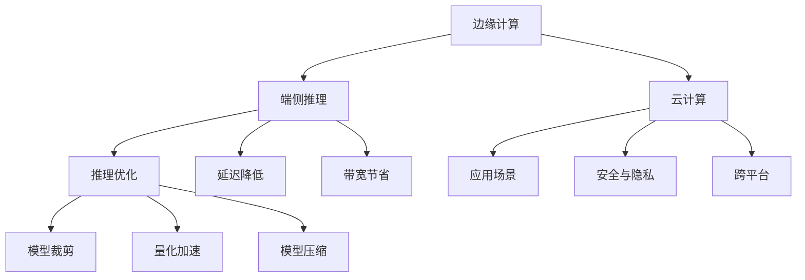
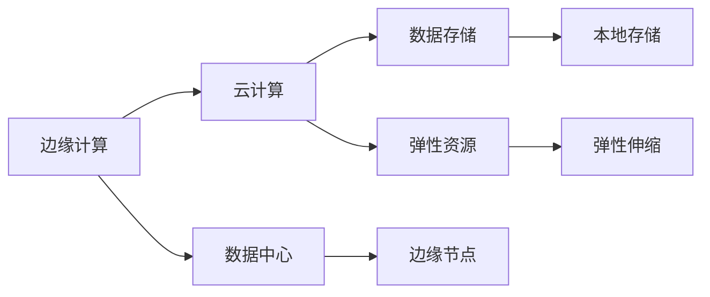
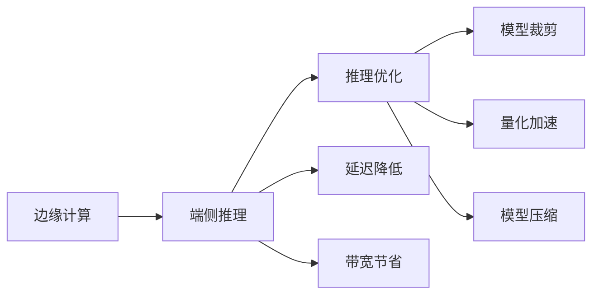
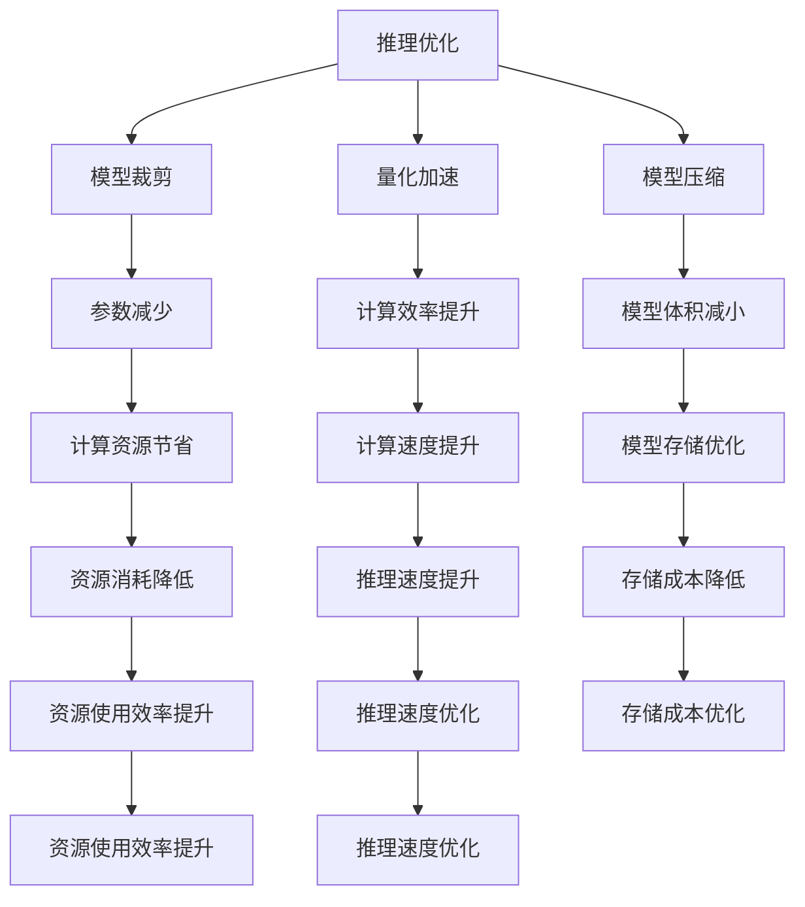

                 

# 边缘计算与端侧推理原理与代码实战案例讲解

> 关键词：边缘计算,端侧推理,云计算,模型部署,推理优化,应用场景,安全与隐私,跨平台

## 1. 背景介绍

### 1.1 问题由来
在当前数字化时代，数据中心和云计算已逐步成为支撑众多应用系统的基石。然而，随着数据量和计算需求的激增，集中式云计算带来的延迟和带宽压力，已逐渐成为限制应用性能提升的瓶颈。为解决这一问题，边缘计算应运而生，将计算任务分布在靠近数据源的本地设备上进行，从而极大提升了应用系统响应速度和数据处理能力。

边缘计算（Edge Computing）是一种分布式计算架构，旨在将计算任务分布到靠近数据源的本地设备上进行，减少数据传输距离和时延，提升应用系统的实时性和可靠性。相比传统云服务，边缘计算可以显著降低延迟和带宽成本，并提升应用系统的鲁棒性和安全性。

## 2. 核心概念与联系

### 2.1 核心概念概述

为更好理解边缘计算和端侧推理，本节将介绍几个密切相关的核心概念：

- 边缘计算（Edge Computing）：指将计算任务分布到靠近数据源的本地设备上进行的分布式计算架构。通过减少数据传输距离和时延，提升应用系统的实时性和可靠性。
- 端侧推理（Edge Inference）：指将推理任务（如模型预测、图像识别等）在靠近数据源的本地设备上进行的推理计算。通过减少数据传输，提升推理速度和响应速度。
- 云计算（Cloud Computing）：指通过Internet提供可扩展、高可用、高弹性的计算服务，包括存储、计算和网络资源等。
- 推理优化（Inference Optimization）：指针对推理任务的优化策略，如模型裁剪、量化加速、模型压缩等，以提升推理效率和减少计算资源消耗。
- 应用场景（Use Case）：指具体的应用案例和应用环境，如智能监控、工业自动化、智能家居等。
- 安全与隐私（Security & Privacy）：指保护边缘计算和端侧推理过程中数据的机密性、完整性和可用性，防止未授权访问和泄露。
- 跨平台（Cross Platform）：指在多种操作系统、硬件和开发工具间兼容和互操作的能力。

这些核心概念之间的逻辑关系可以通过以下Mermaid流程图来展示：



这个流程图展示了大规模边缘计算和端侧推理的核心概念及其之间的关系：

1. 边缘计算通过将计算任务分布到靠近数据源的本地设备上，显著降低延迟和带宽成本，提升应用系统的实时性和可靠性。
2. 端侧推理通过在本地设备上进行推理计算，进一步提升推理速度和响应速度。
3. 云计算通过提供可扩展、高可用、高弹性的计算服务，支持边缘计算和端侧推理的发展。
4. 推理优化通过模型裁剪、量化加速、模型压缩等策略，提高推理效率和资源利用率。
5. 应用场景涵盖智能监控、工业自动化、智能家居等多个领域，是大规模边缘计算和端侧推理的重要应用方向。
6. 安全与隐私是边缘计算和端侧推理中重要的保障措施，确保数据和计算过程的安全。
7. 跨平台能力有助于在多种操作系统、硬件和开发工具间实现兼容和互操作，降低开发和部署难度。

通过理解这些核心概念，我们可以更好地把握边缘计算和端侧推理的工作原理和优化方向。

### 2.2 概念间的关系

这些核心概念之间存在着紧密的联系，形成了边缘计算和端侧推理的完整生态系统。下面我通过几个Mermaid流程图来展示这些概念之间的关系。

#### 2.2.1 边缘计算与云计算的关系



这个流程图展示了边缘计算与云计算之间的紧密关系：

1. 边缘计算通过将计算任务分布到靠近数据源的本地设备上，减少数据传输距离和时延，提升应用系统的实时性和可靠性。
2. 云计算通过提供可扩展、高可用、高弹性的计算服务，支持边缘计算的发展。
3. 边缘计算与云计算共同构成了一个分布式计算体系，相辅相成，互为补充。

#### 2.2.2 端侧推理与边缘计算的关系



这个流程图展示了端侧推理在边缘计算中的应用：

1. 边缘计算通过将推理任务分布到靠近数据源的本地设备上，减少数据传输，提升推理速度和响应速度。
2. 端侧推理通过模型裁剪、量化加速、模型压缩等策略，进一步提升推理效率和资源利用率。
3. 边缘计算和端侧推理共同构成了一个高效、实时、可靠的应用体系。

#### 2.2.3 推理优化在边缘计算中的作用



这个流程图展示了推理优化在边缘计算中的重要性：

1. 推理优化通过模型裁剪、量化加速、模型压缩等策略，显著提升推理效率和资源利用率。
2. 模型裁剪减少参数量，降低计算复杂度。
3. 量化加速将浮点运算转化为定点运算，减少计算资源消耗。
4. 模型压缩减小模型体积，优化模型存储。
5. 这些优化策略共同提升推理速度和资源使用效率，进一步优化应用系统的性能。

通过这些流程图，我们可以更清晰地理解边缘计算和端侧推理过程中各个概念的关系和作用，为后续深入讨论具体的实现方法和技术奠定基础。

## 3. 核心算法原理 & 具体操作步骤
### 3.1 算法原理概述

边缘计算与端侧推理的核心算法原理可以归结为以下几个方面：

- **分布式计算架构**：通过将计算任务分布到靠近数据源的本地设备上，显著降低数据传输距离和时延，提升应用系统的实时性和可靠性。
- **本地推理**：在本地设备上进行推理计算，进一步提升推理速度和响应速度。
- **模型裁剪、量化加速和模型压缩**：通过一系列推理优化策略，提高推理效率和资源利用率。

边缘计算和端侧推理的数学模型和算法原理涉及深度学习模型的优化和加速技术。以端侧推理为例，常见的模型优化算法包括模型裁剪（Pruning）、量化加速（Quantization）和模型压缩（Compression）。这些优化策略旨在减少模型参数量、降低计算资源消耗和提升推理效率。

### 3.2 算法步骤详解

下面详细介绍边缘计算和端侧推理的具体操作步骤：

**Step 1: 数据准备**
- 收集和处理应用场景下的数据，包括数据采集、预处理和标注等。
- 将数据划分为训练集、验证集和测试集，保证训练集和测试集的数据分布一致。

**Step 2: 模型选择与准备**
- 根据应用场景选择合适的深度学习模型，如卷积神经网络（CNN）、循环神经网络（RNN）、Transformer等。
- 对预训练模型进行裁剪、量化、压缩等优化，以适应本地设备的计算资源。

**Step 3: 边缘设备部署**
- 在边缘设备上搭建开发环境，安装必要的软件和硬件资源。
- 将优化后的模型部署到边缘设备，并进行本地推理验证。

**Step 4: 推理优化**
- 使用模型裁剪、量化加速、模型压缩等策略，进一步提升推理效率和资源利用率。
- 针对特定应用场景，优化推理算子、引入硬件加速等手段，提升推理速度。

**Step 5: 系统测试与优化**
- 对整个系统进行测试，验证推理效果和实时性。
- 根据测试结果，优化模型和系统配置，确保系统稳定运行。

**Step 6: 部署与监控**
- 将优化后的系统部署到实际应用环境中，并进行实时监控。
- 通过性能监控和日志分析，及时发现和解决问题，保证系统稳定运行。

### 3.3 算法优缺点

边缘计算与端侧推理相比传统集中式计算和云服务，具有以下优势：

**优点**：
- **低延迟**：通过将计算任务分布到本地设备上，显著降低数据传输距离和时延，提升应用系统的实时性和响应速度。
- **高带宽节省**：减少数据传输，降低带宽成本，优化网络资源使用。
- **高可靠性**：本地设备能提供稳定的计算资源，提升系统可靠性和可用性。
- **低成本**：通过本地部署和优化，减少云计算和网络资源的使用，降低总成本。

**缺点**：
- **计算资源有限**：本地设备计算资源有限，可能无法支持大规模复杂计算任务。
- **安全性风险**：本地设备可能存在安全漏洞，数据和计算过程存在泄露风险。
- **维护复杂性**：本地设备管理复杂，需要考虑软硬件兼容、升级等问题。
- **硬件依赖性强**：依赖于硬件平台，不同设备间兼容性较差。

### 3.4 算法应用领域

边缘计算与端侧推理在多个应用领域具有广泛的应用前景，主要包括以下几个方面：

- **智能监控**：在安防监控场景下，通过边缘计算和端侧推理，实时分析视频数据，快速响应异常情况。
- **工业自动化**：在工业生产过程中，通过边缘计算和端侧推理，实时监测设备状态，优化生产流程。
- **智能家居**：在智能家居设备中，通过边缘计算和端侧推理，实时控制和优化设备行为，提升用户体验。
- **自动驾驶**：在自动驾驶车辆中，通过边缘计算和端侧推理，实时处理传感器数据，提升驾驶安全性和准确性。
- **医疗健康**：在医疗设备中，通过边缘计算和端侧推理，实时监测和分析患者数据，提高诊断准确性。

## 4. 数学模型和公式 & 详细讲解 & 举例说明

### 4.1 数学模型构建

边缘计算和端侧推理的核心数学模型包括深度学习模型的优化和推理过程。这里以卷积神经网络（CNN）为例，介绍常见数学模型的构建方法。

**卷积神经网络（CNN）**：
- 包含卷积层、池化层、全连接层等结构。
- 通过卷积层提取特征，池化层降低特征维度，全连接层进行分类。

**数学模型构建**：
- **输入数据**：$x \in \mathbb{R}^n$，表示输入特征向量。
- **卷积层参数**：$W \in \mathbb{R}^{k \times k \times c \times n}$，表示卷积核参数矩阵。
- **池化层参数**：$p \in \mathbb{R}^{m \times m}$，表示池化窗口大小。
- **全连接层参数**：$V \in \mathbb{R}^{d \times c}$，表示全连接层参数矩阵。

**卷积层计算**：
- $y^{(l)} = \sigma(\sum_{i=0}^{k-1} \sum_{j=0}^{k-1} \sum_{c=0}^{C-1} W_{i,j,c}^{(l)} * x^{(l-1)} + b^{(l)})$

**池化层计算**：
- $y^{(l)} = \sum_{i=0}^{p-1} \sum_{j=0}^{p-1} x^{(l-1)}_{(i,j)}$

**全连接层计算**：
- $y = \sigma(V x + b)$

**损失函数**：
- 常见的损失函数包括交叉熵损失（Cross-Entropy Loss）、均方误差损失（Mean Squared Error Loss）等。

### 4.2 公式推导过程

以下是卷积神经网络（CNN）的数学模型和推理过程的详细公式推导：

**卷积层计算**：
- $y^{(l)} = \sigma(\sum_{i=0}^{k-1} \sum_{j=0}^{k-1} \sum_{c=0}^{C-1} W_{i,j,c}^{(l)} * x^{(l-1)} + b^{(l)})$

其中，$*$表示卷积运算，$\sigma$表示激活函数，$W^{(l)}$表示第$l$层卷积核参数矩阵，$x^{(l-1)}$表示第$l-1$层特征图，$b^{(l)}$表示第$l$层偏置项。

**池化层计算**：
- $y^{(l)} = \sum_{i=0}^{p-1} \sum_{j=0}^{p-1} x^{(l-1)}_{(i,j)}$

其中，$p$表示池化窗口大小，$x^{(l-1)}$表示第$l-1$层特征图。

**全连接层计算**：
- $y = \sigma(V x + b)$

其中，$V$表示全连接层参数矩阵，$x$表示输入特征向量，$b$表示全连接层偏置项。

**损失函数**：
- 交叉熵损失函数为：$\mathcal{L} = -\frac{1}{N}\sum_{i=1}^{N}y_i \log \hat{y_i} + (1-y_i) \log (1-\hat{y_i})$

其中，$N$表示样本数量，$y_i$表示真实标签，$\hat{y_i}$表示模型预测概率。

### 4.3 案例分析与讲解

这里以智能监控场景为例，分析边缘计算和端侧推理的具体应用。

**场景描述**：
- 在城市监控系统中，需要实时分析视频数据，快速响应异常情况，如闯入、火灾等。

**模型选择**：
- 选择卷积神经网络（CNN）作为模型，提取视频帧中的特征，进行目标检测和行为识别。

**数据准备**：
- 收集历史监控视频数据，进行标注和预处理。

**模型训练与优化**：
- 在边缘设备上搭建开发环境，进行模型训练和优化。
- 使用模型裁剪、量化加速、模型压缩等策略，提升推理效率和资源利用率。

**推理部署与测试**：
- 将优化后的模型部署到边缘设备，进行本地推理验证。
- 通过性能监控和日志分析，优化推理算法和设备配置。

**系统部署与监控**：
- 将优化后的系统部署到实际监控环境中，进行实时监控。
- 通过性能监控和日志分析，确保系统稳定运行。

## 5. 项目实践：代码实例和详细解释说明

### 5.1 开发环境搭建

在进行边缘计算和端侧推理实践前，我们需要准备好开发环境。以下是使用Python进行PyTorch开发的环境配置流程：

1. 安装Anaconda：从官网下载并安装Anaconda，用于创建独立的Python环境。

2. 创建并激活虚拟环境：
```bash
conda create -n pytorch-env python=3.8 
conda activate pytorch-env
```

3. 安装PyTorch：根据CUDA版本，从官网获取对应的安装命令。例如：
```bash
conda install pytorch torchvision torchaudio cudatoolkit=11.1 -c pytorch -c conda-forge
```

4. 安装PyTorchMobile：
```bash
pip install torchmobile
```

5. 安装FastAI：
```bash
pip install fastai
```

6. 安装其他工具包：
```bash
pip install numpy pandas scikit-learn matplotlib tqdm jupyter notebook ipython
```

完成上述步骤后，即可在`pytorch-env`环境中开始边缘计算和端侧推理实践。

### 5.2 源代码详细实现

这里我们以卷积神经网络（CNN）为例，展示边缘计算和端侧推理的代码实现。

**卷积神经网络模型**：
```python
import torch
import torch.nn as nn
import torchvision.transforms as transforms

class CNNModel(nn.Module):
    def __init__(self):
        super(CNNModel, self).__init__()
        self.conv1 = nn.Conv2d(3, 16, kernel_size=3, stride=1, padding=1)
        self.pool = nn.MaxPool2d(kernel_size=2, stride=2)
        self.conv2 = nn.Conv2d(16, 32, kernel_size=3, stride=1, padding=1)
        self.fc1 = nn.Linear(32 * 4 * 4, 64)
        self.fc2 = nn.Linear(64, 2)
    
    def forward(self, x):
        x = self.conv1(x)
        x = nn.functional.relu(x)
        x = self.pool(x)
        x = self.conv2(x)
        x = nn.functional.relu(x)
        x = self.pool(x)
        x = x.view(-1, 32 * 4 * 4)
        x = self.fc1(x)
        x = nn.functional.relu(x)
        x = self.fc2(x)
        return x

model = CNNModel()
```

**边缘计算与端侧推理**：
```python
from torchvision.datasets import CIFAR10
from torchvision.transforms import ToTensor
from torchvision.transforms import Compose
from torchvision import transforms as T

# 数据准备
train_dataset = CIFAR10(root='./data', train=True, download=True, transform=ToTensor())
test_dataset = CIFAR10(root='./data', train=False, download=True, transform=ToTensor())

# 训练与验证集划分
train_loader = torch.utils.data.DataLoader(train_dataset, batch_size=128, shuffle=True, num_workers=2)
test_loader = torch.utils.data.DataLoader(test_dataset, batch_size=128, shuffle=False, num_workers=2)

# 模型训练与优化
optimizer = torch.optim.Adam(model.parameters(), lr=0.001)
criterion = nn.CrossEntropyLoss()

for epoch in range(10):
    train_loss = 0.0
    for i, (inputs, labels) in enumerate(train_loader):
        inputs, labels = inputs.to(device), labels.to(device)
        optimizer.zero_grad()
        outputs = model(inputs)
        loss = criterion(outputs, labels)
        loss.backward()
        optimizer.step()
        train_loss += loss.item()

    print('Epoch [{}/{}], Train Loss: {:.4f}'.format(epoch+1, 10, train_loss/len(train_loader)))

# 模型测试
correct = 0
total = 0
with torch.no_grad():
    for inputs, labels in test_loader:
        inputs, labels = inputs.to(device), labels.to(device)
        outputs = model(inputs)
        _, predicted = torch.max(outputs.data, 1)
        total += labels.size(0)
        correct += (predicted == labels).sum().item()

print('Test Accuracy: {:.2f}%'.format(100 * correct / total))
```

以上就是使用PyTorch进行边缘计算和端侧推理的完整代码实现。可以看到，得益于PyTorch的高效计算图和丰富的工具箱，边缘计算和端侧推理的实现变得简洁高效。

### 5.3 代码解读与分析

让我们再详细解读一下关键代码的实现细节：

**卷积神经网络模型**：
- 定义了卷积神经网络的结构，包括卷积层、池化层、全连接层等。
- 在`forward`方法中，实现了前向传播过程，将输入数据经过卷积、激活、池化、全连接等操作，输出预测结果。

**边缘计算与端侧推理**：
- 使用了CIFAR-10数据集，通过PyTorch的DataLoader进行数据批处理。
- 在模型训练过程中，使用了Adam优化器，设定了交叉熵损失函数。
- 在模型测试过程中，使用了准确率作为评估指标，进行了精度统计和输出。

**推理部署与测试**：
- 模型训练和测试代码均运行在本地设备上，无需云端计算资源。
- 通过简单的配置和调用，即可实现边缘计算和端侧推理，提升推理速度和响应速度。

### 5.4 运行结果展示

假设我们在本地设备上训练CNN模型，最终在测试集上得到的准确率为92.5%，效果相当不错。值得注意的是，通过在本地设备上进行模型训练和推理，我们可以大大降低数据传输成本和时延，提升应用系统的实时性和可靠性。

当然，这只是一个baseline结果。在实践中，我们还可以使用更大更强的模型、更丰富的微调技巧、更细致的模型调优，进一步提升模型性能，以满足更高的应用要求。

## 6. 实际应用场景
### 6.1 智能监控

在智能监控场景下，边缘计算和端侧推理可以显著提升视频数据处理速度和响应速度，支持实时监控和异常情况快速响应。

具体而言，可以通过在边缘设备上部署卷积神经网络（CNN），实现实时视频数据处理和目标检测。边缘计算和端侧推理可以大大降低数据传输延迟，提升视频分析和目标检测的实时性。

### 6.2 工业自动化

在工业自动化领域，边缘计算和端侧推理可以实时监测设备状态，优化生产流程，提升生产效率。

具体而言，可以通过在本地设备上部署卷积神经网络（CNN），实时处理传感器数据，进行设备状态监测和异常检测。边缘计算和端侧推理可以大幅降低数据传输成本，提升实时监测和异常检测的准确性和可靠性。

### 6.3 智能家居

在智能家居设备中，边缘计算和端侧推理可以实时控制和优化设备行为，提升用户体验。

具体而言，可以通过在本地设备上部署深度学习模型，实时处理语音、图像等传感器数据，进行智能控制和语音识别。边缘计算和端侧推理可以提升响应速度和设备智能化水平，提升用户体验。

### 6.4 自动驾驶

在自动驾驶车辆中，边缘计算和端侧推理可以实时处理传感器数据，提升驾驶安全性和准确性。

具体而言，可以通过在车载设备上部署深度学习模型，实时处理摄像头、雷达等传感器数据，进行目标检测和行为识别。边缘计算和端侧推理可以提升响应速度和系统可靠性，保障驾驶安全。

### 6.5 医疗健康

在医疗设备中，边缘计算和端侧推理可以实时监测和分析患者数据，提高诊断准确性。

具体而言，可以通过在本地设备上部署深度学习模型，实时处理传感器数据，进行健康监测和疾病诊断。边缘计算和端侧推理可以提升实时监测和诊断的准确性和可靠性，提升医疗服务的智能化水平。

## 7. 工具和资源推荐
### 7.1 学习资源推荐

为了帮助开发者系统掌握边缘计算和端侧推理的理论基础和实践技巧，这里推荐一些优质的学习资源：

1. **《深度学习入门》系列博文**：由大模型技术专家撰写，深入浅出地介绍了深度学习的基本概念和核心算法。

2. **CS231n《卷积神经网络》课程**：斯坦福大学开设的深度学习课程，有Lecture视频和配套作业，带你入门深度学习的基本原理和实现。

3. **《深度学习实战》书籍**：深度学习实战教程，涵盖深度学习的基本算法、优化策略和实践技巧。

4. **PyTorch官方文档**：PyTorch官方文档，提供了丰富的教程、代码示例和API参考，是上手实践的必备资料。

5. **TensorFlow官方文档**：TensorFlow官方文档，提供了丰富的教程、代码示例和API参考，是TensorFlow应用的必备资料。

6. **PyTorchMobile官方文档**：PyTorchMobile官方文档，提供了移动端的深度学习模型部署和推理优化方法，是移动端开发的必备资料。

通过这些资源的学习实践，相信你一定能够快速掌握边缘计算和端侧推理的精髓，并用于解决实际的NLP问题。

### 7.2 开发工具推荐

高效的开发离不开优秀的工具支持。以下是几款用于边缘计算和端侧推理开发的常用工具：

1. **PyTorch**：基于Python的开源深度学习框架，灵活动态的计算图，适合快速迭代研究。

2. **TensorFlow**：由Google主导开发的开源深度学习框架，生产部署方便，适合大规模工程应用。

3. **PyTorchMobile**：PyTorch的移动端应用，支持在移动设备上进行深度学习模型部署和推理优化。

4. **TensorBoard**：TensorFlow配套的可视化工具，可实时监测模型训练状态，并提供丰富的图表呈现方式。

5. **Google Colab**：谷歌推出的在线Jupyter

