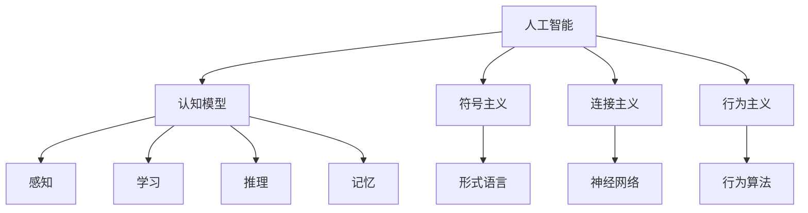

                 

## 1. 背景介绍

### 1.1 问题由来

1956年的达特茅斯会议，是计算机科学领域历史上的一个重大转折点，被誉为人工智能（AI）的诞生地。这次会议聚集了众多当时最顶尖的科学家和工程师，探讨了机器智能的基础理论和技术路线，奠定了AI未来几十年的研究方向和核心概念。本文将通过回顾这次会议的核心内容，探讨科学家团队是如何为AI奠定基础的，并展望其未来的发展趋势。

### 1.2 问题核心关键点

达特茅斯会议的核心议题包括：
- **人工智能的定义**：如何将计算机赋予人类智能，使其能够进行学习、推理和问题求解？
- **AI的实现方式**：设计并实现能够执行智能任务的机器算法。
- **AI的伦理学和法律问题**：AI的发展将对社会产生何种影响，如何避免负面后果？
- **AI的未来前景**：AI能否超越人类智能，为人类社会带来革命性变化？

这些议题共同构成了一个宏大的AI研究框架，为后续几十年的AI发展奠定了坚实基础。

## 2. 核心概念与联系

### 2.1 核心概念概述

为了更好地理解达特茅斯会议的核心概念，本节将介绍几个密切相关的核心概念：

- **人工智能**：通过设计和开发智能算法，使计算机系统具备类似人类的思考和行为能力。
- **认知模型**：模拟人类认知过程的计算模型，包括感知、学习、推理和记忆等基本功能。
- **符号主义**：以逻辑符号和形式语言为基础，构建人工智能的推理和问题求解系统。
- **连接主义**：模仿人类神经系统的结构和功能，通过神经网络进行学习和识别。
- **行为主义**：关注机器如何通过与环境互动来学习行为，以获得特定的任务输出。

这些概念通过一系列复杂的关系，共同构成了AI研究的基础框架。

### 2.2 概念间的关系

这些核心概念之间的关系可以通过以下Mermaid流程图来展示：



这个流程图展示了人工智能各个分支之间的联系和相互作用：

1. **认知模型**：负责模拟人类的感知、学习、推理和记忆等过程。
2. **符号主义**：使用形式语言和逻辑符号，构建推理和问题求解系统。
3. **连接主义**：通过神经网络模拟人类神经系统，进行模式识别和自动学习。
4. **行为主义**：通过与环境互动，学习行为和策略，以完成特定任务。

## 3. 核心算法原理 & 具体操作步骤

### 3.1 算法原理概述

达特茅斯会议期间，科学家们提出了一系列核心算法和理论，为AI的发展奠定了基础。这些算法和理论的核心思想是通过模拟人类认知过程，设计能够执行智能任务的计算模型。以下是几个代表性算法和理论的概述：

- **符号主义算法**：通过符号操作和逻辑推理，模拟人类的语言理解和问题求解能力。
- **神经网络算法**：模仿人类神经系统，通过反向传播算法学习模式和特征，实现模式识别和分类任务。
- **行为主义算法**：通过强化学习算法，训练机器在与环境互动中学习行为策略，完成特定任务。

### 3.2 算法步骤详解

以**符号主义算法**为例，其核心步骤如下：

1. **输入处理**：将自然语言输入转换为计算机可处理的形式，如形式语言、符号串等。
2. **语义分析**：通过符号操作和逻辑推理，对输入进行语义分析，提取关键信息和结构。
3. **问题求解**：根据提取的信息，设计逻辑推理规则，求解问题。
4. **输出处理**：将计算结果转换为自然语言或其他形式输出，供用户理解和使用。

### 3.3 算法优缺点

符号主义算法的优点在于其清晰性和可解释性，能够通过逻辑符号和推理规则，明确地表示智能任务。但缺点也显而易见，如处理自然语言模糊性和语境变化能力不足，难以处理大规模数据和复杂问题。

神经网络算法的优点在于其强大的模式识别和自动学习能力，能够处理大规模数据和非线性问题。但缺点在于其黑盒特性，难以解释和学习规则，且需要大量标注数据进行训练。

行为主义算法的优点在于其可操作性和鲁棒性，能够通过与环境互动学习行为策略。但缺点在于其学习效率低，难以处理非结构化数据和复杂任务。

### 3.4 算法应用领域

这些算法在当时的科技环境下，主要用于以下几个领域：

- **科学研究**：在物理、化学、生物等领域，使用符号主义算法和神经网络进行模拟和预测。
- **工业控制**：使用行为主义算法实现自动控制和优化，提高生产效率和产品质量。
- **机器人学**：结合符号主义和行为主义算法，设计智能机器人，进行环境感知和任务执行。

## 4. 数学模型和公式 & 详细讲解 & 举例说明

### 4.1 数学模型构建

**符号主义算法**的数学模型构建基于形式语言和逻辑推理，如Prolog、LISP等语言。其核心在于符号操作和逻辑推理规则，如谓词逻辑、规则推理等。

**神经网络算法**的数学模型构建基于神经元连接和激活函数，如前向传播算法、反向传播算法等。其核心在于权重和偏置的更新，如梯度下降算法、随机梯度下降算法等。

**行为主义算法**的数学模型构建基于强化学习算法，如Q-learning、SARSA等。其核心在于策略更新和状态转移，如贝尔曼方程、值函数等。

### 4.2 公式推导过程

以**符号主义算法**为例，其核心公式包括：

- **谓词逻辑公式**：
  $$
  \forall x, P(x) \rightarrow Q(x)
  $$
  表示对于所有$x$，如果$P(x)$为真，则$Q(x)$也为真。

- **规则推理公式**：
  $$
  if P(x) then Q(x)
  $$
  表示如果$P(x)$为真，则执行$Q(x)$。

**神经网络算法**的核心公式包括：

- **前向传播公式**：
  $$
  y = f(Wx + b)
  $$
  表示输入$x$通过权重矩阵$W$和偏置$b$，经过激活函数$f$，输出为$y$。

- **反向传播公式**：
  $$
  \frac{\partial L}{\partial W} = \frac{\partial L}{\partial y} \cdot \frac{\partial y}{\partial x} \cdot \frac{\partial x}{\partial W}
  $$
  表示通过链式法则计算损失函数$L$对权重$W$的梯度。

**行为主义算法**的核心公式包括：

- **Q-learning公式**：
  $$
  Q(s, a) = Q(s, a) + \alpha(r + \gamma \max_{a'} Q(s', a') - Q(s, a))
  $$
  表示在状态$s$下采取动作$a$，获得奖励$r$，并转移到下一个状态$s'$，更新动作$a'$的Q值。

### 4.3 案例分析与讲解

以**神经网络算法**为例，以下是一个手写数字识别的案例：

1. **数据准备**：收集大量手写数字图片，并标注其对应的数字。
2. **模型训练**：使用神经网络模型对图片进行特征提取和分类。
3. **模型评估**：在测试集上评估模型的准确率和误识别率。
4. **模型优化**：调整网络结构、学习率等参数，提升模型性能。

## 5. 项目实践：代码实例和详细解释说明

### 5.1 开发环境搭建

在进行AI项目开发前，我们需要准备好开发环境。以下是使用Python进行TensorFlow开发的环境配置流程：

1. 安装Anaconda：从官网下载并安装Anaconda，用于创建独立的Python环境。

2. 创建并激活虚拟环境：
```bash
conda create -n tensorflow-env python=3.8 
conda activate tensorflow-env
```

3. 安装TensorFlow：根据CUDA版本，从官网获取对应的安装命令。例如：
```bash
conda install tensorflow -c pytorch -c conda-forge
```

4. 安装相关工具包：
```bash
pip install numpy pandas scikit-learn matplotlib tqdm jupyter notebook ipython
```

完成上述步骤后，即可在`tensorflow-env`环境中开始AI开发。

### 5.2 源代码详细实现

下面我们以手写数字识别为例，给出使用TensorFlow实现神经网络代码实现。

首先，定义神经网络模型的结构：

```python
import tensorflow as tf
from tensorflow.keras import layers

model = tf.keras.Sequential([
    layers.Flatten(input_shape=(28, 28)),
    layers.Dense(128, activation='relu'),
    layers.Dense(10, activation='softmax')
])
```

然后，定义模型训练过程：

```python
def train_model(model, x_train, y_train, epochs=10):
    model.compile(optimizer='adam',
                  loss='sparse_categorical_crossentropy',
                  metrics=['accuracy'])
    model.fit(x_train, y_train, epochs=epochs)
```

最后，启动训练流程并在测试集上评估：

```python
import numpy as np

mnist = tf.keras.datasets.mnist
(x_train, y_train), (x_test, y_test) = mnist.load_data()
x_train, x_test = x_train / 255.0, x_test / 255.0

train_model(model, x_train, y_train)
test_loss, test_acc = model.evaluate(x_test, y_test)
print('Test accuracy:', test_acc)
```

以上就是使用TensorFlow对神经网络模型进行手写数字识别的完整代码实现。可以看到，TensorFlow的高级API使得模型的构建和训练变得非常简单。

### 5.3 代码解读与分析

让我们再详细解读一下关键代码的实现细节：

**Sequential模型**：
- `Flatten`层：将输入的二维图像数据展平为一维向量。
- `Dense`层：全连接层，用于特征提取和分类。
- `softmax`激活函数：输出层，用于多分类任务。

**训练过程**：
- `compile`方法：设置优化器、损失函数和评估指标。
- `fit`方法：进行模型训练，指定训练集、测试集和迭代次数。
- `evaluate`方法：在测试集上评估模型性能，输出准确率和损失值。

**数据预处理**：
- `mnist.load_data()`：加载MNIST数据集。
- `x_train, x_test = x_train / 255.0, x_test / 255.0`：将像素值归一化到[0, 1]范围内。

## 6. 实际应用场景

### 6.1 智能制造

基于AI的智能制造系统，能够通过自动化生产线和智能设备，实现生产过程的优化和自动化管理。例如，使用神经网络算法对生产数据进行建模和预测，优化生产计划和资源配置，提高生产效率和产品质量。

### 6.2 医疗诊断

AI在医疗领域的应用，能够通过符号主义算法和神经网络算法，辅助医生进行疾病诊断和治疗决策。例如，使用深度学习模型对医学影像进行分析和诊断，提取关键特征，辅助医生进行诊断和治疗方案的制定。

### 6.3 金融风险管理

AI在金融领域的应用，能够通过行为主义算法和强化学习，进行风险管理和投资决策。例如，使用强化学习算法，训练投资策略模型，实现对市场变化的快速响应和优化。

### 6.4 未来应用展望

随着AI技术的不断发展，未来的应用场景将更加广泛和深入。例如，在教育、交通、能源等领域，AI将发挥越来越重要的作用，推动社会的数字化和智能化转型。

## 7. 工具和资源推荐

### 7.1 学习资源推荐

为了帮助开发者系统掌握AI的核心算法和技术，这里推荐一些优质的学习资源：

1. 《深度学习》系列书籍：由吴恩达等学者撰写，全面介绍了深度学习的基本概念和核心算法。

2. CS231n《卷积神经网络》课程：斯坦福大学开设的计算机视觉课程，涵盖深度学习在图像识别、物体检测等任务中的应用。

3. 《人工智能》书籍：由斯坦福大学教授编写，介绍了AI的基本原理和前沿技术。

4. 《TensorFlow实战Google AI》书籍：由Google官方编写，详细介绍TensorFlow框架的使用方法和应用案例。

5. arXiv论文预印本：人工智能领域最新研究成果的发布平台，包括大量尚未发表的前沿工作，学习前沿技术的必读资源。

6. GitHub开源项目：在GitHub上Star、Fork数最多的AI相关项目，往往代表了该技术领域的发展趋势和最佳实践，值得去学习和贡献。

### 7.2 开发工具推荐

高效的开发离不开优秀的工具支持。以下是几款用于AI开发的工具：

1. TensorFlow：由Google主导开发的开源深度学习框架，支持分布式计算和大规模模型训练。

2. PyTorch：由Facebook开发的开源深度学习框架，灵活动态的计算图，适合快速迭代研究。

3. Keras：一个高级神经网络API，能够快速搭建和训练深度学习模型。

4. Jupyter Notebook：一个交互式的Python代码开发环境，支持多种语言和库的混合使用。

5. Visual Studio Code：一个开源的IDE，支持多种编程语言和工具的集成，适合AI开发。

6. Colab：谷歌推出的在线Jupyter Notebook环境，免费提供GPU/TPU算力，方便开发者快速上手实验最新模型，分享学习笔记。

### 7.3 相关论文推荐

AI领域的研究不断发展，以下是几篇奠基性的相关论文，推荐阅读：

1. Deep Blue: Making the Machine Think (1997)：IBM开发的国际象棋程序Deep Blue战胜了世界冠军Gary Kasparov，标志着AI在符号主义算法方面的重大突破。

2. AlphaGo: Mastering the Game of Go without Rule-Based Design (2016)：Google开发的AlphaGo通过深度强化学习，成功战胜了世界围棋冠军李世石，展示了AI在行为主义算法方面的巨大潜力。

3. ImageNet Classification with Deep Convolutional Neural Networks (2012)：AlexNet在ImageNet大规模视觉识别竞赛中取得优异成绩，展示了神经网络算法在图像识别任务中的强大能力。

4. Attention Is All You Need (2017)：Transformer结构的提出，彻底改变了NLP领域的预训练模型设计，开启了大规模语言模型的时代。

5. A Survey on Deep Reinforcement Learning for Multi-Agent Systems (2020)：总结了深度强化学习在多智能体系统中的应用，展示了AI在行为主义算法方面的最新进展。

这些论文代表了大AI领域研究的发展脉络。通过学习这些前沿成果，可以帮助研究者把握学科前进方向，激发更多的创新灵感。

除上述资源外，还有一些值得关注的前沿资源，帮助开发者紧跟AI技术的发展趋势，例如：

1. arXiv论文预印本：人工智能领域最新研究成果的发布平台，包括大量尚未发表的前沿工作，学习前沿技术的必读资源。

2. 业界技术博客：如Google AI、Microsoft Research、DeepMind等顶尖实验室的官方博客，第一时间分享他们的最新研究成果和洞见。

3. 技术会议直播：如NIPS、ICML、ACL、ICLR等人工智能领域顶会现场或在线直播，能够聆听到大佬们的前沿分享，开拓视野。

4. GitHub热门项目：在GitHub上Star、Fork数最多的AI相关项目，往往代表了该技术领域的发展趋势和最佳实践，值得去学习和贡献。

5. 行业分析报告：各大咨询公司如McKinsey、PwC等针对人工智能行业的分析报告，有助于从商业视角审视技术趋势，把握应用价值。

总之，对于AI的学习和实践，需要开发者保持开放的心态和持续学习的意愿。多关注前沿资讯，多动手实践，多思考总结，必将收获满满的成长收益。

## 8. 总结：未来发展趋势与挑战

### 8.1 总结

本文回顾了达特茅斯会议的核心内容，探讨了科学家团队是如何为AI奠定基础的。通过回顾会议的核心议题和成果，我们得以窥见AI发展的初步框架和技术路线。

未来，随着AI技术的不断发展，其在各个领域的应用将更加广泛和深入。符号主义、连接主义和行为主义等核心算法将继续发挥重要作用，推动AI技术的不断进步。

### 8.2 未来发展趋势

未来AI技术的发展趋势将包括以下几个方面：

1. **多模态融合**：AI将更加关注多模态数据的融合，结合视觉、语音、文本等多种数据形式，实现更加全面、精准的建模和推理。

2. **联邦学习**：在保护数据隐私的前提下，通过分布式训练和模型参数共享，实现大规模模型的高效训练和更新。

3. **自监督学习**：利用大量未标注数据进行自监督学习，提升模型对新数据的泛化能力和鲁棒性。

4. **可解释性增强**：通过符号主义和知识图谱等方法，增强模型的可解释性和透明性，提升用户信任度。

5. **伦理道德保障**：在AI技术的应用中，关注伦理道德问题，确保技术的安全和可控。

6. **人机协同智能**：在自动化和智能化的基础上，实现人机协同工作，提升人类与AI的互动体验和应用效果。

### 8.3 面临的挑战

尽管AI技术已经取得了瞩目成就，但在迈向更加智能化、普适化应用的过程中，它仍面临着诸多挑战：

1. **数据隐私和安全**：AI模型在处理大量数据时，可能会面临数据隐私泄露和模型安全问题。如何保护数据隐私，防止模型被攻击，是一个重要的挑战。

2. **模型复杂度**：当前AI模型普遍存在复杂度高、计算资源需求大的问题。如何在保证性能的同时，降低模型复杂度，是一个亟待解决的问题。

3. **可解释性不足**：AI模型的决策过程往往缺乏可解释性，难以对其推理逻辑进行分析和调试。如何增强模型的可解释性，是一个重要的研究方向。

4. **伦理道德问题**：AI技术的应用可能会引发一系列伦理道德问题，如偏见、歧视、自主决策等。如何在技术开发和应用过程中，考虑伦理道德问题，是一个重要的课题。

5. **模型泛化能力**：AI模型在特定任务上的性能往往依赖于大量标注数据。如何提高模型的泛化能力，使其在多种场景下都能够稳定运行，是一个重要的挑战。

6. **计算资源限制**：AI模型的训练和推理需要大量的计算资源，如何优化资源使用，提高模型效率，是一个重要的研究方向。

### 8.4 研究展望

面对AI技术面临的这些挑战，未来的研究需要在以下几个方面寻求新的突破：

1. **数据隐私保护**：开发更加安全、可靠的数据保护技术，确保数据隐私和安全。

2. **模型压缩和优化**：通过模型压缩、量化等技术，降低模型的复杂度和计算资源需求。

3. **模型解释性增强**：引入符号主义和知识图谱等方法，增强模型的可解释性。

4. **伦理道德框架**：建立伦理道德框架，确保AI技术的应用符合人类价值观和伦理道德。

5. **多模态融合**：探索多模态数据的融合方法，实现更加全面、精准的建模和推理。

6. **联邦学习和分布式训练**：研究联邦学习等分布式训练方法，实现大规模模型的高效训练和更新。

这些研究方向将引领AI技术的不断发展，推动AI技术在各个领域的应用。只有在各个维度上协同发力，才能真正实现AI技术的突破和应用价值的最大化。

## 9. 附录：常见问题与解答

**Q1：AI在医疗诊断中的应用前景如何？**

A: AI在医疗诊断中的应用前景非常广阔。通过符号主义算法和神经网络算法，AI能够在影像、基因、电子病历等多模态数据上进行建模和分析，辅助医生进行疾病诊断和治疗决策。例如，通过深度学习模型对医学影像进行分析和诊断，提取关键特征，辅助医生进行诊断和治疗方案的制定。

**Q2：AI在智能制造中的应用具体有哪些？**

A: AI在智能制造中的应用非常广泛。通过神经网络算法和行为主义算法，AI能够对生产数据进行建模和预测，优化生产计划和资源配置，提高生产效率和产品质量。例如，使用深度学习模型对生产数据进行分析和预测，优化生产计划和资源配置，提高生产效率和产品质量。

**Q3：AI在金融风险管理中的主要应用场景是什么？**

A: AI在金融风险管理中的应用场景包括金融市场预测、信用评估、欺诈检测等。通过行为主义算法和强化学习，AI能够实时监测市场动态，预测市场趋势，评估信用风险，检测欺诈行为。例如，使用强化学习算法，训练金融市场预测模型，实现对市场变化的快速响应和优化。

**Q4：AI技术在自动化和智能化方面的具体应用场景有哪些？**

A: AI技术在自动化和智能化方面的应用场景包括智能客服、自动驾驶、智能推荐等。通过符号主义算法和神经网络算法，AI能够实现自然语言理解和生成、图像识别和分类、推荐系统等任务。例如，使用神经网络算法对自然语言进行理解和生成，构建智能客服系统；使用深度学习模型对图像进行识别和分类，构建自动驾驶系统；使用神经网络算法构建推荐系统，提升用户体验。

总之，AI技术的应用前景非常广泛，未来将会在更多领域发挥重要的作用，推动社会的数字化和智能化转型。

