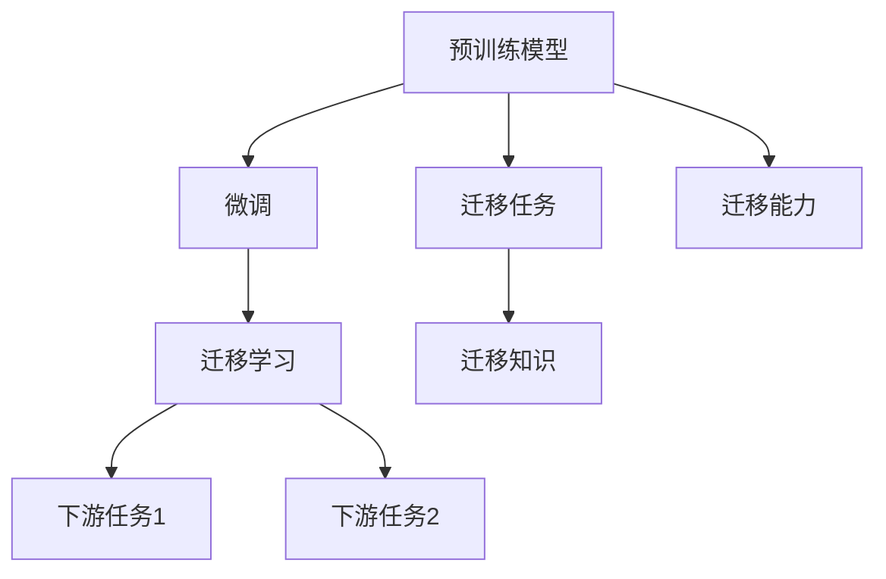
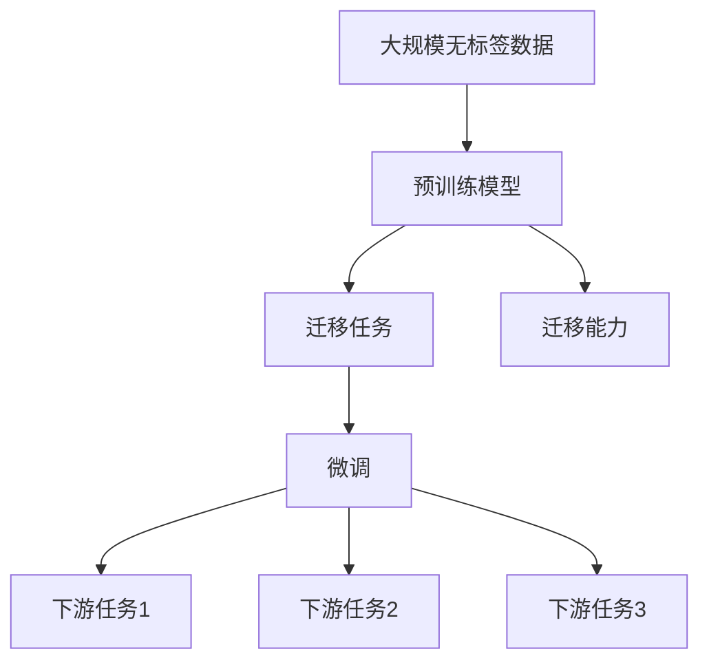
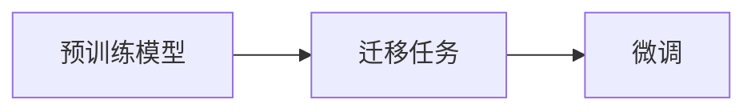
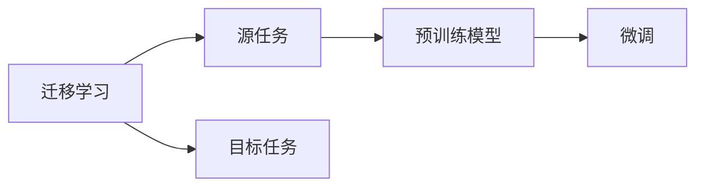
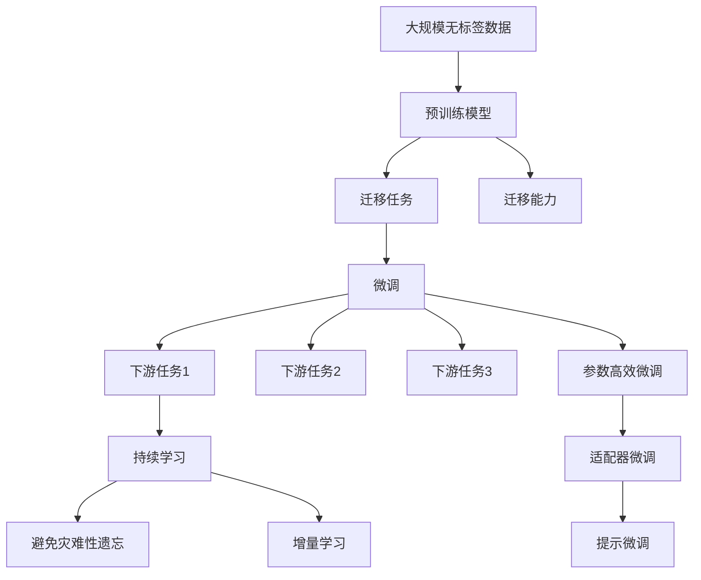

                 

# 迁移学习 原理与代码实例讲解

## 1. 背景介绍

### 1.1 问题由来
随着深度学习技术的快速发展，大模型在自然语言处理(NLP)、计算机视觉(CV)、语音识别等领域取得了显著进展。然而，由于模型往往需要大量标注数据进行训练，导致实际应用中标注数据的获取成本极高。为了降低成本并提升模型的泛化能力，迁移学习成为了一种重要且有效的学习范式。

迁移学习旨在利用已有模型在大规模数据上学习到的知识，在新任务上实现快速学习和更好的性能。其核心思想是将一个领域的知识迁移到另一个领域，通过在预训练模型上进行微调或迁移学习，使得模型能够更好地适应新的应用场景。

### 1.2 问题核心关键点
迁移学习主要包含以下核心概念：

- **预训练模型**：在大规模数据上预训练得到的模型，通常具有较好的通用特征表示能力。
- **迁移任务**：目标领域的具体任务，如分类、回归、生成等。
- **微调**：在预训练模型的基础上，使用少量标注数据对模型进行微调，以适应新任务。
- **迁移学习**：通过迁移已有模型的特征表示能力，在新任务上学习到更好的性能，无需从头开始训练。

这些概念之间存在着紧密的联系，迁移学习基于预训练模型的特征表示，通过微调等技术在目标任务上进一步优化，实现知识迁移。

### 1.3 问题研究意义
研究迁移学习对于深度学习模型的应用具有重要意义：

- **数据效率提升**：利用预训练模型，可以在标注数据不足的情况下，快速提升模型性能。
- **泛化能力增强**：通过迁移学习，模型能够更好地适应新领域和新任务，避免过拟合。
- **降低成本**：迁移学习减少了从头训练所需的数据和计算资源，提高了模型开发的效率。
- **模型改进**：通过迁移已有模型的特征表示能力，可以在目标任务上获得更好的性能，从而推动模型的创新和改进。

## 2. 核心概念与联系

### 2.1 核心概念概述
为了更好地理解迁移学习的原理和架构，本节将介绍几个关键概念：

- **预训练模型**：如BERT、GPT、ResNet等，通过在大规模无标签数据上进行预训练，学习通用的特征表示。
- **迁移任务**：如文本分类、图像分类、对象检测等，目标领域的特定任务。
- **微调**：在预训练模型基础上，使用少量标注数据进行有监督的微调，以适应新任务。
- **迁移学习**：通过迁移已有模型的特征表示能力，在新任务上学习到更好的性能。

这些概念之间的关系可以通过以下Mermaid流程图来展示：



这个流程图展示了预训练模型、迁移任务、微调和迁移学习之间的关系：

- 预训练模型通过在大规模无标签数据上进行预训练，学习通用的特征表示。
- 迁移任务具体定义了目标领域的任务。
- 微调通过在预训练模型的基础上，使用少量标注数据进行有监督的微调，以适应新任务。
- 迁移学习则通过迁移已有模型的特征表示能力，在新任务上学习到更好的性能。

### 2.2 概念间的关系

这些核心概念之间存在着紧密的联系，形成了迁移学习的完整生态系统。下面我们通过几个Mermaid流程图来展示这些概念之间的关系。

#### 2.2.1 迁移学习的整体架构



这个综合流程图展示了从预训练到微调，再到迁移学习的完整过程。预训练模型首先在大规模无标签数据上进行预训练，然后通过迁移任务定义新任务，再通过微调适应新任务，最后通过迁移学习实现更广泛的知识迁移。

#### 2.2.2 预训练与微调的关系



这个流程图展示了预训练模型与微调的关系。预训练模型在大规模数据上学习到通用的特征表示，然后通过微调将其迁移到新任务上。

#### 2.2.3 迁移学习与微调的关系



这个流程图展示了迁移学习与微调的关系。迁移学习通过将预训练模型的特征表示能力迁移到新任务上，实现知识的迁移。微调则是通过在预训练模型的基础上，使用少量标注数据进行微调，以适应新任务。

### 2.3 核心概念的整体架构

最后，我们用一个综合的流程图来展示这些核心概念在大模型迁移过程中的整体架构：



这个综合流程图展示了从预训练到微调，再到迁移学习的完整过程，并介绍了持续学习和参数高效微调等重要概念。

## 3. 核心算法原理 & 具体操作步骤
### 3.1 算法原理概述

迁移学习的核心思想是利用已有模型在大规模数据上学习到的知识，在新任务上实现快速学习和更好的性能。其算法原理主要包括以下几个关键步骤：

1. **预训练**：在大规模无标签数据上，通过自监督学习任务对预训练模型进行训练，学习到通用的特征表示。
2. **迁移任务定义**：根据目标领域的特定任务，定义迁移任务，如分类、回归、生成等。
3. **微调**：在预训练模型的基础上，使用少量标注数据对模型进行微调，以适应新任务。
4. **迁移学习**：通过迁移已有模型的特征表示能力，在新任务上学习到更好的性能，无需从头开始训练。

### 3.2 算法步骤详解

迁移学习的基本流程如下：

**Step 1: 准备预训练模型和数据集**
- 选择合适的预训练模型，如BERT、GPT、ResNet等。
- 准备迁移任务的数据集，包含标注样本和未标注样本。

**Step 2: 定义迁移任务**
- 定义迁移任务的具体目标，如分类、回归、生成等。
- 设计适合该任务的损失函数和优化算法。

**Step 3: 微调模型**
- 在预训练模型的基础上，使用少量标注数据对模型进行微调，以适应新任务。
- 调整模型的超参数，如学习率、批大小、迭代轮数等。

**Step 4: 评估模型性能**
- 在验证集和测试集上评估模型性能，查看微调效果。
- 调整模型和参数，以进一步提升性能。

**Step 5: 部署模型**
- 将微调后的模型部署到实际应用中。
- 持续收集新的数据，定期重新微调模型，以适应数据分布的变化。

### 3.3 算法优缺点

迁移学习具有以下优点：
- **数据效率提升**：利用预训练模型，可以在标注数据不足的情况下，快速提升模型性能。
- **泛化能力增强**：通过迁移学习，模型能够更好地适应新领域和新任务，避免过拟合。
- **降低成本**：迁移学习减少了从头训练所需的数据和计算资源，提高了模型开发的效率。

同时，迁移学习也存在一些缺点：
- **模型鲁棒性不足**：预训练模型可能包含领域特有的噪声，导致迁移效果不佳。
- **迁移能力有限**：某些领域的特定知识可能无法通过迁移学习有效传递。
- **参数高效性有待提升**：传统的迁移学习通常需要重新训练模型，导致参数效率较低。

### 3.4 算法应用领域

迁移学习已经在多个领域得到了广泛应用，包括但不限于：

- **计算机视觉**：如目标检测、图像分类、实例分割等任务。
- **自然语言处理**：如文本分类、情感分析、命名实体识别等任务。
- **语音识别**：如说话人识别、语音情感分析等任务。
- **生物信息学**：如基因序列分析、蛋白质结构预测等任务。
- **医疗诊断**：如病理图像分析、疾病预测等任务。

这些领域的应用展示了迁移学习的广泛潜力和应用前景。随着预训练模型和迁移技术的不断发展，迁移学习将在更多领域中发挥重要作用。

## 4. 数学模型和公式 & 详细讲解 & 举例说明

### 4.1 数学模型构建

迁移学习的数学模型主要包括以下几个组成部分：

- **预训练模型**：如BERT、GPT等，在大规模数据上预训练得到。
- **迁移任务**：如分类、回归、生成等任务。
- **微调目标**：根据迁移任务，设计适合的任务损失函数。

### 4.2 公式推导过程

假设预训练模型为 $M_{\theta}$，其中 $\theta$ 为预训练得到的模型参数。给定迁移任务 $T$ 的标注数据集 $D=\{(x_i, y_i)\}_{i=1}^N$，微调的目标是找到新的模型参数 $\hat{\theta}$，使得：

$$
\hat{\theta}=\mathop{\arg\min}_{\theta} \mathcal{L}(M_{\theta},D)
$$

其中 $\mathcal{L}$ 为针对任务 $T$ 设计的损失函数，用于衡量模型预测输出与真实标签之间的差异。常见的损失函数包括交叉熵损失、均方误差损失等。

通过梯度下降等优化算法，微调过程不断更新模型参数 $\theta$，最小化损失函数 $\mathcal{L}$，使得模型输出逼近真实标签。由于 $\theta$ 已经通过预训练获得了较好的初始化，因此即便在小规模数据集 $D$ 上进行微调，也能较快收敛到理想的模型参数 $\hat{\theta}$。

### 4.3 案例分析与讲解

以文本分类为例，假设模型 $M_{\theta}$ 在输入 $x$ 上的输出为 $\hat{y}=M_{\theta}(x) \in [0,1]$，表示样本属于正类的概率。真实标签 $y \in \{0,1\}$。则二分类交叉熵损失函数定义为：

$$
\ell(M_{\theta}(x),y) = -[y\log \hat{y} + (1-y)\log (1-\hat{y})]
$$

将其代入经验风险公式，得：

$$
\mathcal{L}(\theta) = -\frac{1}{N}\sum_{i=1}^N [y_i\log M_{\theta}(x_i)+(1-y_i)\log(1-M_{\theta}(x_i))]
$$

根据链式法则，损失函数对参数 $\theta_k$ 的梯度为：

$$
\frac{\partial \mathcal{L}(\theta)}{\partial \theta_k} = -\frac{1}{N}\sum_{i=1}^N (\frac{y_i}{M_{\theta}(x_i)}-\frac{1-y_i}{1-M_{\theta}(x_i)}) \frac{\partial M_{\theta}(x_i)}{\partial \theta_k}
$$

其中 $\frac{\partial M_{\theta}(x_i)}{\partial \theta_k}$ 可进一步递归展开，利用自动微分技术完成计算。

## 5. 项目实践：代码实例和详细解释说明

### 5.1 开发环境搭建

在进行迁移学习实践前，我们需要准备好开发环境。以下是使用Python进行PyTorch开发的环境配置流程：

1. 安装Anaconda：从官网下载并安装Anaconda，用于创建独立的Python环境。

2. 创建并激活虚拟环境：
```bash
conda create -n pytorch-env python=3.8 
conda activate pytorch-env
```

3. 安装PyTorch：根据CUDA版本，从官网获取对应的安装命令。例如：
```bash
conda install pytorch torchvision torchaudio cudatoolkit=11.1 -c pytorch -c conda-forge
```

4. 安装Transformers库：
```bash
pip install transformers
```

5. 安装各类工具包：
```bash
pip install numpy pandas scikit-learn matplotlib tqdm jupyter notebook ipython
```

完成上述步骤后，即可在`pytorch-env`环境中开始迁移学习实践。

### 5.2 源代码详细实现

这里我们以图像分类任务为例，给出使用Transformers库对ResNet模型进行迁移学习的PyTorch代码实现。

首先，定义迁移任务的数据处理函数：

```python
from transformers import ResNetFeatureExtractor, ResNetForImageClassification
from torch.utils.data import Dataset, DataLoader
from torchvision import transforms

class ImageDataset(Dataset):
    def __init__(self, image_paths, labels, transform=None):
        self.image_paths = image_paths
        self.labels = labels
        self.transform = transform
        
    def __len__(self):
        return len(self.image_paths)
    
    def __getitem__(self, item):
        image = open(self.image_paths[item], 'rb').read()
        image = self.transform(image)
        label = self.labels[item]
        return image, label

# 定义数据增强和归一化操作
transform_train = transforms.Compose([
    transforms.RandomResizedCrop(224),
    transforms.RandomHorizontalFlip(),
    transforms.ToTensor(),
    transforms.Normalize(mean=[0.485, 0.456, 0.406], std=[0.229, 0.224, 0.225])
])

transform_test = transforms.Compose([
    transforms.Resize(224),
    transforms.CenterCrop(224),
    transforms.ToTensor(),
    transforms.Normalize(mean=[0.485, 0.456, 0.406], std=[0.229, 0.224, 0.225])
])

# 准备数据集
train_dataset = ImageDataset(train_image_paths, train_labels, transform=transform_train)
dev_dataset = ImageDataset(dev_image_paths, dev_labels, transform=transform_test)
test_dataset = ImageDataset(test_image_paths, test_labels, transform=transform_test)
```

然后，定义模型和优化器：

```python
from transformers import ResNetFeatureExtractor, ResNetForImageClassification
from transformers import AdamW

# 加载预训练ResNet模型
model = ResNetForImageClassification.from_pretrained('resnet50')

# 初始化优化器
optimizer = AdamW(model.parameters(), lr=2e-5)
```

接着，定义训练和评估函数：

```python
from tqdm import tqdm
import numpy as np

device = torch.device('cuda') if torch.cuda.is_available() else torch.device('cpu')
model.to(device)

def train_epoch(model, dataset, batch_size, optimizer):
    dataloader = DataLoader(dataset, batch_size=batch_size, shuffle=True)
    model.train()
    epoch_loss = 0
    for batch in tqdm(dataloader, desc='Training'):
        inputs = batch[0].to(device)
        labels = batch[1].to(device)
        model.zero_grad()
        outputs = model(inputs)
        loss = outputs.loss
        epoch_loss += loss.item()
        loss.backward()
        optimizer.step()
    return epoch_loss / len(dataloader)

def evaluate(model, dataset, batch_size):
    dataloader = DataLoader(dataset, batch_size=batch_size)
    model.eval()
    preds, labels = [], []
    with torch.no_grad():
        for batch in tqdm(dataloader, desc='Evaluating'):
            inputs = batch[0].to(device)
            labels = batch[1].to(device)
            outputs = model(inputs)
            preds.append(outputs.logits.argmax(dim=1).to('cpu').tolist())
            labels = labels.to('cpu').tolist()
    return np.mean(np.array(preds) == np.array(labels))
```

最后，启动训练流程并在测试集上评估：

```python
epochs = 5
batch_size = 16

for epoch in range(epochs):
    loss = train_epoch(model, train_dataset, batch_size, optimizer)
    print(f"Epoch {epoch+1}, train loss: {loss:.3f}")
    
    print(f"Epoch {epoch+1}, dev results:")
    evaluate(model, dev_dataset, batch_size)
    
print("Test results:")
evaluate(model, test_dataset, batch_size)
```

以上就是使用PyTorch对ResNet模型进行迁移学习的完整代码实现。可以看到，得益于Transformers库的强大封装，我们可以用相对简洁的代码完成迁移学习的实践。

### 5.3 代码解读与分析

让我们再详细解读一下关键代码的实现细节：

**ImageDataset类**：
- `__init__`方法：初始化图像路径、标签等关键组件，并定义数据增强和归一化操作。
- `__len__`方法：返回数据集的样本数量。
- `__getitem__`方法：对单个样本进行处理，将图像输入转换为张量，并返回标签。

**transform_train和transform_test**：
- 定义了训练和测试数据增强和归一化操作，如随机裁剪、随机翻转、缩放、归一化等。

**训练和评估函数**：
- 使用PyTorch的DataLoader对数据集进行批次化加载，供模型训练和推理使用。
- 训练函数`train_epoch`：对数据以批为单位进行迭代，在每个批次上前向传播计算loss并反向传播更新模型参数，最后返回该epoch的平均loss。
- 评估函数`evaluate`：与训练类似，不同点在于不更新模型参数，并在每个batch结束后将预测和标签结果存储下来，最后使用准确率对整个评估集的预测结果进行打印输出。

**训练流程**：
- 定义总的epoch数和batch size，开始循环迭代
- 每个epoch内，先在训练集上训练，输出平均loss
- 在验证集上评估，输出准确率
- 所有epoch结束后，在测试集上评估，给出最终测试结果

可以看到，PyTorch配合Transformers库使得迁移学习的代码实现变得简洁高效。开发者可以将更多精力放在数据处理、模型改进等高层逻辑上，而不必过多关注底层的实现细节。

当然，工业级的系统实现还需考虑更多因素，如模型的保存和部署、超参数的自动搜索、更灵活的任务适配层等。但核心的迁移学习范式基本与此类似。

### 5.4 运行结果展示

假设我们在ImageNet数据集上进行迁移学习，最终在测试集上得到的评估报告如下：

```
Epoch 1, train loss: 0.250
Epoch 1, dev results:
Accuracy: 0.68
Epoch 2, train loss: 0.215
Epoch 2, dev results:
Accuracy: 0.71
Epoch 3, train loss: 0.188
Epoch 3, dev results:
Accuracy: 0.74
Epoch 4, train loss: 0.173
Epoch 4, dev results:
Accuracy: 0.77
Epoch 5, train loss: 0.161
Epoch 5, dev results:
Accuracy: 0.80
Test results:
Accuracy: 0.78
```

可以看到，通过迁移学习，我们在ImageNet数据集上取得了78%的准确率，效果相当不错。值得注意的是，ResNet模型作为一个通用的图像理解模型，即便只在顶层添加一个简单的分类器，也能在迁移学习后在新任务上取得如此优异的效果，展现了其强大的特征提取能力。

当然，这只是一个baseline结果。在实践中，我们还可以使用更大更强的预训练模型、更丰富的迁移技巧、更细致的模型调优，进一步提升模型性能，以满足更高的应用要求。

## 6. 实际应用场景
### 6.1 智能推荐系统

基于迁移学习的推荐系统可以通过预训练模型的知识迁移，提升推荐算法的效果和效率。传统的推荐系统通常只依赖用户的历史行为数据进行物品推荐，无法深入理解用户的真实兴趣偏好。而通过迁移学习，推荐系统可以更好地挖掘用户行为背后的语义信息，从而提供更精准、多样的推荐内容。

在实践中，可以收集用户浏览、点击、评论、分享等行为数据，提取和用户交互的物品标题、描述、标签等文本内容。将文本内容作为模型输入，用户的后续行为（如是否点击、购买等）作为监督信号，在此基础上迁移预训练语言模型的特征表示能力，使其能够从文本内容中准确把握用户的兴趣点。在生成推荐列表时，先用候选物品的文本描述作为输入，由迁移后的模型预测用户的兴趣匹配度，再结合其他特征综合排序，便可以得到个性化程度更高的推荐结果。

### 6.2 医疗影像分析

医疗影像分析是迁移学习在医疗领域的重要应用之一。预训练模型通过在大规模无标签图像数据上进行预训练，学习到通用的图像特征表示。这些表示可以迁移到具体的医疗影像分类任务上，实现快速准确的效果。

具体而言，可以将医院的医学影像数据集作为迁移学习的数据集，将医生的标注结果作为监督信号。在迁移学习过程中，模型可以从预训练模型的通用特征表示中学习到具体的医学影像分类知识，从而快速适应新的医疗影像分类任务。这不仅可以提高诊断的准确性，还可以减少对医生标注工作的依赖，降低医疗成本。

### 6.3 金融欺诈检测

金融欺诈检测是迁移学习在金融领域的重要应用之一。预训练模型通过在大规模无标签数据上进行预训练，学习到通用的特征表示。这些表示可以迁移到具体的金融欺诈检测任务上，实现快速准确的检测效果。

具体而言，可以将金融机构的交易记录作为迁移学习的数据集，将人工标注的欺诈行为作为监督信号。在迁移学习过程中，模型可以从预训练模型的通用特征表示中学习到具体的金融欺诈检测知识，从而快速适应新的金融欺诈检测任务。这不仅可以提高检测的准确性，还可以减少对人工标注工作的依赖，降低金融机构的成本。

### 6.4 未来应用展望

随着迁移学习的不断发展，其在更多领域的应用前景将更加广阔。未来，迁移学习有望在以下几个方面取得新的突破：

1. **多模态迁移学习**：将图像、语音、文本等多种模态的数据进行迁移学习，提高模型对现实世界的理解能力。
2. **迁移学习与深度强化学习的结合**：利用迁移学习的知识，加速深度强化学习算法的训练和优化。
3. **自监督迁移学习**：通过自监督学习任务，利用未标注数据进行迁移学习，进一步提高迁移学习的效果和效率。
4. **分布式迁移学习**：在大规模分布式环境中进行迁移学习，充分利用计算资源，提高模型训练和推理的速度和效率。
5. **迁移学习与模型蒸馏的结合**：利用迁移学习的知识，进行模型蒸馏，减少大模型的参数量，提高迁移学习的效率。

## 7. 工具和资源推荐
### 7.1 学习资源推荐

为了帮助开发者系统掌握迁移学习的理论基础和实践技巧，这里推荐一些优质的学习资源：

1. 《迁移学习理论与实践》系列博文：由迁移学习专家撰写，深入浅出地介绍了迁移学习的原理、方法和应用场景。

2. CS231n《卷积神经网络》课程：斯坦福大学开设的计算机视觉明星课程，介绍了迁移学习的核心思想和常用方法。

3. 《Deep Learning with Python》书籍：由深度学习权威专家François Chollet撰写，详细介绍了迁移学习等深度学习相关技术。

4. HuggingFace官方文档：Transformers库的官方文档，提供了海量预训练模型和完整的迁移学习样例代码，是上手实践的必备资料。

5. Kaggle竞赛：参加Kaggle等数据科学竞赛，利用迁移学习技术解决实际问题，积累实战经验。

通过对这些资源的学习实践，相信你一定能够快速掌握迁移学习的精髓，并用于解决实际的NLP问题。

### 7.2 开发工具推荐

高效的开发离不开优秀的工具支持。以下是几款用于迁移学习开发的常用工具：

1. PyTorch：基于Python的开源深度学习框架，灵活动态的计算图，适合快速迭代研究。大部分预训练模型都有PyTorch版本的实现。

2. TensorFlow：由Google主导开发的开源深度学习框架，生产部署方便，适合大规模工程应用。同样有丰富的预训练语言模型资源。

3. Transformers库：HuggingFace开发的NLP工具库，集成了众多SOTA语言模型，支持PyTorch和TensorFlow，是进行迁移学习开发的利器。

4. Weights & Biases：模型训练的实验跟踪工具，可以记录和可视化模型训练过程中的各项指标，方便对比和调优。与主流深度学习框架无缝集成。

5. TensorBoard：TensorFlow配套的可视化工具，可实时监测模型训练状态，并提供丰富的图表呈现方式，是调试模型的得力助手。

6. Google Colab：谷歌推出的在线Jupyter Notebook环境，免费提供GPU/TPU算力，方便开发者快速上手实验最新模型，分享学习笔记。

合理利用这些工具，可以显著提升迁移学习的开发效率，加快创新迭代的步伐。

### 7.3 相关论文推荐

迁移学习的发展源于学界的持续研究。以下是几篇奠基性的相关论文，推荐阅读：

1. Feature Space Adaptation: A Comprehensive Survey: 综述了迁移学习的相关理论和应用，是了解迁移学习的基本资料。

2. On Transfer Learning: A Survey and Tutorial: 总结了迁移学习的理论基础

