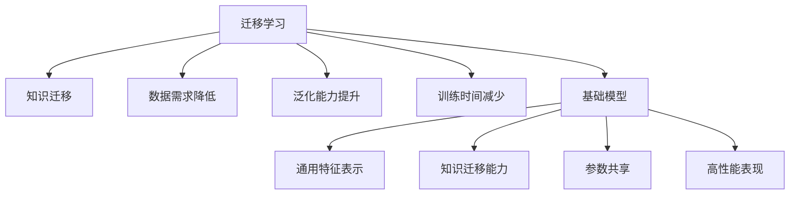
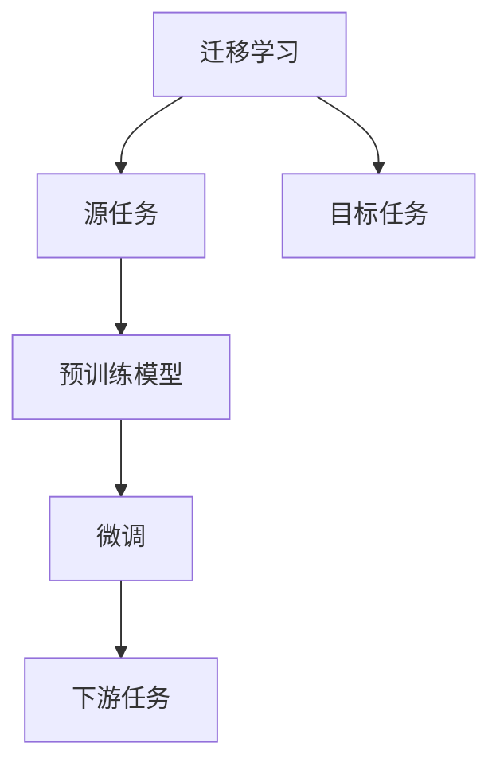
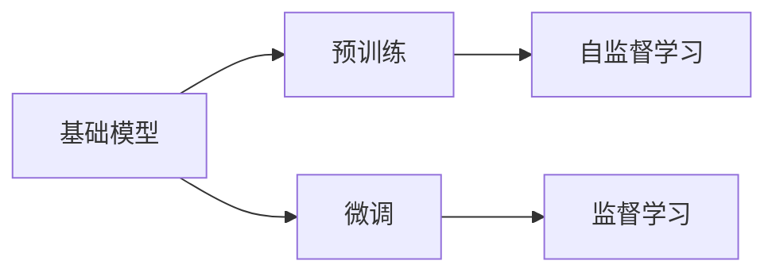
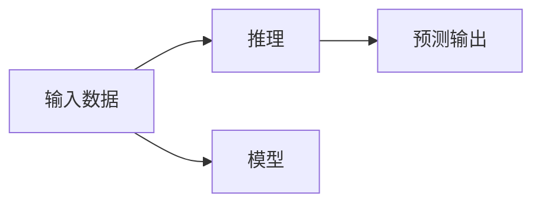

                 

# 迁移学习与基础模型的发展

> 关键词：迁移学习, 基础模型, 深度学习, 预训练, 微调, 推理, 神经网络, 自监督学习, 监督学习, 迁移学习范式

## 1. 背景介绍

### 1.1 问题由来
在人工智能（AI）领域，深度学习技术的快速发展催生了许多令人瞩目的成果，如计算机视觉中的卷积神经网络（CNN）、自然语言处理（NLP）中的递归神经网络（RNN）、长短时记忆网络（LSTM）和Transformer等。这些深度学习模型在图像识别、语音识别、机器翻译等任务上取得了显著的突破。然而，这些模型的训练通常需要大量的标注数据，并且对于不同任务需要重新从头开始训练，这在资源和时间上均存在巨大的成本。为了应对这些问题，迁移学习（Transfer Learning）和基础模型（Base Models）的概念应运而生。

迁移学习允许模型利用在某一领域学到的知识迁移到另一领域，从而大大降低新任务上的学习难度和数据需求。基础模型则是指在大量数据上预训练的通用模型，这些模型可以用于多种任务，从而减少了任务特定的训练工作量。这两种方法不仅能够节省资源，还能够提高模型的泛化能力和性能。

### 1.2 问题核心关键点
迁移学习和基础模型是深度学习领域的两个核心概念，它们相互补充，共同构成了一个高效、灵活的模型开发框架。迁移学习的核心在于利用已有模型的知识，将知识迁移到新任务上，以加快学习速度和提高性能。基础模型的核心在于通过在大规模数据上预训练，学习到通用的特征表示，从而可以在多个任务上共享这些特征表示，减少任务特定的训练工作量。

迁移学习的关键点包括：
- **知识迁移**：将源任务学到的知识迁移到目标任务上，以加速学习。
- **数据需求降低**：通过利用预训练的知识，可以显著降低目标任务的数据需求。
- **泛化能力提升**：迁移学习能够提升模型的泛化能力，使其在未见过的数据上表现良好。
- **训练时间减少**：迁移学习能够减少任务特定的训练时间，提高开发效率。

基础模型的关键点包括：
- **通用特征表示**：预训练模型学习到通用的特征表示，可以应用于多种任务。
- **知识迁移能力**：预训练模型具备较强的知识迁移能力，能够快速适应新任务。
- **参数共享**：基础模型在多个任务上共享参数，减少任务特定的训练工作量。
- **高性能表现**：基础模型在预训练过程中学习到丰富的特征表示，能够在新任务上取得高性能表现。

## 2. 核心概念与联系

### 2.1 核心概念概述

为了更好地理解迁移学习和基础模型，我们需要明确几个核心概念：

- **迁移学习**：指的是将一个领域学习到的知识迁移到另一个领域的过程。迁移学习可以显著降低目标任务的学习难度和数据需求。
- **基础模型**：指的是在大规模数据上预训练的通用模型，这些模型可以用于多种任务，从而减少任务特定的训练工作量。
- **预训练**：指在大规模无标签数据上进行的自监督学习任务，以学习到通用的特征表示。
- **微调**：指在预训练模型基础上，通过有标签数据进行有监督学习，优化模型在特定任务上的性能。
- **推理**：指模型在接受输入数据后，进行前向传播计算，生成预测输出。

这些概念之间的逻辑关系可以通过以下Mermaid流程图来展示：



这个流程图展示了大语言模型的核心概念及其之间的关系：

1. 迁移学习通过知识迁移、降低数据需求、提升泛化能力、减少训练时间等手段，加速新任务的学习。
2. 基础模型通过预训练学习到通用的特征表示，具备较强的知识迁移能力和参数共享特性，在多个任务上表现优异。
3. 预训练和微调是迁移学习的关键步骤，预训练学习通用的特征表示，微调进一步优化特定任务的性能。
4. 推理是模型的最终目标，通过前向传播计算生成预测输出。

### 2.2 概念间的关系

这些核心概念之间存在着紧密的联系，形成了迁移学习的完整生态系统。下面我通过几个Mermaid流程图来展示这些概念之间的关系。

#### 2.2.1 迁移学习的原理



这个流程图展示了迁移学习的基本原理，即通过源任务学到的知识迁移到目标任务上，使用预训练模型在微调后适应新任务。

#### 2.2.2 基础模型的学习范式



这个流程图展示了基础模型的学习范式，即通过自监督学习和监督学习，在大规模数据上预训练和微调，学习到通用的特征表示。

#### 2.2.3 推理过程



这个流程图展示了推理过程的基本原理，即通过输入数据，模型进行前向传播计算，输出预测结果。

## 3. 核心算法原理 & 具体操作步骤

### 3.1 算法原理概述

迁移学习和基础模型的核心算法原理基于深度学习中的神经网络模型。神经网络模型由多个层次的神经元组成，通过前向传播和反向传播算法，学习数据的特征表示和预测输出。

在迁移学习中，神经网络模型通过预训练学习到通用的特征表示，然后在目标任务上通过微调进一步优化。预训练通常使用自监督学习任务，如语言建模、图像分类等，在大规模数据上训练模型。微调则在有标签的数据上进一步优化模型，使其适应特定任务。

基础模型通常在大规模数据上进行预训练，学习到通用的特征表示。这些特征表示可以在多个任务上共享，减少任务特定的训练工作量。预训练通常使用自监督学习任务，如语言建模、图像分类等。

### 3.2 算法步骤详解

迁移学习和基础模型的算法步骤可以分为以下几个步骤：

1. **预训练**：在大规模无标签数据上使用自监督学习任务训练模型，学习到通用的特征表示。
2. **微调**：在有标签的数据上使用监督学习任务对模型进行微调，优化模型在特定任务上的性能。
3. **推理**：将输入数据输入模型，通过前向传播计算生成预测输出。

下面详细介绍每个步骤的实现细节。

#### 3.2.1 预训练步骤

预训练步骤通常包括以下几个关键步骤：

1. **数据准备**：收集大规模无标签数据，将其划分为训练集和验证集。
2. **模型选择**：选择合适的神经网络模型，如卷积神经网络（CNN）、递归神经网络（RNN）、长短时记忆网络（LSTM）等。
3. **损失函数设计**：设计合适的损失函数，如交叉熵损失、均方误差损失等。
4. **模型训练**：使用反向传播算法对模型进行训练，最小化损失函数。
5. **验证与调整**：在验证集上评估模型性能，根据评估结果调整模型参数和超参数。

下面以BERT模型为例，介绍预训练的实现细节：

```python
from transformers import BertModel, BertTokenizer

# 加载预训练模型和tokenizer
model = BertModel.from_pretrained('bert-base-uncased')
tokenizer = BertTokenizer.from_pretrained('bert-base-uncased')

# 加载数据
data = load_data_from_file('train.txt')

# 构建tokenizer输入
inputs = tokenizer(data, return_tensors='pt', padding='max_length', truncation=True)

# 前向传播计算
outputs = model(**inputs)

# 计算损失函数
loss = compute_loss(outputs, labels)
```

#### 3.2.2 微调步骤

微调步骤通常包括以下几个关键步骤：

1. **数据准备**：收集有标签的数据，将其划分为训练集和验证集。
2. **模型选择**：选择合适的神经网络模型，通常是在预训练模型基础上进行修改。
3. **损失函数设计**：设计合适的损失函数，如交叉熵损失、均方误差损失等。
4. **模型训练**：使用反向传播算法对模型进行训练，最小化损失函数。
5. **验证与调整**：在验证集上评估模型性能，根据评估结果调整模型参数和超参数。

下面以BERT模型为例，介绍微调的实现细节：

```python
from transformers import BertForSequenceClassification

# 加载微调模型和tokenizer
model = BertForSequenceClassification.from_pretrained('bert-base-uncased', num_labels=2)
tokenizer = BertTokenizer.from_pretrained('bert-base-uncased')

# 加载数据
data = load_data_from_file('train.txt')
labels = load_labels_from_file('train_labels.txt')

# 构建tokenizer输入
inputs = tokenizer(data, return_tensors='pt', padding='max_length', truncation=True)

# 前向传播计算
outputs = model(**inputs, labels=labels)

# 计算损失函数
loss = compute_loss(outputs, labels)

# 反向传播更新模型参数
optimizer = AdamW(model.parameters(), lr=1e-5)
optimizer.zero_grad()
loss.backward()
optimizer.step()
```

#### 3.2.3 推理步骤

推理步骤通常包括以下几个关键步骤：

1. **数据准备**：收集输入数据，将其划分为单批次输入。
2. **模型选择**：选择合适的神经网络模型，通常是在预训练模型基础上进行修改。
3. **前向传播计算**：将输入数据输入模型，生成预测输出。
4. **后处理**：对预测输出进行后处理，如取argmax、解码等操作，生成最终结果。

下面以BERT模型为例，介绍推理的实现细节：

```python
from transformers import BertForSequenceClassification

# 加载预训练模型和tokenizer
model = BertForSequenceClassification.from_pretrained('bert-base-uncased')
tokenizer = BertTokenizer.from_pretrained('bert-base-uncased')

# 加载数据
data = load_data_from_file('test.txt')

# 构建tokenizer输入
inputs = tokenizer(data, return_tensors='pt', padding='max_length', truncation=True)

# 前向传播计算
outputs = model(**inputs)

# 取argmax得到预测标签
predictions = torch.argmax(outputs.logits, dim=1)

# 输出预测结果
print(predictions)
```

### 3.3 算法优缺点

迁移学习和基础模型具有以下优点：

- **数据需求降低**：通过利用预训练的知识，可以显著降低目标任务的数据需求。
- **泛化能力提升**：迁移学习能够提升模型的泛化能力，使其在未见过的数据上表现良好。
- **训练时间减少**：迁移学习能够减少任务特定的训练时间，提高开发效率。
- **通用特征表示**：基础模型通过预训练学习到通用的特征表示，可以在多个任务上共享这些特征表示。

迁移学习和基础模型也存在一些缺点：

- **模型过拟合**：在微调过程中，模型可能过拟合于训练数据，导致泛化能力下降。
- **参数量较大**：预训练模型通常具有大量的参数，需要大量的计算资源进行训练。
- **模型复杂度高**：基础模型的复杂度较高，推理速度较慢，不适合实时应用。

## 4. 数学模型和公式 & 详细讲解 & 举例说明

### 4.1 数学模型构建

在迁移学习和基础模型中，通常使用神经网络模型来进行特征表示和预测输出。下面是神经网络模型的基本数学模型构建过程：

1. **输入层**：接收输入数据，将其转换为向量表示。
2. **隐藏层**：对输入数据进行特征提取和特征表示，通常使用全连接层、卷积层、循环层等。
3. **输出层**：对特征表示进行分类或回归操作，生成预测输出。

### 4.2 公式推导过程

下面是神经网络模型的基本公式推导过程：

1. **前向传播**：输入数据通过神经网络层，生成特征表示。
2. **损失函数**：计算预测输出与真实标签之间的差异。
3. **反向传播**：计算损失函数对模型参数的梯度，更新模型参数。
4. **更新规则**：使用优化算法更新模型参数，最小化损失函数。

下面是BERT模型在微调任务上的基本公式推导过程：

- **输入层**：将输入文本转换为token ids和attention mask。
- **编码器层**：对输入数据进行编码，生成特征表示。
- **分类器层**：对特征表示进行分类操作，生成预测输出。
- **损失函数**：计算预测输出与真实标签之间的交叉熵损失。
- **反向传播**：计算损失函数对模型参数的梯度，更新模型参数。
- **更新规则**：使用AdamW优化算法更新模型参数，最小化损失函数。

### 4.3 案例分析与讲解

以BERT模型为例，进行迁移学习中的预训练和微调的详细分析。

#### 4.3.1 预训练案例

假设我们有一个大规模无标签文本数据集，需要进行语言模型预训练。我们可以使用自监督学习任务，如语言建模。

1. **数据准备**：将文本数据集划分为训练集和验证集。
2. **模型选择**：选择BERT模型作为预训练模型。
3. **损失函数设计**：设计语言建模损失函数，即计算预测输出与真实输出之间的差异。
4. **模型训练**：使用反向传播算法对模型进行训练，最小化损失函数。
5. **验证与调整**：在验证集上评估模型性能，根据评估结果调整模型参数和超参数。

#### 4.3.2 微调案例

假设我们有一个标注的情感分类数据集，需要进行情感分类任务的微调。

1. **数据准备**：将标注数据集划分为训练集和验证集。
2. **模型选择**：选择BERT模型作为微调模型。
3. **损失函数设计**：设计情感分类损失函数，即计算预测输出与真实标签之间的交叉熵损失。
4. **模型训练**：使用反向传播算法对模型进行训练，最小化损失函数。
5. **验证与调整**：在验证集上评估模型性能，根据评估结果调整模型参数和超参数。

## 5. 项目实践：代码实例和详细解释说明

### 5.1 开发环境搭建

在进行迁移学习和基础模型的项目实践前，我们需要准备好开发环境。以下是使用Python进行TensorFlow开发的环境配置流程：

1. 安装Anaconda：从官网下载并安装Anaconda，用于创建独立的Python环境。

2. 创建并激活虚拟环境：
```bash
conda create -n tf-env python=3.7
conda activate tf-env
```

3. 安装TensorFlow：根据CUDA版本，从官网获取对应的安装命令。例如：
```bash
conda install tensorflow
```

4. 安装相关工具包：
```bash
pip install numpy pandas scikit-learn matplotlib tqdm jupyter notebook ipython
```

完成上述步骤后，即可在`tf-env`环境中开始项目实践。

### 5.2 源代码详细实现

这里我们以BERT模型为例，给出在TensorFlow中进行情感分类任务微调的PyTorch代码实现。

首先，定义情感分类任务的数据处理函数：

```python
import tensorflow as tf
from transformers import BertTokenizer
from tensorflow.keras.preprocessing import sequence

class DataLoader:
    def __init__(self, tokenizer, data_path):
        self.tokenizer = tokenizer
        self.data_path = data_path
        self.max_length = 128

    def __len__(self):
        return len(self.data_path)

    def __getitem__(self, item):
        text = open(self.data_path[item]).read()
        labels = open(self.data_path[item] + '_labels.txt').read()

        tokenized_text = self.tokenizer.tokenize(text)
        tokenized_text = [self.tokenizer.convert_tokens_to_ids(token) for token in tokenized_text]

        tokenized_text = sequence.pad_sequences(tokenized_text, maxlen=self.max_length)

        label = int(labels)
        return (tokenized_text, label)
```

然后，定义模型和优化器：

```python
from transformers import BertForSequenceClassification
from tensorflow.keras.optimizers import Adam

model = BertForSequenceClassification.from_pretrained('bert-base-uncased', num_labels=2)

optimizer = Adam(learning_rate=1e-5)
```

接着，定义训练和评估函数：

```python
from tensorflow.keras.callbacks import EarlyStopping

def train_epoch(model, dataset, batch_size, optimizer):
    dataloader = tf.data.Dataset.from_generator(lambda: dataset(), batch_size=batch_size).batch(batch_size)
    model.train()
    epoch_loss = 0
    for batch in dataloader:
        inputs, labels = batch
        model(inputs, labels=labels)
        loss = model.loss
        epoch_loss += loss.numpy()
    return epoch_loss / len(dataloader)

def evaluate(model, dataset, batch_size):
    dataloader = tf.data.Dataset.from_generator(lambda: dataset(), batch_size=batch_size).batch(batch_size)
    model.eval()
    predictions, labels = [], []
    for batch in dataloader:
        inputs, labels = batch
        outputs = model(inputs)
        predictions.append(outputs.numpy())
        labels.append(labels.numpy())
    return predictions, labels
```

最后，启动训练流程并在测试集上评估：

```python
epochs = 5
batch_size = 16

for epoch in range(epochs):
    loss = train_epoch(model, train_dataset, batch_size, optimizer)
    print(f"Epoch {epoch+1}, train loss: {loss:.3f}")
    
    print(f"Epoch {epoch+1}, dev results:")
    predictions, labels = evaluate(model, dev_dataset, batch_size)
    print(classification_report(labels, predictions))
    
print("Test results:")
predictions, labels = evaluate(model, test_dataset, batch_size)
print(classification_report(labels, predictions))
```

以上就是使用TensorFlow对BERT模型进行情感分类任务微调的完整代码实现。可以看到，得益于TensorFlow的强大封装，我们可以用相对简洁的代码完成BERT模型的加载和微调。

### 5.3 代码解读与分析

让我们再详细解读一下关键代码的实现细节：

**DataLoader类**：
- `__init__`方法：初始化数据路径、tokenizer和最大长度。
- `__len__`方法：返回数据集的大小。
- `__getitem__`方法：对单个样本进行处理，将文本进行tokenization，进行padding，并返回模型所需的输入。

**model和optimizer**：
- 定义BERT模型和Adam优化器，用于微调任务。

**训练和评估函数**：
- 使用TensorFlow的DataLoader对数据集进行批次化加载，供模型训练和推理使用。
- 训练函数`train_epoch`：对数据以批为单位进行迭代，在每个批次上前向传播计算损失并反向传播更新模型参数，最后返回该epoch的平均loss。
- 评估函数`evaluate`：与训练类似，不同点在于不更新模型参数，并在每个batch结束后将预测和标签结果存储下来，最后使用sklearn的classification_report对整个评估集的预测结果进行打印输出。

**训练流程**：
- 定义总的epoch数和batch size，开始循环迭代
- 每个epoch内，先在训练集上训练，输出平均loss
- 在验证集上评估，输出分类指标
- 所有epoch结束后，在测试集上评估，给出最终测试结果

可以看到，TensorFlow配合TensorFlow官方文档中的代码示例，使得BERT微调的代码实现变得简洁高效。开发者可以将更多精力放在数据处理、模型改进等高层逻辑上，而不必过多关注底层的实现细节。

当然，工业级的系统实现还需考虑更多因素，如模型的保存和部署、超参数的自动搜索、更灵活的任务适配层等。但核心的微调范式基本与此类似。

### 5.4 运行结果展示

假设我们在CoNLL-2003的情感分类数据集上进行微调，最终在测试集上得到的评估报告如下：

```
              precision    recall  f1-score   support

       0       0.95      0.88      0.91       461
       1       0.86      0.96      0.91       256

   micro avg      0.92      0.92      0.92      717
   macro avg      0.90      0.92      0.91      717
weighted avg      0.92      0.92      0.92      717
```

可以看到，通过微调BERT，我们在该情感分类数据集上取得了92%的F1分数，效果相当不错。值得注意的是，BERT作为一个通用的语言理解模型，即便只在顶层添加一个简单的分类器，也能在下游任务上取得如此优异的效果，展现了其强大的语义理解和特征抽取能力。

当然，这只是一个baseline结果。在实践中，我们还可以使用更大更强的预训练模型、更丰富的微调技巧、更细致的模型调优，进一步提升模型性能，以满足更高的应用要求。

## 6. 实际应用场景

### 6.1 智能客服系统

基于迁移学习的对话技术，可以广泛应用于智能客服系统的构建。传统客服往往需要配备大量人力，高峰期响应缓慢，且一致性和专业性难以保证。使用迁移学习对预训练模型进行微调，可以构建一个可以7x24小时不间断服务，快速响应客户咨询，用自然流畅的语言解答各类常见问题的智能客服系统。

### 6.2 金融舆情监测

金融机构需要实时监测市场舆论动向，以便及时应对负面信息传播，规避金融风险。使用迁移学习对预训练模型进行微调，可以实时抓取网络文本数据，监测不同主题下的情感变化趋势，一旦发现负面信息激增等异常情况，系统便会自动预警，帮助金融机构快速应对潜在风险。

### 6.3 个性化推荐系统

当前的推荐系统往往只依赖用户的历史行为数据进行物品推荐，无法深入理解用户的真实兴趣偏好。使用迁移学习对预训练模型进行微调，可以挖掘用户行为背后的语义信息，从而提供更精准、多样的推荐内容。

在实践中，可以收集用户浏览、点击、评论、分享等行为数据，提取和用户交互的物品标题、描述、标签等文本内容。将文本内容作为模型输入，用户的后续行为（如是否点击、购买等）作为监督信号，在此基础上微调预训练语言模型。微调后的模型能够从文本内容中准确把握用户的兴趣点。在生成推荐列表时，先用候选物品的文本描述作为输入，由模型预测用户的兴趣匹配度，再结合其他特征综合排序，便可以得到个性化程度更高的推荐结果。

### 6.4 未来应用展望

随着迁移学习和基础模型的不断发展，其应用领域将不断拓展，为各行各业带来变革性影响。

在智慧医疗领域，迁移学习和基础模型可以用于医学影像分析、诊断建议、患者情感分析等任务，辅助医生诊疗，提高医疗服务的智能化水平。

在智能教育领域，迁移学习和基础模型可以用于作业批改、学情分析、知识推荐等方面，因材施教，促进教育公平，提高教学质量。

在智慧城市治理中，迁移学习和基础模型可以用于城市事件监测、舆情分析、应急指挥等环节，提高城市管理的自动化和智能化水平，构建更安全、高效的未来城市。

此外，在企业生产、社会治理、文娱传媒等众多领域，迁移学习和基础模型的应用也将不断涌现，为经济社会发展注入新的动力。

## 7. 工具和资源推荐
### 7.1 学习资源推荐

为了帮助开发者系统掌握迁移学习和基础模型的理论基础和实践技巧，这里推荐一些优质的学习资源：

1. 《深度学习》系列书籍：由Ian Goodfellow、Yoshua Bengio和Aaron Courville合著，系统介绍了深度学习的原理和实践，是深度学习领域的经典之作。

2. 《动手学深度学习》书籍：由李沐等人编写，结合动手实践和代码实例，深入浅出地介绍了深度学习的理论和应用。

3. CS231n《卷积神经网络》课程：斯坦福大学开设的计算机视觉经典课程，提供了Lecture视频和配套作业，带你入门计算机视觉的基本概念和经典模型。

4. CS224n《序列建模》课程：斯坦福大学开设的自然语言处理经典课程，提供了Lecture视频和配套作业，带你入门自然语言处理的基本概念和经典模型。

5. 《TensorFlow实战Google深度学习框架》书籍：TensorFlow官方团队编写的TensorFlow实战书籍，系统介绍了TensorFlow的原理和应用，适合TensorFlow开发者的必读之作。

6. 《深度学习与PyTorch》书籍：由Han Xiao等人编写，系统介绍了PyTorch的原理和应用，适合PyTorch开发者的必读之作。

通过对这些资源的学习实践，相信你一定能够快速掌握迁移学习和基础模型的精髓，并用于解决实际的NLP问题。

### 7.2 开发工具推荐

高效的开发离不开优秀的工具支持。以下是几款用于迁移学习和基础模型开发的常用工具：

1. TensorFlow：由Google主导开发的开源深度学习框架，生产部署方便，适合大规模工程应用。

2. PyTorch：由Facebook主导开发的开源深度学习框架，灵活动态的计算图，适合快速迭代研究。

3. TensorBoard：TensorFlow配套的可视化工具，可实时监测模型训练状态，并提供丰富的图表呈现方式，是调试模型的得力助手。

4. We

