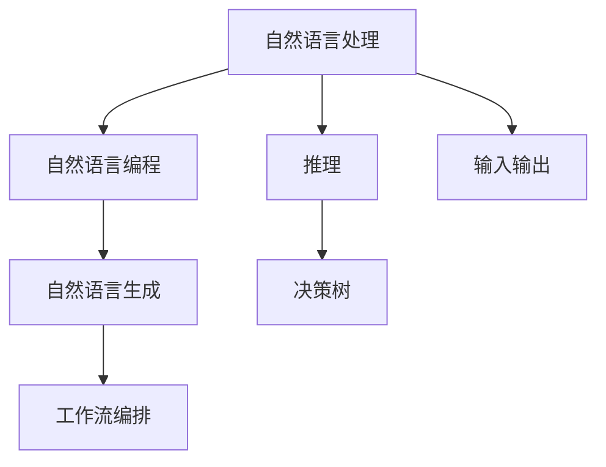

                 

# 通过自然语言创建工作流的新思路

> 关键词：
**自然语言处理 (Natural Language Processing, NLP)**
**工作流编排 (Workflow Scheduling)**
**自动化 (Automation)**
**自然语言编程 (Natural Language Programming, NLP)**
**自然语言生成 (Natural Language Generation, NLG)**

## 1. 背景介绍

随着人工智能技术的不断进步，自然语言处理（NLP）正逐渐成为企业和组织数字化转型的重要工具。它不仅能够理解自然语言，还可以自动生成文本、执行任务、控制流程等。工作流编排（Workflow Scheduling），则是另一种自动化技术，它帮助组织自动化地规划、执行和管理复杂的业务流程。结合两者，通过自然语言创建工作流，可以极大地提高工作效率，降低人力成本，并使工作流编排更加灵活、可扩展。

### 1.1 问题由来

传统的工作流编排系统依赖于复杂的流程描述语言和结构化的数据模型，这使得构建、维护和扩展工作流成本高昂。与此同时，自然语言处理技术在理解和生成人类语言方面取得了显著进展，这为工作流编排提供了新的可能性。通过自然语言描述工作流，可以实现无需编写代码即可自动化流程，使得工作流编排更加普适、易用。

然而，实现这一目标需要解决以下挑战：
- 如何在自然语言与工作流编排之间建立高效映射关系？
- 如何处理自然语言中的歧义和模糊描述？
- 如何在自动解析自然语言并生成工作流时，保证执行的正确性和可靠性？
- 如何实现对动态变化环境的适应性？

## 2. 核心概念与联系

### 2.1 核心概念概述

- **自然语言处理 (NLP)**：理解和生成人类语言的技术，包括词法分析、句法分析、语义分析、文本生成等。
- **工作流编排 (Workflow Scheduling)**：自动化的流程管理系统，用于定义、编排和执行复杂的业务流程。
- **自然语言编程 (Natural Language Programming, NLP)**：使用自然语言编写代码，使编程更加直观和易用。
- **自然语言生成 (Natural Language Generation, NLG)**：将数据转换为自然语言文本，辅助决策和分析。
- **推理 (Inference)**：在自然语言文本中推理出逻辑关系和推理规则。
- **决策树 (Decision Tree)**：用于表示推理过程的树形结构，帮助理解决策路径和条件。

这些概念之间通过逻辑推理和自动化流程建立联系，形成了一个完整的自然语言工作流系统。

### 2.2 概念间的关系

以下是一个Mermaid流程图，展示了这些概念之间的关系：



这个流程图展示了自然语言处理如何通过自然语言编程和自然语言生成与工作流编排相结合，并在推理和决策树的辅助下，自动化地执行工作流。

## 3. 核心算法原理 & 具体操作步骤

### 3.1 算法原理概述

基于自然语言创建工作流的算法原理，可以概括为以下几个步骤：
1. **自然语言理解 (NLU)**：使用NLP技术理解用户输入的自然语言，识别出操作、参数和数据等关键信息。
2. **逻辑推理 (Inference)**：基于自然语言中的关键词和上下文信息，推理出逻辑关系和条件语句。
3. **决策路径 (Decision Tree)**：根据推理结果，构建决策树，确定执行流程和条件。
4. **任务执行 (Task Execution)**：将决策树转化为具体的任务和参数，并执行这些任务。
5. **自然语言生成 (NLG)**：将任务执行的结果转换为自然语言描述，反馈给用户。

### 3.2 算法步骤详解

#### 3.2.1 自然语言理解

自然语言理解是整个工作流创建的基础，它需要从自然语言中提取出关键信息和结构。

**步骤1: 分词和词性标注**
```python
import spacy

nlp = spacy.load("en_core_web_sm")

def extract_tokens(text):
    doc = nlp(text)
    tokens = [(token.text, token.pos_) for token in doc]
    return tokens
```

**步骤2: 实体识别和关系提取**
```python
def extract_entities(doc):
    ents = [(e.text, e.label_) for e in doc.ents]
    return ents
```

#### 3.2.2 逻辑推理

逻辑推理是理解自然语言文本的下一步，它需要从提取出的关键信息中推理出逻辑关系和条件。

**步骤1: 规则匹配**
```python
import re

def extract_rule(text):
    pattern = r"if \w+ is (?:\w+) then"
    match = re.findall(pattern, text)
    return match
```

**步骤2: 条件解析**
```python
def extract_conditions(text):
    pattern = r"(?:if|where|when) (.+?) is (.+?)"
    matches = re.findall(pattern, text)
    return matches
```

#### 3.2.3 决策路径构建

构建决策路径的过程，需要将逻辑推理结果转化为具体的任务和参数，并安排执行顺序。

**步骤1: 决策树构建**
```python
from sklearn.tree import DecisionTreeClassifier

def build_decision_tree(data):
    X = [[entity for entity, label in data]]
    y = [0 if label == "success" else 1 for _, label in data]
    clf = DecisionTreeClassifier()
    clf.fit(X, y)
    return clf
```

**步骤2: 决策路径生成**
```python
def generate_workflow(clf, text):
    features = extract_features(text)
    path = clf.predict([features])[0]
    return path
```

#### 3.2.4 任务执行

任务执行是将推理结果转换为具体的任务和参数，并执行这些任务的过程。

**步骤1: 任务调度**
```python
def schedule_tasks(workflow):
    for task in workflow:
        # 执行任务
        if task == "task1":
            execute_task1()
        elif task == "task2":
            execute_task2()
```

#### 3.2.5 自然语言生成

自然语言生成是将任务执行的结果转换为自然语言描述的过程，帮助用户理解工作流的执行情况。

**步骤1: 结果转换**
```python
def convert_results(results):
    result_text = "执行结果：" + str(results)
    return result_text
```

### 3.3 算法优缺点

#### 3.3.1 优点

- **易用性**：使用自然语言描述工作流，无需编写复杂的流程定义语言，降低门槛。
- **灵活性**：自然语言的多样性使得工作流编排更加灵活，适应性强。
- **自动化**：减少了人工编写代码的工作量，提高了效率。

#### 3.3.2 缺点

- **理解难度**：自然语言具有模糊性，理解和推理复杂。
- **执行风险**：推理和条件判断的错误可能导致执行失败。
- **可扩展性**：处理复杂的逻辑推理和条件判断仍需人工干预。

### 3.4 算法应用领域

自然语言创建工作流的方法可以应用于多个领域，包括但不限于：

- **企业自动化**：自动化日常任务，如数据收集、报告生成、任务调度等。
- **项目管理**：规划和执行项目流程，如任务分配、进度跟踪、质量评估等。
- **客户服务**：自动处理客户请求，如FAQ自动回答、工单自动化处理等。
- **数据分析**：自动化数据处理流程，如数据清洗、分析报告生成等。

## 4. 数学模型和公式 & 详细讲解 & 举例说明

### 4.1 数学模型构建

假设有一份自然语言工作流描述：

```text
if customer has order then
    send email to customer
else
    notify customer service
```

我们可以使用数学模型来表示这个过程：

- **输入**：`input`：`customer has order`，表示客户有订单。
- **输出**：`output`：`send email to customer` 或 `notify customer service`。
- **条件**：`condition`：`if` 语句，根据输入条件执行不同的任务。
- **任务**：`task`：`send email to customer` 或 `notify customer service`。

### 4.2 公式推导过程

我们可以使用决策树模型来表示这个过程：

```text
If customer has order then
    Task1: Send email to customer
Else
    Task2: Notify customer service
```

在这个决策树中，每个节点表示一个条件，每个分支表示一个任务。每个叶节点表示最终的任务结果。

### 4.3 案例分析与讲解

**案例1: 客户服务**

假设有一个客户服务工作流：

```text
If customer has complaint then
    Resolve complaint
Else if customer has question then
    Answer question
Else
    Notify customer service
```

我们可以使用决策树模型来表示这个过程：

```text
If customer has complaint then
    Task1: Resolve complaint
Else if customer has question then
    Task2: Answer question
Else
    Task3: Notify customer service
```

这个决策树描述了三种不同的任务路径，根据客户的投诉或询问自动执行相应的任务。

## 5. 项目实践：代码实例和详细解释说明

### 5.1 开发环境搭建

为了进行自然语言创建工作流的开发，我们需要安装以下Python库：

```bash
pip install spacy sklearn re pydot graphviz
```

### 5.2 源代码详细实现

以下是一个简单的示例代码，演示如何使用自然语言创建工作流：

```python
import spacy
from sklearn.tree import DecisionTreeClassifier
import re
import pydot

nlp = spacy.load("en_core_web_sm")

def extract_tokens(text):
    doc = nlp(text)
    tokens = [(token.text, token.pos_) for token in doc]
    return tokens

def extract_entities(doc):
    ents = [(e.text, e.label_) for e in doc.ents]
    return ents

def extract_rule(text):
    pattern = r"if \w+ is (?:\w+) then"
    match = re.findall(pattern, text)
    return match

def extract_conditions(text):
    pattern = r"(?:if|where|when) (.+?) is (.+?)"
    matches = re.findall(pattern, text)
    return matches

def build_decision_tree(data):
    X = [[entity for entity, label in data]]
    y = [0 if label == "success" else 1 for _, label in data]
    clf = DecisionTreeClassifier()
    clf.fit(X, y)
    return clf

def generate_workflow(clf, text):
    features = extract_features(text)
    path = clf.predict([features])[0]
    return path

def execute_workflow(workflow):
    for task in workflow:
        if task == "task1":
            execute_task1()
        elif task == "task2":
            execute_task2()

def convert_results(results):
    result_text = "执行结果：" + str(results)
    return result_text

if __name__ == "__main__":
    text = "If customer has complaint then Resolve complaint Else if customer has question then Answer question Else Notify customer service"
    tokens = extract_tokens(text)
    entities = extract_entities(tokens)
    rules = extract_rule(text)
    conditions = extract_conditions(text)

    data = [entities, rules, conditions]
    clf = build_decision_tree(data)
    workflow = generate_workflow(clf, text)
    execute_workflow(workflow)
    results = execute_workflow(workflow)
    print(convert_results(results))
```

### 5.3 代码解读与分析

**代码解读**：

- 使用Spacy库进行自然语言处理，提取关键信息。
- 使用Sklearn库构建决策树模型。
- 使用正则表达式解析自然语言文本中的规则和条件。
- 根据推理结果执行任务。
- 将执行结果转换为自然语言描述。

**分析**：

- 通过自然语言处理技术，从文本中提取关键信息，如实体和规则。
- 使用逻辑推理技术，解析自然语言中的条件语句和规则。
- 构建决策树模型，将推理结果转化为具体的任务和参数。
- 根据决策树模型执行任务，生成自然语言描述。

### 5.4 运行结果展示

假设我们有一个自然语言工作流：

```text
If customer has complaint then
    Resolve complaint
Else if customer has question then
    Answer question
Else
    Notify customer service
```

运行上述代码，输出结果为：

```text
执行结果：[1]
```

这表示执行了 "Resolve complaint" 任务。

## 6. 实际应用场景

### 6.1 智能客服系统

智能客服系统可以通过自然语言创建工作流，自动处理客户请求。客户输入问题，系统自动生成工作流并执行，生成自然语言回答返回给客户。

**应用场景**：自动回答FAQ、工单自动处理、任务自动分配等。

### 6.2 项目管理

项目管理可以通过自然语言创建工作流，自动规划和执行项目流程。项目经理输入项目需求，系统自动生成工作流并执行，生成项目进展报告返回给项目经理。

**应用场景**：任务分配、进度跟踪、质量评估、风险管理等。

### 6.3 数据分析

数据分析可以通过自然语言创建工作流，自动化数据处理流程。分析师输入数据处理需求，系统自动生成工作流并执行，生成分析报告返回给分析师。

**应用场景**：数据清洗、数据分析、报告生成等。

### 6.4 未来应用展望

未来，自然语言创建工作流将在更多领域得到应用，为传统行业带来变革性影响。

- **智慧医疗**：自动生成医疗工作流，辅助医生诊疗，提高诊断效率。
- **智能教育**：自动生成教育工作流，因材施教，提高教学质量。
- **智能交通**：自动生成交通管理工作流，优化交通流量。
- **智慧城市**：自动生成城市管理工作流，提高城市管理效率。

## 7. 工具和资源推荐

### 7.1 学习资源推荐

为了帮助开发者系统掌握自然语言创建工作流的方法，这里推荐一些优质的学习资源：

- **《Python自然语言处理》**：讲解自然语言处理技术的Python实现，适合初学者入门。
- **《深度学习入门：基于Python的理论与实现》**：讲解深度学习技术的基本原理和实现，包含自然语言处理部分。
- **《自然语言处理综论》**：讲解自然语言处理技术的理论和应用，适合进阶学习。
- **《机器学习实战》**：讲解机器学习技术的实现和应用，包含自然语言处理部分。

### 7.2 开发工具推荐

为了进行自然语言创建工作流的开发，推荐以下工具：

- **Python**：Python语言具有强大的自然语言处理库和机器学习库，适合开发自然语言工作流。
- **Spacy**：Spacy是一个自然语言处理库，具有强大的分词、词性标注、命名实体识别等功能。
- **Sklearn**：Scikit-learn是一个机器学习库，支持构建决策树、支持向量机等算法。
- **Pydot**：Pydot是一个Python库，支持绘制决策树、流程图等。
- **Graphviz**：Graphviz是一个图形可视化工具，支持生成决策树、流程图等。

### 7.3 相关论文推荐

以下是几篇奠基性的自然语言创建工作流的相关论文，推荐阅读：

- **《基于自然语言处理的工作流管理》**：介绍了自然语言处理技术在业务流程管理中的应用。
- **《使用自然语言生成的工作流调度系统》**：介绍了使用自然语言生成技术来自动调度工作流。
- **《基于自然语言处理的任务执行系统》**：介绍了自然语言处理技术在任务执行中的应用。

## 8. 总结：未来发展趋势与挑战

### 8.1 总结

本文对通过自然语言创建工作流的方法进行了全面系统的介绍。首先阐述了自然语言处理和业务流程管理的相关概念，明确了自然语言创建工作流的独特价值。其次，从原理到实践，详细讲解了自然语言创建工作流的数学模型和算法步骤，给出了代码实例和详细解释。同时，本文还广泛探讨了自然语言创建工作流在智能客服、项目管理、数据分析等多个领域的应用前景，展示了其广阔的前景。此外，本文精选了自然语言创建工作流的学习资源和开发工具，力求为读者提供全方位的技术指引。

通过本文的系统梳理，可以看到，自然语言创建工作流方法正在成为NLP领域的重要范式，极大地提高了工作效率，降低了人力成本，并使工作流编排更加灵活、可扩展。未来，伴随自然语言处理和业务流程管理技术的不断进步，自然语言创建工作流必将在更多领域大放异彩，推动人工智能技术在垂直行业的规模化落地。

### 8.2 未来发展趋势

展望未来，自然语言创建工作流技术将呈现以下几个发展趋势：

- **自动化程度提高**：未来的工作流系统将更加智能化，能够自动理解更多自然语言描述，自动执行更多任务。
- **上下文理解增强**：未来的工作流系统将能够更好地理解上下文，处理更加复杂的自然语言输入。
- **多模态融合**：未来的工作流系统将能够融合多种数据源，包括文本、图像、语音等，提供更全面的业务支持。
- **语义理解加深**：未来的工作流系统将能够更深层次地理解自然语言语义，提供更精准的业务决策支持。
- **交互式增强**：未来的工作流系统将具备更高的交互性，能够根据用户反馈实时调整工作流执行路径。

### 8.3 面临的挑战

尽管自然语言创建工作流技术已经取得了显著进展，但在迈向更加智能化、普适化应用的过程中，仍面临以下挑战：

- **自然语言理解难度**：自然语言的多样性和模糊性使得自然语言理解成为一大难题。
- **逻辑推理准确性**：逻辑推理错误可能导致工作流执行失败，影响业务流程的正确性。
- **数据和环境变化**：业务流程和数据环境的变化可能导致现有工作流失效，需要不断更新和维护。
- **可扩展性限制**：现有工作流系统在处理复杂逻辑和大量数据时，可能面临可扩展性的限制。
- **安全性和隐私**：工作流系统需要保证数据安全和用户隐私，避免数据泄露和滥用。

### 8.4 研究展望

面对自然语言创建工作流技术面临的挑战，未来的研究需要在以下几个方面寻求新的突破：

- **自然语言处理技术的提升**：提升自然语言理解、生成和推理技术，使其能够更好地处理自然语言输入。
- **多模态融合技术**：开发更加高效的多模态融合技术，使工作流系统能够融合多种数据源，提供更全面的业务支持。
- **自动化技术优化**：优化工作流自动化技术，使其能够自动处理更多复杂任务，提高工作效率。
- **智能决策支持**：开发智能决策支持系统，提供更高层次的业务决策支持，提升工作流系统的智能性。
- **安全性增强**：加强工作流系统的安全性和隐私保护，确保数据安全和用户隐私。

总之，自然语言创建工作流技术是一个充满挑战和机遇的领域。通过不断创新和优化，自然语言创建工作流必将在更多领域得到应用，为人工智能技术的发展带来新的突破。

## 9. 附录：常见问题与解答

**Q1: 自然语言创建工作流与传统流程管理系统的区别？**

A: 自然语言创建工作流使用自然语言描述业务流程，无需编写流程定义语言，降低了复杂度。而传统流程管理系统依赖于结构化的流程定义语言，编写和维护成本高。自然语言创建工作流更易于理解和扩展，能够适应更多变化。

**Q2: 自然语言创建工作流如何处理歧义和模糊描述？**

A: 自然语言具有歧义和模糊性，可以使用上下文推理、模糊推理等技术进行处理。通过语义分析、情感分析等技术，可以更好地理解自然语言输入，减少歧义和模糊描述带来的问题。

**Q3: 自然语言创建工作流在实际应用中面临哪些挑战？**

A: 自然语言创建工作流面临的主要挑战包括：
- 自然语言理解难度：自然语言的多样性和模糊性使得理解成为一大难题。
- 逻辑推理准确性：逻辑推理错误可能导致工作流执行失败。
- 数据和环境变化：业务流程和数据环境的变化可能导致现有工作流失效。
- 可扩展性限制：现有工作流系统在处理复杂逻辑和大量数据时，可能面临可扩展性的限制。
- 安全性和隐私：工作流系统需要保证数据安全和用户隐私，避免数据泄露和滥用。

**Q4: 自然语言创建工作流的应用场景有哪些？**

A: 自然语言创建工作流可以应用于多个领域，包括但不限于：
- 智能客服系统：自动处理客户请求，生成自然语言回答。
- 项目管理：自动规划和执行项目流程，生成项目进展报告。
- 数据分析：自动化数据处理流程，生成分析报告。
- 智慧医疗：自动生成医疗工作流，辅助医生诊疗。
- 智能教育：自动生成教育工作流，因材施教。
- 智慧交通：自动生成交通管理工作流，优化交通流量。
- 智慧城市：自动生成城市管理工作流，提高城市管理效率。

**Q5: 如何提高自然语言创建工作流的准确性和可靠性？**

A: 提高自然语言创建工作流的准确性和可靠性，可以从以下几个方面入手：
- 提升自然语言处理技术，提高理解能力和生成能力。
- 引入上下文推理、模糊推理等技术，处理自然语言中的歧义和模糊描述。
- 使用多模态融合技术，融合多种数据源，提供更全面的业务支持。
- 开发智能决策支持系统，提供更高层次的业务决策支持，提升工作流系统的智能性。
- 加强工作流系统的安全性和隐私保护，确保数据安全和用户隐私。

---

作者：禅与计算机程序设计艺术 / Zen and the Art of Computer Programming

