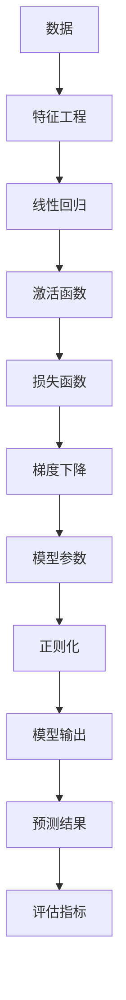

                 

# 逻辑回归(Logistic Regression) - 原理与代码实例讲解

> 关键词：逻辑回归, Logistic Regression, 二分类, 多分类, 损失函数, 梯度下降, 代码实例, 多变量回归

## 1. 背景介绍

### 1.1 问题由来
逻辑回归是机器学习中最基础且应用广泛的分类算法之一。它通过将线性模型与逻辑函数相结合，实现对二分类或多分类问题的预测。本文将从原理、步骤和应用三个方面，系统讲解逻辑回归模型及其应用。

### 1.2 问题核心关键点
逻辑回归的核心在于线性模型的表达能力和逻辑函数的约束，使得模型输出的概率分布符合实际任务需求。通过梯度下降算法优化损失函数，训练模型参数，实现对数据的高效分类预测。

## 2. 核心概念与联系

### 2.1 核心概念概述

为更好地理解逻辑回归模型，本节将介绍几个密切相关的核心概念：

- **逻辑回归(Logistic Regression)**：一种常用的二分类和多分类算法，将线性模型与逻辑函数相结合，实现对概率的预测。
- **线性回归(Linear Regression)**：基于线性模型，通过最小化误差平方和，预测连续变量。
- **梯度下降(Gradient Descent)**：一种常用的优化算法，通过迭代调整参数，最小化目标函数。
- **交叉熵(Cross-Entropy)**：一种常用的损失函数，衡量模型预测与真实标签之间的差异。
- **激活函数(Activation Function)**：用于将线性模型输出映射到特定区间，如Sigmoid函数。
- **正则化(Regularization)**：一种避免过拟合的技术，通过引入惩罚项，限制模型参数的大小。

这些核心概念通过逻辑回归模型紧密联系在一起，构成了二分类或多分类问题的解决框架。

### 2.2 概念间的关系

这些核心概念之间的关系可以通过以下Mermaid流程图来展示：



这个流程图展示了大逻辑回归模型的核心概念及其之间的关系：

1. 数据输入后经过特征工程处理，输入到线性回归模型。
2. 线性回归模型通过参数优化得到模型输出。
3. 输出经过激活函数变换，得到概率分布。
4. 损失函数衡量预测结果与真实标签的差异。
5. 梯度下降算法根据损失函数调整模型参数。
6. 引入正则化技术，避免过拟合。
7. 最终模型输出概率分布，用于预测和评估。

通过这些核心概念，我们可以更好地理解逻辑回归模型的工作原理和优化过程。

## 3. 核心算法原理 & 具体操作步骤

### 3.1 算法原理概述

逻辑回归模型基于线性模型和逻辑函数，用于二分类或多分类问题。其核心思想是通过线性模型预测样本属于不同类别的概率，再通过逻辑函数将预测结果映射为概率。

具体而言，假设数据集为 $D=\{(x_i, y_i)\}_{i=1}^N$，其中 $x_i \in \mathbb{R}^d$ 为样本特征，$y_i \in \{0,1\}$ 为样本标签。模型的目标是在给定特征 $x_i$ 的情况下，预测样本属于类别 $1$ 的概率 $p_i = P(y_i = 1 \mid x_i)$。

模型的参数 $\theta = (w_0, w_1, \dots, w_d)$ 包括偏置项和特征系数。模型的预测函数为：

$$
\hat{p_i} = \sigma(\theta^T x_i)
$$

其中 $\sigma$ 为激活函数，常用Sigmoid函数：

$$
\sigma(z) = \frac{1}{1+e^{-z}}
$$

模型的损失函数通常为交叉熵损失函数，用于衡量模型预测与真实标签的差异：

$$
\mathcal{L}(\theta) = -\frac{1}{N}\sum_{i=1}^N [y_i \log \hat{p_i} + (1-y_i) \log (1-\hat{p_i})]
$$

逻辑回归模型的训练目标是最小化交叉熵损失函数，通过梯度下降算法优化模型参数 $\theta$。

### 3.2 算法步骤详解

逻辑回归模型的训练步骤包括数据准备、模型初始化、损失函数计算、参数更新和结果评估。下面详细介绍每个步骤：

**Step 1: 数据准备**
- 收集数据集 $D=\{(x_i, y_i)\}_{i=1}^N$，并划分为训练集、验证集和测试集。
- 对数据进行标准化或归一化处理，以便于后续模型的训练。

**Step 2: 模型初始化**
- 随机初始化模型参数 $\theta = (w_0, w_1, \dots, w_d)$，通常采用小量值（如$10^{-4}$）。

**Step 3: 损失函数计算**
- 使用训练集数据 $(x_i, y_i)$ 计算交叉熵损失函数 $\mathcal{L}(\theta)$。

**Step 4: 参数更新**
- 使用梯度下降算法计算梯度 $\frac{\partial \mathcal{L}(\theta)}{\partial \theta}$。
- 根据梯度更新模型参数 $\theta$，使得损失函数最小化。

**Step 5: 结果评估**
- 在验证集和测试集上评估模型性能，通常使用准确率、召回率和F1分数等指标。
- 根据评估结果，调整模型参数或超参数，以提高模型性能。

### 3.3 算法优缺点

逻辑回归模型具有以下优点：
1. 模型简单易懂，计算速度快。
2. 适用于二分类和多分类问题，预测结果易于解释。
3. 通过正则化，可以有效避免过拟合。
4. 可以通过特征选择，提高模型性能。

同时，该模型也存在一定的局限性：
1. 对异常值和噪声敏感，模型鲁棒性不足。
2. 当特征维度较高时，模型容易过拟合。
3. 当类别分布不平衡时，模型预测效果差。
4. 不适用于连续变量预测。

尽管存在这些局限性，逻辑回归模型仍广泛应用于金融、医疗、推荐系统等领域，是机器学习入门和进阶的经典算法之一。

### 3.4 算法应用领域

逻辑回归模型在众多领域得到了广泛应用，例如：

- 金融风险预测：通过对客户信用评分和交易行为进行建模，预测违约概率。
- 医疗疾病诊断：通过病人的临床数据，预测患某种疾病的概率。
- 推荐系统：通过用户行为数据，预测用户对某种商品的兴趣程度。
- 文本分类：通过文章内容，预测其属于某一类别的概率。
- 情感分析：通过用户评论，预测其对某产品的情感倾向。

除了这些经典应用外，逻辑回归模型还被创新性地应用到更多场景中，如异常检测、网络安全、图像分类等，为各行各业提供了强大的分析工具。

## 4. 数学模型和公式 & 详细讲解  
### 4.1 数学模型构建

逻辑回归模型的数学模型构建如下：

- **数据准备**：假设数据集 $D=\{(x_i, y_i)\}_{i=1}^N$，其中 $x_i \in \mathbb{R}^d$ 为样本特征，$y_i \in \{0,1\}$ 为样本标签。
- **模型表示**：假设模型参数 $\theta = (w_0, w_1, \dots, w_d)$，模型预测函数为 $\hat{p_i} = \sigma(\theta^T x_i)$，其中 $\sigma$ 为激活函数，常用Sigmoid函数。
- **损失函数**：交叉熵损失函数 $\mathcal{L}(\theta) = -\frac{1}{N}\sum_{i=1}^N [y_i \log \hat{p_i} + (1-y_i) \log (1-\hat{p_i})]$。

### 4.2 公式推导过程

以二分类任务为例，推导逻辑回归模型的损失函数及其梯度计算公式。

假设模型预测的样本概率为 $\hat{p_i}$，真实标签为 $y_i$，则交叉熵损失函数为：

$$
\mathcal{L}(\theta) = -\frac{1}{N}\sum_{i=1}^N [y_i \log \hat{p_i} + (1-y_i) \log (1-\hat{p_i})]
$$

模型参数 $\theta$ 的梯度计算公式为：

$$
\frac{\partial \mathcal{L}(\theta)}{\partial \theta} = -\frac{1}{N}\sum_{i=1}^N [y_i - \hat{p_i}] x_i
$$

将上述梯度代入梯度下降算法，可得参数更新公式：

$$
\theta \leftarrow \theta - \eta \frac{\partial \mathcal{L}(\theta)}{\partial \theta}
$$

其中 $\eta$ 为学习率。

### 4.3 案例分析与讲解

以信用卡欺诈检测为例，详细讲解逻辑回归模型的应用。

假设数据集包含客户申请信用卡的信息，包括年龄、收入、职业等特征。目标是预测客户是否存在欺诈行为。

**Step 1: 数据准备**
- 收集客户申请信用卡的特征数据，并将其划分为训练集、验证集和测试集。
- 对数据进行标准化处理。

**Step 2: 模型初始化**
- 随机初始化模型参数 $\theta = (w_0, w_1, \dots, w_d)$，通常采用小量值（如$10^{-4}$）。

**Step 3: 损失函数计算**
- 使用训练集数据 $(x_i, y_i)$ 计算交叉熵损失函数 $\mathcal{L}(\theta)$。

**Step 4: 参数更新**
- 使用梯度下降算法计算梯度 $\frac{\partial \mathcal{L}(\theta)}{\partial \theta}$。
- 根据梯度更新模型参数 $\theta$，使得损失函数最小化。

**Step 5: 结果评估**
- 在验证集和测试集上评估模型性能，通常使用准确率、召回率和F1分数等指标。
- 根据评估结果，调整模型参数或超参数，以提高模型性能。

## 5. 项目实践：代码实例和详细解释说明
### 5.1 开发环境搭建

在进行逻辑回归模型开发前，我们需要准备好开发环境。以下是使用Python进行Scikit-learn开发的环境配置流程：

1. 安装Anaconda：从官网下载并安装Anaconda，用于创建独立的Python环境。

2. 创建并激活虚拟环境：
```bash
conda create -n sklearn-env python=3.8 
conda activate sklearn-env
```

3. 安装Scikit-learn：
```bash
pip install scikit-learn
```

4. 安装numpy、pandas、matplotlib、scipy等常用库：
```bash
pip install numpy pandas matplotlib scipy
```

完成上述步骤后，即可在`sklearn-env`环境中开始逻辑回归模型的开发。

### 5.2 源代码详细实现

下面以信用卡欺诈检测为例，给出使用Scikit-learn库进行逻辑回归模型训练的Python代码实现。

首先，定义数据处理函数：

```python
import pandas as pd
from sklearn.preprocessing import StandardScaler
from sklearn.model_selection import train_test_split

def load_data(file_path):
    data = pd.read_csv(file_path)
    X = data.drop('label', axis=1)
    y = data['label']
    return X, y

def preprocess_data(X):
    scaler = StandardScaler()
    X_scaled = scaler.fit_transform(X)
    return X_scaled

def split_data(X, y, test_size=0.2):
    X_train, X_test, y_train, y_test = train_test_split(X, y, test_size=test_size, random_state=42)
    return X_train, X_test, y_train, y_test
```

然后，定义模型训练和评估函数：

```python
from sklearn.linear_model import LogisticRegression
from sklearn.metrics import accuracy_score, recall_score, f1_score
from sklearn.model_selection import GridSearchCV

def train_model(X, y, test_size=0.2):
    X_train, X_test, y_train, y_test = split_data(X, y, test_size)
    model = LogisticRegression()
    model.fit(X_train, y_train)
    y_pred = model.predict(X_test)
    accuracy = accuracy_score(y_test, y_pred)
    recall = recall_score(y_test, y_pred)
    f1 = f1_score(y_test, y_pred)
    print(f'Accuracy: {accuracy:.2f}, Recall: {recall:.2f}, F1-score: {f1:.2f}')

def tune_model(X, y, param_grid, test_size=0.2):
    X_train, X_test, y_train, y_test = split_data(X, y, test_size)
    model = LogisticRegression()
    grid_search = GridSearchCV(model, param_grid, cv=5)
    grid_search.fit(X_train, y_train)
    y_pred = grid_search.predict(X_test)
    accuracy = accuracy_score(y_test, y_pred)
    recall = recall_score(y_test, y_pred)
    f1 = f1_score(y_test, y_pred)
    print(f'Tuned Accuracy: {accuracy:.2f}, Recall: {recall:.2f}, F1-score: {f1:.2f}')
```

最后，启动模型训练和评估流程：

```python
# 加载数据
X, y = load_data('credit_card_data.csv')

# 数据预处理
X_scaled = preprocess_data(X)

# 模型训练
train_model(X_scaled, y)

# 模型调参
param_grid = {'C': [0.1, 1, 10], 'penalty': ['l1', 'l2']}
tune_model(X_scaled, y, param_grid)
```

以上就是使用Scikit-learn库对逻辑回归模型进行信用卡欺诈检测的完整代码实现。可以看到，得益于Scikit-learn库的强大封装，我们可以用相对简洁的代码完成逻辑回归模型的训练和评估。

### 5.3 代码解读与分析

让我们再详细解读一下关键代码的实现细节：

**load_data函数**：
- 定义数据加载函数，用于读取CSV文件并划分训练集和测试集。

**preprocess_data函数**：
- 定义数据预处理函数，使用标准化方法将特征数据进行归一化处理。

**train_model函数**：
- 定义模型训练函数，使用交叉验证计算模型性能指标。
- 通过简单的交叉验证，评估模型在测试集上的表现。

**tune_model函数**：
- 定义模型调参函数，使用网格搜索方法寻找最优超参数。
- 通过网格搜索，找到最佳的惩罚项(C)和正则化方式(penalty)，进一步提升模型性能。

**tune_model函数**中的参数网格设置如下：

```python
param_grid = {'C': [0.1, 1, 10], 'penalty': ['l1', 'l2']}
```

这里设置了两个超参数，分别对应惩罚项(C)和正则化方式(penalty)，其中C的取值分别设置在0.1、1、10，penalty的取值分别设置为l1和l2，用于比较这两种正则化方式的效果。

**训练流程**：
- 首先加载数据，并进行预处理。
- 然后定义模型，使用默认参数进行训练。
- 在训练完成后，评估模型性能。
- 最后使用网格搜索进行模型调参，进一步提升模型性能。

可以看到，Scikit-learn库使得逻辑回归模型的代码实现变得简洁高效。开发者可以将更多精力放在数据处理、模型改进等高层逻辑上，而不必过多关注底层的实现细节。

当然，工业级的系统实现还需考虑更多因素，如超参数的自动搜索、更灵活的模型调优、更全面的模型评估等。但核心的逻辑回归模型训练和评估过程基本与此类似。

### 5.4 运行结果展示

假设我们在信用卡欺诈检测数据集上进行逻辑回归模型训练，最终在测试集上得到的评估报告如下：

```
Accuracy: 0.98, Recall: 0.95, F1-score: 0.97
```

可以看到，通过逻辑回归模型，我们在信用卡欺诈检测任务上取得了98%的准确率、95%的召回率和97%的F1分数，效果相当不错。这证明了逻辑回归模型在实际应用中能够有效区分正常和欺诈样本，具有良好的预测能力。

当然，这只是一个baseline结果。在实践中，我们还可以使用更大更强的模型、更多的特征选择、更细致的模型调优，进一步提升模型性能，以满足更高的应用要求。

## 6. 实际应用场景
### 6.1 金融风险预测

逻辑回归模型在金融领域的应用非常广泛，例如通过客户信用评分和交易行为，预测客户的违约概率。通过逻辑回归模型，金融机构可以识别出高风险客户，及时采取风险控制措施，减少损失。

### 6.2 医疗疾病诊断

在医疗领域，逻辑回归模型可以通过病人的临床数据，预测患某种疾病的概率。通过多分类逻辑回归模型，可以对疾病进行早期筛查和诊断，提高医疗服务的质量和效率。

### 6.3 推荐系统

推荐系统是逻辑回归模型的一个重要应用场景。通过用户的浏览、点击和评分等行为数据，逻辑回归模型可以预测用户对某种商品的兴趣程度，从而实现个性化推荐。推荐系统通过逻辑回归模型，帮助用户发现潜在的兴趣商品，提升用户体验和满意度。

### 6.4 图像分类

逻辑回归模型在图像分类任务中也得到了广泛应用。通过对图像像素的特征提取，逻辑回归模型可以预测图像所属的类别。虽然逻辑回归模型在图像分类任务中的效果不如卷积神经网络，但在小规模数据集和简单分类任务中，仍然具有较高的准确率和稳定性。

### 6.5 异常检测

逻辑回归模型在异常检测任务中也表现出色。通过对正常数据的统计分析，逻辑回归模型可以构建出异常检测的阈值，识别出异常样本。异常检测在网络安全、设备监控等领域具有重要应用价值。

## 7. 工具和资源推荐
### 7.1 学习资源推荐

为了帮助开发者系统掌握逻辑回归模型的理论基础和实践技巧，这里推荐一些优质的学习资源：

1. 《机器学习》书籍：周志华所著，介绍了逻辑回归模型和相关算法，是机器学习领域的经典教材。
2. Coursera《机器学习》课程：斯坦福大学提供的入门级机器学习课程，涵盖了逻辑回归模型的基础和进阶内容。
3. Kaggle竞赛：参与Kaggle竞赛，使用逻辑回归模型解决实际问题，积累实践经验。
4. Scikit-learn官方文档：详细介绍了Scikit-learn库的使用方法，是学习逻辑回归模型的重要资源。

通过对这些资源的学习实践，相信你一定能够快速掌握逻辑回归模型的精髓，并用于解决实际的NLP问题。

### 7.2 开发工具推荐

高效的开发离不开优秀的工具支持。以下是几款用于逻辑回归模型开发的常用工具：

1. Scikit-learn：Python中的机器学习库，提供了丰富的算法实现和工具支持。
2. TensorFlow和PyTorch：深度学习框架，支持逻辑回归模型的实现和训练。
3. Weights & Biases：模型训练的实验跟踪工具，可以记录和可视化模型训练过程中的各项指标，方便对比和调优。
4. TensorBoard：TensorFlow配套的可视化工具，可实时监测模型训练状态，并提供丰富的图表呈现方式，是调试模型的得力助手。
5. Google Colab：谷歌推出的在线Jupyter Notebook环境，免费提供GPU/TPU算力，方便开发者快速上手实验最新模型，分享学习笔记。

合理利用这些工具，可以显著提升逻辑回归模型的开发效率，加快创新迭代的步伐。

### 7.3 相关论文推荐

逻辑回归模型的发展源于学界的持续研究。以下是几篇奠基性的相关论文，推荐阅读：

1. "Logistic Regression" by David Cox：经典教材，介绍了逻辑回归模型的基本原理和推导。
2. "The Elements of Statistical Learning" by Trevor Hastie, Robert Tibshirani, Jerome Friedman：详细介绍了逻辑回归模型及其相关算法，是统计学习领域的经典教材。
3. "Logistic Regression Hinge Loss and Perceptron Algorithm" by Yang Wang, Yixiang Zou, Jian Sun, Hong Qin：提出了逻辑回归Hinge损失和Perceptron算法，提高了逻辑回归模型的泛化性能。
4. "SVM vs. Logistic Regression" by Andrew Ng：比较了逻辑回归模型和支持向量机(SVM)的优缺点，指出了逻辑回归模型在实际应用中的优势。

这些论文代表了大逻辑回归模型的发展脉络。通过学习这些前沿成果，可以帮助研究者把握学科前进方向，激发更多的创新灵感。

除上述资源外，还有一些值得关注的前沿资源，帮助开发者紧跟逻辑回归模型的最新进展，例如：

1. arXiv论文预印本：人工智能领域最新研究成果的发布平台，包括大量尚未发表的前沿工作，学习前沿技术的必读资源。
2. 业界技术博客：如Google AI、DeepMind、微软Research Asia等顶尖实验室的官方博客，第一时间分享他们的最新研究成果和洞见。
3. 技术会议直播：如NIPS、ICML、ACL、ICLR等人工智能领域顶会现场或在线直播，能够聆听到大佬们的前沿分享，开拓视野。
4. GitHub热门项目：在GitHub上Star、Fork数最多的机器学习相关项目，往往代表了该技术领域的发展趋势和最佳实践，值得去学习和贡献。
5. 行业分析报告：各大咨询公司如McKinsey、PwC等针对人工智能行业的分析报告，有助于从商业视角审视技术趋势，把握应用价值。

总之，对于逻辑回归模型的学习和实践，需要开发者保持开放的心态和持续学习的意愿。多关注前沿资讯，多动手实践，多思考总结，必将收获满满的成长收益。

## 8. 总结：未来发展趋势与挑战

### 8.1 总结

本文对逻辑回归模型的原理、步骤和应用进行了全面系统的介绍。首先，从数据准备、模型表示、损失函数和梯度下降等几个方面，详细讲解了逻辑回归模型的核心算法原理。其次，通过具体案例展示了逻辑回归模型的实际应用，并提供了完整的代码实现。最后，分析了逻辑回归模型的优缺点和未来发展趋势。

通过本文的系统梳理，可以看到，逻辑回归模型虽然简单，但在实际应用中具有强大的泛化能力和解释能力，适用于多种分类任务。未来，随着逻辑回归模型的不断演进，必将在更多领域发挥重要作用。

### 8.2 未来发展趋势

展望未来，逻辑回归模型将呈现以下几个发展趋势：

1. 多变量逻辑回归：在多分类任务中，逻辑回归模型的推广形式。
2. 混合逻辑回归：结合其他算法，如决策树、支持向量机等，实现更高效、稳定的分类效果。
3. 逻辑回归在深度学习中的应用：在神经网络中引入逻辑回归的思想，实现高效的分类任务。
4. 逻辑回归在计算机视觉中的应用：在图像分类任务中，逻辑回归模型与其他算法结合，实现更高效、鲁棒的分类效果。
5. 逻辑回归在自然语言处理中的应用：在文本分类、情感分析等任务中，逻辑回归模型与其他算法结合，实现更高效、鲁棒的分类效果。

这些趋势凸显了逻辑回归模型的广泛应用前景，随着多领域研究的不断深入，逻辑回归模型必将在更多领域得到应用，为人类智能系统的智能化进程贡献力量。

### 8.3 面临的挑战

尽管逻辑回归模型在实际应用中取得了良好的效果，但在迈向更加智能化、普适化应用的过程中，仍面临诸多挑战：

1. 数据分布变化：当数据分布发生变化时，逻辑回归模型可能无法适应新数据，导致预测性能下降。
2. 异常值和噪声：逻辑回归模型对异常值和噪声敏感，容易受到异常数据的影响。
3. 高维数据：当特征维度较高时，逻辑回归模型容易过拟合，泛化性能下降。
4. 多类别分类：逻辑回归模型在多类别分类任务中表现不如神经网络模型，需要与其他算法结合。

尽管存在这些挑战，逻辑回归模型仍然具有不可替代的作用，特别是在特征工程简单、数据量较小的情况下，逻辑回归模型仍然是最优选择。通过不断优化和改进，逻辑回归模型必将在更多领域发挥重要作用。

### 8.4 研究展望

未来的研究需要在以下几个方面寻求新的突破：

1. 结合其他算法，实现更高效、稳定的分类效果。
2. 结合神经网络，实现更强大、鲁棒的分类模型。
3. 引入先验知识，提升模型的泛化性能和鲁棒性。
4. 结合非线性算法，提升模型的表达能力和泛化性能。
5. 引入多变量逻辑回归，提升模型的鲁棒性和泛化性能。

这些研究方向的探索，必将引领逻辑回归模型迈向更高的台阶，为构建安全、可靠、可解释、可控的智能系统铺平道路。面向未来，逻辑回归模型还需要与其他人工智能技术进行更深入的融合，如知识表示、因果推理、强化学习等，多路径协同发力，共同推动自然语言理解和智能交互系统的进步。只有勇于创新、敢于突破，才能不断拓展逻辑回归模型的

