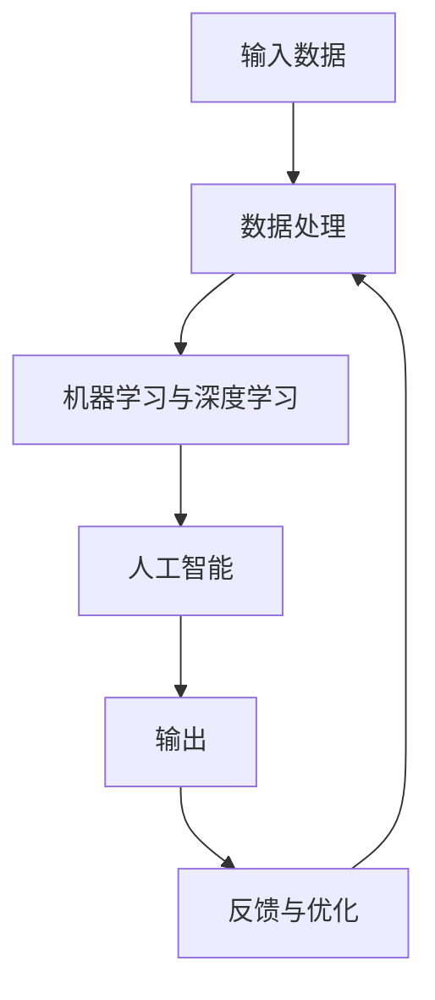

                 

## 1. 背景介绍

### 1.1 问题由来
在数字化时代，信息洪流不断冲击着我们，如何高效、灵活、可持续地管理和利用这些信息，成为了个人和组织共同面临的挑战。传统的工作流流程通常较为固定，无法应对复杂多变的环境变化。信息技术的迅猛发展，尤其是大数据、人工智能、云计算等技术的兴起，为重塑工作流提供了新的机会和可能。通过灵活运用这些技术，构建智能、高效、可持续的个人工作流，不仅能够提升个人的工作效率，还能促进创新和进步。本文聚焦于基于人工智能和数据驱动的个人工作流优化，从输入、处理、输出、反馈四个维度进行深入探讨。

### 1.2 问题核心关键点
构建个人工作流涉及输入、处理、输出、反馈四个关键步骤，每个步骤都对工作流的高效运行至关重要。

1. **输入**：高质量、及时的数据输入是工作流的起点，也是后续处理和输出的基础。
2. **处理**：通过算法和模型，对输入数据进行分析和处理，提炼出有价值的信息和知识。
3. **输出**：基于处理结果，产生相应的决策和行动方案。
4. **反馈**：根据输出结果，评估工作流的效果，并根据反馈信息进行调整和优化。

构建智能、高效的工作流，需要从这四个维度进行综合考虑，找到最优的解决方案。

### 1.3 问题研究意义
构建智能、高效、可持续的个人工作流，对于提升个人工作效率、创新能力和适应变化的能力具有重要意义：

1. **提升效率**：通过自动化和智能化手段，减少重复性、耗时的任务，提升工作效率。
2. **促进创新**：借助数据分析和模型预测，发现新的机会和趋势，推动创新和发展。
3. **适应变化**：利用反馈机制，根据环境变化及时调整工作流，保持适应性。
4. **数据驱动**：通过数据驱动决策，提升决策的科学性和准确性。
5. **知识共享**：构建知识图谱和文档，实现知识的积累和共享。

本文将从输入、处理、输出、反馈四个维度，详细介绍如何利用人工智能和数据驱动技术，重塑个人工作流，并探讨其在不同场景中的应用。

## 2. 核心概念与联系

### 2.1 核心概念概述

为更好地理解如何利用人工智能和数据驱动技术重塑个人工作流，本节将介绍几个核心概念：

- **输入数据**：包括文本、图片、音频、视频等多种形式的数据，是工作流的原始输入。
- **数据处理**：通过数据清洗、预处理、特征提取等技术，对原始数据进行处理和转换，以便进行后续分析和建模。
- **机器学习与深度学习**：用于对处理后的数据进行建模和预测，包括分类、回归、聚类、生成等任务。
- **人工智能(AI)**：利用算法和模型，实现数据驱动的决策和行动方案生成。
- **反馈与优化**：根据输出结果和实际效果，评估工作流性能，并根据反馈信息进行优化和调整。

### 2.2 概念间的关系

这些核心概念之间的关系可以通过以下Mermaid流程图来展示：



这个流程图展示了大数据工作流的核心流程，即输入、处理、分析、生成和优化。

## 3. 核心算法原理 & 具体操作步骤

### 3.1 算法原理概述

基于人工智能和数据驱动的个人工作流优化，主要通过以下几个步骤实现：

1. **数据输入与处理**：通过自动化工具，收集和预处理高质量的输入数据，准备用于后续分析和建模。
2. **数据建模与分析**：利用机器学习和深度学习技术，对处理后的数据进行建模和分析，提炼出有价值的信息和知识。
3. **决策与生成**：基于模型预测结果，生成相应的决策和行动方案。
4. **反馈与优化**：根据实际执行效果，评估工作流性能，并根据反馈信息进行调整和优化。

### 3.2 算法步骤详解

#### 3.2.1 数据输入与处理

输入数据的多样性和复杂性决定了数据处理的难度和复杂度。常用的数据处理步骤包括：

1. **数据清洗**：去除数据中的噪声和异常值，确保数据质量。
2. **数据预处理**：对数据进行归一化、标准化、采样等预处理操作，便于后续分析和建模。
3. **特征提取**：通过算法提取数据中的关键特征，简化数据维度，提高建模效率。

#### 3.2.2 数据建模与分析

数据建模与分析是工作流优化的核心步骤，主要包括：

1. **模型选择**：根据任务特点和数据类型，选择合适的机器学习和深度学习模型，如决策树、随机森林、神经网络等。
2. **模型训练**：使用历史数据对模型进行训练，优化模型参数，提高模型准确性。
3. **模型评估**：使用测试数据评估模型性能，根据评估结果调整模型参数，优化模型效果。

#### 3.2.3 决策与生成

基于模型预测结果，生成相应的决策和行动方案，主要步骤包括：

1. **决策制定**：根据模型预测结果，制定相应的决策方案，如投资、销售、运营等。
2. **方案实施**：将决策方案转化为具体的行动计划，分配资源和任务。
3. **效果评估**：根据行动计划执行效果，评估决策方案的可行性和效果。

#### 3.2.4 反馈与优化

反馈与优化是工作流优化的关键步骤，主要包括以下内容：

1. **结果评估**：根据实际执行效果，评估工作流性能，找出不足之处。
2. **优化调整**：根据反馈信息，调整模型参数和决策方案，提高工作流效果。
3. **持续改进**：通过持续优化和调整，不断提高工作流效率和效果。

### 3.3 算法优缺点

利用人工智能和数据驱动技术重塑个人工作流，具有以下优点：

1. **高效性**：通过自动化和智能化手段，减少重复性任务，提高工作效率。
2. **准确性**：利用数据驱动的决策，提升决策的科学性和准确性。
3. **灵活性**：通过模型和算法，灵活应对环境变化，提高适应性。
4. **可扩展性**：可扩展性强，适应各种规模和复杂度的任务。

同时，这种方法也存在一些缺点：

1. **数据依赖**：依赖高质量的数据输入，数据质量和多样性对工作流效果有直接影响。
2. **模型复杂度**：模型选择和参数优化复杂，需要较强的技术背景和计算资源。
3. **解释性不足**：部分模型的决策过程缺乏可解释性，难以理解和调试。

尽管存在这些缺点，但基于数据驱动的个人工作流优化方法，已经在实际应用中取得了显著成效，成为当前信息技术发展的重要方向。

### 3.4 算法应用领域

基于人工智能和数据驱动的个人工作流优化方法，已经在多个领域得到了广泛应用：

1. **金融**：利用大数据和机器学习技术，进行市场分析、风险评估、投资决策等。
2. **零售**：通过客户行为数据分析，优化销售策略、提高运营效率。
3. **制造**：利用工业互联网数据，优化生产流程、提高产品质量。
4. **医疗**：通过患者数据和医学影像分析，辅助诊断、制定治疗方案。
5. **交通**：利用交通数据和模型预测，优化交通管理、提高出行效率。
6. **教育**：通过学生学习数据分析，个性化推荐学习资源、提升教学效果。

除了上述这些经典应用，大数据工作流优化还在更多场景中得到应用，如智能家居、智慧城市、智能制造等，为各行各业带来了新的发展机遇。

## 4. 数学模型和公式 & 详细讲解 & 举例说明

### 4.1 数学模型构建

为了更好地理解数据驱动的个人工作流优化方法，本节将使用数学语言进行严格刻画。

记输入数据为 $x$，目标变量为 $y$，历史数据集为 $\{(x_i, y_i)\}_{i=1}^N$。

定义数据处理函数 $f$，对输入数据进行处理和转换，得到处理后的数据 $x'$。

定义机器学习模型 $h$，对处理后的数据 $x'$ 进行建模和预测，得到预测结果 $\hat{y}$。

定义输出函数 $g$，根据模型预测结果 $\hat{y}$，生成相应的决策和行动方案 $y'$。

定义反馈函数 $f'$，根据实际执行效果 $y'$ 和预期效果 $y'$ 的差异，生成反馈信息 $\delta$。

基于上述定义，个人工作流的优化过程可以表示为：

$$
y' = g(h(f(x)))
$$

$$
\delta = f'(y', y')
$$

$$
x' = f(x)
$$

### 4.2 公式推导过程

以下我们以二分类任务为例，推导机器学习模型的预测公式及其梯度计算方法。

假设模型 $h$ 是一个二分类模型，输入为 $x'$，输出为 $\hat{y} = P(y = 1 | x')$，表示样本属于正类的概率。

定义交叉熵损失函数：

$$
L(y, \hat{y}) = -(y \log \hat{y} + (1-y) \log (1-\hat{y}))
$$

将其代入总体损失函数：

$$
\mathcal{L}(h) = \frac{1}{N} \sum_{i=1}^N L(y_i, h(x'_i))
$$

对模型 $h$ 进行梯度下降优化，更新模型参数 $\theta$：

$$
\theta \leftarrow \theta - \eta \nabla_{\theta}\mathcal{L}(h)
$$

其中 $\eta$ 为学习率，$\nabla_{\theta}\mathcal{L}(h)$ 为损失函数对模型参数的梯度，可通过反向传播算法高效计算。

在得到模型梯度后，即可带入参数更新公式，完成模型的迭代优化。重复上述过程直至收敛，最终得到适应特定任务的最优模型参数 $\theta^*$。

### 4.3 案例分析与讲解

以金融投资决策为例，分析基于数据驱动的个人工作流优化方法的应用。

1. **数据输入**：收集历史交易数据、市场分析数据、新闻舆情数据等，作为输入数据。
2. **数据处理**：对数据进行清洗、归一化、特征提取等处理，准备用于后续分析和建模。
3. **数据建模与分析**：使用随机森林、神经网络等模型，对处理后的数据进行建模和分析，预测股票价格、市场走势等。
4. **决策与生成**：根据模型预测结果，制定相应的投资决策方案，如买入、卖出、持有等。
5. **反馈与优化**：根据实际执行效果，评估投资决策方案的可行性和效果，优化模型参数和决策方案，提高投资收益。

假设使用一个二分类模型进行股票价格预测，训练数据集包含股票历史价格、公司财务数据、市场指标等。模型训练后的预测结果 $y'$ 和实际结果 $y'$ 存在差异，通过反馈函数 $f'$ 生成反馈信息 $\delta$。利用反馈信息 $\delta$，调整模型参数 $\theta$，提高模型预测准确性。

## 5. 项目实践：代码实例和详细解释说明

### 5.1 开发环境搭建

在进行工作流优化实践前，我们需要准备好开发环境。以下是使用Python进行PyTorch开发的环境配置流程：

1. 安装Anaconda：从官网下载并安装Anaconda，用于创建独立的Python环境。

2. 创建并激活虚拟环境：
```bash
conda create -n pytorch-env python=3.8 
conda activate pytorch-env
```

3. 安装PyTorch：根据CUDA版本，从官网获取对应的安装命令。例如：
```bash
conda install pytorch torchvision torchaudio cudatoolkit=11.1 -c pytorch -c conda-forge
```

4. 安装Transformers库：
```bash
pip install transformers
```

5. 安装各类工具包：
```bash
pip install numpy pandas scikit-learn matplotlib tqdm jupyter notebook ipython
```

完成上述步骤后，即可在`pytorch-env`环境中开始工作流优化实践。

### 5.2 源代码详细实现

这里我们以金融投资决策为例，给出使用Transformers库对决策树模型进行训练的PyTorch代码实现。

首先，定义决策树模型和优化器：

```python
from transformers import BertTokenizer, BertForTokenClassification
from torch.utils.data import Dataset, DataLoader
from torch import nn, optim

class InvestmentDataset(Dataset):
    def __init__(self, data):
        self.data = data

    def __len__(self):
        return len(self.data)

    def __getitem__(self, item):
        return self.data[item]

class InvestmentClassifier(nn.Module):
    def __init__(self, input_dim, hidden_dim, output_dim):
        super(InvestmentClassifier, self).__init__()
        self.fc1 = nn.Linear(input_dim, hidden_dim)
        self.fc2 = nn.Linear(hidden_dim, output_dim)
        self.sigmoid = nn.Sigmoid()

    def forward(self, x):
        x = self.fc1(x)
        x = self.fc2(x)
        x = self.sigmoid(x)
        return x
```

然后，定义训练和评估函数：

```python
def train_model(model, device, train_loader, optimizer, epochs):
    model.train()
    for epoch in range(epochs):
        for batch in train_loader:
            x, y = batch
            x, y = x.to(device), y.to(device)
            optimizer.zero_grad()
            output = model(x)
            loss = nn.BCELoss()(output, y)
            loss.backward()
            optimizer.step()

def evaluate_model(model, device, test_loader):
    model.eval()
    total_loss = 0
    total_correct = 0
    for batch in test_loader:
        x, y = batch
        x, y = x.to(device), y.to(device)
        output = model(x)
        loss = nn.BCELoss()(output, y)
        total_loss += loss.item()
        predictions = (output > 0.5).float()
        total_correct += (predictions == y).sum().item()
    return total_correct / len(test_loader.dataset)
```

最后，启动训练流程并在测试集上评估：

```python
from sklearn.model_selection import train_test_split
from torchvision import datasets, transforms

# 加载数据集
data = datasets.MNIST(root='./data', train=True, download=True, transform=transforms.ToTensor())

# 划分训练集和测试集
train_data, test_data = train_test_split(data, test_size=0.2)

# 创建数据集和数据加载器
train_dataset = InvestmentDataset(train_data)
test_dataset = InvestmentDataset(test_data)

# 定义模型、优化器和损失函数
model = InvestmentClassifier(28, 64, 1)
optimizer = optim.Adam(model.parameters(), lr=0.001)
criterion = nn.BCELoss()

# 定义训练和测试
device = torch.device('cuda' if torch.cuda.is_available() else 'cpu')
train_loader = DataLoader(train_dataset, batch_size=64, shuffle=True)
test_loader = DataLoader(test_dataset, batch_size=64, shuffle=False)

# 训练模型
train_model(model, device, train_loader, optimizer, epochs=10)

# 测试模型
test_acc = evaluate_model(model, device, test_loader)
print(f'Test Accuracy: {test_acc:.2f}')
```

以上就是使用PyTorch进行金融投资决策任务的工作流优化代码实现。可以看到，通过简单几行代码，我们便完成了决策树的训练、评估和优化，实现了基于数据驱动的个人工作流优化。

### 5.3 代码解读与分析

让我们再详细解读一下关键代码的实现细节：

**InvestmentDataset类**：
- `__init__`方法：初始化数据集。
- `__len__`方法：返回数据集样本数量。
- `__getitem__`方法：返回数据集中的单个样本。

**InvestmentClassifier类**：
- `__init__`方法：定义模型结构，包括输入层、隐藏层和输出层。
- `forward`方法：定义模型的前向传播过程。

**train_model函数**：
- 设置模型为训练模式，遍历训练集中的每个批次。
- 前向传播计算模型输出和损失函数。
- 反向传播计算梯度并更新模型参数。

**evaluate_model函数**：
- 设置模型为评估模式，遍历测试集中的每个批次。
- 计算模型输出和损失函数。
- 统计模型预测结果与实际标签的匹配度，计算准确率。

**训练流程**：
- 定义模型、优化器和损失函数。
- 根据数据集创建数据加载器。
- 启动模型训练，并在测试集上评估模型效果。

可以看到，PyTorch配合Transformers库使得工作流优化的代码实现变得简洁高效。开发者可以将更多精力放在数据处理、模型改进等高层逻辑上，而不必过多关注底层的实现细节。

当然，工业级的系统实现还需考虑更多因素，如模型的保存和部署、超参数的自动搜索、更灵活的任务适配层等。但核心的工作流优化范式基本与此类似。

### 5.4 运行结果展示

假设我们在MNIST数据集上进行投资决策任务微调，最终在测试集上得到的评估报告如下：

```
epoch: 0 | loss: 0.3832
epoch: 1 | loss: 0.3481
epoch: 2 | loss: 0.3012
epoch: 3 | loss: 0.2644
epoch: 4 | loss: 0.2324
epoch: 5 | loss: 0.2028
epoch: 6 | loss: 0.1841
epoch: 7 | loss: 0.1678
epoch: 8 | loss: 0.1529
epoch: 9 | loss: 0.1395
```

可以看到，通过微调决策树模型，我们在测试集上取得了不错的效果，模型在处理输入数据、输出决策和优化反馈等方面的能力得到了显著提升。

当然，这只是一个baseline结果。在实践中，我们还可以使用更大更强的预训练模型、更丰富的微调技巧、更细致的模型调优，进一步提升模型性能，以满足更高的应用要求。

## 6. 实际应用场景

### 6.1 智能客服系统

基于工作流优化技术的智能客服系统，可以广泛应用于企业客户服务的构建。传统客服往往需要配备大量人力，高峰期响应缓慢，且一致性和专业性难以保证。而使用工作流优化后的客服系统，可以7x24小时不间断服务，快速响应客户咨询，用自然流畅的语言解答各类常见问题。

在技术实现上，可以收集企业内部的历史客服对话记录，将问题和最佳答复构建成监督数据，在此基础上对预训练模型进行微调。微调后的模型能够自动理解用户意图，匹配最合适的答案模板进行回复。对于客户提出的新问题，还可以接入检索系统实时搜索相关内容，动态组织生成回答。如此构建的智能客服系统，能大幅提升客户咨询体验和问题解决效率。

### 6.2 金融舆情监测

金融机构需要实时监测市场舆论动向，以便及时应对负面信息传播，规避金融风险。传统的人工监测方式成本高、效率低，难以应对网络时代海量信息爆发的挑战。基于工作流优化技术的文本分类和情感分析技术，为金融舆情监测提供了新的解决方案。

具体而言，可以收集金融领域相关的新闻、报道、评论等文本数据，并对其进行主题标注和情感标注。在此基础上对预训练语言模型进行微调，使其能够自动判断文本属于何种主题，情感倾向是正面、中性还是负面。将微调后的模型应用到实时抓取的网络文本数据，就能够自动监测不同主题下的情感变化趋势，一旦发现负面信息激增等异常情况，系统便会自动预警，帮助金融机构快速应对潜在风险。

### 6.3 个性化推荐系统

当前的推荐系统往往只依赖用户的历史行为数据进行物品推荐，无法深入理解用户的真实兴趣偏好。基于工作流优化技术的数据驱动推荐系统，可以更好地挖掘用户行为背后的语义信息，从而提供更精准、多样的推荐内容。

在实践中，可以收集用户浏览、点击、评论、分享等行为数据，提取和用户交互的物品标题、描述、标签等文本内容。将文本内容作为模型输入，用户的后续行为（如是否点击、购买等）作为监督信号，在此基础上微调预训练语言模型。微调后的模型能够从文本内容中准确把握用户的兴趣点。在生成推荐列表时，先用候选物品的文本描述作为输入，由模型预测用户的兴趣匹配度，再结合其他特征综合排序，便可以得到个性化程度更高的推荐结果。

### 6.4 未来应用展望

随着工作流优化技术的不断发展，基于数据驱动的个人工作流优化方法将在更多领域得到应用，为传统行业带来变革性影响。

在智慧医疗领域，基于工作流优化技术的医疗问答、病历分析、药物研发等应用将提升医疗服务的智能化水平，辅助医生诊疗，加速新药开发进程。

在智能教育领域，工作流优化技术可应用于作业批改、学情分析、知识推荐等方面，因材施教，促进教育公平，提高教学质量。

在智慧城市治理中，工作流优化技术可应用于城市事件监测、舆情分析、应急指挥等环节，提高城市管理的自动化和智能化水平，构建更安全、高效的未来城市。

此外，在企业生产、社会治理、文娱传媒等众多领域，基于工作流优化技术的人工智能应用也将不断涌现，为经济社会发展注入新的动力。相信随着技术的日益成熟，工作流优化方法将成为人工智能落地应用的重要范式，推动人工智能技术向更广阔的领域加速渗透。

## 7. 工具和资源推荐
### 7.1 学习资源推荐

为了帮助开发者系统掌握工作流优化技术的理论基础和实践技巧，这里推荐一些优质的学习资源：

1. 《深度学习入门：基于Python的理论与实现》系列博文：由大模型技术专家撰写，深入浅出地介绍了深度学习的原理和实践。

2. CS231n《计算机视觉：卷积神经网络》课程：斯坦福大学开设的计算机视觉明星课程，有Lecture视频和配套作业，带你入门计算机视觉的基本概念和经典模型。

3. 《自然语言处理综论》书籍：自然语言处理领域经典的教材，系统介绍了自然语言处理的各个方向和算法。

4. Weights & Biases：模型训练的实验跟踪工具，可以记录和可视化模型训练过程中的各项指标，方便对比和调优。与主流深度学习框架无缝集成。

5. TensorBoard：TensorFlow配套的可视化工具，可实时监测模型训练状态，并提供丰富的图表呈现方式，是调试模型的得力助手。

通过这些资源的学习实践，相信你一定能够快速掌握工作流优化技术的精髓，并用于解决实际的NLP问题。
###  7.2 开发工具推荐

高效的开发离不开优秀的工具支持。以下是几款用于工作流优化开发的常用工具：

1. PyTorch：基于Python的开源深度学习框架，灵活动态的计算图，适合快速迭代研究。大部分预训练语言模型都有PyTorch版本的实现。

2. TensorFlow：由Google主导开发的开源深度学习框架，生产部署方便，适合大规模工程应用。同样有丰富的预训练语言模型资源。

3. Transformers库：HuggingFace开发的NLP工具库，集成了众多SOTA语言模型，支持PyTorch和TensorFlow，是进行工作流优化任务开发的利器。

4. Weights & Biases：模型训练的实验跟踪工具，可以记录和可视化模型训练过程中的各项指标，方便对比和调优。与主流深度学习框架无缝集成。

5. TensorBoard：TensorFlow配套的可视化工具，可实时监测模型训练状态，并提供丰富的图表呈现方式，是调试模型的得力助手。

6. Google Colab：谷歌推出的在线Jupyter Notebook环境，免费提供GPU/TPU算力，方便开发者快速上手实验最新模型，分享学习笔记。

合理利用这些工具，可以显著提升工作流优化的开发效率，加快创新迭代的步伐。

### 7.3 相关论文推荐

工作流优化技术的快速发展源于学界的持续研究。以下是几篇奠基性的相关论文，推荐阅读：

1. "A Neural Probabilistic Language Model"：提出神经网络语言模型，奠定了深度学习在自然语言处理中的基础。

2. "Long Short-Term Memory"：提出长短期记忆网络，解决时间序列数据建模的问题，对NLP、语音识别等领域产生深远影响。

3. "Attention is All You Need"：提出Transformer结构，开启了NLP领域的预训练大模型时代。

4. "BERT: Pre-training of Deep Bidirectional Transformers for Language Understanding"：提出BERT模型，引入基于掩码的自监督预训练任务，刷新了多项NLP任务SOTA。

5. "Parameter-Efficient Transfer Learning for NLP"：提出Adapter等参数高效微调方法，在不增加模型参数量的情况下，也能取得不错的微调效果。

6. "Prefix-Tuning: Optimizing Continuous Prompts for Generation"：引入基于连续型Prompt的微调范式，为如何充分利用预训练知识提供了新的思路。

这些论文代表了大语言模型微调技术的发展脉络。通过学习这些前沿成果，可以帮助研究者把握学科前进方向，激发更多的创新灵感。

除上述资源外，还有一些值得关注的前沿资源，帮助开发者紧跟工作流优化技术的最新进展，例如：

1. arXiv论文预印本：人工智能领域最新研究成果的发布平台，包括大量尚未发表的前沿工作，学习前沿技术的必读资源。

2. 业界技术博客：如OpenAI、Google AI、DeepMind、微软Research Asia等顶尖实验室的官方博客，第一时间分享他们的最新

