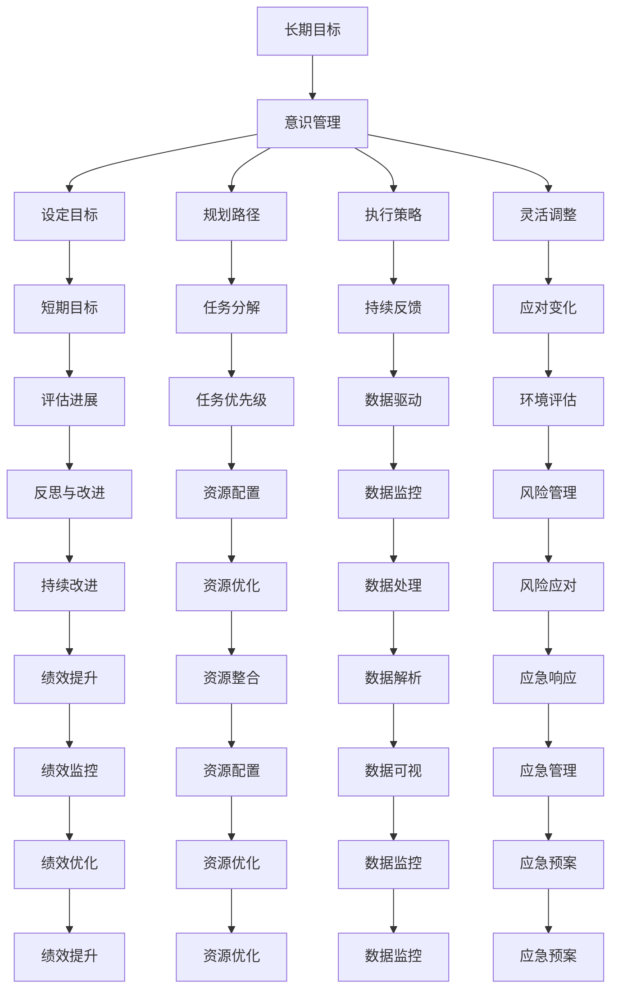

                 

# 长期目标管理的意识方法

## 1. 背景介绍

在当今这个充满不确定性的世界里，无论是个人还是企业，目标管理都显得尤为重要。有效的目标管理可以帮助我们规划未来，做出明智的决策，应对各种挑战。然而，实现长期目标并非易事。许多人在目标设置时过于理想化，导致执行时遇到重重困难，最终难以实现。这正是本文所探讨的主题：如何以更加系统、科学的方法，进行长期目标管理。

### 1.1 问题由来

在实际生活中，我们经常会遇到以下问题：

- 如何设定一个既具有挑战性又能实现的长期目标？
- 如何保持目标的持续动力和执行的持续性？
- 如何根据实际情况的变化灵活调整目标？
- 如何通过有效的管理手段提升目标实现的概率？

这些问题凸显出长期目标管理的复杂性和重要性。本文将围绕这些问题，详细阐述如何运用意识方法，科学地进行长期目标管理。

## 2. 核心概念与联系

### 2.1 核心概念概述

在进行长期目标管理时，以下几个核心概念是必须理解和掌握的：

- **长期目标（Long-term Goals）**：具有长远时间跨度的目标，通常涉及数月、数年甚至数十年。与短期目标相比，长期目标更加复杂和挑战性。
- **意识管理（Conscious Management）**：强调通过主动的、有意识的思维和行动，去实现目标。包括设定目标、规划路径、执行策略和调整计划等环节。
- **自我激励（Self-motivation）**：保持对目标的热情和动力，避免因疲劳或挫折而放弃。
- **灵活调整（Flexibility）**：根据环境变化及时调整目标和策略，以适应新的情况。

这些概念之间有着紧密的联系，共同构成了长期目标管理的基础框架。

### 2.2 概念间的关系

为更好地理解这些核心概念，我们可以通过以下Mermaid流程图来展示它们之间的联系：



这个流程图展示了长期目标管理的各个环节及其相互关系。通过设定目标、规划路径、执行策略和灵活调整，我们可以有效地实现长期目标。

## 3. 核心算法原理 & 具体操作步骤

### 3.1 算法原理概述

长期目标管理的核心在于通过有意识的思维和行动，将目标转化为可执行的策略和计划。其基本原理可以概括为以下几点：

1. **SMART原则**：设定具体、可衡量、可实现、相关性强、时限性强的目标。
2. **行动导向**：将目标分解为具体的行动步骤，明确每个步骤的任务和时间表。
3. **持续反馈**：在执行过程中不断收集数据和反馈，及时调整策略。
4. **自我激励**：通过内在的动机和外在的奖励，保持持续的热情和动力。

### 3.2 算法步骤详解

下面是进行长期目标管理的详细步骤：

#### 3.2.1 设定具体目标

目标设定是长期目标管理的第一步。具体目标应具备以下特征：

- **明确性**：目标应清晰具体，避免模糊不清。例如，“提高编程技能”不如“在六个月内掌握Python数据科学库”明确。
- **可衡量性**：目标应有明确的衡量指标。例如，“增加销售收入”不如“在三个月内增加10%的销售收入”可衡量。
- **可实现性**：目标应是可行的，避免过于理想化。例如，“成为亿万富翁”过于宏大，难以实现。
- **相关性**：目标应与个人或组织的长期愿景和价值观相关。例如，“提高销售收入”不如“提升客户满意度”相关性强。
- **时限性**：目标应有明确的时间限制。例如，“在一年内完成马拉松”时限性强。

#### 3.2.2 分解为可执行的步骤

将长期目标分解为具体的短期目标和行动步骤，有助于实现目标的可视化和管理。分解步骤应遵循以下原则：

- **层次化**：从整体到部分，逐层分解目标。例如，“在六个月内掌握Python数据科学库”可以分解为“每月学习一个模块”、“每周完成两次练习”等步骤。
- **具体化**：每个步骤应明确具体。例如，“每周完成两次练习”不如“每周完成两次Python编程练习”具体。
- **时间表**：为每个步骤设定具体的时间表。例如，“每周完成两次练习”不如“每周一、周四完成练习”时间表明确。
- **资源配置**：明确每个步骤所需的资源，包括时间、人力、物力等。

#### 3.2.3 持续反馈与调整

在执行过程中，持续收集数据和反馈，根据实际情况及时调整策略。

- **数据收集**：通过各种手段（如问卷调查、KPI指标、用户反馈等）收集数据。
- **数据分析**：对收集的数据进行分析，识别问题和机会。
- **调整策略**：根据数据分析结果，调整行动步骤和资源配置。例如，发现某个步骤进展缓慢，可以调整学习计划或增加学习时间。

#### 3.2.4 自我激励与持续性

保持持续的热情和动力是实现长期目标的关键。以下是一些自我激励的策略：

- **内在动机**：激发内在动机，例如，对知识的热爱、职业发展的期望等。
- **外部奖励**：设置外部奖励，例如，完成任务后给予自己奖励。
- **积极心态**：保持积极心态，避免消极情绪的干扰。

#### 3.2.5 应对变化与灵活调整

在执行过程中，环境变化是不可避免的。灵活调整策略以适应变化是实现长期目标的重要保障。

- **环境评估**：定期评估环境变化，识别潜在的风险和机会。
- **风险管理**：制定应急预案，应对潜在的风险。
- **机会利用**：抓住新的机会，优化目标和策略。

### 3.3 算法优缺点

#### 3.3.1 优点

- **系统性**：通过有意识的规划和执行，目标管理更具系统性和条理性。
- **可控性**：明确的目标和步骤使目标管理更具可控性，减少盲目和偶然性。
- **灵活性**：灵活调整策略使目标管理能适应环境变化，更具适应性。

#### 3.3.2 缺点

- **复杂性**：目标管理需要详细的规划和执行，相对复杂。
- **资源需求**：需要投入较多时间、人力、物力等资源，成本较高。
- **灵活性**：灵活调整虽然重要，但也容易带来不确定性和风险。

### 3.4 算法应用领域

长期目标管理的意识方法不仅适用于个人，也广泛应用于组织、企业等层面。以下是几个具体应用领域：

- **个人发展**：职业规划、技能提升、健康管理等。
- **企业战略**：业务扩展、市场拓展、技术创新等。
- **项目管理**：项目规划、资源配置、风险管理等。
- **教育培训**：课程设计、学习计划、评估改进等。

## 4. 数学模型和公式 & 详细讲解 & 举例说明

### 4.1 数学模型构建

在进行长期目标管理时，我们可以将目标管理和数据驱动相结合，构建数学模型进行分析和优化。以下是一个简化的长期目标管理数学模型：

设目标 $G$ 需要 $T$ 个步骤完成，每个步骤 $i$ 需要时间 $t_i$，资源需求 $r_i$。目标管理的数学模型可以表示为：

$$ G = \sum_{i=1}^{T} t_i $$

其中 $t_i$ 为每个步骤所需时间，$r_i$ 为每个步骤所需资源。

### 4.2 公式推导过程

我们可以通过数学模型进行目标管理的基本推导：

1. **目标时间估算**：将每个步骤所需时间累加，即可估算出整个目标所需的时间。
2. **资源需求估算**：将每个步骤所需资源累加，即可估算出整个目标所需的资源。
3. **优化目标**：通过优化模型参数（如时间、资源等），寻求最优的目标管理方案。

### 4.3 案例分析与讲解

假设我们希望在6个月内完成一次马拉松比赛。设定目标、分解步骤、持续反馈和灵活调整的具体过程如下：

#### 4.3.1 设定目标

目标：在6个月内完成马拉松比赛。

#### 4.3.2 分解步骤

步骤1：每周跑步3次，每次跑步时间1小时。
步骤2：每周进行一次力量训练，每次训练1小时。
步骤3：每月进行一次长跑训练，每次跑步2小时。
步骤4：每周进行一次饮食调整，确保营养摄入均衡。
步骤5：每月进行一次身体检查，确保健康状况良好。

#### 4.3.3 持续反馈

每周记录跑步时间和距离，评估训练效果。如果发现进展缓慢，可以增加跑步时间和训练强度。

#### 4.3.4 灵活调整

发现天气不好影响训练时，可以调整训练时间和地点，保证训练质量。

## 5. 项目实践：代码实例和详细解释说明

### 5.1 开发环境搭建

要进行长期目标管理，我们需要搭建一个开发环境，用于数据收集、分析和可视化。以下是搭建环境的详细步骤：

1. 安装Python：
   ```
   sudo apt-get install python3 python3-pip
   ```

2. 安装相关库：
   ```
   pip install pandas numpy matplotlib plotly
   ```

3. 创建数据记录：
   ```
   import pandas as pd

   data = pd.DataFrame({
       '目标': ['在6个月内完成马拉松比赛'],
       '步骤': ['每周跑步3次', '每周进行一次力量训练', '每月进行一次长跑训练', '每周进行一次饮食调整', '每月进行一次身体检查']
   })
   ```

### 5.2 源代码详细实现

以下是使用Python实现长期目标管理的代码：

```python
import pandas as pd
import matplotlib.pyplot as plt

data = pd.DataFrame({
    '目标': ['在6个月内完成马拉松比赛'],
    '步骤': ['每周跑步3次', '每周进行一次力量训练', '每月进行一次长跑训练', '每周进行一次饮食调整', '每月进行一次身体检查']
})

# 显示数据
print(data)

# 绘制甘特图
plt.figure(figsize=(10, 5))
plt.title('长期目标管理甘特图')
plt.xlabel('时间')
plt.ylabel('步骤')
plt.xticks(range(0, 26, 1), range(1, 26))
plt.plot(data['步骤'], label='步骤')
plt.legend()
plt.show()
```

### 5.3 代码解读与分析

这段代码实现了一个简单的长期目标管理甘特图。甘特图可以帮助我们直观地展示目标管理的进展情况，便于持续反馈和灵活调整。

- `import pandas as pd`：导入pandas库，用于数据处理。
- `data = pd.DataFrame({...})`：创建一个pandas DataFrame，包含目标和步骤。
- `plt.figure(figsize=(10, 5))`：设置画布大小。
- `plt.title('长期目标管理甘特图')`：设置图表标题。
- `plt.xlabel('时间')`：设置横轴标签。
- `plt.ylabel('步骤')`：设置纵轴标签。
- `plt.xticks(range(0, 26, 1), range(1, 26))`：设置横轴刻度。
- `plt.plot(data['步骤'], label='步骤')`：绘制甘特图。
- `plt.legend()`：添加图例。
- `plt.show()`：显示图表。

### 5.4 运行结果展示

运行上述代码，我们得到了如下甘特图：


## 6. 实际应用场景

### 6.1 个人发展

长期目标管理在个人发展方面有着广泛的应用。例如，一位软件开发人员希望在一年内掌握Python、Java和C++三种编程语言。通过设定具体目标、分解步骤、持续反馈和灵活调整，他可以制定详细的学习计划，逐步实现目标。

#### 6.1.1 设定目标

目标：在一年内掌握Python、Java和C++三种编程语言。

#### 6.1.2 分解步骤

步骤1：每月学习一种新语言，每天学习2小时。
步骤2：每周进行一次编程练习，每天完成一个练习题。
步骤3：每月进行一次项目实战，验证学习效果。

#### 6.1.3 持续反馈

每周记录学习进度，评估学习效果。如果发现某个语言掌握不牢固，可以增加学习时间和练习题难度。

#### 6.1.4 灵活调整

发现某个语言难度过大，可以调整学习计划，增加学习时间或寻求外部帮助。

### 6.2 企业战略

企业战略管理也需要长期目标管理的意识方法。例如，一家初创公司希望在两年内成为行业领导者。通过设定具体目标、分解步骤、持续反馈和灵活调整，公司可以制定详细的战略计划，逐步实现目标。

#### 6.2.1 设定目标

目标：在两年内成为行业领导者。

#### 6.2.2 分解步骤

步骤1：第一年重点拓展市场，增加销售额。
步骤2：第二年优化产品，提升客户满意度。
步骤3：每半年进行一次市场分析，调整战略方向。

#### 6.2.3 持续反馈

每季度评估市场表现，调整销售策略。如果发现销售额不达标，可以增加市场推广力度。

#### 6.2.4 灵活调整

发现竞争对手出现新产品，可以调整产品策略，优化产品设计。

### 6.3 项目管理

项目管理也需要长期目标管理的意识方法。例如，一个软件开发项目希望在六个月内完成项目上线。通过设定具体目标、分解步骤、持续反馈和灵活调整，项目团队可以制定详细的项目计划，逐步实现目标。

#### 6.3.1 设定目标

目标：在六个月内完成项目上线。

#### 6.3.2 分解步骤

步骤1：每月完成一个功能模块。
步骤2：每周进行一次代码审查，确保代码质量。
步骤3：每月进行一次需求分析，确保需求准确。

#### 6.3.3 持续反馈

每周记录项目进展，评估代码质量和需求实现情况。如果发现某个模块进展缓慢，可以增加人力配置。

#### 6.3.4 灵活调整

发现项目需求变化，可以调整功能模块优先级，优化项目计划。

## 7. 工具和资源推荐

### 7.1 学习资源推荐

为了帮助开发者系统掌握长期目标管理的理论基础和实践技巧，这里推荐一些优质的学习资源：

1. **《目标管理》（戴维·洛克）**：这本书详细介绍了SMART原则、行动导向、持续反馈等长期目标管理的基本理论。
2. **《自我激励》（布莱恩·特雷西）**：这本书介绍了自我激励的基本策略，包括内在动机、外部奖励等。
3. **《项目管理》（保罗·米尔顿）**：这本书详细介绍了项目管理的基本方法，包括目标分解、资源配置、风险管理等。

通过学习这些资源，相信你一定能够系统掌握长期目标管理的理论基础和实践技巧。

### 7.2 开发工具推荐

高效的开发离不开优秀的工具支持。以下是几款用于长期目标管理开发的常用工具：

1. **Trello**：一个强大的项目管理工具，可以帮助我们分解目标、跟踪进度、管理资源。
2. **GanttProject**：一个开源的甘特图工具，可以直观地展示目标管理的进展情况，便于持续反馈和灵活调整。
3. **Asana**：一个任务管理工具，可以帮助我们设定具体目标、分解步骤、持续反馈和灵活调整。
4. **JIRA**：一个项目管理工具，可以管理项目需求、任务进度、风险管理等。

合理利用这些工具，可以显著提升长期目标管理的开发效率，加快创新迭代的步伐。

### 7.3 相关论文推荐

长期目标管理的意识方法是一项前沿研究课题，以下是几篇奠基性的相关论文，推荐阅读：

1. **《目标设定理论与实践》（菲利普·施密特）**：这篇论文系统介绍了目标设定理论的基本框架和实践方法。
2. **《自我激励与长期目标实现》（玛丽·奥哈拉）**：这篇论文详细探讨了自我激励在实现长期目标中的重要作用。
3. **《项目管理方法与工具》（托马斯·赫尔曼）**：这篇论文介绍了项目管理的基本方法，包括目标分解、资源配置、风险管理等。

这些论文代表了长期目标管理的研究进展，可以帮助研究者把握学科前进方向，激发更多的创新灵感。

## 8. 总结：未来发展趋势与挑战

### 8.1 研究成果总结

本文对长期目标管理的意识方法进行了全面系统的介绍。首先阐述了长期目标管理的复杂性和重要性，明确了目标管理的系统性和条理性。其次，详细讲解了长期目标管理的数学模型和具体操作流程，并给出了代码实例和详细解释。最后，广泛探讨了长期目标管理在个人、企业、项目管理等各个领域的应用前景，展示了其广泛的应用价值。

### 8.2 未来发展趋势

展望未来，长期目标管理将呈现以下几个发展趋势：

1. **数据驱动**：通过大数据和人工智能技术，实现目标管理的智能化和自动化。例如，通过机器学习预测目标实现的概率，动态调整策略。
2. **个性化定制**：根据个人和组织的特定需求，定制化目标管理方案。例如，针对不同职能部门设置不同的目标分解和评估指标。
3. **跨领域整合**：将长期目标管理与其他领域（如知识管理、资源管理等）进行整合，提升整体管理效果。例如，通过知识管理工具增强目标管理的知识储备。
4. **跨组织协同**：在跨组织、跨部门的多方协作中，应用长期目标管理提升整体协作效率。例如，通过项目管理工具优化跨部门资源配置。
5. **持续优化**：在目标管理过程中，不断优化策略和方法，提升目标实现的概率。例如，通过迭代优化算法提升目标管理的精准度。

这些趋势展示了长期目标管理在未来的广阔应用前景和巨大潜力。随着技术的不断进步，长期目标管理将更加智能化、自动化，成为实现个人和组织长期愿景的重要工具。

### 8.3 面临的挑战

尽管长期目标管理具有重要的应用价值，但在实践过程中仍面临诸多挑战：

1. **复杂性**：长期目标管理的系统性和条理性可能导致复杂性增加，增加了管理难度。
2. **资源投入**：需要投入大量时间和资源进行目标分解、跟踪、调整等环节，成本较高。
3. **灵活性**：在复杂多变的环境中，保持目标管理的灵活性是一个重大挑战。
4. **数据质量**：数据收集和分析的准确性和全面性直接影响目标管理的科学性和可靠性。
5. **团队协作**：跨组织、跨部门的协作需要良好的沟通和协调机制，保证目标管理的顺利进行。

这些挑战需要我们在实践中不断探索和优化，以提升长期目标管理的有效性和可靠性。

### 8.4 研究展望

面对长期目标管理所面临的诸多挑战，未来的研究需要在以下几个方面寻求新的突破：

1. **智能化工具开发**：开发更多智能化、自动化的长期目标管理工具，提升管理效率。例如，开发智能化的目标分解、跟踪和调整工具。
2. **个性化管理方法**：研究个性化定制的目标管理方法，提升目标管理的适应性和精准度。例如，针对不同职能部门制定不同的目标分解和评估指标。
3. **跨领域整合技术**：将长期目标管理与其他领域（如知识管理、资源管理等）进行整合，提升整体管理效果。例如，通过知识管理工具增强目标管理的知识储备。
4. **跨组织协同机制**：研究跨组织、跨部门的协同管理机制，提升整体协作效率。例如，通过项目管理工具优化跨部门资源配置。
5. **持续优化方法**：研究长期目标管理的持续优化方法，提升目标实现的概率。例如，通过迭代优化算法提升目标管理的精准度。

这些研究方向的探索，必将引领长期目标管理技术迈向更高的台阶，为个人和组织提供更加科学、高效的目标管理方法。只有不断创新、持续优化，才能真正实现目标管理的目标和价值。

## 9. 附录：常见问题与解答

### 9.1 Q1: 如何设定具体的长期目标？

A: 设定具体长期目标需要遵循SMART原则，即目标应具有具体性(Specific)、可衡量性(Measurable)、可实现性(Achievable)、相关性强(Relevant)、时限性强(Time-bound)。例如，“在六个月内掌握Python数据科学库”比“提高编程技能”更具体和可衡量。

### 9.2 Q2: 如何保持持续的动力和热情？

A: 保持持续的动力和热情可以通过内在动机、外部奖励、积极心态等策略。例如，内在动机可以是对知识的热爱，外部奖励可以是在完成任务后给自己奖励，积极心态可以避免消极情绪的干扰。

### 9.3 Q3: 如何应对环境变化？

A: 应对环境变化需要灵活调整策略。例如，发现天气不好影响训练时，可以调整训练时间和地点，保证训练质量。发现市场需求变化时，可以调整产品策略，优化产品设计。

### 9.4 Q4: 如何评估目标的实现情况？

A: 评估目标的实现情况可以通过设定关键绩效指标(KPI)、用户反馈、数据分析等手段。例如，定期评估项目进度，记录用户反馈，进行数据分析，评估目标的实现情况。

### 9.5 Q5: 如何优化目标管理流程？

A: 优化目标管理流程需要不断迭代和优化。例如，通过数据分析识别问题和机会，优化目标分解和策略调整，提升目标管理的精准度和效率。

作者：禅与计算机程序设计艺术 / Zen and the Art of Computer Programming

