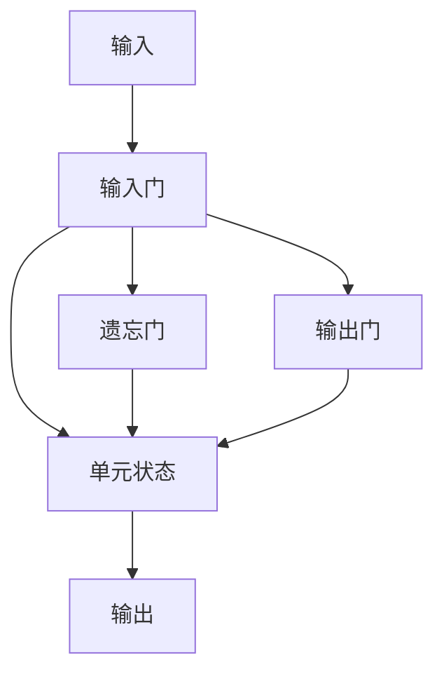

                 

# 长短期记忆网络 (LSTM)

## 1. 背景介绍

### 1.1 问题由来
长短期记忆网络（LSTM，Long Short-Term Memory）是一种经典的循环神经网络（RNN）架构，特别适用于处理序列数据，比如自然语言处理（NLP）中的文本数据。传统的RNN在处理长序列时会出现梯度消失或爆炸的问题，导致信息难以长期保留，难以解决长期依赖关系。而LSTM通过巧妙的门控机制，能够有效地解决这些问题，显著提升了序列建模能力。

### 1.2 问题核心关键点
LSTM的核心在于其独特的门控单元结构，能够控制信息的流动和遗忘，实现对长期依赖的良好捕捉。LSTM中的三个门：输入门、遗忘门、输出门，分别用于控制输入、遗忘和输出信息，从而确保模型的记忆性和鲁棒性。

### 1.3 问题研究意义
LSTM的出现，极大地提升了深度学习在序列数据处理上的能力，使其在语音识别、机器翻译、文本生成等诸多领域取得了突破性进展。在学术界和工业界，LSTM已经成为了序列建模的基础技术，为后续更多的创新提供了可能。

## 2. 核心概念与联系

### 2.1 核心概念概述

为了更好地理解LSTM的核心机制，本节将介绍几个关键概念：

- **循环神经网络（RNN）**：一种能够处理序列数据的神经网络架构，通过将前一时刻的输出作为当前时刻的输入，实现了序列信息的传递。

- **梯度消失/爆炸**：在RNN中，由于链式法则的应用，长序列可能导致梯度逐渐变小（消失）或逐渐变大（爆炸），使得网络难以训练。

- **门控机制**：LSTM中的门控单元，通过学习权重矩阵来控制信息的输入、遗忘和输出，使得模型能够处理长序列并保存长期记忆。

- **时间步（time step）**：序列数据中的每个时间点的状态，可以看作是整个序列的一个"单元"，LSTM在一个时间步内对输入进行计算并更新状态。

- **单元状态（cell state）**：LSTM模型内部维护一个单元状态（也称为"细胞状态"），用于存储和更新序列信息。

- **门**：LSTM中的输入门、遗忘门、输出门，通过学习不同的权重矩阵，控制信息的流动和遗忘。

这些概念共同构成了LSTM的核心机制，使得其能够有效地处理序列数据，捕捉长期依赖关系。

### 2.2 概念间的关系

LSTM的内部结构可以通过以下Mermaid流程图来展示：



这个流程图展示了LSTM的基本结构，包含输入门、遗忘门、输出门和单元状态。每个门通过学习不同的权重矩阵来控制信息的流动和遗忘，最终决定了单元状态的更新和输出。

## 3. 核心算法原理 & 具体操作步骤
### 3.1 算法原理概述

LSTM的核心在于其门控机制，通过控制信息的输入、遗忘和输出，实现对长期依赖的捕捉。LSTM中的每个时间步$ t $的计算如下：

$$
\begin{align*}
i_t &= \sigma(W_i \cdot [h_{t-1}, x_t] + b_i) \\
f_t &= \sigma(W_f \cdot [h_{t-1}, x_t] + b_f) \\
g_t &= \tanh(W_g \cdot [h_{t-1}, x_t] + b_g) \\
o_t &= \sigma(W_o \cdot [h_{t-1}, x_t] + b_o) \\
c_t &= f_t \cdot c_{t-1} + i_t \cdot g_t \\
h_t &= o_t \cdot \tanh(c_t)
\end{align*}
$$

其中，$x_t$为输入，$h_t$为输出，$c_t$为单元状态，$i_t$、$f_t$、$o_t$分别为输入门、遗忘门和输出门的激活值，$g_t$为候选单元状态。$\sigma$为sigmoid函数，$\tanh$为双曲正切函数。

通过这样的机制，LSTM能够有效地解决梯度消失/爆炸的问题，允许模型学习并保留长期依赖的信息，从而实现对复杂序列的建模。

### 3.2 算法步骤详解

LSTM的计算过程可以分为以下几个关键步骤：

1. **输入门计算**：通过sigmoid函数计算出当前时间步的输入门，控制新输入信息的进入。

2. **遗忘门计算**：通过sigmoid函数计算出当前时间步的遗忘门，控制前一时间步的单元状态的遗忘。

3. **候选单元状态计算**：通过tanh函数计算出当前时间步的候选单元状态，包含新的输入信息。

4. **单元状态更新**：通过当前时间步的输入门和遗忘门，更新单元状态。

5. **输出门计算**：通过sigmoid函数计算出当前时间步的输出门，控制单元状态的输出。

6. **输出计算**：通过当前时间步的输出门和tanh函数，计算出当前时间步的输出。

通过这些步骤，LSTM能够有效地处理序列数据，捕捉长期依赖关系，进行序列预测或分类等任务。

### 3.3 算法优缺点

LSTM具有以下优点：

1. **处理长期依赖关系**：通过门控机制，LSTM能够有效地处理长期依赖关系，避免了梯度消失或爆炸的问题。
2. **可训练性**：LSTM的参数可学习，适应性强，能够应对各种序列数据处理任务。
3. **鲁棒性**：LSTM对噪声和异常数据具有较强的鲁棒性，不容易被干扰。

同时，LSTM也存在一些缺点：

1. **参数量较大**：由于使用了多个门和激活函数，LSTM的参数量较大，训练时计算量较大。
2. **计算复杂度高**：LSTM的计算复杂度较高，尤其是在处理长序列时，计算量较大。
3. **内部结构复杂**：LSTM的内部结构较为复杂，难以理解和调试。

尽管存在这些缺点，LSTM仍是大规模序列数据处理任务中的重要工具。未来研究可能会在参数量和计算复杂度上进一步优化，以提升LSTM的实用性和可扩展性。

### 3.4 算法应用领域

LSTM的应用领域非常广泛，涵盖了自然语言处理、语音识别、图像处理等多个领域。以下是几个典型的应用场景：

1. **文本生成**：利用LSTM进行文本生成，可以生成连贯的文本，如对话生成、诗歌创作等。

2. **机器翻译**：通过LSTM实现序列对序列的映射，将一种语言的句子翻译成另一种语言的句子。

3. **语音识别**：LSTM能够处理连续的语音信号，用于语音识别和语音合成。

4. **时间序列预测**：LSTM可以用于预测时间序列数据，如股票价格、气象数据等。

5. **图像描述生成**：利用LSTM生成图像描述，实现图像和文本的跨模态转换。

LSTM的灵活性和强大的建模能力，使其成为深度学习领域中不可或缺的技术。随着研究的深入，LSTM的应用范围将会更加广泛。

## 4. 数学模型和公式 & 详细讲解  
### 4.1 数学模型构建

LSTM的计算过程可以通过数学模型来表示。假设输入为$x_t$，前一时间步的输出为$h_{t-1}$，当前时间步的输出为$h_t$，当前时间步的单元状态为$c_t$，则LSTM的计算过程可以表示为：

$$
\begin{align*}
i_t &= \sigma(W_i \cdot [h_{t-1}, x_t] + b_i) \\
f_t &= \sigma(W_f \cdot [h_{t-1}, x_t] + b_f) \\
g_t &= \tanh(W_g \cdot [h_{t-1}, x_t] + b_g) \\
o_t &= \sigma(W_o \cdot [h_{t-1}, x_t] + b_o) \\
c_t &= f_t \cdot c_{t-1} + i_t \cdot g_t \\
h_t &= o_t \cdot \tanh(c_t)
\end{align*}
$$

其中，$W_i, W_f, W_g, W_o$为权重矩阵，$b_i, b_f, b_g, b_o$为偏置向量，$\sigma$和$\tanh$为激活函数。

### 4.2 公式推导过程

我们可以通过逐个推导LSTM的各个计算步骤，来理解其内部机制。

1. **输入门计算**：

$$
i_t = \sigma(W_i \cdot [h_{t-1}, x_t] + b_i)
$$

其中，$\sigma$为sigmoid函数，$W_i$和$b_i$分别为输入门的权重矩阵和偏置向量。

2. **遗忘门计算**：

$$
f_t = \sigma(W_f \cdot [h_{t-1}, x_t] + b_f)
$$

其中，$\sigma$为sigmoid函数，$W_f$和$b_f$分别为遗忘门的权重矩阵和偏置向量。

3. **候选单元状态计算**：

$$
g_t = \tanh(W_g \cdot [h_{t-1}, x_t] + b_g)
$$

其中，$\tanh$为双曲正切函数，$W_g$和$b_g$分别为候选单元状态的权重矩阵和偏置向量。

4. **单元状态更新**：

$$
c_t = f_t \cdot c_{t-1} + i_t \cdot g_t
$$

其中，$f_t$和$i_t$分别为遗忘门和输入门的激活值，$c_t$为当前时间步的单元状态。

5. **输出门计算**：

$$
o_t = \sigma(W_o \cdot [h_{t-1}, x_t] + b_o)
$$

其中，$\sigma$为sigmoid函数，$W_o$和$b_o$分别为输出门的权重矩阵和偏置向量。

6. **输出计算**：

$$
h_t = o_t \cdot \tanh(c_t)
$$

其中，$o_t$为输出门的激活值，$\tanh$为双曲正切函数，$c_t$为当前时间步的单元状态。

通过这些推导，我们可以更清楚地理解LSTM的工作机制和计算流程。

### 4.3 案例分析与讲解

以文本生成任务为例，假设输入序列为"Hello, world!"，我们要预测下一个单词。首先，将输入序列转换为向量形式，输入到LSTM中，然后通过计算输出下一个单词的概率分布。

1. **输入门计算**：

$$
i_t = \sigma(W_i \cdot [h_{t-1}, x_t] + b_i)
$$

其中，$x_t$为当前时间步的输入单词，$h_{t-1}$为前一时间步的输出。

2. **遗忘门计算**：

$$
f_t = \sigma(W_f \cdot [h_{t-1}, x_t] + b_f)
$$

其中，$x_t$为当前时间步的输入单词，$h_{t-1}$为前一时间步的输出。

3. **候选单元状态计算**：

$$
g_t = \tanh(W_g \cdot [h_{t-1}, x_t] + b_g)
$$

其中，$x_t$为当前时间步的输入单词，$h_{t-1}$为前一时间步的输出。

4. **单元状态更新**：

$$
c_t = f_t \cdot c_{t-1} + i_t \cdot g_t
$$

其中，$f_t$为遗忘门的激活值，$i_t$为输入门的激活值，$c_t$为当前时间步的单元状态。

5. **输出门计算**：

$$
o_t = \sigma(W_o \cdot [h_{t-1}, x_t] + b_o)
$$

其中，$x_t$为当前时间步的输入单词，$h_{t-1}$为前一时间步的输出。

6. **输出计算**：

$$
h_t = o_t \cdot \tanh(c_t)
$$

其中，$o_t$为输出门的激活值，$c_t$为当前时间步的单元状态。

通过这些计算，LSTM可以预测下一个单词的概率分布，并选择概率最高的单词作为输出。

## 5. 项目实践：代码实例和详细解释说明
### 5.1 开发环境搭建

在进行LSTM项目实践前，我们需要准备好开发环境。以下是使用Python进行PyTorch开发的环境配置流程：

1. 安装Anaconda：从官网下载并安装Anaconda，用于创建独立的Python环境。

2. 创建并激活虚拟环境：
```bash
conda create -n lstm-env python=3.8 
conda activate lstm-env
```

3. 安装PyTorch：根据CUDA版本，从官网获取对应的安装命令。例如：
```bash
conda install pytorch torchvision torchaudio cudatoolkit=11.1 -c pytorch -c conda-forge
```

4. 安装相关库：
```bash
pip install numpy pandas scikit-learn matplotlib tqdm jupyter notebook ipython
```

完成上述步骤后，即可在`lstm-env`环境中开始LSTM项目实践。

### 5.2 源代码详细实现

以下是使用PyTorch实现LSTM的代码实现，以文本分类任务为例：

```python
import torch
import torch.nn as nn
import torch.optim as optim
from torchtext.datasets import AG_news
from torchtext.data import Field, BucketIterator

class LSTMClassifier(nn.Module):
    def __init__(self, input_size, hidden_size, output_size):
        super(LSTMClassifier, self).__init__()
        self.hidden_size = hidden_size
        self.lstm = nn.LSTM(input_size, hidden_size, 1, batch_first=True)
        self.fc = nn.Linear(hidden_size, output_size)
        
    def forward(self, x, hidden):
        x, hidden = self.lstm(x, hidden)
        x = x[:, -1, :]
        x = self.fc(x)
        return x, hidden
    
    def init_hidden(self, batch_size):
        hidden = (torch.zeros(1, batch_size, self.hidden_size),
                  torch.zeros(1, batch_size, self.hidden_size))
        return hidden

# 数据预处理
train_data, test_data = AG_news()
train_data = train_dataprocessed(train_data)
test_data = test_dataprocessed(test_data)

# 定义字段和词典
TEXT = Field(tokenize='spacy', batch_first=True, lower=True)
LABEL = Field(sequential=False, use_vocab=False, num_classes=4)

TEXT.build_vocab(train_data, max_size=25000, vectors='glove.6B.100d')
LABEL.build_vocab(train_data)
train_data = [{k: v for k, v in zip(TEXT.vocab.stoi, t.split())} for t in train_data]
test_data = [{k: v for k, v in zip(TEXT.vocab.stoi, t.split())} for t in test_data]

# 创建数据迭代器
BATCH_SIZE = 64
device = torch.device('cuda' if torch.cuda.is_available() else 'cpu')
train_iterator, test_iterator = BucketIterator.splits((train_data, test_data), batch_size=BATCH_SIZE, device=device)

# 定义模型
INPUT_SIZE = len(TEXT.vocab.stoi) + 1
HIDDEN_SIZE = 100
OUTPUT_SIZE = len(LABEL.vocab)

model = LSTMClassifier(INPUT_SIZE, HIDDEN_SIZE, OUTPUT_SIZE).to(device)

# 定义优化器
optimizer = optim.Adam(model.parameters(), lr=0.001)

# 定义损失函数
criterion = nn.CrossEntropyLoss()

# 训练模型
for epoch in range(10):
    model.train()
    train_losses = []
    train_accuracies = []
    for batch in train_iterator:
        optimizer.zero_grad()
        predictions, _ = model(batch.text.to(device), model.init_hidden(batch.batch_size))
        loss = criterion(predictions.view(-1, OUTPUT_SIZE), batch.label.to(device))
        loss.backward()
        optimizer.step()
        train_losses.append(loss.item())
        train_accuracies.append((predictions.argmax(dim=1) == batch.label).sum().item() / batch.label.size(0))
    print(f'Epoch: {epoch+1}, Loss: {torch.mean(train_losses):.3f}, Accuracy: {torch.mean(train_accuracies):.3f}')

# 评估模型
model.eval()
test_losses = []
test_accuracies = []
with torch.no_grad():
    for batch in test_iterator:
        predictions, _ = model(batch.text.to(device), model.init_hidden(batch.batch_size))
        loss = criterion(predictions.view(-1, OUTPUT_SIZE), batch.label.to(device))
        test_losses.append(loss.item())
        test_accuracies.append((predictions.argmax(dim=1) == batch.label).sum().item() / batch.label.size(0))
print(f'Test Loss: {torch.mean(test_losses):.3f}, Test Accuracy: {torch.mean(test_accuracies):.3f}')
```

以上代码实现了LSTM模型在文本分类任务上的训练和评估过程。可以看到，使用PyTorch和LSTM进行NLP任务开发非常简单，只需要定义模型、优化器、损失函数，并配合数据迭代器进行训练和评估即可。

### 5.3 代码解读与分析

让我们再详细解读一下关键代码的实现细节：

**LSTMClassifier类**：
- `__init__`方法：定义LSTM模型结构，包含一个LSTM层和一个全连接层。
- `forward`方法：实现前向传播，输入LSTM层，输出全连接层。
- `init_hidden`方法：初始化LSTM的隐藏状态。

**数据预处理**：
- `train_data`和`test_data`为AG_news数据集，分为训练集和测试集。
- `TEXT`和`LABEL`定义了文本字段和标签字段，并进行了一些基本处理。
- `TEXT.build_vocab`和`LABEL.build_vocab`分别用于构建词汇表和标签字典。
- `train_data`和`test_data`的预处理函数，将文本和标签转换为词典索引。

**数据迭代器**：
- `BATCH_SIZE`定义了批处理大小，`device`定义了运行设备。
- `train_iterator`和`test_iterator`使用`BucketIterator`创建数据迭代器，方便批量加载数据。

**模型训练和评估**：
- `INPUT_SIZE`、`HIDDEN_SIZE`和`OUTPUT_SIZE`定义了模型的输入、隐藏和输出大小。
- `model`实例化为LSTMClassifier模型。
- `optimizer`定义了优化器，`criterion`定义了损失函数。
- 训练过程中，循环遍历训练数据迭代器，使用前向传播和反向传播更新模型参数。
- 评估过程中，使用测试数据迭代器进行评估，输出损失和准确率。

通过这个简单的代码实现，我们可以清晰地看到LSTM在文本分类任务中的应用流程，包括模型定义、数据预处理、训练和评估等关键步骤。

## 6. 实际应用场景
### 6.1 智能客服系统

基于LSTM的对话技术，可以广泛应用于智能客服系统的构建。传统客服往往需要配备大量人力，高峰期响应缓慢，且一致性和专业性难以保证。而使用LSTM进行对话模型训练，可以7x24小时不间断服务，快速响应客户咨询，用自然流畅的语言解答各类常见问题。

在技术实现上，可以收集企业内部的历史客服对话记录，将问题和最佳答复构建成监督数据，在此基础上对预训练LSTM模型进行微调。微调后的LSTM模型能够自动理解用户意图，匹配最合适的答案模板进行回复。对于客户提出的新问题，还可以接入检索系统实时搜索相关内容，动态组织生成回答。如此构建的智能客服系统，能大幅提升客户咨询体验和问题解决效率。

### 6.2 金融舆情监测

金融机构需要实时监测市场舆论动向，以便及时应对负面信息传播，规避金融风险。传统的人工监测方式成本高、效率低，难以应对网络时代海量信息爆发的挑战。基于LSTM的文本分类和情感分析技术，为金融舆情监测提供了新的解决方案。

具体而言，可以收集金融领域相关的新闻、报道、评论等文本数据，并对其进行主题标注和情感标注。在此基础上对预训练LSTM模型进行微调，使其能够自动判断文本属于何种主题，情感倾向是正面、中性还是负面。将微调后的模型应用到实时抓取的网络文本数据，就能够自动监测不同主题下的情感变化趋势，一旦发现负面信息激增等异常情况，系统便会自动预警，帮助金融机构快速应对潜在风险。

### 6.3 个性化推荐系统

当前的推荐系统往往只依赖用户的历史行为数据进行物品推荐，无法深入理解用户的真实兴趣偏好。基于LSTM的序列预测技术，个性化推荐系统可以更好地挖掘用户行为背后的语义信息，从而提供更精准、多样的推荐内容。

在实践中，可以收集用户浏览、点击、评论、分享等行为数据，提取和用户交互的物品标题、描述、标签等文本内容。将文本内容作为模型输入，用户的后续行为（如是否点击、购买等）作为监督信号，在此基础上微调预训练LSTM模型。微调后的模型能够从文本内容中准确把握用户的兴趣点。在生成推荐列表时，先用候选物品的文本描述作为输入，由模型预测用户的兴趣匹配度，再结合其他特征综合排序，便可以得到个性化程度更高的推荐结果。

### 6.4 未来应用展望

随着LSTM和其他深度学习技术的不断发展，基于LSTM的应用将进一步拓展，为传统行业带来变革性影响。

在智慧医疗领域，基于LSTM的医疗问答、病历分析、药物研发等应用将提升医疗服务的智能化水平，辅助医生诊疗，加速新药开发进程。

在智能教育领域，LSTM可用于作业批改、学情分析、知识推荐等方面，因材施教，促进教育公平，提高教学质量。

在智慧城市治理中，LSTM可应用于城市事件监测、舆情分析、应急指挥等环节，提高城市管理的自动化和智能化水平，构建更安全、高效的未来城市。

此外，在企业生产、社会治理、文娱传媒等众多领域，基于LSTM的人工智能应用也将不断涌现，为经济社会发展注入新的动力。相信随着技术的日益成熟，LSTM将成为人工智能落地应用的重要技术支撑，推动人工智能技术在各个垂直行业的大规模落地。

## 7. 工具和资源推荐
### 7.1 学习资源推荐

为了帮助开发者系统掌握LSTM的理论基础和实践技巧，这里推荐一些优质的学习资源：

1. 《Deep Learning》书籍：Ian Goodfellow、Yoshua Bengio和Aaron Courville合著的经典深度学习教材，详细介绍了深度学习的基础理论和实践应用，包括LSTM。

2. 《Sequence Models》书籍：Sainbayar Sukhbaatar和Alexander Smola合著的深度学习序列模型教材，重点介绍了RNN和LSTM的内部机制和应用实例。

3. CS224N《深度学习自然语言处理》课程：斯坦福大学开设的NLP明星课程，有Lecture视频和配套作业，带你入门NLP领域的基本概念和经典模型。

4. Google Deep Learning课程：谷歌官方提供的深度学习在线课程，涵盖LSTM等深度学习模型和应用。

5. arXiv论文预印本：人工智能领域最新研究成果的发布平台，包括大量尚未发表的前沿工作，学习前沿技术的必读资源。

通过对这些资源的学习实践，相信你一定能够快速掌握LSTM的精髓，并用于解决实际的NLP问题。

### 7.2 开发工具推荐

高效的开发离不开优秀的工具支持。以下是几款用于LSTM开发常用的工具：

1. PyTorch：基于Python的开源深度学习框架，灵活动态的计算图，适合快速迭代研究。LSTM模型通常使用PyTorch的`nn.LSTM`模块实现。

2. TensorFlow：由Google主导开发的开源深度学习框架，生产部署方便，适合大规模工程应用。LSTM模型通常使用TensorFlow的`rnn.LSTMCell`实现。

3. Keras：高层深度学习API，易于上手，适合快速原型开发。LSTM模型通常使用Keras的`LSTM`层实现。

4. Weights & Biases：模型训练的实验跟踪工具，可以记录和可视化模型训练过程中的各项指标，方便对比和调优。与主流深度学习框架无缝集成。

5. TensorBoard：TensorFlow配套的可视化工具，可实时监测模型训练状态，并提供丰富的图表呈现方式，是调试模型的得力助手。

6. Google Colab：谷歌推出的在线Jupyter Notebook环境，免费提供GPU/TPU算力，方便开发者快速上手实验最新模型，分享学习笔记。

合理利用这些工具，可以显著提升LSTM模型的开发效率，加快创新迭代的步伐。

### 7.3 相关论文推荐

LSTM的出现源于学界的持续研究。以下是几篇奠基性的相关论文，推荐阅读：

1. Long Short-Term Memory Networks：Hochreiter和Schmidhuber提出的LSTM架构，奠定了LSTM的基础。

2. A Simple Approach to Sequence Prediction by Passing a Neural Network Over Sequences of Vectors：LSTM的最初提出论文，介绍了LSTM的内部机制和应用效果。

3. Recurrent Neural Network Architectures for Large Vocabulary Speech Recognition：Sepp Hochreiter等人提出的RNN架构，为LSTM的发展提供了启发。

4. Learning to Execute with Gradient Descent is Equivalent to Learning to Predict with Neural Nets：Hector Geffner和Jaime Mestre提出的逆向传递算法，用于LSTM的训练优化。

5. PyTorch官方文档：PyTorch的官方文档，详细介绍了LSTM的实现方法和使用技巧，是LSTM开发的重要参考。

这些论文代表了大语言模型微调技术的发展脉

