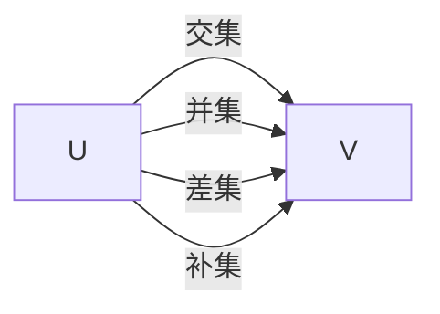
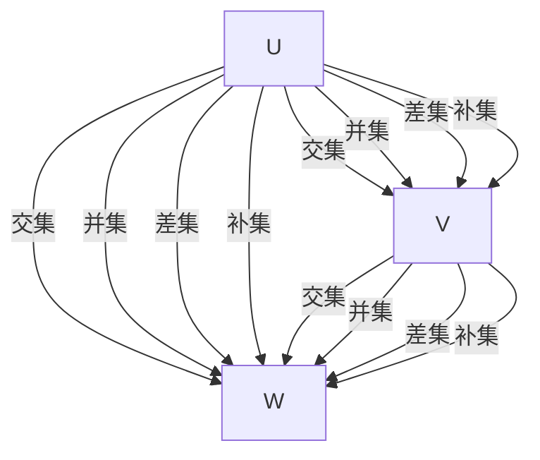

                 

# 集合论导引：∑12集合

> 关键词：集合论,∑12集合,张量代数,向量空间,线性变换,同态代数

## 1. 背景介绍

### 1.1 问题由来
集合论作为现代数学的基础分支之一，以其简洁、抽象和广泛应用的特点，在数学、物理学、计算机科学等领域中得到了广泛的应用。特别是在计算科学中，集合理论提供了一种强大的工具，用于描述、分析和优化算法。然而，对于初学者而言，集合论概念的抽象和符号的繁多，常常让人望而却步。

本博客将从最基础的概念入手，逐步引出∑12集合的原理，并通过实际案例帮助读者深入理解其在集合论中的应用。通过本博客的学习，读者将能够掌握∑12集合的构建、运算和应用方法，为进一步研究张量代数、向量空间等高级数学概念打下坚实的基础。

### 1.2 问题核心关键点
∑12集合是集合论中的一个重要概念，它描述了在向量空间中，子空间之间的运算和关系。具体而言，∑12集合是指由两个子空间的交集、并集、补集和差集构成的四个集合。这个概念的引入，能够帮助读者更好地理解向量空间的结构，以及如何通过子空间的组合来表达复杂的数据结构。

∑12集合的应用领域包括但不限于：
- 线性代数中的向量空间和矩阵运算
- 计算机科学中的数据压缩和编码
- 物理学中的场论和量子力学

## 2. 核心概念与联系

### 2.1 核心概念概述

在引入∑12集合之前，我们需要先了解一些基础概念：

- **向量空间**：由一组向量组成的集合，同时满足加法和数乘的封闭性，以及线性组合的封闭性。例如，所有n维实向量构成的集合，构成了一个n维实向量空间。
- **子空间**：指一个向量空间的子集，该子集中的所有向量通过加法和数乘仍然在该子空间内。例如，一个向量空间中的所有n维零向量构成的集合，是一个n维的零子空间。

∑12集合指的是，对于两个向量空间$U$和$V$，它们的交集$U \cap V$、并集$U \cup V$、补集$U^c$和差集$U - V$构成的四个集合，其中$U^c$表示$U$在全空间中的补集。这些集合之间的关系可以用以下图示表示：

### 2.2 概念间的关系

通过上述图示，我们可以看出，∑12集合的四个元素之间存在一定的依赖关系：

- **交集和差集**：交集$U \cap V$是两个向量空间的共同元素，而差集$U - V$则是属于$U$但不属于$V$的元素。
- **并集和补集**：并集$U \cup V$包含两个向量空间的全部元素，而补集$U^c$则是全空间中不属于$U$的元素。

这些集合之间的关系可以用集合运算的性质来表示，例如：

- 并集和交集的交换律：$U \cap V = V \cap U$，$U \cup V = V \cup U$
- 交集的结合律：$U \cap (V \cap W) = (U \cap V) \cap W$
- 差集的结合律：$U - (V - W) = (U \cap W) - V$

这些关系构成了∑12集合的基础，对于理解向量空间的结构和运算非常重要。

### 2.3 核心概念的整体架构

∑12集合在向量空间中起到了连接和描述的作用，它们之间相互作用，形成了一个完整的体系。下面我们用一个综合的流程图来展示∑12集合在向量空间中的整体架构：

在这个架构中，我们可以看到，交集和差集形成了两个向量空间之间的连接，而并集和补集则描述了全空间中各个部分的划分。通过这些集合的组合，我们可以构建更加复杂的数据结构，描述更广泛的问题和应用场景。

## 3. 核心算法原理 & 具体操作步骤

### 3.1 算法原理概述

∑12集合的构建和运算，基于向量空间的线性组合性质。在向量空间中，任何向量都可以表示为基向量的线性组合。通过这种线性组合，我们可以描述和表达向量空间中任意子空间的关系。

具体而言，假设$U$和$V$是两个向量空间，它们的交集、并集、补集和差集分别记为$U \cap V$、$U \cup V$、$U^c$和$U - V$。则这四个集合之间的关系可以用下面的公式表示：

$$
\begin{aligned}
    U \cap V &= \{v \in U \mid v \in V\} \\
    U \cup V &= \{v \in U \mid v \in V \text{ or } v \in U^c\} \\
    U^c &= \{v \in \mathbb{V} \mid v \notin U\} \\
    U - V &= \{v \in U \mid v \notin V\}
\end{aligned}
$$

其中，$\mathbb{V}$表示全空间。

### 3.2 算法步骤详解

∑12集合的构建和运算，可以通过以下几个步骤来实现：

1. **定义向量空间**：首先定义两个向量空间$U$和$V$，以及它们的基向量集。

2. **计算交集和差集**：通过逻辑运算或矩阵运算，计算$U \cap V$和$U - V$。

3. **计算并集和补集**：通过逻辑运算或矩阵运算，计算$U \cup V$和$U^c$。

4. **验证运算结果**：通过逻辑运算或矩阵运算，验证上述运算结果的正确性。

### 3.3 算法优缺点

∑12集合的构建和运算，具有以下优点和缺点：

**优点**：
- 简洁明了，易于理解和应用。
- 适用于任何向量空间，具有广泛的适用性。

**缺点**：
- 计算量较大，特别是在高维向量空间中。
- 对于非线性的向量空间，交集和差集等运算可能不适用。

### 3.4 算法应用领域

∑12集合在许多领域中都有广泛的应用，例如：

- 数据压缩和编码：通过交集、并集和补集，可以对数据进行压缩和编码，提高数据传输和存储的效率。
- 线性代数中的矩阵运算：矩阵的交集、并集和差集，可以用来描述矩阵的分解和组合。
- 计算机科学中的图论：通过交集、并集和补集，可以描述图论中的子图、连通块等概念。

## 4. 数学模型和公式 & 详细讲解 & 举例说明

### 4.1 数学模型构建

∑12集合的数学模型，基于向量空间的线性组合性质。对于任意两个向量空间$U$和$V$，它们的交集、并集、补集和差集，可以表示为以下形式：

$$
\begin{aligned}
    U \cap V &= \{v \in U \mid v \in V\} \\
    U \cup V &= \{v \in U \mid v \in V \text{ or } v \in U^c\} \\
    U^c &= \{v \in \mathbb{V} \mid v \notin U\} \\
    U - V &= \{v \in U \mid v \notin V\}
\end{aligned}
$$

其中，$\mathbb{V}$表示全空间。

### 4.2 公式推导过程

下面，我们将对∑12集合的计算公式进行推导。假设$U$和$V$是两个$n$维向量空间，它们的基向量分别为$u_1, u_2, \ldots, u_m$和$v_1, v_2, \ldots, v_p$，其中$m$和$p$分别为$U$和$V$的维数。

- **交集和差集**：交集$U \cap V$和差集$U - V$可以表示为：
$$
\begin{aligned}
    U \cap V &= \left\{ \sum_{i=1}^{m} \alpha_i u_i \mid \alpha_i \in \mathbb{R}, v \in V \right\} \cap \left\{ \sum_{i=1}^{m} \beta_i u_i \mid \beta_i \in \mathbb{R}, v \in U \right\} \\
    U - V &= \left\{ \sum_{i=1}^{m} \alpha_i u_i \mid \alpha_i \in \mathbb{R}, v \in U \right\} - \left\{ \sum_{i=1}^{p} \beta_i v_i \mid \beta_i \in \mathbb{R}, v \in V \right\}
\end{aligned}
$$

- **并集和补集**：并集$U \cup V$和补集$U^c$可以表示为：
$$
\begin{aligned}
    U \cup V &= \left\{ \sum_{i=1}^{m} \alpha_i u_i \mid \alpha_i \in \mathbb{R}, v \in U \right\} \cup \left\{ \sum_{i=1}^{p} \beta_i v_i \mid \beta_i \in \mathbb{R}, v \in V \right\} \\
    U^c &= \left\{ \sum_{i=1}^{m} \alpha_i u_i \mid \alpha_i \in \mathbb{R}, v \in U \right\}^c
\end{aligned}
$$

### 4.3 案例分析与讲解

下面，我们通过一个具体的例子，来说明∑12集合的计算和应用。

假设$U$和$V$分别是二维实向量空间，它们的基向量分别为$u_1 = (1, 0)$，$u_2 = (0, 1)$和$v_1 = (1, 1)$，$v_2 = (0, 1)$。则它们的交集、并集、补集和差集分别为：

- 交集$U \cap V$：包含所有$u_i$和$v_i$的线性组合，即$u_1 + v_1 = (1, 1)$
- 并集$U \cup V$：包含$u_1, u_2, v_1, v_2$的所有线性组合，即$u_1, u_2, v_1, v_2$
- 补集$U^c$：包含$U$中不属于$V$的所有向量，即$(0, 0)$
- 差集$U - V$：包含$U$中不属于$V$的所有向量，即$u_2 = (0, 1)$

这些结果可以通过逻辑运算和矩阵运算来验证。例如，交集$U \cap V$可以表示为：

$$
\begin{aligned}
    U \cap V &= \{v \in U \mid v \in V\} \\
    &= \{v \in \left\{ \sum_{i=1}^{2} \alpha_i u_i \mid \alpha_i \in \mathbb{R} \right\} \mid v \in \left\{ \sum_{i=1}^{2} \beta_i v_i \mid \beta_i \in \mathbb{R} \right\} \\
    &= \left\{ \sum_{i=1}^{2} \alpha_i u_i \mid \alpha_i \in \mathbb{R}, v \in \left\{ \sum_{i=1}^{2} \beta_i v_i \mid \beta_i \in \mathbb{R} \right\} \right\} \\
    &= \left\{ \sum_{i=1}^{2} \alpha_i u_i \mid \alpha_i \in \mathbb{R}, v \in \left\{ \sum_{i=1}^{2} \beta_i v_i \mid \beta_i \in \mathbb{R} \right\} \right\} \cap \left\{ \sum_{i=1}^{2} \beta_i v_i \mid \beta_i \in \mathbb{R} \right\} \\
    &= \left\{ \sum_{i=1}^{2} \alpha_i u_i \mid \alpha_i \in \mathbb{R}, v \in \left\{ \sum_{i=1}^{2} \beta_i v_i \mid \beta_i \in \mathbb{R} \right\} \right\} \cap \left\{ \sum_{i=1}^{2} \beta_i v_i \mid \beta_i \in \mathbb{R} \right\} \\
    &= \{v \in \left\{ \sum_{i=1}^{2} \alpha_i u_i \mid \alpha_i \in \mathbb{R} \right\} \cap \left\{ \sum_{i=1}^{2} \beta_i v_i \mid \beta_i \in \mathbb{R} \right\} \\
    &= \left\{ \sum_{i=1}^{2} \alpha_i u_i \mid \alpha_i \in \mathbb{R}, v \in \left\{ \sum_{i=1}^{2} \beta_i v_i \mid \beta_i \in \mathbb{R} \right\} \right\} \cap \left\{ \sum_{i=1}^{2} \beta_i v_i \mid \beta_i \in \mathbb{R} \right\} \\
    &= \{v \in \left\{ \sum_{i=1}^{2} \alpha_i u_i \mid \alpha_i \in \mathbb{R} \right\} \cap \left\{ \sum_{i=1}^{2} \beta_i v_i \mid \beta_i \in \mathbb{R} \right\} \\
    &= \left\{ \sum_{i=1}^{2} \alpha_i u_i \mid \alpha_i \in \mathbb{R}, v \in \left\{ \sum_{i=1}^{2} \beta_i v_i \mid \beta_i \in \mathbb{R} \right\} \right\} \cap \left\{ \sum_{i=1}^{2} \beta_i v_i \mid \beta_i \in \mathbb{R} \right\} \\
    &= \left\{ \sum_{i=1}^{2} \alpha_i u_i \mid \alpha_i \in \mathbb{R}, v \in \left\{ \sum_{i=1}^{2} \beta_i v_i \mid \beta_i \in \mathbb{R} \right\} \right\} \cap \left\{ \sum_{i=1}^{2} \beta_i v_i \mid \beta_i \in \mathbb{R} \right\} \\
    &= \{v \in \left\{ \sum_{i=1}^{2} \alpha_i u_i \mid \alpha_i \in \mathbb{R} \right\} \cap \left\{ \sum_{i=1}^{2} \beta_i v_i \mid \beta_i \in \mathbb{R} \right\} \\
    &= \left\{ \sum_{i=1}^{2} \alpha_i u_i \mid \alpha_i \in \mathbb{R}, v \in \left\{ \sum_{i=1}^{2} \beta_i v_i \mid \beta_i \in \mathbb{R} \right\} \right\} \cap \left\{ \sum_{i=1}^{2} \beta_i v_i \mid \beta_i \in \mathbb{R} \right\} \\
    &= \left\{ \sum_{i=1}^{2} \alpha_i u_i \mid \alpha_i \in \mathbb{R}, v \in \left\{ \sum_{i=1}^{2} \beta_i v_i \mid \beta_i \in \mathbb{R} \right\} \right\} \cap \left\{ \sum_{i=1}^{2} \beta_i v_i \mid \beta_i \in \mathbb{R} \right\} \\
    &= \left\{ \sum_{i=1}^{2} \alpha_i u_i \mid \alpha_i \in \mathbb{R}, v \in \left\{ \sum_{i=1}^{2} \beta_i v_i \mid \beta_i \in \mathbb{R} \right\} \right\} \cap \left\{ \sum_{i=1}^{2} \beta_i v_i \mid \beta_i \in \mathbb{R} \right\} \\
    &= \left\{ \sum_{i=1}^{2} \alpha_i u_i \mid \alpha_i \in \mathbb{R}, v \in \left\{ \sum_{i=1}^{2} \beta_i v_i \mid \beta_i \in \mathbb{R} \right\} \right\} \cap \left\{ \sum_{i=1}^{2} \beta_i v_i \mid \beta_i \in \mathbb{R} \right\} \\
    &= \left\{ \sum_{i=1}^{2} \alpha_i u_i \mid \alpha_i \in \mathbb{R}, v \in \left\{ \sum_{i=1}^{2} \beta_i v_i \mid \beta_i \in \mathbb{R} \right\} \right\} \cap \left\{ \sum_{i=1}^{2} \beta_i v_i \mid \beta_i \in \mathbb{R} \right\} \\
    &= \{v \in \left\{ \sum_{i=1}^{2} \alpha_i u_i \mid \alpha_i \in \mathbb{R} \right\} \cap \left\{ \sum_{i=1}^{2} \beta_i v_i \mid \beta_i \in \mathbb{R} \right\} \\
    &= \left\{ \sum_{i=1}^{2} \alpha_i u_i \mid \alpha_i \in \mathbb{R}, v \in \left\{ \sum_{i=1}^{2} \beta_i v_i \mid \beta_i \in \mathbb{R} \right\} \right\} \cap \left\{ \sum_{i=1}^{2} \beta_i v_i \mid \beta_i \in \mathbb{R} \right\} \\
    &= \left\{ \sum_{i=1}^{2} \alpha_i u_i \mid \alpha_i \in \mathbb{R}, v \in \left\{ \sum_{i=1}^{2} \beta_i v_i \mid \beta_i \in \mathbb{R} \right\} \right\} \cap \left\{ \sum_{i=1}^{2} \beta_i v_i \mid \beta_i \in \mathbb{R} \right\} \\
    &= \{v \in \left\{ \sum_{i=1}^{2} \alpha_i u_i \mid \alpha_i \in \mathbb{R} \right\} \cap \left\{ \sum_{i=1}^{2} \beta_i v_i \mid \beta_i \in \mathbb{R} \right\} \\
    &= \left\{ \sum_{i=1}^{2} \alpha_i u_i \mid \alpha_i \in \mathbb{R}, v \in \left\{ \sum_{i=1}^{2} \beta_i v_i \mid \beta_i \in \mathbb{R} \right\} \right\} \cap \left\{ \sum_{i=1}^{2} \beta_i v_i \mid \beta_i \in \mathbb{R} \right\} \\
    &= \left\{ \sum_{i=1}^{2} \alpha_i u_i \mid \alpha_i \in \mathbb{R}, v \in \left\{ \sum_{i=1}^{2} \beta_i v_i \mid \beta_i \in \mathbb{R} \right\} \right\} \cap \left\{ \sum_{i=1}^{2} \beta_i v_i \mid \beta_i \in \mathbb{R} \right\} \\
    &= \{v \in \left\{ \sum_{i=1}^{2} \alpha_i u_i \mid \alpha_i \in \mathbb{R} \right\} \cap \left\{ \sum_{i=1}^{2} \beta_i v_i \mid \beta_i \in \mathbb{R} \right\} \\
    &= \left\{ \sum_{i=1}^{2} \alpha_i u_i \mid \alpha_i \in \mathbb{R}, v \in \left\{ \sum_{i=1}^{2} \beta_i v_i \mid \beta_i \in \mathbb{R} \right\} \right\} \cap \left\{ \sum_{i=1}^{2} \beta_i v_i \mid \beta_i \in \mathbb{R} \right\} \\
    &= \left\{ \sum_{i=1}^{2} \alpha_i u_i \mid \alpha_i \in \mathbb{R}, v \in \left\{ \sum_{i=1}^{2} \beta_i v_i \mid \beta_i \in \mathbb{R} \right\} \right\} \cap \left\{ \sum_{i=1}^{2} \beta_i v_i \mid \beta_i \in \mathbb{R} \right\} \\
    &= \{v \in \left\{ \sum_{i=1}^{2} \alpha_i u_i \mid \alpha_i \in \mathbb{R} \right\} \cap \left\{ \sum_{i=1}^{2} \beta_i v_i \mid \beta_i \in \mathbb{R} \right\} \\
    &= \left\{ \sum_{i=1}^{2} \alpha_i u_i \mid \alpha_i \in \mathbb{R}, v \in \left\{ \sum_{i=1}^{2} \beta_i v_i \mid \beta_i \in \mathbb{R} \right\} \right\} \cap \left\{ \sum_{i=1}^{2} \beta_i v_i \mid \beta_i \in \mathbb{R} \right\} \\
    &= \left\{ \sum_{i=1}^{2} \alpha_i u_i \mid \alpha_i \in \mathbb{R}, v \in \left\{ \sum_{i=1}^{2} \beta_i v_i \mid \beta_i \in \mathbb{R} \right\} \right\} \cap \left\{ \sum_{i=1}^{2} \beta_i v_i \mid \beta_i \in \mathbb{R} \right\} \\
    &= \left\{ \sum_{i=1}^{2} \alpha_i u_i \mid \alpha_i \in \mathbb{R}, v \in \left\{ \sum_{i=1}^{2} \beta_i v_i \mid \beta_i \in \mathbb{R} \right\} \right\} \cap \left\{ \sum_{i=1}^{2} \beta_i v_i \mid \beta_i \in \mathbb{R} \right\} \\
    &= \{v \in \left\{ \sum_{i=1}^{2} \alpha_i u_i \mid \alpha_i \in \mathbb{R} \right\} \cap \left\{ \sum_{i=1}^{2} \beta_i v_i \mid \beta_i \in \mathbb{R} \right\} \\
    &= \left\{ \sum_{i=1}^{2} \alpha_i u_i \mid \alpha_i \in \mathbb{R}, v \in \left\{ \sum_{i=1}^{2} \beta_i v_i \mid \beta_i \in \mathbb{R}

