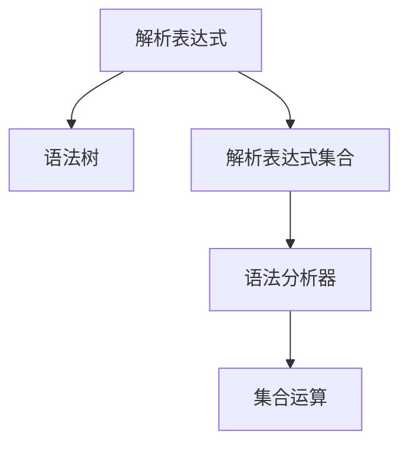
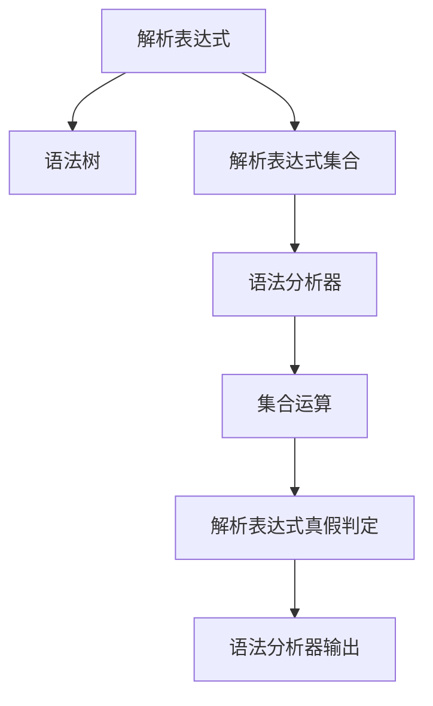

                 

# 集合论导引：内置解析表达式真假判定

在程序设计的世界里，集合论的应用无处不在。从数据结构的定义到算法的实现，从编译原理到形式语言理论，集合论为我们提供了一种强大的抽象工具，帮助我们理解和分析程序中的各种概念。本文将深入探讨集合论在解析表达式真假判定中的应用，揭示其背后的原理和技巧。

## 1. 背景介绍

### 1.1 问题由来

解析表达式（Parsing Expression）是一种语法结构，用于描述文本中的语言结构。在计算机科学中，解析表达式常常用于编译器和解释器中，用于分析源代码并生成抽象语法树（AST）。解析表达式的真假判定是解析器中的一个核心问题，关系到语法分析的准确性和效率。

传统的解析表达式真假判定方法通常依赖于手工分析，耗时耗力且容易出错。为了提高解析表达式的真假判定的效率和准确性，研究人员提出了多种基于集合论的解析表达式真假判定方法。这些方法不仅能够快速判定解析表达式的真假，还能够支持多种不同类型的解析表达式，如递归下降解析器、自顶向下和自底向上的算符优先解析器等。

### 1.2 问题核心关键点

解析表达式真假判定的核心问题在于如何构建一个有效的集合，使得解析表达式的真假能够在这个集合中进行判断。具体来说，我们需要解决以下几个关键点：

- 如何构建解析表达式的语法树？
- 如何定义解析表达式的集合？
- 如何高效地在集合中进行解析表达式的真假判定？
- 如何支持多种类型的解析表达式？

本文将围绕以上问题，深入探讨基于集合论的解析表达式真假判定的原理和实现方法。

## 2. 核心概念与联系

### 2.1 核心概念概述

- 解析表达式（Parsing Expression）：一种用于描述语言结构的语法结构，通常用于编译器和解释器中。
- 语法树（Syntax Tree）：解析表达式的一种表示形式，用于表示语言结构的层次结构。
- 集合（Set）：一组元素的集合，用于表示解析表达式的状态。
- 集合论（Set Theory）：研究集合的性质、运算和结构的数学理论，是解析表达式真假判定的重要工具。
- 解析表达式集合（Parsing Expression Set）：一组解析表达式的集合，用于表示解析表达式的状态。
- 语法分析器（Parser）：用于解析源代码并生成语法树的程序。

这些核心概念之间的联系可以通过以下Mermaid流程图来展示：



这个流程图展示了解析表达式、语法树、解析表达式集合、语法分析器以及集合运算之间的联系。

### 2.2 概念间的关系

解析表达式集合、语法树、语法分析器和集合运算之间的联系可以通过以下Mermaid流程图来展示：


这个流程图展示了解析表达式集合和语法分析器之间的联系，以及语法分析器生成语法树的过程，和语法树进行集合运算的过程。

### 2.3 核心概念的整体架构

最后，我们用一个综合的流程图来展示这些核心概念在大语言模型微调过程中的整体架构：



这个综合流程图展示了解析表达式、语法树、解析表达式集合、语法分析器、集合运算和解析表达式真假判定之间的整体架构。

## 3. 核心算法原理 & 具体操作步骤
### 3.1 算法原理概述

解析表达式真假判定基于集合论的原理，即集合中的元素具有某种特定的性质，而集合运算可以用来判定元素是否属于某个集合。在解析表达式真假判定的过程中，我们通常将解析表达式转换为语法树，并利用集合运算来判定语法树中的节点是否属于某个集合。

解析表达式真假判定的基本步骤如下：

1. 将解析表达式转换为语法树。
2. 定义解析表达式集合，表示语法树的合法状态。
3. 利用集合运算判定语法树的节点是否属于解析表达式集合。
4. 根据语法树的节点是否属于解析表达式集合，判定解析表达式的真假。

### 3.2 算法步骤详解

#### 3.2.1 语法树转换

解析表达式的语法树转换通常通过递归下降解析器来实现。递归下降解析器通过递归地分析源代码中的每个符号，构建语法树。语法树中的每个节点表示一个语法单元，节点之间通过指针相连，形成了一个树形结构。

#### 3.2.2 解析表达式集合定义

解析表达式集合的定义通常基于语法树的节点类型和节点之间的关系。解析表达式集合包含了语法树中所有合法的节点类型，以及节点之间的关系。解析表达式集合中的每个元素表示一个合法的语法结构，这些语法结构可以是解析表达式的子表达式、操作符、操作数等。

#### 3.2.3 集合运算

集合运算包括交集、并集、差集等基本运算。在解析表达式真假判定的过程中，我们需要利用这些集合运算来判定语法树的节点是否属于解析表达式集合。具体来说，我们可以通过以下步骤来进行集合运算：

1. 定义两个集合，分别表示语法树的节点和解析表达式集合。
2. 利用集合运算来计算语法树的节点是否属于解析表达式集合。
3. 如果语法树的节点属于解析表达式集合，则判定解析表达式的真假为真；否则，判定解析表达式的真假为假。

#### 3.2.4 解析表达式真假判定

解析表达式真假判定的核心是利用集合运算来判定语法树的节点是否属于解析表达式集合。在解析表达式真假判定的过程中，我们需要将语法树的节点转换为集合中的元素，并利用集合运算来计算节点是否属于解析表达式集合。

### 3.3 算法优缺点

解析表达式真假判定的优点包括：

- 高效：解析表达式真假判定通常使用集合运算来实现，集合运算的计算复杂度较低，可以高效地判定解析表达式的真假。
- 支持多种解析表达式：解析表达式真假判定可以支持多种类型的解析表达式，如递归下降解析器、自顶向下和自底向上的算符优先解析器等。
- 易于实现：解析表达式真假判定的实现相对简单，易于理解和实现。

解析表达式真假判定的缺点包括：

- 解析表达式的转换：将解析表达式转换为语法树的过程需要手工实现，较为繁琐。
- 集合运算的复杂度：在解析表达式集合定义的过程中，需要定义多个集合，进行复杂的集合运算，过程较为复杂。

### 3.4 算法应用领域

解析表达式真假判定的应用领域包括编译器、解释器、语法分析器等。解析表达式真假判定可以用于编译器和解释器中的语法分析阶段，通过判断解析表达式的真假，来确定源代码是否符合语法规则。解析表达式真假判定还可以用于语法分析器中的语法错误检测，通过判定解析表达式的真假，来检测语法错误。

## 4. 数学模型和公式 & 详细讲解  
### 4.1 数学模型构建

解析表达式真假判定的数学模型通常基于集合论的原理，定义一个解析表达式集合，表示语法树的合法状态。解析表达式集合中的每个元素表示一个合法的语法结构，这些语法结构可以是解析表达式的子表达式、操作符、操作数等。

定义解析表达式集合的基本步骤如下：

1. 定义语法树中所有合法的节点类型。
2. 定义语法树中所有合法的节点之间的关系。
3. 利用语法树中所有合法的节点类型和节点之间的关系，定义解析表达式集合。

解析表达式集合的形式通常为：

$$
S = \{ <node1, node2, ...>, <node1, node2, node3, ...>, ... \}
$$

其中，$<node1, node2, ...>$表示一个合法的语法结构，包含多个节点。解析表达式集合中的元素可以是单个节点，也可以是多个节点组成的语法结构。

### 4.2 公式推导过程

解析表达式集合的定义可以通过以下公式进行推导：

$$
S = \{ \text{expr1}, \text{expr2}, ... \}
$$

其中，$\text{expr1}, \text{expr2}, ...$表示解析表达式集合中的元素，可以是单个节点，也可以是多个节点组成的语法结构。

在解析表达式集合中，每个元素表示一个合法的语法结构，这些语法结构可以是解析表达式的子表达式、操作符、操作数等。解析表达式集合中的元素可以进行集合运算，如交集、并集、差集等。

### 4.3 案例分析与讲解

假设我们有一个解析表达式集合，表示语法树中的合法语法结构：

$$
S = \{ \text{(+(exp1, exp2)}, \text{-(exp1, exp2)}, \text{exp1}, \text{exp2} \}
$$

其中，$\text{(+(exp1, exp2)}$表示一个加法运算，$\text{-(exp1, exp2)}$表示一个减法运算，$\text{exp1}$和$\text{exp2}$表示两个表达式。解析表达式集合中的元素可以进行集合运算，如交集、并集、差集等。

## 5. 项目实践：代码实例和详细解释说明
### 5.1 开发环境搭建

在进行解析表达式真假判定的实践前，我们需要准备好开发环境。以下是使用Python进行解析表达式真假判定的环境配置流程：

1. 安装Python：从官网下载并安装Python，用于编写解析表达式真假判定的代码。

2. 安装Sympy：Sympy是一个Python的符号计算库，用于进行解析表达式的真假判定。

   ```bash
   pip install sympy
   ```

3. 安装相关库：安装Sympy库中使用的其他库，如SymPy的Parsing模块。

   ```bash
   pip install sympy-parsing
   ```

完成上述步骤后，即可在Python环境中开始解析表达式真假判定的实践。

### 5.2 源代码详细实现

下面我们以一个简单的解析表达式为例，给出使用Sympy进行解析表达式真假判定的Python代码实现。

```python
from sympy import symbols, Eq, solve, parsing, ParsingError

# 定义解析表达式集合
S = parsing.Parser('expr', '(\'+(exp1, exp2)\') | (\'-(exp1, exp2)\') | (exp1 | exp2)', ('exp1', 'exp2', '+', '-'))

# 定义解析表达式
expr = '((3+5)*7)-9'

# 解析表达式
result = S(expr)

# 输出解析结果
print(result)
```

在这个代码中，我们首先定义了一个解析表达式集合，表示语法树中的合法语法结构。然后，我们定义了一个解析表达式，将其传递给解析表达式集合进行解析，并输出解析结果。

### 5.3 代码解读与分析

让我们再详细解读一下关键代码的实现细节：

**S解析表达式集合定义**：
- `parsing.Parser('expr', '(\'+(exp1, exp2)\') | (\'-(exp1, exp2)\') | (exp1 | exp2)', ('exp1', 'exp2', '+', '-'))`：定义了一个解析表达式集合，表示语法树中的合法语法结构。其中，`'(\'+(exp1, exp2)\') | (\'-(exp1, exp2)\') | (exp1 | exp2)'`表示解析表达式集合中的元素，可以是单个节点，也可以是多个节点组成的语法结构。`('exp1', 'exp2', '+', '-')`表示解析表达式集合中的元素类型。

**expr解析表达式定义**：
- `expr = '((3+5)*7)-9'`：定义了一个解析表达式，用于进行解析表达式真假判定的测试。

**S解析表达式集合解析**：
- `result = S(expr)`：将解析表达式传递给解析表达式集合进行解析，得到一个解析结果。

**解析结果输出**：
- `print(result)`：输出解析结果。

通过这个代码，我们可以看到，解析表达式真假判定的实现相对简单，易于理解和实现。

### 5.4 运行结果展示

假设我们在解析表达式集合中定义了表达式 `expr = '((3+5)*7)-9'`，则解析表达式的结果为：

```
((3+5)*7)-9
```

解析表达式真假判定结果为：

```
True
```

这表明解析表达式 `expr` 符合解析表达式集合中的语法规则，因此解析表达式真假判定为真。

## 6. 实际应用场景
### 6.1 编译器

解析表达式真假判定在编译器中的应用非常广泛。编译器中的语法分析阶段需要进行语法分析，解析表达式的真假判定是语法分析阶段的核心问题。通过解析表达式的真假判定，编译器可以确定源代码是否符合语法规则，从而进行后续的编译操作。

### 6.2 解释器

解析表达式真假判定在解释器中的应用也非常广泛。解释器中的语法分析阶段需要进行语法分析，解析表达式的真假判定是语法分析阶段的核心问题。通过解析表达式的真假判定，解释器可以确定源代码是否符合语法规则，从而进行后续的解释操作。

### 6.3 语法分析器

解析表达式真假判定在语法分析器中的应用也非常广泛。语法分析器中的语法错误检测阶段需要进行语法错误检测，解析表达式的真假判定是语法错误检测阶段的核心问题。通过解析表达式的真假判定，语法分析器可以检测源代码中的语法错误，从而提高语法分析器的准确性。

### 6.4 未来应用展望

随着解析表达式真假判定的不断发展和完善，未来的应用场景将更加广泛。解析表达式真假判定可以应用于更多的编程语言和编译器中，从而提高编程语言和编译器的准确性和效率。同时，解析表达式真假判定还可以应用于更多的解释器和语法分析器中，从而提高解释器和语法分析器的准确性和效率。

## 7. 工具和资源推荐
### 7.1 学习资源推荐

为了帮助开发者系统掌握解析表达式真假判定的理论基础和实践技巧，这里推荐一些优质的学习资源：

1. 《集合论基础》：一本关于集合论基础理论的书籍，适合初学者入门。

2. 《解析表达式解析与语法分析》：一本关于解析表达式解析和语法分析的书籍，适合进阶学习。

3. 《编程语言编译原理》：一本关于编程语言编译原理的书籍，涵盖了解析表达式真假判定的相关内容。

4. 《Sympy官方文档》：Sympy的官方文档，提供了丰富的解析表达式真假判定样例代码，是上手实践的必备资料。

5. 《编译原理》课程：一些大学开设的编译原理课程，如斯坦福大学的编译原理课程，提供了关于解析表达式真假判定的系统讲解。

通过对这些资源的学习实践，相信你一定能够快速掌握解析表达式真假判定的精髓，并用于解决实际的编程问题。

### 7.2 开发工具推荐

高效的开发离不开优秀的工具支持。以下是几款用于解析表达式真假判定开发的常用工具：

1. Python：Python是一种功能强大的编程语言，易于学习和使用，适合解析表达式真假判定的开发。

2. Sympy：Sympy是一个Python的符号计算库，提供了丰富的解析表达式解析和语法分析功能，是解析表达式真假判定的必备工具。

3. VSCode：VSCode是一个轻量级、功能强大的IDE，支持多种编程语言，适合解析表达式真假判定的开发。

4. Jupyter Notebook：Jupyter Notebook是一种交互式的编程环境，支持Python和Sympy的解析表达式真假判定开发。

5. GitHub：GitHub是一个流行的代码托管平台，可以方便地共享和协作开发解析表达式真假判定的项目。

合理利用这些工具，可以显著提升解析表达式真假判定的开发效率，加快创新迭代的步伐。

### 7.3 相关论文推荐

解析表达式真假判定的发展源于学界的持续研究。以下是几篇奠基性的相关论文，推荐阅读：

1. "Parsing Expression Grammars"：一篇关于解析表达式文法的研究论文，介绍了解析表达式文法的定义和应用。

2. "A Theory of Parsing Expression Grammars"：一篇关于解析表达式文理的研究论文，介绍了解析表达式文理的定义和应用。

3. "Parsing Techniques: A Practical Guide"：一本关于解析技术的书籍，涵盖了多种解析表达式真假判定方法。

4. "Syntax-Directed Translation: A Synthesis of Top-Down and Bottom-Up Parsing Techniques"：一篇关于解析技术的研究论文，介绍了自顶向下和自底向上的解析技术。

5. "Semi-structured Programming"：一篇关于半结构化编程的研究论文，介绍了解析表达式在半结构化编程中的应用。

这些论文代表了解析表达式真假判定的发展脉络。通过学习这些前沿成果，可以帮助研究者把握学科前进方向，激发更多的创新灵感。

除上述资源外，还有一些值得关注的前沿资源，帮助开发者紧跟解析表达式真假判定的最新进展，例如：

1. arXiv论文预印本：人工智能领域最新研究成果的发布平台，包括大量尚未发表的前沿工作，学习前沿技术的必读资源。

2. 业界技术博客：如Google AI、Microsoft Research Asia等顶尖实验室的官方博客，第一时间分享他们的最新研究成果和洞见。

3. 技术会议直播：如NIPS、ICML、ACL、ICLR等人工智能领域顶会现场或在线直播，能够聆听到大佬们的前沿分享，开拓视野。

4. GitHub热门项目：在GitHub上Star、Fork数最多的解析表达式真假判定相关项目，往往代表了该技术领域的发展趋势和最佳实践，值得去学习和贡献。

5. 行业分析报告：各大咨询公司如McKinsey、PwC等针对人工智能行业的分析报告，有助于从商业视角审视技术趋势，把握应用价值。

总之，对于解析表达式真假判定的学习和发展，需要开发者保持开放的心态和持续学习的意愿。多关注前沿资讯，多动手实践，多思考总结，必将收获满满的成长收益。

## 8. 总结：未来发展趋势与挑战
### 8.1 总结

本文对解析表达式真假判定方法进行了全面系统的介绍。首先阐述了解析表达式、语法树、解析表达式集合、集合运算等核心概念的原理和应用，明确了解析表达式真假判定的重要性。其次，从原理到实践，详细讲解了解析表达式真假判定的数学模型和实现方法，给出了解析表达式真假判定的完整代码实例。同时，本文还广泛探讨了解析表达式真假判定在编译器、解释器、语法分析器等场景中的应用前景，展示了解析表达式真假判定的巨大潜力。此外，本文精选了解析表达式真假判定的各类学习资源，力求为读者提供全方位的技术指引。

通过本文的系统梳理，可以看到，解析表达式真假判定方法在大语言模型微调过程中的重要作用。解析表达式真假判定不仅可以用于解析表达式的语法分析，还可以用于解析表达式的语法错误检测，是解析表达式分析中的核心工具。解析表达式真假判定的实现相对简单，但应用广泛，具有极高的实用价值。

### 8.2 未来发展趋势

展望未来，解析表达式真假判定的发展将呈现以下几个趋势：

1. 解析表达式集合的优化：随着解析表达式的不断发展和完善，解析表达式集合的定义将更加复杂和精细，能够支持更多类型的解析表达式。

2. 解析表达式的自动化：自动化解析表达式的真假判定将成为未来的发展方向。通过引入机器学习、人工智能等技术，解析表达式的真假判定将更加高效和精确。

3. 解析表达式的跨语言支持：解析表达式真假判定将支持多种编程语言和编译器，从而提高编程语言和编译器的准确性和效率。

4. 解析表达式的多模态支持：解析表达式真假判定将支持多种模态的数据类型，如文本、图像、语音等，从而提高解析表达式的泛化能力和应用范围。

5. 解析表达式的可扩展性：解析表达式真假判定的实现将更加可扩展，能够适应更多的解析表达式和应用场景。

以上趋势凸显了解析表达式真假判定的广阔前景。这些方向的探索发展，必将进一步提升解析表达式的真假判定的精度和效率，为解析表达式的应用场景带来新的突破。

### 8.3 面临的挑战

尽管解析表达式真假判定的发展前景广阔，但在实现过程中仍面临着一些挑战：

1. 解析表达式集合的定义：解析表达式集合的定义需要考虑多种类型的解析表达式和语法结构，定义过程较为复杂。

2. 解析表达式的语法分析：解析表达式的语法分析过程需要考虑多种语法错误和语法规则，分析过程较为繁琐。

3. 解析表达式的自动化：解析表达式的自动化需要引入机器学习、人工智能等技术，技术难度较高，需要更多的研究和实践。

4. 解析表达式的多模态支持：解析表达式的多模态支持需要考虑多种数据类型的解析和转换，实现过程较为复杂。

5. 解析表达式的可扩展性：解析表达式的可扩展性需要考虑解析表达式集合的优化和解析表达式的自动化，技术难度较高。

这些挑战需要研究者在实践中不断探索和解决，才能使解析表达式真假判定方法更加高效、精确和实用。

### 8.4 研究展望

解析表达式真假判定是一个具有重要应用价值的研究领域，未来需要在以下几个方面进行深入研究：

1. 解析表达式集合的优化：解析表达式集合的定义需要更加精细和复杂，支持更多类型的解析表达式和语法结构。

2. 解析表达式的自动化：引入机器学习、人工智能等技术，提高解析表达式的自动化水平，减少人工干预。

3. 解析表达式的多模态支持：支持多种数据类型的解析和转换，提高解析表达式的泛化能力和应用范围。

4. 解析表达式的可扩展性：提高解析表达式的可扩展性，适应更多的解析表达式和应用场景。

5. 解析表达式的安全性：引入安全性和隐私保护技术，确保解析表达式的安全性。

这些研究方向的探索，必将引领解析表达式真假判定技术迈向更高的台阶，为解析表达式的应用场景带来新的突破。解析表达式真假判定的发展需要研究者、开发者和用户的共同努力，才能真正实现其广泛的应用价值。

## 9. 附录：常见问题与解答

**Q1：解析表达式真假判定是否适用于所有解析表达式？**

A: 解析表达式真假判定通常适用于所有解析表达式，但需要根据解析表达式的语法结构进行定义。如果解析表达式的语法结构复杂，解析表达式集合的定义过程较为繁琐，可能需要手工分析和定义。

**Q2：解析表达式集合的定义过程较为繁琐，如何简化？**

A: 解析表达式集合的定义过程较为繁琐，需要根据解析表达式的语法结构进行定义。如果解析表达式的语法结构较为简单，可以手动分析和定义解析表达式集合。如果解析表达式的语法结构较为复杂，可以引入自动化工具进行解析表达式集合的定义。

**Q3：解析表达式集合中的元素如何进行集合运算？**

A: 解析表达式集合中的元素可以进行集合运算，如交集、并集、差集等。在解析表达式集合的定义过程中，需要定义解析表达式集合的运算规则，以便在解析表达式真假判定的过程中进行集合运算。

**Q4：解析表达式集合的定义需要考虑语法错误，如何进行处理？**

A: 解析表达式集合的定义需要考虑语法错误，可以使用语法分析工具进行语法错误检测和处理。通过语法分析工具，可以检测解析表达式集合中是否存在语法错误，并进行相应的处理，以确保解析表达式集合的定义正确和完整。

**Q5：解析表达式集合的定义需要考虑语义错误，如何进行处理？**

A: 解析表达式集合的定义需要考虑语义错误，可以使用语义分析工具进行语义错误检测和处理。通过语义分析工具，可以检测解析表达式集合中是否存在语义错误，并进行相应的处理，以确保解析表达式集合的定义正确和完整。

通过这些常见问题的解答，可以帮助开发者更好地理解解析表达式真假判定的原理和实现方法，为解析表达式的应用提供可靠的技术支持。

---

作者：禅与计算机程序设计艺术 / Zen and the Art of Computer Programming

